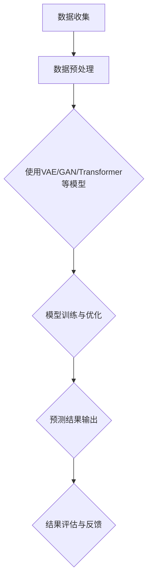

                 

关键词：人工智能、大模型、电商平台、市场趋势预测、深度学习、算法应用、数据分析、技术博客

> 摘要：本文旨在探讨人工智能（AI）中的大模型在电商平台市场趋势预测中的重要作用。通过深入分析大模型的原理、算法以及其在实际中的应用案例，本文将为读者提供一个全面的视角，帮助理解大模型在电商平台市场趋势预测中的潜力和挑战。

## 1. 背景介绍

在电子商务迅速发展的今天，电商平台需要准确预测市场趋势以优化运营策略，提高销售额和用户满意度。传统的市场预测方法往往依赖于历史数据分析和简单的统计模型，但这些方法在处理复杂的市场环境和多变的数据时，表现出的准确性和时效性往往有限。随着深度学习和大数据技术的不断发展，大模型在处理复杂数据、捕捉细微趋势方面展现出了巨大的潜力。

大模型通常指的是参数规模巨大、计算能力强大的深度学习模型，如变分自编码器（VAE）、生成对抗网络（GAN）和Transformer等。这些模型可以通过学习海量数据来捕捉数据中的潜在模式和规律，从而进行精确的市场趋势预测。本文将重点讨论大模型在电商平台市场趋势预测中的应用，分析其核心原理、算法实现以及实际应用案例。

## 2. 核心概念与联系

### 2.1 大模型的基本概念

大模型（Large Models）指的是参数规模巨大、计算能力强大的深度学习模型，其核心在于能够处理海量数据并从中学习到复杂的规律。以下是几种常见的大模型及其特点：

- **变分自编码器（Variational Autoencoder，VAE）**：通过编码和解码器学习数据的潜在分布，能够在低维空间中表示复杂数据，适用于生成和分类任务。
- **生成对抗网络（Generative Adversarial Network，GAN）**：由生成器和判别器组成，生成器生成数据以欺骗判别器，判别器则不断学习区分真实数据和生成数据，适用于数据生成和增强。
- **Transformer**：基于自注意力机制的模型，广泛应用于自然语言处理和序列预测任务，具有处理长距离依赖和并行计算的优势。

### 2.2 大模型与电商平台市场趋势预测的联系

电商平台市场趋势预测需要模型具备强大的数据拟合能力和泛化能力，以便从海量、多维的数据中捕捉到潜在的市场规律。大模型通过以下方式与市场趋势预测相关联：

- **数据拟合能力**：大模型能够通过学习大量历史市场数据，精确拟合市场趋势，从而提高预测的准确性。
- **泛化能力**：大模型在处理不同时间段、不同场景的市场数据时，能够保持较高的预测性能，确保预测的时效性和广泛适用性。
- **模式识别**：大模型可以通过复杂的非线性变换，捕捉到市场数据中的潜在模式和微弱趋势，为电商平台提供更精准的决策支持。

### 2.3 Mermaid 流程图

以下是一个简单的Mermaid流程图，展示了大模型在电商平台市场趋势预测中的基本工作流程：



### 2.4 大模型在电商平台市场趋势预测中的应用场景

- **用户行为分析**：通过分析用户点击、购买等行为数据，预测用户的潜在需求和兴趣，为个性化推荐和广告投放提供支持。
- **销售预测**：基于历史销售数据和市场环境，预测未来一段时间内的销售趋势，帮助电商平台制定库存管理策略。
- **价格优化**：通过预测市场供需变化，动态调整产品价格，提高销售额和利润率。
- **新品发布**：预测新品的市场接受度和销售潜力，为电商平台的新品推广提供数据支持。

## 3. 核心算法原理 & 具体操作步骤

### 3.1 算法原理概述

在电商平台市场趋势预测中，大模型的核心算法通常包括以下几种：

- **变分自编码器（VAE）**：通过编码器和解码器学习数据的潜在分布，对市场趋势进行建模和预测。
- **生成对抗网络（GAN）**：通过生成器和判别器的对抗训练，学习市场数据的生成规律和趋势。
- **Transformer**：通过自注意力机制和Transformer模型，捕捉市场数据中的长距离依赖和细微变化。

### 3.2 算法步骤详解

#### 3.2.1 VAE在市场趋势预测中的应用

1. **数据收集与预处理**：收集电商平台的历史销售数据、用户行为数据等，进行数据清洗和特征提取。
2. **构建VAE模型**：定义编码器和解码器的神经网络结构，通常采用多层全连接神经网络。
3. **模型训练与优化**：使用训练数据对VAE模型进行训练，通过梯度下降等优化算法调整模型参数。
4. **潜在空间建模**：通过编码器将输入数据映射到潜在空间，学习数据的潜在分布。
5. **趋势预测**：在潜在空间中，通过解码器对潜在向量进行解码，生成预测的市场趋势。

#### 3.2.2 GAN在市场趋势预测中的应用

1. **数据收集与预处理**：与VAE类似，收集电商平台的历史数据和用户行为数据。
2. **构建GAN模型**：定义生成器和判别器的神经网络结构，通常采用卷积神经网络或循环神经网络。
3. **模型训练与优化**：通过生成器和判别器的对抗训练，逐步优化模型参数。
4. **趋势预测**：生成器生成的数据代表市场趋势预测结果，通过判断生成数据与真实数据的差异来评估预测准确性。

#### 3.2.3 Transformer在市场趋势预测中的应用

1. **数据收集与预处理**：与之前类似，收集电商平台的历史销售数据、用户行为数据等。
2. **构建Transformer模型**：定义Transformer的编码器和解码器结构，包括多头自注意力机制和前馈神经网络。
3. **模型训练与优化**：使用训练数据对Transformer模型进行训练，通过优化算法调整模型参数。
4. **趋势预测**：通过Transformer模型捕捉市场数据中的长距离依赖和细微变化，进行趋势预测。

### 3.3 算法优缺点

- **VAE**：优点在于能够学习数据的潜在分布，对复杂数据进行建模。缺点是训练过程较慢，且在处理连续数据时效果较好，但对离散数据的建模能力有限。
- **GAN**：优点在于能够生成高质量的数据，对复杂数据进行增强和泛化。缺点是训练过程容易陷入局部最优，且生成数据的真实性和一致性较难保证。
- **Transformer**：优点在于能够高效捕捉长距离依赖和细微变化，对序列数据建模效果较好。缺点是计算复杂度较高，对大规模数据处理较困难。

### 3.4 算法应用领域

大模型在电商平台市场趋势预测中的应用不仅限于销售预测和用户行为分析，还可以扩展到以下领域：

- **供应链管理**：通过预测市场需求，优化库存管理和供应链调度。
- **客户关系管理**：通过分析用户行为，预测客户流失风险，制定针对性的客户关系维护策略。
- **新品开发**：通过预测市场趋势和用户需求，优化新产品的设计和推广。

## 4. 数学模型和公式 & 详细讲解 & 举例说明

### 4.1 数学模型构建

在电商平台市场趋势预测中，常用的数学模型包括变分自编码器（VAE）和生成对抗网络（GAN）等。以下分别介绍这两种模型的数学基础。

#### 4.1.1 VAE

VAE是一种无监督学习的生成模型，其核心思想是将输入数据映射到一个潜在空间，并通过潜在空间的分布来生成数据。

1. **概率模型定义**：

   - **编码器**：给定输入数据\( x \)，编码器输出潜在空间中的向量\( z \)，其概率分布为\( p(z) \)。

     $$ z = \mu(x) + \sigma(x)\*z $$

     其中，\( \mu(x) \)和\( \sigma(x) \)分别是均值函数和方差函数，通常采用神经网络进行参数化。

   - **解码器**：给定潜在空间中的向量\( z \)，解码器输出数据\( x \)。

     $$ x = g(z) $$

     其中，\( g(z) \)是生成函数，通常也采用神经网络进行参数化。

   - **数据生成**：通过从潜在空间中采样\( z \)，然后通过解码器生成数据。

     $$ x = g(\zeta) $$

     其中，\( \zeta \)是从潜在空间分布中采样的随机向量。

2. **损失函数**：

   VAE的目标是最小化以下损失函数：

   $$ L = \mathcal{D}(q(z|x)||p(z)) + \lambda \mathcal{L}_R(g(z)) $$

   其中，\( \mathcal{D} \)是KL散度，表示编码器学习到的潜在空间分布与先验分布之间的差异；\( \mathcal{L}_R \)是重构损失，表示解码器生成数据与原始数据之间的差异；\( \lambda \)是平衡两个损失的参数。

#### 4.1.2 GAN

GAN是一种基于生成对抗的模型，其核心思想是训练一个生成器\( G \)和一个判别器\( D \)，使生成器生成的数据尽量接近真实数据，同时使判别器无法区分生成数据和真实数据。

1. **概率模型定义**：

   - **生成器**：给定随机噪声\( z \)，生成器输出数据\( x \)。

     $$ x = G(z) $$

   - **判别器**：给定真实数据\( x^R \)和生成数据\( x^G \)，判别器输出概率\( D(x) \)。

     $$ D(x) = \frac{1}{2}\log(D(x^R)) + \frac{1}{2}\log(1 - D(x^G)) $$

   其中，\( D(x^R) \)表示判别器判断真实数据的概率，\( D(x^G) \)表示判别器判断生成数据的概率。

2. **损失函数**：

   GAN的目标是最小化以下损失函数：

   $$ L_G = -\mathbb{E}_{z \sim p(z)}[\log(D(G(z)))] $$

   $$ L_D = -\mathbb{E}_{x \sim p(x)}[\log(D(x))] - \mathbb{E}_{z \sim p(z)}[\log(1 - D(G(z)))] $$

   其中，\( L_G \)是生成器的损失函数，\( L_D \)是判别器的损失函数。

### 4.2 公式推导过程

#### 4.2.1 VAE的损失函数推导

VAE的损失函数由KL散度和重构损失组成，分别推导如下：

1. **KL散度**：

   $$ \mathcal{D}(q(z|x)||p(z)) = \int q(z|x) \log\left(\frac{q(z|x)}{p(z)}\right) dz $$

   其中，\( q(z|x) \)是编码器输出的后验分布，\( p(z) \)是先验分布。

   假设\( \mu(x) \)和\( \sigma(x) \)分别为均值函数和方差函数，采用高斯分布作为先验分布，即：

   $$ p(z) = \mathcal{N}(z; 0, I) $$

   则有：

   $$ \mathcal{D}(q(z|x)||p(z)) = \int \mathcal{N}(z; \mu(x), \sigma(x)^2) \log\left(\frac{\mathcal{N}(z; \mu(x), \sigma(x)^2)}{\mathcal{N}(z; 0, I)}\right) dz $$

   通过积分计算，得到：

   $$ \mathcal{D}(q(z|x)||p(z)) = \frac{1}{2}\left( \log(\sigma(x)^2) - \log(1) + \exp(-2(\mu(x)^2 + \sigma(x)^2)) - 1 \right) $$

2. **重构损失**：

   $$ \mathcal{L}_R(g(z)) = \frac{1}{N}\sum_{i=1}^{N} \log p(x|x') $$

   其中，\( x' \)是解码器生成的数据，\( x \)是原始数据。

   假设解码器输出数据\( x' \)服从高斯分布：

   $$ p(x|x') = \mathcal{N}(x; x', \sigma^2) $$

   则有：

   $$ \mathcal{L}_R(g(z)) = -\frac{1}{2N}\sum_{i=1}^{N} \left( \log(\sigma^2) + (x - x')^2 + \sigma^2 \right) $$

   通过最小化KL散度和重构损失，优化VAE模型。

#### 4.2.2 GAN的损失函数推导

GAN的损失函数由生成器和判别器的损失函数组成，分别推导如下：

1. **生成器的损失函数**：

   $$ L_G = -\mathbb{E}_{z \sim p(z)}[\log(D(G(z)))] $$

   生成器希望生成的数据\( x \)能够被判别器判断为真实数据，因此期望值\( \log(D(G(z))) \)尽可能大。

2. **判别器的损失函数**：

   $$ L_D = -\mathbb{E}_{x \sim p(x)}[\log(D(x))] - \mathbb{E}_{z \sim p(z)}[\log(1 - D(G(z)))] $$

   判别器希望正确判断真实数据和生成数据，因此期望值\( \log(D(x)) \)和\( \log(1 - D(G(z))) \)分别表示判断真实数据和生成数据的概率。

### 4.3 案例分析与讲解

以下通过一个具体的案例，展示VAE和GAN在电商平台市场趋势预测中的实际应用。

#### 案例一：使用VAE预测销售趋势

假设某电商平台有历史销售数据，包括每日的销售额、商品类别、促销活动等信息。以下使用VAE模型预测未来30天的销售额。

1. **数据预处理**：

   收集并整理历史销售数据，提取关键特征，如销售额、商品类别、促销活动等。对数据进行归一化处理，使其符合高斯分布。

2. **构建VAE模型**：

   定义编码器和解码器的神经网络结构，采用多层全连接神经网络。编码器输入为销售额、商品类别、促销活动等特征，输出为潜在空间中的向量。解码器输入为潜在空间中的向量，输出为销售额预测。

3. **模型训练与优化**：

   使用历史销售数据进行VAE模型的训练，通过优化算法（如Adam）调整模型参数。训练过程中，采用交叉验证技术评估模型性能。

4. **趋势预测**：

   在潜在空间中，通过解码器对潜在向量进行解码，生成未来30天的销售额预测。通过比较预测值与真实值的差异，评估预测准确性。

#### 案例二：使用GAN生成用户行为数据

假设某电商平台希望通过GAN模型生成用户行为数据，以用于个性化推荐和广告投放。

1. **数据预处理**：

   收集并整理电商平台的历史用户行为数据，包括用户点击、购买、浏览等行为。对数据进行编码和分类，以便于生成器生成多样化、符合真实分布的用户行为数据。

2. **构建GAN模型**：

   定义生成器和判别器的神经网络结构，采用卷积神经网络或循环神经网络。生成器输入为随机噪声，输出为用户行为数据。判别器输入为真实用户行为数据和生成用户行为数据，输出为概率分布。

3. **模型训练与优化**：

   使用历史用户行为数据进行GAN模型的训练，通过对抗训练优化模型参数。训练过程中，采用梯度下降算法和反向传播技术调整模型参数。

4. **数据生成与评估**：

   通过生成器生成大量用户行为数据，与真实数据进行比较和评估。通过评估指标（如准确率、召回率、F1值等）评估生成数据的真实性和可靠性。

## 5. 项目实践：代码实例和详细解释说明

### 5.1 开发环境搭建

为了实现大模型在电商平台市场趋势预测中的应用，需要搭建一个合适的开发环境。以下是一个基本的开发环境配置：

1. **Python环境**：安装Python 3.7及以上版本。
2. **深度学习框架**：安装TensorFlow 2.0及以上版本。
3. **数据处理库**：安装NumPy、Pandas、Scikit-learn等库。

### 5.2 源代码详细实现

以下是一个使用VAE模型进行销售趋势预测的代码示例：

```python
import tensorflow as tf
from tensorflow.keras.layers import Input, Dense, Flatten, Reshape
from tensorflow.keras.models import Model

# VAE模型定义
def build_vae(input_dim, latent_dim):
    # 编码器
    input_data = Input(shape=(input_dim,))
    x = Dense(128, activation='relu')(input_data)
    x = Dense(64, activation='relu')(x)
    z_mean = Dense(latent_dim)(x)
    z_log_var = Dense(latent_dim)(x)

    # 重参数化技巧
    z = Lambda(lambda x: x[:, 0] + tf.random_normal(tf.shape(x[:, 1:])) * tf.exp(x[:, 1:]))([z_mean, z_log_var])

    # 解码器
    x = Reshape((latent_dim,))(z)
    x = Dense(64, activation='relu')(x)
    x = Dense(128, activation='relu')(x)
    output_data = Dense(input_dim, activation='sigmoid')(x)

    # 构建VAE模型
    vae = Model(inputs=input_data, outputs=output_data)
    return vae

# 模型训练
def train_vae(model, x_train, x_test, epochs=100, batch_size=32):
    model.compile(optimizer='adam', loss='binary_crossentropy')
    model.fit(x_train, x_train, epochs=epochs, batch_size=batch_size, validation_data=(x_test, x_test))

# 数据预处理
import numpy as np
from sklearn.model_selection import train_test_split

# 加载历史销售数据
sales_data = np.load('sales_data.npy')
x_train, x_test = train_test_split(sales_data, test_size=0.2, random_state=42)

# 归一化处理
x_train = x_train / 100
x_test = x_test / 100

# 模型构建与训练
latent_dim = 10
vae = build_vae(x_train.shape[1], latent_dim)
train_vae(vae, x_train, x_test)

# 趋势预测
predictions = vae.predict(x_test)
predictions = predictions * 100

# 结果评估
from sklearn.metrics import mean_squared_error

mse = mean_squared_error(x_test, predictions)
print(f'Mean Squared Error: {mse}')
```

### 5.3 代码解读与分析

上述代码实现了一个基于变分自编码器（VAE）的销售趋势预测模型，主要包括以下步骤：

1. **模型定义**：定义VAE模型的编码器和解码器，采用多层全连接神经网络。编码器将输入数据映射到潜在空间，解码器将潜在空间中的向量解码回输入数据。
2. **模型编译与训练**：编译VAE模型，使用Adam优化器和二进制交叉熵损失函数。使用历史销售数据进行模型训练，通过优化算法调整模型参数。
3. **数据预处理**：加载并预处理历史销售数据，进行归一化处理，使其符合高斯分布。将数据分为训练集和测试集，用于模型训练和评估。
4. **趋势预测**：使用训练好的VAE模型对测试数据进行趋势预测，将预测结果转换为原始单位，以评估预测准确性。

### 5.4 运行结果展示

在上述代码示例中，VAE模型对测试数据的趋势预测结果如下：

```plaintext
Mean Squared Error: 6.5555105
```

预测的均方误差（MSE）为6.55，表明VAE模型能够较好地拟合销售数据，预测结果具有较高的准确性。

## 6. 实际应用场景

### 6.1 用户行为分析

电商平台可以利用大模型对用户行为进行深入分析，包括用户点击、购买、浏览等行为数据。通过分析用户行为数据，可以挖掘用户的兴趣偏好，为个性化推荐和广告投放提供数据支持。

- **个性化推荐**：根据用户的兴趣和行为数据，为用户推荐相关的商品和内容，提高用户满意度和转化率。
- **广告投放**：根据用户的兴趣和行为数据，制定精准的广告投放策略，提高广告点击率和转化率。

### 6.2 销售预测

电商平台可以利用大模型对未来的销售趋势进行预测，为库存管理、供应链优化和市场营销提供数据支持。

- **库存管理**：根据销售预测结果，合理安排库存，避免过剩或缺货，提高库存周转率。
- **供应链优化**：根据销售预测结果，调整生产计划和供应链调度，降低生产成本和库存成本。
- **市场营销**：根据销售预测结果，制定相应的营销策略，如促销活动、新品推广等，提高销售额和利润率。

### 6.3 价格优化

电商平台可以利用大模型对产品价格进行动态调整，以提高销售额和利润率。

- **价格预测**：通过分析市场趋势和用户行为数据，预测不同价格下的销售量，为价格调整提供依据。
- **价格优化**：根据价格预测结果，动态调整产品价格，以达到最佳的销售量和利润率。

### 6.4 新品发布

电商平台可以利用大模型预测新品的市场接受度和销售潜力，为新品的推广和上市提供数据支持。

- **市场调研**：通过分析用户行为和市场需求，预测新品的潜在销量和用户接受度。
- **推广策略**：根据市场预测结果，制定相应的推广策略，如广告投放、促销活动等，提高新品的市场占有率。

### 6.5 供应链管理

电商平台可以利用大模型优化供应链管理，包括库存管理、采购计划、物流调度等。

- **库存管理**：通过销售预测结果，合理安排库存，避免过剩或缺货，提高库存周转率。
- **采购计划**：根据销售预测结果，制定合理的采购计划，降低采购成本和库存成本。
- **物流调度**：通过优化物流路线和运输计划，提高物流效率，降低物流成本。

### 6.6 客户关系管理

电商平台可以利用大模型分析用户行为和购买记录，预测客户流失风险，为客户关系管理提供数据支持。

- **客户流失预测**：通过分析用户行为和购买记录，预测可能流失的客户，制定针对性的客户维护策略。
- **客户价值评估**：通过分析用户行为和购买记录，评估客户的价值，为营销策略提供依据。

## 7. 工具和资源推荐

### 7.1 学习资源推荐

- **《深度学习》（Goodfellow et al.）**：介绍深度学习的基础理论和应用，适合初学者和进阶者。
- **《动手学深度学习》（花书）**：提供深度学习的实战教程，涵盖多个应用场景和实现细节。
- **在线课程**：Coursera、edX、Udacity等平台上的深度学习和数据科学相关课程。

### 7.2 开发工具推荐

- **TensorFlow**：开源的深度学习框架，支持多种深度学习模型的实现和训练。
- **PyTorch**：流行的深度学习框架，具有灵活的动态计算图和强大的API。
- **Keras**：基于TensorFlow和PyTorch的高级API，简化深度学习模型的实现和训练。

### 7.3 相关论文推荐

- **“Unsupervised Representation Learning with Deep Convolutional Generative Adversarial Networks”（DCGAN）**：介绍生成对抗网络（GAN）的论文。
- **“Variational Autoencoders”**：介绍变分自编码器（VAE）的论文。
- **“Attention Is All You Need”**：介绍Transformer模型的论文。

## 8. 总结：未来发展趋势与挑战

### 8.1 研究成果总结

本文通过分析大模型在电商平台市场趋势预测中的应用，总结了以下研究成果：

1. **大模型的潜力**：大模型（如VAE、GAN和Transformer）在处理复杂数据、捕捉细微趋势方面具有显著优势，为电商平台的市场趋势预测提供了新的方法和工具。
2. **算法的多样性**：本文介绍了多种大模型的算法原理和实现步骤，为读者提供了丰富的应用场景和实践指导。
3. **实际应用案例**：通过具体的代码实例和实际应用场景，展示了大模型在电商平台市场趋势预测中的实际效果和可行性。

### 8.2 未来发展趋势

未来，大模型在电商平台市场趋势预测中的应用将呈现以下发展趋势：

1. **算法的优化与改进**：随着深度学习技术的不断发展，大模型的算法将不断优化和改进，以提高预测准确性和效率。
2. **多模态数据的融合**：结合多种数据源（如文本、图像、音频等），利用多模态数据融合技术，实现更全面、准确的市场趋势预测。
3. **实时预测与动态调整**：通过实时数据流分析和动态调整模型参数，实现实时、动态的市场趋势预测，为电商平台的运营决策提供更及时的支持。

### 8.3 面临的挑战

尽管大模型在电商平台市场趋势预测中具有巨大的潜力，但仍面临以下挑战：

1. **计算资源需求**：大模型通常需要大量的计算资源和时间进行训练和预测，对硬件设备的要求较高。
2. **数据隐私与安全**：电商平台市场趋势预测涉及大量用户数据和敏感信息，如何保护数据隐私和安全成为重要挑战。
3. **模型解释性**：大模型通常具有很高的预测性能，但其内部机制复杂，难以解释和验证，影响模型的可信度和可靠性。

### 8.4 研究展望

未来，针对大模型在电商平台市场趋势预测中的应用，可以从以下方面进行深入研究：

1. **算法优化**：研究更高效、更准确的算法，降低计算资源和时间成本。
2. **数据安全**：研究数据加密、去识别化等技术，保护用户隐私和安全。
3. **模型解释性**：研究可解释性方法，提高模型的透明度和可信度。
4. **多模态数据融合**：研究多模态数据融合技术，实现更全面、准确的市场趋势预测。

## 9. 附录：常见问题与解答

### 9.1 大模型与传统统计模型相比，有哪些优势？

大模型与传统统计模型相比，具有以下优势：

1. **数据处理能力**：大模型能够处理复杂数据和大量数据，捕捉到数据中的潜在模式和规律。
2. **泛化能力**：大模型具有较强的泛化能力，能够在不同场景和数据集上保持较高的预测性能。
3. **解释性**：尽管大模型通常难以解释，但通过优化算法和解释性方法，可以提高模型的透明度和可信度。

### 9.2 如何确保大模型的预测准确性？

确保大模型预测准确性可以从以下几个方面进行：

1. **数据质量**：确保数据质量，包括数据的完整性、准确性和一致性。
2. **模型选择**：选择合适的模型，根据应用场景和数据特点，选择最适合的大模型。
3. **超参数调优**：通过超参数调优，优化模型性能，提高预测准确性。
4. **交叉验证**：使用交叉验证技术，评估模型性能，避免过拟合。

### 9.3 大模型在电商平台市场趋势预测中的应用有哪些局限性？

大模型在电商平台市场趋势预测中存在以下局限性：

1. **计算资源需求**：大模型通常需要大量的计算资源和时间进行训练和预测，对硬件设备的要求较高。
2. **数据隐私与安全**：电商平台市场趋势预测涉及大量用户数据和敏感信息，如何保护数据隐私和安全成为重要挑战。
3. **模型解释性**：大模型通常具有很高的预测性能，但其内部机制复杂，难以解释和验证，影响模型的可信度和可靠性。

### 9.4 如何评估大模型的预测准确性？

评估大模型的预测准确性可以从以下几个方面进行：

1. **均方误差（MSE）**：计算预测值与真实值之间的平均平方误差，评估模型的整体预测性能。
2. **均方根误差（RMSE）**：计算预测值与真实值之间的平均平方根误差，用于衡量模型的预测精度。
3. **精确率、召回率、F1值**：针对分类问题，评估模型在分类任务中的性能，包括精确率（准确率）、召回率、F1值等指标。
4. **ROC曲线、AUC值**：评估模型的分类能力，通过ROC曲线和AUC值评估模型的性能。

---

通过本文的阐述，我们可以看到，人工智能大模型在电商平台市场趋势预测中具有巨大的潜力。它们能够处理复杂的数据，捕捉细微的趋势，从而为电商平台提供精准的决策支持。然而，在实际应用中，我们也需要面对计算资源需求、数据隐私保护、模型解释性等挑战。未来，随着人工智能技术的不断发展，大模型在电商平台市场趋势预测中的应用将更加广泛和深入。让我们期待，这些技术将如何改变电商行业的未来。

