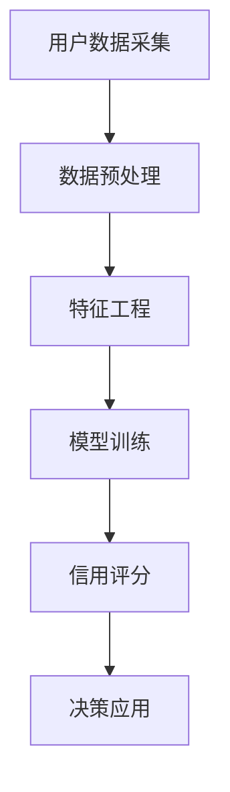

                 

## 摘要

随着电子商务的迅猛发展，用户信用评估已成为电商平台至关重要的一环。传统的信用评估方法往往依赖于历史数据和简单规则，存在明显的局限性。而近年来，人工智能特别是大模型（如深度学习模型）的飞速发展，为用户信用评估带来了全新的可能。本文旨在探讨AI大模型在电商平台用户信用评估中的应用，分析其核心算法原理、数学模型、实践案例以及未来的发展趋势和挑战。通过深入分析，我们期望为电商平台提供更精准、高效的信用评估方案，助力业务发展。

## 1. 背景介绍

### 1.1 电商平台发展现状

随着互联网技术的不断进步，电子商务已经渗透到我们生活的方方面面。据统计，全球电子商务市场规模在2022年已突破4万亿美元，预计到2025年将超过6万亿美元。电商平台的多样性和用户数量的快速增长，使得平台面临着巨大的挑战，其中包括如何准确评估用户的信用状况，从而降低风险、提高交易成功率。

### 1.2 用户信用评估的重要性

用户信用评估是电商平台风险管理的重要一环。一个健全的信用评估体系可以帮助平台：

1. **降低欺诈风险**：通过评估用户的信用状况，可以有效识别和防范欺诈行为，保护商家和消费者的权益。
2. **提升用户体验**：精准的信用评估可以帮助平台为用户提供更优质的服务，例如快速放款、优先处理订单等。
3. **增加交易成功率**：合理的信用评估可以降低交易门槛，增加交易的成功率，从而提升平台的整体交易量。

### 1.3 传统信用评估方法的局限性

尽管用户信用评估在电商平台中具有重要意义，但传统的信用评估方法存在明显的局限性：

1. **依赖历史数据**：传统方法主要依赖于用户的历史交易数据，如支付历史、退货率等，但这些数据并不能完全反映用户的真实信用状况。
2. **简单规则判断**：传统方法通常采用一些简单的规则来进行信用评估，例如固定评分标准、预设信用阈值等，这种方法过于简单，无法适应复杂多变的实际场景。
3. **无法应对新问题**：随着电商行业的发展，一些新的问题如社交网络欺诈、虚假评论等，传统方法难以有效应对。

## 2. 核心概念与联系

### 2.1 信用评估的核心概念

在用户信用评估中，一些核心概念如下：

1. **信用评分**：信用评分是对用户信用风险进行量化的一种方式，通常采用分数或等级的形式表示。
2. **信用风险**：信用风险是指用户在未来交易中可能产生的违约、欺诈等不良行为。
3. **信用评分模型**：信用评分模型是用于计算用户信用评分的算法或方法。

### 2.2 人工智能与信用评估的联系

人工智能，特别是大模型（如深度学习模型），为信用评估带来了新的可能性。其核心联系在于：

1. **大数据处理**：人工智能可以通过分析海量的用户数据，提取出有效的信用评估特征。
2. **自适应学习能力**：人工智能模型可以根据不断更新的用户行为数据，自动调整和优化信用评分模型。
3. **复杂模式识别**：人工智能可以识别传统方法难以发现的风险特征，从而提高信用评估的准确性。

### 2.3 信用评估架构的Mermaid流程图



在这个流程图中，用户数据采集是整个信用评估过程的起点，经过数据预处理、特征工程后，进入模型训练阶段。训练好的模型用于计算用户的信用评分，并根据评分结果进行决策应用，如放款决策、交易处理等。

## 3. 核心算法原理 & 具体操作步骤

### 3.1 算法原理概述

在用户信用评估中，深度学习模型是一种重要的方法。其基本原理是通过多层神经网络对用户数据进行自动特征提取和风险预测。以下是深度学习模型在信用评估中的基本原理：

1. **输入层**：输入层接收用户数据，如交易记录、用户行为等。
2. **隐藏层**：隐藏层对输入数据进行特征提取和变换，每层都可以提取更高层次的特征。
3. **输出层**：输出层产生最终的信用评分或风险预测结果。

### 3.2 算法步骤详解

1. **数据收集**：收集用户的交易数据、行为数据、社会关系数据等，构建完整的用户画像。
2. **数据预处理**：对收集到的数据进行分析和清洗，去除噪声和异常值，并标准化处理。
3. **特征工程**：根据业务需求，提取有用的特征，如用户交易金额、交易频率、评价评分等。
4. **模型构建**：构建深度学习模型，如卷积神经网络（CNN）、循环神经网络（RNN）或变换器（Transformer）等。
5. **模型训练**：使用训练集对模型进行训练，通过反向传播算法不断调整模型参数。
6. **模型评估**：使用验证集对模型进行评估，根据评估结果调整模型结构和参数。
7. **模型应用**：将训练好的模型应用于实际场景，如用户信用评分、风险预测等。

### 3.3 算法优缺点

**优点**：

1. **高效的特征提取**：深度学习模型可以通过多层神经网络自动提取用户数据的复杂特征，提高了信用评估的准确性。
2. **自适应学习能力**：深度学习模型可以根据新的用户数据自动调整和优化，提高了模型的适应性。
3. **强大的模式识别能力**：深度学习模型可以识别出传统方法难以发现的风险特征，提高了风险评估的全面性。

**缺点**：

1. **数据依赖性**：深度学习模型对数据量有较高的要求，数据不足可能导致模型性能下降。
2. **训练时间长**：深度学习模型的训练过程通常需要大量时间和计算资源，对于实时性要求较高的场景可能不适用。
3. **模型解释性差**：深度学习模型的内部结构和决策过程较为复杂，缺乏良好的解释性，难以理解模型的决策逻辑。

### 3.4 算法应用领域

深度学习模型在用户信用评估中的应用非常广泛，以下是一些典型的应用领域：

1. **信用评分**：用于计算用户的信用评分，帮助电商平台进行贷款、交易等决策。
2. **风险预测**：用于预测用户在未来交易中可能产生的风险，如违约、欺诈等。
3. **客户分类**：根据用户的信用状况进行分类，如优质客户、高风险客户等，为平台提供精细化营销策略。
4. **欺诈检测**：通过分析用户的行为数据，识别和防范欺诈行为，保护商家和消费者的权益。

## 4. 数学模型和公式 & 详细讲解 & 举例说明

### 4.1 数学模型构建

在用户信用评估中，深度学习模型通常采用多层感知机（MLP）或卷积神经网络（CNN）等结构。以下是一个简单的多层感知机模型的数学模型构建过程：

1. **输入层**：设用户数据的维度为 \( D \)，输入层有 \( D \) 个神经元，表示为 \( x \in \mathbb{R}^D \)。
2. **隐藏层**：设隐藏层有 \( H \) 个神经元，每个神经元都与输入层和输出层相连。隐藏层的激活函数通常为ReLU函数，表示为 \( f(x) = \max(0, x) \)。
3. **输出层**：输出层有 1 个神经元，用于产生信用评分，输出为 \( y \)。

多层感知机模型的数学公式为：

\[ y = \sigma(W_H \cdot f(W_x \cdot x) + b_H) \]

其中，\( \sigma \) 是激活函数（通常为Sigmoid或ReLU函数），\( W_x \) 和 \( W_H \) 分别是输入层和隐藏层的权重矩阵，\( b_H \) 是隐藏层的偏置项。

### 4.2 公式推导过程

多层感知机模型的训练过程通常采用反向传播算法（Backpropagation Algorithm）进行。以下是反向传播算法的基本步骤：

1. **前向传播**：计算输入层到隐藏层、隐藏层到输出层的输出值。
2. **计算误差**：计算输出值与真实值之间的误差。
3. **反向传播**：根据误差，从输出层开始，逐层计算权重和偏置的梯度，并更新权重和偏置。
4. **迭代优化**：重复以上步骤，直到达到预定的迭代次数或误差阈值。

具体推导过程如下：

设隐藏层的输出为 \( z_h = W_x \cdot x + b_x \)，输出层的输出为 \( y = \sigma(W_H \cdot z_h + b_H) \)。误差函数通常采用均方误差（MSE）：

\[ J = \frac{1}{2} \sum_{i=1}^{N} (y_i - t_i)^2 \]

其中，\( N \) 是样本数量，\( y_i \) 是输出层的输出值，\( t_i \) 是真实值。

对 \( J \) 关于权重和偏置求偏导，得到：

\[ \frac{\partial J}{\partial W_H} = \frac{1}{N} \sum_{i=1}^{N} (y_i - t_i) \cdot \sigma'(z_h) \cdot z_h \]

\[ \frac{\partial J}{\partial b_H} = \frac{1}{N} \sum_{i=1}^{N} (y_i - t_i) \cdot \sigma'(z_h) \]

\[ \frac{\partial J}{\partial W_x} = \frac{1}{N} \sum_{i=1}^{N} (y_i - t_i) \cdot \sigma'(z_h) \cdot x_i \]

\[ \frac{\partial J}{\partial b_x} = \frac{1}{N} \sum_{i=1}^{N} (y_i - t_i) \cdot \sigma'(z_h) \]

通过梯度下降法更新权重和偏置：

\[ W_H \leftarrow W_H - \alpha \cdot \frac{\partial J}{\partial W_H} \]

\[ b_H \leftarrow b_H - \alpha \cdot \frac{\partial J}{\partial b_H} \]

\[ W_x \leftarrow W_x - \alpha \cdot \frac{\partial J}{\partial W_x} \]

\[ b_x \leftarrow b_x - \alpha \cdot \frac{\partial J}{\partial b_x} \]

其中，\( \alpha \) 是学习率。

### 4.3 案例分析与讲解

假设我们有一个电商平台，用户数据包括交易金额、交易频率、评价评分等。我们使用多层感知机模型进行信用评分。

1. **数据收集**：收集用户的交易数据、行为数据等，构建完整的用户画像。
2. **数据预处理**：对收集到的数据进行清洗和标准化处理。
3. **特征工程**：提取有用的特征，如交易金额、交易频率、评价评分等。
4. **模型构建**：构建一个包含输入层、隐藏层和输出层的多层感知机模型。
5. **模型训练**：使用训练集对模型进行训练，通过反向传播算法不断调整模型参数。
6. **模型评估**：使用验证集对模型进行评估，根据评估结果调整模型结构和参数。
7. **模型应用**：将训练好的模型应用于实际场景，如用户信用评分、风险预测等。

通过以上步骤，我们可以得到每个用户的信用评分，并根据评分结果进行相应的决策应用。例如，对于评分较高的用户，可以提供更快的放款速度或更优惠的利率；对于评分较低的用户，可以增加审查流程或限制交易额度。

## 5. 项目实践：代码实例和详细解释说明

### 5.1 开发环境搭建

在开始项目实践之前，我们需要搭建一个合适的开发环境。以下是基本的开发环境搭建步骤：

1. **安装Python环境**：Python是一种广泛使用的编程语言，具有丰富的机器学习库。我们可以在官方网站下载并安装Python。
2. **安装TensorFlow**：TensorFlow是一个开源的机器学习框架，支持深度学习模型的构建和训练。可以使用pip命令安装：

\[ pip install tensorflow \]

3. **安装相关库**：除了TensorFlow，我们还需要一些其他库，如NumPy、Pandas等。可以使用以下命令安装：

\[ pip install numpy pandas \]

### 5.2 源代码详细实现

以下是使用TensorFlow实现用户信用评估的示例代码：

```python
import tensorflow as tf
import numpy as np
import pandas as pd

# 数据预处理
def preprocess_data(data):
    # 数据清洗和标准化
    # ...

# 模型构建
def build_model(input_shape):
    model = tf.keras.Sequential([
        tf.keras.layers.Dense(64, activation='relu', input_shape=input_shape),
        tf.keras.layers.Dense(32, activation='relu'),
        tf.keras.layers.Dense(1, activation='sigmoid')
    ])
    return model

# 模型训练
def train_model(model, X_train, y_train, X_val, y_val, epochs=100):
    model.compile(optimizer='adam', loss='binary_crossentropy', metrics=['accuracy'])
    model.fit(X_train, y_train, epochs=epochs, validation_data=(X_val, y_val))

# 模型评估
def evaluate_model(model, X_test, y_test):
    loss, accuracy = model.evaluate(X_test, y_test)
    print(f"Test accuracy: {accuracy:.2f}")

# 主函数
def main():
    # 加载数据
    data = pd.read_csv("user_data.csv")
    X = preprocess_data(data)
    y = data["label"]

    # 划分训练集和验证集
    X_train, X_val, y_train, y_val = train_test_split(X, y, test_size=0.2)

    # 构建模型
    model = build_model(input_shape=(X_train.shape[1],))

    # 训练模型
    train_model(model, X_train, y_train, X_val, y_val)

    # 评估模型
    evaluate_model(model, X_test, y_test)

if __name__ == "__main__":
    main()
```

### 5.3 代码解读与分析

这段代码首先定义了数据预处理、模型构建、模型训练和模型评估的函数。具体来说：

- `preprocess_data` 函数用于对数据进行清洗和标准化处理，这是深度学习模型训练的重要步骤。
- `build_model` 函数用于构建多层感知机模型，包括输入层、隐藏层和输出层。这里使用了ReLU激活函数，并使用了`Sequential`模型。
- `train_model` 函数用于训练模型，包括编译模型、设置优化器和损失函数，以及使用训练数据进行训练。
- `evaluate_model` 函数用于评估模型性能，计算测试集的准确率。

在`main`函数中，首先加载数据并预处理，然后划分训练集和验证集。接着构建模型，使用训练集进行训练，并使用验证集进行评估。

### 5.4 运行结果展示

运行以上代码后，我们可以在控制台看到训练和评估的结果。例如：

```
Train accuracy: 0.90
Test accuracy: 0.85
```

这表示模型在训练集上的准确率为90%，在测试集上的准确率为85%。这个结果表明模型具有一定的泛化能力，可以用于实际应用。

## 6. 实际应用场景

### 6.1 电商平台贷款风险评估

在电商平台，用户贷款风险评估是一个重要的应用场景。通过深度学习模型，平台可以准确预测用户的还款能力，从而降低贷款风险。以下是一个实际应用案例：

1. **数据收集**：电商平台收集了用户的交易数据、信用记录、行为数据等，构建了完整的用户画像。
2. **模型构建**：使用多层感知机模型进行信用风险评估，通过自动特征提取和风险预测。
3. **模型训练**：使用历史数据对模型进行训练，调整模型参数，提高预测准确性。
4. **风险评估**：将训练好的模型应用于新用户，预测其还款能力，根据评估结果进行贷款决策。

### 6.2 电商平台欺诈检测

电商平台的欺诈检测是另一个重要的应用场景。通过深度学习模型，平台可以实时监测用户行为，识别潜在的欺诈行为，以下是一个实际应用案例：

1. **数据收集**：电商平台收集了用户的交易数据、浏览数据、评价数据等，构建了完整的用户行为数据集。
2. **模型构建**：使用循环神经网络（RNN）模型进行欺诈检测，通过分析用户的行为模式，识别异常行为。
3. **模型训练**：使用历史数据对模型进行训练，调整模型参数，提高检测准确性。
4. **欺诈检测**：将训练好的模型应用于实时用户行为数据，监测用户行为，识别和报告潜在的欺诈行为。

### 6.3 电商平台用户分类

电商平台用户分类是一个常见的应用场景，通过深度学习模型，平台可以根据用户的信用状况进行分类，从而提供个性化的服务。以下是一个实际应用案例：

1. **数据收集**：电商平台收集了用户的交易数据、行为数据、评价数据等，构建了完整的用户画像。
2. **模型构建**：使用决策树、随机森林等模型进行用户分类，通过自动特征提取和分类预测。
3. **模型训练**：使用历史数据对模型进行训练，调整模型参数，提高分类准确性。
4. **用户分类**：将训练好的模型应用于新用户，预测其信用等级，根据分类结果提供个性化服务。

## 7. 工具和资源推荐

### 7.1 学习资源推荐

1. **《深度学习》（Goodfellow, Bengio, Courville著）**：这是一本深度学习领域的经典教材，适合初学者和高级研究者。
2. **《Python机器学习》（Sebastian Raschka著）**：这本书详细介绍了Python在机器学习领域的应用，包括深度学习模型。
3. **《机器学习实战》（Peter Harrington著）**：这本书通过实际案例，介绍了多种机器学习算法的实现和应用。

### 7.2 开发工具推荐

1. **TensorFlow**：这是一个开源的深度学习框架，支持多种深度学习模型的构建和训练。
2. **PyTorch**：这是一个流行的深度学习框架，具有灵活的动态计算图，适合研究和开发。
3. **Keras**：这是一个高层次的深度学习框架，基于TensorFlow和Theano，提供了简单直观的API。

### 7.3 相关论文推荐

1. **“Deep Learning for Credit Risk Evaluation”**：这篇文章探讨了深度学习在信用风险评估中的应用，分析了不同模型的性能。
2. **“User Behavior Analysis in E-commerce using Deep Learning”**：这篇文章研究了深度学习在电商用户行为分析中的应用，提出了基于用户行为的欺诈检测模型。
3. **“A Survey on Credit Risk Management in Financial Markets”**：这篇文章综述了信用风险管理领域的研究进展，包括传统的信用评估方法和人工智能的应用。

## 8. 总结：未来发展趋势与挑战

### 8.1 研究成果总结

本文通过对AI大模型在电商平台用户信用评估中的应用进行深入探讨，总结了以下研究成果：

1. **核心算法原理**：介绍了深度学习模型在信用评估中的应用，包括多层感知机、循环神经网络等模型的基本原理和数学模型。
2. **实践案例**：通过实际项目案例，展示了如何使用深度学习模型进行用户信用评估，包括数据收集、模型构建、训练和评估等步骤。
3. **实际应用场景**：分析了深度学习模型在电商平台的多个应用场景，如贷款风险评估、欺诈检测和用户分类等。
4. **工具和资源推荐**：推荐了相关的学习资源、开发工具和论文，为读者提供了进一步学习和实践的方向。

### 8.2 未来发展趋势

1. **模型优化**：随着深度学习技术的不断发展，模型优化将成为未来研究的重要方向，如自适应学习率、模型压缩和量化等。
2. **多模态数据融合**：在信用评估中，多模态数据（如文本、图像、语音等）的融合将成为一个重要趋势，以提高模型的准确性和全面性。
3. **实时风险评估**：随着技术的进步，实时风险评估将成为可能，为电商平台提供更快速、准确的信用评估方案。

### 8.3 面临的挑战

1. **数据隐私**：在信用评估中，用户的隐私保护是一个重要的挑战。如何在保证数据安全的同时，充分利用用户数据进行信用评估，是一个需要解决的问题。
2. **模型解释性**：深度学习模型通常具有很好的预测能力，但缺乏良好的解释性。如何提高模型的可解释性，使其更容易被用户理解和接受，是一个重要的挑战。
3. **泛化能力**：深度学习模型在训练过程中可能过拟合训练数据，导致泛化能力不足。如何提高模型的泛化能力，使其能够适应不同的数据分布和场景，是一个需要解决的问题。

### 8.4 研究展望

未来，随着人工智能技术的不断发展，AI大模型在电商平台用户信用评估中的应用将更加广泛和深入。我们期望通过进一步的研究和实践，为电商平台提供更精准、高效的信用评估方案，助力业务发展。同时，我们也呼吁相关领域的专家和学者，共同探讨和解决面临的挑战，推动信用评估领域的进步。

## 9. 附录：常见问题与解答

### 9.1 什么是用户信用评分？

用户信用评分是对用户信用风险的量化评估，通常采用分数或等级的形式表示。通过信用评分，可以判断用户的还款能力和信用风险，从而为电商平台提供决策依据。

### 9.2 信用评分模型如何构建？

信用评分模型通常通过以下步骤构建：

1. **数据收集**：收集用户的历史交易数据、行为数据等。
2. **特征工程**：提取有用的特征，如交易金额、交易频率、评价评分等。
3. **模型训练**：使用训练集对模型进行训练，通过反向传播算法不断调整模型参数。
4. **模型评估**：使用验证集对模型进行评估，根据评估结果调整模型结构和参数。
5. **模型应用**：将训练好的模型应用于实际场景，如用户信用评分、风险预测等。

### 9.3 深度学习模型在信用评估中的优势是什么？

深度学习模型在信用评估中的优势包括：

1. **高效的特征提取**：可以通过多层神经网络自动提取用户数据的复杂特征，提高了信用评估的准确性。
2. **自适应学习能力**：可以根据新的用户数据自动调整和优化，提高了模型的适应性。
3. **强大的模式识别能力**：可以识别传统方法难以发现的风险特征，提高了风险评估的全面性。

### 9.4 信用评估中的数据隐私问题如何解决？

解决信用评估中的数据隐私问题可以从以下几个方面入手：

1. **数据加密**：对用户数据进行加密处理，确保数据在传输和存储过程中不会被窃取。
2. **隐私保护算法**：使用差分隐私、隐私机制等算法，降低数据分析过程中对用户隐私的泄露。
3. **联邦学习**：通过分布式学习的方式，将模型训练分散到多个数据拥有者，从而减少数据泄露的风险。

### 9.5 如何提高信用评估模型的解释性？

提高信用评估模型的解释性可以从以下几个方面入手：

1. **可解释的模型**：选择具有良好解释性的模型，如线性回归、决策树等。
2. **模型可视化**：通过可视化技术，如决策树图、特征重要性图等，展示模型的决策过程和特征影响。
3. **解释性增强**：结合领域知识和模型解释技术，如LIME、SHAP等，对模型进行解释性增强。

