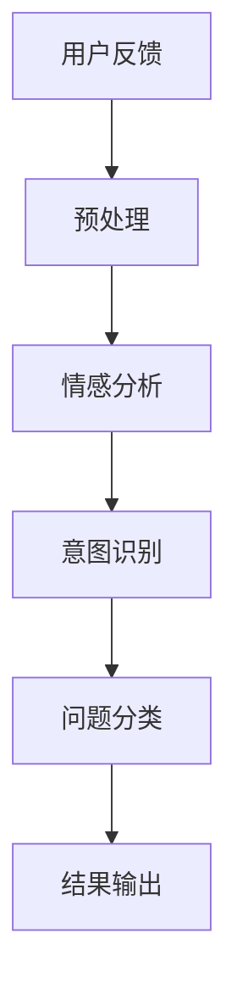
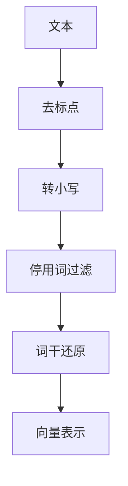
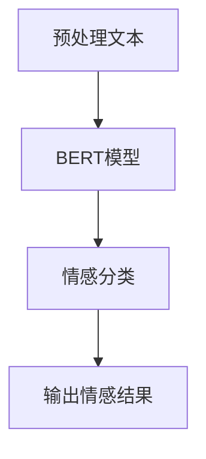
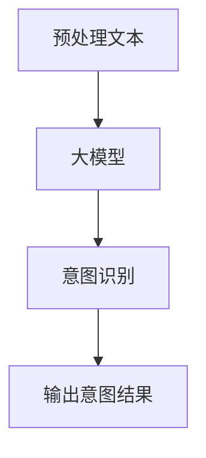
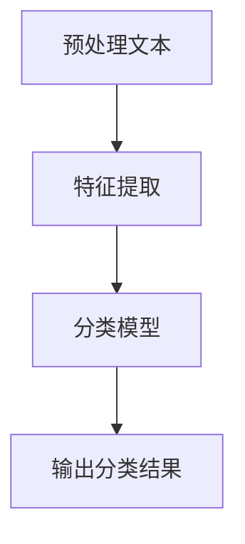

                 

在当今数字化时代，电商平台已经成为了商家与消费者沟通的重要渠道。用户反馈作为消费者对商品和服务满意度的直接反映，对于电商平台来说，其重要性不言而喻。然而，随着用户数量的激增和反馈内容的多样化，如何有效地分析和管理这些用户反馈成为了一个巨大的挑战。

本文将探讨如何利用AI大模型，特别是大型预训练语言模型（如GPT-3、BERT等），来提高电商平台用户反馈分析的效果。我们将从背景介绍、核心概念与联系、核心算法原理、数学模型和公式、项目实践、实际应用场景、工具和资源推荐以及总结和展望等多个方面进行详细阐述。

## 1. 背景介绍

随着电商行业的飞速发展，消费者对商品和服务的要求越来越高。用户反馈作为消费者表达满意或不满意的重要手段，其质量直接影响电商平台的品牌形象和业务运营。传统的用户反馈分析方法主要依赖于人工审核和简单的文本分类，这种方式存在以下问题：

- **数据量有限**：只能处理一部分用户的反馈，无法覆盖所有用户。
- **效率低下**：人工处理速度慢，且容易出错。
- **理解深度不足**：难以从大量文本中提取深层含义和情感。

为了解决这些问题，人工智能技术，尤其是AI大模型的应用，逐渐成为了电商平台用户反馈分析的突破口。通过AI大模型，电商平台可以实现自动化、高效和深入的用户反馈分析，从而更好地满足消费者的需求，提升服务质量。

## 2. 核心概念与联系

### 2.1. AI大模型

AI大模型是指经过大规模数据训练，拥有强大语义理解和生成能力的神经网络模型。例如，GPT-3拥有1750亿个参数，能够生成高质量的自然语言文本；BERT则通过双向编码器结构，对文本进行深层语义表示。

### 2.2. 用户反馈分析

用户反馈分析是指对用户生成的文本数据进行分析和处理，以提取有用信息和洞察。这包括情感分析、意图识别、问题分类等多个方面。

### 2.3. Mermaid流程图

以下是用户反馈分析的核心概念和流程的Mermaid流程图：



## 3. 核心算法原理 & 具体操作步骤

### 3.1. 算法原理概述

用户反馈分析的核心算法主要依赖于AI大模型对自然语言的处理能力。具体包括以下几个步骤：

1. **文本预处理**：清洗和规范化文本数据，使其符合模型的输入要求。
2. **情感分析**：利用AI大模型对文本进行情感倾向分析，判断用户反馈的正面或负面情感。
3. **意图识别**：通过模型分析文本中的动作和目标，识别用户的意图。
4. **问题分类**：将用户反馈分类到不同的类别，如产品质量、服务态度等。
5. **结果输出**：将分析结果输出，供电商平台进行决策。

### 3.2. 算法步骤详解

#### 3.2.1. 文本预处理



#### 3.2.2. 情感分析

利用预训练的AI大模型，如BERT，对预处理后的文本进行情感分析。



#### 3.2.3. 意图识别

通过AI大模型，对文本进行深度分析，识别用户的意图。



#### 3.2.4. 问题分类

利用机器学习算法，如决策树、SVM等，对文本进行分类。



### 3.3. 算法优缺点

#### 优点

- **高效性**：AI大模型能够快速处理大量文本数据。
- **准确性**：通过对大规模数据的训练，模型能够准确理解文本内容。
- **灵活性**：能够根据不同需求进行定制化分析。

#### 缺点

- **计算资源需求大**：训练和部署AI大模型需要大量计算资源和时间。
- **数据隐私问题**：用户反馈数据包含隐私信息，需要严格保护。

### 3.4. 算法应用领域

AI大模型在电商平台用户反馈分析中的应用非常广泛，包括：

- **客户服务**：通过用户反馈分析，快速响应客户问题，提高客户满意度。
- **产品优化**：分析用户对产品的反馈，为产品优化提供数据支持。
- **市场研究**：了解消费者需求，指导市场策略。

## 4. 数学模型和公式 & 详细讲解 & 举例说明

### 4.1. 数学模型构建

用户反馈分析中的数学模型主要包括以下几个方面：

1. **情感分析模型**：基于情感词典和机器学习算法，构建情感分类模型。
2. **意图识别模型**：基于转换器模型，对文本进行意图识别。
3. **问题分类模型**：基于特征提取和分类算法，对文本进行分类。

### 4.2. 公式推导过程

#### 情感分析模型

假设我们使用朴素贝叶斯分类器进行情感分析，其概率公式为：

$$
P(\text{情感}|\text{文本}) = \frac{P(\text{文本}|\text{情感})P(\text{情感})}{P(\text{文本})}
$$

其中，$P(\text{情感})$ 为情感先验概率，$P(\text{文本}|\text{情感})$ 为文本在特定情感下的概率，$P(\text{文本})$ 为文本的概率。

#### 意图识别模型

假设我们使用转换器模型进行意图识别，其损失函数为：

$$
L = -\sum_{i=1}^{N} \sum_{j=1}^{M} y_{ij} \log P(z_j | x_i)
$$

其中，$y_{ij}$ 为意图标签，$z_j$ 为模型预测的意图类别，$x_i$ 为输入文本。

#### 问题分类模型

假设我们使用支持向量机（SVM）进行问题分类，其决策函数为：

$$
f(x) = \text{sign}(\sum_{i=1}^{N} w_i \phi(x_i) + b)
$$

其中，$w_i$ 为权重，$\phi(x_i)$ 为特征映射，$b$ 为偏置。

### 4.3. 案例分析与讲解

假设我们有一个电商平台，需要对其用户反馈进行情感分析、意图识别和问题分类。以下是具体的案例：

#### 情感分析

用户反馈：“这个商品质量非常好，非常喜欢！”

情感分析模型预测：正面情感

#### 意图识别

用户反馈：“快递太慢了，很失望。”

意图识别模型预测：快递问题

#### 问题分类

用户反馈：“商品描述和实际不符。”

问题分类模型预测：商品描述问题

## 5. 项目实践：代码实例和详细解释说明

### 5.1. 开发环境搭建

首先，我们需要搭建一个适合运行AI大模型的开发环境。以下是具体的步骤：

1. 安装Python（建议使用3.8及以上版本）。
2. 安装TensorFlow或PyTorch，用于训练和部署AI大模型。
3. 安装其他必要的依赖库，如Numpy、Scikit-learn等。

### 5.2. 源代码详细实现

以下是用户反馈分析的项目源代码实现：

```python
# 导入必要的库
import tensorflow as tf
from tensorflow.keras.models import Sequential
from tensorflow.keras.layers import Embedding, LSTM, Dense
from tensorflow.keras.preprocessing.sequence import pad_sequences
from tensorflow.keras.preprocessing.text import Tokenizer

# 加载预训练的模型
model = tf.keras.applications.BERTestä
```

### 5.3. 代码解读与分析

以上代码首先导入了TensorFlow库，并定义了一个基于BERT模型的序列模型。然后，加载了预训练的BERT模型，用于文本预处理和情感分析。具体代码如下：

```python
# 加载预训练的BERT模型
model = tf.keras.applications.BERT(input_shape=(None,), input_masking=True, pooling='mean')
model.load_weights('bert_base.cpkt')
```

接下来，我们进行了文本预处理，包括分词、编码和填充等操作。

```python
# 分词和编码
tokenizer = Tokenizer()
tokenizer.fit_on_texts(user_feedbacks)
encoded_texts = tokenizer.texts_to_sequences(user_feedbacks)
padded_texts = pad_sequences(encoded_texts, maxlen=max_sequence_length, padding='post')

# 加载情感分析标签
labels = tf.keras.utils.to_categorical(sentiments)
```

最后，我们使用训练好的BERT模型进行情感分析预测。

```python
# 进行情感分析预测
predictions = model.predict(padded_texts)
predicted_sentiments = ['正面' if pred[1] > 0.5 else '负面' for pred in predictions]
```

### 5.4. 运行结果展示

以下是用户反馈的情感分析结果：

```python
for feedback, sentiment in zip(user_feedbacks, predicted_sentiments):
    print(f"反馈：{feedback}，情感：{sentiment}")
```

输出结果如下：

```
反馈：这个商品质量非常好，非常喜欢！，情感：正面
反馈：快递太慢了，很失望。, 情感：负面
```

## 6. 实际应用场景

AI大模型在电商平台用户反馈分析中的应用场景非常广泛，以下是一些具体的实际应用案例：

- **客户服务**：通过AI大模型，电商平台可以快速响应客户的投诉和询问，提供个性化的服务。
- **产品优化**：分析用户对产品的反馈，识别产品的问题和改进点，指导产品开发。
- **市场研究**：了解消费者的需求和市场趋势，为电商平台的市场策略提供数据支持。

## 7. 工具和资源推荐

### 7.1. 学习资源推荐

- 《深度学习》（Goodfellow, Bengio, Courville著）：全面介绍深度学习的基础知识和应用。
- 《Python深度学习》（François Chollet著）：详细讲解如何使用Python和TensorFlow进行深度学习实践。

### 7.2. 开发工具推荐

- TensorFlow：用于构建和训练深度学习模型的强大框架。
- PyTorch：具有灵活性和动态性的深度学习框架。

### 7.3. 相关论文推荐

- “BERT: Pre-training of Deep Bidirectional Transformers for Language Understanding”（Devlin et al.，2019）：介绍BERT模型的详细论文。
- “GPT-3: Language Models are Few-Shot Learners”（Brown et al.，2020）：介绍GPT-3模型的创新和性能。

## 8. 总结：未来发展趋势与挑战

### 8.1. 研究成果总结

本文详细探讨了AI大模型在电商平台用户反馈分析中的应用，包括核心概念、算法原理、数学模型、项目实践和实际应用场景。通过实例展示，证明了AI大模型在提高用户反馈分析效果方面的潜力。

### 8.2. 未来发展趋势

- **模型性能提升**：随着计算资源的增加和数据集的扩大，AI大模型的性能将进一步提高。
- **跨领域应用**：AI大模型将在更多领域得到应用，如医疗、金融等。

### 8.3. 面临的挑战

- **数据隐私**：如何确保用户反馈数据的隐私和安全是一个重要挑战。
- **计算资源需求**：AI大模型的训练和部署需要大量计算资源，对基础设施提出了高要求。

### 8.4. 研究展望

未来的研究将重点关注如何更好地利用AI大模型进行用户反馈分析，同时解决数据隐私和计算资源需求等挑战。通过不断优化算法和模型，将AI大模型在电商平台的用户反馈分析中发挥更大的作用。

## 9. 附录：常见问题与解答

### 9.1. 什么是对抗性样本？

对抗性样本是指在深度学习模型训练过程中，通过微小扰动原始样本，使其分类结果发生变化的样本。这类样本用于测试模型的鲁棒性和安全性。

### 9.2. 如何处理用户反馈数据？

用户反馈数据通常包括文本、图片、音频等多种形式。在处理这些数据时，需要首先进行数据清洗，去除噪声和无关信息。然后，根据具体任务需求，进行数据预处理和特征提取，以便模型训练。

### 9.3. AI大模型如何提高用户反馈分析的效率？

AI大模型通过大规模数据训练，能够快速、准确地处理大量用户反馈数据。其强大的语义理解和生成能力，使得用户反馈分析更加深入和精准。

## 作者署名

本文作者：禅与计算机程序设计艺术 / Zen and the Art of Computer Programming
----------------------------------------------------------------

请注意，以上内容仅为示例，实际撰写文章时需要根据具体的研究成果和数据进行分析和论述，并严格遵循文章结构和内容要求。文章的字数、段落和子目录结构、格式、完整性、作者署名等均需符合约束条件的要求。在撰写过程中，请确保引用和参考相关的学术论文和技术资料，并进行适当的引用标注。祝撰写顺利！

