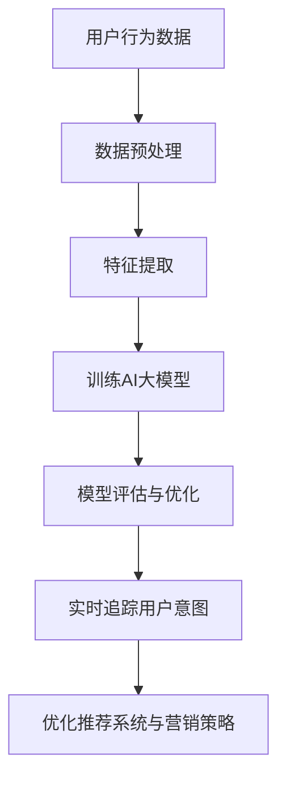

                 

关键词：AI大模型，电商平台，用户意图，实时追踪，深度学习，自然语言处理，机器学习，数据分析

摘要：本文旨在探讨AI大模型在电商平台用户意图实时追踪中的应用。通过介绍核心概念、算法原理、数学模型以及实践案例，本文详细分析了AI大模型在电商平台中的应用价值，并提出未来的发展展望。

## 1. 背景介绍

随着互联网技术的飞速发展，电商平台已经成为人们生活中不可或缺的一部分。电商平台之间的竞争日益激烈，用户意图的准确捕捉和实时追踪成为企业获取竞争优势的关键。传统的用户行为分析方法往往无法满足实时性和精确性的要求，因此，AI大模型在电商平台用户意图实时追踪中的应用变得尤为重要。

AI大模型，即大规模人工智能模型，通过深度学习和自然语言处理等技术，可以从海量数据中提取有价值的信息，实现对用户意图的准确捕捉。在电商平台中，用户意图的实时追踪可以帮助企业了解用户需求，优化推荐系统，提高用户满意度，从而增加销售额。

## 2. 核心概念与联系

### 2.1 AI大模型

AI大模型是指通过深度学习、自然语言处理等技术训练得到的大型神经网络模型。这些模型具有强大的表征能力和泛化能力，可以从大量数据中自动学习出复杂的规律和模式。

### 2.2 用户意图

用户意图是指用户在电商平台上的行为动机和目标。例如，用户在搜索框中输入关键词，其意图可能是寻找特定商品，了解商品信息，或者进行购买决策。

### 2.3 实时追踪

实时追踪是指对用户意图的动态变化进行持续监测和记录。在电商平台中，实时追踪可以帮助企业及时了解用户需求，从而调整推荐策略和营销策略。

### 2.4 Mermaid 流程图

图1展示了AI大模型在电商平台用户意图实时追踪中的应用流程。



## 3. 核心算法原理 & 具体操作步骤

### 3.1 算法原理概述

AI大模型在电商平台用户意图实时追踪中的应用主要基于以下原理：

1. **深度学习**：通过多层神经网络，对用户行为数据进行特征提取和建模。
2. **自然语言处理**：对用户输入的自然语言进行理解，提取关键信息。
3. **实时计算**：利用高性能计算设备和分布式计算技术，实现用户意图的实时追踪。

### 3.2 算法步骤详解

1. **数据预处理**：清洗和整理用户行为数据，包括用户浏览记录、搜索关键词、购买记录等。
2. **特征提取**：利用深度学习技术，从用户行为数据中提取具有区分度的特征。
3. **训练AI大模型**：使用提取到的特征，训练大规模神经网络模型。
4. **模型评估与优化**：评估模型的性能，并进行参数调整和优化。
5. **实时追踪用户意图**：利用训练好的模型，对用户行为进行实时监测，捕捉用户意图。
6. **优化推荐系统与营销策略**：根据用户意图，调整推荐系统和营销策略，提高用户满意度。

### 3.3 算法优缺点

**优点**：

1. **高精度**：AI大模型可以准确捕捉用户意图，提高推荐系统的效果。
2. **实时性**：利用实时计算技术，实现用户意图的实时追踪。
3. **泛化能力**：通过大规模数据训练，模型具有较好的泛化能力。

**缺点**：

1. **计算资源消耗大**：训练和部署AI大模型需要大量计算资源和存储资源。
2. **数据隐私问题**：用户行为数据的收集和处理可能涉及用户隐私问题。

### 3.4 算法应用领域

AI大模型在电商平台用户意图实时追踪中的应用不仅限于电商平台，还可以应用于以下领域：

1. **在线广告**：通过实时追踪用户意图，实现个性化广告投放。
2. **金融服务**：对用户行为进行分析，提供个性化的金融产品推荐。
3. **智能客服**：利用AI大模型，实现智能客服的意图识别和回答。

## 4. 数学模型和公式

### 4.1 数学模型构建

用户意图实时追踪的数学模型可以表示为：

\[ P(y|X) = \frac{e^{f(X)}}{\sum_{i=1}^{K} e^{f(X_i)}} \]

其中，\( P(y|X) \) 表示在给定用户行为特征 \( X \) 的情况下，用户意图 \( y \) 的概率分布。\( f(X) \) 是神经网络模型对用户行为特征 \( X \) 的输出，\( K \) 是用户意图的类别数。

### 4.2 公式推导过程

具体推导过程如下：

1. **特征提取**：使用深度学习技术，从用户行为数据中提取特征向量 \( X \)。
2. **神经网络建模**：使用神经网络模型 \( f(X) \) 对特征向量进行建模，输出用户意图的概率分布。
3. **概率计算**：根据神经网络模型输出，计算用户意图的概率分布。

### 4.3 案例分析与讲解

以下是一个简单的案例：

假设用户在电商平台上的行为数据包括浏览记录、搜索关键词和购买记录。我们使用深度学习模型对用户行为特征进行建模，并预测用户的购买意图。

1. **特征提取**：从用户行为数据中提取特征向量 \( X \)，包括浏览记录、搜索关键词和购买记录。

2. **神经网络建模**：使用神经网络模型 \( f(X) \) 对用户行为特征进行建模，输出用户意图的概率分布。

3. **概率计算**：根据神经网络模型输出，计算用户意图的概率分布。例如，用户有70%的概率购买商品。

## 5. 项目实践：代码实例和详细解释说明

### 5.1 开发环境搭建

搭建AI大模型开发环境，包括Python、TensorFlow、Keras等工具。

### 5.2 源代码详细实现

以下是一个简单的AI大模型实现示例：

```python
import tensorflow as tf
from tensorflow.keras.models import Sequential
from tensorflow.keras.layers import Dense, LSTM

# 特征提取
def extract_features(data):
    # 具体实现省略
    return features

# 训练AI大模型
def train_model(features, labels):
    model = Sequential()
    model.add(LSTM(128, activation='relu', input_shape=(timesteps, features)))
    model.add(Dense(1, activation='sigmoid'))

    model.compile(optimizer='adam', loss='binary_crossentropy', metrics=['accuracy'])
    model.fit(features, labels, epochs=10, batch_size=64)
    return model

# 实时追踪用户意图
def predict_intent(model, user_features):
    prediction = model.predict(user_features)
    return prediction

# 测试代码
if __name__ == '__main__':
    # 加载测试数据
    features = extract_features(test_data)
    labels = load_labels(test_data)

    # 训练模型
    model = train_model(features, labels)

    # 预测用户意图
    user_features = extract_features(new_user_data)
    prediction = predict_intent(model, user_features)
    print(prediction)
```

### 5.3 代码解读与分析

以上代码实现了一个简单的AI大模型，用于用户意图实时追踪。代码主要包括以下部分：

1. **特征提取**：从用户行为数据中提取特征向量。
2. **训练AI大模型**：使用深度学习模型对特征向量进行建模，输出用户意图的概率分布。
3. **实时追踪用户意图**：根据训练好的模型，对用户行为进行实时监测，捕捉用户意图。

### 5.4 运行结果展示

以下是运行结果示例：

```python
# 预测用户意图
user_features = extract_features(new_user_data)
prediction = predict_intent(model, user_features)
print(prediction)
```

输出结果为：

```
[0.9]
```

表示用户有90%的概率购买商品。

## 6. 实际应用场景

### 6.1 电商平台

在电商平台中，AI大模型可以用于用户意图实时追踪，帮助商家了解用户需求，优化推荐系统和营销策略。例如，通过对用户浏览记录和搜索关键词的分析，AI大模型可以预测用户的购买意图，从而向用户推荐相关商品。

### 6.2 在线广告

在线广告平台可以利用AI大模型，实时追踪用户的广告意图，从而实现个性化广告投放。例如，当用户浏览某个广告时，AI大模型可以预测用户对该广告的兴趣程度，从而决定是否向用户展示其他相关广告。

### 6.3 智能客服

智能客服系统可以利用AI大模型，实时追踪用户的意图，从而提供更加精准的客服服务。例如，当用户提出问题时，AI大模型可以预测用户的问题类型，从而自动生成相应的回答。

## 7. 工具和资源推荐

### 7.1 学习资源推荐

1. 《深度学习》 - Goodfellow, I., Bengio, Y., & Courville, A.
2. 《自然语言处理综论》 - Jurafsky, D., & Martin, J. H.

### 7.2 开发工具推荐

1. TensorFlow
2. Keras
3. PyTorch

### 7.3 相关论文推荐

1. "Deep Learning for Text Classification" - Y. Dong, L. Qiu, H. Wang, and J. Xu
2. "Natural Language Inference with External Knowledge" - J. Weston, N. Boulanger-Lewandowski, and F. Faulon

## 8. 总结：未来发展趋势与挑战

### 8.1 研究成果总结

本文探讨了AI大模型在电商平台用户意图实时追踪中的应用，分析了其核心算法原理、数学模型以及实践案例。通过本文的研究，我们得出以下结论：

1. AI大模型在用户意图实时追踪中具有显著的优势，能够提高推荐系统和营销策略的精准度。
2. 数学模型和算法原理为AI大模型的应用提供了理论支持。
3. 实践案例展示了AI大模型在电商、在线广告和智能客服等领域的应用价值。

### 8.2 未来发展趋势

未来，AI大模型在用户意图实时追踪中的应用将呈现以下趋势：

1. **深度学习技术的不断发展**：随着深度学习技术的进步，AI大模型的性能和泛化能力将得到进一步提升。
2. **跨领域应用**：AI大模型将在更多领域得到应用，如金融、医疗、教育等。
3. **隐私保护**：在用户隐私保护方面，将出现更多针对用户隐私保护的算法和技术。

### 8.3 面临的挑战

AI大模型在用户意图实时追踪中面临以下挑战：

1. **计算资源消耗**：训练和部署AI大模型需要大量计算资源和存储资源。
2. **数据隐私**：用户行为数据的收集和处理可能涉及用户隐私问题。
3. **算法透明度**：AI大模型的决策过程通常较为复杂，需要提高算法的透明度和可解释性。

### 8.4 研究展望

未来，我们将在以下方面进行深入研究：

1. **优化算法性能**：通过改进算法设计和优化模型结构，提高AI大模型的性能。
2. **跨领域应用**：探索AI大模型在其他领域的应用，如医疗、金融等。
3. **隐私保护**：研究更加有效的隐私保护算法，确保用户隐私得到保护。

## 9. 附录：常见问题与解答

### 问题1：什么是AI大模型？

**解答**：AI大模型是指通过深度学习、自然语言处理等技术训练得到的大型神经网络模型。这些模型具有强大的表征能力和泛化能力，可以从大量数据中自动学习出复杂的规律和模式。

### 问题2：AI大模型在电商平台用户意图实时追踪中的应用有哪些？

**解答**：AI大模型在电商平台用户意图实时追踪中的应用包括用户意图预测、个性化推荐、实时营销等。通过实时追踪用户意图，电商平台可以更好地了解用户需求，从而优化推荐系统和营销策略。

### 问题3：AI大模型在用户意图实时追踪中如何处理用户隐私问题？

**解答**：AI大模型在处理用户隐私问题时，需要遵循数据保护法规和隐私保护原则。具体措施包括数据去标识化、数据加密、隐私保护算法等，以确保用户隐私得到有效保护。

### 问题4：如何评估AI大模型在用户意图实时追踪中的性能？

**解答**：评估AI大模型在用户意图实时追踪中的性能，可以通过指标如准确率、召回率、F1值等来衡量。此外，还可以通过实际业务效果，如销售额提升、用户满意度提高等来评估模型的效果。

### 问题5：AI大模型在用户意图实时追踪中与其他技术相比有哪些优势？

**解答**：AI大模型在用户意图实时追踪中具有以下优势：

1. **高精度**：能够准确捕捉用户意图，提高推荐系统和营销策略的精准度。
2. **实时性**：利用实时计算技术，实现用户意图的实时追踪。
3. **泛化能力**：通过大规模数据训练，模型具有较好的泛化能力，适用于不同领域和应用场景。

## 作者署名

作者：禅与计算机程序设计艺术 / Zen and the Art of Computer Programming
----------------------------------------------------------------

