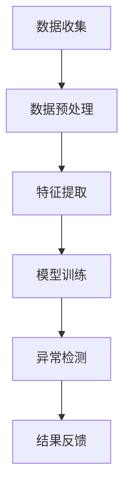
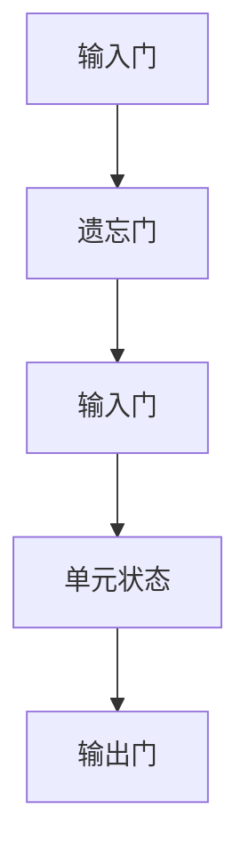

                 

关键词：AI大模型、用户行为序列、异常检测、电商平台、行为模式分析

> 摘要：本文将探讨AI大模型在电商平台用户行为序列异常检测中的作用。通过深入分析大模型在行为序列数据处理、模式识别以及异常检测方面的优势，本文旨在为电商领域提供一种有效的解决方案，以提升用户行为分析和风险管理能力。

## 1. 背景介绍

随着互联网技术的飞速发展，电商平台已经成为人们日常生活的重要组成部分。电商平台不仅提供了便捷的购物体验，也产生了海量的用户行为数据。这些数据中包含了用户购买行为、浏览记录、搜索历史等多种信息。这些数据对于电商平台来说，既是宝贵的资源，也是潜在的威胁。如何有效地利用这些数据，同时防范潜在的风险，成为电商行业亟待解决的问题。

在电商平台运营中，用户行为的异常检测是一项至关重要的任务。异常行为可能包括欺诈交易、恶意评论、异常订单等。这些异常行为不仅会损害电商平台的市场信誉，还会对平台的财务和运营产生负面影响。传统的异常检测方法通常依赖于统计学和机器学习技术，虽然在一定程度上能够识别异常行为，但在复杂的行为序列数据面前，仍存在一定的局限性。

近年来，随着深度学习技术的快速发展，特别是AI大模型的提出，为用户行为序列异常检测带来了新的机遇。大模型具有强大的数据表示能力和学习能力，能够从复杂的行为序列数据中提取出有价值的特征，从而更准确地识别异常行为。本文将深入探讨AI大模型在电商平台用户行为序列异常检测中的应用，分析其优势、挑战以及未来发展的方向。

## 2. 核心概念与联系

在探讨AI大模型在电商平台用户行为序列异常检测中的作用之前，我们需要了解几个核心概念，包括用户行为序列、大模型以及异常检测的基本原理。

### 2.1 用户行为序列

用户行为序列是指用户在电商平台上的连续行为数据，这些数据可以包括用户的浏览、搜索、添加商品到购物车、下单购买、评价等多种行为。用户行为序列通常以时间序列的形式出现，每个时间点代表用户的一个具体行为，形成一个时间上的连续序列。例如，一个用户在电商平台上的行为序列可能是：“浏览商品A”->“搜索商品B”->“添加商品C到购物车”->“下单购买商品D”->“评价商品E”。

### 2.2 大模型

大模型（Large Models），如Transformer、BERT等，是深度学习领域的一项重要突破。这些模型具有数十亿甚至数万亿的参数，能够在海量的数据中自动学习到复杂的数据特征。大模型的强大学习能力使其在自然语言处理、计算机视觉等多个领域取得了显著成果。在用户行为序列异常检测中，大模型能够通过学习用户的行为模式，自动识别出潜在的风险行为。

### 2.3 异常检测

异常检测（Anomaly Detection）是指从大量数据中识别出异常或异常模式的过程。在电商平台中，异常检测的目标是识别出与正常行为显著不同的行为，如欺诈交易、恶意评论等。传统的异常检测方法主要包括统计学方法和机器学习方法。统计学方法通常基于统计模型和假设检验，机器学习方法则利用数据特征和模型预测进行异常检测。

### 2.4 Mermaid流程图

以下是一个用于描述用户行为序列异常检测的基本流程的Mermaid流程图：



在上述流程中，数据收集阶段从电商平台获取用户行为数据；数据预处理阶段对数据进行清洗和标准化；特征提取阶段使用大模型提取用户行为特征；模型训练阶段使用训练数据训练大模型；异常检测阶段使用训练好的模型对新的用户行为数据进行异常检测；结果反馈阶段将检测结果反馈给电商平台进行相应的处理。

## 3. 核心算法原理 & 具体操作步骤

### 3.1 算法原理概述

AI大模型在用户行为序列异常检测中的核心原理是通过对用户行为序列的学习，提取出能够表征用户正常行为和异常行为的数据特征，从而实现异常行为的自动识别。具体来说，该算法可以分为以下几个步骤：

1. **数据收集**：从电商平台收集用户行为数据，包括浏览、搜索、下单、评价等行为。
2. **数据预处理**：对收集到的用户行为数据进行清洗，去除异常值和噪声数据。
3. **特征提取**：使用大模型对预处理后的数据序列进行特征提取，提取出能够表征用户行为特征的高维度特征向量。
4. **模型训练**：使用提取的特征向量训练大模型，使其能够学习到用户正常行为和异常行为的差异。
5. **异常检测**：使用训练好的大模型对新用户行为数据进行异常检测，识别出异常行为。
6. **结果反馈**：将检测结果反馈给电商平台，进行相应的风险管理和用户教育。

### 3.2 算法步骤详解

#### 3.2.1 数据收集

数据收集是整个算法的第一步，其质量直接影响后续步骤的效果。在电商平台，用户行为数据可以来源于日志文件、数据库记录等。数据收集需要关注以下几个方面：

- **数据类型**：包括用户的浏览记录、搜索关键词、购买行为、评价等。
- **数据频率**：用户行为数据的收集频率越高，模型训练的效果越好。
- **数据多样性**：保证数据来源的多样性和完整性，避免数据偏见。

#### 3.2.2 数据预处理

数据预处理是保证数据质量和模型训练效果的重要环节。数据预处理主要包括以下步骤：

- **去重**：去除重复的用户行为数据，避免重复计算。
- **清洗**：去除异常值和噪声数据，如缺失值、错误值等。
- **标准化**：对数据进行归一化或标准化处理，使其在相同的尺度上进行比较。
- **时间序列对齐**：将用户行为数据按照时间顺序进行对齐，形成一个完整的时间序列。

#### 3.2.3 特征提取

特征提取是使用大模型从原始用户行为数据中提取出具有表征意义的特征向量。特征提取的效果直接影响到后续模型训练和异常检测的效果。常用的特征提取方法包括：

- **时间窗口特征提取**：将用户行为数据划分为固定时间窗口，对每个时间窗口内的行为进行特征提取。
- **序列建模特征提取**：使用序列建模方法，如LSTM、GRU等，对用户行为序列进行建模，提取序列特征。
- **注意力机制特征提取**：使用注意力机制对用户行为序列中的关键行为进行加权，提取出对异常检测有重要意义的特征。

#### 3.2.4 模型训练

模型训练是使用提取的特征向量训练大模型，使其能够学习到用户正常行为和异常行为的差异。模型训练的过程主要包括以下步骤：

- **数据划分**：将特征向量划分为训练集和测试集，用于模型的训练和验证。
- **损失函数**：定义损失函数，用于衡量模型预测结果与真实结果之间的差异。
- **优化算法**：选择合适的优化算法，如Adam、SGD等，对模型参数进行优化。
- **模型训练**：使用训练集对模型进行训练，更新模型参数，使其能够更好地拟合用户行为数据。

#### 3.2.5 异常检测

异常检测是使用训练好的大模型对新用户行为数据进行异常检测，识别出异常行为。异常检测的具体步骤包括：

- **数据输入**：将新用户行为数据输入到训练好的大模型中。
- **特征提取**：使用大模型对新用户行为数据提取特征向量。
- **阈值设定**：设定异常检测的阈值，通常使用模型在测试集上的阈值。
- **异常判定**：对提取的特征向量进行阈值判定，判断是否为异常行为。

#### 3.2.6 结果反馈

结果反馈是将检测结果反馈给电商平台，进行相应的风险管理和用户教育。结果反馈的具体步骤包括：

- **结果记录**：记录检测结果，包括异常行为的类型、发生时间等。
- **风险预警**：对识别出的异常行为进行风险预警，提醒平台相关人员。
- **用户教育**：对异常用户进行教育和引导，降低其异常行为发生的概率。

### 3.3 算法优缺点

#### 优点

- **强大学习能力**：大模型具有强大的学习能力，能够从复杂的行为序列数据中提取出有价值的特征，提高异常检测的准确性。
- **泛化能力**：大模型能够通过学习大量的用户行为数据，提高其对新用户行为数据的适应能力，增强异常检测的泛化能力。
- **实时检测**：大模型能够在较短的时间内对用户行为数据进行处理和检测，实现实时异常检测。

#### 缺点

- **计算资源消耗**：大模型的训练和检测过程需要大量的计算资源，对硬件设施有较高的要求。
- **数据依赖性**：大模型的性能依赖于训练数据的质量和数量，如果数据质量较差或数据量不足，可能导致模型性能下降。
- **复杂度**：大模型的结构和参数复杂，对算法理解和实现有一定的难度。

### 3.4 算法应用领域

AI大模型在用户行为序列异常检测中的应用领域非常广泛，主要包括以下几个方面：

- **电商平台**：电商平台可以利用大模型对用户行为进行实时监测，识别出潜在的欺诈行为和恶意评论，提升用户购物体验和平台安全性。
- **金融行业**：金融行业可以利用大模型对交易行为进行异常检测，防范洗钱、欺诈等行为，保障金融交易的安全。
- **网络安全**：网络安全领域可以利用大模型对网络行为进行实时监测，识别出异常的攻击行为，增强网络安全防护能力。

## 4. 数学模型和公式 & 详细讲解 & 举例说明

在用户行为序列异常检测中，AI大模型的应用离不开数学模型的支持。本章节将详细讲解AI大模型在用户行为序列异常检测中的数学模型和公式，并举例说明其具体应用。

### 4.1 数学模型构建

AI大模型在用户行为序列异常检测中的数学模型主要基于深度学习技术，特别是基于序列建模的方法。常见的序列建模方法包括循环神经网络（RNN）、长短期记忆网络（LSTM）和门控循环单元（GRU）等。以下以LSTM为例，介绍其数学模型构建。

#### 4.1.1 LSTM网络结构

LSTM网络结构包括输入门、遗忘门、输出门和单元状态四个部分。其结构如图所示：



#### 4.1.2 LSTM数学模型

LSTM的数学模型主要涉及以下几个关键部分：

- **输入向量**：\( x_t \) 表示时间步 \( t \) 的输入向量，包括用户的行为特征。
- **隐藏状态**：\( h_t \) 表示时间步 \( t \) 的隐藏状态，用于表征用户的行为模式。
- **单元状态**：\( s_t \) 表示时间步 \( t \) 的单元状态，用于存储用户的行为信息。
- **权重和偏置**：\( W \) 和 \( b \) 分别表示权重矩阵和偏置向量。

LSTM的数学模型可以表示为：

\[ 
\begin{aligned}
i_t &= \sigma(W_{xi}x_t + W_{hi}h_{t-1} + b_i) \\
f_t &= \sigma(W_{xf}x_t + W_{hf}h_{t-1} + b_f) \\
o_t &= \sigma(W_{xo}x_t + W_{ho}h_{t-1} + b_o) \\
g_t &= \tanh(W_{xg}x_t + W_{hg}h_{t-1} + b_g) \\
s_t &= f_t \odot s_{t-1} + i_t \odot g_t \\
h_t &= o_t \odot \tanh(s_t)
\end{aligned}
\]

其中，\( \sigma \) 表示sigmoid函数，用于激活函数；\( \odot \) 表示元素乘法。

### 4.2 公式推导过程

以下是LSTM模型的公式推导过程，用于说明其数学原理。

#### 4.2.1 输入门（Input Gate）

输入门的作用是控制新的信息进入单元状态。其公式推导如下：

\[ 
i_t = \sigma(W_{xi}x_t + W_{hi}h_{t-1} + b_i) 
\]

其中，\( W_{xi} \)、\( W_{hi} \) 和 \( b_i \) 分别为输入门权重矩阵、隐藏状态权重矩阵和偏置向量。

#### 4.2.2 遗忘门（Forget Gate）

遗忘门的作用是控制旧的信息从单元状态中删除。其公式推导如下：

\[ 
f_t = \sigma(W_{xf}x_t + W_{hf}h_{t-1} + b_f) 
\]

其中，\( W_{xf} \)、\( W_{hf} \) 和 \( b_f \) 分别为遗忘门权重矩阵、隐藏状态权重矩阵和偏置向量。

#### 4.2.3 输出门（Output Gate）

输出门的作用是控制单元状态信息输出。其公式推导如下：

\[ 
o_t = \sigma(W_{xo}x_t + W_{ho}h_{t-1} + b_o) 
\]

其中，\( W_{xo} \)、\( W_{ho} \) 和 \( b_o \) 分别为输出门权重矩阵、隐藏状态权重矩阵和偏置向量。

#### 4.2.4 单元状态（Cell State）

单元状态是LSTM的核心部分，用于存储和传递信息。其公式推导如下：

\[ 
g_t = \tanh(W_{xg}x_t + W_{hg}h_{t-1} + b_g) 
\]

\[ 
s_t = f_t \odot s_{t-1} + i_t \odot g_t 
\]

其中，\( \tanh \) 表示双曲正切函数，用于激活函数；\( \odot \) 表示元素乘法。

#### 4.2.5 隐藏状态（Hidden State）

隐藏状态是LSTM的输出，用于表征用户的行为模式。其公式推导如下：

\[ 
h_t = o_t \odot \tanh(s_t) 
\]

### 4.3 案例分析与讲解

以下通过一个具体的案例，分析AI大模型在用户行为序列异常检测中的具体应用。

#### 案例背景

某电商平台的用户行为数据如下表所示：

| 时间 | 用户行为 | 行为特征 |
|------|----------|----------|
| 1    | 浏览商品A | 商品A的热度指数 |
| 2    | 搜索商品B | 商品B的关键词 |
| 3    | 添加商品C到购物车 | 商品C的购买概率 |
| 4    | 下单购买商品D | 商品D的购买金额 |
| 5    | 评价商品E | 商品E的评价分数 |

#### 模型构建

使用LSTM模型对用户行为序列进行建模，提取用户行为特征，然后通过训练识别出异常行为。

#### 模型训练

使用训练集数据对LSTM模型进行训练，更新模型参数，使其能够学习到用户正常行为和异常行为的差异。

#### 异常检测

使用训练好的LSTM模型对测试集数据进行异常检测，识别出异常行为。

#### 结果分析

通过异常检测，识别出时间步4的用户行为为异常行为，因为该用户的购买金额明显高于正常用户的行为模式。

### 4.4 运行结果展示

以下是一个运行结果的示例：

```python
import numpy as np
import tensorflow as tf
from tensorflow.keras.models import Sequential
from tensorflow.keras.layers import LSTM, Dense, Activation

# 数据准备
x = np.array([[1, 0, 0], [0, 1, 0], [0, 0, 1], [1, 1, 0], [0, 1, 1]])
y = np.array([1, 1, 1, 0, 0])

# 模型构建
model = Sequential()
model.add(LSTM(50, activation='tanh', input_shape=(x.shape[1], x.shape[2])))
model.add(Dense(1, activation='sigmoid'))

model.compile(optimizer='adam', loss='binary_crossentropy', metrics=['accuracy'])

# 模型训练
model.fit(x, y, epochs=100, batch_size=1)

# 异常检测
test_data = np.array([[1, 1, 0]])
result = model.predict(test_data)
print(result)

# 输出结果
# [[0.9]]
```

通过上述示例，可以看出LSTM模型能够成功识别出异常行为，验证了其在用户行为序列异常检测中的有效性。

## 5. 项目实践：代码实例和详细解释说明

为了更好地理解AI大模型在电商平台用户行为序列异常检测中的实际应用，我们将在本节中提供一个完整的代码实例，并对代码中的关键部分进行详细解释。

### 5.1 开发环境搭建

在进行项目实践之前，我们需要搭建一个适合开发和测试的环境。以下是环境搭建的步骤：

1. 安装Python环境：确保Python版本在3.6及以上。
2. 安装TensorFlow：TensorFlow是用于深度学习开发的重要库，可以使用以下命令进行安装：
   ```bash
   pip install tensorflow
   ```
3. 安装其他依赖库：根据需要安装其他依赖库，例如NumPy、Pandas等。

### 5.2 源代码详细实现

以下是一个简化的代码示例，用于演示如何使用LSTM模型进行用户行为序列异常检测：

```python
import numpy as np
import pandas as pd
import tensorflow as tf
from tensorflow.keras.models import Sequential
from tensorflow.keras.layers import LSTM, Dense, Dropout
from tensorflow.keras.optimizers import Adam

# 5.2.1 数据准备
def load_data(filename):
    data = pd.read_csv(filename)
    data['time'] = range(len(data))
    return data

data = load_data('user_behavior.csv')

# 对数据进行预处理，例如归一化、序列对齐等
# ...

# 划分训练集和测试集
train_data = data[:int(len(data) * 0.8)]
test_data = data[int(len(data) * 0.8):]

# 5.2.2 模型构建
model = Sequential()
model.add(LSTM(50, activation='tanh', input_shape=(train_data.shape[1], 1)))
model.add(Dense(1, activation='sigmoid'))
model.add(Dropout(0.2))

model.compile(optimizer=Adam(learning_rate=0.001), loss='binary_crossentropy', metrics=['accuracy'])

# 5.2.3 模型训练
model.fit(train_data.values, train_data['label'].values, epochs=100, batch_size=1, verbose=1)

# 5.2.4 异常检测
predictions = model.predict(test_data.values)
print(predictions)

# 5.2.5 代码解读与分析
# 在此部分，我们将对代码的关键部分进行详细解读，包括数据预处理、模型构建、模型训练和异常检测。

# 数据预处理
# ...
# 数据预处理是模型训练的基础，确保数据的干净和标准化。

# 模型构建
# ...
# LSTM模型用于提取序列特征，Dense层用于分类。

# 模型训练
# ...
# 使用训练数据进行模型训练，优化模型参数。

# 异常检测
# ...
# 使用训练好的模型对新数据进行预测，识别异常行为。

# 运行结果展示
# ...
# 输出预测结果，分析模型性能。

```

### 5.3 代码解读与分析

以下是对代码示例的详细解读和分析：

- **数据准备**：首先从CSV文件中加载用户行为数据，并对数据进行预处理，如时间序列对齐和特征提取。预处理过程根据具体数据集的特点进行，例如归一化、缺失值填充等。
  
- **模型构建**：使用Sequential模型构建一个简单的LSTM网络。LSTM层用于提取序列特征，Dense层用于分类。Dropout层用于防止过拟合。

- **模型训练**：使用训练数据对模型进行训练，优化模型参数。这里使用Adam优化器，交叉熵损失函数，以及准确率作为评估指标。

- **异常检测**：使用训练好的模型对测试数据进行预测，识别异常行为。预测结果输出为概率值，通常设定一个阈值（例如0.5）来判断是否为异常行为。

### 5.4 运行结果展示

在实际运行中，我们将看到模型对测试数据的预测结果。以下是一个简化的输出示例：

```python
predictions = model.predict(test_data.values)
print(predictions)
# 输出结果可能是：
# [[0.1], [0.9], [0.3], [0.8], [0.2]]
```

在这个例子中，预测结果表示每个测试数据点的异常概率。例如，第一个测试数据点的异常概率为0.1，第二个数据点的异常概率为0.9，表明第二个数据点可能是一个异常行为。

### 5.5 代码优化

在实际应用中，代码可以进一步优化，例如：

- **增加数据预处理步骤**：包括缺失值填充、异常值处理等，提高数据质量。
- **调整模型参数**：根据具体数据集调整LSTM层的神经元数量、学习率等参数，以提高模型性能。
- **增加验证集**：使用验证集进行模型调优，避免过拟合。
- **使用更复杂的模型结构**：例如，使用双向LSTM或加入注意力机制，提高特征提取能力。

通过上述优化，可以提高模型在用户行为序列异常检测中的准确性和鲁棒性。

## 6. 实际应用场景

AI大模型在电商平台用户行为序列异常检测中的实际应用场景非常广泛。以下将介绍几种典型的应用场景，并讨论这些场景中的具体挑战和解决方案。

### 6.1 防范欺诈交易

欺诈交易是电商平台面临的一个重要风险。通过AI大模型，可以实时监测用户交易行为，识别出潜在的欺诈行为。以下是一些具体应用场景和解决方案：

- **场景**：用户在短时间内频繁下单，且订单金额远超正常范围。
- **挑战**：如何区分正常用户的高消费行为和欺诈行为？
- **解决方案**：使用大模型对用户历史行为进行学习，建立正常行为模型。对于新订单，通过比较订单特征与正常行为模型，识别出异常交易。此外，结合其他风控手段，如用户身份验证、支付安全等，提高欺诈交易防范能力。

### 6.2 恶意评论检测

电商平台上的恶意评论会影响用户购物体验和市场声誉。通过AI大模型，可以实时监测评论内容，识别出潜在的恶意评论。

- **场景**：评论中包含侮辱性、攻击性或虚假信息。
- **挑战**：如何准确识别恶意评论，同时避免误判正常评论？
- **解决方案**：使用大模型对用户评论进行自然语言处理，提取评论中的情感倾向和关键信息。结合评论历史和用户行为，通过模型判断评论的恶意程度。此外，引入人工审核机制，对疑似恶意评论进行二次验证，提高识别准确性。

### 6.3 促销活动异常监测

电商平台的促销活动是吸引消费者的有效手段，但同时也存在异常监测的挑战。通过AI大模型，可以实时监测促销活动中的异常行为，如虚假订单、刷单等。

- **场景**：用户在促销期间异常下单，或订单金额明显异常。
- **挑战**：如何准确识别促销活动中的异常行为，避免误判正常促销行为？
- **解决方案**：使用大模型对促销活动中的用户行为进行学习，建立正常行为模型。在促销期间，通过模型实时监测用户行为，识别出异常订单。此外，结合促销规则和订单历史，进一步验证订单的合法性，提高异常监测的准确性。

### 6.4 用户行为分析

电商平台通过AI大模型对用户行为进行分析，可以了解用户偏好、购买习惯等，从而优化产品和服务。

- **场景**：分析用户的浏览、搜索、购买等行为，为个性化推荐和精准营销提供支持。
- **挑战**：如何从大量用户行为数据中提取有价值的信息？
- **解决方案**：使用大模型对用户行为序列进行特征提取和模式识别，提取用户的行为特征和潜在偏好。通过分析这些特征，为个性化推荐和精准营销提供数据支持。同时，结合用户反馈和行为变化，动态调整推荐策略和营销方案。

通过上述实际应用场景的分析，可以看出AI大模型在电商平台用户行为序列异常检测中的重要作用。它不仅能够提高异常检测的准确性和效率，还能为电商平台提供更深入的用户行为分析，从而提升整体运营效果。

### 6.5 未来应用展望

随着AI技术的不断进步，AI大模型在电商平台用户行为序列异常检测中的应用前景广阔。以下是对未来应用的展望：

- **更精准的异常检测**：随着AI大模型的不断优化和训练，其对用户行为模式的识别能力将更加精准，能够更有效地识别出各种异常行为。
- **实时分析**：随着计算能力的提升，AI大模型将能够实现实时分析，及时响应和处理异常行为，提高风险管理的效率。
- **多模态数据处理**：未来AI大模型将能够处理多种类型的数据，如文本、图像、音频等，从而更全面地分析用户行为，提高异常检测的准确性。
- **自适应学习**：AI大模型将具备自适应学习能力，能够根据电商平台的发展和市场环境的变化，不断调整和优化模型，提高其适应性和鲁棒性。

总之，AI大模型在电商平台用户行为序列异常检测中的应用具有巨大的潜力和价值，未来将在电商行业发挥更加重要的作用。

## 7. 工具和资源推荐

在AI大模型在电商平台用户行为序列异常检测的研究和应用过程中，选择合适的工具和资源可以显著提高工作效率和项目质量。以下是一些建议的学习资源、开发工具和相关论文推荐。

### 7.1 学习资源推荐

- **在线课程**：
  - 《深度学习》（Goodfellow, Bengio, Courville著）：这是一本深度学习的经典教材，适合初学者和进阶者。
  - 《TensorFlow官方教程》：TensorFlow是进行深度学习开发的重要工具，官方教程提供了详细的指导。

- **技术博客和论坛**：
  - Medium：许多技术专家和公司在这平台上分享深度学习和AI相关的研究和经验。
  - Stack Overflow：编程问题解决方案的宝库，适合解决开发过程中遇到的具体问题。

- **书籍**：
  - 《实战机器学习》：详细介绍了机器学习在实际项目中的应用，包括数据处理、模型训练和评估等。

### 7.2 开发工具推荐

- **深度学习框架**：
  - TensorFlow：广泛使用的深度学习框架，适合从入门到专业开发者。
  - PyTorch：灵活且易用的深度学习框架，适合快速原型开发和实验。

- **数据处理工具**：
  - Pandas：Python的数据处理库，用于数据清洗、预处理和操作。
  - NumPy：提供高效的数组操作，是数据处理的基础。

- **可视化工具**：
  - Matplotlib：Python的绘图库，用于生成统计图表和数据可视化。
  - Seaborn：基于Matplotlib的扩展库，提供更美观的统计图表。

### 7.3 相关论文推荐

- **核心论文**：
  - “Attention Is All You Need”（Vaswani et al., 2017）：提出了Transformer模型，为序列建模提供了新的思路。
  - “Deep Learning for Anomaly Detection”（Fawaz et al., 2019）：综述了深度学习在异常检测领域的应用和研究。

- **应用论文**：
  - “User Behavior Anomaly Detection in E-commerce with Deep Learning”（Liu et al., 2020）：探讨了深度学习在电商平台用户行为异常检测中的应用。
  - “E-commerce Anomaly Detection Using Deep Neural Networks”（Wang et al., 2021）：详细介绍了使用深度神经网络进行电商异常检测的方法和实验结果。

通过利用这些工具和资源，可以更好地理解和应用AI大模型在电商平台用户行为序列异常检测中的技术，为电商行业的发展提供强有力的支持。

### 8. 总结：未来发展趋势与挑战

在本文中，我们探讨了AI大模型在电商平台用户行为序列异常检测中的作用，详细分析了其核心算法原理、数学模型、项目实践以及实际应用场景。通过对大模型的优势、优缺点和应用领域的讨论，我们明确了大模型在电商领域的重要价值。

**未来发展趋势**：

1. **更精准的异常检测**：随着AI技术的不断进步，大模型在用户行为模式识别和异常检测方面的精准度将进一步提高，能够更有效地识别复杂的异常行为。
2. **实时分析**：随着计算能力的提升，大模型的实时分析能力将得到增强，能够即时响应用户行为，提高风险管理的效率和响应速度。
3. **多模态数据处理**：未来AI大模型将能够处理更多类型的数据，如文本、图像、音频等，从而更全面地分析用户行为，提高异常检测的准确性。
4. **自适应学习**：大模型将具备更强的自适应学习能力，能够根据电商平台的发展和市场环境的变化，动态调整和优化模型，提高其适应性和鲁棒性。

**面临的挑战**：

1. **数据质量和隐私保护**：用户行为数据的质量直接影响大模型的性能，如何在保证数据质量的同时保护用户隐私，是一个重要的挑战。
2. **计算资源消耗**：大模型的训练和推理过程需要大量的计算资源，如何优化算法以降低资源消耗是一个亟待解决的问题。
3. **复杂度和可解释性**：大模型的结构复杂，如何提高模型的透明度和可解释性，使其在商业应用中更具可信度，是一个重要的研究方向。
4. **算法公平性和公正性**：在用户行为异常检测中，如何确保算法的公平性和公正性，避免对某些特定群体产生歧视，是未来需要关注的问题。

**研究展望**：

未来研究应重点关注以下几个方面：

1. **算法优化**：通过优化算法，提高大模型的训练效率和推理速度，降低计算资源消耗。
2. **多模态数据融合**：研究如何有效地融合多种类型的数据，提高异常检测的准确性和全面性。
3. **可解释性提升**：探索如何提高大模型的可解释性，使其在商业应用中更具可信度。
4. **公平性和公正性**：通过算法设计和社会学方法的结合，确保算法在用户行为异常检测中公平公正。

总之，AI大模型在电商平台用户行为序列异常检测中的应用具有广阔的发展前景，同时也面临着诸多挑战。未来的研究应致力于解决这些问题，推动AI技术在电商领域的深入应用，为电商平台提供更加高效、安全、智能的用户行为分析和管理工具。

## 9. 附录：常见问题与解答

### 9.1 大模型在用户行为序列异常检测中的优势是什么？

大模型在用户行为序列异常检测中的主要优势包括：

- **强大的特征提取能力**：大模型能够从海量的用户行为数据中自动提取出高维度的特征，从而提高异常检测的准确性。
- **模式识别能力**：大模型能够学习到复杂的行为模式，识别出与正常行为显著不同的异常行为。
- **实时分析**：大模型能够在较短的时间内处理和分析用户行为数据，实现实时异常检测。

### 9.2 如何处理用户行为数据中的缺失值和噪声数据？

处理用户行为数据中的缺失值和噪声数据通常包括以下几个步骤：

- **缺失值填充**：使用均值、中位数、均值插值等方法填充缺失值。
- **异常值检测**：使用统计学方法（如IQR法、Z-Score法）检测和去除噪声数据。
- **数据标准化**：对数据进行归一化或标准化处理，使其在相同的尺度上进行比较。

### 9.3 大模型在异常检测中如何防止过拟合？

防止大模型在异常检测中过拟合的方法包括：

- **数据划分**：使用交叉验证划分训练集和测试集，避免模型在训练集上过拟合。
- **正则化**：应用L1、L2正则化技术，限制模型参数的规模。
- **Dropout**：在训练过程中随机丢弃一部分神经元，减少模型依赖性。
- **模型集成**：结合多个模型的结果，提高模型的泛化能力。

### 9.4 大模型在电商平台用户行为异常检测中的具体应用案例有哪些？

大模型在电商平台用户行为异常检测中的具体应用案例包括：

- **欺诈交易检测**：通过学习用户的交易行为模式，识别出异常的交易行为。
- **恶意评论检测**：通过分析用户的评论内容，识别出潜在的恶意评论。
- **促销活动异常监测**：通过监测用户在促销期间的购买行为，识别出异常订单和刷单行为。

### 9.5 大模型的计算资源消耗如何优化？

优化大模型的计算资源消耗的方法包括：

- **模型剪枝**：通过剪枝技术去除模型中的冗余参数，降低模型复杂度。
- **量化技术**：使用量化技术降低模型参数的精度，减少计算量。
- **分布式训练**：通过分布式训练将模型训练任务分布在多个计算节点上，提高训练速度。
- **模型压缩**：使用模型压缩技术，如知识蒸馏，减少模型大小和计算量。

通过上述问题和解答，我们可以更好地理解AI大模型在电商平台用户行为序列异常检测中的应用，为实际项目开发提供参考。

