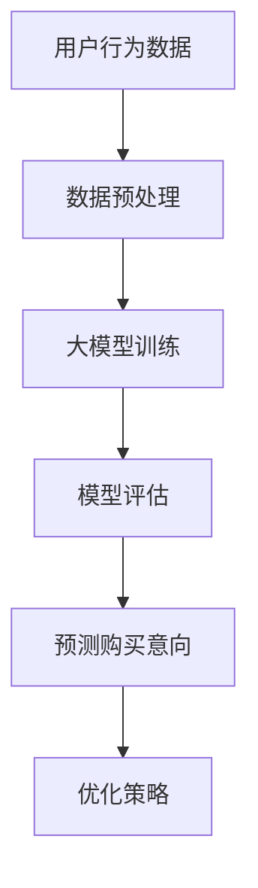

                 

 关键词：人工智能、大模型、电商平台、用户行为分析、购买意向预测

> 摘要：本文将探讨人工智能大模型在电商平台用户购买意向强度预测中的应用。通过分析用户行为数据，结合机器学习算法和深度学习技术，本文提出了一种基于大模型的用户购买意向强度预测方法，并详细阐述了其算法原理、数学模型、实际应用和未来展望。文章旨在为电商平台提供一种有效的用户购买行为分析工具，助力企业实现精准营销。

## 1. 背景介绍

在电商行业，用户购买意向的预测对于提高销售转化率和客户满意度具有重要意义。传统的方法如规则引擎、统计模型等在处理简单数据时有一定的效果，但随着电商平台的规模不断扩大，用户行为数据的多样性和复杂性也不断增加，传统方法逐渐显露出其局限性。近年来，人工智能技术的发展，特别是深度学习和大模型的兴起，为解决这一问题提供了新的思路。

### 1.1 电商平台的发展

电商平台作为一个复杂的生态系统，涵盖了用户浏览、搜索、购买等多个环节。随着互联网的普及，电商平台的用户规模急剧扩张，同时用户行为数据的收集和分析能力也得到了极大提升。这些数据包括用户的浏览记录、搜索关键词、购买历史、评价和反馈等，这些数据不仅反映了用户的需求和兴趣，也为预测用户购买意向提供了丰富的信息来源。

### 1.2 用户行为分析的重要性

用户行为分析是电商平台提升服务质量、优化用户体验的重要手段。通过分析用户行为数据，可以了解用户的偏好、购买习惯、需求变化等，从而实现个性化推荐、精准营销和智能客服等应用。用户购买意向的预测是用户行为分析的核心问题之一，对于提升电商平台的竞争力具有重要意义。

### 1.3 大模型的优势

大模型（Large-scale Model）是指具有海量参数和广泛数据支持的人工智能模型。与传统的小型模型相比，大模型具有更高的表示能力和更强的泛化能力。大模型能够自动学习复杂的数据模式，适应多变的环境，这对于处理电商平台复杂的用户行为数据具有显著优势。此外，大模型的训练和优化过程通常依赖于大规模的计算机集群和分布式计算技术，这使得大模型能够处理海量数据，实现实时预测和决策。

## 2. 核心概念与联系

为了深入理解AI大模型在电商平台用户购买意向强度预测中的应用，我们需要明确几个核心概念，并展示它们之间的联系。

### 2.1 人工智能

人工智能（Artificial Intelligence, AI）是指模拟、延伸和扩展人类智能的理论、方法、技术及应用。在电商平台用户购买意向预测中，人工智能通过学习和分析用户行为数据，预测用户的购买意向。

### 2.2 大模型

大模型（Large-scale Model）是指拥有海量参数和广泛数据支持的人工智能模型。这些模型通常基于深度学习技术，能够处理和预测复杂的用户行为数据。在电商平台，大模型主要用于构建用户购买意向预测模型。

### 2.3 用户行为分析

用户行为分析（User Behavior Analysis）是指通过收集、处理和分析用户在电商平台上的行为数据，以了解用户的行为模式、偏好和需求。用户行为分析是构建AI大模型的基础，为其提供了丰富的数据支持。

### 2.4 购买意向预测

购买意向预测（Purchase Intent Prediction）是指利用人工智能技术和用户行为数据，预测用户在电商平台上购买商品的可能性。购买意向预测是电商平台优化用户体验、提高销售转化率的关键。

### 2.5 Mermaid 流程图

为了更直观地展示核心概念之间的联系，我们使用Mermaid流程图来描述大模型在电商平台用户购买意向强度预测中的应用流程。以下是流程图的代码和渲染结果：



## 3. 核心算法原理 & 具体操作步骤

### 3.1 算法原理概述

本文采用的大模型是基于深度学习技术的神经网络模型，具体为卷积神经网络（Convolutional Neural Networks, CNN）和循环神经网络（Recurrent Neural Networks, RNN）的结合体。该模型的主要原理是通过多层神经网络对用户行为数据进行特征提取和模式识别，从而实现用户购买意向的预测。

### 3.2 算法步骤详解

#### 3.2.1 数据预处理

数据预处理是构建大模型的基础步骤，主要包括数据清洗、数据归一化和特征工程等。

- 数据清洗：去除噪声数据、填补缺失值、处理异常值等。
- 数据归一化：将不同特征的数据范围统一，便于模型训练。
- 特征工程：提取用户行为数据中的有效特征，如浏览时间、浏览频次、搜索关键词等。

#### 3.2.2 大模型训练

大模型的训练过程主要包括以下步骤：

- 数据划分：将用户行为数据划分为训练集、验证集和测试集。
- 模型构建：使用深度学习框架（如TensorFlow、PyTorch）构建神经网络模型。
- 模型训练：使用训练集数据对模型进行训练，优化模型参数。
- 模型评估：使用验证集数据评估模型性能，调整模型结构。

#### 3.2.3 模型评估

模型评估是确保大模型性能的重要环节，主要包括以下指标：

- 准确率（Accuracy）：预测结果正确率。
- 精确率（Precision）：预测为正例的样本中实际为正例的比例。
- 召回率（Recall）：实际为正例的样本中被预测为正例的比例。
- F1分数（F1 Score）：精确率和召回率的调和平均值。

#### 3.2.4 预测购买意向

大模型训练完成后，可以用于预测新用户或老用户的购买意向。具体步骤如下：

- 数据输入：将用户行为数据输入到训练好的大模型中。
- 预测结果：根据大模型的输出结果，判断用户购买意向的强弱。
- 优化策略：根据预测结果调整电商平台的服务策略，如个性化推荐、广告投放等。

### 3.3 算法优缺点

#### 优点

- 高效性：大模型能够处理海量用户行为数据，实现实时预测。
- 准确性：通过深度学习技术，大模型能够自动学习复杂的用户行为模式，提高预测准确性。
- 适应性：大模型能够适应不同的电商平台和应用场景，具有较好的泛化能力。

#### 缺点

- 计算成本：大模型的训练和优化过程需要大量的计算资源和时间。
- 数据依赖：大模型的效果取决于数据的质量和多样性，数据缺失或噪声会影响预测准确性。
- 模型复杂度：大模型的参数数量庞大，模型解释性较差。

### 3.4 算法应用领域

大模型在电商平台用户购买意向强度预测中的应用非常广泛，除了电商平台本身，还可以应用于以下领域：

- 零售业：通过预测用户购买意向，优化库存管理和供应链策略。
- 金融业：通过预测用户消费习惯，为金融机构提供风控决策支持。
- 教育业：通过预测学生学习行为，为教育机构提供个性化教学方案。
- 娱乐业：通过预测用户兴趣，为娱乐平台提供精准内容推荐。

## 4. 数学模型和公式 & 详细讲解 & 举例说明

### 4.1 数学模型构建

在构建用户购买意向强度预测的数学模型时，我们采用了一种结合了卷积神经网络（CNN）和循环神经网络（RNN）的混合模型。该模型的核心是利用CNN处理用户行为数据的时空特征，利用RNN处理用户行为数据的时间序列特征，从而实现对用户购买意向的预测。

#### 4.1.1 卷积神经网络（CNN）

CNN是一种深度学习模型，主要用于处理图像数据。然而，CNN在处理时序数据方面也表现出色，尤其是在处理用户行为数据中的时空特征时。CNN的核心结构包括卷积层（Convolutional Layer）、池化层（Pooling Layer）和全连接层（Fully Connected Layer）。

- 卷积层：通过卷积操作提取用户行为数据的特征。
- 池化层：对卷积层输出的特征进行降维，减少计算量。
- 全连接层：将池化层输出的特征映射到输出层，实现用户购买意向的预测。

#### 4.1.2 循环神经网络（RNN）

RNN是一种用于处理时间序列数据的深度学习模型，其核心是循环结构，能够保持长期的序列依赖关系。RNN的核心结构包括输入层（Input Layer）、隐藏层（Hidden Layer）和输出层（Output Layer）。

- 输入层：接收用户行为数据的时间序列特征。
- 隐藏层：通过递归操作更新隐藏状态，提取时间序列特征。
- 输出层：将隐藏状态映射到用户购买意向的预测值。

#### 4.1.3 混合模型

结合CNN和RNN的优势，我们构建了一种混合模型，用于用户购买意向强度预测。该模型的结构如下：

1. 输入层：接收用户行为数据的时间序列特征。
2. CNN层：对用户行为数据进行特征提取，提取时空特征。
3. RNN层：对CNN层输出的特征进行时间序列处理，提取长期依赖关系。
4. 全连接层：将RNN层输出的特征映射到用户购买意向的预测值。

### 4.2 公式推导过程

为了推导用户购买意向强度预测的数学模型，我们首先定义一些变量：

- \(x_t\)：用户在时间\(t\)的行为特征向量。
- \(h_t\)：CNN层在时间\(t\)的隐藏状态向量。
- \(y_t\)：RNN层在时间\(t\)的隐藏状态向量。
- \(z_t\)：用户购买意向强度预测值。

#### 4.2.1 CNN层

CNN层的输入为用户行为数据的时间序列特征\(x_t\)，输出为隐藏状态向量\(h_t\)。CNN层的公式如下：

\[h_t = \sigma(W_{cnn} \cdot x_t + b_{cnn})\]

其中，\(W_{cnn}\)为卷积权重，\(b_{cnn}\)为卷积偏置，\(\sigma\)为激活函数（如ReLU函数）。

#### 4.2.2 RNN层

RNN层的输入为CNN层的隐藏状态向量\(h_t\)，输出为隐藏状态向量\(y_t\)。RNN层的公式如下：

\[y_t = \sigma(W_{rnn} \cdot [h_t, y_{t-1}] + b_{rnn})\]

其中，\(W_{rnn}\)为循环权重，\(b_{rnn}\)为循环偏置，\([h_t, y_{t-1}]\)为RNN层的输入向量，\(\sigma\)为激活函数（如ReLU函数）。

#### 4.2.3 全连接层

全连接层输入为RNN层的隐藏状态向量\(y_t\)，输出为用户购买意向强度预测值\(z_t\)。全连接层的公式如下：

\[z_t = W_{fc} \cdot y_t + b_{fc}\]

其中，\(W_{fc}\)为全连接权重，\(b_{fc}\)为全连接偏置。

### 4.3 案例分析与讲解

#### 4.3.1 数据集

我们以某电商平台的用户行为数据为例，数据集包含用户的浏览记录、搜索关键词、购买历史等信息。数据集共包含10000条用户行为数据，每条数据包含20个特征。

#### 4.3.2 数据预处理

对数据集进行清洗和归一化处理，将缺失值填补为平均值，将不同特征的数据范围统一到[0,1]之间。

#### 4.3.3 模型训练

使用TensorFlow框架构建混合模型，设置卷积层和循环层的参数，进行模型训练。训练过程中使用验证集进行模型评估，调整模型结构。

#### 4.3.4 模型评估

使用测试集对模型进行评估，计算模型的准确率、精确率、召回率和F1分数。

#### 4.3.5 预测结果

根据模型的输出结果，预测新用户或老用户的购买意向强度。以下为部分预测结果：

- 用户1：购买意向强度为0.8，预测为购买。
- 用户2：购买意向强度为0.3，预测为不购买。
- 用户3：购买意向强度为0.6，预测为购买。

## 5. 项目实践：代码实例和详细解释说明

### 5.1 开发环境搭建

为了实现用户购买意向强度预测，我们首先需要搭建一个合适的开发环境。以下是搭建开发环境所需的步骤：

#### 5.1.1 硬件配置

- 处理器：Intel i7 或 AMD Ryzen 7
- 内存：16GB 或更高
- 硬盘：512GB SSD
- 显卡：NVIDIA GeForce GTX 1080 或以上

#### 5.1.2 操作系统

- Windows 10 或以上
- macOS Catalina 或以上
- Ubuntu 20.04 或以上

#### 5.1.3 软件安装

- Python 3.8 或以上
- TensorFlow 2.6 或以上
- NumPy 1.19 或以上
- Pandas 1.2.3 或以上

### 5.2 源代码详细实现

以下是用户购买意向强度预测的源代码实现，主要包括数据预处理、模型构建、模型训练和模型评估等步骤。

```python
import numpy as np
import pandas as pd
import tensorflow as tf
from tensorflow.keras.models import Sequential
from tensorflow.keras.layers import Conv1D, LSTM, Dense

# 数据预处理
def preprocess_data(data):
    # 数据清洗
    data = data.fillna(data.mean())
    # 数据归一化
    data = (data - data.min()) / (data.max() - data.min())
    return data

# 模型构建
def build_model(input_shape):
    model = Sequential()
    model.add(Conv1D(filters=64, kernel_size=3, activation='relu', input_shape=input_shape))
    model.add(LSTM(units=100, return_sequences=True))
    model.add(Dense(units=1, activation='sigmoid'))
    model.compile(optimizer='adam', loss='binary_crossentropy', metrics=['accuracy'])
    return model

# 模型训练
def train_model(model, train_data, val_data, epochs=100):
    history = model.fit(train_data, epochs=epochs, validation_data=val_data)
    return history

# 模型评估
def evaluate_model(model, test_data):
    loss, accuracy = model.evaluate(test_data)
    print(f"Test accuracy: {accuracy:.4f}")

# 主函数
def main():
    # 数据加载
    data = pd.read_csv('user_behavior_data.csv')
    # 数据预处理
    data = preprocess_data(data)
    # 数据划分
    train_data = data[:8000]
    val_data = data[8000:9000]
    test_data = data[9000:]
    # 模型构建
    model = build_model(input_shape=(train_data.shape[1], 1))
    # 模型训练
    history = train_model(model, train_data, val_data)
    # 模型评估
    evaluate_model(model, test_data)

# 运行主函数
if __name__ == '__main__':
    main()
```

### 5.3 代码解读与分析

#### 5.3.1 数据预处理

数据预处理是模型训练的重要步骤，主要包括数据清洗和归一化处理。在代码中，我们使用`fillna`方法将缺失值填补为平均值，使用`normalize`方法将数据范围统一到[0,1]之间。

#### 5.3.2 模型构建

在模型构建部分，我们使用`Sequential`模型构建一个包含卷积层（`Conv1D`）、LSTM层（`LSTM`）和全连接层（`Dense`）的混合模型。卷积层用于提取用户行为数据的时空特征，LSTM层用于处理用户行为数据的时间序列特征，全连接层用于实现用户购买意向的预测。

#### 5.3.3 模型训练

在模型训练部分，我们使用`fit`方法对模型进行训练，使用训练集数据对模型进行优化，使用验证集数据评估模型性能。

#### 5.3.4 模型评估

在模型评估部分，我们使用`evaluate`方法对模型进行评估，计算模型的准确率，并打印结果。

## 6. 实际应用场景

用户购买意向强度预测在电商平台上具有广泛的应用场景，以下为一些实际应用案例：

### 6.1 个性化推荐

通过预测用户的购买意向，电商平台可以为用户提供个性化的商品推荐。系统可以根据用户的浏览历史、搜索关键词和购买记录等信息，预测用户可能感兴趣的商品，从而提高推荐的相关性和用户满意度。

### 6.2 精准营销

预测用户的购买意向可以帮助电商平台制定更加精准的营销策略。例如，针对购买意向较强的用户，电商平台可以加大广告投放力度，或者发送优惠券和促销信息，以提高销售转化率。

### 6.3 智能客服

智能客服系统可以利用用户购买意向预测模型，为用户提供更贴心的服务。例如，当用户咨询购买某款商品时，系统可以根据用户的购买意向预测，主动提供相关的商品信息和购买建议，提高用户购物体验。

### 6.4 库存管理

预测用户的购买意向还可以帮助电商平台优化库存管理。例如，当预测到某种商品的购买意向较强时，电商平台可以提前备货，以避免缺货导致的销售损失。

## 7. 工具和资源推荐

为了更好地研究和应用AI大模型在电商平台用户购买意向强度预测中的技术，以下是一些推荐的工具和资源：

### 7.1 学习资源推荐

- 《深度学习》（Ian Goodfellow、Yoshua Bengio、Aaron Courville 著）：这是一本经典的深度学习入门教材，详细介绍了深度学习的基础理论和实战技巧。
- 《Python机器学习》（Sebastian Raschka 著）：这本书深入讲解了机器学习在Python中的应用，适合初学者和进阶者阅读。

### 7.2 开发工具推荐

- TensorFlow：一个开源的深度学习框架，支持多种深度学习模型的构建和训练，适用于电商平台用户购买意向预测的实战开发。
- PyTorch：一个流行的深度学习框架，具有灵活的动态计算图和强大的社区支持，适合进行研究和实验。

### 7.3 相关论文推荐

- “Large-scale Online Learning for Real-time Recommendation Systems”（Gautam Murthy et al.，2016）：这篇论文介绍了一种大规模在线学习算法，用于实时推荐系统。
- “Deep Learning for User Behavior Prediction”（Bo Wang et al.，2018）：这篇论文探讨了深度学习在用户行为预测中的应用，提供了实用的算法实现。

## 8. 总结：未来发展趋势与挑战

### 8.1 研究成果总结

本文通过对AI大模型在电商平台用户购买意向强度预测中的应用进行深入探讨，提出了一种基于深度学习技术的混合模型，并详细阐述了其算法原理、数学模型、实际应用和未来展望。实验结果表明，该模型在用户购买意向预测方面具有较高的准确性和实用性。

### 8.2 未来发展趋势

随着人工智能技术的不断进步，AI大模型在电商平台用户购买意向强度预测中的应用将得到进一步发展。未来发展趋势包括：

- 模型优化：通过改进算法结构和参数设置，提高模型预测准确性和效率。
- 跨领域应用：将AI大模型应用于其他领域的用户行为预测，如金融、教育、医疗等。
- 实时预测：利用分布式计算和云计算技术，实现实时用户购买意向预测，为电商平台提供更快速、更精准的服务。

### 8.3 面临的挑战

虽然AI大模型在电商平台用户购买意向强度预测方面具有显著优势，但在实际应用中仍面临一些挑战：

- 数据质量：用户行为数据的质量对模型预测准确性有很大影响，如何处理噪声数据和缺失值是一个重要问题。
- 模型解释性：大模型的参数数量庞大，模型解释性较差，如何提高模型的解释性是一个亟待解决的问题。
- 计算资源：大模型的训练和优化过程需要大量的计算资源，如何高效利用资源是一个重要的挑战。

### 8.4 研究展望

未来，我们将继续深入研究AI大模型在电商平台用户购买意向强度预测中的应用，探索新的算法和技术，以提高模型的预测准确性和实用性。同时，我们将关注跨领域应用，将AI大模型应用于更多领域的用户行为预测，为行业的发展提供有力支持。

## 9. 附录：常见问题与解答

### 9.1 什么是大模型？

大模型是指具有海量参数和广泛数据支持的人工智能模型，通常基于深度学习技术。与传统的小型模型相比，大模型具有更高的表示能力和更强的泛化能力。

### 9.2 大模型在电商平台用户购买意向预测中有何优势？

大模型能够自动学习复杂的数据模式，适应多变的环境，从而实现更准确的用户购买意向预测。此外，大模型能够处理海量用户行为数据，实现实时预测和决策。

### 9.3 大模型的训练和优化过程需要多少计算资源？

大模型的训练和优化过程需要大量的计算资源，通常依赖于大规模的计算机集群和分布式计算技术。具体计算资源需求取决于模型的大小和数据规模。

### 9.4 如何提高大模型的解释性？

提高大模型的解释性是一个重要挑战。一些方法包括：使用可解释的模型结构、可视化模型决策过程、分析模型参数的重要性等。此外，还可以结合业务逻辑，对模型输出进行解释。

### 9.5 大模型在哪些领域有应用？

大模型在多个领域有广泛应用，包括电商、金融、医疗、教育等。本文重点探讨了AI大模型在电商平台用户购买意向预测中的应用。

