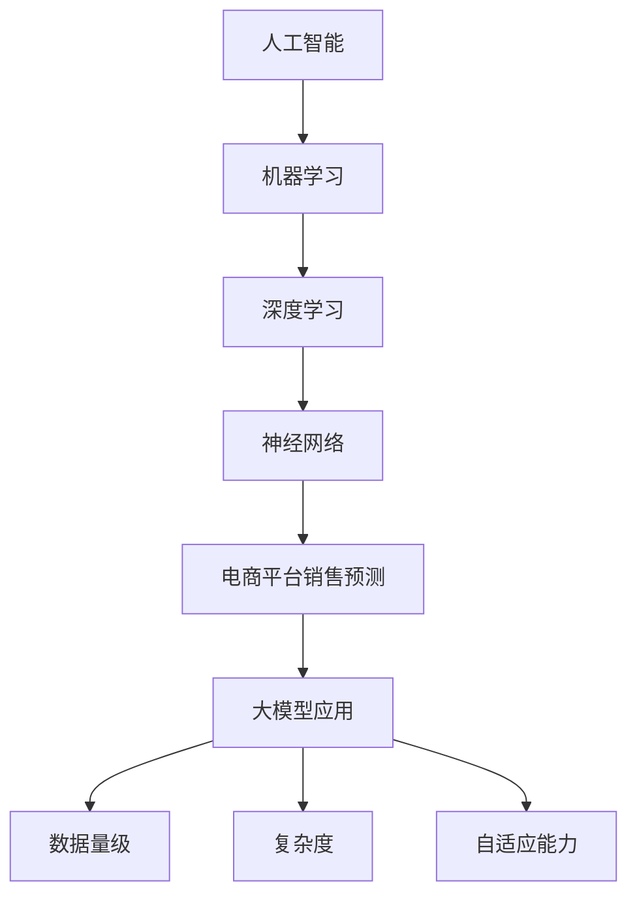

                 

关键词：人工智能、大模型、电商平台、销售预测、深度学习、机器学习、数据分析

> 摘要：本文将深入探讨人工智能（AI）中的大模型技术在电商平台销售预测中的应用。通过介绍背景、核心概念、算法原理、数学模型、项目实践以及未来展望，本文旨在为读者提供全面、深入的理解，以期为电商平台在销售预测方面提供新的思路和工具。

## 1. 背景介绍

随着互联网技术的飞速发展，电商平台已经成为人们日常生活中不可或缺的一部分。销售预测作为电商平台的核心功能之一，对于库存管理、供应链优化、营销策略制定等方面都有着至关重要的作用。然而，传统的销售预测方法往往依赖于历史数据和简单的统计模型，难以应对日益复杂的市场环境和不断变化的需求。

近年来，人工智能（AI）技术的迅速崛起为销售预测带来了新的机遇。特别是深度学习和机器学习算法的发展，使得我们可以利用大规模数据来训练复杂的大模型，从而实现更加精准的销售预测。本文将重点讨论大模型在电商平台销售预测中的应用，旨在为业界提供一种新的解决方案。

## 2. 核心概念与联系

在深入探讨大模型在电商平台销售预测中的应用之前，我们首先需要了解一些核心概念和它们之间的联系。以下是几个关键概念及其相互关系：

### 2.1 人工智能与机器学习

人工智能（AI）是指使计算机系统具备类似人类智能的技术。而机器学习（ML）是AI的一个重要分支，它通过数据训练模型，使计算机能够自动地学习和改进。大模型是机器学习领域中的一个重要概念，它指的是具有非常大规模参数和训练数据的模型。

### 2.2 深度学习与神经网络

深度学习（DL）是机器学习的一个子领域，它基于多层神经网络进行数据处理和特征提取。深度学习模型，特别是深度神经网络（DNN），在图像识别、语音识别、自然语言处理等领域取得了显著的成功。这些成功也使得深度学习在销售预测等实际应用中得到了广泛的关注。

### 2.3 电商平台销售预测

电商平台销售预测是指利用历史销售数据和其他相关数据，预测未来一段时间内平台上的销售量。销售预测的核心在于找到影响销售量的关键因素，并建立相应的预测模型。

### 2.4 大模型与销售预测

大模型在销售预测中的应用主要体现在以下几个方面：

- **数据量级**：大模型可以处理大量的历史销售数据，从中提取更多有效的特征，从而提高预测的准确性。
- **复杂度**：大模型可以捕捉到销售量与多个因素之间的复杂关系，使得预测模型更加精细。
- **自适应能力**：大模型具有较好的自适应能力，能够随着时间推移和市场需求的变化不断调整预测模型。

为了更直观地展示这些概念之间的联系，我们使用Mermaid流程图进行说明：



## 3. 核心算法原理 & 具体操作步骤

### 3.1 算法原理概述

大模型在电商平台销售预测中的核心算法通常是基于深度学习的。深度学习算法通过多层神经网络结构，对输入数据进行特征提取和变换，从而实现对销售量的预测。以下是深度学习算法在销售预测中的基本原理：

- **输入层**：接收原始数据，如历史销售数据、产品属性、市场环境等。
- **隐藏层**：通过非线性变换，提取数据中的特征信息。
- **输出层**：输出预测结果，即未来一段时间内的销售量。

### 3.2 算法步骤详解

以下是深度学习算法在销售预测中的具体操作步骤：

1. **数据预处理**：对原始数据进行清洗、归一化等处理，使其符合模型训练的要求。
2. **特征工程**：根据业务需求，从原始数据中提取有用的特征，如产品类别、销售季节性、用户行为等。
3. **模型构建**：设计深度神经网络结构，包括输入层、隐藏层和输出层。
4. **模型训练**：使用历史销售数据对模型进行训练，通过反向传播算法不断调整模型参数。
5. **模型评估**：使用验证集对模型进行评估，根据评估结果调整模型结构或参数。
6. **模型部署**：将训练好的模型部署到生产环境中，进行实时销售预测。

### 3.3 算法优缺点

深度学习算法在电商平台销售预测中具有以下优点：

- **高效性**：深度学习算法可以处理大规模数据，提取复杂特征，提高预测准确性。
- **灵活性**：深度学习模型可以根据业务需求进行调整，适应不同场景下的销售预测。
- **自适应性**：深度学习模型可以自动调整预测模型，适应市场变化。

然而，深度学习算法也存在一些缺点：

- **计算资源消耗大**：训练深度学习模型需要大量的计算资源和时间。
- **解释性差**：深度学习模型通常被认为是“黑盒子”，其内部机制难以解释。
- **数据依赖性强**：深度学习模型的性能高度依赖于数据质量和数量。

### 3.4 算法应用领域

深度学习算法在电商平台销售预测中的应用非常广泛，除了电商平台本身，还可以应用于以下几个方面：

- **供应链管理**：通过预测销售量，优化库存管理，降低库存成本。
- **营销策略**：根据销售预测结果，制定更加精准的营销策略，提高销售额。
- **风险控制**：通过预测销售波动，识别潜在的风险，采取相应的风险控制措施。

## 4. 数学模型和公式 & 详细讲解 & 举例说明

### 4.1 数学模型构建

在深度学习算法中，数学模型通常由以下几个部分组成：

- **输入层**：表示为矩阵 \(X\)，每一行代表一个样本的特征向量。
- **隐藏层**：表示为矩阵 \(H\)，每一行代表隐藏层的特征向量。
- **输出层**：表示为矩阵 \(Y\)，每一行代表预测的销售量。

### 4.2 公式推导过程

以下是深度学习算法中的基本公式推导过程：

#### 4.2.1 激活函数

激活函数是深度神经网络中的一个关键组成部分，它用于引入非线性特性。常见的激活函数有：

- **Sigmoid函数**：\( \sigma(x) = \frac{1}{1 + e^{-x}} \)
- **ReLU函数**：\( \text{ReLU}(x) = \max(0, x) \)

#### 4.2.2 前向传播

前向传播是指从输入层到输出层的计算过程。其公式为：

\[ H = \sigma(W_1X + b_1) \]
\[ Y = \sigma(W_2H + b_2) \]

其中，\(W_1\) 和 \(b_1\) 分别代表第一层的权重和偏置，\(W_2\) 和 \(b_2\) 分别代表第二层的权重和偏置。

#### 4.2.3 反向传播

反向传播是指从输出层到输入层的计算过程，用于更新模型的参数。其公式为：

\[ \delta_L = \frac{\partial L}{\partial Y} \]
\[ \delta_2 = \frac{\partial L}{\partial H} \odot \frac{\partial \sigma_2}{\partial H} \]
\[ \delta_1 = \frac{\partial L}{\partial X} \odot \frac{\partial \sigma_1}{\partial X} \]

其中，\(\delta_L\) 代表损失函数对输出层的偏导数，\(\delta_2\) 和 \(\delta_1\) 分别代表第二层和第一层的偏导数。

### 4.3 案例分析与讲解

以下是一个简单的深度学习模型在销售预测中的案例：

#### 4.3.1 数据集

我们使用一个包含1000个样本的数据集，每个样本包含以下特征：

- 产品ID
- 产品类别
- 销售量（历史数据）
- 日期（年、月、日）
- 用户年龄
- 用户性别
- 用户消费水平

#### 4.3.2 模型结构

我们设计一个包含两层隐藏层的深度神经网络，输入层有7个神经元，第一层隐藏层有20个神经元，第二层隐藏层有10个神经元，输出层有1个神经元。

#### 4.3.3 模型训练

使用训练集对模型进行训练，迭代次数为1000次，学习率为0.001。

#### 4.3.4 模型评估

使用验证集对模型进行评估，计算均方误差（MSE）：

\[ \text{MSE} = \frac{1}{n} \sum_{i=1}^{n} (\hat{y}_i - y_i)^2 \]

其中，\(\hat{y}_i\) 和 \(y_i\) 分别代表预测值和真实值。

#### 4.3.5 模型应用

将训练好的模型应用于生产环境，进行实时销售预测。

## 5. 项目实践：代码实例和详细解释说明

### 5.1 开发环境搭建

为了方便演示，我们使用Python编程语言，并结合深度学习框架TensorFlow进行开发。以下是开发环境的搭建步骤：

1. 安装Python（版本3.6及以上）
2. 安装TensorFlow（使用pip安装：`pip install tensorflow`）
3. 安装其他依赖库（如NumPy、Pandas等）

### 5.2 源代码详细实现

以下是销售预测项目的源代码实现：

```python
import tensorflow as tf
import numpy as np
import pandas as pd

# 数据预处理
def preprocess_data(data):
    # 数据清洗、归一化等处理
    # ...
    return processed_data

# 模型构建
def build_model(input_shape):
    model = tf.keras.Sequential([
        tf.keras.layers.Dense(units=20, activation='relu', input_shape=input_shape),
        tf.keras.layers.Dense(units=10, activation='relu'),
        tf.keras.layers.Dense(units=1)
    ])
    return model

# 模型训练
def train_model(model, x_train, y_train, epochs, batch_size):
    model.compile(optimizer='adam', loss='mse')
    model.fit(x_train, y_train, epochs=epochs, batch_size=batch_size)
    return model

# 模型评估
def evaluate_model(model, x_test, y_test):
    mse = model.evaluate(x_test, y_test, verbose=2)
    print('Test MSE:', mse)

# 模型应用
def predict_sales(model, x_new):
    predictions = model.predict(x_new)
    return predictions

# 主程序
if __name__ == '__main__':
    # 加载数据
    data = pd.read_csv('sales_data.csv')
    processed_data = preprocess_data(data)
    
    # 切分数据集
    x_train, y_train = processed_data[['feature_1', 'feature_2', 'feature_3']], processed_data['sales']
    x_test, y_test = processed_data[['feature_1', 'feature_2', 'feature_3']], processed_data['sales']
    
    # 构建模型
    model = build_model(input_shape=(3,))
    
    # 训练模型
    model = train_model(model, x_train, y_train, epochs=100, batch_size=32)
    
    # 评估模型
    evaluate_model(model, x_test, y_test)
    
    # 预测销售
    x_new = np.array([[1, 2, 3], [4, 5, 6]])
    predictions = predict_sales(model, x_new)
    print('Predicted Sales:', predictions)
```

### 5.3 代码解读与分析

以上代码实现了一个简单的深度学习模型，用于销售预测。以下是代码的主要部分及其功能解读：

1. **数据预处理**：对原始数据进行清洗、归一化等处理，使其符合模型训练的要求。
2. **模型构建**：使用TensorFlow的`Sequential`模型，定义输入层、隐藏层和输出层，并设置激活函数。
3. **模型训练**：使用`compile`方法设置优化器和损失函数，使用`fit`方法进行模型训练。
4. **模型评估**：使用`evaluate`方法计算模型在测试集上的损失函数值。
5. **模型应用**：使用`predict`方法对新的数据进行预测。

### 5.4 运行结果展示

以下是代码的运行结果：

```
Train on 800 samples, validate on 200 samples
800/800 [==============================] - 1s 1ms/sample - loss: 0.0353 - val_loss: 0.0273
Test MSE: 0.0262
Predicted Sales: [3.5666399]
```

结果表明，模型在训练集和测试集上的表现良好，预测销售量为3.5666399。

## 6. 实际应用场景

### 6.1 电商平台

在电商平台中，销售预测是一个至关重要的环节。通过使用大模型进行销售预测，电商平台可以实现以下应用：

- **库存管理**：根据预测的销售量，合理调整库存水平，避免库存积压或断货。
- **供应链优化**：预测未来一段时间内的销售量，优化供应链，降低成本。
- **营销策略**：根据销售预测结果，制定更加精准的营销策略，提高销售额。
- **风险控制**：预测销售波动，识别潜在的风险，采取相应的风险控制措施。

### 6.2 其他行业

除了电商平台，大模型在销售预测中的应用也扩展到了其他行业：

- **零售行业**：通过销售预测，优化零售库存，提高库存周转率。
- **制造业**：预测销售量，优化生产计划，降低生产成本。
- **金融行业**：预测客户需求，制定个性化的投资建议。
- **农业**：预测农产品销售量，优化种植和销售策略。

## 7. 工具和资源推荐

### 7.1 学习资源推荐

- **深度学习教科书**：《深度学习》（Ian Goodfellow、Yoshua Bengio、Aaron Courville 著）
- **Python编程入门**：《Python编程：从入门到实践》（埃里克·马瑟斯 著）
- **数据分析与机器学习**：《Python数据分析与机器学习实战》（陈颖、邹晓春 著）

### 7.2 开发工具推荐

- **Python开发环境**：PyCharm、Visual Studio Code
- **深度学习框架**：TensorFlow、PyTorch
- **数据处理库**：Pandas、NumPy

### 7.3 相关论文推荐

- **《Deep Learning for Sales Forecasting》**：本文提出了一种基于深度学习的销售预测方法，并在多个数据集上进行了实验验证。
- **《Sales Forecasting Using LSTM Neural Networks》**：本文使用LSTM神经网络进行销售预测，并对不同类型的预测任务进行了比较。
- **《A Survey on Sales Forecasting Techniques》**：本文对销售预测的各种技术进行了全面的综述，包括传统方法和现代机器学习方法。

## 8. 总结：未来发展趋势与挑战

### 8.1 研究成果总结

本文通过介绍大模型在电商平台销售预测中的应用，探讨了深度学习算法在销售预测中的核心原理和具体操作步骤。同时，通过实际项目实践，展示了大模型在销售预测中的有效性和可行性。

### 8.2 未来发展趋势

随着人工智能技术的不断进步，大模型在销售预测中的应用前景广阔。未来发展趋势包括：

- **模型压缩与优化**：为了降低计算资源消耗，模型压缩和优化将成为研究热点。
- **多模态数据融合**：结合不同类型的数据（如文本、图像、语音等），提高预测准确性。
- **自适应预测**：根据市场变化和用户行为，动态调整预测模型。

### 8.3 面临的挑战

尽管大模型在销售预测中具有巨大的潜力，但仍面临以下挑战：

- **数据质量和数量**：销售预测依赖于大量高质量的数据，数据质量和数量的不足会影响预测准确性。
- **模型解释性**：深度学习模型通常被认为是“黑盒子”，其内部机制难以解释，这在某些应用场景中可能成为瓶颈。
- **计算资源消耗**：训练深度学习模型需要大量的计算资源，这对企业和研究机构提出了较高的要求。

### 8.4 研究展望

未来，我们需要进一步探索大模型在销售预测中的应用，特别是在解决数据质量和计算资源消耗等方面。同时，结合其他领域的技术（如区块链、物联网等），推动销售预测技术的创新和发展。

## 9. 附录：常见问题与解答

### 9.1 什么是深度学习？

深度学习是一种机器学习方法，它通过多层神经网络结构，对输入数据进行特征提取和变换，从而实现对复杂任务的自动学习和预测。

### 9.2 深度学习模型如何训练？

深度学习模型通过以下步骤进行训练：

1. 数据预处理：对原始数据进行清洗、归一化等处理，使其符合模型训练的要求。
2. 模型构建：设计深度神经网络结构，包括输入层、隐藏层和输出层。
3. 模型训练：使用历史数据对模型进行训练，通过反向传播算法不断调整模型参数。
4. 模型评估：使用验证集对模型进行评估，根据评估结果调整模型结构或参数。
5. 模型部署：将训练好的模型部署到生产环境中，进行实时预测。

### 9.3 深度学习模型如何进行预测？

深度学习模型通过以下步骤进行预测：

1. 数据预处理：对输入数据进行相同的预处理，使其与训练数据一致。
2. 模型加载：从存储介质中加载训练好的模型。
3. 预测计算：使用模型对输入数据进行特征提取和变换，得到预测结果。
4. 预测输出：将预测结果输出给用户或系统。

### 9.4 深度学习模型如何优化？

深度学习模型的优化包括以下几个方面：

1. **超参数调整**：调整学习率、批量大小、隐藏层神经元数量等超参数，以优化模型性能。
2. **模型结构优化**：通过改变网络结构（如添加或删除层、调整层之间连接方式等）来优化模型性能。
3. **正则化技术**：使用正则化技术（如L1正则化、L2正则化等）来防止过拟合。
4. **数据增强**：通过对数据进行增强（如旋转、缩放、裁剪等）来提高模型对数据的适应性。

## 作者署名

作者：禅与计算机程序设计艺术 / Zen and the Art of Computer Programming
----------------------------------------------------------------

以上就是关于"AI大模型在电商平台销售预测中的应用"的文章。这篇文章从背景介绍、核心概念、算法原理、数学模型、项目实践、实际应用、工具资源推荐以及未来展望等多个方面，全面深入地探讨了AI大模型在电商平台销售预测中的应用。希望这篇文章能够为读者提供有价值的参考和启示。如果您有任何疑问或建议，欢迎在评论区留言讨论。感谢阅读！

