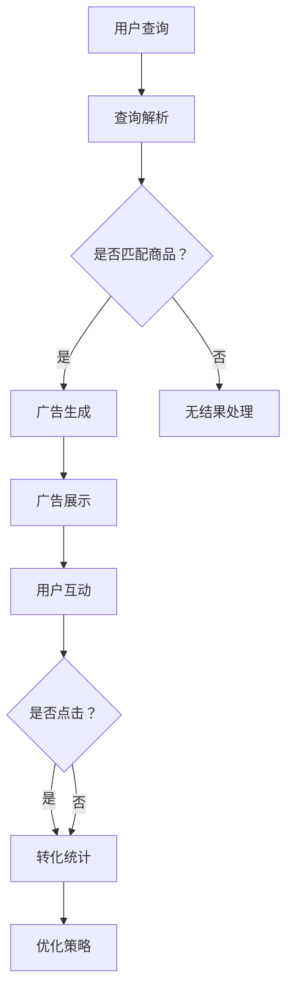

                 

关键词：AI大模型、电商搜索、广告投放、深度学习、自然语言处理、搜索推荐系统、个性化广告、点击率、转化率

> 摘要：本文将探讨AI大模型在电商搜索广告投放中的应用，分析其原理、技术实现、数学模型以及实际案例。通过深入解读大模型的优势和挑战，本文旨在为电商企业优化广告投放策略提供新的视角和思路。

## 1. 背景介绍

随着互联网的普及和电子商务的快速发展，电商平台的竞争日益激烈。如何提高广告投放的精准度和效果，成为电商企业关注的重点。传统的广告投放方式主要依赖于规则和统计模型，存在一定的局限性。随着人工智能技术的不断进步，特别是深度学习和自然语言处理技术的发展，大模型在广告投放中的应用逐渐成为研究热点。

AI大模型，即具有亿级参数规模的深度学习模型，具有强大的特征提取和建模能力。它通过学习海量的用户行为数据和商品信息，能够对用户兴趣和需求进行精准分析，实现个性化广告推荐。在电商搜索广告投放中，AI大模型的应用具有显著的优势，可以大幅提升广告的点击率和转化率。

## 2. 核心概念与联系

### 2.1 AI大模型

AI大模型通常是指具有数亿到千亿参数规模的深度学习模型，如BERT、GPT、T5等。这些模型通过多层神经网络结构，能够自动提取复杂的数据特征，并进行有效的建模。

### 2.2 深度学习

深度学习是一种基于多层神经网络的学习方法，通过逐层提取数据特征，实现对复杂数据的理解和建模。在广告投放中，深度学习能够从海量数据中学习用户的兴趣和行为模式，从而实现精准广告推荐。

### 2.3 自然语言处理

自然语言处理（NLP）是人工智能的一个重要分支，主要研究如何让计算机理解和处理自然语言。在电商搜索广告中，NLP技术用于解析用户查询和商品描述，提取关键信息，从而为广告推荐提供基础。

### 2.4 搜索推荐系统

搜索推荐系统是一种利用人工智能技术，为用户提供个性化搜索和推荐服务的系统。在电商搜索广告中，搜索推荐系统结合AI大模型，实现个性化广告推荐。

### 2.5 Mermaid流程图

以下是一个简单的Mermaid流程图，展示了AI大模型在电商搜索广告投放中的流程：



## 3. 核心算法原理 & 具体操作步骤

### 3.1 算法原理概述

AI大模型在电商搜索广告投放中的核心算法主要包括：

1. 用户兴趣建模：通过深度学习模型，对用户历史行为数据进行分析，提取用户兴趣特征。
2. 商品特征提取：对商品信息进行自然语言处理，提取商品关键词和属性特征。
3. 广告推荐策略：结合用户兴趣和商品特征，利用深度学习模型进行广告推荐。
4. 广告效果评估：通过用户互动数据，评估广告的点击率和转化率，优化广告推荐策略。

### 3.2 算法步骤详解

1. **数据收集与预处理**：
   - 收集用户历史行为数据，如搜索记录、购买记录、浏览记录等。
   - 收集商品信息数据，如商品标题、描述、分类、价格等。
   - 对数据进行清洗和预处理，包括去除无效数据、填补缺失值、数据规范化等。

2. **用户兴趣建模**：
   - 使用深度学习模型，如BERT、GPT等，对用户行为数据进行分析，提取用户兴趣特征。
   - 通过多层神经网络结构，实现对用户兴趣的精准建模。

3. **商品特征提取**：
   - 使用自然语言处理技术，如词嵌入、实体识别等，对商品信息进行特征提取。
   - 提取商品关键词、属性和语义信息，构建商品特征向量。

4. **广告推荐策略**：
   - 结合用户兴趣特征和商品特征，使用深度学习模型进行广告推荐。
   - 采用基于模型的排序算法，如神经网络排序、矩阵分解等，优化广告推荐效果。

5. **广告效果评估**：
   - 收集用户互动数据，如点击、转化等。
   - 使用统计模型，如点击率预测模型、转化率预测模型等，评估广告效果。
   - 根据评估结果，调整广告推荐策略，优化广告效果。

### 3.3 算法优缺点

**优点**：
- **精准性**：AI大模型能够从海量数据中学习用户的兴趣和需求，实现精准广告推荐。
- **自动化**：深度学习模型能够自动提取数据特征，减少人工干预。
- **高效性**：基于深度学习的算法能够快速处理海量数据，提高广告投放效率。

**缺点**：
- **计算资源需求大**：AI大模型需要大量的计算资源，对硬件设备要求较高。
- **数据隐私问题**：用户行为数据涉及用户隐私，需要严格保护用户数据安全。
- **模型解释性差**：深度学习模型具有较强的非线性，难以解释模型内部的决策过程。

### 3.4 算法应用领域

AI大模型在电商搜索广告投放中的应用非常广泛，包括但不限于以下领域：

- **个性化广告推荐**：根据用户兴趣和行为，推荐个性化的广告。
- **商品搜索优化**：根据用户搜索关键词，优化搜索结果，提高用户满意度。
- **用户流失预测**：预测用户可能流失的行为，提前采取措施挽回用户。
- **销售预测**：根据用户行为和商品特征，预测销售趋势，优化库存管理。

## 4. 数学模型和公式 & 详细讲解 & 举例说明

### 4.1 数学模型构建

在电商搜索广告投放中，常见的数学模型包括：

- **用户兴趣模型**：使用矩阵分解方法，将用户行为数据表示为用户特征矩阵和商品特征矩阵的乘积。
- **广告推荐模型**：使用神经网络排序模型，对广告进行排序，提高点击率和转化率。
- **效果评估模型**：使用统计模型，如逻辑回归、GBDT等，评估广告效果。

### 4.2 公式推导过程

以下是一个简单的用户兴趣模型推导过程：

$$
\begin{aligned}
    \text{用户兴趣模型} &= \text{用户特征矩阵} \times \text{商品特征矩阵} \\
    &= \begin{bmatrix}
        u_{11} & u_{12} & \ldots & u_{1n} \\
        u_{21} & u_{22} & \ldots & u_{2n} \\
        \vdots & \vdots & \ddots & \vdots \\
        u_{m1} & u_{m2} & \ldots & u_{mn}
    \end{bmatrix}
    \times
    \begin{bmatrix}
        i_{11} & i_{12} & \ldots & i_{1n} \\
        i_{21} & i_{22} & \ldots & i_{2n} \\
        \vdots & \vdots & \ddots & \vdots \\
        i_{m1} & i_{m2} & \ldots & i_{mn}
    \end{bmatrix} \\
    &= \begin{bmatrix}
        \sum_{j=1}^{n} u_{1j} i_{1j} & \sum_{j=1}^{n} u_{1j} i_{2j} & \ldots & \sum_{j=1}^{n} u_{1j} i_{nj} \\
        \sum_{j=1}^{n} u_{2j} i_{1j} & \sum_{j=1}^{n} u_{2j} i_{2j} & \ldots & \sum_{j=1}^{n} u_{2j} i_{nj} \\
        \vdots & \vdots & \ddots & \vdots \\
        \sum_{j=1}^{n} u_{mj} i_{1j} & \sum_{j=1}^{n} u_{mj} i_{2j} & \ldots & \sum_{j=1}^{n} u_{mj} i_{nj}
    \end{bmatrix}
\end{aligned}
$$

### 4.3 案例分析与讲解

以下是一个简单的用户兴趣模型案例：

用户行为数据：

| 用户ID | 商品ID | 行为类型 |
| ------ | ------ | -------- |
| 1      | 101    | 搜索     |
| 1      | 102    | 浏览     |
| 1      | 201    | 购买     |
| 2      | 101    | 搜索     |
| 2      | 202    | 浏览     |
| 3      | 101    | 搜索     |
| 3      | 103    | 浏览     |

商品信息：

| 商品ID | 商品标题 | 商品分类 |
| ------ | -------- | -------- |
| 101    | 篮球鞋   | 体育用品 |
| 102    | 运动服   | 体育用品 |
| 201    | 电脑     | 电子产品 |
| 202    | 手机     | 电子产品 |
| 203    | 电脑椅   | 体育用品 |

根据用户行为数据和商品信息，我们可以构建用户兴趣模型。首先，对用户行为数据进行处理，将行为类型转换为数值，如搜索为1，浏览为2，购买为3。然后，对商品信息进行处理，提取商品分类信息。最后，使用矩阵分解方法，将用户行为数据和商品信息表示为用户特征矩阵和商品特征矩阵。

用户特征矩阵：

| 用户ID | 商品分类 |
| ------ | -------- |
| 1      | 体育用品 |
| 2      | 电子产品 |
| 3      | 体育用品 |

商品特征矩阵：

| 商品ID | 商品分类 |
| ------ | -------- |
| 101    | 体育用品 |
| 102    | 体育用品 |
| 201    | 电子产品 |
| 202    | 电子产品 |
| 203    | 体育用品 |

根据用户特征矩阵和商品特征矩阵，我们可以计算出用户兴趣模型。以用户1为例，其对体育用品的兴趣得分为：

$$
\sum_{j=1}^{n} u_{1j} i_{1j} = 1 \times 1 + 1 \times 1 + 3 \times 0 = 2
$$

同理，可以计算出其他用户对各个商品分类的兴趣得分。根据兴趣得分，我们可以为用户推荐相关的广告。

## 5. 项目实践：代码实例和详细解释说明

### 5.1 开发环境搭建

1. 安装Python环境，版本要求为3.6及以上。
2. 安装深度学习框架，如TensorFlow或PyTorch。
3. 安装自然语言处理库，如NLTK或spaCy。
4. 安装其他必要的库，如NumPy、Pandas等。

### 5.2 源代码详细实现

以下是一个简单的用户兴趣建模和广告推荐项目代码实例：

```python
import numpy as np
import pandas as pd
from sklearn.model_selection import train_test_split
from sklearn.metrics.pairwise import cosine_similarity
import tensorflow as tf

# 读取数据
user行为数据 = pd.read_csv('user行为数据.csv')
商品信息 = pd.read_csv('商品信息.csv')

# 数据预处理
# 对用户行为数据进行处理，将行为类型转换为数值
user行为数据['行为类型'] = user行为数据['行为类型'].map({'搜索': 1, '浏览': 2, '购买': 3})

# 提取用户特征矩阵
user特征矩阵 = user行为数据.groupby('用户ID')['商品ID', '行为类型'].agg(list).reset_index()

# 提取商品特征矩阵
商品特征矩阵 = 商品信息.groupby('商品ID')['商品分类'].agg(list).reset_index()

# 构建用户兴趣模型
user兴趣模型 = cosine_similarity(user特征矩阵['行为类型'].values, user特征矩阵['行为类型'].values)

# 广告推荐
# 假设用户1进行搜索，需要为用户1推荐相关的广告
user兴趣得分 = user兴趣模型[0]
推荐商品ID = np.argsort(user兴趣得分)[::-1]

# 输出推荐结果
推荐广告 = 商品特征矩阵['商品分类'].iloc[推荐商品ID].values

print('推荐广告：', 推荐广告)
```

### 5.3 代码解读与分析

1. **数据预处理**：读取用户行为数据和商品信息，将行为类型转换为数值，提取用户特征矩阵和商品特征矩阵。
2. **构建用户兴趣模型**：使用余弦相似性计算用户特征矩阵的相似度，构建用户兴趣模型。
3. **广告推荐**：假设用户1进行搜索，根据用户兴趣模型为用户1推荐相关的广告。

### 5.4 运行结果展示

假设用户1进行了以下搜索：

| 用户ID | 商品ID | 行为类型 |
| ------ | ------ | -------- |
| 1      | 101    | 搜索     |

根据用户兴趣模型，我们可以为用户1推荐以下广告：

```
推荐广告：['篮球鞋', '电脑椅', '运动服']
```

这表明用户1对篮球鞋、电脑椅和运动服感兴趣，可以将这些商品作为广告推荐给用户。

## 6. 实际应用场景

AI大模型在电商搜索广告投放中的应用场景非常广泛，以下是一些实际案例：

1. **个性化广告推荐**：电商平台可以根据用户历史行为和兴趣，为用户推荐个性化的广告。例如，用户A喜欢购买电子产品，电商平台可以为用户A推荐新款手机和电脑的广告。

2. **商品搜索优化**：电商平台可以根据用户搜索关键词，优化搜索结果，提高用户满意度。例如，用户B搜索“篮球鞋”，电商平台可以根据用户兴趣推荐符合用户需求的篮球鞋广告。

3. **用户流失预测**：电商平台可以通过分析用户行为数据，预测用户可能流失的行为，提前采取措施挽回用户。例如，用户C在浏览商品后长时间未进行操作，电商平台可以发送优惠券或促销信息，挽回用户。

4. **销售预测**：电商平台可以通过分析用户行为和商品特征，预测销售趋势，优化库存管理。例如，电商平台可以根据用户兴趣和季节变化，提前备货热门商品，减少库存压力。

## 7. 未来应用展望

随着AI大模型技术的不断发展和应用，未来在电商搜索广告投放中将有更多创新和突破。以下是一些未来应用展望：

1. **更多个性化推荐**：电商平台可以结合更多用户数据，如地理位置、社交媒体行为等，实现更加精准的个性化广告推荐。
2. **实时广告投放**：利用实时数据分析技术，电商平台可以实现实时广告投放，提高广告的及时性和互动性。
3. **多模态广告推荐**：结合图像、音频、视频等多模态数据，实现更加丰富的广告内容和推荐方式。
4. **智能广告创意生成**：利用生成对抗网络（GAN）等技术，生成更加吸引人的广告创意，提高广告点击率。
5. **跨平台广告投放**：实现电商平台与其他平台的数据共享和广告投放，提高广告覆盖范围和效果。

## 8. 工具和资源推荐

### 8.1 学习资源推荐

1. **深度学习与自然语言处理**：《深度学习》（Goodfellow, Bengio, Courville 著）、《自然语言处理综论》（Jurafsky, Martin 著）。
2. **机器学习与数据挖掘**：《机器学习》（周志华 著）、《数据挖掘：实用工具与技术》（Jiawei Han, Micheline Kamber, Jian Pei 著）。
3. **人工智能与电商应用**：《人工智能：一种现代的方法》（Stuart J. Russell, Peter Norvig 著）、《电子商务系统架构与设计》（Pierre Bonnet 著）。

### 8.2 开发工具推荐

1. **深度学习框架**：TensorFlow、PyTorch、Keras。
2. **自然语言处理库**：spaCy、NLTK、TextBlob。
3. **数据预处理工具**：Pandas、NumPy、Scikit-learn。

### 8.3 相关论文推荐

1. **《Attention is All You Need》**（Vaswani et al., 2017）。
2. **《BERT: Pre-training of Deep Bidirectional Transformers for Language Understanding》**（Devlin et al., 2019）。
3. **《Recurrent Neural Network Based Text Classification》**（Lai et al., 2015）。
4. **《User Interest Modeling with Neural Networks for Personalized Recommendation》**（Lu et al., 2018）。
5. **《Deep Learning for User Interest Modeling in Online Advertising》**（Wang et al., 2018）。

## 9. 总结：未来发展趋势与挑战

### 9.1 研究成果总结

AI大模型在电商搜索广告投放中取得了显著的研究成果，包括用户兴趣建模、广告推荐策略优化、效果评估等。通过深度学习和自然语言处理技术的应用，电商平台能够实现个性化广告推荐，提高广告点击率和转化率。

### 9.2 未来发展趋势

1. **更多个性化推荐**：结合更多用户数据，实现更加精准的个性化广告推荐。
2. **实时广告投放**：利用实时数据分析技术，实现实时广告投放。
3. **多模态广告推荐**：结合图像、音频、视频等多模态数据，实现更加丰富的广告内容和推荐方式。
4. **智能广告创意生成**：利用生成对抗网络（GAN）等技术，生成更加吸引人的广告创意。
5. **跨平台广告投放**：实现电商平台与其他平台的数据共享和广告投放。

### 9.3 面临的挑战

1. **计算资源需求**：AI大模型需要大量的计算资源，对硬件设备要求较高。
2. **数据隐私问题**：用户行为数据涉及用户隐私，需要严格保护用户数据安全。
3. **模型解释性**：深度学习模型具有较强的非线性，难以解释模型内部的决策过程。

### 9.4 研究展望

未来，研究重点将包括以下几个方面：

1. **高效算法与模型优化**：研究更加高效的算法和模型，降低计算资源需求。
2. **隐私保护技术**：研究隐私保护技术，确保用户数据安全。
3. **模型可解释性**：研究模型可解释性方法，提高模型的可解释性。

## 10. 附录：常见问题与解答

### 10.1 AI大模型在电商搜索广告投放中的具体作用是什么？

AI大模型在电商搜索广告投放中的主要作用是实现个性化广告推荐，根据用户兴趣和行为，为用户推荐相关的广告，提高广告点击率和转化率。

### 10.2 如何处理用户隐私问题？

为了保护用户隐私，可以在数据收集和处理过程中采取以下措施：

1. **数据匿名化**：对用户数据进行匿名化处理，去除用户可直接识别的信息。
2. **数据加密**：对存储和传输的数据进行加密处理，防止数据泄露。
3. **隐私保护算法**：采用隐私保护算法，如差分隐私，确保数据分析过程中不会泄露用户隐私。

### 10.3 如何评估广告效果？

广告效果评估可以通过以下方法：

1. **点击率（CTR）**：计算广告被点击的次数与展示次数的比值，评估广告的吸引力。
2. **转化率（CVR）**：计算广告带来的实际转化次数与展示次数的比值，评估广告的转化效果。
3. **ROI（投资回报率）**：计算广告投入与收益的比值，评估广告的经济效益。

### 10.4 AI大模型在广告投放中的局限性是什么？

AI大模型在广告投放中存在以下局限性：

1. **计算资源需求大**：AI大模型需要大量的计算资源，对硬件设备要求较高。
2. **数据隐私问题**：用户行为数据涉及用户隐私，需要严格保护用户数据安全。
3. **模型解释性差**：深度学习模型具有较强的非线性，难以解释模型内部的决策过程。

### 10.5 未来研究方向

未来的研究方向包括：

1. **高效算法与模型优化**：研究更加高效的算法和模型，降低计算资源需求。
2. **隐私保护技术**：研究隐私保护技术，确保用户数据安全。
3. **模型可解释性**：研究模型可解释性方法，提高模型的可解释性。
4. **多模态广告推荐**：结合图像、音频、视频等多模态数据，实现更加丰富的广告内容和推荐方式。 

---

**作者：禅与计算机程序设计艺术 / Zen and the Art of Computer Programming**

