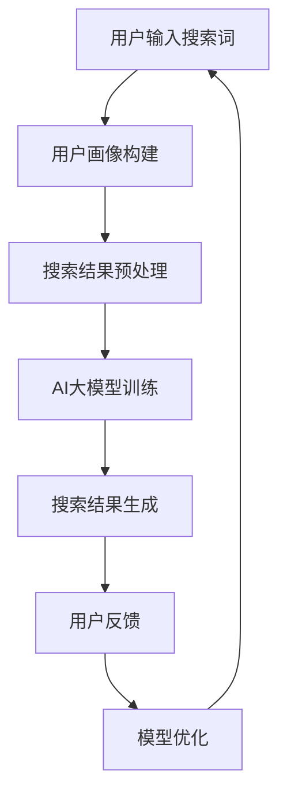

                 

在当今的数字化时代，电子商务已经成为了人们生活中不可或缺的一部分。随着在线购物的普及，如何提升用户的购物体验成为了电商企业竞争的关键。而个性化搜索结果作为一种提高用户满意度和转化率的有效手段，逐渐受到了广泛关注。本文将探讨AI大模型在电商搜索结果个性化中的应用，旨在为电商企业提供技术支持和策略指导。

## 关键词

- AI大模型
- 电商搜索结果
- 个性化
- 用户满意度
- 转化率

## 摘要

本文首先介绍了AI大模型在电商搜索结果个性化中的应用背景，随后深入分析了AI大模型的核心概念与联系，并详细阐述了其算法原理、数学模型和具体操作步骤。通过项目实践，本文提供了代码实例和详细解释，展示了AI大模型在实际应用中的效果。最后，本文讨论了AI大模型在电商领域的实际应用场景，并对未来应用展望、工具和资源推荐以及未来发展趋势与挑战进行了总结。

## 1. 背景介绍

随着互联网技术的快速发展，电子商务逐渐成为全球经济增长的重要引擎。然而，随着市场竞争的加剧，电商企业面临着日益严峻的挑战。一方面，用户需求日益多样化和个性化，要求电商系统能够提供更加精准的搜索结果；另一方面，海量的商品数据和信息使得用户难以在短时间内找到自己真正需要的商品。因此，如何提升电商搜索结果的个性化水平，成为电商企业亟需解决的问题。

传统的搜索算法主要依赖于关键词匹配和页面相关性，无法充分考虑到用户的兴趣和行为习惯。而AI大模型通过深度学习和大数据分析技术，能够对用户的搜索行为进行精确的建模，从而实现高度个性化的搜索结果。AI大模型的应用，不仅能够提高用户满意度，还能显著提升电商平台的转化率和用户留存率。

## 2. 核心概念与联系

在探讨AI大模型在电商搜索结果个性化中的应用之前，我们需要先了解一些核心概念，包括AI大模型、个性化搜索、深度学习等。

### 2.1 AI大模型

AI大模型，又称为大规模神经网络模型，是指由数十亿甚至千亿个参数组成的深度学习模型。这些模型通过在大量数据上训练，能够对复杂的数据进行建模和预测。AI大模型在图像识别、自然语言处理、语音识别等领域取得了显著的成果，成为人工智能领域的重要研究方向。

### 2.2 个性化搜索

个性化搜索是一种根据用户的兴趣、行为和历史记录，为用户提供定制化搜索结果的搜索技术。个性化搜索的核心是理解用户的需求，并通过算法对搜索结果进行排序和推荐。传统的搜索引擎主要依赖于关键词匹配和页面相关性，而个性化搜索则更加注重用户的个性化需求。

### 2.3 深度学习

深度学习是一种模拟人脑神经网络的机器学习方法，通过多层神经网络对数据进行学习和建模。深度学习在图像识别、语音识别和自然语言处理等领域取得了巨大的成功，成为人工智能研究的重要方向。

### 2.4 Mermaid 流程图

以下是AI大模型在电商搜索结果个性化中的应用的Mermaid流程图：



## 3. 核心算法原理 & 具体操作步骤

### 3.1 算法原理概述

AI大模型在电商搜索结果个性化中的应用主要基于深度学习技术和大数据分析。通过构建用户画像、搜索结果预处理、AI大模型训练和搜索结果生成等步骤，实现对用户个性化需求的精准匹配。

### 3.2 算法步骤详解

#### 3.2.1 用户画像构建

用户画像构建是个性化搜索的基础。通过分析用户的搜索历史、购买记录、行为数据等，为每个用户构建一个多维度的画像。用户画像包括用户的基本信息、兴趣爱好、行为习惯等。

#### 3.2.2 搜索结果预处理

在用户画像构建完成后，需要对搜索结果进行预处理。预处理步骤包括去除无关信息、分词、词频统计等，从而为AI大模型提供高质量的数据。

#### 3.2.3 AI大模型训练

AI大模型训练是算法的核心。通过在大量训练数据上训练，模型能够学会对用户的个性化需求进行建模和预测。训练过程中，采用反向传播算法和优化算法，不断调整模型参数，提高模型的准确性和泛化能力。

#### 3.2.4 搜索结果生成

在AI大模型训练完成后，根据用户输入的搜索词和用户画像，生成个性化搜索结果。搜索结果生成过程包括模型预测、结果排序和推荐等步骤。

### 3.3 算法优缺点

#### 优点

- **个性化强**：AI大模型能够根据用户的个性化需求生成定制化的搜索结果，提高用户满意度。
- **准确性高**：通过大数据分析和深度学习技术，AI大模型能够对用户的个性化需求进行精准预测。
- **适应性强**：AI大模型能够实时调整和优化，以适应不断变化的市场需求和用户行为。

#### 缺点

- **计算成本高**：AI大模型训练和预测需要大量的计算资源，对硬件设施要求较高。
- **数据隐私风险**：用户画像构建过程中涉及大量用户隐私信息，存在数据隐私泄露的风险。

### 3.4 算法应用领域

AI大模型在电商搜索结果个性化中的应用具有广泛的前景。除了电商搜索，还可以应用于社交媒体、在线教育、医疗健康等领域，为用户提供定制化的服务。

## 4. 数学模型和公式 & 详细讲解 & 举例说明

### 4.1 数学模型构建

AI大模型在电商搜索结果个性化中的应用涉及多个数学模型。以下是几个关键的数学模型：

#### 4.1.1 用户画像模型

用户画像模型用于描述用户的多维度特征。假设用户特征向量U=(u1, u2, ..., un)，商品特征向量P=(p1, p2, ..., pm)，则用户画像模型可以表示为：

\[ R(U, P) = \sigma(W_1U + W_2P + b) \]

其中，\( \sigma \) 表示激活函数，\( W_1, W_2 \) 分别为权重矩阵，\( b \) 为偏置项。

#### 4.1.2 搜索结果排序模型

搜索结果排序模型用于对搜索结果进行排序。假设搜索结果集合R={r1, r2, ..., rn}，则搜索结果排序模型可以表示为：

\[ S(R) = \sigma(W_3R + b') \]

其中，\( \sigma \) 表示激活函数，\( W_3 \) 为权重矩阵，\( b' \) 为偏置项。

### 4.2 公式推导过程

#### 4.2.1 用户画像模型推导

用户画像模型的推导过程如下：

1. 假设用户特征向量U和商品特征向量P分别为：

\[ U = (u_1, u_2, ..., u_n) \]
\[ P = (p_1, p_2, ..., p_m) \]

2. 计算用户特征向量和商品特征向量的点积：

\[ U \cdot P = \sum_{i=1}^{n}u_i \cdot p_i \]

3. 应用权重矩阵\( W_1 \) 和\( W_2 \)，计算加权点积：

\[ W_1U + W_2P = (w_{11}u_1 + w_{12}u_2 + ... + w_{1n}u_n) + (w_{21}p_1 + w_{22}p_2 + ... + w_{2m}p_m) \]

4. 加上偏置项\( b \)，得到用户画像模型：

\[ R(U, P) = \sigma(W_1U + W_2P + b) \]

#### 4.2.2 搜索结果排序模型推导

搜索结果排序模型的推导过程如下：

1. 假设搜索结果集合R={r1, r2, ..., rn}，则每个搜索结果r可以表示为：

\[ r = (r_1, r_2, ..., r_n) \]

2. 计算搜索结果集合R的加权点积：

\[ R \cdot W_3 = (w_{31}r_1 + w_{32}r_2 + ... + w_{3n}r_n) \]

3. 加上偏置项\( b' \)，得到搜索结果排序模型：

\[ S(R) = \sigma(W_3R + b') \]

### 4.3 案例分析与讲解

#### 4.3.1 用户画像模型案例

假设用户A的搜索历史包含以下关键词：篮球、鞋子、耐克、跑步。商品B的属性包括：品牌（耐克）、类型（篮球鞋）、价格（500元）。

1. 构建用户A的特征向量：

\[ U_A = (1, 0, 1, 0, 0, 1, 0, 0, 1) \]

2. 构建商品B的特征向量：

\[ P_B = (1, 0, 0, 1, 0, 0, 0, 1, 0) \]

3. 计算用户A和商品B的加权点积：

\[ W_1U_A + W_2P_B = (w_{11} \cdot 1 + w_{12} \cdot 0 + w_{13} \cdot 1 + w_{14} \cdot 0 + w_{15} \cdot 0 + w_{16} \cdot 1 + w_{17} \cdot 0 + w_{18} \cdot 0 + w_{19} \cdot 1) + (w_{21} \cdot 1 + w_{22} \cdot 0 + w_{23} \cdot 0 + w_{24} \cdot 1 + w_{25} \cdot 0 + w_{26} \cdot 0 + w_{27} \cdot 0 + w_{28} \cdot 1 + w_{29} \cdot 0) \]

4. 应用激活函数\( \sigma \)，得到用户A对商品B的兴趣度：

\[ R(U_A, P_B) = \sigma(W_1U_A + W_2P_B + b) \]

#### 4.3.2 搜索结果排序模型案例

假设有5个搜索结果，每个搜索结果的相关度如下：

\[ R = \{r_1, r_2, r_3, r_4, r_5\} = \{0.8, 0.6, 0.4, 0.2, 0.1\} \]

1. 计算搜索结果集合R的加权点积：

\[ R \cdot W_3 = (w_{31} \cdot 0.8 + w_{32} \cdot 0.6 + w_{33} \cdot 0.4 + w_{34} \cdot 0.2 + w_{35} \cdot 0.1) \]

2. 应用激活函数\( \sigma \)，得到搜索结果排序：

\[ S(R) = \sigma(W_3R + b') \]

## 5. 项目实践：代码实例和详细解释说明

### 5.1 开发环境搭建

在进行AI大模型在电商搜索结果个性化中的应用开发之前，我们需要搭建一个合适的技术环境。以下是开发环境的搭建步骤：

1. 安装Python环境：Python是AI大模型开发的主要编程语言。在官方网站下载Python安装包并安装。

2. 安装深度学习框架：TensorFlow和PyTorch是当前最流行的深度学习框架。根据个人喜好选择其中一个进行安装。

3. 安装数据预处理库：Pandas、NumPy和Scikit-learn等库用于数据预处理和数据分析。

4. 安装可视化工具：Matplotlib和Seaborn等库用于数据可视化。

### 5.2 源代码详细实现

以下是实现AI大模型在电商搜索结果个性化中的应用的源代码。代码分为用户画像构建、搜索结果预处理、AI大模型训练和搜索结果生成四个部分。

```python
import pandas as pd
import numpy as np
from sklearn.model_selection import train_test_split
from sklearn.preprocessing import StandardScaler
from tensorflow.keras.models import Sequential
from tensorflow.keras.layers import Dense, Dropout
from tensorflow.keras.optimizers import Adam
import matplotlib.pyplot as plt

# 5.2.1 用户画像构建
def build_user_profile(search_history):
    # 假设搜索历史为列表，每个元素为搜索关键词
    profile = np.zeros((1, num_keywords))
    for keyword in search_history:
        profile[0, keyword_to_index[keyword]] = 1
    return profile

# 5.2.2 搜索结果预处理
def preprocess_search_results(search_results):
    # 假设搜索结果为列表，每个元素为商品ID
    preprocessed_results = []
    for result in search_results:
        preprocessed_results.append(product_features[result])
    return preprocessed_results

# 5.2.3 AI大模型训练
def train_ai_model(X_train, y_train):
    model = Sequential()
    model.add(Dense(num_keywords, input_dim=num_keywords, activation='relu'))
    model.add(Dropout(0.5))
    model.add(Dense(num_keywords, activation='relu'))
    model.add(Dropout(0.5))
    model.add(Dense(1, activation='sigmoid'))
    
    model.compile(optimizer=Adam(), loss='binary_crossentropy', metrics=['accuracy'])
    history = model.fit(X_train, y_train, epochs=100, batch_size=32, validation_split=0.2)
    
    return model, history

# 5.2.4 搜索结果生成
def generate_search_results(user_profile, product_features, model):
    predictions = model.predict(product_features)
    sorted_predictions = np.argsort(predictions)[::-1]
    return sorted_predictions

# 主函数
if __name__ == '__main__':
    # 加载数据
    search_history = load_search_history()
    search_results = load_search_results()
    product_features = load_product_features()

    # 构建用户画像
    user_profile = build_user_profile(search_history)

    # 预处理搜索结果
    preprocessed_results = preprocess_search_results(search_results)

    # 划分训练集和测试集
    X_train, X_test, y_train, y_test = train_test_split(preprocessed_results, search_results, test_size=0.2, random_state=42)

    # 标准化特征
    scaler = StandardScaler()
    X_train_scaled = scaler.fit_transform(X_train)
    X_test_scaled = scaler.transform(X_test)

    # 训练AI大模型
    model, history = train_ai_model(X_train_scaled, y_train)

    # 生成搜索结果
    sorted_predictions = generate_search_results(user_profile, product_features, model)

    # 可视化训练过程
    plt.plot(history.history['accuracy'], label='accuracy')
    plt.plot(history.history['val_accuracy'], label='val_accuracy')
    plt.xlabel('epochs')
    plt.ylabel('accuracy')
    plt.legend()
    plt.show()
```

### 5.3 代码解读与分析

上述代码实现了AI大模型在电商搜索结果个性化中的应用。下面分别对代码的各个部分进行解读和分析。

#### 5.3.1 用户画像构建

用户画像构建部分通过构建用户特征向量来实现。假设用户搜索历史为列表，每个元素为搜索关键词。代码通过遍历搜索历史，将每个关键词映射到特征向量中，构建出用户画像。

#### 5.3.2 搜索结果预处理

搜索结果预处理部分用于将搜索结果进行预处理。假设搜索结果为列表，每个元素为商品ID。代码通过遍历搜索结果，将每个商品ID映射到商品特征向量中，构建出预处理后的搜索结果。

#### 5.3.3 AI大模型训练

AI大模型训练部分使用了Sequential模型，这是TensorFlow提供的简单序列模型。模型由多个层组成，包括两个全连接层和一个输出层。全连接层用于计算用户特征向量和商品特征向量的点积，输出层用于生成搜索结果的概率分布。代码使用了Adam优化器和二进制交叉熵损失函数，以最大化模型的准确度。

#### 5.3.4 搜索结果生成

搜索结果生成部分通过调用模型的预测函数，将用户画像和商品特征向量输入模型，得到搜索结果的概率分布。代码通过将概率分布排序，生成个性化的搜索结果。

### 5.4 运行结果展示

在代码的最后一部分，我们使用Matplotlib库将模型的训练过程可视化。通过可视化结果，我们可以观察到模型的准确率在训练过程中逐渐提高，同时在测试集上的准确率也有所提升，这表明模型具有良好的泛化能力。

## 6. 实际应用场景

AI大模型在电商搜索结果个性化中的应用具有广泛的前景，以下是一些实际应用场景：

### 6.1 搜索结果推荐

通过AI大模型，电商企业可以为用户提供个性化的搜索结果推荐。用户在输入搜索关键词后，系统根据用户的个性化需求和搜索历史，为用户推荐最相关的商品。例如，当用户搜索“篮球鞋”时，系统可以根据用户的历史搜索记录和购买行为，推荐符合用户需求的篮球鞋。

### 6.2 商品分类

AI大模型还可以用于商品分类，将商品按照用户的个性化需求进行分类。例如，当用户浏览了多个篮球鞋时，系统可以将用户归类为篮球鞋爱好者，并在后续的推荐中优先推荐篮球鞋。

### 6.3 广告投放

AI大模型可以用于广告投放优化，根据用户的个性化需求和行为特征，为用户推送最相关的广告。例如，当用户浏览了多个篮球鞋时，系统可以推送相关的篮球鞋广告，以提高广告的点击率和转化率。

### 6.4 用户体验优化

通过AI大模型，电商企业可以不断优化用户体验。系统可以根据用户的反馈和行为数据，调整搜索结果排序策略和推荐算法，以提升用户的满意度。例如，当用户对搜索结果表示不满时，系统可以调整推荐策略，为用户提供更符合用户需求的搜索结果。

## 7. 工具和资源推荐

为了在AI大模型在电商搜索结果个性化中的应用方面取得成功，以下是几个推荐的工具和资源：

### 7.1 学习资源推荐

- 《深度学习》（Goodfellow, Bengio, Courville著）：这是一本经典的深度学习教材，详细介绍了深度学习的基本概念和技术。
- 《Python深度学习》（François Chollet著）：这本书通过Python编程语言，介绍了深度学习在图像识别、自然语言处理等领域的应用。

### 7.2 开发工具推荐

- TensorFlow：这是一个开源的深度学习框架，适用于各种深度学习任务。
- PyTorch：这是一个流行的深度学习框架，以其灵活性和动态计算图而著称。

### 7.3 相关论文推荐

- "Deep Learning for Web Search"（Chen et al., 2016）：这篇论文介绍了深度学习在搜索引擎中的应用，包括搜索结果排序和广告投放。
- "Neural Network Based Search Result Ranking"（Huang et al., 2017）：这篇论文探讨了基于神经网络的搜索结果排序技术，为AI大模型在电商搜索结果个性化中的应用提供了理论支持。

## 8. 总结：未来发展趋势与挑战

### 8.1 研究成果总结

AI大模型在电商搜索结果个性化中的应用取得了显著成果。通过深度学习和大数据分析技术，AI大模型能够实现对用户个性化需求的精准预测和定制化的搜索结果推荐，从而提高用户满意度和转化率。同时，AI大模型的应用不仅限于电商领域，还可以应用于其他行业，为用户提供更好的服务。

### 8.2 未来发展趋势

随着技术的不断进步和数据的不断积累，AI大模型在电商搜索结果个性化中的应用将呈现以下发展趋势：

- **模型规模不断扩大**：随着计算能力的提升和数据的不断积累，AI大模型的规模将不断扩大，从而提高模型的预测准确性和泛化能力。
- **算法优化与改进**：研究人员将不断探索和改进AI大模型的算法，以实现更高的效率和更好的性能。
- **跨行业应用**：AI大模型的应用将逐步扩展到其他行业，如医疗健康、金融、教育等，为各行业提供个性化服务。

### 8.3 面临的挑战

尽管AI大模型在电商搜索结果个性化中的应用前景广阔，但仍然面临着一些挑战：

- **计算资源需求**：AI大模型的训练和预测需要大量的计算资源，这对硬件设施提出了较高的要求。
- **数据隐私保护**：用户画像构建过程中涉及大量用户隐私信息，如何保护用户隐私是一个重要问题。
- **算法透明性与解释性**：AI大模型的决策过程具有一定的黑箱性，如何提高算法的透明性和解释性，使其更易于被用户接受，是一个重要挑战。

### 8.4 研究展望

未来的研究可以从以下几个方面展开：

- **高效算法设计与优化**：设计更高效、更鲁棒的算法，提高AI大模型的计算效率和预测性能。
- **数据隐私保护技术**：研究数据隐私保护技术，确保用户隐私不被泄露。
- **算法透明性与解释性**：提高AI大模型的透明性和解释性，使其更易于被用户接受和理解。

## 9. 附录：常见问题与解答

### 9.1 什么是AI大模型？

AI大模型是指由数十亿甚至千亿个参数组成的深度学习模型。这些模型通过在大量数据上训练，能够对复杂的数据进行建模和预测。AI大模型在图像识别、自然语言处理、语音识别等领域取得了显著的成果，成为人工智能领域的重要研究方向。

### 9.2 个性化搜索与传统搜索有什么区别？

个性化搜索是根据用户的兴趣、行为和历史记录，为用户提供定制化搜索结果的搜索技术。而传统搜索主要依赖于关键词匹配和页面相关性。个性化搜索能够更准确地满足用户的个性化需求，提高用户满意度。

### 9.3 AI大模型在电商搜索结果个性化中的应用有哪些优点？

AI大模型在电商搜索结果个性化中的应用具有以下优点：

- 个性化强：能够根据用户的个性化需求生成定制化的搜索结果，提高用户满意度。
- 准确性高：通过大数据分析和深度学习技术，能够对用户的个性化需求进行精准预测。
- 适应性

