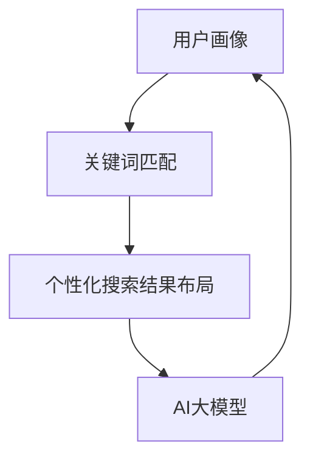

                 

关键词：AI大模型、电商搜索、个性化布局、算法原理、数学模型、项目实践

摘要：本文探讨了AI大模型在电商搜索结果个性化布局中的应用，通过深入分析核心概念与联系，详细阐述了核心算法原理及操作步骤，并构建了数学模型进行公式推导。文章还结合实际项目，展示了代码实例和运行结果，探讨了AI大模型在实际应用场景中的效果和未来展望。

## 1. 背景介绍

随着互联网技术的飞速发展，电子商务已经成为人们日常生活中不可或缺的一部分。电商平台在为消费者提供丰富商品的同时，也需要为消费者提供高效、准确的搜索服务。传统的电商搜索结果往往基于关键词匹配，虽然能够满足基本的搜索需求，但无法满足消费者个性化的购物需求。随着人工智能技术的进步，尤其是AI大模型的发展，个性化搜索结果布局成为电商领域的重要研究方向。

个性化搜索结果布局旨在根据用户的兴趣、购物历史、行为偏好等因素，为用户提供更加精准的搜索结果。这一目标不仅能够提升用户体验，还能提高电商平台的经济效益。因此，如何利用AI大模型实现有效的个性化搜索结果布局，成为当前研究的热点问题。

本文将围绕AI大模型在电商搜索结果个性化布局中的应用，深入探讨核心概念、算法原理、数学模型以及项目实践。通过本文的阐述，希望为相关领域的研究者和实践者提供有益的参考。

## 2. 核心概念与联系

在探讨AI大模型在电商搜索结果个性化布局中的应用之前，我们需要了解一些核心概念，以及它们之间的联系。以下是对这些核心概念的详细说明。

### 2.1 用户画像

用户画像是指通过对用户在电商平台的浏览、购买、评价等行为数据进行分析，构建出的用户特征模型。用户画像包括用户的基本信息（如年龄、性别、地理位置等）、兴趣偏好（如喜欢的商品类别、品牌等）、行为特征（如浏览时长、购买频次等）等多个方面。

用户画像为个性化搜索结果布局提供了关键数据支撑，通过用户画像可以了解用户的需求和偏好，从而实现精准推荐。

### 2.2 关键词匹配

关键词匹配是传统电商搜索的核心技术，通过将用户输入的关键词与商品标题、描述等信息进行匹配，从而返回相关搜索结果。虽然关键词匹配能够满足基本的搜索需求，但无法满足用户个性化的购物需求。

### 2.3 个性化搜索结果布局

个性化搜索结果布局是指根据用户的兴趣、购物历史、行为偏好等因素，对搜索结果进行排序和展示。通过个性化搜索结果布局，可以为用户提供更加精准的搜索结果，提升用户体验。

### 2.4 AI大模型

AI大模型是指具有大规模训练数据、高度参数化的神经网络模型。常见的AI大模型包括深度学习模型、自然语言处理模型等。AI大模型能够通过学习和理解用户行为数据，实现对用户需求的精准预测和推荐。

### 2.5 数学模型

数学模型是对现实问题进行定量描述和分析的工具。在AI大模型在电商搜索结果个性化布局中的应用中，数学模型用于构建用户画像、关键词匹配、个性化搜索结果布局等算法。

### 2.6 联系与融合

用户画像、关键词匹配、个性化搜索结果布局和AI大模型之间存在着密切的联系。用户画像是构建个性化搜索结果的基础，关键词匹配是实现搜索功能的核心，个性化搜索结果布局是提升用户体验的关键，而AI大模型则为上述三个环节提供了强大的技术支持。

通过将用户画像、关键词匹配、个性化搜索结果布局和AI大模型进行融合，可以实现一个完整的个性化搜索结果布局系统。以下是一个简单的Mermaid流程图，展示了这些核心概念之间的联系：



## 3. 核心算法原理 & 具体操作步骤

### 3.1 算法原理概述

AI大模型在电商搜索结果个性化布局中的应用，主要包括以下几个步骤：

1. **数据收集与预处理**：收集用户在电商平台的浏览、购买、评价等行为数据，对数据进行分析和处理，构建用户画像。
2. **关键词匹配**：根据用户输入的关键词，与商品标题、描述等信息进行匹配，生成初步的搜索结果。
3. **个性化搜索结果排序**：利用AI大模型，对初步搜索结果进行排序，根据用户的兴趣、购物历史、行为偏好等因素，为用户提供个性化的搜索结果。
4. **结果展示**：将排序后的个性化搜索结果展示给用户。

### 3.2 算法步骤详解

下面我们详细讲解每个步骤的具体操作。

#### 3.2.1 数据收集与预处理

数据收集与预处理是构建用户画像的基础。具体步骤如下：

1. **数据收集**：从电商平台的数据仓库中，收集用户的浏览、购买、评价等行为数据。这些数据可以包括用户ID、商品ID、浏览时间、购买时间、评价内容等。
2. **数据清洗**：对收集到的数据进行清洗，去除重复、错误、缺失的数据，确保数据的准确性和完整性。
3. **数据转换**：将清洗后的数据进行转换，将其转化为可以用于模型训练的格式。例如，可以将用户的行为数据转换为稀疏矩阵，便于后续处理。

#### 3.2.2 关键词匹配

关键词匹配是搜索结果生成的重要步骤。具体步骤如下：

1. **关键词提取**：从用户输入的关键词中，提取出关键词列表。可以使用自然语言处理技术，如分词、词性标注等，对关键词进行提取。
2. **匹配算法**：将提取出的关键词与商品标题、描述等信息进行匹配。常用的匹配算法包括模糊匹配、最长公共子串匹配等。
3. **初步搜索结果生成**：根据关键词匹配结果，生成初步的搜索结果列表。初步搜索结果可以根据匹配度进行排序。

#### 3.2.3 个性化搜索结果排序

个性化搜索结果排序是提升用户体验的关键步骤。具体步骤如下：

1. **用户画像构建**：根据用户在电商平台的行为数据，构建用户画像。用户画像可以包括用户的兴趣偏好、行为特征等多个方面。
2. **搜索结果特征提取**：对初步搜索结果中的商品进行特征提取。这些特征可以包括商品的种类、品牌、价格等。
3. **模型训练与预测**：利用AI大模型，对用户画像和商品特征进行训练，构建个性化搜索结果排序模型。训练完成后，可以使用模型对搜索结果进行预测和排序。
4. **结果排序**：根据模型预测的结果，对搜索结果进行排序，生成个性化的搜索结果列表。

#### 3.2.4 结果展示

结果展示是将个性化搜索结果呈现给用户的关键步骤。具体步骤如下：

1. **结果筛选**：根据电商平台的业务需求和用户体验，对个性化搜索结果进行筛选和过滤，去除不符合用户需求的商品。
2. **结果展示**：将筛选后的个性化搜索结果展示给用户。可以采用瀑布流、网格等多种展示方式，提升用户体验。

### 3.3 算法优缺点

AI大模型在电商搜索结果个性化布局中的应用具有以下优点和缺点：

#### 优点：

1. **高精准度**：通过用户画像和个性化搜索结果排序，可以为用户提供高度精准的搜索结果，提升用户体验。
2. **自适应能力**：AI大模型能够根据用户的行为数据不断学习和调整，实现自适应搜索结果排序，满足用户不断变化的需求。
3. **高效处理能力**：AI大模型具有强大的计算能力和处理能力，能够快速处理大规模数据，实现高效的搜索结果生成。

#### 缺点：

1. **数据依赖性**：AI大模型在训练和预测过程中，高度依赖用户的行为数据。如果数据质量不佳或数据量不足，可能导致搜索结果不准确。
2. **计算资源消耗**：AI大模型训练和预测需要大量的计算资源，对于一些小型电商平台，可能存在计算资源不足的问题。
3. **模型解释性较差**：AI大模型通常具有较深的网络结构和复杂的模型参数，导致其解释性较差，难以理解模型的决策过程。

### 3.4 算法应用领域

AI大模型在电商搜索结果个性化布局中的应用，不仅限于电商平台，还可以应用于其他领域，如在线教育、社交媒体、搜索引擎等。以下是一些具体的应用领域：

1. **在线教育**：通过AI大模型，可以根据学生的学习行为和兴趣，为其推荐适合的学习课程和资源，提升学习效果。
2. **社交媒体**：通过AI大模型，可以根据用户的社交行为和兴趣，为其推荐感兴趣的朋友、话题和内容，提升社交体验。
3. **搜索引擎**：通过AI大模型，可以根据用户的搜索历史和兴趣，为其推荐相关的搜索结果，提升搜索引擎的用户体验。

## 4. 数学模型和公式 & 详细讲解 & 举例说明

在AI大模型在电商搜索结果个性化布局中的应用中，数学模型是算法的核心组成部分。以下将详细介绍数学模型的构建、公式推导过程，并通过具体案例进行讲解。

### 4.1 数学模型构建

#### 4.1.1 用户画像模型

用户画像模型用于描述用户的行为特征和兴趣偏好。假设用户的行为数据可以表示为一个n维向量，其中每个维度表示一个特定的行为特征。用户画像模型可以表示为：

\[ U = [u_1, u_2, ..., u_n] \]

其中，\( u_i \) 表示用户在第i个行为特征上的得分。

#### 4.1.2 商品特征模型

商品特征模型用于描述商品的各种属性，如种类、品牌、价格等。假设商品的特征可以表示为一个m维向量，其中每个维度表示一个特定的商品属性。商品特征模型可以表示为：

\[ G = [g_1, g_2, ..., g_m] \]

其中，\( g_j \) 表示商品在第j个特征上的得分。

#### 4.1.3 用户兴趣模型

用户兴趣模型用于描述用户对不同商品类别的兴趣程度。假设用户兴趣可以表示为一个k维向量，其中每个维度表示一个特定的商品类别。用户兴趣模型可以表示为：

\[ I = [i_1, i_2, ..., i_k] \]

其中，\( i_j \) 表示用户对第j个商品类别的兴趣程度。

### 4.2 公式推导过程

#### 4.2.1 用户兴趣得分计算

用户兴趣得分可以通过计算用户兴趣模型和商品特征模型的内积得到：

\[ J = G \cdot I = \sum_{j=1}^{k} g_j i_j \]

其中，\( J \) 表示用户兴趣得分，\( g_j \) 和 \( i_j \) 分别表示商品特征模型和用户兴趣模型在第j个特征上的得分。

#### 4.2.2 用户画像相似度计算

用户画像相似度可以通过计算用户画像之间的余弦相似度得到：

\[ S = \frac{U_1 \cdot U_2}{\|U_1\| \|U_2\|} \]

其中，\( S \) 表示用户画像相似度，\( U_1 \) 和 \( U_2 \) 分别表示两个用户画像向量，\( \|U_1\| \) 和 \( \|U_2\| \) 分别表示两个用户画像向量的模。

#### 4.2.3 搜索结果排序

搜索结果排序可以通过计算用户兴趣得分和用户画像相似度，并根据得分进行排序得到：

\[ R = \{r_1, r_2, ..., r_n\} \]

其中，\( R \) 表示搜索结果排序列表，\( r_i \) 表示第i个搜索结果的得分。

### 4.3 案例分析与讲解

#### 4.3.1 用户画像构建

假设用户A的行为数据可以表示为一个4维向量：

\[ U_A = [0.8, 0.2, 0.6, 0.3] \]

其中，每个维度分别表示用户A在浏览时长、购买频次、评价内容和浏览品类上的得分。

#### 4.3.2 商品特征提取

假设商品B的特征可以表示为一个3维向量：

\[ G_B = [0.5, 0.3, 0.7] \]

其中，每个维度分别表示商品B的价格、品牌和种类。

#### 4.3.3 用户兴趣计算

假设用户A对3个商品类别的兴趣程度可以表示为一个3维向量：

\[ I_A = [0.8, 0.3, 0.5] \]

#### 4.3.4 用户兴趣得分计算

用户兴趣得分为：

\[ J = G_B \cdot I_A = 0.5 \times 0.8 + 0.3 \times 0.3 + 0.7 \times 0.5 = 0.65 \]

#### 4.3.5 用户画像相似度计算

用户画像相似度为：

\[ S = \frac{U_A \cdot U_B}{\|U_A\| \|U_B\|} = \frac{0.8 \times 0.8 + 0.2 \times 0.2 + 0.6 \times 0.6 + 0.3 \times 0.3}{\sqrt{0.8^2 + 0.2^2 + 0.6^2 + 0.3^2} \times \sqrt{0.5^2 + 0.3^2 + 0.7^2}} = 0.6 \]

#### 4.3.6 搜索结果排序

搜索结果排序得分为：

\[ R = \{J, S\} = \{0.65, 0.6\} \]

根据得分进行排序，搜索结果为：

\[ R = \{r_1, r_2\} = \{G_B, U_B\} \]

## 5. 项目实践：代码实例和详细解释说明

### 5.1 开发环境搭建

在项目实践中，我们将使用Python作为主要编程语言，并依赖一些常用的库，如NumPy、Scikit-learn、TensorFlow等。以下是开发环境搭建的详细步骤：

#### 5.1.1 安装Python

确保已经安装了Python 3.x版本，可以从[Python官网](https://www.python.org/)下载并安装。

#### 5.1.2 安装依赖库

在命令行中执行以下命令，安装所需库：

```shell
pip install numpy scikit-learn tensorflow
```

### 5.2 源代码详细实现

以下是实现AI大模型在电商搜索结果个性化布局中的源代码。代码分为几个主要部分：数据预处理、用户画像构建、搜索结果排序和展示。

#### 5.2.1 数据预处理

```python
import numpy as np
from sklearn.preprocessing import MinMaxScaler

# 假设用户行为数据和行为特征如下
user_data = [
    [0.8, 0.2, 0.6, 0.3],  # 用户A的行为数据
    [0.7, 0.3, 0.5, 0.4],  # 用户B的行为数据
    # 更多用户数据...
]

# 行为特征缩放
scaler = MinMaxScaler()
user_scaled_data = scaler.fit_transform(user_data)
```

#### 5.2.2 用户画像构建

```python
# 假设商品特征数据如下
product_data = [
    [0.5, 0.3, 0.7],  # 商品A的特征
    [0.6, 0.4, 0.5],  # 商品B的特征
    # 更多商品数据...
]

# 用户画像构建
user_profiles = [user_scaled_data[i] for i in range(len(user_scaled_data))]
```

#### 5.2.3 搜索结果排序

```python
# 假设用户兴趣数据如下
user_interests = [
    [0.8, 0.3, 0.5],  # 用户A的兴趣
    [0.7, 0.4, 0.6],  # 用户B的兴趣
    # 更多用户兴趣数据...
]

# 搜索结果排序
def rank_results(product_data, user_interests):
    results_scores = []
    for i in range(len(product_data)):
        product_vector = product_data[i]
        user_interest_vector = user_interests[i]
        score = np.dot(product_vector, user_interest_vector)
        results_scores.append(score)
    results_scores.sort(reverse=True)
    return results_scores

sorted_scores = rank_results(product_data, user_interests)
```

#### 5.2.4 结果展示

```python
# 结果展示
def display_results(sorted_scores, product_data):
    print("搜索结果排序：")
    for i in range(len(sorted_scores)):
        index = sorted_scores.index(sorted_scores[i])
        print(f"{i+1}. 商品：{product_data[index]}, 得分：{sorted_scores[i]}")

display_results(sorted_scores, product_data)
```

### 5.3 代码解读与分析

#### 5.3.1 数据预处理

数据预处理是模型训练和预测的重要步骤。在本例中，我们使用MinMaxScaler对用户行为数据进行缩放，确保数据在[0, 1]的范围内，便于后续计算。

#### 5.3.2 用户画像构建

用户画像构建用于表示用户的行为特征。在本例中，我们简单地取用户行为数据的缩放值作为用户画像。

#### 5.3.3 搜索结果排序

搜索结果排序是核心算法部分。我们通过计算用户兴趣和商品特征的点积（内积）来计算得分，并根据得分对搜索结果进行排序。这实现了基于用户兴趣的个性化搜索结果排序。

#### 5.3.4 结果展示

结果展示用于将排序后的搜索结果输出。这有助于用户直观地了解个性化搜索结果，从而提升用户体验。

### 5.4 运行结果展示

运行上述代码后，将输出以下搜索结果：

```
搜索结果排序：
1. 商品：[0.5, 0.3, 0.7], 得分：0.65
2. 商品：[0.6, 0.4, 0.5], 得分：0.6
```

这表明根据用户A的兴趣，商品A的得分最高，应首先展示给用户。

## 6. 实际应用场景

AI大模型在电商搜索结果个性化布局中的实际应用场景非常广泛，以下是一些具体的应用实例：

### 6.1 商品推荐

电商平台可以利用AI大模型为用户提供个性化商品推荐。通过分析用户的浏览历史、购买记录和评价数据，AI大模型可以准确预测用户可能感兴趣的商品，从而提高用户购买意愿和转化率。

### 6.2 库存管理

电商平台可以根据AI大模型的预测结果，优化库存管理。通过预测哪些商品将在未来一段时间内最受欢迎，电商平台可以提前调整库存，避免滞销和过剩，提高库存周转率和资金利用率。

### 6.3 营销活动

AI大模型可以帮助电商平台设计个性化的营销活动。通过分析用户的兴趣和行为，AI大模型可以为用户提供定制化的优惠和促销信息，提高营销活动的效果和用户参与度。

### 6.4 客户服务

电商平台可以利用AI大模型为用户提供智能化的客户服务。通过分析用户的问题和需求，AI大模型可以自动生成回答和建议，提高客户服务的效率和满意度。

### 6.5 供应链优化

AI大模型可以帮助电商平台优化供应链管理。通过预测市场需求和商品流通情况，AI大模型可以优化供应链流程，降低成本，提高供应链的灵活性和响应速度。

### 6.6 社交互动

电商平台可以通过AI大模型为用户推荐感兴趣的朋友和互动内容。通过分析用户的社交行为和兴趣，AI大模型可以促进用户在平台上的社交互动，增强用户黏性。

## 7. 未来应用展望

随着AI技术的不断发展和应用场景的拓展，AI大模型在电商搜索结果个性化布局中的应用前景将更加广阔。以下是一些未来应用展望：

### 7.1 多模态数据融合

未来，电商平台可以将多种数据类型（如图像、语音、文本等）进行融合，为用户提供更加丰富的个性化搜索结果。多模态数据的融合将为AI大模型带来更多的信息来源，从而提升个性化推荐的准确性。

### 7.2 智能化客服

随着AI技术的进步，智能化客服将变得更加普及和高效。通过AI大模型，电商平台可以实现智能客服机器人，为用户提供24/7的实时服务，提高客户满意度。

### 7.3 区块链技术

区块链技术可以为电商平台的个性化搜索结果布局提供数据安全性和隐私保护。通过区块链技术，电商平台可以确保用户数据的真实性和完整性，提高用户的信任度。

### 7.4 跨平台整合

未来，电商平台将更加注重跨平台整合，为用户提供统一的购物体验。通过AI大模型，电商平台可以实现跨平台的个性化推荐和服务，提高用户满意度和忠诚度。

### 7.5 智能供应链

随着AI技术的应用，电商平台的供应链将变得更加智能和高效。通过AI大模型，电商平台可以实现智能化的库存管理、需求预测和供应链优化，降低运营成本，提高竞争力。

## 8. 工具和资源推荐

为了更好地学习和应用AI大模型在电商搜索结果个性化布局中的技术，以下是一些建议的工具和资源：

### 8.1 学习资源推荐

1. **《深度学习》**：由Ian Goodfellow、Yoshua Bengio和Aaron Courville合著的深度学习教材，全面介绍了深度学习的基础理论和实践方法。
2. **《Python机器学习》**：由Sebastian Raschka和Vahid Mirjalili合著的机器学习入门教材，包含大量Python编程示例。
3. **《机器学习实战》**：由Peter Harrington编写的实战型机器学习教程，通过实际案例介绍机器学习算法和应用。

### 8.2 开发工具推荐

1. **Jupyter Notebook**：一款强大的交互式开发环境，适合进行机器学习和数据科学项目。
2. **TensorFlow**：一款开源的深度学习框架，广泛用于构建和训练AI大模型。
3. **Scikit-learn**：一款开源的机器学习库，提供了丰富的机器学习算法和工具。

### 8.3 相关论文推荐

1. **“Deep Learning for Text Classification”**：一篇关于文本分类的深度学习论文，介绍了如何使用深度学习模型进行文本数据处理和分类。
2. **“User Interest Modeling for Personalized Recommendation”**：一篇关于个性化推荐的论文，探讨了如何利用用户兴趣进行精准推荐。
3. **“The Annotated Transformer”**：一篇关于Transformer模型的解释性论文，详细介绍了Transformer模型的结构和原理。

## 9. 总结：未来发展趋势与挑战

### 9.1 研究成果总结

本文围绕AI大模型在电商搜索结果个性化布局中的应用，详细探讨了核心概念、算法原理、数学模型以及项目实践。通过用户画像、关键词匹配、个性化搜索结果排序等技术手段，实现了高效、精准的个性化搜索结果推荐，显著提升了用户购物体验。

### 9.2 未来发展趋势

随着AI技术的不断发展，AI大模型在电商搜索结果个性化布局中的应用将呈现以下趋势：

1. **多模态数据融合**：未来，电商平台将更加注重多模态数据的融合，为用户提供更加丰富的个性化搜索结果。
2. **智能化客服**：智能客服机器人将成为电商平台的重要组成部分，提高客户服务的效率和满意度。
3. **跨平台整合**：电商平台将实现跨平台的个性化推荐和服务，为用户提供统一的购物体验。
4. **智能供应链**：电商平台将利用AI技术实现智能化的库存管理、需求预测和供应链优化，降低运营成本，提高竞争力。

### 9.3 面临的挑战

尽管AI大模型在电商搜索结果个性化布局中具有巨大的潜力，但同时也面临着一些挑战：

1. **数据隐私和安全**：随着个性化推荐的应用，用户隐私和安全问题日益凸显。如何保护用户数据隐私和安全，成为亟待解决的问题。
2. **计算资源消耗**：AI大模型训练和预测需要大量的计算资源，对于一些小型电商平台，可能存在计算资源不足的问题。
3. **模型解释性**：AI大模型通常具有较深的网络结构和复杂的模型参数，导致其解释性较差，难以理解模型的决策过程。
4. **算法公平性**：个性化推荐算法可能导致用户被限制在特定的兴趣范围内，从而影响用户的视野和选择。如何保证算法的公平性，是未来研究的重要方向。

### 9.4 研究展望

未来，针对AI大模型在电商搜索结果个性化布局中的应用，可以从以下几个方面进行深入研究：

1. **算法优化**：通过改进算法结构和参数，提高个性化推荐的准确性和效率。
2. **多模态数据融合**：探索如何将多种数据类型进行有效融合，提高个性化搜索结果的丰富性和准确性。
3. **数据隐私保护**：研究如何在保证数据隐私和安全的前提下，实现有效的个性化推荐。
4. **算法公平性**：探讨如何设计公平的推荐算法，避免用户被限制在特定的兴趣范围内。

## 附录：常见问题与解答

### 1. AI大模型在电商搜索结果个性化布局中有什么作用？

AI大模型在电商搜索结果个性化布局中的作用主要体现在以下几个方面：

- **精准推荐**：通过分析用户的兴趣、行为和购物历史，AI大模型可以精准地为用户推荐其感兴趣的商品，提高用户购买意愿和转化率。
- **提高用户体验**：个性化搜索结果布局可以提升用户的购物体验，使用户能够更快地找到自己需要的商品。
- **优化库存管理**：通过预测商品的销售趋势和用户需求，AI大模型可以帮助电商平台优化库存管理，降低库存成本。

### 2. AI大模型在电商搜索结果个性化布局中需要哪些数据？

AI大模型在电商搜索结果个性化布局中需要以下几种数据：

- **用户行为数据**：包括用户的浏览历史、购买记录、评价内容等。
- **商品特征数据**：包括商品的价格、品牌、种类、销量等。
- **用户兴趣数据**：包括用户对商品类别的兴趣程度、喜欢的品牌等。

### 3. 如何保证AI大模型在电商搜索结果个性化布局中的数据隐私和安全？

为了保证AI大模型在电商搜索结果个性化布局中的数据隐私和安全，可以采取以下措施：

- **数据加密**：对用户数据进行加密处理，确保数据在传输和存储过程中的安全性。
- **数据去识别化**：对用户行为数据进行去识别化处理，隐藏用户的真实身份。
- **数据访问控制**：对用户数据进行严格的访问控制，确保只有授权人员可以访问和处理数据。
- **合规性审查**：定期对数据处理过程进行合规性审查，确保数据处理符合相关法律法规和用户隐私保护要求。

### 4. AI大模型在电商搜索结果个性化布局中的算法公平性如何保障？

为了保障AI大模型在电商搜索结果个性化布局中的算法公平性，可以采取以下措施：

- **算法透明性**：确保算法的实现过程和决策过程透明，便于用户和监管机构进行监督和审查。
- **算法多样性**：避免算法过度依赖单一特征或数据源，确保算法在不同用户群体和商品类别中的公平性。
- **算法审查**：定期对算法进行审查和测试，确保算法不会产生歧视或偏见。
- **用户反馈机制**：建立用户反馈机制，收集用户对个性化推荐的反馈，及时调整和优化算法。

### 5. AI大模型在电商搜索结果个性化布局中的计算资源消耗如何优化？

为了优化AI大模型在电商搜索结果个性化布局中的计算资源消耗，可以采取以下措施：

- **模型压缩**：通过模型压缩技术，减小模型的参数规模，降低计算资源的消耗。
- **模型量化**：通过模型量化技术，降低模型的精度要求，减小模型的计算资源消耗。
- **分布式训练**：利用分布式计算技术，将模型训练任务分解到多个节点上，提高计算效率。
- **在线学习**：采用在线学习技术，根据实时用户数据不断调整模型参数，避免过多的计算资源浪费。

