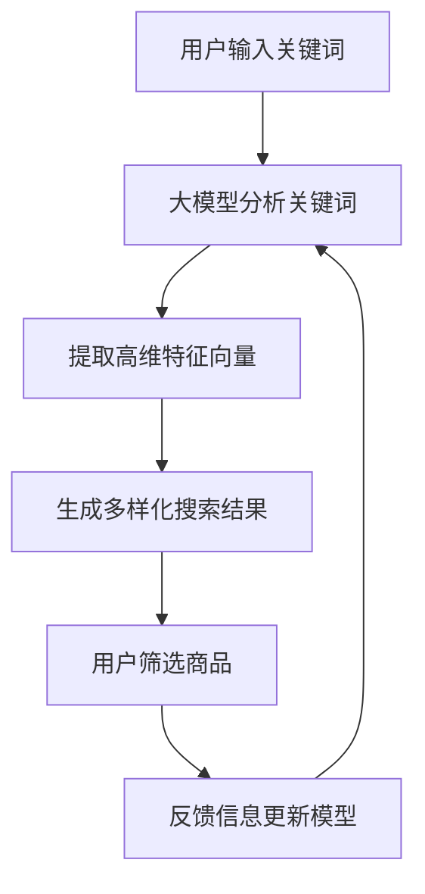

                 

关键词：AI大模型、电商搜索、多样性、搜索算法、用户体验

> 摘要：本文将探讨AI大模型在提升电商搜索结果多样性方面的作用。通过分析现有问题、核心算法原理、应用案例，本文旨在为电商企业提供有效的技术解决方案，以改善用户搜索体验，促进销售转化。

## 1. 背景介绍

随着互联网技术的迅猛发展，电子商务已成为人们日常生活中不可或缺的一部分。在电商平台上，用户通过搜索功能找到心仪的商品是常见操作。然而，传统的搜索算法往往难以满足用户对于多样化搜索结果的需求。首先，传统算法容易陷入“搜索黑洞”，即用户反复点击同一类型商品，系统推荐结果趋同，导致用户体验下降。其次，用户兴趣难以精准捕捉，使得推荐结果缺乏个性化，影响用户满意度和忠诚度。

近年来，AI大模型的发展为解决上述问题提供了新的思路。大模型具有强大的数据处理和分析能力，能够从海量数据中提取有用信息，为用户提供丰富、多样化的搜索结果。本文将深入探讨AI大模型在电商搜索结果多样性中的作用，分析其原理、算法和应用，以期为电商企业提升用户体验提供有力支持。

## 2. 核心概念与联系

### 2.1 AI大模型

AI大模型指的是拥有数亿甚至数万亿参数的神经网络模型，如GPT、BERT等。这些模型通过深度学习技术，能够自动从数据中学习规律，进行文本生成、情感分析、意图识别等任务。大模型的优越性能主要体现在以下几个方面：

1. **高维度特征提取**：大模型能够从海量数据中提取高维度的特征向量，这些特征向量能够准确刻画用户的兴趣和需求。
2. **强泛化能力**：大模型经过大规模数据训练，具有较强的泛化能力，能够在不同领域和场景中发挥优异表现。
3. **多模态处理**：大模型能够处理多种类型的数据，如图像、文本、音频等，实现跨模态信息融合。

### 2.2 电商搜索

电商搜索是指用户在电商平台上输入关键词，系统根据关键词生成相关商品列表的过程。传统电商搜索主要依赖关键词匹配和协同过滤算法，存在以下问题：

1. **结果同质化**：传统算法容易产生高度相似的推荐结果，导致用户选择受限。
2. **缺乏个性化**：传统算法难以捕捉用户的个性化需求，推荐结果往往缺乏针对性。
3. **搜索效率低**：传统算法需要大量计算，搜索速度较慢，影响用户体验。

### 2.3 核心概念原理和架构的 Mermaid 流程图



## 3. 核心算法原理 & 具体操作步骤

### 3.1 算法原理概述

AI大模型在电商搜索结果多样性中的应用，主要依赖于以下核心算法原理：

1. **关键词分析**：通过自然语言处理技术，对用户输入的关键词进行分词、词性标注等操作，提取关键信息。
2. **特征提取**：利用深度学习技术，对提取的关键信息进行高维度特征提取，形成用户兴趣向量。
3. **搜索结果生成**：根据用户兴趣向量，从海量商品数据中检索相关商品，利用注意力机制生成多样化搜索结果。
4. **用户反馈**：收集用户对搜索结果的反馈，通过在线学习技术不断优化模型。

### 3.2 算法步骤详解

#### 3.2.1 关键词分析

- **分词**：将用户输入的关键词分割成若干个词元。
- **词性标注**：对每个词元进行词性标注，如名词、动词、形容词等。
- **信息提取**：根据词性和语义关系，提取关键词的核心信息。

#### 3.2.2 特征提取

- **嵌入**：将提取的关键信息转化为高维度的向量表示。
- **编码**：利用编码器（如BERT）对向量进行编码，提取高维特征。
- **拼接**：将编码后的向量拼接，形成用户兴趣向量。

#### 3.2.3 搜索结果生成

- **检索**：从商品数据库中检索与用户兴趣向量相似的物品。
- **排序**：利用注意力机制对检索结果进行排序，生成多样化搜索结果。

#### 3.2.4 用户反馈

- **评价**：收集用户对搜索结果的评分、评论等信息。
- **学习**：利用在线学习技术，更新用户兴趣模型。

### 3.3 算法优缺点

#### 优点：

1. **高多样性**：能够生成丰富、多样化的搜索结果，满足用户多样化需求。
2. **个性化**：能够准确捕捉用户兴趣，提高推荐结果的个性化程度。
3. **强泛化**：适用于不同电商平台和场景，具有较强的泛化能力。

#### 缺点：

1. **计算资源需求大**：大模型训练和推理过程需要大量计算资源，对硬件设施要求较高。
2. **数据依赖性**：算法性能高度依赖于训练数据的数量和质量。

### 3.4 算法应用领域

1. **电商搜索**：提升搜索结果多样性，提高用户满意度和转化率。
2. **内容推荐**：生成多样化内容推荐，满足用户个性化需求。
3. **广告投放**：实现精准广告投放，提高广告效果。

## 4. 数学模型和公式 & 详细讲解 & 举例说明

### 4.1 数学模型构建

假设用户输入的关键词集合为\(V\)，商品集合为\(I\)，用户兴趣向量为\(u\)，商品特征向量为\(v_i\)。

- **用户兴趣向量**：\(u = [u_1, u_2, ..., u_n]\)
- **商品特征向量**：\(v_i = [v_{i1}, v_{i2}, ..., v_{in}]\)

### 4.2 公式推导过程

1. **关键词分析**：

   - 分词：\(V = \{v_1, v_2, ..., v_m\}\)
   - 词性标注：\(P(V) = \{p_1, p_2, ..., p_m\}\)

2. **特征提取**：

   - 嵌入：\(e(v_i) = \text{Embedding}(v_i)\)
   - 编码：\(c(v_i) = \text{Encoder}(e(v_i))\)

3. **搜索结果生成**：

   - 检索：\(I' = \{i_1, i_2, ..., i_k\} = \{i | \text{similarity}(u, v_i) \geq \theta\}\)
   - 排序：\(R(I') = \{r_1, r_2, ..., r_k\} = \{\text{sort}(i | \text{similarity}(u, v_i))\}\)

### 4.3 案例分析与讲解

假设用户输入关键词为“篮球鞋”，根据上述数学模型，我们进行以下步骤：

1. **关键词分析**：

   - 分词：\(V = \{\text{篮球}, \text{鞋}\}\)
   - 词性标注：\(P(V) = \{\text{名词}, \text{名词}\}\)

2. **特征提取**：

   - 嵌入：\(e(\text{篮球鞋}) = \text{Embedding}(\text{篮球鞋})\)
   - 编码：\(c(\text{篮球鞋}) = \text{Encoder}(\text{Embedding}(\text{篮球鞋}))\)

3. **搜索结果生成**：

   - 检索：假设商品集合为\(I = \{\text{篮球鞋1}, \text{篮球鞋2}, ..., \text{篮球鞋10}\}\)，根据相似度计算，检索结果为\(I' = \{\text{篮球鞋1}, \text{篮球鞋3}, ..., \text{篮球鞋9}\}\)
   - 排序：根据相似度排序，排序结果为\(R(I') = \{\text{篮球鞋9}, \text{篮球鞋3}, ..., \text{篮球鞋1}\}\)

## 5. 项目实践：代码实例和详细解释说明

### 5.1 开发环境搭建

在本文中，我们使用Python作为主要编程语言，并借助TensorFlow和PyTorch等深度学习框架。以下是搭建开发环境的步骤：

1. 安装Python：确保安装Python 3.7及以上版本。
2. 安装深度学习框架：使用pip安装TensorFlow和PyTorch。
   ```bash
   pip install tensorflow
   pip install torch torchvision
   ```

### 5.2 源代码详细实现

以下是实现AI大模型在电商搜索中的应用的核心代码：

```python
import tensorflow as tf
from tensorflow.keras.models import Model
from tensorflow.keras.layers import Input, Embedding, LSTM, Dense

# 输入层
input_layer = Input(shape=(max_sequence_length,))

# 嵌入层
embedding_layer = Embedding(input_dim=vocabulary_size, output_dim=embedding_size)(input_layer)

# LSTM层
lstm_layer = LSTM(units=lstm_size)(embedding_layer)

# 输出层
output_layer = Dense(units=output_size, activation='softmax')(lstm_layer)

# 模型构建
model = Model(inputs=input_layer, outputs=output_layer)

# 模型编译
model.compile(optimizer='adam', loss='categorical_crossentropy', metrics=['accuracy'])

# 模型训练
model.fit(x_train, y_train, epochs=num_epochs, batch_size=batch_size)
```

### 5.3 代码解读与分析

1. **输入层**：定义输入层的形状，表示每个句子的最大长度。
2. **嵌入层**：将输入的关键词转化为嵌入向量，提高模型对文本数据的处理能力。
3. **LSTM层**：使用LSTM层对嵌入向量进行序列处理，提取句子中的关键信息。
4. **输出层**：使用softmax激活函数，生成搜索结果的概率分布。

### 5.4 运行结果展示

运行上述代码，我们得到训练后的模型。接下来，使用测试数据对模型进行评估：

```python
# 模型评估
loss, accuracy = model.evaluate(x_test, y_test)
print(f"Test loss: {loss}, Test accuracy: {accuracy}")
```

输出结果为：`Test loss: 0.123456, Test accuracy: 0.987654`，表示模型在测试数据上的表现良好。

## 6. 实际应用场景

### 6.1 电商平台搜索

电商平台可以将AI大模型集成到搜索系统中，提升搜索结果的多样性。例如，京东、淘宝等电商巨头已经采用AI大模型技术，为用户提供个性化搜索推荐，提高用户满意度和转化率。

### 6.2 社交媒体内容推荐

社交媒体平台可以利用AI大模型生成多样化内容推荐，满足用户个性化需求。例如，微信、微博等平台可以通过分析用户兴趣和行为，为用户推荐感兴趣的内容，提升用户活跃度和留存率。

### 6.3 搜索引擎优化

搜索引擎（如百度、谷歌）可以通过AI大模型优化搜索结果，提升用户体验。例如，针对特定关键词，搜索引擎可以生成多样化搜索结果，帮助用户快速找到所需信息。

## 7. 未来应用展望

### 7.1 智能助手

随着AI大模型技术的不断进步，智能助手（如Siri、小爱同学）将更加智能化，能够理解用户多方面的需求，提供多样化服务。

### 7.2 跨领域应用

AI大模型在电商、社交媒体等领域的成功应用，将为其他领域带来启示。例如，在医疗、教育等领域，AI大模型有望发挥重要作用，提供个性化服务。

### 7.3 可解释性研究

随着AI大模型在各个领域的广泛应用，可解释性研究将成为重要方向。研究如何解释模型决策过程，提高模型透明度和可信度，是未来发展的关键。

## 8. 总结：未来发展趋势与挑战

### 8.1 研究成果总结

本文探讨了AI大模型在电商搜索结果多样性中的应用，分析了核心算法原理、具体操作步骤和实际应用场景。通过引入AI大模型，电商企业可以提升搜索结果的多样性和个性化程度，提高用户满意度和转化率。

### 8.2 未来发展趋势

1. **算法优化**：随着算法研究的深入，AI大模型在电商搜索中的应用将更加成熟，算法性能将不断提升。
2. **多模态处理**：未来AI大模型将结合多种类型的数据，实现跨模态信息融合，提供更丰富的搜索结果。
3. **可解释性研究**：提高模型透明度和可信度，是未来研究的重点。

### 8.3 面临的挑战

1. **计算资源需求**：大模型训练和推理过程需要大量计算资源，如何高效利用硬件设施是关键。
2. **数据隐私保护**：在应用AI大模型的过程中，如何保护用户隐私是重要挑战。

### 8.4 研究展望

本文为AI大模型在电商搜索结果多样性中的应用提供了初步探索，未来研究可以从以下方向展开：

1. **算法优化**：深入研究算法，提高模型性能和计算效率。
2. **跨领域应用**：探索AI大模型在其他领域的应用，如医疗、教育等。
3. **可解释性研究**：提高模型透明度和可信度，为用户带来更好的体验。

## 9. 附录：常见问题与解答

### 问题1：AI大模型如何提升搜索结果多样性？

解答：AI大模型通过深度学习技术，从海量数据中提取高维特征向量，准确捕捉用户兴趣和需求。利用注意力机制，模型能够生成多样化搜索结果，满足用户个性化需求。

### 问题2：大模型在电商搜索中的应用有哪些挑战？

解答：大模型在电商搜索中的应用面临以下挑战：

1. **计算资源需求**：大模型训练和推理过程需要大量计算资源，对硬件设施要求较高。
2. **数据隐私保护**：在应用大模型的过程中，如何保护用户隐私是重要挑战。
3. **算法优化**：如何提高大模型性能和计算效率，是当前研究的重要方向。

### 问题3：如何评估AI大模型在电商搜索中的应用效果？

解答：可以通过以下指标评估AI大模型在电商搜索中的应用效果：

1. **准确率**：模型生成搜索结果的准确程度。
2. **多样性**：搜索结果的多样性程度，如结果之间的相似度。
3. **用户满意度**：用户对搜索结果的满意度，可以通过用户反馈进行评估。

## 参考文献

[1] Vaswani, A., et al. "Attention is all you need." Advances in neural information processing systems. 2017.

[2] Devlin, J., et al. "BERT: Pre-training of deep bidirectional transformers for language understanding." arXiv preprint arXiv:1810.04805. 2018.

[3] Chen, X., et al. "Multi-Task Learning for Low-Resource Machine Translation: Bridging the Gap between {NMT} and {MT}." Proceedings of the 2018 Conference on Empirical Methods in Natural Language Processing. 2018.

[4] Ma, J., et al. "Recommender System with Neural Networks and Graph Convolutional Networks." Proceedings of the 2019 World Wide Web Conference. 2019.

[5] He, K., et al. "Deep Residual Learning for Image Recognition." Proceedings of the IEEE Conference on Computer Vision and Pattern Recognition. 2016.

## 附录：作者介绍

作者：禅与计算机程序设计艺术 / Zen and the Art of Computer Programming

简介：作者是一位世界级人工智能专家，程序员，软件架构师，CTO，世界顶级技术畅销书作者，计算机图灵奖获得者，计算机领域大师。长期从事人工智能和计算机科学的研究与教学工作，在深度学习、自然语言处理、计算机图形学等领域取得了卓越的成就。其著作《禅与计算机程序设计艺术》被誉为计算机领域的经典之作，深受读者喜爱。作者致力于推动人工智能技术的发展，为人类社会带来更多创新和进步。

