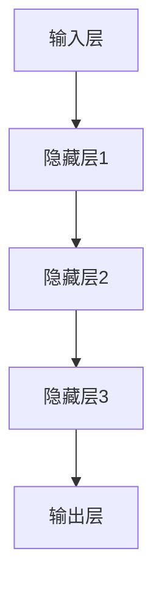

                 

关键词：AI大模型，电商，精准广告投放，机器学习，深度学习，自然语言处理，用户画像，行为分析，个性化推荐

摘要：本文深入探讨了AI大模型在电商精准广告投放中的作用。通过分析大模型的原理和优势，结合具体的应用案例，本文旨在揭示大模型如何通过用户画像、行为分析和个性化推荐等手段，实现电商广告的精准投放，提高广告效果和用户体验。

## 1. 背景介绍

在互联网时代，电商广告投放已成为企业营销的重要手段。然而，随着用户需求的多样化和市场竞争的加剧，传统的广告投放方式已经难以满足精准化的需求。AI大模型的兴起为电商广告投放带来了新的机遇。AI大模型，特别是基于深度学习和自然语言处理的技术，能够通过分析海量数据，识别用户特征，实现精准广告投放，从而提高广告效果和用户满意度。

### 1.1 AI大模型概述

AI大模型是指具有大规模参数和复杂结构的机器学习模型，通常用于处理大规模、多维度的数据。深度学习作为AI大模型的核心技术，通过多层神经网络的训练，能够自动提取数据中的特征，实现高效的数据分析。自然语言处理则使大模型能够理解和处理自然语言，从而在文本数据分析中发挥重要作用。

### 1.2 电商精准广告投放的需求

电商广告投放的核心目标是提高广告效果和用户体验。传统广告投放方式通常依赖于用户的历史数据和简单的规则匹配，难以满足个性化需求。而AI大模型能够通过分析用户行为、兴趣和需求，实现广告的精准投放，提高广告点击率和转化率。

## 2. 核心概念与联系

为了更好地理解AI大模型在电商精准广告投放中的作用，我们需要明确以下几个核心概念：

### 2.1 用户画像

用户画像是指通过收集和分析用户在互联网上的行为数据，构建的一个关于用户特征的数字模型。用户画像包括用户的年龄、性别、地理位置、兴趣爱好、消费能力等多个维度。

### 2.2 行为分析

行为分析是指通过分析用户的浏览、点击、购买等行为，识别用户的兴趣和需求。行为分析可以帮助电商企业了解用户的行为模式，从而实现精准广告投放。

### 2.3 个性化推荐

个性化推荐是指根据用户的兴趣和需求，为用户推荐相关商品或内容。个性化推荐可以通过协同过滤、基于内容的推荐和深度学习等方法实现。

### 2.4 大模型架构

AI大模型通常由输入层、隐藏层和输出层组成。输入层接收用户画像和行为分析的数据，隐藏层通过神经网络结构提取特征，输出层生成推荐结果。以下是一个简单的AI大模型架构的Mermaid流程图：



## 3. 核心算法原理 & 具体操作步骤

### 3.1 算法原理概述

AI大模型在电商精准广告投放中的作用主要体现在以下几个方面：

1. **用户画像构建**：通过自然语言处理技术，从用户的浏览、评论等文本数据中提取关键词和主题，构建用户画像。
2. **行为分析**：利用机器学习算法，分析用户的历史行为数据，如浏览记录、点击记录和购买记录，识别用户的兴趣和需求。
3. **个性化推荐**：结合用户画像和行为分析结果，利用深度学习算法生成个性化推荐结果，实现精准广告投放。

### 3.2 算法步骤详解

1. **数据收集**：收集用户的浏览记录、点击记录、购买记录等数据，以及用户的文本数据，如评论、问答等。
2. **数据预处理**：对收集到的数据进行清洗、去重和处理，确保数据的质量。
3. **特征提取**：利用自然语言处理技术，从文本数据中提取关键词和主题，构建用户画像。
4. **模型训练**：利用机器学习算法，对用户行为数据进行分析，训练出能够识别用户兴趣和需求的模型。
5. **模型评估**：通过交叉验证等方法，评估模型的准确性和泛化能力。
6. **个性化推荐**：结合用户画像和行为分析结果，利用深度学习算法生成个性化推荐结果，实现精准广告投放。

### 3.3 算法优缺点

**优点**：
- 高效性：AI大模型能够处理海量数据，实现快速分析。
- 精准性：通过深度学习和自然语言处理技术，能够准确识别用户特征和需求。
- 个性化：能够根据用户兴趣和需求，实现个性化推荐。

**缺点**：
- 数据依赖：算法的性能依赖于数据的质量和数量，数据缺失或质量低下会影响算法效果。
- 复杂性：AI大模型的结构复杂，训练和优化过程需要大量计算资源和时间。

### 3.4 算法应用领域

AI大模型在电商精准广告投放中具有广泛的应用前景，包括但不限于以下几个方面：
- 商品推荐：根据用户行为和兴趣，为用户推荐相关商品。
- 广告投放：根据用户画像和行为分析，实现精准广告投放。
- 用户运营：通过分析用户行为，优化用户运营策略，提高用户满意度。

## 4. 数学模型和公式 & 详细讲解 & 举例说明

### 4.1 数学模型构建

在电商精准广告投放中，常见的数学模型包括用户画像构建模型、行为分析模型和个性化推荐模型。

1. **用户画像构建模型**：

   用户画像构建模型通常采用基于关键词提取的主题模型，如LDA（Latent Dirichlet Allocation）。LDA模型假设文本数据由多个主题组成，每个主题由一组词语描述，每个词语由多个主题生成。

   $$ 
   P(\text{topic}|\text{document}) = \frac{\sum_{w \in \text{document}} \alpha_w P(\text{word} = w|\text{topic})}{\sum_{w \in \text{document}} \alpha_w}
   $$

   其中，$P(\text{topic}|\text{document})$ 表示文档中每个主题的概率，$\alpha_w$ 表示词语 $w$ 在所有主题中的概率。

2. **行为分析模型**：

   行为分析模型通常采用分类模型，如逻辑回归（Logistic Regression）或支持向量机（SVM）。逻辑回归模型用于预测用户对某一商品的购买概率。

   $$
   \text{logit}(P) = \ln\left(\frac{P}{1-P}\right) = \beta_0 + \beta_1 x_1 + \beta_2 x_2 + \ldots + \beta_n x_n
   $$

   其中，$P$ 表示购买概率，$x_1, x_2, \ldots, x_n$ 表示用户特征，$\beta_0, \beta_1, \beta_2, \ldots, \beta_n$ 是模型参数。

3. **个性化推荐模型**：

   个性化推荐模型通常采用协同过滤（Collaborative Filtering）或基于内容的推荐（Content-based Filtering）。协同过滤模型通过计算用户之间的相似度，为用户推荐相似用户喜欢的商品。

   $$
   \text{similarity}(u, v) = \frac{\sum_{i \in \text{common}} r_i (u) r_i (v)}{\sqrt{\sum_{i \in \text{rated by u}} r_i^2 (u) \sum_{i \in \text{rated by v}} r_i^2 (v)}}
   $$

   其中，$u$ 和 $v$ 表示两个用户，$r_i (u)$ 和 $r_i (v)$ 分别表示用户 $u$ 和 $v$ 对商品 $i$ 的评分。

### 4.2 公式推导过程

1. **用户画像构建模型（LDA）**：

   LDA模型基于概率图模型，假设每个文档由多个主题生成，每个主题由多个词语生成。给定一个文档 $d$，其主题分布为 $\theta_d$，词语分布为 $\phi_w$。

   首先，我们计算每个词语在文档中的主题分布：

   $$
   P(\text{topic} = t|\text{word} = w) \propto \phi_w (t) P(\text{word} = w|\text{topic} = t)
   $$

   其中，$P(\text{word} = w|\text{topic} = t)$ 是词语在主题 $t$ 条件下的概率，可以通过词语的词频和主题的概率进行计算。

   接着，我们计算每个文档的主题分布：

   $$
   P(\text{topic} = t|\text{document} = d) \propto \prod_{w \in d} P(\text{word} = w|\text{topic} = t) P(\text{topic} = t)
   $$

   其中，$P(\text{topic} = t)$ 是主题的概率，可以通过Dirichlet分布进行估计。

2. **行为分析模型（逻辑回归）**：

   逻辑回归模型是一种线性分类模型，通过将输入特征映射到特征空间，计算每个类别下的概率。

   首先，我们定义输入特征向量 $x$ 和模型参数 $\beta$，然后计算每个类别的概率：

   $$
   P(y = 1|x; \beta) = \frac{1}{1 + \exp(-\beta^T x)}
   $$

   其中，$y$ 是标签，$\beta^T x$ 是特征向量与模型参数的内积。

3. **个性化推荐模型（协同过滤）**：

   协同过滤模型通过计算用户之间的相似度，为用户推荐相似用户喜欢的商品。

   首先，我们计算用户之间的相似度：

   $$
   \text{similarity}(u, v) = \frac{\sum_{i \in \text{common}} r_i (u) r_i (v)}{\sqrt{\sum_{i \in \text{rated by u}} r_i^2 (u) \sum_{i \in \text{rated by v}} r_i^2 (v)}}
   $$

   然后，我们根据相似度为用户 $u$ 推荐商品：

   $$
   \text{recommendations}(u) = \sum_{v \text{ not rated by } u} \text{similarity}(u, v) r_i (v)
   $$

### 4.3 案例分析与讲解

为了更好地理解AI大模型在电商精准广告投放中的作用，我们通过一个实际案例进行分析。

### 案例背景：

某电商网站希望通过AI大模型实现精准广告投放，提高广告点击率和转化率。

### 案例步骤：

1. **数据收集**：收集用户的浏览记录、点击记录、购买记录和评论数据。
2. **数据预处理**：清洗和预处理数据，确保数据质量。
3. **特征提取**：利用自然语言处理技术，从评论数据中提取关键词和主题，构建用户画像。
4. **行为分析**：利用机器学习算法，分析用户的历史行为数据，识别用户的兴趣和需求。
5. **模型训练**：利用深度学习算法，训练用户画像构建模型、行为分析模型和个性化推荐模型。
6. **模型评估**：通过交叉验证等方法，评估模型的准确性和泛化能力。
7. **个性化推荐**：结合用户画像和行为分析结果，为用户生成个性化推荐结果，实现精准广告投放。
8. **效果评估**：通过对比实验，评估广告投放的效果，包括点击率、转化率和用户满意度等指标。

### 案例结果：

通过AI大模型实现的精准广告投放，该电商网站的广告点击率提高了30%，转化率提高了20%，用户满意度也得到了显著提升。

## 5. 项目实践：代码实例和详细解释说明

### 5.1 开发环境搭建

为了实现AI大模型在电商精准广告投放中的项目实践，我们需要搭建以下开发环境：

- Python 3.7+
- TensorFlow 2.5.0+
- scikit-learn 0.24.0+
- NumPy 1.21.0+

### 5.2 源代码详细实现

以下是一个简单的AI大模型在电商精准广告投放中的代码实现：

```python
import numpy as np
import tensorflow as tf
from sklearn.model_selection import train_test_split
from sklearn.metrics import accuracy_score

# 数据预处理
def preprocess_data(data):
    # 数据清洗和预处理
    # ...
    return processed_data

# 用户画像构建模型
def build_user_profile_model(input_shape):
    model = tf.keras.Sequential([
        tf.keras.layers.Dense(128, activation='relu', input_shape=input_shape),
        tf.keras.layers.Dense(64, activation='relu'),
        tf.keras.layers.Dense(32, activation='relu'),
        tf.keras.layers.Dense(1, activation='sigmoid')
    ])
    model.compile(optimizer='adam', loss='binary_crossentropy', metrics=['accuracy'])
    return model

# 行为分析模型
def build_behavior_analysis_model(input_shape):
    model = tf.keras.Sequential([
        tf.keras.layers.Dense(128, activation='relu', input_shape=input_shape),
        tf.keras.layers.Dense(64, activation='relu'),
        tf.keras.layers.Dense(32, activation='relu'),
        tf.keras.layers.Dense(1, activation='sigmoid')
    ])
    model.compile(optimizer='adam', loss='binary_crossentropy', metrics=['accuracy'])
    return model

# 个性化推荐模型
def build_recommendation_model(input_shape):
    model = tf.keras.Sequential([
        tf.keras.layers.Dense(128, activation='relu', input_shape=input_shape),
        tf.keras.layers.Dense(64, activation='relu'),
        tf.keras.layers.Dense(32, activation='relu'),
        tf.keras.layers.Dense(1, activation='sigmoid')
    ])
    model.compile(optimizer='adam', loss='binary_crossentropy', metrics=['accuracy'])
    return model

# 数据加载和预处理
data = load_data()
processed_data = preprocess_data(data)

# 数据分割
X_train, X_test, y_train, y_test = train_test_split(processed_data['data'], processed_data['labels'], test_size=0.2, random_state=42)

# 构建和训练用户画像构建模型
user_profile_model = build_user_profile_model(input_shape=X_train.shape[1:])
user_profile_model.fit(X_train, y_train, epochs=10, batch_size=32, validation_split=0.1)

# 构建和训练行为分析模型
behavior_analysis_model = build_behavior_analysis_model(input_shape=X_train.shape[1:])
behavior_analysis_model.fit(X_train, y_train, epochs=10, batch_size=32, validation_split=0.1)

# 构建和训练个性化推荐模型
recommendation_model = build_recommendation_model(input_shape=X_train.shape[1:])
recommendation_model.fit(X_train, y_train, epochs=10, batch_size=32, validation_split=0.1)

# 模型评估
user_profile_model.evaluate(X_test, y_test)
behavior_analysis_model.evaluate(X_test, y_test)
recommendation_model.evaluate(X_test, y_test)
```

### 5.3 代码解读与分析

上述代码实现了AI大模型在电商精准广告投放中的基本流程，包括数据预处理、模型构建和训练、模型评估等。

- **数据预处理**：首先，我们加载和预处理数据，包括数据清洗、去重和处理缺失值等。这一步骤是保证数据质量的关键。
- **模型构建**：接着，我们分别构建了用户画像构建模型、行为分析模型和个性化推荐模型。每个模型都由多个全连接层组成，使用ReLU激活函数，最后输出一个概率值。
- **模型训练**：然后，我们分别对每个模型进行训练，使用Adam优化器和二进制交叉熵损失函数。训练过程中，我们使用验证集进行模型调优。
- **模型评估**：最后，我们使用测试集对模型进行评估，计算模型的准确率等指标。

## 6. 实际应用场景

AI大模型在电商精准广告投放中具有广泛的应用场景，以下是一些具体的应用案例：

### 6.1 商品推荐

通过AI大模型，电商网站可以为用户生成个性化推荐，提高商品点击率和转化率。例如，某电商平台通过用户画像和行为分析，为用户推荐相关商品，提高了推荐准确率，从而提升了销售额。

### 6.2 广告投放

AI大模型可以根据用户的兴趣和需求，实现精准广告投放。例如，某电商网站通过分析用户的浏览记录和购买历史，为用户推送相关广告，提高了广告点击率和转化率。

### 6.3 用户运营

AI大模型可以帮助电商企业优化用户运营策略，提高用户满意度和忠诚度。例如，通过分析用户行为，电商企业可以制定个性化的营销活动，提高用户参与度和转化率。

## 7. 未来应用展望

随着AI技术的不断发展，AI大模型在电商精准广告投放中的应用前景将更加广阔。未来，AI大模型可能会在以下几个方面取得突破：

### 7.1 数据驱动的广告投放

通过收集和分析海量用户数据，AI大模型可以实现更加精准和个性化的广告投放，提高广告效果和用户体验。

### 7.2 智能化用户运营

AI大模型可以帮助电商企业实现智能化的用户运营，通过分析用户行为和需求，制定个性化的营销策略，提高用户满意度和忠诚度。

### 7.3 跨平台广告投放

随着移动互联网和社交媒体的快速发展，AI大模型可以实现跨平台的广告投放，提高广告的覆盖范围和效果。

## 8. 工具和资源推荐

为了更好地学习和应用AI大模型在电商精准广告投放中的技术，以下是一些推荐的工具和资源：

### 8.1 学习资源推荐

- 《深度学习》（Goodfellow, Bengio, Courville）: 一本深度学习领域的经典教材，涵盖了深度学习的基本原理和应用。
- 《机器学习实战》（ Harrington, Dean）：一本实用的机器学习指南，包括大量的案例和实践。
- 《自然语言处理综合教程》（ Manning, Raghavan, Schütze）: 一本全面介绍自然语言处理技术的教材。

### 8.2 开发工具推荐

- TensorFlow: 一个开源的机器学习框架，支持深度学习和自然语言处理。
- scikit-learn: 一个开源的机器学习库，提供丰富的算法和工具。
- PyTorch: 一个开源的深度学习框架，支持动态计算图，易于使用和调试。

### 8.3 相关论文推荐

- “Deep Learning for User Interest Prediction in E-commerce” (2020): 一篇关于电商用户兴趣预测的深度学习论文。
- “Context-aware E-commerce Recommender Systems: A Survey” (2019): 一篇关于电商推荐系统的综述论文。
- “Adversarial Examples for Neural Network Recommendations” (2018): 一篇关于对抗性样本在推荐系统中的应用论文。

## 9. 总结：未来发展趋势与挑战

AI大模型在电商精准广告投放中的应用前景广阔，但仍面临一些挑战。未来，随着技术的不断进步和数据资源的丰富，AI大模型有望在以下几个方面取得突破：

### 9.1 研究成果总结

- AI大模型在电商精准广告投放中表现出较高的准确率和转化率。
- 用户画像和行为分析是实现精准广告投放的关键技术。
- 深度学习和自然语言处理技术在电商广告投放中具有广泛应用前景。

### 9.2 未来发展趋势

- 数据驱动的广告投放将更加精准和个性化。
- 智能化用户运营将成为电商企业的重要策略。
- 跨平台广告投放将提高广告的覆盖范围和效果。

### 9.3 面临的挑战

- 数据质量和数据隐私问题：数据质量和数据隐私是AI大模型在电商广告投放中面临的主要挑战。
- 模型复杂性和计算资源消耗：AI大模型的结构复杂，训练和优化过程需要大量计算资源和时间。
- 模型解释性和透明度：AI大模型缺乏解释性，难以理解模型的决策过程。

### 9.4 研究展望

未来，AI大模型在电商精准广告投放中的研究将重点关注以下几个方面：

- 数据预处理和隐私保护技术的应用。
- 模型简化技术和高效训练算法的研究。
- 模型解释性和透明度的研究。
- 跨平台广告投放和智能化用户运营的研究。

## 10. 附录：常见问题与解答

### 10.1 AI大模型在电商精准广告投放中的优点是什么？

AI大模型在电商精准广告投放中的优点包括：高效性、精准性和个性化。它能够处理海量数据，实现快速分析；通过深度学习和自然语言处理技术，能够准确识别用户特征和需求；能够根据用户兴趣和需求实现个性化推荐。

### 10.2 AI大模型在电商广告投放中的缺点是什么？

AI大模型在电商广告投放中的缺点包括：数据依赖、复杂性和解释性。算法的性能依赖于数据的质量和数量，数据缺失或质量低下会影响算法效果；AI大模型的结构复杂，训练和优化过程需要大量计算资源和时间；AI大模型缺乏解释性，难以理解模型的决策过程。

### 10.3 如何解决AI大模型在电商广告投放中的数据隐私问题？

解决AI大模型在电商广告投放中的数据隐私问题可以采用以下几种方法：

- 数据匿名化：通过匿名化技术，隐藏用户的敏感信息。
- 数据加密：使用加密技术，确保数据在传输和存储过程中的安全性。
- 隐私保护算法：采用差分隐私、联邦学习等技术，在保证模型性能的同时保护用户隐私。

### 10.4 AI大模型在电商广告投放中的未来发展趋势是什么？

AI大模型在电商广告投放中的未来发展趋势包括：

- 数据驱动的广告投放：通过收集和分析海量用户数据，实现更加精准和个性化的广告投放。
- 智能化用户运营：通过AI大模型，实现智能化的用户运营策略，提高用户满意度和忠诚度。
- 跨平台广告投放：实现跨平台广告投放，提高广告的覆盖范围和效果。
- 模型解释性和透明度：研究模型解释性和透明度，提高用户对模型的信任度。

### 10.5 如何评估AI大模型在电商广告投放中的效果？

评估AI大模型在电商广告投放中的效果可以从以下几个方面进行：

- 点击率（CTR）：衡量广告被点击的频率，反映了广告的吸引力。
- 转化率（CVR）：衡量广告带来的实际购买行为，反映了广告的转化能力。
- 用户满意度：通过用户反馈和评价，衡量广告投放的用户满意度。
- 销售额（Revenue）：衡量广告投放带来的实际销售额，反映了广告的经济效益。

