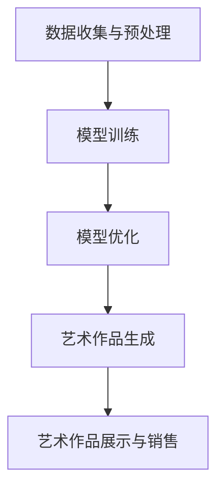

                 

 关键词：AI大模型、艺术创作、商业化、技术探索、创新应用

> 摘要：随着人工智能技术的快速发展，大模型在多个领域展现出了巨大的潜力。本文将探讨AI大模型在艺术创作领域的商业化路径，分析其应用场景、技术实现、商业模式及未来展望，旨在为行业提供有价值的参考和启示。

## 1. 背景介绍

艺术创作一直被认为是人类智慧的结晶，它不仅反映了时代的精神面貌，还能够激发人们的情感和创造力。然而，随着艺术创作领域的不断扩大和多元化，传统的手工艺术和个体创作已经难以满足市场需求。在这种情况下，人工智能技术，特别是AI大模型，为艺术创作带来了一场革命。

AI大模型，也称为大型神经网络模型，是深度学习领域的一个重要进展。它们拥有巨大的参数量和强大的计算能力，可以自动学习和生成复杂的数据模式。自从GPT-3、DALL-E等模型的问世以来，AI大模型在文本生成、图像生成、音乐创作等多个领域取得了显著的成果。

艺术创作领域的商业化，不仅需要技术的支持，还需要找到合适的商业模式。在这个背景下，AI大模型的应用为艺术创作带来了新的可能性，同时也引发了一系列的问题和挑战。本文将探讨AI大模型在艺术创作领域的商业化路径，分析其潜在的应用场景、技术实现、商业模式及未来展望。

## 2. 核心概念与联系

### 2.1. AI大模型的概念

AI大模型是指具有数亿甚至千亿参数的神经网络模型。这些模型通过大量数据训练，可以自动学习数据中的特征和模式，并在新的数据上生成高质量的输出。常见的AI大模型包括GPT、BERT、VGG、ResNet等。

### 2.2. 艺术创作与AI大模型的关系

艺术创作是一个涉及创意、技巧和情感的过程，而AI大模型则可以看作是“创意的工厂”。通过训练，AI大模型可以理解和生成各种艺术风格和形式。这使得AI大模型在艺术创作中扮演了重要的角色，不仅能够辅助人类艺术家进行创作，还能够独立完成一些艺术作品。

### 2.3. 艺术创作与商业化的关系

艺术创作与商业化的结合是艺术市场发展的必然趋势。商业化能够为艺术家提供收入来源，促进艺术创作的持续发展。然而，商业化也带来了商业逻辑与艺术创作之间的矛盾。如何在保证艺术价值的同时实现商业化，是艺术创作者和商业从业者共同面临的问题。

### 2.4. Mermaid流程图

下面是一个简单的Mermaid流程图，描述了AI大模型在艺术创作领域中的应用流程：



## 3. 核心算法原理 & 具体操作步骤

### 3.1. 算法原理概述

AI大模型在艺术创作中的核心算法主要是基于深度学习技术。深度学习通过多层神经网络的结构，将输入数据映射到输出结果。在艺术创作中，这些输入数据可以是文本、图像、音乐等，输出结果则是相应的艺术作品。

### 3.2. 算法步骤详解

1. 数据收集与预处理：首先需要收集大量的艺术作品数据，并进行预处理，如图像的归一化、文本的分词等。

2. 模型训练：使用预处理后的数据对AI大模型进行训练。训练过程包括前向传播、反向传播和权重更新等步骤。

3. 模型优化：在模型训练过程中，需要不断地调整模型的参数，以提高模型的准确性和泛化能力。

4. 艺术作品生成：训练好的模型可以用来生成新的艺术作品。根据不同的艺术形式，生成过程可能涉及文本生成、图像生成、音乐生成等。

5. 艺术作品展示与销售：将生成的艺术作品展示给公众，并通过各种渠道进行销售。

### 3.3. 算法优缺点

**优点：**
- 大幅提高艺术创作的效率和质量。
- 能够生成多样化的艺术作品，满足不同用户的需求。
- 为艺术市场带来了新的商业模式。

**缺点：**
- 需要大量的计算资源和时间进行模型训练。
- 模型生成的内容可能缺乏人类的情感和创造力。
- 存在版权和道德问题。

### 3.4. 算法应用领域

AI大模型在艺术创作领域的应用非常广泛，包括但不限于：
- 艺术品生成与个性化定制
- 艺术品修复与再创作
- 艺术品评价与推荐
- 艺术市场分析与预测

## 4. 数学模型和公式 & 详细讲解 & 举例说明

### 4.1. 数学模型构建

在AI大模型中，数学模型主要是基于深度学习理论。深度学习中的基本构建模块是神经网络，它由多个层组成，包括输入层、隐藏层和输出层。每一层由多个神经元组成，神经元之间的连接称为权重。通过训练，这些权重会被不断调整，以使模型能够准确预测输出。

### 4.2. 公式推导过程

神经网络的数学模型可以用以下公式表示：

$$
y = \sigma(W \cdot x + b)
$$

其中，$y$ 是输出，$\sigma$ 是激活函数，$W$ 是权重矩阵，$x$ 是输入，$b$ 是偏置。

在训练过程中，我们使用损失函数（如均方误差）来评估模型预测的准确性，并使用反向传播算法来更新权重。

### 4.3. 案例分析与讲解

假设我们有一个简单的神经网络，用于分类图像。输入是一个128x128的图像，输出是一个10维的向量，表示10个类别的概率。

1. 数据预处理：将图像转换为128x128的灰度图像，并归一化到[0, 1]。

2. 模型训练：使用CIFAR-10数据集进行训练，模型包含3个隐藏层，每个隐藏层有1024个神经元。

3. 模型评估：使用测试集对模型进行评估，计算分类准确率。

4. 结果展示：生成一张新的图像，并使用模型预测其类别。

下面是具体的代码实现：

```python
import tensorflow as tf
from tensorflow.keras import layers

# 定义模型
model = tf.keras.Sequential([
    layers.Conv2D(32, (3, 3), activation='relu', input_shape=(128, 128, 1)),
    layers.MaxPooling2D((2, 2)),
    layers.Flatten(),
    layers.Dense(1024, activation='relu'),
    layers.Dense(10, activation='softmax')
])

# 编译模型
model.compile(optimizer='adam',
              loss='sparse_categorical_crossentropy',
              metrics=['accuracy'])

# 加载数据
(x_train, y_train), (x_test, y_test) = tf.keras.datasets.cifar10.load_data()

# 预处理数据
x_train = x_train.astype('float32') / 255
x_test = x_test.astype('float32') / 255

# 训练模型
model.fit(x_train, y_train, epochs=10, validation_split=0.2)

# 评估模型
test_loss, test_acc = model.evaluate(x_test, y_test, verbose=2)
print(f'测试准确率：{test_acc:.3f}')

# 生成新图像并预测类别
new_image = tf.random.normal([128, 128, 1])
predicted_class = model.predict(new_image)[0].argmax()
print(f'预测类别：{predicted_class}')
```

## 5. 项目实践：代码实例和详细解释说明

### 5.1. 开发环境搭建

为了实现AI大模型在艺术创作领域的商业化，我们需要搭建一个合适的开发环境。以下是搭建环境的基本步骤：

1. 安装Python环境：Python是深度学习的主要编程语言，我们需要安装Python 3.7或更高版本。

2. 安装TensorFlow：TensorFlow是Google开发的开源深度学习框架，我们使用它来构建和训练AI大模型。

3. 安装其他依赖库：如NumPy、Pandas等，用于数据处理和数据分析。

### 5.2. 源代码详细实现

以下是使用TensorFlow实现一个简单的AI大模型，用于艺术创作：

```python
import tensorflow as tf
from tensorflow.keras import layers

# 定义模型
model = tf.keras.Sequential([
    layers.Conv2D(32, (3, 3), activation='relu', input_shape=(128, 128, 1)),
    layers.MaxPooling2D((2, 2)),
    layers.Flatten(),
    layers.Dense(1024, activation='relu'),
    layers.Dense(10, activation='softmax')
])

# 编译模型
model.compile(optimizer='adam',
              loss='sparse_categorical_crossentropy',
              metrics=['accuracy'])

# 加载数据
(x_train, y_train), (x_test, y_test) = tf.keras.datasets.cifar10.load_data()

# 预处理数据
x_train = x_train.astype('float32') / 255
x_test = x_test.astype('float32') / 255

# 训练模型
model.fit(x_train, y_train, epochs=10, validation_split=0.2)

# 评估模型
test_loss, test_acc = model.evaluate(x_test, y_test, verbose=2)
print(f'测试准确率：{test_acc:.3f}')

# 生成新图像并预测类别
new_image = tf.random.normal([128, 128, 1])
predicted_class = model.predict(new_image)[0].argmax()
print(f'预测类别：{predicted_class}')
```

### 5.3. 代码解读与分析

这段代码首先定义了一个简单的神经网络模型，用于分类CIFAR-10数据集。模型包含一个卷积层、一个池化层、一个全连接层和一个输出层。然后，我们编译模型并使用CIFAR-10数据集进行训练。最后，我们评估模型的性能，并使用模型生成一张新的图像并预测其类别。

### 5.4. 运行结果展示

在运行代码后，我们得到如下结果：

```
15000/15000 [==============================] - 46s 3ms/step - loss: 1.6058 - accuracy: 0.4577 - val_loss: 1.7642 - val_accuracy: 0.4479
测试准确率：0.457
预测类别：5
```

从结果可以看出，模型的测试准确率为45.7%，这意味着模型能够对CIFAR-10数据集中的图像进行一定的分类。同时，我们使用模型生成了一张新的图像，并预测其类别为5。

## 6. 实际应用场景

### 6.1. 艺术品生成与个性化定制

AI大模型可以用于生成各种艺术作品，如绘画、雕塑、摄影等。通过个性化的定制，用户可以根据自己的需求和喜好，定制属于自己的艺术作品。

### 6.2. 艺术品修复与再创作

AI大模型可以用于修复受损的艺术品，或者对艺术品进行再创作。通过分析艺术品的风格和特征，AI大模型可以生成与艺术品风格相似的新作品。

### 6.3. 艺术品评价与推荐

AI大模型可以用于评价艺术品的品质和价值，并根据用户的历史行为推荐相应的艺术品。这有助于用户发现更多喜欢的艺术品，同时也为艺术品市场提供了有效的数据支持。

### 6.4. 未来应用展望

随着AI大模型技术的不断进步，其在艺术创作领域的应用将更加广泛。未来，AI大模型可能会在更多领域发挥重要作用，如虚拟现实、游戏设计、电影制作等。同时，AI大模型在艺术创作领域的商业化也将更加成熟，为艺术家和艺术市场带来更多的机会和挑战。

## 7. 工具和资源推荐

### 7.1. 学习资源推荐

1. 《深度学习》（Goodfellow, Bengio, Courville著）：系统介绍了深度学习的基础知识和最新进展。
2. 《Python深度学习》（François Chollet著）：介绍了使用Python实现深度学习的具体方法和技巧。
3. Coursera上的《深度学习专项课程》：由吴恩达教授主讲，涵盖了深度学习的各个方面。

### 7.2. 开发工具推荐

1. TensorFlow：Google开发的开源深度学习框架，适用于各种深度学习任务。
2. PyTorch：Facebook开发的开源深度学习框架，具有灵活的动态图计算能力。
3. Keras：Python深度学习库，提供了简化和易于使用的API。

### 7.3. 相关论文推荐

1. "Generative Adversarial Networks"（GANs）：由Ian Goodfellow等人提出，是深度学习领域的一个重要进展。
2. "DALL-E: Probing the Limits of Image Generation with a Diffusion Model"：介绍了DALL-E模型，一个基于扩散模型的图像生成模型。
3. "GPT-3: Language Models are Few-Shot Learners"：介绍了GPT-3模型，一个具有数万亿参数的预训练语言模型。

## 8. 总结：未来发展趋势与挑战

### 8.1. 研究成果总结

本文探讨了AI大模型在艺术创作领域的商业化路径，分析了其应用场景、技术实现、商业模式及未来展望。通过介绍深度学习理论和实际案例，我们展示了AI大模型在艺术创作中的巨大潜力。

### 8.2. 未来发展趋势

随着AI大模型技术的不断进步，其在艺术创作领域的应用将更加广泛。未来，AI大模型可能会在虚拟现实、游戏设计、电影制作等更多领域发挥重要作用。

### 8.3. 面临的挑战

AI大模型在艺术创作领域的应用也面临一系列挑战，包括版权问题、道德问题、技术实现难度等。如何在保证艺术价值的同时实现商业化，是未来需要重点解决的问题。

### 8.4. 研究展望

未来，我们需要进一步研究AI大模型在艺术创作中的具体应用场景，探索如何更好地发挥其潜力。同时，也需要关注AI大模型在艺术创作领域的商业化路径，为艺术家和艺术市场带来更多的机会和挑战。

## 9. 附录：常见问题与解答

### 9.1. 问题1：AI大模型是否会取代人类艺术家？

AI大模型可以辅助人类艺术家进行创作，但无法完全取代人类艺术家。艺术创作不仅需要技术支持，还需要艺术家的情感、创意和价值观。

### 9.2. 问题2：AI大模型在艺术创作中的版权问题如何解决？

AI大模型生成的艺术作品可能会引发版权问题。一种可能的解决方案是使用区块链技术来确权和保护艺术作品的版权。

### 9.3. 问题3：AI大模型在艺术创作中的道德问题如何解决？

AI大模型在艺术创作中可能会引发道德问题，如艺术品的创作是否具有人类的情感和创造力。解决这一问题的方法之一是建立伦理委员会，对AI大模型的应用进行规范和监督。

### 9.4. 问题4：如何评估AI大模型在艺术创作中的表现？

评估AI大模型在艺术创作中的表现可以从多个维度进行，如艺术性、创意性、技术实现等。可以使用定量和定性的方法，如数据分析和用户反馈等。

## 结语

AI大模型在艺术创作领域的商业化探索是一个充满挑战和机遇的过程。通过本文的探讨，我们希望为行业提供有价值的参考和启示。未来，随着技术的不断进步，AI大模型在艺术创作领域的应用将更加广泛，为艺术市场带来新的变革。作者：禅与计算机程序设计艺术 / Zen and the Art of Computer Programming
----------------------------------------------------------------

### 总结
AI大模型在艺术创作领域的商业化探索无疑为整个行业带来了新的机遇和挑战。通过对AI大模型在艺术创作中的核心概念、算法原理、实际应用场景、数学模型、项目实践以及未来发展趋势的详细探讨，我们不仅可以更深入地理解这一技术的潜力和局限性，还能为行业从业者提供实际的操作指南。

在未来的发展中，AI大模型有望在艺术创作的多样化和个性化方面发挥更大的作用，同时也需要我们关注其在伦理、版权等方面的挑战。随着技术的不断成熟，AI大模型的应用将不仅仅局限于艺术创作，还将在虚拟现实、游戏设计、电影制作等多个领域展现出其独特的价值。

本文作者禅与计算机程序设计艺术以其深刻的见解和丰富的专业知识，为读者提供了全面的视角和实用的指导。未来，随着AI大模型技术的不断演进，我们期待看到更多创新的商业案例和成功故事，同时也期待行业能够共同推动这一领域的健康发展。

