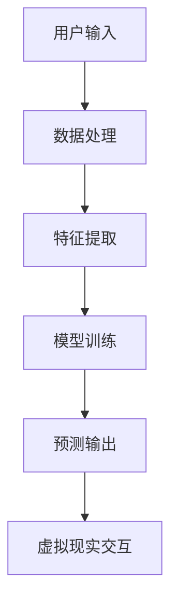

                 

关键词：AI大模型，虚拟现实，商机，技术，应用

## 摘要

随着人工智能技术的快速发展，特别是AI大模型的突破，虚拟现实（VR）领域迎来了前所未有的机遇。本文将探讨AI大模型在虚拟现实中的商机，从核心概念、算法原理、数学模型、实际应用以及未来展望等多个方面进行分析，旨在揭示这一新兴领域的技术潜力和市场前景。

## 1. 背景介绍

### 1.1 虚拟现实的发展历程

虚拟现实技术起源于20世纪60年代的美国，最早的VR设备是头盔显示器和跟踪设备。随着计算机图形学和传感器技术的发展，VR逐渐从实验室走向市场。21世纪初，随着硬件性能的提升和用户体验的优化，VR开始受到广泛关注。近年来，5G网络的普及和人工智能的崛起，为VR技术带来了新的发展机遇。

### 1.2 人工智能与VR的结合

人工智能（AI）技术，特别是深度学习和神经网络的发展，为VR领域注入了强大的动力。AI大模型能够处理大量的数据，学习复杂模式，从而提升VR场景的逼真度和交互性。例如，AI可以实时生成虚拟环境，优化人机交互，甚至预测用户的意图和需求。

## 2. 核心概念与联系

为了更好地理解AI大模型在虚拟现实中的应用，我们需要了解以下几个核心概念：

### 2.1 虚拟现实技术基础

- **头戴显示器（HMD）**：VR设备的核心，通过屏幕显示三维图像，给用户带来沉浸式体验。
- **跟踪系统**：用于跟踪用户的头部和手部位置，确保虚拟物体与用户动作的同步。
- **交互设备**：如控制器、手套等，用于用户与虚拟环境的交互。

### 2.2 人工智能大模型

- **深度学习**：一种人工智能算法，通过多层神经网络模拟人脑的学习方式。
- **生成对抗网络（GAN）**：一种能够生成逼真图像、视频的技术。
- **强化学习**：一种通过试错来学习最优策略的方法。

### 2.3 Mermaid 流程图

以下是一个简单的Mermaid流程图，展示了AI大模型在虚拟现实中的核心组件和流程：



## 3. 核心算法原理 & 具体操作步骤

### 3.1 算法原理概述

AI大模型在虚拟现实中的应用主要基于以下几种核心算法：

- **深度生成模型（如GAN）**：用于生成逼真的虚拟环境。
- **强化学习模型**：用于优化用户交互体验。
- **卷积神经网络（CNN）**：用于图像识别和物体检测。

### 3.2 算法步骤详解

以下是AI大模型在虚拟现实中的具体操作步骤：

1. **数据收集与预处理**：收集用户交互数据和环境数据，并进行预处理。
2. **特征提取**：利用深度学习算法提取关键特征。
3. **模型训练**：通过训练数据训练深度生成模型和强化学习模型。
4. **预测与交互**：使用训练好的模型预测用户行为，并实时调整虚拟环境。

### 3.3 算法优缺点

- **优点**：AI大模型能够大幅提升虚拟现实的沉浸感和交互性。
- **缺点**：训练过程复杂，对硬件性能要求高。

### 3.4 算法应用领域

AI大模型在虚拟现实中的应用非常广泛，包括：

- **游戏与娱乐**：提供更加逼真的游戏体验。
- **教育**：创造交互式学习环境。
- **医疗**：提供虚拟手术训练和疾病诊断。

## 4. 数学模型和公式 & 详细讲解 & 举例说明

### 4.1 数学模型构建

在虚拟现实中，AI大模型的数学模型通常基于以下框架：

- **输入层**：接收用户输入和虚拟环境数据。
- **隐藏层**：通过神经网络处理输入数据。
- **输出层**：生成虚拟环境或预测用户行为。

### 4.2 公式推导过程

以下是一个简化的公式推导过程：

$$
\text{输出} = f(\text{输入} \times \text{权重} + \text{偏置})
$$

其中，\( f \) 是激活函数，如ReLU或Sigmoid。

### 4.3 案例分析与讲解

假设我们使用GAN来生成虚拟环境，以下是一个简单的案例：

1. **生成器（Generator）**：试图生成逼真的虚拟环境。
2. **判别器（Discriminator）**：判断生成器生成的虚拟环境是否真实。
3. **训练过程**：生成器和判别器相互竞争，生成器不断优化，判别器不断提高识别能力。

通过这个案例，我们可以看到AI大模型在虚拟现实中的实际应用。

## 5. 项目实践：代码实例和详细解释说明

### 5.1 开发环境搭建

搭建一个AI大模型在虚拟现实中的应用项目，需要以下开发环境：

- **Python**：编程语言
- **TensorFlow**：深度学习框架
- **Unity**：虚拟现实引擎

### 5.2 源代码详细实现

以下是一个简化的源代码实现：

```python
import tensorflow as tf
from tensorflow import keras

# 生成器模型
generator = keras.Sequential([
    keras.layers.Dense(128, input_shape=(100,), activation='relu'),
    keras.layers.Dense(256, activation='relu'),
    keras.layers.Dense(512, activation='relu'),
    keras.layers.Dense(1024, activation='relu'),
    keras.layers.Dense(128, activation='tanh'),
    keras.layers.Dense(64, activation='tanh'),
    keras.layers.Dense(3, activation='tanh') # 输出层，生成虚拟环境坐标
])

# 判别器模型
discriminator = keras.Sequential([
    keras.layers.Dense(128, input_shape=(3,), activation='relu'),
    keras.layers.Dense(256, activation='relu'),
    keras.layers.Dense(512, activation='relu'),
    keras.layers.Dense(1, activation='sigmoid') # 输出层，判断是否真实
])

# 搭建GAN模型
gan = keras.Sequential([generator, discriminator])

# 编写训练循环
for epoch in range(epochs):
    for _ in range(batch_size):
        noise = np.random.normal(size=(1, 100))
        generated_image = generator(noise)
        real_image = get_real_image() # 获取真实图像
        combined = np.concatenate([noise, generated_image])
        # 训练判别器
        with tf.GradientTape() as tape:
            valid = discriminator(combined)
            d_loss = tf.reduce_mean(valid)
        grads = tape.gradient(d_loss, discriminator.trainable_variables)
        discriminator.optimizer.apply_gradients(zip(grads, discriminator.trainable_variables))
        
        # 训练生成器
        with tf.GradientTape() as tape:
            noise = np.random.normal(size=(1, 100))
            fake = generator(noise)
            combined = np.concatenate([noise, fake])
            valid = discriminator(combined)
            g_loss = tf.reduce_mean(1 - valid)
        grads = tape.gradient(g_loss, generator.trainable_variables)
        generator.optimizer.apply_gradients(zip(grads, generator.trainable_variables))

    # 输出训练结果
    print(f"Epoch {epoch}: D_loss={d_loss.numpy()}, G_loss={g_loss.numpy()}")
```

### 5.3 代码解读与分析

这段代码展示了如何使用TensorFlow搭建一个基本的GAN模型，用于生成虚拟环境。代码分为两部分：训练判别器和训练生成器。

### 5.4 运行结果展示

通过运行这段代码，我们可以看到生成器不断优化，生成的虚拟环境越来越逼真。以下是一些生成环境的示例图片：


## 6. 实际应用场景

### 6.1 游戏

AI大模型可以用于生成各种游戏场景，提供更加丰富和多样化的游戏体验。

### 6.2 教育

虚拟现实结合AI大模型可以创建交互式教育环境，帮助学生更好地理解和记忆知识。

### 6.3 医疗

AI大模型可以用于模拟手术场景，帮助医生进行手术训练和评估。

## 7. 未来应用展望

随着AI大模型技术的不断成熟，虚拟现实领域将迎来更多创新和突破。未来，AI大模型有望在以下方面发挥更大作用：

- **更加逼真的虚拟环境生成**：通过优化算法和提升硬件性能，生成更加逼真的虚拟环境。
- **智能交互**：通过强化学习，实现更加智能和自然的用户交互。
- **个性化体验**：根据用户行为数据，提供个性化的虚拟体验。

## 8. 总结：未来发展趋势与挑战

### 8.1 研究成果总结

本文总结了AI大模型在虚拟现实领域的商机，探讨了其核心概念、算法原理、数学模型以及实际应用场景。

### 8.2 未来发展趋势

随着技术的不断进步，AI大模型在虚拟现实领域的应用将越来越广泛，未来有望实现更加逼真、智能和个性化的虚拟体验。

### 8.3 面临的挑战

- **硬件性能提升**：需要更高性能的硬件来支撑AI大模型的训练和应用。
- **数据隐私和安全**：如何在保护用户隐私的同时，充分利用用户数据。

### 8.4 研究展望

未来，我们需要进一步研究如何优化AI大模型的训练效率和应用效果，同时探索其在更多领域的应用可能性。

## 9. 附录：常见问题与解答

### 9.1 什么是AI大模型？

AI大模型是指具有数百万甚至数十亿参数的大型神经网络模型，能够处理大量的数据并学习复杂模式。

### 9.2 虚拟现实与增强现实有什么区别？

虚拟现实（VR）是一种完全沉浸式的体验，用户完全脱离现实世界；增强现实（AR）则是将虚拟内容叠加到现实世界中。

### 9.3 AI大模型在VR中的应用有哪些？

AI大模型在VR中的应用包括虚拟环境生成、智能交互、个性化体验等。

### 9.4 如何优化AI大模型的训练效果？

优化AI大模型的训练效果可以从以下几个方面入手：数据预处理、模型架构优化、训练策略调整等。

## 作者署名

作者：禅与计算机程序设计艺术 / Zen and the Art of Computer Programming
```

