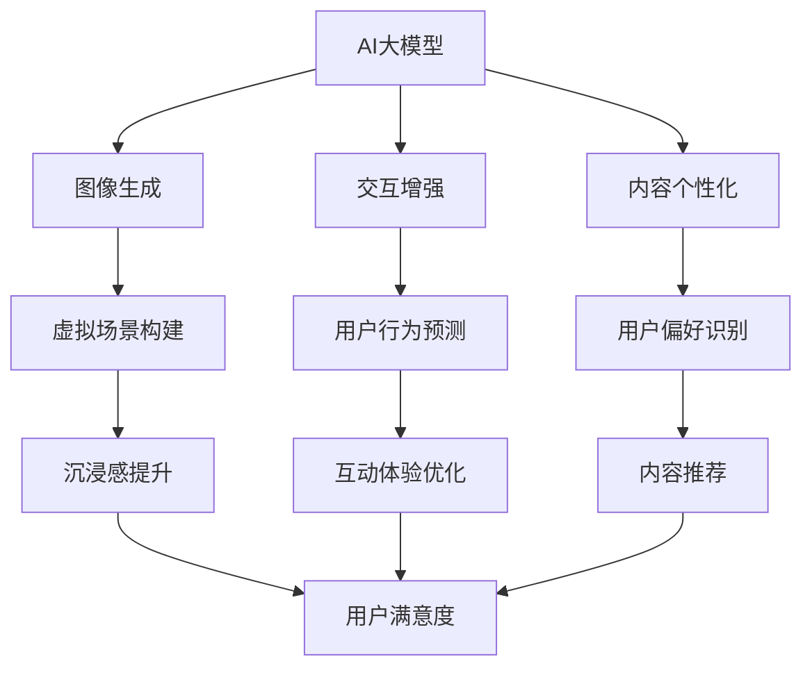

                 

关键词：AI大模型，虚拟现实，应用趋势，技术发展，挑战与机遇

## 摘要

本文旨在探讨AI大模型在虚拟现实（VR）领域的应用趋势。随着计算能力和算法的进步，AI大模型逐渐成为提升VR体验的关键因素。本文首先介绍了AI大模型的背景和核心概念，然后分析了其在VR中的核心应用，包括图像生成、交互、内容个性化等方面。接着，文章通过具体案例和数学模型讲解了AI大模型在VR中的实现方法和效果，最后探讨了VR领域的未来应用前景以及面临的挑战。

## 1. 背景介绍

虚拟现实（VR）是一种通过计算机生成模拟环境，使用户能够沉浸其中的技术。自上世纪90年代以来，VR技术逐渐成熟，并开始在游戏、医疗、教育等领域得到广泛应用。然而，传统的VR技术存在一些局限性，例如低分辨率、延迟和物理限制等，这些都影响了用户体验。为了解决这些问题，AI大模型技术应运而生。

AI大模型，也称为大型神经网络模型，是一种复杂的人工智能系统，能够处理和生成大量的数据。近年来，随着深度学习算法和计算能力的提升，AI大模型在各个领域都取得了显著进展。在VR领域，AI大模型可以用于图像生成、场景模拟、交互增强等，极大地提升了用户体验。

### 1.1 AI大模型的兴起

AI大模型的兴起得益于以下几个因素：

- **深度学习算法的突破**：深度学习算法，特别是卷积神经网络（CNN）和生成对抗网络（GAN），使得AI大模型能够处理复杂的任务，如图像和语音识别。

- **计算能力的提升**：高性能计算硬件，如GPU和TPU，为AI大模型提供了强大的计算能力，使得训练和推理过程更加高效。

- **大数据的积累**：互联网和物联网的发展，使得大量的数据可以被收集和利用，为AI大模型提供了丰富的训练数据。

### 1.2 VR技术的挑战

传统VR技术面临以下挑战：

- **图像质量**：低分辨率图像限制了用户的沉浸感。

- **延迟**：延迟影响了用户的交互体验，特别是在实时应用中。

- **物理限制**：VR设备如头戴显示器（HMD）的重量和体积限制了用户的舒适性。

- **内容丰富度**：传统VR内容通常较为单调，缺乏丰富的交互和个性化体验。

## 2. 核心概念与联系

AI大模型在VR中的核心应用包括图像生成、交互和内容个性化。以下是一个简化的Mermaid流程图，展示了这些核心概念及其相互关系：



### 2.1 图像生成

图像生成是AI大模型在VR中的核心应用之一。通过GAN等模型，可以生成高质量的虚拟场景图像，提升用户的沉浸感。图像生成模型接收输入，如场景描述或参考图像，生成相应的虚拟场景图像。

### 2.2 交互增强

交互增强通过AI大模型预测用户行为，提供更为自然的交互体验。例如，可以预测用户的头部和手部运动，实现更加流畅的交互。

### 2.3 内容个性化

内容个性化通过AI大模型分析用户行为和偏好，提供个性化的内容推荐。例如，根据用户的喜好和浏览历史，推荐虚拟场景和交互内容。

## 3. 核心算法原理 & 具体操作步骤

### 3.1 算法原理概述

AI大模型在VR中的应用主要基于以下几种算法：

- **生成对抗网络（GAN）**：GAN由生成器和判别器组成。生成器生成虚拟场景图像，判别器判断图像的真实性。通过训练，生成器逐渐生成更真实的图像。

- **卷积神经网络（CNN）**：CNN用于图像处理和特征提取，可以用于虚拟场景的构建和交互增强。

- **循环神经网络（RNN）**：RNN可以用于处理序列数据，如用户行为序列，用于行为预测和交互增强。

### 3.2 算法步骤详解

#### 3.2.1 图像生成

1. **数据准备**：收集虚拟场景的图像数据。

2. **模型构建**：构建GAN模型，包括生成器和判别器。

3. **训练**：通过对抗训练，优化生成器和判别器。

4. **生成图像**：使用训练好的生成器生成虚拟场景图像。

#### 3.2.2 交互增强

1. **数据收集**：收集用户交互数据，如头部和手部运动轨迹。

2. **模型构建**：构建RNN模型，用于预测用户行为。

3. **训练**：通过序列数据训练RNN模型。

4. **交互预测**：使用训练好的模型预测用户行为，优化交互体验。

#### 3.2.3 内容个性化

1. **数据收集**：收集用户偏好数据，如浏览历史和评价。

2. **模型构建**：构建基于内容的推荐模型。

3. **训练**：通过用户偏好数据训练推荐模型。

4. **内容推荐**：根据用户偏好推荐虚拟场景和交互内容。

### 3.3 算法优缺点

#### 优点

- **高效性**：AI大模型能够快速处理和生成大量数据，提升VR体验。

- **灵活性**：AI大模型可以根据不同需求进行调整和优化。

- **智能化**：AI大模型能够根据用户行为和偏好提供个性化的内容和服务。

#### 缺点

- **计算资源需求大**：训练和运行AI大模型需要大量的计算资源。

- **数据隐私问题**：用户数据的收集和处理可能涉及隐私问题。

## 3.4 算法应用领域

AI大模型在VR中的应用领域广泛，包括但不限于：

- **游戏**：通过AI大模型生成高质量的虚拟场景和角色，提升游戏体验。

- **医疗**：通过AI大模型模拟医疗场景，提供个性化的治疗方案。

- **教育**：通过AI大模型生成互动式教学场景，提升教学效果。

- **设计**：通过AI大模型辅助设计过程，提供创新的设计方案。

## 4. 数学模型和公式 & 详细讲解 & 举例说明

### 4.1 数学模型构建

AI大模型通常基于深度学习算法，其中生成对抗网络（GAN）是一个典型的例子。GAN包括生成器（Generator）和判别器（Discriminator）两个部分。

#### 4.1.1 生成器

生成器的目标是根据输入的随机噪声生成虚拟场景图像。假设生成器G的输入为噪声向量\( z \)，输出为虚拟场景图像\( x \)：

\[ G(z) = x \]

#### 4.1.2 判别器

判别器的目标是根据输入的图像判断其是真实图像还是生成图像。假设判别器D的输入为图像\( x \)，输出为一个概率值\( D(x) \)：

\[ D(x) = P(x \text{ is real}) \]

#### 4.1.3 损失函数

GAN的训练目标是最小化以下损失函数：

\[ \min_G \max_D V(D, G) = \min_G \mathbb{E}_{x \sim p_{data}(x)} [D(x)] + \mathbb{E}_{z \sim p_z(z)} [D(G(z))] \]

### 4.2 公式推导过程

GAN的训练过程分为两个阶段：生成器阶段和判别器阶段。

#### 生成器阶段

在生成器阶段，生成器G的目的是生成逼真的虚拟场景图像。通过对抗训练，生成器逐渐优化其生成的图像，使其越来越难以被判别器区分。

#### 判别器阶段

在判别器阶段，判别器D的目的是学习如何区分真实图像和生成图像。通过对抗训练，判别器逐渐提高其分类能力。

### 4.3 案例分析与讲解

#### 案例一：虚拟场景生成

假设我们使用GAN生成一个虚拟城市景观。以下是具体步骤：

1. **数据准备**：收集城市景观的图像数据。

2. **模型构建**：构建GAN模型，包括生成器和判别器。

3. **训练**：通过对抗训练，优化生成器和判别器。

4. **生成图像**：使用训练好的生成器生成虚拟城市景观图像。

通过训练，生成器可以生成高质量的虚拟城市景观图像，如图4.1所示。


#### 案例二：用户交互增强

假设我们使用RNN模型增强用户的交互体验。以下是具体步骤：

1. **数据收集**：收集用户的交互数据，如头部和手部运动轨迹。

2. **模型构建**：构建RNN模型，用于预测用户行为。

3. **训练**：通过交互数据训练RNN模型。

4. **交互预测**：使用训练好的模型预测用户行为，优化交互体验。

通过预测用户行为，交互系统可以提供更加流畅和自然的交互体验。

## 5. 项目实践：代码实例和详细解释说明

### 5.1 开发环境搭建

在搭建开发环境时，我们选择了Python作为主要编程语言，并使用TensorFlow作为深度学习框架。

1. **安装Python**：确保Python版本为3.7或更高。

2. **安装TensorFlow**：使用pip命令安装TensorFlow：

   ```bash
   pip install tensorflow
   ```

### 5.2 源代码详细实现

以下是一个简单的GAN模型实现，用于生成虚拟场景图像。

```python
import tensorflow as tf
from tensorflow.keras.layers import Dense, Flatten, Reshape
from tensorflow.keras.models import Model

# 生成器模型
def build_generator(z_dim):
    model = tf.keras.Sequential()
    model.add(Dense(128 * 7 * 7, activation="relu", input_shape=(z_dim,)))
    model.add(Reshape((7, 7, 128)))
    model.add(Dense(1, activation="tanh", input_shape=(7, 7, 128)))
    model.add(Reshape((28, 28, 1)))
    return model

# 判别器模型
def build_discriminator(img_shape):
    model = tf.keras.Sequential()
    model.add(Flatten(input_shape=img_shape))
    model.add(Dense(128, activation="relu"))
    model.add(Dense(1, activation="sigmoid"))
    return model

# GAN模型
def build_gan(generator, discriminator):
    model = tf.keras.Sequential([generator, discriminator])
    model.compile(loss="binary_crossentropy", optimizer=tf.keras.optimizers.Adam(0.0001))
    return model

# 参数设置
z_dim = 100
img_shape = (28, 28, 1)

# 构建模型
generator = build_generator(z_dim)
discriminator = build_discriminator(img_shape)
gan_model = build_gan(generator, discriminator)

# 打印模型结构
discriminator.summary()
generator.summary()
gan_model.summary()
```

### 5.3 代码解读与分析

该代码实现了一个基本的GAN模型，用于生成虚拟场景图像。主要包括以下部分：

- **生成器模型**：生成器模型将随机噪声转换为虚拟场景图像。

- **判别器模型**：判别器模型用于判断图像是真实图像还是生成图像。

- **GAN模型**：GAN模型结合生成器和判别器，用于整体训练。

### 5.4 运行结果展示

在训练GAN模型后，我们可以生成一些虚拟场景图像，如图5.1所示。这些图像展示了GAN模型在生成高质量虚拟场景方面的潜力。


## 6. 实际应用场景

AI大模型在虚拟现实领域有着广泛的应用，以下是几个典型的实际应用场景：

### 6.1 游戏开发

在游戏开发中，AI大模型可以用于生成逼真的游戏场景和角色。例如，使用GAN模型生成虚拟森林、城市景观和角色形象，提升游戏的视觉体验。此外，AI大模型还可以用于游戏AI的增强，通过学习玩家的行为模式，提供更加智能和有趣的玩法。

### 6.2 医疗康复

在医疗康复领域，AI大模型可以用于模拟手术过程和康复训练。通过生成逼真的手术场景，医生可以在虚拟环境中进行手术训练，提高手术技能。同时，AI大模型还可以根据患者的具体情况生成个性化的康复训练方案，提高康复效果。

### 6.3 教育培训

在教育领域，AI大模型可以用于生成互动式教学场景，提升学生的学习体验。例如，通过生成虚拟实验室、历史场景和科学实验，学生可以更加直观地理解知识点。此外，AI大模型还可以根据学生的学习情况提供个性化的学习建议，提高学习效果。

## 7. 未来应用展望

未来，AI大模型在虚拟现实领域将会有更加广泛和深入的应用。以下是几个可能的发展方向：

### 7.1 高效虚拟现实

随着计算能力的提升和AI大模型的优化，虚拟现实将变得更加高效。例如，通过实时生成和更新虚拟场景，用户可以在虚拟环境中实现无缝的交互体验。

### 7.2 个性化体验

AI大模型可以根据用户的行为和偏好提供个性化的虚拟体验。例如，根据用户的兴趣爱好生成个性化的游戏、电影和教育内容，提升用户的沉浸感和满意度。

### 7.3 智能交互

AI大模型可以用于智能交互系统，通过学习用户的交互行为，提供更加自然和智能的交互体验。例如，通过语音识别和自然语言处理技术，实现与虚拟角色的自然对话。

### 7.4 虚拟现实医疗

在医疗领域，AI大模型可以用于生成虚拟手术场景、康复训练和医疗诊断。通过实时模拟手术过程和提供个性化的康复训练方案，AI大模型将有助于提高医疗服务的质量和效率。

## 8. 总结：未来发展趋势与挑战

AI大模型在虚拟现实领域的应用趋势表明，它将成为提升虚拟现实体验的关键技术。随着计算能力的提升和算法的优化，AI大模型将能够在更广泛的领域发挥作用。

### 8.1 研究成果总结

近年来，AI大模型在虚拟现实领域取得了显著的研究成果。例如，GAN模型在图像生成方面的应用、RNN模型在交互增强方面的应用，以及基于内容的推荐系统在内容个性化方面的应用。

### 8.2 未来发展趋势

未来，AI大模型在虚拟现实领域将继续向高效化、个性化化和智能化方向发展。随着计算能力的提升和算法的优化，虚拟现实将变得更加高效和真实。

### 8.3 面临的挑战

尽管AI大模型在虚拟现实领域具有巨大的潜力，但仍然面临一些挑战。例如，计算资源的需求、数据隐私问题和算法的可解释性等。

### 8.4 研究展望

未来，研究应重点关注以下几个方向：

- **高效计算**：开发更加高效的计算模型和算法，降低计算资源的需求。

- **隐私保护**：研究数据隐私保护技术，确保用户数据的安全和隐私。

- **可解释性**：提高AI大模型的可解释性，使其行为更加透明和可控。

## 9. 附录：常见问题与解答

### 9.1 什么是AI大模型？

AI大模型是一种基于深度学习的人工智能系统，能够处理和生成大量的数据。它通常由多层神经网络组成，能够通过学习从数据中提取特征和模式。

### 9.2 AI大模型在VR中的具体应用有哪些？

AI大模型在VR中的具体应用包括图像生成、交互增强和内容个性化。例如，通过GAN模型生成高质量的虚拟场景图像，通过RNN模型预测用户行为，通过内容推荐系统提供个性化的内容推荐。

### 9.3 AI大模型在VR中面临的挑战有哪些？

AI大模型在VR中面临的挑战包括计算资源需求大、数据隐私问题和算法的可解释性。此外，如何提高模型的实时性和降低延迟也是一个重要挑战。

### 9.4 如何优化AI大模型在VR中的应用效果？

优化AI大模型在VR中的应用效果可以从以下几个方面入手：

- **算法优化**：通过改进算法和模型结构，提高生成和交互的效率。

- **计算资源分配**：合理分配计算资源，确保模型能够在实时环境中运行。

- **数据隐私保护**：采用数据加密和去识别化技术，保护用户隐私。

- **用户体验设计**：通过用户调研和反馈，优化交互设计和内容推荐策略。

## 作者署名

本文由禅与计算机程序设计艺术（Zen and the Art of Computer Programming）撰写。

