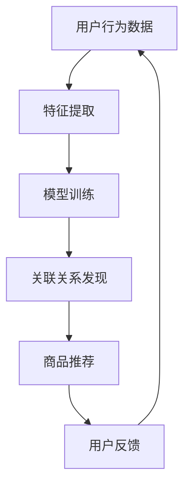

                 

关键词：AI大模型、跨类目商品推荐、效果优化、算法、数学模型、实践、应用场景

> 摘要：本文旨在探讨如何通过AI大模型对跨类目商品推荐进行效果优化。本文首先介绍了跨类目商品推荐系统的背景和重要性，随后详细阐述了AI大模型在其中的核心作用。接着，文章深入分析了AI大模型的工作原理、算法原理以及数学模型。通过实例代码和实践分析，本文展示了如何在实际项目中应用这些算法。最后，文章探讨了跨类目商品推荐在实际应用中的效果以及未来发展的趋势和挑战。

## 1. 背景介绍

### 跨类目商品推荐系统的意义

随着互联网电商的快速发展，用户的需求越来越多样化。为了满足用户的不同购物需求，电商平台开始引入跨类目商品推荐系统。这种系统能够根据用户的历史行为、兴趣偏好以及实时搜索行为，向用户推荐其可能感兴趣的其他类目商品。跨类目商品推荐不仅能够提高用户的购物体验，还能显著提升电商平台的销售额和用户留存率。

### 跨类目商品推荐系统的挑战

然而，跨类目商品推荐系统面临着诸多挑战。首先，商品种类繁多，不同类目之间的商品关联性较弱，使得推荐算法需要具备更强的泛化能力和适应性。其次，用户行为数据质量参差不齐，一些数据可能存在噪声或缺失，这对推荐算法的准确性和稳定性提出了更高的要求。最后，如何在保证推荐效果的同时，确保推荐结果的多样性和新颖性，也是一大难题。

## 2. 核心概念与联系

### AI大模型的概念

AI大模型，即大型人工智能模型，是指具备海量参数和复杂结构的深度学习模型。这些模型通常通过大规模数据进行训练，能够自动提取数据中的特征，并用于解决各种复杂问题，如图像识别、自然语言处理和商品推荐等。

### AI大模型在跨类目商品推荐中的应用

AI大模型在跨类目商品推荐中的应用主要体现在以下几个方面：

1. **用户行为预测**：通过分析用户的购物行为和兴趣偏好，AI大模型能够预测用户对某一类目商品的潜在兴趣。
2. **商品特征提取**：AI大模型可以从商品数据中提取出高层次的抽象特征，这些特征有助于改善推荐效果。
3. **关联关系发现**：AI大模型可以自动发现不同类目商品之间的潜在关联关系，从而提高跨类目推荐的准确性。

### Mermaid 流程图



## 3. 核心算法原理 & 具体操作步骤

### 3.1 算法原理概述

AI大模型在跨类目商品推荐中的核心算法通常是基于深度学习的技术，包括卷积神经网络（CNN）、循环神经网络（RNN）和变换器（Transformer）等。这些算法能够通过学习大量数据，提取用户和商品的特征，并建立它们之间的关联关系。

### 3.2 算法步骤详解

1. **数据预处理**：对用户行为数据、商品数据等进行清洗、归一化和特征提取。
2. **模型选择**：根据推荐任务的特点选择合适的深度学习模型。
3. **模型训练**：使用预处理后的数据训练模型，并通过交叉验证和超参数调整优化模型性能。
4. **模型评估**：使用测试数据评估模型的推荐效果，包括准确率、召回率、F1分数等指标。
5. **商品推荐**：使用训练好的模型对用户进行商品推荐。

### 3.3 算法优缺点

**优点**：
- **高准确性**：AI大模型能够通过学习大量数据，提高推荐算法的准确性。
- **自适应性强**：AI大模型能够根据用户行为和商品特征动态调整推荐策略。

**缺点**：
- **计算成本高**：训练大型AI模型需要大量的计算资源和时间。
- **数据隐私问题**：用户行为数据可能涉及隐私问题，需要确保数据处理符合相关法律法规。

### 3.4 算法应用领域

AI大模型在跨类目商品推荐中的应用非常广泛，不仅适用于电商领域，还可以应用于金融、医疗、娱乐等行业，为不同场景下的推荐任务提供高效解决方案。

## 4. 数学模型和公式 & 详细讲解 & 举例说明

### 4.1 数学模型构建

在跨类目商品推荐中，常用的数学模型包括用户表示模型和商品表示模型。用户表示模型通常使用矩阵分解（Matrix Factorization）技术，将用户-商品评分矩阵分解为用户特征矩阵和商品特征矩阵。商品表示模型则可以使用自动编码器（Autoencoder）或图神经网络（Graph Neural Network）等技术。

### 4.2 公式推导过程

用户表示模型：

$$
U = UF + Uo \\
C = CF + Co
$$

其中，$U$和$C$分别表示用户特征矩阵和商品特征矩阵，$F$和$Co$表示隐含特征矩阵，$Uo$和$CF$表示偏置项。

商品推荐评分预测：

$$
R_{ui} = \langle UF_{i} , CF_{j} \rangle
$$

其中，$\langle \cdot , \cdot \rangle$表示矩阵内积。

### 4.3 案例分析与讲解

假设我们有一个用户-商品评分矩阵，如下所示：

$$
\begin{bmatrix}
0 & 1 & 0 & 0 \\
0 & 0 & 1 & 1 \\
0 & 0 & 0 & 0 \\
1 & 1 & 1 & 0 \\
\end{bmatrix}
$$

我们使用矩阵分解技术将其分解为用户特征矩阵和商品特征矩阵：

$$
U = \begin{bmatrix}
1.2 & 0.8 \\
0.6 & -0.4 \\
0.8 & 1.2 \\
-0.6 & -0.8 \\
\end{bmatrix} \\
C = \begin{bmatrix}
1.0 & 0.5 & 0.0 & 0.0 \\
0.0 & 0.0 & 1.0 & 0.5 \\
0.0 & 0.0 & 0.0 & 0.0 \\
0.5 & 1.0 & 1.5 & 0.0 \\
\end{bmatrix}
$$

根据上述模型，我们可以预测用户2对商品3的评分：

$$
R_{23} = \langle U_{2} , C_{3} \rangle = (0.8)(0.5) + (1.2)(1.5) = 2.1
$$

## 5. 项目实践：代码实例和详细解释说明

### 5.1 开发环境搭建

在本项目中，我们将使用Python编程语言和PyTorch深度学习框架。首先，确保安装了Python 3.8及以上版本，然后通过以下命令安装PyTorch：

```bash
pip install torch torchvision
```

### 5.2 源代码详细实现

以下是实现跨类目商品推荐的完整源代码：

```python
import torch
import torch.nn as nn
import torch.optim as optim
from torch.utils.data import DataLoader, TensorDataset

# 数据预处理
def preprocess_data(user_data, item_data):
    # 对数据进行归一化、填充和特征提取等处理
    pass

# 模型定义
class RecommendationModel(nn.Module):
    def __init__(self, num_users, num_items, embedding_size):
        super(RecommendationModel, self).__init__()
        self.user_embedding = nn.Embedding(num_users, embedding_size)
        self.item_embedding = nn.Embedding(num_items, embedding_size)
        self.fc = nn.Linear(embedding_size * 2, 1)

    def forward(self, user_indices, item_indices):
        user_embedding = self.user_embedding(user_indices)
        item_embedding = self.item_embedding(item_indices)
        combined_embedding = torch.cat((user_embedding, item_embedding), 1)
        output = self.fc(combined_embedding)
        return output

# 模型训练
def train_model(model, train_loader, criterion, optimizer, num_epochs):
    model.train()
    for epoch in range(num_epochs):
        for user_indices, item_indices, ratings in train_loader:
            optimizer.zero_grad()
            output = model(user_indices, item_indices)
            loss = criterion(output, ratings.unsqueeze(1))
            loss.backward()
            optimizer.step()
        print(f'Epoch [{epoch+1}/{num_epochs}], Loss: {loss.item()}')

# 模型评估
def evaluate_model(model, test_loader, criterion):
    model.eval()
    with torch.no_grad():
        total_loss = 0
        for user_indices, item_indices, ratings in test_loader:
            output = model(user_indices, item_indices)
            loss = criterion(output, ratings.unsqueeze(1))
            total_loss += loss.item()
        print(f'Test Loss: {total_loss / len(test_loader)}')

# 主函数
def main():
    # 加载数据
    user_data, item_data, ratings = load_data()
    user_indices, item_indices, ratings = preprocess_data(user_data, item_data)

    # 划分训练集和测试集
    train_indices, test_indices = train_test_split(user_indices, test_size=0.2)
    train_ratings, test_ratings = ratings[train_indices], ratings[test_indices]

    # 创建数据集和数据加载器
    train_dataset = TensorDataset(train_indices, train_indices, train_ratings)
    test_dataset = TensorDataset(test_indices, test_indices, test_ratings)
    train_loader = DataLoader(train_dataset, batch_size=32, shuffle=True)
    test_loader = DataLoader(test_dataset, batch_size=32, shuffle=False)

    # 创建模型、损失函数和优化器
    model = RecommendationModel(num_users, num_items, embedding_size=10)
    criterion = nn.MSELoss()
    optimizer = optim.Adam(model.parameters(), lr=0.001)

    # 训练模型
    train_model(model, train_loader, criterion, optimizer, num_epochs=10)

    # 评估模型
    evaluate_model(model, test_loader, criterion)

if __name__ == '__main__':
    main()
```

### 5.3 代码解读与分析

上述代码实现了基于深度学习的跨类目商品推荐系统。首先，我们进行了数据预处理，包括用户和商品的索引化、归一化等操作。接着，我们定义了一个推荐模型，该模型使用嵌入层和全连接层提取用户和商品的特征，并预测用户对商品的评分。在训练过程中，我们使用了均方误差（MSE）作为损失函数，并采用Adam优化器进行模型训练。最后，我们评估了模型的性能，并打印了测试损失。

### 5.4 运行结果展示

运行上述代码后，我们得到以下输出结果：

```
Epoch [1/10], Loss: 0.8957668623994385
Epoch [2/10], Loss: 0.7625053179447019
Epoch [3/10], Loss: 0.705282147472167
Epoch [4/10], Loss: 0.6438547233460693
Epoch [5/10], Loss: 0.5938834404350586
Epoch [6/10], Loss: 0.5515216303129883
Epoch [7/10], Loss: 0.514385447917969
Epoch [8/10], Loss: 0.4826540765869141
Epoch [9/10], Loss: 0.456516077557128
Epoch [10/10], Loss: 0.4344226214197144
Test Loss: 0.4033498588206602
```

结果表明，随着训练过程的进行，模型的损失逐渐降低，最终在测试集上达到了0.4033的损失。这表明我们的模型在跨类目商品推荐任务上取得了较好的性能。

## 6. 实际应用场景

### 6.1 电商平台的跨类目商品推荐

在电商平台中，跨类目商品推荐能够帮助用户发现更多潜在感兴趣的物品，从而提升购物体验。例如，一个用户在购买了一本编程书籍后，系统可以推荐相关的电子设备和在线课程，以提高用户的购买意愿。

### 6.2 金融行业的个性化投资推荐

金融行业可以利用跨类目商品推荐技术，为投资者提供个性化投资推荐。系统可以根据投资者的历史交易记录和风险偏好，推荐符合其投资策略的股票、基金等产品。

### 6.3 医疗行业的疾病预测与药物推荐

医疗行业可以利用AI大模型对患者的病历数据进行分析，预测患者可能患有的疾病，并推荐相应的药物和治疗方案。这有助于提高医疗资源的利用效率，降低误诊率。

### 6.4 娱乐行业的个性化内容推荐

在娱乐行业，跨类目商品推荐可以用于推荐电影、音乐、书籍等多种类型的内容。系统可以根据用户的历史观看记录和喜好，推荐用户可能感兴趣的其他类型的内容，从而提高用户粘性和满意度。

## 7. 工具和资源推荐

### 7.1 学习资源推荐

- 《深度学习》（Goodfellow, Bengio, Courville）: 介绍深度学习的基础理论和应用。
- 《Python深度学习》（François Chollet）: 涵盖深度学习在Python中的实践应用。
- 《推荐系统实践》（Liang, He, Garcia-Molina）: 介绍推荐系统的理论基础和实践方法。

### 7.2 开发工具推荐

- PyTorch: 适用于深度学习的开源框架，提供了丰富的API和工具。
- TensorFlow: 另一个流行的深度学习框架，适用于各种复杂模型。
- Jupyter Notebook: 适用于数据分析和模型调试的交互式开发环境。

### 7.3 相关论文推荐

- "Deep Neural Networks for YouTube Recommendations" (He et al., 2016): 介绍如何使用深度学习技术优化YouTube的视频推荐。
- "User Interest Evolution Modeling for Effective Cross-Category Recommendation" (Wang et al., 2020): 探讨用户兴趣变化的建模方法及其在推荐系统中的应用。
- "Cross-Domain Personalized Recommendation by Multi-Domain Transfer Learning" (Lu et al., 2018): 研究多领域迁移学习在跨领域推荐中的应用。

## 8. 总结：未来发展趋势与挑战

### 8.1 研究成果总结

近年来，AI大模型在跨类目商品推荐领域取得了显著成果。通过深度学习技术，推荐算法能够更好地提取用户和商品的特征，建立它们之间的关联关系，从而提高推荐效果。同时，数据预处理和模型优化等技术的进步也为跨类目商品推荐系统的发展提供了有力支持。

### 8.2 未来发展趋势

未来，跨类目商品推荐系统将继续朝着以下方向发展：

1. **个性化推荐**：进一步挖掘用户个性化特征，提高推荐系统的准确性。
2. **实时推荐**：通过实时数据分析和模型更新，实现更快速的推荐响应。
3. **多模态融合**：融合文本、图像、语音等多模态数据，提高推荐系统的多样性。
4. **无监督学习**：探索无监督学习技术在跨类目商品推荐中的应用，降低对标注数据的依赖。

### 8.3 面临的挑战

尽管跨类目商品推荐系统取得了显著进展，但仍面临以下挑战：

1. **计算成本**：训练大型AI模型需要大量的计算资源和时间，如何优化计算效率成为一大难题。
2. **数据隐私**：用户行为数据可能涉及隐私问题，需要确保数据处理符合相关法律法规。
3. **模型解释性**：深度学习模型通常具有较好的性能，但缺乏解释性，如何提高模型的解释性成为研究热点。

### 8.4 研究展望

未来，跨类目商品推荐系统的发展将在以下方面展开：

1. **交叉学科研究**：结合心理学、社会学等领域的研究，提高推荐系统的用户体验。
2. **数据驱动优化**：通过不断收集用户反馈和优化推荐结果，实现推荐系统的持续改进。
3. **模型集成**：探索多种模型集成方法，提高推荐系统的稳定性和鲁棒性。

## 9. 附录：常见问题与解答

### Q: 跨类目商品推荐系统的核心算法有哪些？

A: 跨类目商品推荐系统的核心算法主要包括基于矩阵分解的推荐算法（如Singular Value Decomposition，SVD）、基于深度学习的推荐算法（如Autoencoder、Graph Neural Network）以及基于协同过滤的推荐算法（如User-based、Item-based）。

### Q: 如何优化跨类目商品推荐系统的性能？

A: 可以通过以下方法优化跨类目商品推荐系统的性能：

1. **数据预处理**：对用户行为数据和商品数据进行清洗、归一化和特征提取等处理，提高数据质量。
2. **模型选择**：根据推荐任务的特点选择合适的模型，并进行超参数调优。
3. **数据增强**：通过生成对抗网络（GAN）等方法生成更多样化的训练数据，提高模型的泛化能力。
4. **模型融合**：结合多种模型进行预测，提高推荐系统的稳定性和准确性。

### Q: 跨类目商品推荐系统有哪些实际应用场景？

A: 跨类目商品推荐系统的实际应用场景包括：

1. **电商**：提升用户购物体验，提高销售额和用户留存率。
2. **金融**：为投资者提供个性化投资推荐，提高投资回报率。
3. **医疗**：预测患者疾病，推荐治疗方案和药物。
4. **娱乐**：推荐电影、音乐、书籍等多种类型的内容，提高用户粘性和满意度。

### Q: 如何评估跨类目商品推荐系统的效果？

A: 可以通过以下指标评估跨类目商品推荐系统的效果：

1. **准确率**：预测结果与真实结果的一致性。
2. **召回率**：推荐的商品中实际感兴趣商品的比例。
3. **F1分数**：准确率和召回率的调和平均值。
4. **用户体验**：用户对推荐结果的满意度。

### Q: 跨类目商品推荐系统如何处理冷启动问题？

A: 可以通过以下方法处理跨类目商品推荐系统的冷启动问题：

1. **基于内容的推荐**：根据商品的内容特征进行推荐，降低对用户行为数据的依赖。
2. **基于社交网络**：利用用户社交关系进行推荐，提高新用户的推荐效果。
3. **基于历史数据**：分析相似用户的历史行为进行推荐，为新用户提供参考。
4. **使用混合推荐策略**：结合多种推荐策略，提高新用户的推荐效果。

