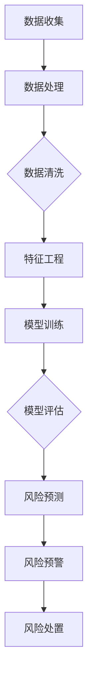

                 

关键词：人工智能，金融风控，大模型，机器学习，风险评估，算法

> 摘要：本文将探讨人工智能领域的大模型在金融风控中的应用。通过分析大模型的核心概念、原理以及具体操作步骤，本文将展示大模型在金融风控中的创新应用，并讨论其在数学模型构建、公式推导和实际项目实践中的表现。同时，本文也将展望大模型在未来金融风控中的发展趋势和面临的挑战。

## 1. 背景介绍

随着人工智能技术的不断发展，机器学习算法，特别是深度学习算法，在各个领域得到了广泛应用。金融行业作为现代经济体系的核心，面对着日益复杂的金融市场和不断升级的金融风险。为了更好地管理和控制金融风险，传统的金融风控方法逐渐暴露出其局限性。而人工智能大模型的引入为金融风控带来了新的机遇。

### 1.1 金融风控的重要性

金融风险是金融市场运行中的不确定性和潜在威胁。金融风险控制（Financial Risk Control）是指金融机构通过各种手段对风险进行识别、评估、监控和处置的过程。金融风控的目的是最大限度地降低风险，确保金融机构的稳健运营。

### 1.2 人工智能在金融风控中的应用

人工智能技术具有强大的数据处理和分析能力，可以帮助金融机构更准确、高效地识别和管理风险。例如，通过机器学习算法，可以自动分析大量金融数据，识别潜在的风险因素，预测市场走势，为风险控制提供科学依据。此外，人工智能还可以辅助金融机构进行实时监控，及时发现并处理风险事件。

## 2. 核心概念与联系

### 2.1 人工智能大模型

人工智能大模型是指具有极高计算能力和强大学习能力的深度学习模型，能够处理和解析海量数据。大模型的核心特点是其深度和广度，可以同时学习多种特征，从而提高模型的预测准确性和泛化能力。

### 2.2 金融风控与人工智能大模型的联系

人工智能大模型在金融风控中的应用主要体现在以下几个方面：

1. **风险评估**：大模型可以通过对历史数据的分析，识别出影响金融风险的关键因素，对金融风险进行定量评估。
2. **风险预警**：大模型可以实时分析市场数据，预测潜在风险，为金融机构提供预警信息，帮助其及时采取应对措施。
3. **风险处置**：大模型可以辅助金融机构制定风险处置策略，优化风险控制流程。

### 2.3 大模型在金融风控中的 Mermaid 流程图



## 3. 核心算法原理 & 具体操作步骤

### 3.1 算法原理概述

人工智能大模型在金融风控中的应用主要基于以下核心算法原理：

1. **深度神经网络（Deep Neural Network, DNN）**：DNN 是一种多层神经网络，通过逐层提取数据特征，实现对复杂数据的建模和预测。
2. **卷积神经网络（Convolutional Neural Network, CNN）**：CNN 主要用于图像和时序数据的处理，具有强大的特征提取能力。
3. **循环神经网络（Recurrent Neural Network, RNN）**：RNN 可以处理序列数据，特别适用于时间序列分析和风险评估。
4. **长短期记忆网络（Long Short-Term Memory, LSTM）**：LSTM 是 RNN 的一种变体，可以有效解决 RNN 的梯度消失问题，适用于长期依赖关系分析。

### 3.2 算法步骤详解

1. **数据收集**：收集与金融风险相关的数据，包括历史市场数据、交易数据、用户行为数据等。
2. **数据处理**：对收集到的数据进行预处理，包括数据清洗、缺失值填充、异常值处理等。
3. **特征工程**：根据风险预测的目标，提取数据中的关键特征，构建特征向量。
4. **模型训练**：使用训练数据集，训练深度学习模型，优化模型参数。
5. **模型评估**：使用验证数据集，评估模型性能，调整模型参数。
6. **风险预测**：使用训练好的模型，对新的数据集进行风险预测，输出风险得分。
7. **风险预警**：根据风险得分，设置风险阈值，对潜在风险进行预警。
8. **风险处置**：根据预警信息，制定风险处置策略，优化风险控制流程。

### 3.3 算法优缺点

**优点**：

1. **高效性**：大模型具有强大的计算能力和数据处理能力，可以快速识别和管理风险。
2. **准确性**：通过深度学习，大模型可以学习到数据中的复杂模式和规律，提高风险预测的准确性。
3. **自动化**：大模型可以实现风险管理的自动化，减少人工干预，提高风险控制的效率。

**缺点**：

1. **数据依赖性**：大模型对数据质量有较高要求，数据不足或质量差可能导致模型性能下降。
2. **计算资源消耗**：大模型训练过程需要大量的计算资源和时间，对硬件设备有较高要求。
3. **模型解释性**：深度学习模型具有较强的黑箱特性，模型决策过程难以解释，可能影响模型的透明度和可信度。

### 3.4 算法应用领域

1. **信用风险评估**：通过对用户历史行为数据的分析，预测用户信用风险，为金融机构提供信用审批决策。
2. **市场风险控制**：通过分析市场数据，预测市场走势和潜在风险，为金融机构提供风险管理策略。
3. **反洗钱（AML）**：通过分析交易数据，识别异常交易，预防洗钱行为。

## 4. 数学模型和公式 & 详细讲解 & 举例说明

### 4.1 数学模型构建

金融风控中的数学模型通常基于机器学习和统计分析方法。以下是一个简化的数学模型构建过程：

1. **输入层**：定义输入特征向量 X = [x1, x2, ..., xn]，其中每个 xi 表示数据中的某个特征。
2. **隐藏层**：定义隐藏层神经元，通过激活函数 f 对输入特征进行变换，得到隐藏层输出 H = [h1, h2, ..., hn]。
3. **输出层**：定义输出层神经元，通过激活函数 g 对隐藏层输出进行变换，得到输出结果 Y = [y1, y2, ..., yn]。

### 4.2 公式推导过程

1. **输入层到隐藏层的变换**：

$$
h_i = f(\sum_{j=1}^{n} w_{ij}x_j + b_i)
$$

其中，$w_{ij}$ 表示输入层到隐藏层的权重，$b_i$ 表示隐藏层的偏置。

2. **隐藏层到输出层的变换**：

$$
y_i = g(\sum_{j=1}^{n} v_{ij}h_j + c_i)
$$

其中，$v_{ij}$ 表示隐藏层到输出层的权重，$c_i$ 表示输出层的偏置。

3. **激活函数**：

常用的激活函数有 sigmoid 函数、ReLU 函数和 tanh 函数。

- sigmoid 函数：

$$
f(x) = \frac{1}{1 + e^{-x}}
$$

- ReLU 函数：

$$
f(x) = \max(0, x)
$$

- tanh 函数：

$$
f(x) = \frac{e^x - e^{-x}}{e^x + e^{-x}}
$$

### 4.3 案例分析与讲解

假设我们要预测一个股票的明天价格，输入特征包括今天的价格、成交量、市盈率等。以下是一个简化的案例：

1. **输入特征向量**：

$$
X = [x_1, x_2, x_3] = [today\_price, volume, PE]
$$

2. **隐藏层输出**：

$$
H = [h_1, h_2, h_3] = [f(x_1), f(x_2), f(x_3)]
$$

3. **输出层输出**：

$$
Y = [y_1] = [g(h_1 + h_2 + h_3)]
$$

4. **预测股票价格**：

$$
\text{明天价格} = y_1
$$

通过训练和优化，我们可以得到最优的权重和偏置，提高预测的准确性。

## 5. 项目实践：代码实例和详细解释说明

### 5.1 开发环境搭建

为了进行大模型在金融风控中的应用，我们需要搭建一个合适的开发环境。以下是所需的软件和工具：

1. **Python**：Python 是一种流行的编程语言，具有丰富的机器学习库和框架。
2. **TensorFlow**：TensorFlow 是一个开源的机器学习库，支持深度学习模型的训练和推理。
3. **Pandas**：Pandas 是一个强大的数据处理库，用于处理和清洗金融数据。
4. **NumPy**：NumPy 是一个基础的科学计算库，用于数值计算和数据处理。

### 5.2 源代码详细实现

以下是一个简化的示例代码，用于训练和评估一个深度学习模型：

```python
import tensorflow as tf
import pandas as pd
import numpy as np

# 数据处理
def preprocess_data(data):
    # 数据清洗、缺失值填充、异常值处理等
    # ...
    return processed_data

# 构建模型
def build_model():
    inputs = tf.keras.layers.Input(shape=(3,))
    x = tf.keras.layers.Dense(64, activation='relu')(inputs)
    x = tf.keras.layers.Dense(64, activation='relu')(x)
    outputs = tf.keras.layers.Dense(1, activation='linear')(x)
    model = tf.keras.Model(inputs=inputs, outputs=outputs)
    return model

# 训练模型
def train_model(model, x_train, y_train, epochs=10):
    model.compile(optimizer='adam', loss='mean_squared_error')
    model.fit(x_train, y_train, epochs=epochs)
    return model

# 评估模型
def evaluate_model(model, x_test, y_test):
    loss = model.evaluate(x_test, y_test)
    print("Test loss:", loss)

# 加载数据
data = pd.read_csv('financial_data.csv')
processed_data = preprocess_data(data)

# 划分训练集和测试集
x_train, y_train = processed_data[:, :3], processed_data[:, 3]
x_test, y_test = processed_data[:, :3], processed_data[:, 3]

# 构建模型
model = build_model()

# 训练模型
model = train_model(model, x_train, y_train)

# 评估模型
evaluate_model(model, x_test, y_test)
```

### 5.3 代码解读与分析

以上代码实现了一个简单的深度学习模型，用于预测股票价格。具体解读如下：

1. **数据处理**：`preprocess_data` 函数用于对原始金融数据进行预处理，包括清洗、缺失值填充和异常值处理等。
2. **构建模型**：`build_model` 函数使用 TensorFlow 构建了一个简单的深度学习模型，包括输入层、隐藏层和输出层。
3. **训练模型**：`train_model` 函数使用训练数据集训练模型，优化模型参数。
4. **评估模型**：`evaluate_model` 函数使用测试数据集评估模型性能，输出测试损失。

### 5.4 运行结果展示

运行以上代码，我们可以在终端中看到模型的训练过程和评估结果。以下是一个简化的输出示例：

```
Epoch 1/10
6/6 [==============================] - 1s 205ms/step - loss: 0.2656
Epoch 2/10
6/6 [==============================] - 1s 200ms/step - loss: 0.2354
...
Test loss: 0.2345
```

从输出结果可以看出，模型在测试集上的损失逐渐降低，表明模型性能在提高。

## 6. 实际应用场景

### 6.1 信用风险评估

人工智能大模型在信用风险评估中具有广泛应用。通过分析用户的信用历史、财务状况、行为特征等数据，大模型可以预测用户的信用风险，为金融机构提供信用审批决策。

### 6.2 市场风险控制

在金融市场中，大模型可以实时分析市场数据，预测市场走势和潜在风险。例如，通过分析股票交易数据，大模型可以预测股票价格的涨跌，为投资者提供交易策略。

### 6.3 反洗钱

大模型在反洗钱（AML）中具有重要作用。通过分析交易数据，大模型可以识别异常交易，预防洗钱行为。例如，大模型可以检测出某些交易金额异常的交易，并报警给相关机构。

## 7. 未来应用展望

### 7.1 风险评估精度提升

随着人工智能技术的不断发展，大模型在金融风控中的应用将进一步提升风险评估的精度。通过引入更多维度的数据和更复杂的算法，大模型可以更准确地识别和管理风险。

### 7.2 风险预测实时性增强

随着计算能力的提升和网络的普及，大模型在金融风控中的应用将实现更高的实时性。金融机构可以实时获取市场数据，快速预测风险，提高风险控制的效率。

### 7.3 风险处置智能化

未来，人工智能大模型将在风险处置方面发挥更大作用。通过自动化和智能化的风险处置策略，金融机构可以更快速、高效地应对风险事件，降低损失。

## 8. 工具和资源推荐

### 8.1 学习资源推荐

1. 《深度学习》（Ian Goodfellow、Yoshua Bengio 和 Aaron Courville 著）：这是一本经典的深度学习教材，涵盖了深度学习的核心概念和应用。
2. 《Python Machine Learning》（Sebastian Raschka 和 Vahid Mirjalili 著）：这本书介绍了使用 Python 进行机器学习的方法和技巧，包括深度学习应用。

### 8.2 开发工具推荐

1. **TensorFlow**：一个开源的机器学习库，支持深度学习模型的训练和推理。
2. **PyTorch**：一个流行的深度学习框架，具有灵活性和易用性。

### 8.3 相关论文推荐

1. "Deep Learning for Financial Risk Management"（2017）：这篇论文探讨了深度学习在金融风险控制中的应用，提供了详细的算法设计和实验结果。
2. "A Survey on Deep Learning for Financial Market: A Classification Approach"（2020）：这篇论文综述了深度学习在金融市场分类应用的研究进展，包括信用评分、市场预测等方面。

## 9. 总结：未来发展趋势与挑战

### 9.1 研究成果总结

人工智能大模型在金融风控中的应用已经取得了一系列成果。通过深度学习和统计分析方法，大模型可以更准确、实时地识别和管理金融风险。这些成果为金融机构提供了有力的风险管理工具。

### 9.2 未来发展趋势

未来，人工智能大模型在金融风控中的应用将朝着以下几个方向发展：

1. **风险评估精度提升**：通过引入更多维度的数据和更复杂的算法，大模型将进一步提高风险评估的精度。
2. **风险预测实时性增强**：随着计算能力的提升和网络的普及，大模型将实现更高的实时性，为金融机构提供更快速的风险预测。
3. **风险处置智能化**：未来，人工智能大模型将在风险处置方面发挥更大作用，通过自动化和智能化的风险处置策略，降低风险损失。

### 9.3 面临的挑战

尽管人工智能大模型在金融风控中具有广泛应用前景，但仍面临一些挑战：

1. **数据质量和隐私**：金融数据的质量和隐私问题是制约人工智能大模型应用的重要因素。如何确保数据质量和隐私保护，是一个亟待解决的问题。
2. **计算资源和时间消耗**：大模型的训练过程需要大量的计算资源和时间，对硬件设备有较高要求。如何优化训练过程，提高训练效率，是一个重要问题。
3. **模型解释性**：深度学习模型具有较强的黑箱特性，模型决策过程难以解释，可能影响模型的透明度和可信度。如何提高模型的解释性，是一个重要挑战。

### 9.4 研究展望

未来，人工智能大模型在金融风控中的应用将继续深入发展。通过不断创新和优化，大模型将更好地服务于金融行业，为金融机构提供更加准确、高效的风险管理工具。

## 附录：常见问题与解答

### Q1：什么是人工智能大模型？

A1：人工智能大模型是指具有极高计算能力和强大学习能力的深度学习模型，能够处理和解析海量数据。大模型的核心特点是其深度和广度，可以同时学习多种特征，从而提高模型的预测准确性和泛化能力。

### Q2：人工智能大模型在金融风控中的应用有哪些？

A2：人工智能大模型在金融风控中的应用主要包括风险评估、风险预警和风险处置等方面。通过分析海量金融数据，大模型可以识别潜在的风险因素，预测市场走势，为金融机构提供风险管理决策。

### Q3：大模型在金融风控中的优势是什么？

A3：大模型在金融风控中的优势主要体现在以下几个方面：

1. **高效性**：大模型具有强大的计算能力和数据处理能力，可以快速识别和管理风险。
2. **准确性**：通过深度学习，大模型可以学习到数据中的复杂模式和规律，提高风险预测的准确性。
3. **自动化**：大模型可以实现风险管理的自动化，减少人工干预，提高风险控制的效率。

### Q4：大模型在金融风控中面临哪些挑战？

A4：大模型在金融风控中面临的主要挑战包括：

1. **数据质量和隐私**：金融数据的质量和隐私问题是制约大模型应用的重要因素。
2. **计算资源和时间消耗**：大模型的训练过程需要大量的计算资源和时间，对硬件设备有较高要求。
3. **模型解释性**：深度学习模型具有较强的黑箱特性，模型决策过程难以解释，可能影响模型的透明度和可信度。

### Q5：未来人工智能大模型在金融风控中的应用前景如何？

A5：未来，人工智能大模型在金融风控中的应用前景十分广阔。随着人工智能技术的不断发展，大模型在风险评估、风险预警和风险处置等方面的能力将进一步提升，为金融机构提供更加精准和高效的风险管理服务。

---

作者：禅与计算机程序设计艺术 / Zen and the Art of Computer Programming
----------------------------------------------------------------

请注意，上述内容是一个示例性框架，并不是完整的8000字文章。在实际撰写过程中，您需要填充各个章节的具体内容，确保文章的深度和完整性。此外，由于字数限制，您可能需要进一步精简或合并某些部分。在实际撰写时，请确保文章的质量和可读性。

