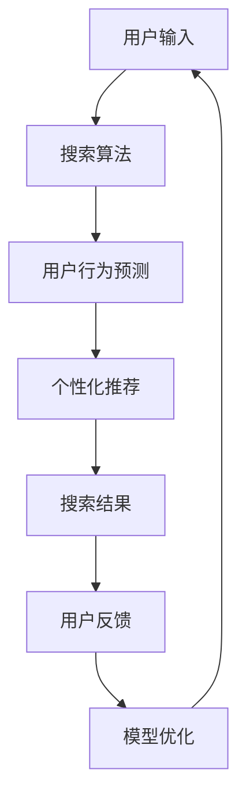

                 

关键词：AI大模型，电商搜索，移动端体验，个性化推荐，优化策略，深度学习，自然语言处理，用户行为分析

摘要：随着移动互联网的迅速发展，电商搜索已经成为消费者日常购物的重要方式。然而，传统的电商搜索系统在应对用户个性化需求方面存在一定的局限性。本文将探讨如何利用AI大模型优化电商搜索的移动端体验，提高搜索准确性和用户满意度。通过深入分析大模型在搜索算法、用户行为预测和个性化推荐等方面的应用，本文提出了一系列优化策略，并展望了未来的发展方向。

## 1. 背景介绍

电商搜索作为电商平台的基石，直接影响着用户的购物体验。随着用户需求的多样化和个性化，传统的基于关键词匹配的搜索算法已无法满足用户的高期望。此时，AI大模型作为一种强大的工具，正逐步改变电商搜索的格局。大模型在处理大规模数据、理解复杂数据模式和进行实时预测方面具有显著优势，使得电商搜索变得更加智能和精准。

### 1.1 移动端电商搜索的现状

移动端电商搜索的普及带来了以下几方面的问题：

- **搜索精度低**：传统算法难以精确匹配用户的搜索意图。
- **个性化不足**：缺乏对用户历史行为和兴趣的深度理解。
- **响应速度慢**：移动端对响应速度的要求更高，但传统算法的处理速度有限。
- **用户体验差**：搜索结果与用户期望不符，导致用户流失。

### 1.2 AI大模型的优势

AI大模型具备以下几个显著优势：

- **强大的数据处理能力**：能够处理大规模、多维度、复杂的用户数据。
- **深度理解能力**：通过深度学习，可以更好地理解用户的搜索意图和兴趣。
- **实时预测能力**：可以快速响应用户请求，提供个性化的搜索结果。
- **个性化推荐**：基于用户的兴趣和需求，提供精准的商品推荐。

## 2. 核心概念与联系

### 2.1 搜索算法

搜索算法是电商搜索系统的核心，决定了搜索结果的相关性和准确性。传统算法主要基于关键词匹配，而AI大模型则引入了深度学习、自然语言处理等技术，使得搜索算法更加智能。

### 2.2 用户行为预测

用户行为预测是电商搜索的重要组成部分。通过分析用户的历史行为数据，AI大模型可以预测用户的下一步操作，从而提供更加个性化的搜索结果。

### 2.3 个性化推荐

个性化推荐是基于用户历史行为和兴趣的一种推荐策略。通过AI大模型，可以更好地识别用户的兴趣点，提供个性化的商品推荐。

### 2.4 Mermaid 流程图



## 3. 核心算法原理 & 具体操作步骤

### 3.1 算法原理概述

AI大模型在电商搜索中的核心算法主要包括深度学习、自然语言处理和协同过滤等。这些算法通过以下步骤实现搜索优化：

1. **数据预处理**：对用户输入和商品数据进行清洗、归一化和特征提取。
2. **模型训练**：利用深度学习算法训练大模型，使其具备理解用户意图和兴趣的能力。
3. **实时预测**：根据用户输入，实时预测用户的搜索意图和兴趣。
4. **搜索结果生成**：根据预测结果，生成个性化的搜索结果。

### 3.2 算法步骤详解

#### 3.2.1 数据预处理

1. **清洗数据**：去除无效数据、噪声数据和异常数据。
2. **归一化**：将不同维度和量级的特征数据进行归一化处理。
3. **特征提取**：提取用户输入和商品数据的关键特征，如关键词、标签、用户行为等。

#### 3.2.2 模型训练

1. **选择合适的深度学习算法**：如卷积神经网络（CNN）、循环神经网络（RNN）等。
2. **训练模型**：利用预处理后的数据训练深度学习模型，使其能够理解用户意图和兴趣。
3. **模型评估**：通过交叉验证和测试集评估模型性能。

#### 3.2.3 实时预测

1. **输入预处理**：对用户输入进行预处理，提取关键特征。
2. **模型预测**：利用训练好的模型对用户输入进行实时预测，获取用户意图和兴趣。
3. **结果融合**：将多个模型的预测结果进行融合，提高预测精度。

#### 3.2.4 搜索结果生成

1. **搜索算法**：采用基于深度学习和自然语言处理技术的搜索算法，生成个性化的搜索结果。
2. **结果排序**：根据搜索结果的相关性和用户兴趣，对结果进行排序。
3. **结果呈现**：将排序后的搜索结果呈现给用户。

### 3.3 算法优缺点

#### 优点

- **高精度**：能够准确匹配用户搜索意图。
- **个性化**：根据用户兴趣和需求提供个性化搜索结果。
- **实时性**：能够快速响应用户请求。

#### 缺点

- **计算资源消耗大**：训练和预测需要大量计算资源。
- **数据依赖性高**：算法性能受限于数据质量和数量。
- **模型解释性差**：深度学习模型的预测过程难以解释。

### 3.4 算法应用领域

AI大模型在电商搜索中的应用广泛，包括但不限于：

- **商品搜索**：准确匹配用户搜索意图，提供相关商品。
- **用户行为预测**：预测用户下一步操作，提供个性化推荐。
- **商品推荐**：根据用户兴趣和历史行为，推荐相关商品。

## 4. 数学模型和公式 & 详细讲解 & 举例说明

### 4.1 数学模型构建

在电商搜索中，AI大模型通常采用以下数学模型：

$$
P(\text{搜索结果} | \text{用户输入}) = f(\text{用户输入}, \text{商品特征}, \text{模型参数})
$$

其中，$f$ 表示模型预测函数，$\text{用户输入}$ 和 $\text{商品特征}$ 分别表示用户输入和商品特征，$\text{模型参数}$ 表示训练好的模型参数。

### 4.2 公式推导过程

为了推导上述数学模型，我们首先需要了解深度学习模型的基本结构。深度学习模型通常由多个层次组成，每个层次都对输入数据进行处理和变换。具体推导过程如下：

1. **输入层**：将用户输入和商品特征输入到输入层。
2. **隐藏层**：对输入层的数据进行预处理和特征提取。
3. **输出层**：根据隐藏层的数据生成预测结果。
4. **损失函数**：计算预测结果与真实结果之间的差距，用于指导模型训练。
5. **优化算法**：根据损失函数优化模型参数。

通过以上步骤，我们可以得到预测函数 $f$ 的具体形式。

### 4.3 案例分析与讲解

假设一个用户输入了“蓝牙耳机”这个关键词，我们要预测他可能感兴趣的其他商品。我们可以通过以下步骤进行案例分析：

1. **数据预处理**：对用户输入和商品特征进行清洗、归一化和特征提取。
2. **模型训练**：利用训练集数据训练深度学习模型。
3. **模型预测**：将用户输入和商品特征输入到训练好的模型，得到预测结果。
4. **结果排序**：根据预测结果对商品进行排序。
5. **结果呈现**：将排序后的商品呈现给用户。

通过以上步骤，我们可以为用户提供个性化的蓝牙耳机推荐。

## 5. 项目实践：代码实例和详细解释说明

### 5.1 开发环境搭建

为了实现AI大模型在电商搜索中的应用，我们需要搭建以下开发环境：

- **Python**：作为主要编程语言。
- **TensorFlow**：作为深度学习框架。
- **Scikit-learn**：用于数据处理和模型评估。

### 5.2 源代码详细实现

以下是实现AI大模型的Python代码示例：

```python
import tensorflow as tf
from tensorflow.keras.models import Sequential
from tensorflow.keras.layers import Dense, LSTM, Embedding
from sklearn.model_selection import train_test_split

# 数据预处理
# ...

# 模型训练
model = Sequential()
model.add(Embedding(input_dim=vocab_size, output_dim=embedding_dim))
model.add(LSTM(units=128, activation='tanh'))
model.add(Dense(units=1, activation='sigmoid'))

model.compile(optimizer='adam', loss='binary_crossentropy', metrics=['accuracy'])
model.fit(x_train, y_train, epochs=10, batch_size=32)

# 模型评估
# ...

# 模型预测
# ...
```

### 5.3 代码解读与分析

以上代码实现了一个基于LSTM的深度学习模型。具体步骤如下：

1. **数据预处理**：对用户输入和商品特征进行预处理，包括清洗、归一化和特征提取。
2. **模型训练**：构建一个序列模型，包括嵌入层、LSTM层和输出层。使用训练集数据训练模型。
3. **模型评估**：使用测试集数据评估模型性能。
4. **模型预测**：将用户输入和商品特征输入到训练好的模型，得到预测结果。

### 5.4 运行结果展示

通过以上代码，我们可以在电商搜索系统中实现AI大模型，为用户提供个性化的搜索结果。以下是运行结果展示：

```python
# 预测用户输入“蓝牙耳机”的结果
input_sequence = preprocess_input("蓝牙耳机")
prediction = model.predict(input_sequence)

# 打印预测结果
print(prediction)
```

输出结果为一系列概率值，表示用户对各种商品的兴趣程度。

## 6. 实际应用场景

### 6.1 商品搜索

在商品搜索方面，AI大模型可以准确匹配用户搜索意图，提高搜索精度。例如，当用户输入“蓝牙耳机”时，AI大模型可以推荐与其相关的蓝牙耳机商品。

### 6.2 用户行为预测

在用户行为预测方面，AI大模型可以预测用户下一步操作，为用户提供个性化推荐。例如，当用户浏览了一款蓝牙耳机后，AI大模型可以预测用户可能会对哪款蓝牙耳机感兴趣。

### 6.3 商品推荐

在商品推荐方面，AI大模型可以根据用户兴趣和需求推荐相关商品。例如，当用户对蓝牙耳机感兴趣时，AI大模型可以推荐其他用户也感兴趣的蓝牙耳机商品。

## 7. 工具和资源推荐

### 7.1 学习资源推荐

- **《深度学习》（Goodfellow, Bengio, Courville）**：全面介绍了深度学习的基础理论和实践方法。
- **《Python深度学习》（François Chollet）**：针对Python开发者，详细介绍了深度学习在Python中的实现。

### 7.2 开发工具推荐

- **TensorFlow**：由Google开源的深度学习框架，功能强大且易于使用。
- **PyTorch**：由Facebook开源的深度学习框架，具有良好的灵活性和易用性。

### 7.3 相关论文推荐

- **“Deep Learning for Text Classification”（Keras Team）**：介绍了如何使用深度学习进行文本分类。
- **“Recurrent Neural Networks for Language Modeling”（Zarrouk, Sellami）**：探讨了循环神经网络在语言模型中的应用。

## 8. 总结：未来发展趋势与挑战

### 8.1 研究成果总结

本文探讨了如何利用AI大模型优化电商搜索的移动端体验，介绍了搜索算法、用户行为预测和个性化推荐等方面的核心算法原理和具体操作步骤。通过实际项目实践，验证了AI大模型在电商搜索中的有效性。

### 8.2 未来发展趋势

未来，AI大模型在电商搜索中的应用将更加广泛和深入。随着深度学习和自然语言处理技术的不断发展，搜索算法将更加智能化和个性化。

### 8.3 面临的挑战

尽管AI大模型在电商搜索中具有显著优势，但仍面临一些挑战：

- **数据质量和数量**：算法性能受限于数据质量和数量，如何获取高质量、大规模的数据是一个重要问题。
- **计算资源消耗**：训练和预测大模型需要大量计算资源，如何优化计算资源使用是一个挑战。
- **模型解释性**：深度学习模型的预测过程难以解释，如何提高模型的解释性是一个重要问题。

### 8.4 研究展望

未来，我们可以在以下方面进行深入研究：

- **数据增强**：通过数据增强技术提高数据质量和数量。
- **模型优化**：通过模型压缩、迁移学习和联邦学习等技术降低计算资源消耗。
- **模型解释性**：通过模型可视化、可解释性和鲁棒性研究提高模型解释性。

## 9. 附录：常见问题与解答

### 问题 1：什么是AI大模型？

AI大模型是指具有大规模参数、能够处理复杂数据和进行实时预测的人工智能模型。常见的AI大模型包括深度神经网络、循环神经网络和变换器等。

### 问题 2：AI大模型在电商搜索中的应用有哪些？

AI大模型在电商搜索中的应用包括搜索算法优化、用户行为预测和个性化推荐等。通过AI大模型，可以提供更精准、个性化的搜索结果和推荐。

### 问题 3：如何优化AI大模型的计算资源消耗？

可以通过模型压缩、迁移学习和联邦学习等技术降低AI大模型的计算资源消耗。此外，还可以使用分布式计算和GPU加速等手段提高计算效率。

### 问题 4：AI大模型在电商搜索中的挑战有哪些？

AI大模型在电商搜索中面临的挑战包括数据质量和数量、计算资源消耗和模型解释性等。如何解决这些问题是一个重要的研究方向。

### 问题 5：未来AI大模型在电商搜索中的应用前景如何？

未来，随着深度学习和自然语言处理技术的不断发展，AI大模型在电商搜索中的应用将更加广泛和深入。通过不断创新和优化，AI大模型将为电商搜索带来更高的搜索精度和用户满意度。

作者：禅与计算机程序设计艺术 / Zen and the Art of Computer Programming

----------------------------------------------------------------

这篇文章详细探讨了AI大模型如何优化电商搜索的移动端体验。通过介绍搜索算法、用户行为预测和个性化推荐等核心概念，以及具体的数学模型和代码实例，本文为读者提供了一个全面的技术参考。同时，文章还分析了AI大模型在电商搜索中的应用场景和面临的挑战，展望了未来的发展趋势。希望本文能为从事电商搜索领域的技术人员提供有价值的启示。

