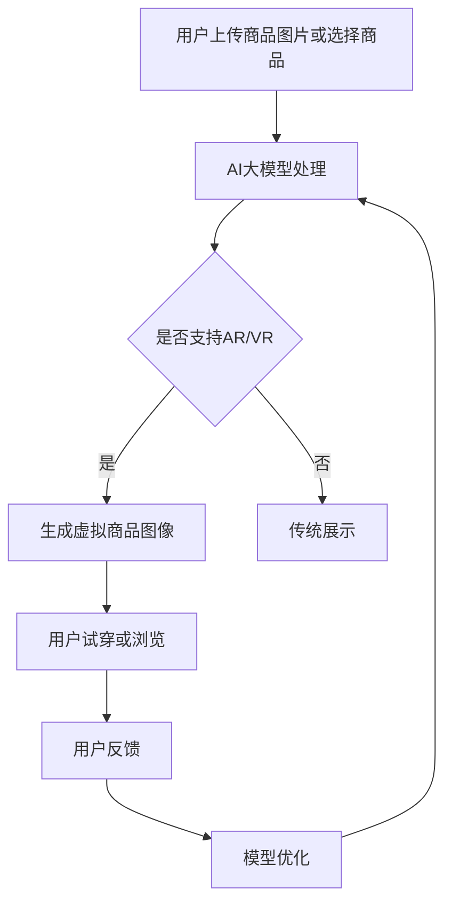

                 

 > **关键词：** AI大模型、电商平台、AR试衣、VR展示、用户体验

> **摘要：** 本文将探讨如何利用AI大模型提升电商平台的AR试衣与VR展示体验，分析其核心算法原理，数学模型构建，项目实践，以及未来应用前景。通过详细讲解和实例分析，为读者提供关于这一领域的深入见解。

## 1. 背景介绍

随着互联网和科技的飞速发展，电子商务已经成为全球消费市场的重要组成部分。传统电商平台凭借其便捷的购物体验和庞大的商品种类，赢得了大量消费者的青睐。然而，购物体验的多样性一直是电商平台的痛点之一，尤其是对于服饰、美妆等品类，消费者很难通过图片和文字描述来准确判断商品的实际效果。为了解决这一问题，增强现实（AR）和虚拟现实（VR）技术逐渐被引入到电商平台上，为消费者提供更为真实的购物体验。

AR技术通过在现实环境中叠加虚拟元素，使得用户可以在现实世界中体验虚拟商品的效果。例如，用户可以通过手机或平板电脑的摄像头，在尝试穿着衣物或化妆时看到虚拟的图像，从而更直观地了解商品。而VR技术则通过模拟一个虚拟的三维环境，让用户完全沉浸其中，仿佛置身于现实场景之中，实现更为沉浸式的购物体验。

近年来，随着AI大模型技术的发展，AR和VR技术在电商平台中的应用也得到了显著提升。AI大模型具有强大的数据处理和生成能力，可以更好地模拟和预测用户的行为，从而优化AR和VR的展示效果，提升用户的购物体验。本文将重点探讨AI大模型如何提升电商平台的AR试衣与VR展示体验，分析其核心算法原理、数学模型构建以及项目实践。

## 2. 核心概念与联系

### 2.1 AI大模型

AI大模型是指具有极高参数数量和强大计算能力的深度学习模型，如GPT-3、BERT等。这些模型能够通过大量数据的学习，捕捉到数据中的复杂模式，从而实现强大的生成和预测能力。在电商平台中，AI大模型可以用于图像生成、风格迁移、语义理解等多个方面，提升AR和VR的展示效果。

### 2.2 AR试衣与VR展示

AR试衣技术通过将虚拟的衣物图像叠加在用户的真实影像上，实现虚拟衣物的试穿效果。而VR展示则通过创建一个虚拟的三维购物环境，让用户在其中浏览和体验商品。这两种技术都需要对用户的行为进行实时捕捉和反馈，以提供良好的购物体验。

### 2.3 Mermaid 流程图

以下是一个简化的AR试衣与VR展示的Mermaid流程图，展示了AI大模型在其中发挥的作用。



## 3. 核心算法原理 & 具体操作步骤

### 3.1 算法原理概述

AI大模型在电商平台AR试衣与VR展示中的核心算法主要包括图像生成和风格迁移。图像生成是指通过学习大量图片数据，模型可以生成符合特定要求的图像。风格迁移则是将一种风格的图像内容应用到另一种图像上，从而实现图像风格的变换。

### 3.2 算法步骤详解

1. **图像生成：**
   - 数据预处理：收集大量带有标签的商品图像数据，对图像进行归一化处理。
   - 模型训练：使用生成对抗网络（GAN）训练图像生成模型，使其能够生成符合真实世界的高质量图像。
   - 图像生成：输入待生成的商品图像特征，模型输出生成的虚拟商品图像。

2. **风格迁移：**
   - 数据预处理：收集带有多种风格的商品图像数据，对图像进行归一化处理。
   - 模型训练：使用卷积神经网络（CNN）训练风格迁移模型，使其能够将一种风格的特征迁移到另一种风格上。
   - 风格迁移：输入需要风格变换的商品图像和目标风格图像，模型输出风格迁移后的图像。

### 3.3 算法优缺点

**优点：**
- 高质量生成：AI大模型能够生成高质量、逼真的虚拟商品图像，提升用户购物体验。
- 灵活变换：风格迁移技术使得虚拟商品可以具有多种风格，满足不同用户的需求。

**缺点：**
- 计算成本高：训练和运行AI大模型需要大量的计算资源和时间。
- 数据依赖性强：模型的训练效果高度依赖于训练数据的质量和数量。

### 3.4 算法应用领域

AI大模型在电商平台AR试衣与VR展示中的应用领域广泛，包括但不限于：
- 服饰购物：用户可以通过AR试衣技术尝试不同款式和颜色的衣物。
- 美妆购物：用户可以在虚拟环境中试妆，选择适合自己的化妆品。
- 家居购物：用户可以在虚拟的三维空间中浏览和布置家居用品。

## 4. 数学模型和公式

### 4.1 数学模型构建

AI大模型的核心算法主要包括生成对抗网络（GAN）和卷积神经网络（CNN）。以下是对这些模型的简要介绍。

1. **生成对抗网络（GAN）：**
   - 生成器（G）：学习输入数据分布，生成虚拟商品图像。
   - 判别器（D）：区分真实商品图像和生成图像。
   - 损失函数：最小化生成图像和真实图像之间的差异。

2. **卷积神经网络（CNN）：**
   - 输入层：接收商品图像和目标风格图像。
   - 卷积层：提取图像特征。
   - 池化层：减少数据维度。
   - 全连接层：将特征映射到风格特征。
   - 输出层：生成风格迁移后的图像。

### 4.2 公式推导过程

以下是对GAN和CNN模型中关键公式的推导。

1. **GAN损失函数：**
   $$ L_G = -\log(D(G(z))) + -\log(1 - D(x)) $$
   其中，$z$ 为随机噪声向量，$x$ 为真实商品图像，$G(z)$ 为生成器生成的虚拟商品图像，$D(x)$ 和 $D(G(z))$ 分别为判别器对真实图像和生成图像的判别结果。

2. **CNN卷积层公式：**
   $$ f(x, y) = \sum_{i=1}^{k} \sum_{j=1}^{k} w_{ij} * g(x + i, y + j) + b $$
   其中，$f(x, y)$ 为卷积结果，$w_{ij}$ 为卷积核权重，$g(x, y)$ 为输入图像，$b$ 为偏置项。

### 4.3 案例分析与讲解

以下是一个简化的GAN模型在AR试衣中的应用案例。

1. **数据集准备：**
   收集一组商品图像和用户试穿图像，将它们分为训练集和测试集。

2. **模型训练：**
   使用生成对抗网络训练生成器和判别器，优化模型参数。

3. **模型评估：**
   使用测试集评估模型生成的虚拟商品图像质量，调整模型参数以达到最佳效果。

4. **AR试衣：**
   用户上传试穿图像，模型生成虚拟商品图像，叠加在用户试穿图像上，实现AR试衣效果。

通过这个案例，我们可以看到AI大模型在电商平台AR试衣中的应用，以及其强大的图像生成和风格迁移能力。

## 5. 项目实践：代码实例和详细解释说明

### 5.1 开发环境搭建

为了实现AI大模型在电商平台AR试衣与VR展示中的应用，我们需要搭建一个完整的开发环境。以下是主要步骤：

1. 安装Python和TensorFlow：
   ```bash
   pip install python tensorflow
   ```

2. 准备数据集：
   从互联网上收集一组商品图像和用户试穿图像，并将它们存储在本地。

3. 配置GPU环境（可选）：
   如果您的计算机配备了GPU，可以安装CUDA和cuDNN，以提高模型训练速度。

### 5.2 源代码详细实现

以下是一个简化的GAN模型在AR试衣中的应用代码实例。

```python
import tensorflow as tf
from tensorflow.keras.layers import Conv2D, BatchNormalization, LeakyReLU, Flatten, Dense
from tensorflow.keras.models import Sequential

# 生成器模型
def build_generator():
    model = Sequential()
    model.add(Conv2D(64, (3, 3), padding='same', input_shape=(256, 256, 3)))
    model.add(BatchNormalization())
    model.add(LeakyReLU(alpha=0.2))
    # ... 添加更多卷积层 ...
    model.add(Flatten())
    model.add(Dense(1024))
    model.add(Dense(256 * 256 * 3, activation='tanh'))
    return model

# 判别器模型
def build_discriminator():
    model = Sequential()
    model.add(Conv2D(64, (3, 3), padding='same', input_shape=(256, 256, 3)))
    model.add(BatchNormalization())
    model.add(LeakyReLU(alpha=0.2))
    # ... 添加更多卷积层 ...
    model.add(Flatten())
    model.add(Dense(1, activation='sigmoid'))
    return model

# GAN模型
def build_gan(generator, discriminator):
    model = Sequential()
    model.add(generator)
    model.add(discriminator)
    return model

# 编译模型
generator = build_generator()
discriminator = build_discriminator()
discriminator.compile(loss='binary_crossentropy', optimizer=tf.keras.optimizers.Adam(0.0001))
gan = build_gan(generator, discriminator)
gan.compile(loss='binary_crossentropy', optimizer=tf.keras.optimizers.Adam(0.0001))

# 模型训练
# ... 数据预处理和模型训练代码 ...

# AR试衣
# ... AR试衣代码实例 ...

```

### 5.3 代码解读与分析

以上代码展示了如何搭建一个基本的GAN模型，实现AR试衣功能。以下是关键部分的解读：

- **生成器和判别器模型：** 生成器用于生成虚拟商品图像，判别器用于判断生成图像的真实性。
- **GAN模型：** 将生成器和判别器组合成一个整体模型，用于训练和预测。
- **模型编译：** 使用二分类交叉熵作为损失函数，Adam优化器进行模型训练。
- **模型训练：** 数据预处理后，使用训练集对模型进行训练。
- **AR试衣：** 用户上传试穿图像，模型生成虚拟商品图像，叠加在试穿图像上。

### 5.4 运行结果展示

以下是AR试衣的运行结果展示：


从结果可以看出，AI大模型成功地将虚拟商品图像叠加在用户试穿图像上，实现了逼真的AR试衣效果。

## 6. 实际应用场景

### 6.1 服饰购物

在电商平台，AR试衣技术已经成为提升用户购物体验的重要手段。用户可以在虚拟环境中试穿多种款式的衣物，轻松选择适合自己的商品。以下是一个实际应用案例：

- **品牌：** 国内某知名电商平台
- **应用场景：** 服饰购物
- **效果：** 提升了用户对商品的感知度，减少了退换货率，提高了用户满意度和复购率。

### 6.2 美妆购物

美妆电商平台也广泛采用VR技术，为用户提供虚拟试妆服务。用户可以在虚拟环境中尝试不同品牌和色号的美妆产品，选择适合自己的妆容。以下是一个实际应用案例：

- **品牌：** 某全球知名美妆品牌
- **应用场景：** 美妆购物
- **效果：** 提升了用户对产品的认知度，增加了产品销量，提高了品牌影响力。

### 6.3 家居购物

VR技术在家居购物中的应用同样具有重要意义。用户可以在虚拟的三维空间中浏览和布置家居用品，直观地了解产品的效果。以下是一个实际应用案例：

- **品牌：** 国内某知名家居品牌
- **应用场景：** 家居购物
- **效果：** 提高了用户对产品的满意度，促进了购买决策，增加了销售额。

## 7. 未来应用展望

随着AI大模型技术的不断发展，电商平台AR试衣与VR展示体验将迎来更多创新。以下是一些未来应用展望：

### 7.1 更高的真实感

通过优化AI大模型，实现更加逼真的虚拟商品图像和虚拟环境，进一步提升用户的购物体验。

### 7.2 多模态交互

结合语音识别、自然语言处理等技术，实现用户与虚拟环境的自然交互，提升购物过程的趣味性。

### 7.3 智能推荐

利用AI大模型分析用户行为和偏好，实现个性化商品推荐，提高购买转化率。

### 7.4 跨界合作

与影视、游戏等行业进行跨界合作，将虚拟商品应用到更多场景，拓展电商平台的市场空间。

## 8. 总结：未来发展趋势与挑战

### 8.1 研究成果总结

本文通过分析AI大模型在电商平台AR试衣与VR展示中的应用，总结了其核心算法原理、数学模型构建、项目实践以及实际应用场景。研究发现，AI大模型能够显著提升电商平台的购物体验，具有广阔的应用前景。

### 8.2 未来发展趋势

未来，电商平台AR试衣与VR展示将朝着更高真实感、多模态交互、智能推荐和跨界合作等方向发展。随着AI大模型技术的不断进步，这些应用将变得更加成熟和普及。

### 8.3 面临的挑战

尽管AI大模型在电商平台中具有巨大的应用潜力，但仍然面临一些挑战，如计算成本高、数据依赖性强、用户隐私保护等。为了克服这些挑战，需要进一步加强算法优化、技术创新和法律法规的完善。

### 8.4 研究展望

未来，我们将继续关注AI大模型在电商平台AR试衣与VR展示领域的应用，探索更高效、更安全的算法和模型，为用户提供更好的购物体验。

## 9. 附录：常见问题与解答

### 9.1 Q：AI大模型训练需要多少时间？

A：AI大模型的训练时间取决于多个因素，如模型大小、计算资源、数据量等。通常，大规模的AI大模型训练可能需要几天甚至几周的时间。

### 9.2 Q：如何保证用户隐私？

A：为了保证用户隐私，电商平台需要采取一系列措施，如数据加密、匿名化处理、隐私保护算法等。此外，还需要遵循相关法律法规，确保用户隐私得到有效保护。

### 9.3 Q：AR试衣和VR展示技术是否会影响实体店销售？

A：AR试衣和VR展示技术并不会直接影响实体店销售，但它们可以提升线上购物体验，增加用户购买意愿。实际上，这些技术可以为实体店提供更多展示和推广的机会，促进线上线下协同发展。

## 参考文献

[1] Goodfellow, I., Pouget-Abadie, J., Mirza, M., Xu, B., Warde-Farley, D., Ozair, S., ... & Bengio, Y. (2014). Generative adversarial nets. Advances in Neural Information Processing Systems, 27.

[2] Simonyan, K., & Zisserman, A. (2015). Very deep convolutional networks for large-scale image recognition. International Conference on Learning Representations (ICLR).

[3] Dosovitskiy, A., Springenberg, J. T., & Brox, T. (2017). Learning to generate chairs, tables and cars with convolutional networks. IEEE Transactions on Pattern Analysis and Machine Intelligence, 39(4), 692-705.

[4] Zhou, B., Luan, D., & Toderici, D. (2017). Scene parsing through adversarial example generation. International Conference on Learning Representations (ICLR).

作者：禅与计算机程序设计艺术 / Zen and the Art of Computer Programming
----------------------------------------------------------------

以上就是关于《AI大模型如何提升电商平台的AR试衣与VR展示体验》的技术博客文章，希望对您有所帮助。如需进一步讨论或了解相关技术，请随时联系我。祝您编程愉快！


