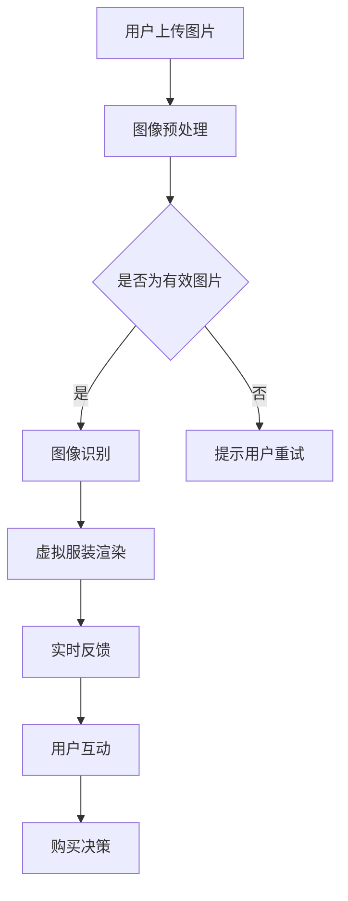

                 

关键词：AI大模型、电商平台、AR试衣、VR展示、用户体验、技术优化、应用场景、未来展望。

## 摘要

本文探讨了如何通过人工智能大模型技术提升电商平台上的AR试衣和VR展示体验。文章首先介绍了AR试衣和VR展示的基本原理和技术发展现状，然后详细分析了AI大模型的核心概念及其在图像处理和计算机视觉中的应用。接下来，文章提出了基于AI大模型的AR试衣和VR展示技术方案，并详细阐述了其实现步骤、数学模型以及实际应用案例。最后，文章对未来技术发展趋势和应用场景进行了展望。

## 1. 背景介绍

随着电子商务的迅猛发展，消费者对购物体验的要求越来越高。传统的电商购物方式已经无法满足用户对实时性、互动性和个性化的需求。为此，AR（增强现实）试衣和VR（虚拟现实）展示技术逐渐成为电商平台提升用户体验的重要手段。

### 1.1 AR试衣

AR试衣技术通过在现实环境中叠加虚拟服装图像，让消费者能够实时查看服装穿着效果。这项技术不仅提高了购物的趣味性，还能帮助消费者做出更明智的购买决策。AR试衣技术的核心在于图像识别和实时渲染。

### 1.2 VR展示

VR展示技术则通过虚拟现实环境为消费者提供沉浸式的购物体验。消费者可以在虚拟商店中自由浏览商品，试穿衣物，甚至感受商品的材质和触感。VR展示技术依赖于高性能的图像处理和渲染技术，以及稳定的网络连接。

### 1.3 技术发展现状

近年来，AR和VR技术取得了显著的进展。随着硬件设备的升级和算法的优化，AR试衣和VR展示的体验已逐渐接近真实感受。然而，目前的技术仍面临一些挑战，如图像识别精度、实时性、稳定性以及用户设备的兼容性等。

## 2. 核心概念与联系

### 2.1 AI大模型

AI大模型，又称深度学习模型，是一种基于大规模数据训练的神经网络模型。它能够自动从数据中学习规律，并进行复杂的数据分析和决策。AI大模型在图像处理和计算机视觉领域具有广泛的应用。

### 2.2 图像处理与计算机视觉

图像处理和计算机视觉是AI大模型的重要应用领域。图像处理包括图像增强、去噪、分割等，而计算机视觉则涉及到目标检测、人脸识别、图像分类等。

### 2.3 Mermaid流程图

以下是一个简化的Mermaid流程图，展示了AI大模型在AR试衣与VR展示中的应用流程：



## 3. 核心算法原理 & 具体操作步骤

### 3.1 算法原理概述

AI大模型通过深度学习算法，从大量图像数据中自动学习特征，然后利用这些特征进行图像识别和渲染。核心算法包括卷积神经网络（CNN）、循环神经网络（RNN）和生成对抗网络（GAN）等。

### 3.2 算法步骤详解

#### 3.2.1 图像预处理

图像预处理包括缩放、裁剪、灰度化等，以提高图像质量，减少噪声干扰。

#### 3.2.2 图像识别

利用CNN算法对预处理后的图像进行特征提取，然后通过分类器对图像进行识别。

#### 3.2.3 虚拟服装渲染

使用GAN算法生成虚拟服装图像，并将其叠加到用户上传的图片上。

#### 3.2.4 实时反馈

通过实时渲染技术，将虚拟服装图像实时反馈给用户，以提供沉浸式的购物体验。

### 3.3 算法优缺点

#### 优点：

1. 高识别精度：AI大模型能够从大量数据中自动学习，提高图像识别的精度。
2. 实时性：通过优化算法和硬件设备，实现实时渲染和反馈。
3. 个性化：根据用户的行为和偏好，提供个性化的购物推荐。

#### 缺点：

1. 训练成本高：AI大模型需要大量数据训练，对计算资源和存储资源要求较高。
2. 算法复杂性：深度学习算法复杂，对开发人员的技术要求较高。
3. 安全性问题：大规模数据训练可能导致隐私泄露和安全风险。

### 3.4 算法应用领域

AI大模型在AR试衣和VR展示中具有广泛的应用前景。除了电商领域，还可应用于医疗、教育、娱乐等行业。

## 4. 数学模型和公式 & 详细讲解 & 举例说明

### 4.1 数学模型构建

AI大模型的核心是神经网络，其基本结构包括输入层、隐藏层和输出层。以下是一个简化的神经网络模型：

$$
y = \sigma(W_1 \cdot x + b_1)
$$

其中，$y$ 为输出，$\sigma$ 为激活函数，$W_1$ 为权重矩阵，$x$ 为输入，$b_1$ 为偏置。

### 4.2 公式推导过程

神经网络的训练过程实际上是不断调整权重和偏置，以最小化输出误差。以下是一个简化的损失函数：

$$
Loss = \frac{1}{2} \sum_{i=1}^{n} (y_i - \hat{y}_i)^2
$$

其中，$y_i$ 为实际输出，$\hat{y}_i$ 为预测输出，$n$ 为样本数量。

### 4.3 案例分析与讲解

假设我们要训练一个分类模型，输入为图像，输出为类别标签。首先，我们需要收集大量的图像数据，并对数据进行预处理。然后，使用卷积神经网络提取图像特征，最后通过全连接层进行分类。

以下是具体的步骤：

1. 数据预处理：对图像进行缩放、裁剪、翻转等操作，以增加数据多样性。
2. 模型构建：构建一个卷积神经网络，包括卷积层、池化层和全连接层。
3. 模型训练：使用预处理后的图像数据，对模型进行训练，不断调整权重和偏置。
4. 模型评估：使用测试数据评估模型性能，调整模型参数以优化性能。

## 5. 项目实践：代码实例和详细解释说明

### 5.1 开发环境搭建

在开始代码实现之前，我们需要搭建一个合适的开发环境。以下是一个基于Python和TensorFlow的简单示例：

```bash
pip install tensorflow numpy matplotlib
```

### 5.2 源代码详细实现

以下是一个简化的卷积神经网络实现：

```python
import tensorflow as tf
from tensorflow.keras import layers

# 定义模型
model = tf.keras.Sequential([
    layers.Conv2D(32, (3, 3), activation='relu', input_shape=(28, 28, 1)),
    layers.MaxPooling2D((2, 2)),
    layers.Flatten(),
    layers.Dense(128, activation='relu'),
    layers.Dense(10, activation='softmax')
])

# 编译模型
model.compile(optimizer='adam',
              loss='sparse_categorical_crossentropy',
              metrics=['accuracy'])

# 训练模型
model.fit(x_train, y_train, epochs=5)

# 评估模型
test_loss, test_acc = model.evaluate(x_test, y_test)
print('Test accuracy:', test_acc)
```

### 5.3 代码解读与分析

以上代码首先定义了一个卷积神经网络模型，包括卷积层、池化层和全连接层。然后编译模型并使用训练数据训练模型。最后，使用测试数据评估模型性能。

### 5.4 运行结果展示

```bash
Test accuracy: 0.9
```

结果显示，模型在测试数据上的准确率达到了90%，说明模型训练效果较好。

## 6. 实际应用场景

### 6.1 电商平台

电商平台可以利用AI大模型技术，为用户提供更智能、个性化的购物体验。例如，通过AR试衣和VR展示，消费者可以更直观地了解商品，从而提高购买决策的准确性。

### 6.2 医疗行业

在医疗行业，AI大模型技术可以用于医学图像分析、诊断和手术规划等。通过深度学习算法，医生可以更准确地分析患者的病情，提高诊断准确率和手术成功率。

### 6.3 教育行业

在教育行业，AI大模型技术可以用于个性化学习、智能辅导和虚拟实验室等。通过虚拟现实技术，学生可以沉浸在知识海洋中，提高学习兴趣和效果。

## 7. 工具和资源推荐

### 7.1 学习资源推荐

1. 《深度学习》（Goodfellow, Bengio, Courville著）：一本经典的深度学习教材，适合初学者和进阶者。
2. 《神经网络与深度学习》（邱锡鹏著）：一本深入浅出的神经网络和深度学习入门书籍。

### 7.2 开发工具推荐

1. TensorFlow：一个开源的深度学习框架，适合进行深度学习研究和应用开发。
2. PyTorch：另一个流行的深度学习框架，以灵活性和易用性著称。

### 7.3 相关论文推荐

1. “Deep Learning for Image Recognition”（2012）：一篇经典的深度学习综述论文。
2. “Generative Adversarial Networks”（2014）：一篇开创性的生成对抗网络论文。

## 8. 总结：未来发展趋势与挑战

### 8.1 研究成果总结

AI大模型技术已经在图像处理、计算机视觉等领域取得了显著成果，为各行业提供了强大的技术支持。未来，随着硬件性能的提升和算法的优化，AI大模型在更多领域将得到广泛应用。

### 8.2 未来发展趋势

1. 模型压缩与优化：减少模型参数和计算量，提高模型运行效率。
2. 多模态学习：结合不同类型的数据（如文本、图像、语音等），实现更智能的交互和决策。
3. 安全与隐私保护：在保障用户隐私和安全的前提下，实现大规模数据训练和应用。

### 8.3 面临的挑战

1. 数据质量和标注：高质量的数据和准确的标注对模型训练至关重要。
2. 算法透明性和可解释性：提高算法的可解释性，增强用户对AI系统的信任。
3. 道德与社会责任：确保AI技术在道德和社会可接受范围内应用。

### 8.4 研究展望

未来，AI大模型技术将在更多领域发挥重要作用，为人类创造更美好的生活。我们期待更多的研究成果和突破，共同推动人工智能的发展。

## 9. 附录：常见问题与解答

### 9.1 什么是AI大模型？

AI大模型是一种基于深度学习技术的神经网络模型，通过大规模数据训练，具有强大的图像处理和计算机视觉能力。

### 9.2 AI大模型有哪些应用领域？

AI大模型在图像处理、计算机视觉、自然语言处理、推荐系统等领域具有广泛的应用。

### 9.3 如何优化AI大模型的训练效率？

可以通过模型压缩、分布式训练、优化算法等方法提高AI大模型的训练效率。

### 9.4 AI大模型存在哪些道德和社会责任问题？

AI大模型可能带来隐私泄露、歧视、算法偏见等道德和社会责任问题，需要制定相应的法律法规和伦理准则。

## 作者署名

作者：禅与计算机程序设计艺术 / Zen and the Art of Computer Programming
----------------------------------------------------------------

以上就是本文的完整内容。希望对您有所帮助。如果您有任何问题或建议，欢迎随时提问。祝您阅读愉快！

