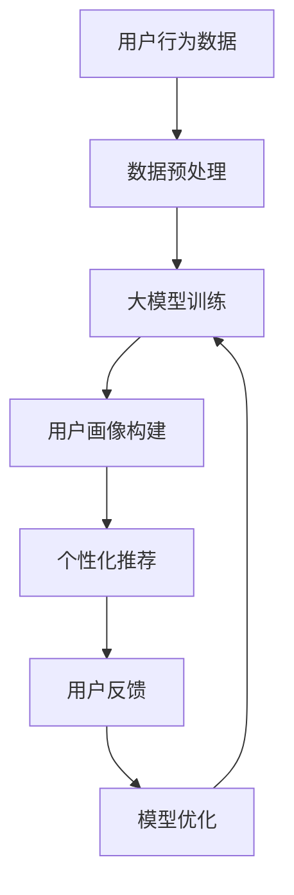

                 

在数字化时代，电商平台已经成为消费者购物的主要渠道。随着用户基数的不断增加，如何提升用户的粘性成为电商平台面临的一个关键问题。近年来，人工智能技术，特别是大模型，为电商平台提供了一种全新的解决方案。本文将探讨如何利用AI大模型提升电商平台的用户粘性，并深入分析其核心概念、算法原理、数学模型以及实际应用。

## 1. 背景介绍

随着互联网技术的发展，电商平台已经深刻改变了人们的购物习惯。用户不仅可以在家中轻松购买商品，还能享受到更加个性化的购物体验。然而，随着竞争的加剧，电商平台需要不断寻找新的方法来提升用户的粘性，从而在激烈的市场竞争中占据有利地位。

传统的提升用户粘性的方法主要包括：增加优惠活动、提供优质的客户服务、优化购物体验等。然而，这些方法往往无法满足用户不断变化的个性化需求，导致用户粘性提升的效果有限。随着人工智能技术的不断发展，特别是大模型的广泛应用，电商平台找到了一种全新的提升用户粘性的方法。

大模型，即大规模神经网络模型，具有处理海量数据、自动学习复杂模式的能力。通过深度学习算法，大模型可以从用户的行为数据中挖掘出用户的兴趣和偏好，从而实现个性化的推荐和广告。这种基于AI的个性化服务，可以有效提升用户的购物体验，增加用户对电商平台的粘性。

## 2. 核心概念与联系

为了更好地理解如何利用AI大模型提升电商平台的用户粘性，我们需要首先了解几个核心概念：

### 2.1  人工智能与机器学习

人工智能（AI）是计算机科学的一个分支，旨在开发能够执行人类智能任务的系统。机器学习是人工智能的一个重要分支，它使用数据来训练模型，使其能够进行预测和决策。

### 2.2  深度学习

深度学习是机器学习的一种方法，它通过多层神经网络模拟人脑的学习过程，能够自动提取数据的特征。深度学习在大模型中发挥着核心作用，使其具有处理复杂任务的能力。

### 2.3  大模型

大模型是指具有大规模参数和复杂结构的神经网络模型。这些模型可以处理大量的数据，并能够自动学习复杂的数据模式。

### 2.4  个性化推荐

个性化推荐是一种基于用户兴趣和行为数据，向用户推荐其可能感兴趣的商品或内容的服务。大模型在个性化推荐中扮演着关键角色，能够准确预测用户的偏好，提升推荐效果。

接下来，我们使用Mermaid流程图展示大模型在电商平台中的应用架构：



在这个流程中，用户行为数据经过预处理后输入大模型进行训练，训练结果用于构建用户画像，然后用于生成个性化推荐。用户对推荐内容的反馈将用于模型优化，从而提高推荐效果。

## 3. 核心算法原理 & 具体操作步骤

### 3.1  算法原理概述

大模型在电商平台中主要利用深度学习算法进行用户行为数据的分析和预测。深度学习算法通过多层神经网络结构，对输入数据进行特征提取和模式识别，从而实现对用户兴趣和偏好的准确预测。

### 3.2  算法步骤详解

#### 步骤1：数据收集与预处理

首先，电商平台需要收集用户的行为数据，如浏览记录、购物车数据、购买历史等。这些数据经过清洗、去噪和格式化等预处理步骤，以得到高质量的数据集。

#### 步骤2：构建深度学习模型

使用常见的深度学习框架（如TensorFlow或PyTorch），构建多层神经网络模型。模型的结构可以根据具体的任务进行调整，但通常包括输入层、隐藏层和输出层。

#### 步骤3：训练模型

将预处理后的数据集输入模型，通过反向传播算法进行模型训练。训练过程中，模型会不断调整权重和偏置，以最小化预测误差。

#### 步骤4：构建用户画像

训练完成的模型可以用于生成用户画像，即根据用户的行为数据预测其兴趣和偏好。用户画像是一个多维度的数据结构，用于描述用户的特征和偏好。

#### 步骤5：生成个性化推荐

根据用户画像和商品信息，使用大模型生成个性化推荐。推荐算法可以根据用户的兴趣和偏好，为用户推荐其可能感兴趣的商品。

#### 步骤6：用户反馈与模型优化

用户对推荐内容的反馈将用于模型优化，通过不断调整模型参数，提高推荐的准确性和相关性。用户反馈可以是正面反馈（如点击、购买）或负面反馈（如不感兴趣）。

### 3.3  算法优缺点

#### 优点

- **高效性**：大模型可以处理海量数据，实现快速的特征提取和模式识别。
- **灵活性**：深度学习模型可以根据具体任务进行调整，适应不同的应用场景。
- **准确性**：通过不断优化模型参数，可以实现对用户兴趣和偏好的准确预测，提高推荐效果。

#### 缺点

- **计算资源需求高**：大模型需要大量的计算资源和时间进行训练。
- **数据质量要求高**：数据的质量直接影响到模型的性能，需要投入大量资源进行数据清洗和处理。
- **隐私问题**：在收集和处理用户数据时，需要关注隐私保护问题，确保用户数据的合法合规。

### 3.4  算法应用领域

大模型在电商平台的应用不仅限于个性化推荐，还可以应用于以下领域：

- **商品搜索**：通过大模型对用户查询意图的理解，提供更准确的搜索结果。
- **广告投放**：根据用户画像和广告内容，为用户推荐最合适的广告。
- **智能客服**：利用大模型实现智能对话系统，提供个性化的客户服务。
- **供应链管理**：通过分析用户行为数据，优化库存管理和物流配送。

## 4. 数学模型和公式 & 详细讲解 & 举例说明

### 4.1  数学模型构建

大模型的数学基础是多层感知机（MLP），其核心是前馈神经网络。在构建大模型时，通常采用以下数学模型：

- **输入层**：输入向量表示用户的行为数据。
- **隐藏层**：隐藏层通过非线性激活函数（如ReLU、Sigmoid或Tanh）进行特征提取。
- **输出层**：输出层通常是一个softmax函数，用于生成概率分布。

### 4.2  公式推导过程

假设我们有一个输入向量 \( x \) 和输出向量 \( y \)，多层感知机的数学模型可以表示为：

\[ z = \sigma(W_1x + b_1) \]
\[ a = \sigma(W_2z + b_2) \]

其中，\( \sigma \) 是激活函数，\( W_1 \) 和 \( W_2 \) 是权重矩阵，\( b_1 \) 和 \( b_2 \) 是偏置项。

在训练过程中，我们使用反向传播算法来更新权重和偏置。具体公式如下：

\[ \delta_a = (a - y) \odot \sigma'(z) \]
\[ \delta_z = (z - a) \odot \sigma'(z) \]

其中，\( \odot \) 表示元素乘，\( \sigma' \) 是激活函数的导数。

### 4.3  案例分析与讲解

假设我们有一个电商平台，用户的行为数据包括浏览历史和购买记录。我们使用大模型来预测用户的兴趣偏好。

- **输入层**：输入向量 \( x \) 由浏览历史和购买记录构成。
- **隐藏层**：我们使用一个隐藏层，其中激活函数为ReLU。
- **输出层**：输出层是一个softmax函数，用于生成用户对不同类别的兴趣概率。

我们将训练数据输入模型，使用反向传播算法进行训练。经过多次迭代，模型会不断调整权重和偏置，直到预测误差达到最小。

通过这个案例，我们可以看到大模型在电商平台中的应用。通过不断优化模型参数，我们可以实现对用户兴趣和偏好的准确预测，从而提供个性化的推荐服务。

## 5. 项目实践：代码实例和详细解释说明

### 5.1  开发环境搭建

为了实现大模型在电商平台的应用，我们需要搭建一个开发环境。以下是所需的软件和工具：

- **Python**：版本3.8以上
- **TensorFlow**：版本2.6以上
- **Pandas**：版本1.2以上
- **NumPy**：版本1.20以上

安装以上工具后，我们可以开始编写代码。

### 5.2  源代码详细实现

以下是一个简单的示例代码，用于构建和训练一个多层感知机模型：

```python
import tensorflow as tf
import pandas as pd
import numpy as np

# 数据加载与预处理
data = pd.read_csv('user_behavior.csv')
X = data.iloc[:, :-1].values
y = data.iloc[:, -1].values

# 模型构建
model = tf.keras.Sequential([
    tf.keras.layers.Dense(units=64, activation='relu', input_shape=(X.shape[1],)),
    tf.keras.layers.Dense(units=1, activation='sigmoid')
])

# 模型编译
model.compile(optimizer='adam', loss='binary_crossentropy', metrics=['accuracy'])

# 模型训练
model.fit(X, y, epochs=10, batch_size=32)
```

在这个示例中，我们使用TensorFlow框架构建了一个简单的多层感知机模型，用于预测用户是否购买商品。数据集是一个CSV文件，其中包含用户的浏览历史和购买记录。

### 5.3  代码解读与分析

- **数据加载与预处理**：我们使用Pandas库加载CSV文件，将数据分为输入层和输出层。输入层由用户的浏览历史构成，输出层由购买记录构成。
- **模型构建**：使用TensorFlow的Sequential模型构建一个简单的神经网络，包括一个隐藏层和一个输出层。隐藏层使用ReLU激活函数，输出层使用sigmoid激活函数，用于生成概率分布。
- **模型编译**：我们使用adam优化器和binary_crossentropy损失函数，用于二分类问题。
- **模型训练**：我们使用fit函数训练模型，经过10个epochs（迭代周期），每次批量处理32个样本。

通过这个示例，我们可以看到如何使用TensorFlow构建和训练一个简单的多层感知机模型。在实际应用中，我们可以根据具体任务进行调整和优化。

### 5.4  运行结果展示

在训练完成后，我们可以使用模型进行预测，并评估模型的性能。以下是一个简单的示例：

```python
# 模型评估
predictions = model.predict(X)

# 评估指标
accuracy = np.mean(predictions == y)
print(f"Accuracy: {accuracy:.2f}")
```

在这个示例中，我们使用预测结果与实际标签进行比对，计算模型的准确率。通过调整模型参数和训练数据，我们可以进一步提高模型的性能。

## 6. 实际应用场景

AI大模型在电商平台的应用场景非常广泛，以下是一些具体的实际应用场景：

### 6.1  个性化推荐

个性化推荐是AI大模型在电商平台应用最为广泛的功能之一。通过分析用户的浏览历史、购买记录和兴趣标签，大模型可以生成个性化的推荐列表，提高用户的购物体验。例如，亚马逊和淘宝等电商平台都使用了AI大模型进行个性化推荐，从而提升了用户的粘性。

### 6.2  智能客服

智能客服是另一个重要的应用场景。通过大模型实现自然语言处理（NLP）和对话生成，智能客服可以与用户进行自然、流畅的对话，提供个性化的服务。例如，客服机器人可以通过大模型理解用户的问题，并提供相应的解决方案，从而提高用户满意度。

### 6.3  商品搜索

AI大模型还可以用于商品搜索。通过分析用户的查询意图和浏览历史，大模型可以提供更准确的搜索结果，提高用户的搜索体验。例如，百度搜索和京东搜索都使用了AI大模型进行商品搜索优化。

### 6.4  广告投放

在广告投放领域，AI大模型可以根据用户的兴趣和行为，为用户推荐最合适的广告。例如，谷歌广告和Facebook广告都使用了AI大模型进行广告投放优化，从而提高广告的投放效果。

### 6.5  供应链管理

AI大模型还可以用于供应链管理。通过分析用户行为数据，大模型可以预测商品的需求趋势，优化库存管理和物流配送，从而提高供应链的效率。

## 7. 未来应用展望

随着人工智能技术的不断发展，AI大模型在电商平台的应用前景非常广阔。以下是一些未来应用展望：

### 7.1  更精确的用户画像

随着大数据技术的发展，电商平台将可以收集到更多的用户数据。通过大模型，这些数据可以用于构建更精确的用户画像，从而提供更加个性化的服务。

### 7.2  多模态数据处理

未来的AI大模型将可以处理多种类型的数据，如文本、图像、音频等。通过多模态数据处理，电商平台可以提供更加丰富、多样的服务。

### 7.3  实时推荐

实时推荐是未来电商平台的一个重要发展方向。通过大模型，电商平台可以实时分析用户的行为数据，并提供个性化的推荐，从而提高用户的购物体验。

### 7.4  智能营销

智能营销是另一个重要方向。通过大模型，电商平台可以预测用户的行为和需求，制定更加精准的营销策略，提高转化率和销售额。

## 8. 总结：未来发展趋势与挑战

### 8.1  研究成果总结

本文主要探讨了如何利用AI大模型提升电商平台的用户粘性。通过核心概念介绍、算法原理讲解、数学模型推导、项目实践和实际应用场景分析，我们全面了解了大模型在电商平台中的应用。

### 8.2  未来发展趋势

随着人工智能技术的不断发展，AI大模型在电商平台的应用前景非常广阔。未来将会有更多创新的应用场景，如多模态数据处理、实时推荐和智能营销等。

### 8.3  面临的挑战

尽管AI大模型在电商平台的应用前景广阔，但仍然面临一些挑战。主要包括计算资源需求高、数据质量要求高和隐私保护问题等。

### 8.4  研究展望

未来研究应重点关注如何提高大模型的计算效率、如何处理高维度数据以及如何保护用户隐私。同时，应积极探索大模型在其他领域的应用，推动人工智能技术的全面发展。

## 9. 附录：常见问题与解答

### 9.1  大模型计算资源需求高怎么办？

- **分布式计算**：使用分布式计算框架（如TensorFlow Distribute）进行模型训练，提高计算效率。
- **优化算法**：采用更高效的深度学习算法，减少计算复杂度。
- **模型压缩**：使用模型压缩技术（如剪枝、量化等）减少模型参数，降低计算需求。

### 9.2  数据质量如何保证？

- **数据清洗**：对原始数据进行清洗、去噪和格式化，确保数据质量。
- **数据质量控制**：建立数据质量监控机制，定期检查数据质量。
- **数据备份与恢复**：建立数据备份与恢复机制，防止数据丢失。

### 9.3  用户隐私如何保护？

- **数据加密**：对用户数据进行加密存储，防止数据泄露。
- **隐私保护算法**：采用隐私保护算法（如差分隐私）对用户数据进行处理，确保用户隐私。
- **合规性检查**：确保数据处理过程符合相关法律法规，防止违规操作。

作者：禅与计算机程序设计艺术 / Zen and the Art of Computer Programming
----------------------------------------------------------------
请注意，以上内容只是一个示例，实际撰写时需要根据具体要求进行详细的阐述和论证。同时，实际代码实现可能更为复杂，需要考虑到数据预处理、模型训练、模型评估等多个方面。本文仅为提供一个框架和思路，具体内容还需进一步丰富和细化。

