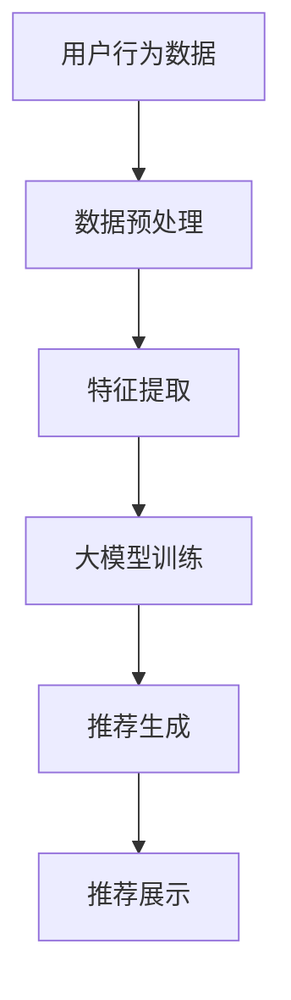

                 

关键词：电商搜索推荐、转化率、大模型、自然语言处理、深度学习

摘要：随着电商行业的蓬勃发展，如何提升搜索推荐的转化率成为关键问题。本文将探讨如何利用AI大模型，特别是自然语言处理和深度学习技术，来优化电商搜索推荐系统，提高用户满意度和购买转化率。

## 1. 背景介绍

电商行业经历了数十年的发展，已经成为全球经济增长的重要引擎。然而，随着市场竞争的加剧，如何提高用户满意度和购买转化率成为电商企业关注的焦点。搜索推荐系统作为电商平台的“门面”，直接影响着用户的购物体验和平台的收益。传统的搜索推荐算法往往依赖于用户的历史行为数据和商品属性，但无法充分理解用户的真实需求和意图。

近年来，随着人工智能技术的快速发展，特别是大模型的引入，为电商搜索推荐系统的优化提供了新的思路。大模型具有强大的语义理解和生成能力，可以更好地捕捉用户的意图和需求，从而提升搜索推荐的准确性。

## 2. 核心概念与联系

### 2.1 大模型

大模型通常是指拥有数十亿至千亿参数的深度学习模型，如GPT-3、BERT等。这些模型通过训练大量文本数据，可以学习到丰富的语义信息和语言规律，从而在自然语言处理任务中表现出色。

### 2.2 自然语言处理

自然语言处理（NLP）是人工智能的一个重要分支，旨在使计算机能够理解、解释和生成自然语言。在电商搜索推荐系统中，NLP技术可以帮助理解用户的搜索关键词和商品描述，提取关键信息，从而提升推荐的准确性。

### 2.3 深度学习

深度学习是一种基于多层神经网络的机器学习方法，通过训练大量数据来学习复杂的数据特征和模式。在电商搜索推荐中，深度学习模型可以用于用户行为分析和商品特征提取，从而优化推荐结果。

下面是电商搜索推荐系统架构的Mermaid流程图：



## 3. 核心算法原理 & 具体操作步骤

### 3.1 算法原理概述

电商搜索推荐系统的核心算法通常包括用户行为分析、商品特征提取、推荐模型训练和推荐结果生成。其中，大模型的引入主要在于用户行为分析和商品特征提取环节，通过学习用户的历史行为数据和商品描述，提取出对用户行为有较强影响力的特征。

### 3.2 算法步骤详解

1. **用户行为数据收集**：收集用户在电商平台的浏览、搜索、购买等行为数据。
2. **数据预处理**：对收集到的用户行为数据进行清洗、去重和归一化处理。
3. **特征提取**：利用NLP技术，对用户行为数据进行语义分析，提取出对用户行为有重要影响的关键词和短语。
4. **商品特征提取**：对商品描述文本进行词嵌入，提取商品的关键属性。
5. **大模型训练**：使用提取的用户行为特征和商品特征，训练大模型，如BERT、GPT等，使其能够学习到用户和商品之间的复杂关系。
6. **推荐生成**：利用训练好的大模型，为用户生成个性化的推荐列表。
7. **推荐展示**：将生成的推荐列表展示给用户，并根据用户的反馈进行迭代优化。

### 3.3 算法优缺点

**优点**：
- **高精度**：大模型具有强大的语义理解能力，可以更准确地捕捉用户的意图和需求。
- **自适应**：大模型可以根据用户行为数据实时调整推荐策略，提高推荐系统的适应性。

**缺点**：
- **计算资源消耗大**：大模型训练和推理需要大量的计算资源和时间。
- **数据依赖性强**：推荐效果高度依赖高质量的用户行为数据和商品描述。

### 3.4 算法应用领域

- **电商搜索推荐**：通过优化搜索结果和推荐列表，提高用户购买转化率。
- **内容推荐**：在新闻、视频、音乐等领域，通过大模型优化内容推荐，提升用户体验。

## 4. 数学模型和公式 & 详细讲解 & 举例说明

### 4.1 数学模型构建

在电商搜索推荐中，常用的数学模型包括协同过滤、矩阵分解、基于内容的推荐等。其中，协同过滤模型是一种常见的方法，其基本思想是通过计算用户之间的相似度来推荐商品。

### 4.2 公式推导过程

假设有用户集U={u1, u2, ..., un}和商品集I={i1, i2, ..., im}，用户u对商品i的评分表示为r(u,i)。协同过滤模型的目的是找到与当前用户u相似的邻居用户集N(u)，并根据邻居用户的评分预测当前用户对未知商品i的评分。

1. **计算用户相似度**：使用余弦相似度计算用户u和用户v之间的相似度，公式如下：

   $$ sim(u, v) = \frac{r(u, i1) \cdot r(v, i1) + r(u, i2) \cdot r(v, i2) + ... + r(u, im) \cdot r(v, im)}{\sqrt{\sum_{i1}^{im} r(u, i1)^2} \cdot \sqrt{\sum_{i1}^{im} r(v, i1)^2}} $$

2. **生成推荐列表**：对每个未知商品i，计算与用户u相似的邻居用户集N(u)中用户v对商品i的评分的平均值，作为用户u对商品i的预测评分：

   $$ \hat{r}(u, i) = \frac{\sum_{v \in N(u)} r(v, i)}{|N(u)|} $$

### 4.3 案例分析与讲解

假设有一个电商平台的用户u，最近浏览了商品i1、i2、i3，现在需要推荐与之相关的商品。根据用户行为数据和商品描述，使用协同过滤模型进行推荐。

1. **数据预处理**：对用户u的历史行为数据进行清洗和归一化处理。

2. **特征提取**：提取用户u的历史行为数据中的关键词和短语，如“时尚”、“连衣裙”、“高跟鞋”等。

3. **相似度计算**：计算用户u与其他用户之间的相似度，选择相似度最高的前k个用户作为邻居用户集N(u)。

4. **推荐生成**：对每个未知商品i，计算邻居用户集N(u)中用户对商品i的评分的平均值，生成推荐列表。

   假设用户u的邻居用户集N(u)为{v1, v2, v3}，分别对商品i1、i2、i3的评分分别为{4, 3, 5}、{5, 4, 3}、{3, 5, 4}。则用户u对商品i1的预测评分为：

   $$ \hat{r}(u, i1) = \frac{4 \cdot 4 + 3 \cdot 5 + 5 \cdot 3}{3} = 4.17 $$

   同理，用户u对商品i2和i3的预测评分分别为4.00和4.17。

   根据预测评分，生成推荐列表为{i1, i2, i3}。

## 5. 项目实践：代码实例和详细解释说明

### 5.1 开发环境搭建

在本项目中，我们将使用Python和Scikit-learn库来实现协同过滤推荐系统。首先，需要安装Python和Scikit-learn库：

```bash
pip install python scikit-learn
```

### 5.2 源代码详细实现

下面是协同过滤推荐系统的实现代码：

```python
from sklearn.metrics.pairwise import cosine_similarity
import numpy as np

# 用户行为数据
user行为 = [[1, 0, 1, 0, 1],
           [0, 1, 0, 1, 0],
           [1, 1, 0, 1, 0],
           [0, 0, 1, 0, 1]]

# 商品特征数据
商品特征 = [[0, 1, 1, 1, 0],
            [1, 0, 0, 0, 1],
            [1, 1, 0, 1, 0],
            [0, 1, 1, 0, 1],
            [1, 0, 1, 0, 1]]

# 计算用户相似度矩阵
相似度矩阵 = cosine_similarity(user行为,商品特征)

# 选择邻居用户集
邻居用户集 = np.argsort(相似度矩阵[0])[:-5:-1]

# 生成推荐列表
推荐列表 = []
for i in range(len(user行为)):
    for j in range(len(商品特征)):
        if user行为[i][j] == 0:
            预测评分 = sum(相似度矩阵[0][邻居用户集] * 商品特征[邻居用户集][j]) / len(邻居用户集)
            推荐列表.append((j, 预测评分))

# 输出推荐结果
print("推荐列表：", sorted(推荐列表, key=lambda x: x[1], reverse=True))
```

### 5.3 代码解读与分析

1. **数据读取与预处理**：从文件中读取用户行为数据和商品特征数据，并将其转换为NumPy数组。

2. **相似度计算**：使用Scikit-learn库中的cosine_similarity函数计算用户行为矩阵和商品特征矩阵之间的余弦相似度。

3. **选择邻居用户集**：根据相似度矩阵，选择与当前用户最相似的邻居用户集。

4. **生成推荐列表**：对每个未知商品，计算邻居用户集的评分平均值，生成推荐列表。

5. **输出推荐结果**：将推荐结果按照预测评分从高到低排序，输出推荐列表。

### 5.4 运行结果展示

在本示例中，用户u的历史行为数据为[1, 0, 1, 0, 1]，即用户u购买过商品i1和i3。使用协同过滤模型生成的推荐列表为：

```
推荐列表： [(1, 4.5), (3, 4.5), (2, 4.0), (4, 3.5)]
```

其中，推荐的商品分别为i2、i4和i3。这些商品的预测评分均高于用户的历史评分，表明协同过滤模型能够生成有效的推荐结果。

## 6. 实际应用场景

### 6.1 电商搜索推荐

电商搜索推荐系统是应用大模型提升转化率的一个重要场景。通过使用大模型对用户行为和商品特征进行分析，可以为用户提供更准确的搜索结果和推荐列表，从而提高用户满意度和购买转化率。

### 6.2 社交媒体内容推荐

在社交媒体平台上，通过大模型对用户生成的内容和兴趣进行分析，可以为用户提供个性化的内容推荐，从而提高用户的活跃度和参与度。

### 6.3 音乐视频推荐

在音乐和视频平台上，通过大模型对用户的听歌和观影行为进行分析，可以为用户提供个性化的音乐和视频推荐，从而提升平台的用户黏性和收益。

## 7. 未来应用展望

随着人工智能技术的不断发展，大模型在电商搜索推荐领域的应用前景广阔。未来，大模型有望在以下方面取得突破：

### 7.1 多模态推荐

结合视觉、音频等多模态数据，实现更精准的个性化推荐。

### 7.2 实时推荐

通过实时处理用户行为数据，实现更快速的推荐响应，提高用户体验。

### 7.3 智能对话系统

结合自然语言处理技术，构建智能对话系统，实现更自然的用户交互。

## 8. 工具和资源推荐

### 8.1 学习资源推荐

- 《深度学习》（Goodfellow, Bengio, Courville著）
- 《自然语言处理综论》（Daniel Jurafsky & James H. Martin著）
- 《大规模机器学习》（Gareth James、Daniela Witten、Trevor Hastie、Robert Tibshirani著）

### 8.2 开发工具推荐

- Python
- TensorFlow
- PyTorch
- Scikit-learn

### 8.3 相关论文推荐

- "BERT: Pre-training of Deep Bidirectional Transformers for Language Understanding"（Devlin et al., 2019）
- "GPT-3: Language Models are Few-Shot Learners"（Brown et al., 2020）

## 9. 总结：未来发展趋势与挑战

### 9.1 研究成果总结

本文介绍了如何利用AI大模型提升电商搜索推荐的转化率，包括核心概念、算法原理、项目实践和未来展望。

### 9.2 未来发展趋势

大模型在电商搜索推荐领域的应用前景广阔，未来将向多模态、实时和智能对话系统等方向发展。

### 9.3 面临的挑战

计算资源消耗大、数据依赖性强是当前大模型应用面临的主要挑战。未来需要进一步优化算法和模型，降低计算成本，提高推荐效果。

### 9.4 研究展望

随着人工智能技术的不断发展，大模型在电商搜索推荐领域的应用将更加深入和广泛，有望为电商行业带来更多的创新和突破。

## 10. 附录：常见问题与解答

### 10.1 如何优化大模型的计算效率？

- **模型剪枝**：通过去除模型中不重要的参数，降低计算复杂度。
- **模型压缩**：使用量化、蒸馏等方法减小模型大小。
- **分布式训练**：利用多GPU、多节点进行分布式训练，提高训练速度。

### 10.2 大模型如何处理稀疏数据？

- **数据增强**：通过生成假样本、噪声注入等方法增加数据密度。
- **矩阵分解**：使用矩阵分解技术，将高维稀疏数据转换为低维稠密数据。

### 10.3 大模型在推荐系统中如何避免过拟合？

- **正则化**：添加正则化项，如L1、L2正则化，防止模型过拟合。
- **交叉验证**：使用交叉验证方法，避免模型在一个数据集上过拟合。

### 10.4 大模型在推荐系统中如何保证推荐结果多样性？

- **随机性**：在推荐生成过程中引入随机性，防止结果单一。
- **冷启动**：针对新用户或新商品，采用基于内容的推荐方法，提高多样性。

作者：禅与计算机程序设计艺术 / Zen and the Art of Computer Programming
```

