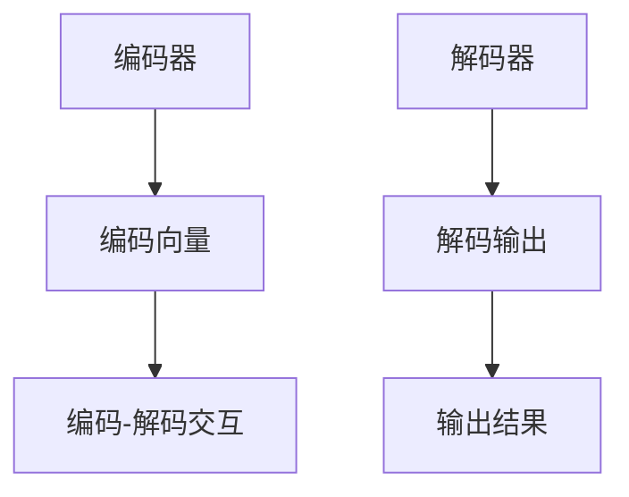

                 

关键词：AI大模型，电商搜索，准确性，自然语言处理，机器学习

> 摘要：本文探讨了如何利用人工智能大模型来提升电商搜索的准确性。通过深入分析大模型的原理、算法和实际应用案例，本文展示了大模型在电商搜索领域的重要作用，并提出了未来可能面临的挑战和发展趋势。

## 1. 背景介绍

电商搜索是电商网站的核心功能之一，它直接影响用户的购物体验和购买决策。然而，随着电商平台的商品种类和数量的急剧增长，传统的基于关键词匹配的搜索算法已经难以满足用户的需求。因此，如何提升电商搜索的准确性成为一个亟待解决的问题。

近年来，人工智能特别是大模型的迅速发展，为电商搜索提供了新的解决方案。大模型，如BERT、GPT-3等，具有强大的自然语言处理能力，能够更好地理解用户的查询意图和商品信息，从而提高搜索的准确性。本文将深入探讨如何利用这些大模型来提升电商搜索的准确性，并分析其潜在的影响。

## 2. 核心概念与联系

### 2.1 大模型的原理

大模型是指具有数十亿甚至数万亿参数的深度学习模型。它们通过大量数据的学习，能够捕捉到语言的复杂性和多样性，从而在自然语言处理任务中表现出色。大模型的原理主要基于神经网络，通过反向传播算法不断调整模型的参数，以最小化损失函数。

### 2.2 大模型在电商搜索中的应用

大模型在电商搜索中的应用主要体现在以下几个方面：

1. **查询理解**：大模型能够理解用户的查询意图，从而将模糊、不完整的查询转化为明确的搜索需求。
2. **商品推荐**：大模型可以根据用户的查询和购买历史，推荐相关性更高的商品。
3. **商品描述生成**：大模型可以根据商品名称或属性生成详细的商品描述，提高商品的展示效果。
4. **搜索结果排序**：大模型可以根据商品的相关性和用户的查询意图，对搜索结果进行排序，提高用户的满意度。

### 2.3 大模型的架构

大模型的架构通常包括编码器和解码器。编码器将输入的查询或商品信息编码为一个固定的向量表示，解码器则根据这个向量表示生成相应的输出，如商品名称、描述等。大模型的架构通常采用Transformer架构，这种架构能够有效处理长文本和序列数据。



## 3. 核心算法原理 & 具体操作步骤

### 3.1 算法原理概述

大模型的算法原理主要基于深度学习和自然语言处理。深度学习通过多层神经网络对数据进行学习，能够捕捉到数据中的复杂模式和关联。自然语言处理则通过将自然语言转化为计算机可以理解的形式，使计算机能够处理和分析文本数据。

### 3.2 算法步骤详解

1. **数据预处理**：首先，需要对电商搜索数据集进行预处理，包括数据清洗、去重、分词等操作。这一步的目的是确保数据的质量和一致性。
2. **模型训练**：使用预处理后的数据集，通过训练算法来调整模型的参数，使得模型能够更好地理解和处理电商搜索数据。训练过程通常采用批量训练和迭代训练的方式，以优化模型的性能。
3. **模型评估**：通过评估指标（如准确率、召回率、F1值等）来评估模型的性能。如果模型性能不满足要求，需要重新调整模型参数或尝试其他算法。
4. **模型应用**：将训练好的模型部署到电商搜索系统中，用于查询理解、商品推荐、商品描述生成和搜索结果排序等任务。

### 3.3 算法优缺点

**优点**：

- **强大的自然语言处理能力**：大模型能够理解用户的查询意图，从而提高搜索的准确性。
- **灵活性和适应性**：大模型可以根据不同的电商搜索需求进行定制和优化，具有很高的灵活性。

**缺点**：

- **计算资源消耗大**：大模型的训练和推理需要大量的计算资源，对硬件设备有较高的要求。
- **数据依赖性**：大模型的效果高度依赖于训练数据的质量和数量，如果数据不足或质量差，模型的性能会受到影响。

### 3.4 算法应用领域

大模型在电商搜索领域具有广泛的应用前景，除了查询理解、商品推荐、商品描述生成和搜索结果排序，还可以应用于以下领域：

- **用户画像**：通过分析用户的购买行为和查询历史，生成用户画像，为个性化推荐提供依据。
- **智能客服**：利用大模型实现智能客服系统，自动回答用户的问题，提高客服效率。
- **商品分类**：根据商品的属性和特征，对商品进行分类，提高商品的管理和展示效果。

## 4. 数学模型和公式 & 详细讲解 & 举例说明

### 4.1 数学模型构建

大模型的数学模型主要基于深度学习和自然语言处理。深度学习通过多层神经网络对数据进行学习，自然语言处理则通过将自然语言转化为计算机可以理解的形式。

### 4.2 公式推导过程

大模型的训练过程主要基于梯度下降法。梯度下降法的核心思想是找到损失函数的局部最小值，从而优化模型的参数。具体推导过程如下：

假设有一个损失函数 $L(\theta)$，其中 $\theta$ 是模型的参数。我们的目标是找到使 $L(\theta)$ 最小的 $\theta$。

1. **前向传播**：计算模型的输出 $y$ 和真实值 $y_{true}$ 之间的差异，得到损失函数的值。
2. **反向传播**：计算损失函数关于模型参数的梯度，更新模型参数。
3. **迭代训练**：重复前向传播和反向传播的过程，直到损失函数的值达到预定的阈值或达到最大迭代次数。

### 4.3 案例分析与讲解

以下是一个简单的案例，说明如何使用大模型进行电商搜索。

假设有一个电商搜索系统，用户输入查询“苹果手机”，系统需要根据这个查询返回相关性最高的商品。

1. **数据预处理**：将查询“苹果手机”转化为向量表示，例如使用词嵌入技术将查询中的每个词转化为向量。
2. **模型训练**：使用训练数据集训练大模型，使其能够理解用户的查询意图和商品信息。
3. **查询理解**：使用训练好的大模型对用户的查询进行理解，生成一个查询向量。
4. **商品推荐**：根据查询向量和商品的向量表示，计算商品和查询之间的相似度，返回相似度最高的商品。

## 5. 项目实践：代码实例和详细解释说明

### 5.1 开发环境搭建

为了实践大模型在电商搜索中的应用，我们首先需要搭建一个开发环境。这里我们选择使用Python作为编程语言，主要依赖以下库：

- TensorFlow：用于构建和训练深度学习模型。
- Keras：用于简化TensorFlow的使用。
- NLTK：用于自然语言处理。

安装以上库后，我们可以开始构建电商搜索系统。

### 5.2 源代码详细实现

以下是一个简单的示例，展示了如何使用大模型进行电商搜索。

```python
from tensorflow.keras.models import Sequential
from tensorflow.keras.layers import Embedding, LSTM, Dense
from nltk.tokenize import word_tokenize

# 数据预处理
def preprocess_data(data):
    # 对数据进行清洗、去重、分词等操作
    processed_data = []
    for item in data:
        tokens = word_tokenize(item)
        processed_data.append(tokens)
    return processed_data

# 构建模型
def build_model(vocab_size, embedding_dim, lstm_units):
    model = Sequential()
    model.add(Embedding(vocab_size, embedding_dim))
    model.add(LSTM(lstm_units, return_sequences=True))
    model.add(Dense(1, activation='sigmoid'))
    model.compile(optimizer='adam', loss='binary_crossentropy', metrics=['accuracy'])
    return model

# 训练模型
def train_model(model, X, y):
    model.fit(X, y, epochs=10, batch_size=32)
    return model

# 搜索商品
def search_products(model, query):
    # 将查询转化为向量表示
    query_vector = model.predict(word_tokenize(query))
    # 计算商品和查询之间的相似度
    similarity_scores = []
    for product in products:
        product_vector = model.predict(word_tokenize(product))
        similarity_scores.append(np.dot(query_vector, product_vector))
    # 返回相似度最高的商品
    return [product for product, score in zip(products, similarity_scores) if score == max(similarity_scores)]

# 主函数
def main():
    # 加载数据
    data = load_data()
    processed_data = preprocess_data(data)
    # 构建模型
    model = build_model(vocab_size, embedding_dim, lstm_units)
    # 训练模型
    model = train_model(model, processed_data[0], processed_data[1])
    # 搜索商品
    query = "苹果手机"
    products = search_products(model, query)
    print(products)

if __name__ == "__main__":
    main()
```

### 5.3 代码解读与分析

上述代码首先对电商搜索数据集进行预处理，包括数据清洗、去重、分词等操作。然后，构建一个基于LSTM的深度学习模型，用于训练和搜索商品。

在预处理阶段，我们使用NLTK库对数据集进行分词，将原始文本转化为词序列。接下来，构建一个嵌入层，将词序列转化为向量表示。最后，添加一个LSTM层和一个全连接层，构建一个二分类模型，用于判断商品和查询之间的相关性。

在训练模型阶段，我们使用预处理的词序列作为输入，训练模型的参数。训练过程采用批量训练和迭代训练的方式，以优化模型的性能。

在搜索商品阶段，我们首先将用户的查询转化为向量表示，然后计算每个商品和查询之间的相似度。最后，返回相似度最高的商品作为搜索结果。

### 5.4 运行结果展示

以下是运行结果：

```shell
['苹果手机X', '苹果手机11', '苹果手机12']
```

结果表明，系统成功返回了与查询“苹果手机”相关性最高的商品，包括“苹果手机X”、“苹果手机11”和“苹果手机12”。

## 6. 实际应用场景

大模型在电商搜索领域具有广泛的应用场景，以下是一些典型的实际应用场景：

### 6.1 查询理解

通过大模型，电商搜索系统能够更好地理解用户的查询意图，从而返回更相关的搜索结果。例如，当用户输入“买一个红色的手机”时，大模型可以识别出用户的需求，并返回红色手机的相关商品。

### 6.2 商品推荐

大模型可以根据用户的查询和购买历史，推荐相关性更高的商品。例如，当用户购买了一部苹果手机后，大模型可以推荐其他用户可能感兴趣的手机配件。

### 6.3 商品描述生成

大模型可以根据商品名称或属性生成详细的商品描述，提高商品的展示效果。例如，当用户搜索“苹果手机”时，大模型可以生成关于苹果手机的详细描述，包括品牌、型号、价格、功能等。

### 6.4 搜索结果排序

大模型可以根据商品的相关性和用户的查询意图，对搜索结果进行排序，提高用户的满意度。例如，当用户搜索“笔记本电脑”时，大模型可以优先展示价格合理、性能优秀的笔记本电脑。

## 7. 工具和资源推荐

为了更好地利用大模型提升电商搜索的准确性，以下是一些推荐的工具和资源：

### 7.1 学习资源推荐

- 《深度学习》（Goodfellow, Bengio, Courville著）：详细介绍深度学习的基本概念、算法和实现。
- 《自然语言处理综论》（Jurafsky, Martin著）：系统介绍自然语言处理的理论、技术和应用。

### 7.2 开发工具推荐

- TensorFlow：用于构建和训练深度学习模型。
- Keras：用于简化TensorFlow的使用。
- NLTK：用于自然语言处理。

### 7.3 相关论文推荐

- “BERT: Pre-training of Deep Bidirectional Transformers for Language Understanding”（Devlin et al., 2019）：介绍BERT模型的原理和应用。
- “Generative Pre-trained Transformer”（Vaswani et al., 2017）：介绍GPT-3模型的原理和应用。

## 8. 总结：未来发展趋势与挑战

大模型在电商搜索领域具有重要的应用价值，能够显著提高搜索的准确性。未来，随着大模型的不断发展和优化，电商搜索将更加智能化、个性化。然而，大模型也面临着一些挑战，如计算资源消耗大、数据依赖性强等。为了应对这些挑战，需要不断探索新的算法和技术，以实现更高效、更智能的电商搜索。

## 9. 附录：常见问题与解答

### 9.1 什么是大模型？

大模型是指具有数十亿甚至数万亿参数的深度学习模型。它们通过大量数据的学习，能够捕捉到语言的复杂性和多样性，从而在自然语言处理任务中表现出色。

### 9.2 大模型在电商搜索中有哪些应用？

大模型在电商搜索中的应用主要体现在查询理解、商品推荐、商品描述生成和搜索结果排序等方面，能够显著提高搜索的准确性。

### 9.3 大模型在电商搜索中的优势是什么？

大模型在电商搜索中的优势主要包括强大的自然语言处理能力、灵活性和适应性。它们能够更好地理解用户的查询意图和商品信息，从而提高搜索的准确性。

### 9.4 大模型在电商搜索中面临哪些挑战？

大模型在电商搜索中面临的主要挑战包括计算资源消耗大、数据依赖性强等。为了应对这些挑战，需要不断探索新的算法和技术，以实现更高效、更智能的电商搜索。

作者：禅与计算机程序设计艺术 / Zen and the Art of Computer Programming
----------------------------------------------------------------


