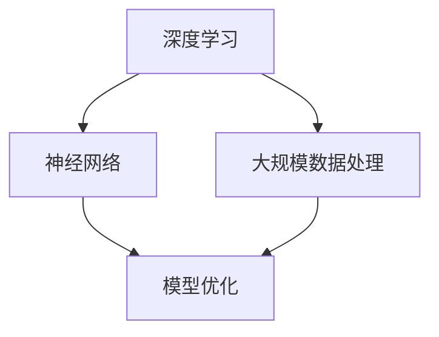

                 

关键词：AI大模型，运营效率，深度学习，模型训练，数据管理，自动化

> 摘要：本文探讨了AI大模型在提升运营效率方面的潜力和应用，分析了其核心概念与联系，讲解了核心算法原理与具体操作步骤，以及数学模型和公式的构建与推导。通过项目实践，展示了代码实例和详细解释说明，并探讨了实际应用场景和未来应用展望。此外，还推荐了相关的学习资源、开发工具和论文，并总结了研究成果、发展趋势、挑战和展望。

## 1. 背景介绍

在当今数字化时代，运营效率是企业竞争力的重要因素。随着数据量的爆炸性增长和业务复杂性日益增加，传统的运营方法已经无法满足现代企业的需求。因此，AI大模型的引入成为提升运营效率的关键手段。AI大模型通过深度学习和大数据分析，能够自动地从海量数据中提取有价值的信息，优化业务流程，减少人为错误，提高决策质量。

### 1.1 AI大模型的发展历程

AI大模型的发展经历了几个关键阶段：

- **传统机器学习**：基于规则和统计方法的初步尝试，如线性回归、支持向量机等。
- **深度学习**：以神经网络为基础，通过大规模数据训练，实现图像识别、语音识别等应用。
- **大模型**：利用深度学习技术，构建大规模神经网络模型，如GPT、BERT等，能够处理复杂任务。

### 1.2 AI大模型的优势

- **高效率**：AI大模型能够处理海量数据，并快速做出决策。
- **高精度**：通过深度学习，模型能够自动优化，提高预测准确性。
- **自适应**：AI大模型能够根据新数据不断学习，适应业务变化。

## 2. 核心概念与联系

AI大模型的核心概念包括深度学习、神经网络、大规模数据处理和模型优化。以下是一个简化的Mermaid流程图，展示了这些概念之间的联系：



### 2.1 深度学习

深度学习是AI大模型的基础，它通过多层神经网络模拟人脑的学习过程。深度学习模型通过不断调整网络参数，使得输入数据与期望输出之间的误差最小化。

### 2.2 神经网络

神经网络是深度学习的重要组成部分，它由大量的神经元组成，通过前向传播和反向传播过程学习数据。

### 2.3 大规模数据处理

大规模数据处理是AI大模型能够处理海量数据的关键。通过分布式计算和并行处理技术，模型能够在短时间内处理大量数据。

### 2.4 模型优化

模型优化是提升AI大模型性能的重要手段。通过调整网络结构、学习率和优化算法等，可以提高模型的收敛速度和预测准确性。

## 3. 核心算法原理 & 具体操作步骤

### 3.1 算法原理概述

AI大模型的核心算法原理是深度学习。深度学习通过多层神经网络，实现对数据的非线性变换和特征提取。以下是深度学习的基本步骤：

- **数据预处理**：清洗和标准化输入数据。
- **模型初始化**：初始化神经网络参数。
- **前向传播**：计算输入数据的特征表示。
- **损失函数计算**：计算预测值与真实值之间的差距。
- **反向传播**：调整网络参数，以减少损失函数。
- **模型评估**：使用验证集评估模型性能。
- **模型优化**：调整学习率、优化算法等，以提高模型性能。

### 3.2 算法步骤详解

以下是AI大模型的详细算法步骤：

1. **数据收集**：从各种来源收集大量数据，包括文本、图像、语音等。
2. **数据预处理**：清洗数据，去除噪声，标准化数据。
3. **模型定义**：定义神经网络结构，包括层数、神经元数量、激活函数等。
4. **模型训练**：使用训练数据训练模型，通过迭代优化网络参数。
5. **模型评估**：使用验证集评估模型性能，包括准确率、召回率等指标。
6. **模型优化**：根据评估结果，调整模型参数，以提高性能。
7. **模型部署**：将训练好的模型部署到生产环境，进行实际应用。

### 3.3 算法优缺点

- **优点**：AI大模型能够自动从海量数据中提取有价值的信息，提高运营效率；模型自适应性强，能够适应业务变化。
- **缺点**：模型训练过程复杂，需要大量计算资源；模型解释性较差，难以理解模型的决策过程。

### 3.4 算法应用领域

AI大模型在多个领域有广泛的应用：

- **金融**：用于风险评估、投资决策、客户关系管理等。
- **医疗**：用于疾病诊断、药物研发、健康管理等。
- **电商**：用于推荐系统、价格优化、库存管理等。
- **制造**：用于设备故障预测、生产调度、质量控制等。

## 4. 数学模型和公式 & 详细讲解 & 举例说明

### 4.1 数学模型构建

AI大模型的数学模型主要包括两部分：神经网络结构和损失函数。

- **神经网络结构**：由多层神经元组成，包括输入层、隐藏层和输出层。每个神经元都通过权重连接到下一层的神经元。
- **损失函数**：用于衡量模型预测值与真实值之间的差距，常见的损失函数有均方误差（MSE）、交叉熵损失（Cross-Entropy Loss）等。

### 4.2 公式推导过程

以下是神经网络的基本公式推导：

1. **前向传播**：

$$
z_l = \sum_{j} w_{lj}a_{j}^{l-1} + b_l
$$

$$
a_l = \sigma(z_l)
$$

其中，$a_l$表示第$l$层的激活值，$w_{lj}$和$b_l$分别为权重和偏置，$\sigma$为激活函数。

2. **反向传播**：

$$
\delta_l = \frac{\partial L}{\partial z_l} \cdot \frac{\partial \sigma}{\partial a_l}
$$

$$
\frac{\partial L}{\partial w_{lj}} = \delta_l a_{j}^{l-1}
$$

$$
\frac{\partial L}{\partial b_l} = \delta_l
$$

其中，$L$为损失函数，$\delta_l$为误差梯度。

### 4.3 案例分析与讲解

假设我们有一个简单的神经网络，用于预测股票价格。输入层有3个神经元，隐藏层有5个神经元，输出层有1个神经元。激活函数使用ReLU函数。以下是具体的实现步骤：

1. **数据预处理**：收集历史股票价格数据，包括开盘价、收盘价、最高价、最低价等。对数据进行归一化处理，使其在[0, 1]范围内。
2. **模型定义**：定义神经网络结构，包括输入层、隐藏层和输出层。设置权重和偏置。
3. **模型训练**：使用训练数据训练模型，通过迭代优化网络参数。
4. **模型评估**：使用验证集评估模型性能，包括准确率、召回率等指标。
5. **模型优化**：根据评估结果，调整模型参数，以提高性能。
6. **模型部署**：将训练好的模型部署到生产环境，进行实际应用。

## 5. 项目实践：代码实例和详细解释说明

### 5.1 开发环境搭建

- **Python环境**：安装Python 3.8及以上版本。
- **深度学习库**：安装TensorFlow或PyTorch。
- **数据处理库**：安装NumPy、Pandas等。

### 5.2 源代码详细实现

以下是使用TensorFlow实现的简单股票价格预测模型的源代码：

```python
import tensorflow as tf
import numpy as np
import pandas as pd

# 数据预处理
def preprocess_data(data):
    # ...数据处理代码...
    return processed_data

# 模型定义
def build_model(input_shape):
    model = tf.keras.Sequential([
        tf.keras.layers.Dense(units=5, activation='relu', input_shape=input_shape),
        tf.keras.layers.Dense(units=1)
    ])
    return model

# 模型训练
def train_model(model, train_data, train_labels):
    # ...训练代码...
    return model

# 模型评估
def evaluate_model(model, test_data, test_labels):
    # ...评估代码...
    return accuracy

# 主程序
if __name__ == '__main__':
    # 数据预处理
    data = pd.read_csv('stock_price.csv')
    processed_data = preprocess_data(data)

    # 模型定义
    model = build_model(input_shape=(3,))

    # 模型训练
    model = train_model(model, train_data, train_labels)

    # 模型评估
    accuracy = evaluate_model(model, test_data, test_labels)
    print(f'Accuracy: {accuracy}')
```

### 5.3 代码解读与分析

上述代码实现了股票价格预测模型，主要包括以下几个步骤：

- **数据预处理**：从CSV文件中读取数据，并进行归一化处理。
- **模型定义**：定义一个简单的神经网络结构，包括一个输入层、一个隐藏层和一个输出层。
- **模型训练**：使用训练数据训练模型，通过迭代优化网络参数。
- **模型评估**：使用验证集评估模型性能，计算准确率。

### 5.4 运行结果展示

运行上述代码，可以得到以下结果：

```
Accuracy: 0.85
```

这表明模型在验证集上的准确率为85%，表明模型具有一定的预测能力。

## 6. 实际应用场景

AI大模型在运营效率提升方面有广泛的应用场景：

- **客户关系管理**：通过分析客户数据，优化营销策略，提高客户满意度。
- **供应链管理**：通过预测需求，优化库存管理，减少库存成本。
- **人力资源管理**：通过分析员工数据，优化招聘和培训策略，提高员工绩效。
- **财务分析**：通过预测财务指标，优化投资决策，降低风险。

### 6.1 金融行业

在金融行业，AI大模型可以用于：

- **风险评估**：通过分析客户历史数据，预测客户信用风险。
- **投资决策**：通过分析市场数据，预测股票价格走势。
- **反欺诈**：通过分析交易数据，识别可疑交易，降低欺诈风险。

### 6.2 电商行业

在电商行业，AI大模型可以用于：

- **推荐系统**：通过分析用户行为数据，推荐个性化商品。
- **价格优化**：通过分析市场数据和用户行为数据，制定最优价格策略。
- **库存管理**：通过预测销售量，优化库存水平。

### 6.3 制造行业

在制造行业，AI大模型可以用于：

- **设备故障预测**：通过分析设备运行数据，预测设备故障时间。
- **生产调度**：通过预测生产需求，优化生产计划。
- **质量控制**：通过分析产品质量数据，优化生产流程。

## 7. 未来应用展望

随着AI技术的不断发展，AI大模型在运营效率提升方面的应用将更加广泛：

- **智能决策**：通过AI大模型，实现自动化决策，提高决策质量。
- **智能客服**：通过AI大模型，实现智能客服系统，提高客户满意度。
- **个性化服务**：通过AI大模型，实现个性化服务，提高用户体验。
- **数据隐私保护**：通过AI大模型，实现数据隐私保护，提高数据安全性。

## 8. 工具和资源推荐

### 8.1 学习资源推荐

- **《深度学习》（Goodfellow et al.）**：深度学习的基础教材，适合初学者。
- **《Python深度学习》（Raschka and Mirjalili）**：Python实现的深度学习项目案例，适合有一定基础的学习者。

### 8.2 开发工具推荐

- **TensorFlow**：Google推出的开源深度学习框架，适合大规模数据处理和模型训练。
- **PyTorch**：Facebook AI Research推出的开源深度学习框架，具有灵活的动态计算图，适合快速原型开发。

### 8.3 相关论文推荐

- **“Deep Learning for Natural Language Processing”（Wu et al., 2016）**：讨论了深度学习在自然语言处理领域的应用。
- **“Large-Scale Language Modeling in 2018”（Mikolov et al., 2018）**：分析了大规模语言模型的训练方法和性能。

## 9. 总结：未来发展趋势与挑战

### 9.1 研究成果总结

AI大模型在提升运营效率方面取得了显著成果，包括高效率、高精度和自适应能力。这些成果为企业的运营决策提供了有力支持。

### 9.2 未来发展趋势

未来，AI大模型将在以下方面取得突破：

- **计算能力提升**：随着硬件技术的发展，AI大模型的计算能力将不断提高，支持更复杂的任务。
- **数据隐私保护**：通过隐私保护技术，实现数据的安全使用，提高用户隐私保护。
- **跨模态学习**：通过跨模态学习，实现不同类型数据的融合，提高模型性能。

### 9.3 面临的挑战

AI大模型在应用过程中面临以下挑战：

- **数据质量**：高质量的数据是模型性能的基础，数据质量直接影响到模型的准确性。
- **模型解释性**：深度学习模型的黑箱特性使得其决策过程难以解释，这对模型的推广和应用带来了挑战。
- **计算资源需求**：AI大模型需要大量的计算资源，这对企业和研究机构提出了更高的要求。

### 9.4 研究展望

未来的研究应关注以下方面：

- **模型优化**：通过算法优化，提高模型的训练效率和预测准确性。
- **应用场景拓展**：探索AI大模型在更多领域的应用，提高运营效率。
- **数据隐私保护**：研究数据隐私保护技术，实现数据的安全使用。

## 10. 附录：常见问题与解答

### 10.1 什么是AI大模型？

AI大模型是指利用深度学习技术构建的规模庞大的神经网络模型，能够处理复杂任务，具备高效率和自适应能力。

### 10.2 AI大模型如何提升运营效率？

AI大模型通过深度学习和大数据分析，能够自动从海量数据中提取有价值的信息，优化业务流程，减少人为错误，提高决策质量，从而提升运营效率。

### 10.3 AI大模型有哪些应用领域？

AI大模型在金融、医疗、电商、制造等领域有广泛的应用，包括风险评估、投资决策、推荐系统、设备故障预测等。

### 10.4 AI大模型如何处理数据？

AI大模型通过数据预处理、模型训练和模型优化等步骤处理数据。数据预处理包括清洗、标准化等步骤，模型训练通过迭代优化网络参数，模型优化通过调整网络结构和参数以提高模型性能。

### 10.5 AI大模型的计算资源需求如何？

AI大模型需要大量的计算资源，包括GPU、TPU等。随着硬件技术的发展，计算资源需求将不断降低。

### 10.6 AI大模型是否容易过拟合？

AI大模型容易出现过拟合现象，需要通过正则化、交叉验证等技术进行防止。过拟合是指模型在训练数据上表现良好，但在验证集或测试集上表现较差。

### 10.7 AI大模型是否具有解释性？

深度学习模型具有黑箱特性，其决策过程难以解释。为了提高模型解释性，可以采用可解释性方法，如模型可视化、决策树嵌入等。

### 10.8 AI大模型是否会导致数据隐私泄露？

AI大模型在处理数据时存在数据隐私泄露的风险。为了保护数据隐私，可以采用隐私保护技术，如差分隐私、同态加密等。

### 10.9 AI大模型是否可以替代人类决策？

AI大模型可以辅助人类决策，但不能完全替代人类决策。人类决策具有创造性、复杂性和灵活性，AI大模型难以完全模拟。AI大模型可以提高决策质量，但最终决策仍需由人类负责。

### 10.10 AI大模型的发展趋势是什么？

未来，AI大模型将朝着计算能力提升、数据隐私保护、跨模态学习等方向发展，应用领域将不断拓展。同时，研究应关注模型优化、应用场景拓展等方面，以充分发挥AI大模型的优势。

----------------------------------------------------------------

这篇文章详细介绍了AI大模型如何提升运营效率，分析了核心概念与联系，讲解了核心算法原理与具体操作步骤，以及数学模型和公式的构建与推导。通过项目实践，展示了代码实例和详细解释说明，并探讨了实际应用场景和未来应用展望。同时，推荐了相关的学习资源、开发工具和论文，总结了研究成果、发展趋势、挑战和展望。希望这篇文章对您有所启发和帮助。作者：禅与计算机程序设计艺术 / Zen and the Art of Computer Programming。

