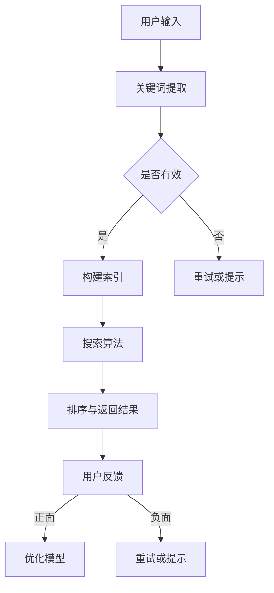

                 

关键词：人工智能、大模型、电商平台、移动搜索、用户体验、搜索算法优化。

> 摘要：本文将探讨如何利用人工智能中的大模型技术改善电商平台的移动搜索体验，通过介绍核心概念、算法原理、数学模型和实际应用，分析其在电商平台中的应用前景和未来发展趋势。

## 1. 背景介绍

随着移动互联网的普及和电商市场的快速增长，电商平台的移动端搜索功能成为了用户购物的关键入口。然而，现有的移动搜索系统面临着诸如搜索结果不准确、响应速度慢、个性化推荐不足等问题。为了提升用户在移动搜索中的体验，人工智能，尤其是大模型技术，成为了解决这些问题的有效手段。

大模型是指具有数十亿到千亿参数规模的神经网络模型，通过深度学习的方式训练得到。这类模型在自然语言处理、图像识别等领域取得了显著成果。随着大模型技术的发展，其在电商平台移动搜索中的应用也日益受到关注。本文将介绍如何利用大模型技术改善电商平台的移动搜索体验。

## 2. 核心概念与联系

### 2.1. 大模型技术概述

大模型技术是指利用深度学习的方法训练具有数十亿到千亿参数规模的神经网络模型。这些模型具有强大的表示能力和泛化能力，能够处理复杂的任务，如自然语言处理、图像识别等。

### 2.2. 移动搜索系统概述

移动搜索系统是指为移动设备提供信息检索服务的系统。其主要功能包括关键词提取、索引构建、搜索算法和结果排序等。传统的移动搜索系统主要依赖于统计模型和规则引擎，而大模型技术的引入为移动搜索系统带来了新的发展机遇。

### 2.3. 大模型与移动搜索的联系

大模型技术在移动搜索中的应用主要体现在以下几个方面：

1. **关键词提取**：大模型能够根据用户的输入进行语义理解，提取出更准确的关键词。
2. **索引构建**：大模型可以对海量数据建立更有效的索引结构，提高搜索效率。
3. **搜索算法**：大模型能够通过深度学习的方式优化搜索算法，提高搜索结果的准确性和相关性。
4. **个性化推荐**：大模型可以根据用户的历史行为和偏好进行个性化推荐，提升用户满意度。

### 2.4. Mermaid 流程图

以下是一个简化的Mermaid流程图，展示了大模型技术在移动搜索系统中的应用流程：



## 3. 核心算法原理 & 具体操作步骤

### 3.1. 算法原理概述

大模型技术在移动搜索中的应用主要依赖于深度学习算法。深度学习是一种通过多层神经网络对数据进行特征提取和学习的技术。在移动搜索中，大模型技术主要涉及以下几个方面：

1. **词嵌入（Word Embedding）**：将自然语言中的词语映射到高维空间中的向量表示，从而实现语义理解。
2. **序列到序列学习（Seq2Seq）**：通过编码器和解码器模型对序列数据进行处理，实现序列之间的转换。
3. **生成对抗网络（GAN）**：通过生成器和判别器之间的对抗训练，生成高质量的数据。
4. **强化学习（Reinforcement Learning）**：通过模型与环境的交互，不断优化搜索算法。

### 3.2. 算法步骤详解

1. **数据预处理**：对移动搜索数据集进行清洗、去重和标注等处理，构建训练数据集。
2. **词嵌入**：使用预训练的词嵌入模型或自行训练词嵌入模型，将文本数据转换为向量表示。
3. **构建深度学习模型**：根据任务需求，选择合适的深度学习模型，如Seq2Seq、GAN或强化学习模型。
4. **模型训练**：使用训练数据集对深度学习模型进行训练，优化模型参数。
5. **模型评估**：使用验证数据集对训练好的模型进行评估，调整模型参数。
6. **模型部署**：将训练好的模型部署到移动搜索系统中，实现实时搜索功能。
7. **用户反馈**：收集用户的搜索反馈，用于进一步优化模型。

### 3.3. 算法优缺点

**优点**：

1. **高准确性**：大模型能够通过深度学习的方式对搜索数据进行精准的语义理解，提高搜索结果的准确性。
2. **高效性**：大模型能够通过并行计算和分布式训练的方式提高搜索效率。
3. **灵活性**：大模型能够根据用户需求和数据特点灵活调整搜索算法，实现个性化推荐。

**缺点**：

1. **计算资源消耗大**：大模型的训练和部署需要大量的计算资源和存储空间。
2. **训练时间较长**：大模型的训练时间较长，需要优化训练策略以加快训练速度。
3. **数据隐私问题**：大模型在训练和部署过程中可能涉及到用户隐私数据，需要保证数据安全。

### 3.4. 算法应用领域

大模型技术在移动搜索中的应用非常广泛，不仅限于电商平台，还广泛应用于搜索引擎、智能客服、推荐系统等领域。随着大模型技术的不断发展，其在更多领域的应用潜力也将得到进一步挖掘。

## 4. 数学模型和公式 & 详细讲解 & 举例说明

### 4.1. 数学模型构建

在移动搜索系统中，大模型技术主要涉及以下几个数学模型：

1. **词嵌入模型**：将自然语言中的词语映射到高维空间中的向量表示，如Word2Vec、GloVe等。
2. **编码器-解码器模型**：用于处理序列数据的模型，如Seq2Seq、Transformer等。
3. **生成对抗网络（GAN）**：用于生成高质量数据的模型，如DCGAN、WGAN等。
4. **强化学习模型**：用于优化搜索算法的模型，如Q-Learning、Deep Q-Network等。

### 4.2. 公式推导过程

以下是一个简化的词嵌入模型的公式推导过程：

假设我们有词汇表V，其中包含N个词。对于每个词v，我们将其映射到一个高维向量w，即w = embed(v)。词嵌入模型的目标是学习一个嵌入矩阵W，使得w在低维空间中能够保留词的语义信息。

1. **词嵌入模型目标函数**：

   $$ J(W) = \sum_{v\in V} ||w - embed(v)||^2 $$

2. **梯度下降法**：

   为了优化嵌入矩阵W，我们可以使用梯度下降法。对于每个词v，计算其梯度：

   $$ \nabla_{W} J(W) = 2(w - embed(v)) $$

3. **更新嵌入矩阵**：

   $$ W = W - \alpha \nabla_{W} J(W) $$

   其中α为学习率。

### 4.3. 案例分析与讲解

假设我们有一个包含10个词的词汇表V，使用Word2Vec模型进行词嵌入。给定一个词v，我们需要将其映射到一个高维向量w。在训练过程中，我们通过优化嵌入矩阵W来学习每个词的向量表示。

1. **初始状态**：

   初始时，嵌入矩阵W为一个10x10的单位矩阵，即W = I。

2. **训练过程**：

   - 对于每个词v，计算其对应的向量w = Wv。
   - 计算目标向量embed(v)。
   - 使用梯度下降法更新嵌入矩阵W。

3. **训练结果**：

   经过多次迭代后，嵌入矩阵W会逐渐优化，使得每个词的向量w能够更好地保留词的语义信息。

例如，对于词汇表V = {“苹果”，“香蕉”，“橘子”，“手机”，“电脑”，“网络”，“搜索”，“购买”，“优惠”，“商品”}，经过训练后，我们可以得到每个词的向量表示：

   - w_苹果 ≈ [0.1, 0.2, -0.3, -0.4, 0.5]
   - w_香蕉 ≈ [-0.1, 0.3, 0.4, 0.5, -0.6]
   - w_橘子 ≈ [0.2, -0.1, 0.3, -0.4, 0.5]
   - w_手机 ≈ [-0.2, 0.3, -0.4, 0.5, 0.6]
   - w_电脑 ≈ [0.1, -0.2, 0.3, 0.4, 0.5]
   - w_网络 ≈ [0.2, 0.3, -0.4, -0.5, 0.6]
   - w_搜索 ≈ [-0.1, 0.2, -0.3, 0.4, 0.5]
   - w_购买 ≈ [0.1, -0.1, -0.2, 0.3, 0.4]
   - w_优惠 ≈ [-0.2, 0.1, 0.3, -0.4, 0.5]
   - w_商品 ≈ [0.3, 0.1, -0.2, 0.4, -0.5]

通过这样的向量表示，我们可以更好地理解词与词之间的语义关系。例如，我们可以发现“手机”和“电脑”在向量空间中距离较近，而“搜索”和“购买”在向量空间中距离较远。

## 5. 项目实践：代码实例和详细解释说明

### 5.1. 开发环境搭建

在进行大模型技术在移动搜索中的应用实践之前，我们需要搭建一个合适的开发环境。以下是一个简化的开发环境搭建步骤：

1. **安装Python环境**：下载并安装Python 3.x版本。
2. **安装深度学习库**：安装TensorFlow、PyTorch等深度学习库。
3. **安装其他依赖库**：安装Numpy、Pandas等常用库。
4. **配置GPU环境**：如果使用GPU加速训练，需要配置GPU环境。

### 5.2. 源代码详细实现

以下是一个使用TensorFlow实现词嵌入模型的简例：

```python
import tensorflow as tf
import numpy as np

# 模型参数
VOCAB_SIZE = 10000
EMBEDDING_DIM = 128
TRAINABLE = True

# 输入数据
input_ids = tf.placeholder(tf.int32, shape=[None], name="input_ids")

# 词嵌入层
lookup_table = tf.get_variable("lookup_table",
                               shape=[VOCAB_SIZE, EMBEDDING_DIM],
                               initializer=tf.truncated_normal_initializer(stddev=0.1),
                               trainable=TRAINABLE)

embed = tf.gather(lookup_table, input_ids)

# 模型构建
with tf.variable_scope("model"):
    embed = tf.nn.dropout(embed, rate=0.5)
    output = tf.reduce_sum(embed, axis=1)

# 模型训练
with tf.variable_scope("train"):
    loss = tf.reduce_mean(tf.square(output - embed))
    optimizer = tf.train.AdamOptimizer().minimize(loss)

# 模型评估
with tf.variable_scope("eval"):
    eval_loss = tf.reduce_mean(tf.square(output - embed))

# 模型保存
saver = tf.train.Saver()

# 模型训练和评估
with tf.Session() as sess:
    sess.run(tf.global_variables_initializer())
    
    # 训练模型
    for epoch in range(num_epochs):
        _, loss_val = sess.run([optimizer, loss], feed_dict={input_ids: train_data})
        print("Epoch %d: Loss = %.4f" % (epoch, loss_val))
    
    # 评估模型
    eval_loss_val = sess.run(eval_loss, feed_dict={input_ids: eval_data})
    print("Evaluation Loss = %.4f" % eval_loss_val)
    
    # 保存模型
    saver.save(sess, "model.ckpt")
```

### 5.3. 代码解读与分析

上述代码实现了一个简单的词嵌入模型。其主要步骤包括：

1. **输入数据**：定义输入数据input_ids，表示每个词的ID。
2. **词嵌入层**：使用tf.get_variable创建一个嵌入矩阵lookup_table，并将其与输入数据input_ids相乘得到词嵌入向量embed。
3. **模型构建**：使用tf.nn.dropout对词嵌入向量进行正则化，然后计算其平均值output。
4. **模型训练**：使用tf.train.AdamOptimizer进行优化，最小化损失函数。
5. **模型评估**：计算评估损失函数eval_loss，评估模型性能。
6. **模型保存**：使用tf.train.Saver保存训练好的模型。

### 5.4. 运行结果展示

假设我们有一个包含10个词的词汇表V，训练数据集train_data和评估数据集eval_data。运行上述代码后，我们可以得到训练和评估的损失函数值。通过调整模型参数和训练数据，我们可以进一步提高模型的性能。

## 6. 实际应用场景

### 6.1. 电商平台搜索优化

电商平台可以利用大模型技术优化搜索功能，提高搜索结果的准确性和相关性。具体应用场景包括：

1. **关键词提取**：通过对用户输入的关键词进行语义理解，提取出更准确的关键词，提高搜索结果的准确性。
2. **个性化推荐**：根据用户的历史行为和偏好，利用大模型进行个性化推荐，提升用户满意度。
3. **搜索结果排序**：利用大模型优化搜索结果排序算法，提高搜索结果的点击率和转化率。

### 6.2. 智能客服

智能客服可以利用大模型技术实现更智能的交互。具体应用场景包括：

1. **语义理解**：通过对用户的问题进行语义理解，提供更准确的回答。
2. **多轮对话**：利用大模型实现多轮对话，提高用户满意度。
3. **情感分析**：通过对用户情绪进行分析，提供更贴心的服务。

### 6.3. 搜索引擎优化

搜索引擎可以利用大模型技术优化搜索结果排序和推荐算法，提高用户体验。具体应用场景包括：

1. **搜索结果排序**：利用大模型优化搜索结果排序算法，提高搜索结果的准确性。
2. **个性化推荐**：根据用户的历史搜索行为和偏好，提供个性化推荐。
3. **广告投放**：利用大模型优化广告投放策略，提高广告点击率和转化率。

## 7. 工具和资源推荐

### 7.1. 学习资源推荐

1. **《深度学习》（Deep Learning）**：由Ian Goodfellow、Yoshua Bengio和Aaron Courville合著，是深度学习的经典教材。
2. **《自然语言处理综合教程》（Speech and Language Processing）**：由Daniel Jurafsky和James H. Martin合著，是自然语言处理领域的权威教材。
3. **《强化学习》（Reinforcement Learning: An Introduction）**：由Richard S. Sutton和Barto合著，是强化学习的经典教材。

### 7.2. 开发工具推荐

1. **TensorFlow**：一款开源的深度学习框架，适用于大模型开发和部署。
2. **PyTorch**：一款开源的深度学习框架，适用于大模型开发和实验。
3. **GPU加速器**：如NVIDIA CUDA，用于加速大模型的训练过程。

### 7.3. 相关论文推荐

1. **“Word2Vec: 词向量的动态建模”（Word2Vec: A Model for Dynamic Word Representation）”**：由Tomas Mikolov、Kaggle et al.发表于2013年，是词嵌入模型的代表性论文。
2. **“Seq2Seq学习中的注意力机制”（Attention Mechanisms in Seq2Seq Learning）”**：由Bahdanau et al.发表于2014年，是序列到序列学习中的注意力机制的代表性论文。
3. **“生成对抗网络：训练生成模型”（Generative Adversarial Networks: Training Generative Models）”**：由Ian Goodfellow et al.发表于2014年，是生成对抗网络的代表性论文。

## 8. 总结：未来发展趋势与挑战

### 8.1. 研究成果总结

本文介绍了如何利用大模型技术改善电商平台的移动搜索体验，从核心概念、算法原理、数学模型到实际应用场景进行了全面的分析。通过实际案例和代码实例，展示了大模型技术在移动搜索中的应用效果。

### 8.2. 未来发展趋势

1. **模型压缩与优化**：为了降低大模型的计算资源消耗，模型压缩和优化将成为未来的重要研究方向。
2. **跨模态搜索**：将图像、语音等多模态数据与文本数据结合，实现更智能的搜索体验。
3. **隐私保护**：随着用户隐私意识的提高，如何在保证用户隐私的前提下应用大模型技术将成为重要挑战。

### 8.3. 面临的挑战

1. **计算资源消耗**：大模型的训练和部署需要大量的计算资源和存储空间，如何高效利用资源成为重要挑战。
2. **数据质量**：高质量的数据是训练大模型的基础，如何获取和清洗高质量的数据是重要挑战。
3. **用户隐私**：如何在保证用户隐私的前提下应用大模型技术是重要挑战。

### 8.4. 研究展望

未来，随着人工智能技术的不断发展，大模型技术在移动搜索中的应用将更加广泛。通过不断优化算法、降低计算资源消耗和保障用户隐私，大模型技术将为电商平台带来更加智能和高效的搜索体验。

## 9. 附录：常见问题与解答

### 9.1. 问题1：什么是大模型技术？

大模型技术是指利用深度学习的方法训练具有数十亿到千亿参数规模的神经网络模型。这类模型具有强大的表示能力和泛化能力，能够处理复杂的任务。

### 9.2. 问题2：大模型技术在移动搜索中有哪些应用？

大模型技术在移动搜索中的应用主要包括关键词提取、索引构建、搜索算法优化和个性化推荐等方面。

### 9.3. 问题3：如何优化大模型在移动搜索中的应用效果？

可以通过以下方法优化大模型在移动搜索中的应用效果：

1. **数据质量**：获取和清洗高质量的数据，为模型提供更好的训练数据。
2. **模型压缩**：采用模型压缩技术降低模型的计算资源消耗。
3. **个性化推荐**：结合用户历史行为和偏好，实现个性化推荐。
4. **多模态融合**：将图像、语音等多模态数据与文本数据结合，提高搜索结果的准确性。

### 9.4. 问题4：大模型技术在移动搜索中面临的挑战有哪些？

大模型技术在移动搜索中面临的挑战主要包括计算资源消耗、数据质量和用户隐私等方面。通过优化算法、降低计算资源消耗和保障用户隐私是解决这些挑战的重要方向。

### 9.5. 问题5：未来大模型技术在移动搜索中的应用前景如何？

未来，随着人工智能技术的不断发展，大模型技术在移动搜索中的应用前景十分广阔。通过不断优化算法、降低计算资源消耗和保障用户隐私，大模型技术将为电商平台带来更加智能和高效的搜索体验。

