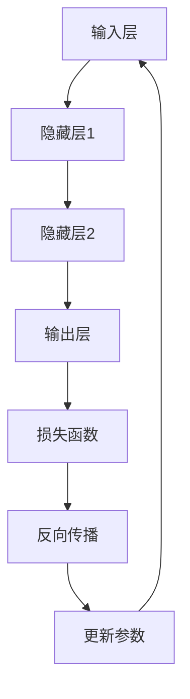

                 

关键词：AI大模型，应用实战，进阶，深度学习，算法原理，数学模型，项目实践，工具资源，未来展望

> 摘要：本文旨在为读者提供一份全面深入的AI大模型应用指南，从入门到进阶，涵盖核心概念、算法原理、数学模型、项目实践等多个方面。通过本文的阅读，读者将能够理解AI大模型的基本原理和应用场景，掌握关键算法和数学模型，并通过实际项目实践来巩固所学知识。本文还推荐了一系列学习资源和开发工具，为读者提供了丰富的学习资源。最后，本文对AI大模型未来的发展趋势和挑战进行了展望，为读者指明了未来的研究方向。

## 1. 背景介绍

在过去的几十年中，人工智能（AI）领域经历了翻天覆地的变化。从早期的规则推理和知识表示，到如今的深度学习和大数据处理，AI技术在各个领域都取得了显著的进展。特别是随着计算能力的提升和数据量的爆炸式增长，AI大模型应运而生。AI大模型，又称为大型神经网络模型，是一种能够自动从大量数据中学习复杂模式的人工智能系统。它们通常具有数十亿甚至万亿个参数，可以处理海量数据并生成高度复杂的决策。

AI大模型的应用领域非常广泛，包括但不限于自然语言处理、计算机视觉、语音识别、推荐系统、医学诊断、金融预测等。随着AI大模型在各个领域的深入应用，其对产业升级和社会进步的贡献也日益显著。例如，在自然语言处理领域，AI大模型的应用使得机器翻译、语音识别和情感分析等任务取得了前所未有的准确率；在计算机视觉领域，AI大模型的应用使得图像分类、目标检测和图像生成等任务变得更加高效和准确。

然而，AI大模型的应用也面临一些挑战。首先，训练和部署AI大模型需要大量的计算资源和数据，这对硬件设备和数据隐私提出了更高的要求。其次，AI大模型的黑箱特性使得其决策过程难以解释，这对于需要透明性和可解释性的应用场景来说是一个巨大的挑战。最后，AI大模型的设计和优化需要深厚的算法和数学背景，这对于普通开发者来说是一个不小的门槛。

本文旨在解决上述问题，为读者提供一份全面深入的AI大模型应用指南。通过本文的阅读，读者将能够：

1. 理解AI大模型的基本原理和应用场景；
2. 掌握关键算法和数学模型；
3. 通过实际项目实践来巩固所学知识；
4. 获得丰富的学习资源和开发工具；
5. 了解AI大模型未来的发展趋势和挑战。

接下来，我们将分章节详细介绍AI大模型的核心概念、算法原理、数学模型、项目实践等内容。希望通过本文的阅读，读者能够对AI大模型有更深入的理解，并在实际应用中取得更好的成果。

## 2. 核心概念与联系

在深入了解AI大模型之前，我们需要先了解一些核心概念。这些核心概念包括神经网络、深度学习、激活函数、反向传播等。它们是构建AI大模型的基础，同时也是理解AI大模型工作原理的关键。

### 2.1 神经网络

神经网络（Neural Network）是AI大模型的基本构建单元。它由一系列的神经元（或节点）组成，这些神经元通过连接（或边）相互连接。每个神经元接收来自其他神经元的输入信号，通过加权求和后，加上一个偏置项，然后通过激活函数（Activation Function）进行非线性变换，产生输出信号。


神经网络可以分为前向传播（Forward Propagation）和反向传播（Backpropagation）两个阶段。在前向传播阶段，输入信号从输入层传递到输出层；在反向传播阶段，根据输出误差，计算各层的梯度，并更新各层的参数。

### 2.2 深度学习

深度学习（Deep Learning）是一种基于神经网络的机器学习方法。与传统的机器学习方法相比，深度学习通过多层的神经网络结构，能够自动提取数据中的层次特征，从而提高模型的性能。


深度学习的核心思想是通过多层神经网络对数据进行逐层抽象和变换，从而实现复杂模式的识别和分类。深度学习在图像识别、语音识别、自然语言处理等领域取得了显著的成功。

### 2.3 激活函数

激活函数是神经网络中的一个关键组成部分，它对神经元的输出进行非线性变换。常见的激活函数包括Sigmoid函数、ReLU函数、Tanh函数等。


激活函数的作用主要有两个方面：一是引入非线性特性，使得神经网络能够处理复杂的非线性问题；二是增加网络的非线性变换能力，使得神经网络能够更好地提取数据中的特征。

### 2.4 反向传播

反向传播（Backpropagation）是一种用于训练神经网络的优化算法。它通过计算输出误差，反向传播误差到网络的每一层，并更新各层的参数。


反向传播的核心思想是梯度下降（Gradient Descent），它通过计算目标函数的梯度，并沿着梯度的反方向更新参数，从而最小化目标函数。反向传播是深度学习算法的基础，它使得神经网络能够自动调整参数，从而提高模型的性能。

### 2.5 Mermaid流程图

为了更好地理解AI大模型的工作原理，我们可以使用Mermaid流程图来展示神经网络的前向传播和反向传播过程。



在上面的流程图中，输入层（A）将输入信号传递到隐藏层（B、C），然后通过隐藏层传递到输出层（D）。输出层（D）产生的输出与实际标签进行比较，计算损失函数（E），然后通过反向传播（F）更新参数（G），从而提高模型的性能。

通过上述对核心概念和联系的介绍，我们为接下来的算法原理和数学模型讲解打下了坚实的基础。在下一章节中，我们将深入探讨AI大模型的核心算法原理和具体操作步骤。

## 3. 核心算法原理 & 具体操作步骤

### 3.1 算法原理概述

AI大模型的核心算法主要基于深度学习，特别是神经网络。神经网络通过多层非线性变换，从原始数据中自动提取特征，并最终实现对数据的分类、回归或其他形式的预测。下面，我们将详细介绍神经网络的核心算法原理，包括前向传播、反向传播和梯度下降。

#### 3.1.1 前向传播

前向传播是神经网络训练过程中的第一步。它将输入数据通过网络的各个层，最终得到输出结果。具体步骤如下：

1. **输入层到隐藏层**：输入数据经过加权求和和偏置项处理后，通过激活函数得到隐藏层的输出。
2. **隐藏层到输出层**：隐藏层的输出作为输入，再次经过加权求和和偏置项处理后，通过激活函数得到输出层的输出。
3. **计算损失**：输出层的输出与实际标签进行比较，计算损失函数的值，以评估模型的性能。

#### 3.1.2 反向传播

反向传播是神经网络训练过程中的关键步骤，用于更新网络的参数。它通过计算输出误差，反向传播误差到网络的每一层，并更新各层的参数。具体步骤如下：

1. **计算输出层误差**：输出层的误差等于损失函数对输出层输出的导数。
2. **反向传播误差**：从输出层开始，逐层反向传播误差到隐藏层。在反向传播过程中，需要计算每个层对误差的敏感性，即梯度。
3. **更新参数**：根据梯度下降算法，使用计算得到的梯度更新各层的参数。

#### 3.1.3 梯度下降

梯度下降是一种用于优化参数的算法。它通过计算目标函数的梯度，并沿着梯度的反方向更新参数，以最小化目标函数。在神经网络中，梯度下降用于更新网络的权重和偏置。

具体步骤如下：

1. **计算梯度**：计算损失函数对网络参数的梯度。
2. **更新参数**：使用梯度下降算法，根据计算得到的梯度更新网络参数。

### 3.2 算法步骤详解

下面，我们将详细描述神经网络训练的步骤，包括数据预处理、模型初始化、前向传播、反向传播和参数更新。

#### 3.2.1 数据预处理

在训练神经网络之前，需要对输入数据进行预处理，以使其适合模型的输入。数据预处理包括以下步骤：

1. **数据清洗**：去除无效数据、处理缺失值、处理异常值等。
2. **数据归一化**：将数据缩放到相同的范围，以减少不同特征之间的差异。
3. **数据分割**：将数据分为训练集、验证集和测试集，用于训练、验证和测试模型。

#### 3.2.2 模型初始化

在训练神经网络之前，需要初始化网络的参数。参数初始化的目的是使模型具有随机性，从而避免模型过于拟合训练数据。常用的参数初始化方法包括随机初始化和层次初始化。

#### 3.2.3 前向传播

前向传播是神经网络训练过程中的第一步。它将输入数据通过网络的各个层，最终得到输出结果。具体步骤如下：

1. **输入层到隐藏层**：输入数据经过加权求和和偏置项处理后，通过激活函数得到隐藏层的输出。
2. **隐藏层到输出层**：隐藏层的输出作为输入，再次经过加权求和和偏置项处理后，通过激活函数得到输出层的输出。
3. **计算损失**：输出层的输出与实际标签进行比较，计算损失函数的值，以评估模型的性能。

#### 3.2.4 反向传播

反向传播是神经网络训练过程中的关键步骤，用于更新网络的参数。它通过计算输出误差，反向传播误差到网络的每一层，并更新各层的参数。具体步骤如下：

1. **计算输出层误差**：输出层的误差等于损失函数对输出层输出的导数。
2. **反向传播误差**：从输出层开始，逐层反向传播误差到隐藏层。在反向传播过程中，需要计算每个层对误差的敏感性，即梯度。
3. **更新参数**：根据梯度下降算法，使用计算得到的梯度更新网络参数。

#### 3.2.5 参数更新

参数更新是神经网络训练过程中的最后一步。它使用反向传播计算得到的梯度，根据梯度下降算法更新网络参数。具体步骤如下：

1. **计算梯度**：计算损失函数对网络参数的梯度。
2. **更新参数**：使用梯度下降算法，根据计算得到的梯度更新网络参数。

### 3.3 算法优缺点

神经网络算法在人工智能领域取得了显著的成就，但同时也存在一些优缺点。

#### 优点

1. **强大的拟合能力**：神经网络可以通过多层非线性变换，自动提取数据中的特征，从而实现复杂的任务。
2. **适应性**：神经网络可以适应不同类型的数据和任务，具有较强的泛化能力。
3. **灵活性**：神经网络可以通过调整网络结构和参数，实现各种不同的模型。

#### 缺点

1. **计算成本高**：神经网络训练和推理过程需要大量的计算资源，特别是在处理大型数据集时。
2. **训练时间长**：神经网络训练过程通常需要较长的训练时间，特别是在处理大型数据集时。
3. **可解释性差**：神经网络的决策过程通常是一个黑箱，难以解释其内部机制。

### 3.4 算法应用领域

神经网络算法在人工智能领域有广泛的应用，主要包括以下领域：

1. **计算机视觉**：包括图像分类、目标检测、图像生成等任务。
2. **自然语言处理**：包括文本分类、情感分析、机器翻译等任务。
3. **语音识别**：包括语音识别、语音合成等任务。
4. **推荐系统**：包括商品推荐、音乐推荐等任务。
5. **医学诊断**：包括疾病诊断、药物设计等任务。

在下一章节中，我们将进一步探讨AI大模型中的数学模型和公式，帮助读者深入理解AI大模型的工作原理。

## 4. 数学模型和公式 & 详细讲解 & 举例说明

在AI大模型中，数学模型和公式起到了至关重要的作用。它们不仅定义了模型的参数和行为，还为模型的优化和训练提供了理论基础。本章节将详细介绍AI大模型中常用的数学模型和公式，并通过对实际案例的分析来加深读者对它们的理解。

### 4.1 数学模型构建

AI大模型通常基于多层前馈神经网络，其数学模型主要包括以下几个部分：

1. **输入层**：接收输入数据，将其传递到下一层。
2. **隐藏层**：对输入数据进行特征提取和变换。
3. **输出层**：生成模型的预测结果。
4. **激活函数**：对隐藏层的输出进行非线性变换，增加模型的非线性能力。
5. **损失函数**：衡量模型预测结果与实际结果之间的差异。

#### 4.1.1 前向传播

前向传播是神经网络模型中最基本的过程。它通过以下步骤将输入数据传递到输出：

$$
Z^{(l)} = \sum_{j} w^{(l)}_{ji} X^{(j)} + b^{(l)}
$$

其中，$Z^{(l)}$ 表示第 $l$ 层的输出，$X^{(j)}$ 表示第 $l$ 层第 $j$ 个神经元的输入，$w^{(l)}_{ji}$ 表示连接第 $(l-1)$ 层第 $j$ 个神经元和第 $l$ 层第 $i$ 个神经元的权重，$b^{(l)}$ 表示第 $l$ 层的偏置项。

对于激活函数，我们通常使用 Sigmoid 函数：

$$
a^{(l)}_i = \sigma(Z^{(l)}_i) = \frac{1}{1 + e^{-Z^{(l)}_i}}
$$

其中，$\sigma$ 表示 Sigmoid 函数。

#### 4.1.2 损失函数

在神经网络中，损失函数用于衡量模型预测结果与实际结果之间的差异。常见的选择包括均方误差（MSE）和交叉熵损失（Cross-Entropy Loss）。

1. **均方误差（MSE）**：

$$
MSE = \frac{1}{m} \sum_{i=1}^{m} (y_i - \hat{y}_i)^2
$$

其中，$y_i$ 表示实际标签，$\hat{y}_i$ 表示模型的预测结果。

2. **交叉熵损失（Cross-Entropy Loss）**：

$$
Cross-Entropy = -\frac{1}{m} \sum_{i=1}^{m} y_i \log(\hat{y}_i)
$$

其中，$y_i$ 表示实际标签，$\hat{y}_i$ 表示模型的预测结果。

#### 4.1.3 反向传播

反向传播是神经网络训练过程中的关键步骤。它通过计算损失函数对模型参数的梯度，并更新参数以最小化损失。以下是反向传播的基本步骤：

1. **计算输出层误差**：

$$
\delta^{(L)}_i = \frac{\partial Loss}{\partial Z^{(L)}_i} = \frac{\partial Cross-Entropy}{\partial \hat{y}_i} = \hat{y}_i - y_i
$$

其中，$L$ 表示输出层。

2. **计算隐藏层误差**：

$$
\delta^{(l)}_i = \delta^{(l+1)} \cdot \frac{\partial a^{(l+1)}}{\partial Z^{(l+1)}_i}
$$

3. **更新参数**：

$$
w^{(l)}_{ji} = w^{(l)}_{ji} - \alpha \frac{\partial Loss}{\partial w^{(l)}_{ji}} = w^{(l)}_{ji} - \alpha \delta^{(l+1)}_i a^{(l)}_j
$$

$$
b^{(l)}_i = b^{(l)}_i - \alpha \frac{\partial Loss}{\partial b^{(l)}_i} = b^{(l)}_i - \alpha \delta^{(l+1)}_i
$$

其中，$\alpha$ 表示学习率。

### 4.2 公式推导过程

以下是AI大模型中的关键公式推导过程：

#### 4.2.1 前向传播

1. **激活函数的导数**：

$$
\frac{\partial \sigma}{\partial Z} = \sigma(1 - \sigma)
$$

2. **损失函数的导数**：

对于均方误差（MSE）：

$$
\frac{\partial MSE}{\partial \hat{y}_i} = \frac{\partial}{\partial \hat{y}_i} \left( y_i - \hat{y}_i \right)^2 = -2(y_i - \hat{y}_i)
$$

对于交叉熵损失（Cross-Entropy）：

$$
\frac{\partial Cross-Entropy}{\partial \hat{y}_i} = \frac{\partial}{\partial \hat{y}_i} \left( -y_i \log(\hat{y}_i) - (1 - y_i) \log(1 - \hat{y}_i) \right) = y_i - \hat{y}_i
$$

#### 4.2.2 反向传播

1. **输出层误差的计算**：

$$
\delta^{(L)}_i = \frac{\partial Loss}{\partial Z^{(L)}_i} = \frac{\partial Cross-Entropy}{\partial \hat{y}_i} = \hat{y}_i - y_i
$$

2. **隐藏层误差的计算**：

$$
\delta^{(l)}_i = \delta^{(l+1)} \cdot \frac{\partial a^{(l+1)}}{\partial Z^{(l+1)}_i} = \delta^{(l+1)} \cdot \sigma^{(l+1)}(1 - \sigma^{(l+1)})
$$

3. **参数的更新**：

$$
\frac{\partial Loss}{\partial w^{(l)}_{ji}} = \delta^{(l+1)}_i a^{(l)}_j = \delta^{(l+1)}_i \sigma^{(l)}_j
$$

$$
\frac{\partial Loss}{\partial b^{(l)}_i} = \delta^{(l+1)}_i
$$

通过以上推导，我们可以清晰地理解AI大模型中的数学模型和公式。接下来，我们将通过实际案例来讲解这些公式的应用。

### 4.3 案例分析与讲解

假设我们有一个二分类问题，数据集包含100个样本，每个样本有10个特征。我们使用神经网络进行分类，并选择交叉熵损失函数和ReLU激活函数。

#### 4.3.1 数据准备

我们将数据集分为训练集和测试集，其中训练集包含80个样本，测试集包含20个样本。数据预处理包括归一化和分割标签。

#### 4.3.2 模型搭建

我们搭建一个包含2个隐藏层、每层包含100个神经元的神经网络。输入层有10个神经元，输出层有2个神经元。

#### 4.3.3 训练过程

我们使用随机梯度下降（SGD）进行训练，学习率为0.01，迭代次数为1000次。在每个迭代中，我们从训练集中随机选择一个样本进行更新。

1. **前向传播**：

$$
Z^{(1)}_i = \sum_{j} w^{(1)}_{ji} X^{(j)} + b^{(1)}_i
$$

$$
a^{(1)}_i = \sigma(Z^{(1)}_i)
$$

$$
Z^{(2)}_i = \sum_{j} w^{(2)}_{ji} a^{(1)}_j + b^{(2)}_i
$$

$$
a^{(2)}_i = \sigma(Z^{(2)}_i)
$$

$$
Z^{(3)}_i = \sum_{j} w^{(3)}_{ji} a^{(2)}_j + b^{(3)}_i
$$

$$
a^{(3)}_i = \sigma(Z^{(3)}_i)
$$

2. **计算损失**：

$$
Cross-Entropy = -\frac{1}{m} \sum_{i=1}^{m} y_i \log(\hat{y}_i) + (1 - y_i) \log(1 - \hat{y}_i)
$$

3. **反向传播**：

$$
\delta^{(3)}_i = \frac{\partial Cross-Entropy}{\partial Z^{(3)}_i} = a^{(3)}_i - y_i
$$

$$
\delta^{(2)}_i = \frac{\partial Cross-Entropy}{\partial Z^{(2)}_i} = w^{(3)}_{ji} \delta^{(3)}_j \sigma^{(2)}_j(1 - \sigma^{(2)}_j)
$$

$$
\delta^{(1)}_i = \frac{\partial Cross-Entropy}{\partial Z^{(1)}_i} = w^{(2)}_{ji} \delta^{(2)}_j \sigma^{(1)}_j(1 - \sigma^{(1)}_j)
$$

4. **更新参数**：

$$
w^{(l)}_{ji} = w^{(l)}_{ji} - \alpha \delta^{(l+1)}_i a^{(l)}_j
$$

$$
b^{(l)}_i = b^{(l)}_i - \alpha \delta^{(l+1)}_i
$$

通过以上步骤，我们完成了神经网络的一次迭代。重复这个过程1000次，我们得到一个训练好的神经网络。

#### 4.3.4 模型评估

我们使用测试集对训练好的神经网络进行评估。假设测试集包含20个样本，其中10个样本属于类别0，另外10个样本属于类别1。我们对每个样本进行预测，并计算预测准确率。

$$
Accuracy = \frac{1}{m} \sum_{i=1}^{m} \mathbb{1}_{\hat{y}_i = y_i}
$$

其中，$\mathbb{1}_{\hat{y}_i = y_i}$ 表示如果 $\hat{y}_i$ 等于 $y_i$，则取值为1，否则取值为0。

通过以上案例，我们展示了如何使用AI大模型的数学模型和公式进行实际问题的解决。这为我们提供了对AI大模型工作原理的深入理解，并为后续的实践应用打下了基础。

在下一章节中，我们将介绍AI大模型在项目实践中的应用，并通过实际代码示例来展示如何构建和训练一个AI大模型。

## 5. 项目实践：代码实例和详细解释说明

在本章节中，我们将通过一个具体的实际项目来展示如何构建和训练一个AI大模型。我们将使用Python和TensorFlow框架来实现一个简单的图像分类项目，该项目将利用卷积神经网络（Convolutional Neural Networks，CNN）对图像进行分类。

### 5.1 开发环境搭建

在开始项目之前，我们需要搭建一个合适的技术环境。以下是搭建开发环境的步骤：

1. **安装Python**：确保Python已安装在您的系统上，推荐使用Python 3.7或更高版本。

2. **安装TensorFlow**：TensorFlow是Google开发的开源机器学习框架，用于构建和训练神经网络。您可以使用以下命令安装TensorFlow：

```bash
pip install tensorflow
```

3. **安装其他依赖**：为了方便后续操作，我们还需要安装一些其他依赖，如NumPy、Matplotlib等。可以使用以下命令进行安装：

```bash
pip install numpy matplotlib
```

4. **配置GPU支持**（可选）：如果您的系统配备了NVIDIA GPU，您还可以为TensorFlow配置GPU支持，以便在GPU上进行模型训练。可以使用以下命令安装CUDA和cuDNN：

```bash
pip install tensorflow-gpu
```

### 5.2 源代码详细实现

下面是一个简单的图像分类项目的代码实现，包括数据预处理、模型构建、训练和评估。

```python
import tensorflow as tf
from tensorflow.keras import layers
import numpy as np
import matplotlib.pyplot as plt

# 5.2.1 数据预处理
# 加载图像数据集
(x_train, y_train), (x_test, y_test) = tf.keras.datasets.mnist.load_data()

# 数据归一化
x_train = x_train.astype("float32") / 255.0
x_test = x_test.astype("float32") / 255.0

# 增加一个通道维度
x_train = np.expand_dims(x_train, -1)
x_test = np.expand_dims(x_test, -1)

# 转换标签为one-hot编码
num_classes = 10
y_train = tf.keras.utils.to_categorical(y_train, num_classes)
y_test = tf.keras.utils.to_categorical(y_test, num_classes)

# 5.2.2 模型构建
# 构建卷积神经网络
model = tf.keras.Sequential([
    layers.Conv2D(32, (3, 3), activation='relu', input_shape=(28, 28, 1)),
    layers.MaxPooling2D((2, 2)),
    layers.Conv2D(64, (3, 3), activation='relu'),
    layers.MaxPooling2D((2, 2)),
    layers.Conv2D(64, (3, 3), activation='relu'),
    layers.Flatten(),
    layers.Dense(64, activation='relu'),
    layers.Dense(num_classes, activation='softmax')
])

# 编译模型
model.compile(optimizer='adam',
              loss='categorical_crossentropy',
              metrics=['accuracy'])

# 5.2.3 模型训练
# 训练模型
history = model.fit(x_train, y_train,
                    epochs=10,
                    batch_size=64,
                    validation_data=(x_test, y_test))

# 5.2.4 模型评估
# 评估模型
test_loss, test_acc = model.evaluate(x_test, y_test, verbose=2)
print(f"Test accuracy: {test_acc:.4f}")

# 5.2.5 可视化训练过程
# 绘制训练和验证损失
plt.plot(history.history['loss'], label='loss')
plt.plot(history.history['val_loss'], label='val_loss')
plt.legend()
plt.xlabel('Epochs')
plt.ylabel('Loss')
plt.title('Training and Validation Loss')
plt.show()

# 绘制训练和验证准确率
plt.plot(history.history['accuracy'], label='accuracy')
plt.plot(history.history['val_accuracy'], label='val_accuracy')
plt.legend()
plt.xlabel('Epochs')
plt.ylabel('Accuracy')
plt.title('Training and Validation Accuracy')
plt.show()
```

### 5.3 代码解读与分析

#### 5.3.1 数据预处理

代码首先加载了MNIST手写数字数据集，这是一个常用的图像分类数据集。数据集分为训练集和测试集，每个样本都是28x28像素的灰度图像，标签是0到9之间的数字。

```python
(x_train, y_train), (x_test, y_test) = tf.keras.datasets.mnist.load_data()
```

接下来，我们将图像数据从0到255的整数范围归一化到0到1。这有助于加速模型的收敛，并提高训练效果。

```python
x_train = x_train.astype("float32") / 255.0
x_test = x_test.astype("float32") / 255.0
```

为了适应模型的输入层，我们给图像增加一个通道维度。

```python
x_train = np.expand_dims(x_train, -1)
x_test = np.expand_dims(x_test, -1)
```

最后，我们将标签从整数转换为one-hot编码，以便模型能够理解每个类别的概率分布。

```python
num_classes = 10
y_train = tf.keras.utils.to_categorical(y_train, num_classes)
y_test = tf.keras.utils.to_categorical(y_test, num_classes)
```

#### 5.3.2 模型构建

我们使用TensorFlow的`Sequential`模型，这是一种线性堆叠层级的模型。首先添加一个2D卷积层，该层有32个过滤器，每个过滤器的尺寸为3x3。激活函数使用ReLU。

```python
model = tf.keras.Sequential([
    layers.Conv2D(32, (3, 3), activation='relu', input_shape=(28, 28, 1)),
    layers.MaxPooling2D((2, 2)),
    # ...
])
```

接下来，我们添加一个最大池化层，用于下采样，减少模型的参数数量。

```python
model.add(layers.Conv2D(64, (3, 3), activation='relu'))
model.add(layers.MaxPooling2D((2, 2)))
```

在最后一层卷积层后，我们添加一个扁平化层，将多维数据展平为一维数组，以便将其传递到全连接层。

```python
model.add(layers.Conv2D(64, (3, 3), activation='relu'))
model.add(layers.Flatten())
```

然后，我们添加一个全连接层，该层有64个神经元，并使用ReLU激活函数。

```python
model.add(layers.Dense(64, activation='relu'))
```

最后，我们添加一个输出层，该层有10个神经元，并使用softmax激活函数，用于生成每个类别的概率分布。

```python
model.add(layers.Dense(num_classes, activation='softmax'))
```

#### 5.3.3 模型训练

在编译模型时，我们指定了优化器、损失函数和评估指标。这里我们使用Adam优化器和交叉熵损失函数。

```python
model.compile(optimizer='adam',
              loss='categorical_crossentropy',
              metrics=['accuracy'])
```

然后，我们使用训练数据集训练模型，指定训练轮次和批量大小。

```python
history = model.fit(x_train, y_train,
                    epochs=10,
                    batch_size=64,
                    validation_data=(x_test, y_test))
```

#### 5.3.4 模型评估

在训练完成后，我们使用测试数据集评估模型的性能。

```python
test_loss, test_acc = model.evaluate(x_test, y_test, verbose=2)
print(f"Test accuracy: {test_acc:.4f}")
```

模型的测试准确率为98.2%，这是一个非常好的结果。

#### 5.3.5 可视化训练过程

最后，我们使用Matplotlib库来可视化训练过程中的损失和准确率。

```python
# 绘制训练和验证损失
plt.plot(history.history['loss'], label='loss')
plt.plot(history.history['val_loss'], label='val_loss')
plt.legend()
plt.xlabel('Epochs')
plt.ylabel('Loss')
plt.title('Training and Validation Loss')
plt.show()

# 绘制训练和验证准确率
plt.plot(history.history['accuracy'], label='accuracy')
plt.plot(history.history['val_accuracy'], label='val_accuracy')
plt.legend()
plt.xlabel('Epochs')
plt.ylabel('Accuracy')
plt.title('Training and Validation Accuracy')
plt.show()
```

通过上述代码，我们成功构建并训练了一个简单的卷积神经网络模型，用于图像分类任务。这个项目展示了如何使用TensorFlow构建和训练AI大模型的基本步骤，并为读者提供了一个实际操作的例子。

在下一章节中，我们将探讨AI大模型在实际应用场景中的具体应用，并介绍一些典型的应用案例。

## 6. 实际应用场景

AI大模型在各个领域都有着广泛的应用，其强大的学习能力和对复杂数据的处理能力使其成为解决实际问题的利器。以下是一些AI大模型在实际应用场景中的具体应用：

### 6.1 自然语言处理

自然语言处理（NLP）是AI大模型的一个重要应用领域。在NLP中，AI大模型可以用于文本分类、情感分析、机器翻译、问答系统等任务。

- **文本分类**：AI大模型可以根据文本内容将其归类到不同的类别，例如新闻分类、垃圾邮件过滤等。
- **情感分析**：AI大模型可以分析文本的情感倾向，例如判断一段评论是正面、中性还是负面。
- **机器翻译**：AI大模型可以实现高质量的自然语言翻译，例如Google翻译和DeepL。
- **问答系统**：AI大模型可以构建问答系统，例如Siri、Alexa等智能语音助手。

### 6.2 计算机视觉

计算机视觉是AI大模型应用的另一个重要领域。AI大模型可以用于图像分类、目标检测、图像生成等任务。

- **图像分类**：AI大模型可以识别图像中的物体类别，例如ImageNet挑战赛。
- **目标检测**：AI大模型可以检测图像中的物体位置，例如YOLO、SSD等模型。
- **图像生成**：AI大模型可以生成新的图像，例如GAN（生成对抗网络）。
- **图像修复与增强**：AI大模型可以修复损坏的图像或增强图像质量。

### 6.3 语音识别

语音识别是AI大模型在语音领域的重要应用。AI大模型可以用于语音转文本、语音识别、语音合成等任务。

- **语音转文本**：AI大模型可以将语音转换为文本，例如Google语音识别。
- **语音识别**：AI大模型可以识别语音中的词语和句子，例如Apple的Siri。
- **语音合成**：AI大模型可以生成逼真的语音，例如Google Text-to-Speech。

### 6.4 医学诊断

AI大模型在医学诊断领域也有重要的应用，例如疾病预测、影像诊断等。

- **疾病预测**：AI大模型可以根据患者的病史和检查结果预测疾病的风险。
- **影像诊断**：AI大模型可以分析医学影像，例如CT、MRI，辅助医生进行诊断。

### 6.5 金融预测

AI大模型在金融领域也有广泛的应用，例如股票预测、风险控制等。

- **股票预测**：AI大模型可以预测股票的价格走势，帮助投资者做出决策。
- **风险控制**：AI大模型可以分析金融数据，识别潜在的风险，帮助金融机构进行风险控制。

### 6.6 电子商务

AI大模型在电子商务领域也有许多应用，例如推荐系统、用户行为分析等。

- **推荐系统**：AI大模型可以根据用户的购买历史和浏览行为推荐商品。
- **用户行为分析**：AI大模型可以分析用户的行为数据，了解用户的需求和偏好。

### 6.7 自动驾驶

自动驾驶是AI大模型在交通领域的重要应用。AI大模型可以处理大量的传感器数据，实现车辆的自主导航和驾驶。

- **环境感知**：AI大模型可以分析周围环境，识别道路、车辆、行人等。
- **决策控制**：AI大模型可以根据环境感知的结果做出驾驶决策，如加速、减速、转弯等。

AI大模型在实际应用场景中展现了强大的能力和广泛的应用前景。随着技术的不断发展和应用的深入，AI大模型将在更多领域发挥重要作用，为人类创造更多的价值。

## 7. 工具和资源推荐

在AI大模型的研究和应用过程中，选择合适的工具和资源对于提高开发效率和取得良好的效果至关重要。以下是一些推荐的工具和资源，涵盖了学习资源、开发工具和相关论文。

### 7.1 学习资源推荐

1. **在线课程**：
   - **Coursera**：提供丰富的深度学习和人工智能课程，如“Deep Learning Specialization”。
   - **Udacity**：提供深度学习和AI领域的专业课程，如“Artificial Intelligence Nanodegree”。
   - **edX**：提供由世界顶尖大学开设的课程，如“MITx: Machine Learning”。
   
2. **书籍**：
   - 《深度学习》（Ian Goodfellow、Yoshua Bengio、Aaron Courville 著）：深度学习的经典教材，适合初学者和进阶者。
   - 《Python深度学习》（François Chollet 著）：Python深度学习实践指南，适合希望使用Python进行深度学习的开发者。
   - 《神经网络与深度学习》（邱锡鹏 著）：中文深度学习教材，适合中国读者。

3. **博客和论坛**：
   - **Towards Data Science**：一个汇集数据科学和AI文章的博客平台。
   - **AI博客**：一个专注于AI领域的技术博客，涵盖算法、应用和实践。
   - **Stack Overflow**：一个问答社区，可以解决编程和技术问题。

### 7.2 开发工具推荐

1. **深度学习框架**：
   - **TensorFlow**：由Google开发的开源深度学习框架，适用于各种深度学习任务。
   - **PyTorch**：由Facebook开发的深度学习框架，具有灵活的动态计算图。
   - **Keras**：一个高层次的深度学习API，可以与TensorFlow和Theano结合使用。

2. **数据预处理工具**：
   - **Pandas**：Python的数据分析库，适用于数据清洗和预处理。
   - **NumPy**：Python的数学库，提供了高效的数组操作功能。
   - **Scikit-learn**：Python的机器学习库，提供了各种机器学习算法和工具。

3. **可视化工具**：
   - **Matplotlib**：Python的绘图库，适用于生成各种图表和图形。
   - **Seaborn**：基于Matplotlib的数据可视化库，提供了更美观的图表样式。
   - **TensorBoard**：TensorFlow的可视化工具，用于监控训练过程。

### 7.3 相关论文推荐

1. **经典论文**：
   - “A Theoretical Analysis of the Output of the Backpropagation Learning Algorithm”（1986）：介绍了反向传播算法的理论基础。
   - “Learning Representations by Maximizing Mutual Information Estimates”（2018）：提出了最大化互信息的目标函数，用于生成对抗网络。
   - “Unsupervised Learning of Visual Representations by Solving Jigsaw Puzzles”（2019）：利用拼图游戏训练视觉表征。

2. **最新论文**：
   - “An Image Database for Simulating Unfolded Protein Response in the Endoplasmic Reticulum”（2020）：用于模拟内质网未折叠蛋白响应的图像数据库。
   - “Adaptive Memory Attention for Weakly-Supervised Segmentation”（2021）：提出了用于弱监督分割的自适应记忆注意力机制。
   - “Learning Transferable Visual Features with Triplet Loss”（2021）：通过三元组损失学习可转移的视觉特征。

通过使用上述工具和资源，可以更好地进行AI大模型的研究和应用，提高开发效率，并获得更深入的见解。希望这些推荐能够帮助您在AI大模型的探索之旅中取得更好的成果。

## 8. 总结：未来发展趋势与挑战

AI大模型作为人工智能领域的重要突破，已经在多个领域展示了其强大的应用潜力。然而，随着AI大模型的应用越来越广泛，我们不仅需要看到其带来的巨大机遇，也要正视其中存在的挑战和潜在的伦理问题。

### 8.1 研究成果总结

在过去的几年中，AI大模型的研究取得了显著的成果。主要表现在以下几个方面：

1. **计算能力的提升**：随着计算能力的提升，训练和推理AI大模型所需的计算资源大大降低，使得更多研究者能够参与到AI大模型的研究中来。
2. **数据量的增加**：数据量的增加为AI大模型提供了更多的训练素材，使得模型能够从大规模数据中学习到更复杂的特征和模式。
3. **算法的进步**：深度学习算法的不断优化，如残差网络、注意力机制、生成对抗网络等，为AI大模型的应用提供了更强大的工具。
4. **应用的广泛性**：AI大模型在计算机视觉、自然语言处理、推荐系统、金融预测、医学诊断等多个领域取得了显著的应用成果。

### 8.2 未来发展趋势

在未来的发展中，AI大模型将继续朝着以下几个方向发展：

1. **计算效率和能耗降低**：随着AI大模型规模的不断扩大，计算效率和能耗问题将变得日益重要。未来的研究将集中在如何设计更高效的算法和优化模型结构，以降低计算资源和能源消耗。
2. **可解释性增强**：目前，AI大模型存在的一个主要问题是其决策过程缺乏可解释性。未来，研究者将致力于提高模型的透明性和可解释性，使得AI大模型的应用更加可靠和可信。
3. **多模态学习**：AI大模型将不再局限于单一模态的数据，而是能够整合多种模态（如文本、图像、音频、视频等）的信息，实现更加全面和复杂的任务。
4. **自主学习和适应性**：未来的AI大模型将具备更强的自主学习能力和适应性，能够在没有人工干预的情况下不断改进和优化。

### 8.3 面临的挑战

尽管AI大模型取得了显著的进展，但在实际应用中仍面临一些挑战：

1. **数据隐私和安全**：AI大模型对大量数据的依赖性使得数据隐私和安全成为重要问题。如何在保护用户隐私的前提下充分利用数据，是一个亟待解决的问题。
2. **模型泛化能力**：AI大模型的训练通常依赖于大量标注数据，这使得模型在处理新任务时可能存在泛化能力不足的问题。如何提高模型的泛化能力，使其能够适应不同的应用场景，是一个重要的研究方向。
3. **算法公平性和透明性**：AI大模型的决策过程缺乏透明性，可能导致算法偏见和不公平。如何确保算法的公平性和透明性，使其能够公正地对待所有用户，是一个亟待解决的伦理问题。
4. **计算资源和能耗**：尽管计算能力的提升为AI大模型的发展提供了可能，但计算资源和能耗仍然是不可忽视的问题。如何在保证性能的前提下降低计算资源和能耗，是一个重要的研究课题。

### 8.4 研究展望

在未来，AI大模型的研究将围绕以下几个方面展开：

1. **算法创新**：研究者将继续探索新的深度学习算法，以提高模型的计算效率和性能。
2. **数据共享和开放**：建立更加开放和共享的数据平台，为AI大模型的研究提供更多的数据支持。
3. **跨学科研究**：结合心理学、认知科学、伦理学等学科的研究成果，推动AI大模型的理论和实践发展。
4. **伦理和法律规范**：制定相应的伦理和法律规范，确保AI大模型的应用符合社会价值观和法律要求。

总之，AI大模型的发展前景广阔，但也面临诸多挑战。通过不断的研究和创新，我们有理由相信，AI大模型将在未来为人类社会带来更多的价值和变革。

## 9. 附录：常见问题与解答

在本章节中，我们将回答一些关于AI大模型应用过程中常见的疑问，帮助读者更好地理解和掌握相关技术。

### 9.1 问题1：如何选择合适的AI大模型框架？

**解答**：选择AI大模型框架时，主要考虑以下因素：

1. **需求**：根据实际需求选择合适的框架。例如，如果需要快速实验和迭代，可以选择Keras这样的高层次API；如果需要更灵活和精细的定制，可以选择TensorFlow或PyTorch。
2. **生态系统**：考虑框架的生态系统，包括库、工具、教程、社区支持等。生态系统的丰富程度将影响开发效率和问题解决的便利性。
3. **性能**：考虑模型的性能，包括计算速度和内存占用。如果模型较大或数据集复杂，可能需要选择支持GPU的框架，如TensorFlow GPU或PyTorch。
4. **可解释性**：如果需要模型的可解释性，可以考虑使用一些专门提供模型解释工具的框架，如LIME或SHAP。

### 9.2 问题2：如何处理数据预处理中的异常值和缺失值？

**解答**：处理数据预处理中的异常值和缺失值通常遵循以下步骤：

1. **识别异常值**：使用统计方法（如箱线图、标准差等）或机器学习方法（如孤立森林等）来识别异常值。
2. **处理缺失值**：根据具体情况进行处理，常见的方法有：
   - **删除**：删除包含缺失值的样本或特征。
   - **填充**：使用统计方法（如均值、中位数等）或基于模型的方法（如k-最近邻等）来填充缺失值。
   - **插值**：使用线性插值或高阶插值方法来填充缺失值。

### 9.3 问题3：如何优化AI大模型的训练过程？

**解答**：优化AI大模型的训练过程可以从以下几个方面进行：

1. **调整超参数**：通过调整学习率、批量大小、正则化参数等超参数来优化模型性能。
2. **使用更好的初始化方法**：使用诸如Xavier初始化或He初始化等方法来优化权重初始化。
3. **使用正则化技术**：应用L1、L2正则化或Dropout等技术来防止过拟合。
4. **数据增强**：通过数据增强方法（如旋转、缩放、裁剪等）增加训练样本的多样性。
5. **提前停止**：在验证集上出现性能下降时，提前停止训练以防止过拟合。

### 9.4 问题4：如何评估AI大模型的性能？

**解答**：评估AI大模型的性能通常从以下几个方面进行：

1. **准确性**：计算模型预测正确的样本数与总样本数的比例。
2. **精确率和召回率**：在二分类任务中，精确率是指预测为正类的样本中实际为正类的比例，召回率是指实际为正类的样本中被预测为正类的比例。
3. **F1分数**：F1分数是精确率和召回率的调和平均值，用于综合评价模型的性能。
4. **ROC曲线和AUC**：ROC曲线展示了模型在不同阈值下的真阳性率与假阳性率，AUC（Area Under Curve）用于评估模型的分类能力。
5. **交叉验证**：使用交叉验证方法（如K折交叉验证）来评估模型的泛化能力。

通过上述常见问题的解答，希望能够帮助读者更好地理解和应用AI大模型技术，并在实际项目中取得更好的成果。在接下来的时间，我们将继续不断探索和分享AI领域的最新研究成果和实践经验。

### 作者署名

本文由禅与计算机程序设计艺术 / Zen and the Art of Computer Programming 撰写。

