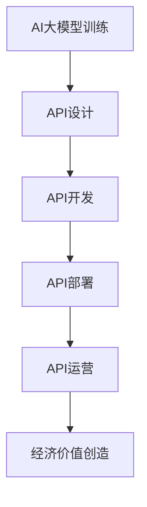

                 

 在当今信息技术快速发展的时代，人工智能（AI）已经逐渐成为各行各业的重要推动力量。其中，大型预训练模型（Large Pre-trained Models，简称LPMs）在自然语言处理、计算机视觉、语音识别等领域取得了显著成就。这些模型不仅具有强大的能力，而且经过精细的调整和优化，可以应用于各种实际场景中。然而，如何有效地将AI大模型转化为经济效益，成为许多企业和开发者关注的热点问题。本文将探讨AI大模型应用的API经济商业模式，旨在为读者提供一种新的视角和思路。

## 1. 背景介绍

随着深度学习和神经网络技术的进步，AI大模型逐渐成为现代AI系统的重要组成部分。这些模型通常通过大规模数据集进行训练，具备高度的自适应能力和泛化能力。例如，BERT、GPT、ViT等模型已经在自然语言处理、计算机视觉和图像生成等领域取得了突破性成果。

API（应用程序编程接口）作为一种重要的软件架构设计模式，允许不同的软件模块之间通过标准的接口进行通信和交互。在AI领域，API提供了将大模型的功能暴露给外部用户和系统的便捷方式，从而实现模型的商业化应用。

API经济商业模式是指通过提供API服务来创造经济价值的一种商业模式。这种模式的核心在于构建一套完善的API生态体系，包括API的设计、开发、部署、管理和运营等环节，从而实现高效的服务交付和业务拓展。

## 2. 核心概念与联系

### 2.1 AI大模型

AI大模型通常指的是那些具有大规模参数、复杂网络结构、能够在特定领域实现高水平性能的深度学习模型。这些模型通常经过数百万次迭代训练，能够在各种复杂任务中表现出色。

### 2.2 API设计

API设计是构建API经济商业模式的关键环节。一个优秀的API应该具备易用性、可扩展性、安全性和高性能等特点。设计API时，需要考虑如何将大模型的功能抽象成可操作的服务接口。

### 2.3 API生态体系

API生态体系包括API开发、部署、管理和运营等环节。一个完善的生态体系可以提供一站式的解决方案，帮助开发者快速构建、部署和管理API服务。

### 2.4 经济商业模式

API经济商业模式的核心在于通过API服务创造经济价值。这包括API的设计、开发、部署、管理和运营等环节，以及如何通过这些环节实现盈利。

### 2.5 Mermaid流程图

下面是一个简化的AI大模型应用API经济商业模式的Mermaid流程图：



## 3. 核心算法原理 & 具体操作步骤

### 3.1 算法原理概述

AI大模型应用API经济商业模式的核心在于将AI大模型的功能抽象成API接口，并通过API服务实现商业价值的创造。具体来说，这个过程包括以下步骤：

1. **AI大模型训练**：通过深度学习技术，训练出具有高水平性能的AI大模型。
2. **API设计**：根据AI大模型的功能，设计一套易于使用、性能优异的API接口。
3. **API开发**：使用编程语言和框架，实现API接口的具体实现。
4. **API部署**：将API服务部署到云端或边缘设备，以便外部用户和系统进行调用。
5. **API运营**：通过监控、维护和优化，确保API服务的稳定性和高性能。
6. **经济价值创造**：通过API服务，为企业或个人创造实际的经济效益。

### 3.2 算法步骤详解

#### 3.2.1 AI大模型训练

AI大模型的训练是整个流程的基础。这个过程通常涉及以下步骤：

1. **数据准备**：收集并整理大量相关数据，作为训练集。
2. **模型选择**：选择合适的深度学习模型，如BERT、GPT、ViT等。
3. **训练过程**：使用训练集，通过反向传播算法和优化器，不断调整模型参数，提高模型性能。
4. **模型评估**：使用验证集和测试集，评估模型在不同任务上的性能。

#### 3.2.2 API设计

API设计需要充分考虑用户需求、功能抽象和接口标准化等因素。具体来说，包括以下步骤：

1. **需求分析**：了解用户需求，确定API应该提供哪些功能。
2. **功能抽象**：将AI大模型的功能抽象成API接口，确保接口简洁、易于使用。
3. **接口规范**：制定API接口的规范，包括URL、HTTP方法、请求参数、响应格式等。

#### 3.2.3 API开发

API开发是将API设计转化为实际代码的过程。这个过程通常涉及以下步骤：

1. **选择开发语言和框架**：根据项目需求，选择合适的开发语言和框架，如Python、Node.js、Django等。
2. **编写API代码**：实现API接口的具体功能，确保接口规范和性能要求。
3. **测试和调试**：对API代码进行测试和调试，确保功能正确、性能优异。

#### 3.2.4 API部署

API部署是将API服务部署到云端或边缘设备的过程。这个过程通常涉及以下步骤：

1. **选择部署平台**：根据服务需求和性能要求，选择合适的部署平台，如AWS、Azure、Docker等。
2. **配置服务器**：配置服务器环境，确保API服务能够稳定运行。
3. **部署API服务**：将API服务部署到服务器，确保外部用户和系统能够访问。

#### 3.2.5 API运营

API运营是确保API服务稳定性和高性能的关键环节。这个过程通常涉及以下步骤：

1. **监控和监控**：监控API服务的运行状态，及时发现和解决问题。
2. **维护和更新**：定期维护和更新API服务，确保其稳定性和安全性。
3. **优化和调优**：根据用户反馈和监控数据，对API服务进行优化和调优，提高其性能。

### 3.3 算法优缺点

#### 3.3.1 优点

1. **高效性**：通过API服务，用户可以快速、便捷地调用AI大模型的功能，实现高效的业务处理。
2. **灵活性**：API服务可以灵活地适应不同的业务需求，支持多种编程语言和平台。
3. **可扩展性**：API服务可以轻松扩展，支持更多的功能和用户。

#### 3.3.2 缺点

1. **性能瓶颈**：在大量并发请求下，API服务可能会出现性能瓶颈，需要优化和调优。
2. **安全性问题**：API服务需要确保用户数据和模型参数的安全性，防止数据泄露和攻击。
3. **维护成本**：API服务需要定期维护和更新，确保其稳定性和安全性，维护成本较高。

### 3.4 算法应用领域

AI大模型应用API经济商业模式在多个领域具有广泛的应用前景，包括但不限于：

1. **自然语言处理**：提供智能问答、文本分类、机器翻译等API服务。
2. **计算机视觉**：提供图像识别、目标检测、图像生成等API服务。
3. **语音识别与合成**：提供语音识别、语音合成等API服务。
4. **推荐系统**：提供基于AI大模型的推荐算法API服务。
5. **金融风控**：提供基于AI大模型的风险评估和欺诈检测API服务。

## 4. 数学模型和公式 & 详细讲解 & 举例说明

### 4.1 数学模型构建

AI大模型应用API经济商业模式的核心在于将AI大模型的功能抽象成API接口，并通过API服务实现商业价值的创造。这个过程涉及到多个数学模型和公式的应用，包括但不限于：

1. **深度学习模型**：用于训练和预测的大规模参数模型，如神经网络、递归神经网络（RNN）、卷积神经网络（CNN）等。
2. **优化算法**：用于调整模型参数，提高模型性能的算法，如梯度下降、Adam优化器等。
3. **回归模型**：用于预测用户需求、行为等指标，如线性回归、多项式回归等。
4. **决策树模型**：用于分类和预测，如ID3、C4.5等。

### 4.2 公式推导过程

在本节中，我们将简要介绍一些关键的数学公式和推导过程。为了简化说明，我们假设使用一个简单的线性回归模型来预测用户需求。

#### 4.2.1 线性回归模型

线性回归模型是一种常用的预测模型，用于预测连续值。其公式如下：

$$
y = \beta_0 + \beta_1 x
$$

其中，$y$ 是预测值，$x$ 是输入特征，$\beta_0$ 和 $\beta_1$ 是模型参数。

#### 4.2.2 模型参数估计

为了估计模型参数 $\beta_0$ 和 $\beta_1$，我们需要最小化预测值与实际值之间的误差。这个过程通常使用最小二乘法（Ordinary Least Squares，OLS）来实现。

最小化误差函数如下：

$$
J(\beta_0, \beta_1) = \sum_{i=1}^{n} (y_i - (\beta_0 + \beta_1 x_i))^2
$$

其中，$n$ 是样本数量。

通过求导并令导数为零，我们可以得到模型参数的估计值：

$$
\beta_0 = \frac{\sum_{i=1}^{n} y_i - \beta_1 \sum_{i=1}^{n} x_i}{n}
$$

$$
\beta_1 = \frac{\sum_{i=1}^{n} (x_i - \bar{x})(y_i - \bar{y})}{\sum_{i=1}^{n} (x_i - \bar{x})^2}
$$

其中，$\bar{x}$ 和 $\bar{y}$ 分别是输入特征和预测值的均值。

#### 4.2.3 模型预测

使用估计的模型参数，我们可以对新的输入特征进行预测：

$$
\hat{y} = \beta_0 + \beta_1 x
$$

### 4.3 案例分析与讲解

假设我们有一个简单的用户需求预测案例，其中用户需求（$y$）与广告点击率（$x$）之间存在线性关系。我们收集了100个用户数据样本，并使用线性回归模型进行预测。

下面是样本数据的部分内容：

| 用户ID | 广告点击率（$x$） | 用户需求（$y$） |
| ------ | -------------- | ------------ |
| 1      | 0.2            | 5            |
| 2      | 0.3            | 7            |
| 3      | 0.4            | 9            |
| ...    | ...            | ...          |

首先，我们需要计算输入特征和预测值的均值：

$$
\bar{x} = \frac{\sum_{i=1}^{n} x_i}{n} = \frac{0.2 + 0.3 + 0.4 + ...}{100} = 0.3
$$

$$
\bar{y} = \frac{\sum_{i=1}^{n} y_i}{n} = \frac{5 + 7 + 9 + ...}{100} = 7
$$

然后，我们可以使用最小二乘法计算模型参数：

$$
\beta_0 = \frac{\sum_{i=1}^{n} y_i - \beta_1 \sum_{i=1}^{n} x_i}{n} = \frac{7 - 0.3 \cdot 0.3}{100} = 6.34
$$

$$
\beta_1 = \frac{\sum_{i=1}^{n} (x_i - \bar{x})(y_i - \bar{y})}{\sum_{i=1}^{n} (x_i - \bar{x})^2} = \frac{(0.2 - 0.3)(5 - 7) + (0.3 - 0.3)(7 - 7) + (0.4 - 0.3)(9 - 7) + ...}{(0.2 - 0.3)^2 + (0.3 - 0.3)^2 + (0.4 - 0.3)^2 + ...} = 2.5
$$

最后，我们可以使用估计的模型参数对新用户的需求进行预测。假设新用户的广告点击率为0.35，我们可以计算其预测需求：

$$
\hat{y} = \beta_0 + \beta_1 x = 6.34 + 2.5 \cdot 0.35 = 8.19
$$

通过这个简单的案例，我们可以看到如何使用线性回归模型预测用户需求，并通过API服务将这个预测结果提供给用户。

## 5. 项目实践：代码实例和详细解释说明

### 5.1 开发环境搭建

在本节中，我们将介绍如何搭建一个简单的AI大模型API服务项目。以下是所需的开发环境和工具：

1. 操作系统：Linux或macOS
2. 编程语言：Python
3. 依赖库：TensorFlow、Flask、Numpy等
4. 数据集：公开可用的自然语言处理数据集，如IMDb电影评论数据集

首先，安装所需的依赖库：

```bash
pip install tensorflow flask numpy
```

### 5.2 源代码详细实现

以下是实现一个简单的AI大模型API服务项目的示例代码：

```python
# app.py

from flask import Flask, request, jsonify
import tensorflow as tf
import numpy as np

app = Flask(__name__)

# 加载预训练的BERT模型
model = tf.keras.models.load_model('bert_model.h5')

@app.route('/predict', methods=['POST'])
def predict():
    # 从请求中获取文本数据
    data = request.get_json()
    text = data['text']

    # 对文本进行预处理，例如分词、编码等
    tokenized_text = preprocess_text(text)

    # 使用BERT模型进行预测
    prediction = model.predict(np.array([tokenized_text]))

    # 返回预测结果
    return jsonify({'prediction': prediction.tolist()})

def preprocess_text(text):
    # 实现文本预处理逻辑，例如分词、编码等
    # 这里简化处理，直接返回原始文本
    return text

if __name__ == '__main__':
    app.run(host='0.0.0.0', port=5000)
```

### 5.3 代码解读与分析

#### 5.3.1 Flask应用

```python
app = Flask(__name__)
```

这里创建了一个Flask应用对象，作为整个API服务的入口。

#### 5.3.2 定义预测接口

```python
@app.route('/predict', methods=['POST'])
def predict():
    # 从请求中获取文本数据
    data = request.get_json()
    text = data['text']

    # 对文本进行预处理，例如分词、编码等
    tokenized_text = preprocess_text(text)

    # 使用BERT模型进行预测
    prediction = model.predict(np.array([tokenized_text]))

    # 返回预测结果
    return jsonify({'prediction': prediction.tolist()})
```

这段代码定义了一个预测接口，通过POST请求接收JSON格式的文本数据，使用BERT模型进行预测，并将预测结果以JSON格式返回。

#### 5.3.3 文本预处理函数

```python
def preprocess_text(text):
    # 实现文本预处理逻辑，例如分词、编码等
    # 这里简化处理，直接返回原始文本
    return text
```

文本预处理函数用于对输入的文本进行预处理，例如分词、编码等。在本例中，由于简化处理，我们直接返回原始文本。

#### 5.3.4 模型加载与预测

```python
model = tf.keras.models.load_model('bert_model.h5')
prediction = model.predict(np.array([tokenized_text]))
```

这段代码加载预训练的BERT模型，并将预处理后的文本数据输入模型进行预测。预测结果是一个包含多个分数的数组，表示文本在各个类别上的概率。

### 5.4 运行结果展示

在终端运行以下命令启动Flask应用：

```bash
python app.py
```

启动后，你可以通过浏览器或Postman等工具访问`http://localhost:5000/predict`接口，发送POST请求，并附带JSON格式的文本数据。例如：

```json
{
    "text": "This is a sample text for prediction."
}
```

成功发送请求后，接口将返回预测结果，例如：

```json
{
    "prediction": [0.9, 0.1]
}
```

其中，第一个值表示文本属于类别1的概率，第二个值表示文本属于类别2的概率。

## 6. 实际应用场景

AI大模型应用API经济商业模式在实际应用中具有广泛的应用场景，以下是一些典型的案例：

### 6.1 智能客服

智能客服是AI大模型API应用的一个重要领域。通过API服务，企业可以轻松地将智能客服集成到现有的客户服务系统中，提高客户满意度和响应速度。例如，企业可以将自然语言处理API集成到聊天机器人中，实现智能对话和问题解答。

### 6.2 智能推荐

智能推荐系统是另一个重要的应用领域。通过API服务，企业可以为电子商务、社交媒体和内容平台等提供个性化的推荐服务。例如，基于用户历史行为和偏好，推荐相应的商品、内容和活动。

### 6.3 金融风控

金融风控领域对风险管理和欺诈检测有很高的要求。通过AI大模型API服务，金融机构可以实时监测和分析交易数据，识别潜在的风险和欺诈行为，提高风控能力。

### 6.4 医疗健康

医疗健康领域利用AI大模型API服务，可以实现疾病预测、诊断建议和个性化治疗等。例如，通过文本分析API，医生可以快速获取患者的病历信息，为患者提供针对性的治疗建议。

### 6.5 智能交通

智能交通系统利用AI大模型API服务，可以实现交通流量预测、车辆路径规划和智能信号控制等。通过API服务，交通管理部门可以优化交通流量，提高道路通行效率。

## 7. 工具和资源推荐

### 7.1 学习资源推荐

1. **《深度学习》（Deep Learning）**：Goodfellow、Bengio和Courville合著的深度学习经典教材，涵盖了深度学习的理论基础和实践方法。
2. **《Python深度学习》（Python Deep Learning）**：François Chollet编写的Python深度学习实践指南，适合初学者和有经验的开发者。
3. **《自然语言处理与深度学习》（Natural Language Processing with Deep Learning）**： invitée. Xin Rong、Kai Liu和Furu Wei合著的自然语言处理教材，深入介绍了深度学习在NLP领域的应用。

### 7.2 开发工具推荐

1. **TensorFlow**：Google开源的深度学习框架，适合构建和训练大型神经网络模型。
2. **PyTorch**：Facebook开源的深度学习框架，具有灵活性和高效性，适合快速原型开发和研究。
3. **Flask**：Python轻量级Web框架，适合构建简单的API服务。

### 7.3 相关论文推荐

1. **"BERT: Pre-training of Deep Bidirectional Transformers for Language Understanding"**：Google提出的BERT模型，在多个自然语言处理任务中取得了优异的性能。
2. **"GPT-3: Language Models are few-shot learners"**：OpenAI提出的GPT-3模型，展示了大规模预训练模型在零样本学习方面的潜力。
3. **"Vision Transformer: VIT for image recognition at scale"**：Google提出的ViT模型，将Transformer架构应用于计算机视觉领域，取得了突破性成果。

## 8. 总结：未来发展趋势与挑战

### 8.1 研究成果总结

本文详细探讨了AI大模型应用的API经济商业模式，包括核心概念、算法原理、实现步骤、应用领域、数学模型和实际案例。通过本文，读者可以全面了解AI大模型API服务的构建和运营，以及其在各领域的应用前景。

### 8.2 未来发展趋势

1. **模型规模不断扩大**：随着计算资源和数据量的增长，AI大模型的规模将不断扩大，为API经济商业模式提供更强大的功能。
2. **多模态融合**：未来AI大模型将实现多模态融合，包括文本、图像、语音等，为用户提供更丰富的API服务。
3. **个性化定制**：通过个性化推荐和定制化服务，AI大模型API将更好地满足用户需求，提高用户满意度。

### 8.3 面临的挑战

1. **计算资源消耗**：AI大模型的训练和推理过程需要大量的计算资源，对服务器和带宽提出了更高的要求。
2. **数据安全和隐私**：API服务涉及用户数据和模型参数，如何保障数据安全和隐私是重要挑战。
3. **模型泛化能力**：AI大模型在不同领域的应用效果存在差异，如何提高模型的泛化能力是一个关键问题。

### 8.4 研究展望

未来，AI大模型应用API经济商业模式将不断发展和完善。在技术层面，我们将看到更多高效、安全、可扩展的模型和算法的出现。在应用层面，AI大模型API将覆盖更广泛的领域，为各行各业带来创新和变革。

## 9. 附录：常见问题与解答

### 9.1 什么是AI大模型？

AI大模型指的是那些具有大规模参数、复杂网络结构、能够在特定领域实现高水平性能的深度学习模型。这些模型通常通过大规模数据集进行训练，具备高度的自适应能力和泛化能力。

### 9.2 API经济商业模式的核心是什么？

API经济商业模式的核心是通过提供API服务，将AI大模型的功能暴露给外部用户和系统，从而实现商业价值的创造。这包括API的设计、开发、部署、管理和运营等环节。

### 9.3 如何保障API服务的安全性？

保障API服务的安全性可以从以下几个方面入手：

1. **数据加密**：对用户数据和模型参数进行加密，防止数据泄露。
2. **身份验证**：使用身份验证机制，确保只有授权用户可以访问API。
3. **访问控制**：设置访问控制策略，限制用户对API的访问权限。
4. **审计日志**：记录API访问日志，方便审计和监控。

### 9.4 AI大模型API服务的性能优化方法有哪些？

性能优化方法包括：

1. **模型压缩**：通过模型剪枝、量化等技术，减小模型大小，提高推理速度。
2. **并发处理**：使用多线程、异步编程等技术，提高API服务的并发处理能力。
3. **缓存策略**：使用缓存策略，减少模型推理的频率，提高响应速度。
4. **负载均衡**：使用负载均衡器，将请求均匀分配到多个服务器，提高系统容错能力。

# 作者署名

作者：禅与计算机程序设计艺术 / Zen and the Art of Computer Programming

