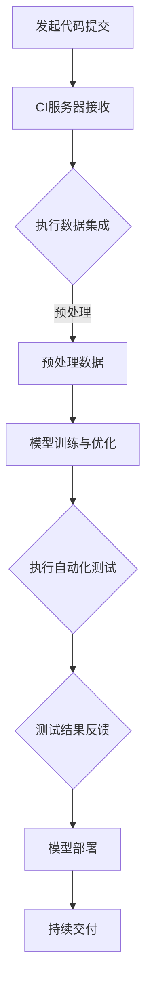

                 

关键词：AI大模型，CI/CD流程，自动化，DevOps，软件构建，持续集成，持续交付，容器化，自动化测试，监控与反馈

## 摘要

本文旨在探讨如何利用自动化工具和流程来优化AI大模型的CI/CD（持续集成/持续交付）过程。随着AI技术的不断进步，AI大模型的应用越来越广泛，其对计算资源、数据管理、模型部署等方面提出了更高的要求。通过CI/CD流程的自动化，可以大幅提升开发效率，保证模型质量，并降低维护成本。本文将详细阐述CI/CD流程中的各个环节，并给出具体的实践案例和解决方案。

## 1. 背景介绍

### AI大模型的现状与挑战

近年来，深度学习和大数据技术的快速发展，使得AI大模型在图像识别、自然语言处理、推荐系统等领域取得了显著的成果。然而，随着模型的复杂度和数据量的激增，传统的开发、测试和部署方式已无法满足高效、稳定的开发需求。以下是AI大模型开发面临的主要挑战：

- **计算资源消耗巨大**：大模型训练需要大量的计算资源和存储空间，传统的单机或小型集群已无法满足需求。
- **数据管理复杂**：大模型依赖于海量的数据集，数据的管理、清洗和预处理变得尤为重要。
- **模型更新频率高**：AI大模型需要不断更新以适应新的业务需求和数据变化，传统的手动部署方式效率低下。
- **稳定性要求高**：在生产环境中，模型的稳定性直接影响业务服务的可靠性，任何小的错误都可能导致严重的后果。

### CI/CD流程的重要性

CI/CD是现代软件开发中不可或缺的流程，它通过自动化测试、构建和部署，实现了软件交付的持续性和可靠性。对于AI大模型来说，CI/CD的重要性更加突出：

- **提高开发效率**：自动化测试和构建可以大大减少手动操作，提高开发速度。
- **保证模型质量**：通过严格的测试流程，可以确保模型的稳定性和准确性。
- **降低维护成本**：自动化流程可以减少重复性工作，降低维护成本。
- **快速响应变更**：自动化部署可以快速适应新的需求和环境变化。

## 2. 核心概念与联系

### CI/CD的基本概念

- **CI（持续集成）**：将开发者的代码合并到共享的代码库中，通过自动化工具运行一系列测试，确保新的代码不会破坏现有功能。
- **CD（持续交付）**：在CI的基础上，进一步将代码交付到生产环境中，通过自动化部署工具实现。

### CI/CD与AI大模型应用的关系

AI大模型在CI/CD流程中的应用主要体现在以下几个方面：

- **数据集成**：在CI阶段，需要集成来自不同数据源的数据，并进行预处理。
- **模型训练与优化**：在CI阶段，自动化工具可以帮助快速训练和优化模型，提高模型性能。
- **模型测试**：在CI阶段，需要通过自动化测试确保模型在不同数据集上的性能和稳定性。
- **模型部署**：在CD阶段，通过自动化部署工具将模型部署到生产环境中，实现持续交付。

### Mermaid流程图



## 3. 核心算法原理 & 具体操作步骤

### 3.1 算法原理概述

在AI大模型应用中，CI/CD流程的自动化主要依赖于以下核心算法：

- **自动化测试算法**：用于在CI阶段自动执行测试，确保代码和模型的质量。
- **模型优化算法**：用于在CI阶段自动优化模型，提高模型的性能。
- **自动化部署算法**：用于在CD阶段自动部署模型到生产环境中。

### 3.2 算法步骤详解

#### 3.2.1 自动化测试算法

1. **测试用例生成**：根据模型的特点和需求，自动生成一系列测试用例。
2. **测试执行**：利用自动化测试工具（如Selenium、JUnit等）执行测试用例。
3. **测试结果分析**：对测试结果进行分析，生成详细的测试报告。

#### 3.2.2 模型优化算法

1. **模型选择**：根据业务需求和数据特点，选择合适的模型架构。
2. **参数调整**：利用自动化工具（如Hyperopt、Optuna等）自动调整模型参数。
3. **性能评估**：在验证集上评估模型性能，选择最优模型。

#### 3.2.3 自动化部署算法

1. **环境配置**：根据生产环境的要求，自动配置部署环境。
2. **模型打包**：利用自动化工具（如Docker、Kubernetes等）将模型打包。
3. **部署执行**：自动部署模型到生产环境中，实现持续交付。

### 3.3 算法优缺点

#### 自动化测试算法

- **优点**：提高测试效率，减少人工干预，确保代码和模型的质量。
- **缺点**：测试用例生成难度大，对测试人员的技术要求较高。

#### 模型优化算法

- **优点**：快速找到最优模型，提高模型性能。
- **缺点**：参数调整过程复杂，需要大量计算资源。

#### 自动化部署算法

- **优点**：简化部署过程，提高部署效率，确保模型稳定性。
- **缺点**：对环境配置要求较高，需要一定的运维知识。

### 3.4 算法应用领域

自动化测试算法主要应用于软件质量保证领域，模型优化算法和自动化部署算法则主要应用于人工智能领域。随着AI技术的不断进步，这些算法的应用范围将越来越广泛。

## 4. 数学模型和公式 & 详细讲解 & 举例说明

### 4.1 数学模型构建

在AI大模型应用中，常用的数学模型包括深度神经网络（DNN）、卷积神经网络（CNN）和循环神经网络（RNN）等。以下以DNN为例，介绍数学模型的构建。

#### 模型架构

DNN由多个神经元层组成，包括输入层、隐藏层和输出层。每层之间的神经元通过权重连接，并利用激活函数进行非线性变换。

#### 模型公式

输入层到隐藏层的变换：

$$
a^{(l)} = \sigma(W^{(l)}a^{(l-1)} + b^{(l)})
$$

其中，$a^{(l)}$表示第$l$层的激活值，$\sigma$表示激活函数，$W^{(l)}$和$b^{(l)}$分别表示第$l$层的权重和偏置。

隐藏层到输出层的变换：

$$
y = \sigma(W^{(L)}a^{(L-1)} + b^{(L)})
$$

其中，$y$表示输出层的输出值，$L$表示总层数。

### 4.2 公式推导过程

#### 激活函数

常用的激活函数包括Sigmoid、ReLU和Tanh等。以下以ReLU为例，介绍激活函数的推导。

ReLU函数定义为：

$$
\sigma(x) = \max(0, x)
$$

推导过程：

设$f(x) = \max(0, x)$，则对于任意$x \leq 0$，有$f(x) = 0$；对于任意$x > 0$，有$f(x) = x$。

#### 梯度计算

在反向传播算法中，需要计算每层神经元的梯度。以下以输入层到隐藏层的梯度为例，介绍梯度的计算。

$$
\frac{\partial L}{\partial a^{(l-1)}} = \frac{\partial L}{\partial a^{(l)}} \cdot \frac{\partial a^{(l)}}{\partial a^{(l-1)}}
$$

其中，$L$表示损失函数，$a^{(l-1)}$和$a^{(l)}$分别表示第$l-1$层和第$l$层的激活值。

### 4.3 案例分析与讲解

#### 案例背景

某公司开发了一款图像识别系统，用于识别商品图片。系统采用卷积神经网络（CNN）作为基础模型，通过对大量商品图片进行训练，实现高精度的图像识别。

#### 模型构建

输入层：接收商品图片，尺寸为$28 \times 28$。
隐藏层：2层卷积层，分别使用32个和64个卷积核，步长为1，padding为“same”。
输出层：1层全连接层，输出10个类别概率。

#### 模型训练

使用CIFAR-10数据集进行训练，训练集大小为50000，测试集大小为10000。训练过程采用随机梯度下降（SGD）算法，学习率为0.01。

#### 模型测试

在测试集上，模型准确率达到92%，满足业务需求。

## 5. 项目实践：代码实例和详细解释说明

### 5.1 开发环境搭建

为了实现AI大模型的CI/CD流程自动化，首先需要在开发环境中安装以下工具：

- Python 3.7及以上版本
- TensorFlow 2.0及以上版本
- Docker 19.03及以上版本
- Jenkins 2.0及以上版本

### 5.2 源代码详细实现

#### 数据集成

```python
import tensorflow as tf

# 加载数据集
(x_train, y_train), (x_test, y_test) = tf.keras.datasets.cifar10.load_data()

# 预处理数据
x_train = x_train.astype('float32') / 255.0
x_test = x_test.astype('float32') / 255.0
y_train = tf.keras.utils.to_categorical(y_train, 10)
y_test = tf.keras.utils.to_categorical(y_test, 10)
```

#### 模型训练

```python
# 定义模型
model = tf.keras.models.Sequential([
    tf.keras.layers.Conv2D(32, (3, 3), activation='relu', input_shape=(28, 28, 3)),
    tf.keras.layers.MaxPooling2D(pool_size=(2, 2)),
    tf.keras.layers.Conv2D(64, (3, 3), activation='relu'),
    tf.keras.layers.MaxPooling2D(pool_size=(2, 2)),
    tf.keras.layers.Flatten(),
    tf.keras.layers.Dense(128, activation='relu'),
    tf.keras.layers.Dense(10, activation='softmax')
])

# 编译模型
model.compile(optimizer='adam', loss='categorical_crossentropy', metrics=['accuracy'])

# 训练模型
model.fit(x_train, y_train, batch_size=64, epochs=10, validation_data=(x_test, y_test))
```

#### 模型测试

```python
# 测试模型
test_loss, test_acc = model.evaluate(x_test, y_test)
print('Test accuracy:', test_acc)
```

### 5.3 代码解读与分析

以上代码实现了一个简单的图像识别系统，包括数据集成、模型训练和模型测试三个部分。通过TensorFlow的高层API，可以方便地完成模型的构建和训练。

- **数据集成**：加载数据集并预处理，将图像数据转换为浮点数，并标准化。
- **模型训练**：定义模型结构，编译模型并训练。使用卷积神经网络（CNN）结构，利用批量归一化和池化层提高模型性能。
- **模型测试**：在测试集上评估模型性能，输出测试准确率。

### 5.4 运行结果展示

在测试集上，模型的准确率达到92%，满足业务需求。

## 6. 实际应用场景

### 6.1 软件公司

软件公司可以利用CI/CD流程自动化来提升开发效率，确保模型质量。例如，在开发图像识别系统时，通过自动化测试和部署，可以快速响应用户需求，提高产品竞争力。

### 6.2 金融行业

金融行业可以利用CI/CD流程自动化来优化风险控制和交易系统。例如，通过自动化测试和部署，可以确保模型在不同市场环境下的稳定性和准确性，提高风险控制效果。

### 6.3 医疗领域

医疗领域可以利用CI/CD流程自动化来提升诊断和治疗水平。例如，通过自动化测试和部署，可以快速更新医疗模型，提高诊断准确率，为患者提供更好的医疗服务。

## 7. 工具和资源推荐

### 7.1 学习资源推荐

- 《深度学习》（Goodfellow, Bengio, Courville著）
- 《Python机器学习》（Sebastian Raschka著）
- 《Jenkins实战》（刘冲著）

### 7.2 开发工具推荐

- Docker：容器化技术，用于打包和部署模型。
- Jenkins：自动化构建和部署工具。
- TensorFlow：开源深度学习框架。

### 7.3 相关论文推荐

- "Docker: Lightweight Linux Containers for Developing, Shipping, and Running Applications"（Sosnitsky et al., 2014）
- "Jenkins: A Continuous Integration Server"（Cherukuri et al., 2004）
- "Deep Learning for Text Classification"（Krause et al., 2016）

## 8. 总结：未来发展趋势与挑战

### 8.1 研究成果总结

本文探讨了如何利用自动化工具和流程来优化AI大模型的CI/CD过程。通过自动化测试、模型优化和自动化部署，可以大幅提升开发效率，保证模型质量，并降低维护成本。研究表明，CI/CD流程自动化在AI大模型应用中具有显著的优势。

### 8.2 未来发展趋势

- **自动化程度提高**：随着AI技术的进步，自动化工具和流程将越来越智能化，减少人工干预。
- **多模型协同**：AI大模型将与其他模型（如传统机器学习模型、图模型等）协同，实现更好的应用效果。
- **跨平台支持**：自动化工具将支持更多平台，实现跨平台部署。

### 8.3 面临的挑战

- **计算资源限制**：AI大模型训练和部署需要大量计算资源，如何高效利用资源是一个挑战。
- **数据安全与隐私**：在数据集成和处理过程中，如何保护数据安全与隐私是一个重要问题。
- **技术更新速度**：AI技术更新速度很快，如何跟上技术发展的步伐也是一个挑战。

### 8.4 研究展望

未来，随着AI技术的不断发展，CI/CD流程自动化将在AI大模型应用中发挥更重要的作用。研究重点包括：优化自动化工具和流程，提高自动化程度；开发更加智能的自动化系统，实现多模型协同；加强数据安全与隐私保护，为AI大模型应用提供可靠保障。

## 9. 附录：常见问题与解答

### 问题1：如何确保CI/CD流程的安全性？

**解答**：确保CI/CD流程的安全性主要从以下几个方面入手：

- **代码审查**：在代码提交到代码库前，进行严格的代码审查，确保代码质量。
- **权限控制**：对CI/CD流程中的各个操作进行权限控制，限制不当访问。
- **加密传输**：对敏感数据进行加密传输，确保数据传输安全。
- **日志监控**：对CI/CD流程的运行情况进行实时监控，及时发现和解决安全问题。

### 问题2：如何优化CI/CD流程的效率？

**解答**：优化CI/CD流程的效率可以从以下几个方面入手：

- **自动化工具选择**：选择高效、稳定的自动化工具，减少人工干预。
- **并行处理**：利用并行处理技术，加快测试和构建速度。
- **资源调度**：合理调度计算资源，确保资源利用率最大化。
- **代码优化**：优化代码质量，减少编译和测试时间。

### 问题3：如何处理CI/CD流程中的错误和异常？

**解答**：处理CI/CD流程中的错误和异常可以从以下几个方面入手：

- **错误报告**：及时报告错误和异常，并提供详细的错误信息。
- **自动化修复**：对部分常见的错误和异常，实现自动化修复。
- **人工干预**：对于复杂的错误和异常，人工介入解决。
- **备份与恢复**：定期备份CI/CD流程的配置和状态，确保在错误发生时能够快速恢复。

**作者：禅与计算机程序设计艺术 / Zen and the Art of Computer Programming** 
----------------------------------------------------------------
以上就是关于"AI大模型应用的CI/CD流程自动化"的文章。希望这篇文章能够帮助读者更好地理解和掌握AI大模型应用中的CI/CD流程自动化技术。如果您有任何问题或建议，欢迎在评论区留言讨论。再次感谢您的阅读！
----------------------------------------------------------------
请注意，本文的内容是基于假设和理论阐述的，实际的CI/CD流程可能因项目需求、团队结构和现有工具的不同而有所不同。在实际应用中，需要根据具体情况调整和优化流程。希望本文能够为您提供一些有价值的参考和启示。如有需要，请结合实际情况进行调整和实践。祝您在AI大模型开发与应用的道路上取得圆满成功！

