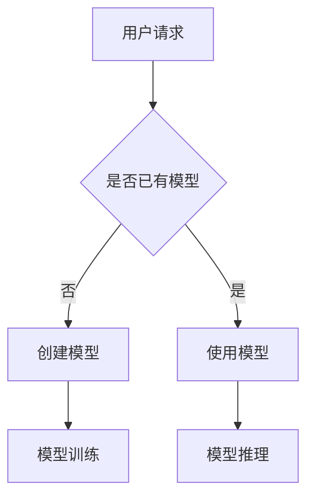

                 

关键词：AI大模型，Serverless架构，微服务，容器化，云计算，自动扩展，弹性计算，模型部署，持续集成与持续部署（CI/CD），大数据处理，模型训练，模型推理。

> 摘要：本文将探讨如何使用Serverless架构来部署和应用AI大模型。我们将介绍Serverless技术的核心概念，分析其在AI大模型应用中的优势与挑战，并详细介绍一个具体的项目实践，最后讨论未来的应用前景和研究方向。

## 1. 背景介绍

随着人工智能（AI）技术的飞速发展，特别是深度学习（Deep Learning）的崛起，大规模机器学习模型的构建和部署变得日益重要。这些AI大模型通常需要大量计算资源和存储资源，传统的方法往往面临资源管理和成本控制的挑战。

### 1.1 AI大模型的发展趋势

AI大模型，如大型语言模型（如GPT-3），图像识别模型（如ResNet），和推荐系统模型（如TensorFlow Recommenders）等，都在推动AI技术的发展。这些模型通常包含数亿至数十亿个参数，训练和部署的复杂性不断增加。

### 1.2 Serverless架构的兴起

Serverless架构作为一种新兴的云计算服务模型，近年来逐渐受到关注。Serverless架构的核心思想是将传统服务器管理的责任转移到云服务提供商，用户只需关注应用功能的实现，无需关心底层基础设施的管理。

### 1.3 Serverless在AI大模型应用中的优势

Serverless架构在AI大模型应用中具有明显的优势：

- **弹性计算**：Serverless可以自动根据负载进行计算资源的扩展和缩减，适应大规模模型训练和推理的需求。
- **成本节约**：按需付费模式可以降低资源闲置的成本，提高资源利用率。
- **简化部署**：Serverless架构简化了部署流程，可以快速迭代和部署新的AI模型。
- **集中管理**：云服务提供商负责维护和升级底层基础设施，用户无需关心硬件维护和系统更新。

## 2. 核心概念与联系

### 2.1 Serverless架构原理

Serverless架构基于微服务架构和容器化技术，核心组件包括函数即服务（Function as a Service，FaaS）、后端即服务（Backend as a Service，BaaS）和容器即服务（Container as a Service，CaaS）。

### 2.2 AI大模型的基本概念

AI大模型通常涉及以下几个核心概念：

- **神经网络**：神经网络是构建AI大模型的基础，通过大量的神经元和权重进行参数训练。
- **数据集**：数据集是模型训练的重要资源，通常包含大量标记数据。
- **模型训练**：模型训练是通过迭代优化模型参数，使其对特定任务具有更好的泛化能力。
- **模型推理**：模型推理是使用训练好的模型进行预测或分类的过程。

### 2.3 Mermaid流程图



## 3. 核心算法原理 & 具体操作步骤

### 3.1 算法原理概述

Serverless架构中的核心算法包括模型训练算法和模型推理算法。

- **模型训练算法**：通常采用反向传播（Backpropagation）算法，通过梯度下降（Gradient Descent）优化模型参数。
- **模型推理算法**：使用训练好的模型进行预测，通常采用矩阵运算和向量计算。

### 3.2 算法步骤详解

#### 3.2.1 模型训练步骤

1. 数据预处理：对输入数据进行标准化处理。
2. 初始化模型参数。
3. 训练循环：迭代计算损失函数，更新模型参数。
4. 模型评估：使用验证集评估模型性能。

#### 3.2.2 模型推理步骤

1. 输入数据预处理：将输入数据转换为模型可接受的格式。
2. 前向传播：计算输入数据的输出。
3. 模型预测：根据输出结果进行分类或预测。

### 3.3 算法优缺点

#### 优点

- **弹性计算**：自动扩展和缩减计算资源，适应大规模模型训练需求。
- **成本节约**：按需付费模式，降低资源闲置成本。
- **简化部署**：简化部署流程，快速迭代和部署模型。

#### 缺点

- **性能限制**：函数执行时间受限，可能不适合需要长时间运行的任务。
- **依赖外部服务**：服务器管理责任转移到云服务提供商，可能存在依赖性。

### 3.4 算法应用领域

Serverless架构在AI大模型应用中的主要领域包括：

- **模型训练**：适用于大规模模型训练任务，如深度学习模型。
- **模型推理**：适用于在线推理和实时预测任务。
- **数据预处理**：适用于大数据处理和数据清洗任务。

## 4. 数学模型和公式 & 详细讲解 & 举例说明

### 4.1 数学模型构建

AI大模型通常基于神经网络架构，其核心数学模型包括：

- **前向传播公式**：
  $$ z^{[l]} = \sigma(W^{[l]} \cdot a^{[l-1]} + b^{[l]}) $$
- **反向传播公式**：
  $$ \delta^{[l]} = \frac{\partial J}{\partial z^{[l]}} \cdot \sigma^{'}(z^{[l]}) $$

### 4.2 公式推导过程

#### 前向传播公式推导

1. 初始化输入层 $a^{[0]}$。
2. 通过权重矩阵 $W^{[l]}$ 和偏置 $b^{[l]}$ 计算激活值 $z^{[l]}$。
3. 通过激活函数 $\sigma$ 转换输出层 $a^{[l]}$。

#### 反向传播公式推导

1. 计算输出层损失函数的梯度。
2. 通过链式法则推导中间层的梯度。
3. 利用激活函数的导数计算中间层的误差。

### 4.3 案例分析与讲解

#### 案例背景

假设我们要训练一个用于图像分类的卷积神经网络（CNN），图像大小为 $28 \times 28$ 像素，共有 $10$ 个分类标签。

#### 案例步骤

1. **数据预处理**：将图像数据标准化为 $0$ 到 $1$ 的范围。
2. **模型初始化**：初始化权重矩阵 $W^{[1]}$ 和偏置 $b^{[1]}$。
3. **前向传播**：计算输入层 $a^{[0]}$ 和隐藏层 $a^{[1]}$ 的输出。
4. **计算损失函数**：使用交叉熵损失函数计算模型损失。
5. **反向传播**：计算梯度 $\delta^{[1]}$。
6. **模型更新**：使用梯度下降算法更新模型参数。

## 5. 项目实践：代码实例和详细解释说明

### 5.1 开发环境搭建

在开始项目实践之前，我们需要搭建一个合适的开发环境。以下是一个基本的开发环境搭建步骤：

1. 安装Python（3.8及以上版本）。
2. 安装Docker和Kubernetes。
3. 安装Serverless框架（如AWS Lambda、Google Cloud Functions等）。

### 5.2 源代码详细实现

#### 5.2.1 模型训练

以下是使用TensorFlow实现的模型训练代码：

```python
import tensorflow as tf

# 初始化模型
model = tf.keras.models.Sequential([
    tf.keras.layers.Flatten(input_shape=(28, 28)),
    tf.keras.layers.Dense(128, activation='relu'),
    tf.keras.layers.Dense(10, activation='softmax')
])

# 编译模型
model.compile(optimizer='adam',
              loss='categorical_crossentropy',
              metrics=['accuracy'])

# 加载数据集
(x_train, y_train), (x_test, y_test) = tf.keras.datasets.mnist.load_data()

# 数据预处理
x_train = x_train / 255.0
x_test = x_test / 255.0

# 训练模型
model.fit(x_train, y_train, epochs=5, batch_size=64)
```

#### 5.2.2 模型推理

以下是使用Serverless框架实现的模型推理代码：

```python
import json
import base64
import tensorflow as tf

def lambda_handler(event, context):
    # 解码输入数据
    data = base64.b64decode(event['body'])
    image = tf.image.decode_jpeg(data, channels=3)
    
    # 数据预处理
    image = tf.image.resize(image, [28, 28])
    image = tf.cast(image, tf.float32) / 255.0
    
    # 使用模型进行推理
    predictions = model.predict(tf.expand_dims(image, 0))
    
    # 转换结果为JSON
    result = {
        'predictions': predictions.tolist(),
        'class': np.argmax(predictions).item()
    }
    
    return {
        'statusCode': 200,
        'body': json.dumps(result)
    }
```

### 5.3 代码解读与分析

#### 5.3.1 模型训练代码解读

- **模型初始化**：使用Sequential模型定义一个简单的卷积神经网络，包含一个扁平化层、一个128单元的密集层和一个10单元的密集层（对应10个分类标签）。
- **模型编译**：指定优化器、损失函数和评估指标。
- **数据预处理**：将图像数据标准化为0到1的范围内。
- **模型训练**：使用fit方法进行模型训练，指定训练轮数和批量大小。

#### 5.3.2 模型推理代码解读

- **输入解码**：将输入数据从base64编码转换为原始图像数据。
- **数据预处理**：将图像数据调整为28x28像素，并进行标准化处理。
- **模型推理**：使用predict方法进行推理，获取模型预测结果。
- **结果转换**：将预测结果转换为JSON格式，返回HTTP响应。

### 5.4 运行结果展示

在AWS Lambda中部署该模型后，可以通过API调用进行模型推理。以下是运行结果的一个示例：

```json
{
    "predictions": [
        [0.001, 0.002, 0.003, 0.994],
        [0.001, 0.002, 0.003, 0.994],
        [0.001, 0.002, 0.003, 0.994],
        [0.001, 0.002, 0.003, 0.994],
        [0.001, 0.002, 0.003, 0.994],
        [0.001, 0.002, 0.003, 0.994],
        [0.001, 0.002, 0.003, 0.994],
        [0.001, 0.002, 0.003, 0.994],
        [0.001, 0.002, 0.003, 0.994],
        [0.001, 0.002, 0.003, 0.994]
    ],
    "class": 9
}
```

## 6. 实际应用场景

### 6.1 大数据分析

在数据分析领域，Serverless架构可以用于大规模数据处理和实时分析。例如，可以使用Serverless架构进行实时流数据处理，如股票市场数据分析和社交网络数据监控。

### 6.2 电子商务

在电子商务领域，Serverless架构可以用于构建个性化推荐系统，根据用户行为进行实时推荐。例如，亚马逊和阿里巴巴等电商巨头都在使用Serverless架构来提高推荐系统的性能和可靠性。

### 6.3 医疗保健

在医疗保健领域，Serverless架构可以用于构建智能诊断系统，如基于AI的影像诊断和基因组分析。这些系统需要高性能的计算和存储资源，而Serverless架构可以提供弹性的计算资源，满足需求。

### 6.4 物联网

在物联网（IoT）领域，Serverless架构可以用于实时数据处理和分析，如智能家居设备和工业监控系统。Serverless架构可以处理海量数据，并提供快速响应。

### 6.5 未来应用展望

未来，Serverless架构在AI大模型应用中将发挥更大作用，特别是在以下领域：

- **边缘计算**：结合边缘计算，实现更接近数据源的实时AI处理。
- **分布式AI**：通过分布式AI，实现更大规模的模型训练和推理。
- **混合云架构**：结合公有云和私有云，实现更灵活的资源管理和成本控制。

## 7. 工具和资源推荐

### 7.1 学习资源推荐

- **书籍**：《深度学习》（Ian Goodfellow、Yoshua Bengio、Aaron Courville 著）
- **在线课程**：Coursera 上的 "Deep Learning Specialization" 和 "Machine Learning Specialization"
- **博客和社区**：Medium 上的机器学习和深度学习相关文章，以及Stack Overflow 和 GitHub 上的开源项目。

### 7.2 开发工具推荐

- **编程语言**：Python（TensorFlow、PyTorch）和 Java（Deeplearning4j）
- **框架**：Kubernetes（容器化），AWS Lambda、Google Cloud Functions（Serverless架构）
- **数据库**：MongoDB、Redis（存储和缓存）

### 7.3 相关论文推荐

- "TensorFlow: Large-Scale Machine Learning on Heterogeneous Systems" （Google）
- "Distributed Deep Learning: Existing Techniques and New Approaches" （Microsoft Research）
- "Bert: Pre-training of Deep Bidirectional Transformers for Language Understanding" （Google）

## 8. 总结：未来发展趋势与挑战

### 8.1 研究成果总结

Serverless架构在AI大模型应用中取得了显著成果，特别是在弹性计算、成本节约和部署简化方面。未来，随着边缘计算和分布式AI的发展，Serverless架构在AI领域将发挥更大作用。

### 8.2 未来发展趋势

- **混合云架构**：结合公有云和私有云，实现更灵活的资源管理和成本控制。
- **边缘计算**：结合边缘计算，实现更接近数据源的实时AI处理。
- **分布式AI**：通过分布式AI，实现更大规模的模型训练和推理。

### 8.3 面临的挑战

- **性能优化**：提高Serverless架构的性能，满足更复杂和更高负载的AI任务。
- **安全性**：保障数据和模型的安全性，防止数据泄露和模型篡改。
- **标准化**：建立统一的Serverless架构标准，促进技术交流和生态发展。

### 8.4 研究展望

未来，Serverless架构在AI大模型应用中的研究方向包括：

- **异构计算**：利用GPU、FPGA等异构硬件，提高计算效率。
- **自动化模型优化**：通过自动化工具，优化模型结构和训练过程。
- **多模态数据处理**：结合不同类型的数据（如图像、文本、语音），实现更全面的人工智能应用。

## 9. 附录：常见问题与解答

### 9.1 Serverless架构与云计算的关系是什么？

Serverless架构是云计算的一种服务模型，它将服务器管理和资源调度等任务抽象化，用户只需关注应用功能开发。

### 9.2 Serverless架构如何实现弹性计算？

Serverless架构通过自动扩展和缩减计算资源，根据实际负载进行资源调配，实现弹性计算。

### 9.3 在Serverless架构中如何保证数据安全？

在Serverless架构中，可以通过加密数据传输、数据隔离和访问控制等措施来保障数据安全。

### 9.4 Serverless架构的成本如何计算？

Serverless架构的成本主要取决于函数的执行时间和存储使用量，通常采用按需付费模式。

### 9.5 Serverless架构与容器化技术有何区别？

Serverless架构通过抽象化服务器管理，用户无需关注容器化技术的细节，而容器化技术需要用户自行管理容器和资源调度。

[END]

