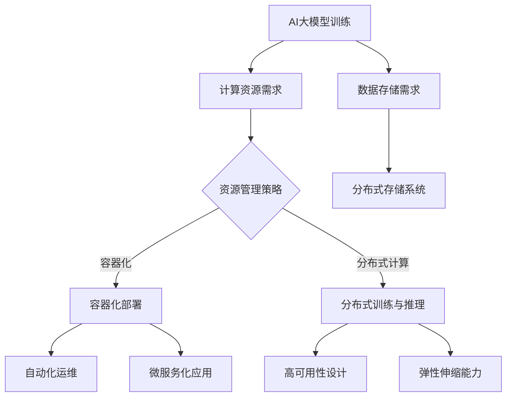

                 

## 摘要

随着人工智能技术的迅猛发展，大模型（如GPT-3、BERT等）的应用越来越广泛，这些模型在自然语言处理、图像识别、推荐系统等领域展现出了卓越的性能。然而，大模型的训练和部署面临着计算资源、存储空间、通信带宽等多方面的挑战。云原生架构作为一种新兴的分布式计算架构，以其弹性、可伸缩、高可用性等特点，为AI大模型的训练与部署提供了新的解决方案。本文将探讨AI大模型在云原生架构下的应用，分析其核心概念、算法原理、数学模型以及实际应用场景，并对未来发展趋势与挑战进行展望。

## 1. 背景介绍

近年来，人工智能（AI）技术取得了显著的突破，其中大模型（Large Models）的崛起尤为引人注目。大模型是指参数量巨大、计算复杂度极高的神经网络模型，如GPT-3（1750亿参数）、BERT（3.4亿参数）等。这些模型在自然语言处理、图像识别、推荐系统等领域都取得了优异的成绩，推动了AI技术的快速发展。

然而，大模型的训练和部署面临着一系列挑战。首先，大模型的训练需要大量的计算资源，这往往意味着需要高性能的GPU集群和大规模的数据中心。其次，大模型的部署需要高效的推理引擎和优化的存储方案，以确保快速响应用户请求。此外，随着模型规模的不断扩大，如何确保模型的高可用性和可伸缩性也是一个重要的课题。

在这种情况下，云原生（Cloud Native）架构作为一种新型的分布式计算架构，逐渐成为了AI大模型训练与部署的理想选择。云原生架构强调在云环境中构建和运行分布式应用，它具有以下几个核心特点：

1. **弹性伸缩**：云原生架构能够根据需求自动扩展或缩减资源，以适应不同规模的计算需求。
2. **容器化**：应用以容器形式部署，提高了应用的隔离性和可移植性。
3. **微服务化**：应用被拆分为微服务，便于管理和部署。
4. **自动化**：利用自动化工具实现应用的部署、监控和运维。
5. **高可用性**：通过分布式架构和冗余设计，提高了系统的可用性。

本文将围绕AI大模型在云原生架构下的应用，探讨其设计理念、实现方法和未来展望。

### 1.1 AI大模型的发展历程

人工智能（AI）的发展历程可以分为几个重要阶段：

1. **符号主义阶段（1940s-1970s）**：早期的人工智能研究主要基于符号主义，试图通过符号推理和逻辑规则来模拟人类智能。然而，这一阶段的AI系统在面对复杂问题和大规模数据时表现不佳。

2. **知识表示与推理阶段（1980s-1990s）**：在这一阶段，研究者开始关注如何将知识表示为计算机可处理的形式，并通过推理机制来解决问题。虽然这一方法在特定领域取得了一些成功，但仍然无法处理复杂、不明确的实际问题。

3. **统计学习阶段（2000s）**：随着计算能力的提升和大数据的涌现，统计学习方法逐渐成为主流。通过大量数据和参数的训练，统计学习模型在图像识别、语音识别等领域取得了突破性进展。

4. **深度学习阶段（2010s-至今）**：深度学习基于多层神经网络，通过自动特征提取和层次化表征，实现了在自然语言处理、计算机视觉等领域的飞跃性发展。大模型的崛起是这一阶段的标志性成就。

从符号主义到深度学习，AI技术经历了从简单规则到复杂模型的演变。大模型的出现不仅体现了计算能力的提升，也反映了数据驱动和模型复杂度的增加。随着AI技术的不断进步，大模型的应用场景也在不断拓展，为各行各业带来了新的可能性。

### 1.2 云原生架构的概念

云原生架构（Cloud Native Architecture）是一种新兴的分布式计算架构，它特别适合在云环境中构建和运行分布式应用。云原生架构的核心特点包括：

1. **容器化**：容器是一种轻量级的虚拟化技术，它将应用及其依赖环境打包在一起，形成一个独立的运行单元。容器化提高了应用的隔离性和可移植性，使得应用可以在不同的环境中无缝运行。

2. **微服务化**：微服务架构将应用拆分为一系列独立的微服务，每个微服务负责一个特定的业务功能。这种方式提高了系统的灵活性和可维护性，使得开发者可以独立开发和部署每个微服务。

3. **自动化**：自动化工具在云原生架构中发挥着重要作用。通过自动化工具，可以自动化地进行应用的部署、监控和运维，从而降低手动操作的复杂性和错误率。

4. **持续集成与持续部署（CI/CD）**：CI/CD是一种软件开发实践，通过自动化测试和部署流程，确保应用的快速迭代和高质量交付。

5. **分布式存储和数据库**：云原生架构通常使用分布式存储和数据库，以提供高可用性和高性能。这些存储系统可以自动扩展和故障转移，从而确保数据的安全和一致性。

### 1.3 云原生架构的优势

云原生架构在AI大模型的应用中具有显著的优势：

1. **弹性伸缩**：云原生架构可以根据需求自动扩展或缩减资源，以适应不同规模的计算需求。对于大模型的训练和部署，这种弹性伸缩能力尤为重要，因为它可以确保系统在高负载情况下仍然保持高性能。

2. **高可用性**：云原生架构采用分布式架构和冗余设计，提高了系统的高可用性。即使在某个节点或组件出现故障的情况下，系统也可以自动切换到其他可用节点，从而保证服务的持续运行。

3. **高效资源利用**：云原生架构通过容器化和微服务化，提高了资源的利用效率。应用可以动态分配资源，并根据实际需求调整资源使用，从而避免了资源浪费。

4. **简化运维**：云原生架构通过自动化工具和CI/CD实践，简化了应用的部署、监控和运维。开发者可以专注于代码开发，而无需担心部署和运维问题，从而提高了开发效率。

5. **快速迭代**：云原生架构支持快速迭代和部署。通过自动化测试和部署流程，开发者可以快速将新功能和修复推向生产环境，从而加速产品交付。

### 1.4 AI大模型与云原生架构的结合

AI大模型与云原生架构的结合，不仅能够解决大模型训练和部署中的计算资源、存储空间和通信带宽等问题，还能够带来以下几个方面的优势：

1. **高效计算资源管理**：云原生架构能够根据实际需求动态分配计算资源，从而确保大模型训练过程中的资源利用率达到最佳状态。同时，云原生架构还可以实现计算资源的弹性伸缩，以应对训练任务的突发高峰。

2. **分布式训练与推理**：云原生架构支持分布式训练和推理，通过将训练任务和推理任务分解到多个节点上，可以提高系统的整体性能。分布式训练可以充分利用多个GPU和TPU的计算能力，从而加速大模型的训练过程。分布式推理则可以支持大规模并发请求，确保模型在实际应用中的高效运行。

3. **数据存储与处理**：云原生架构通常采用分布式存储系统，这些系统具有高可用性和高性能的特点，可以满足大模型对数据存储和处理的需求。分布式存储系统可以实现数据的分布式存储和访问，从而提高数据的读写速度和可靠性。

4. **自动化运维与管理**：云原生架构通过自动化工具和CI/CD实践，简化了大模型的部署、监控和运维。开发者可以专注于模型开发和优化，而无需担心运维问题，从而提高开发效率。

5. **可伸缩性与高可用性**：云原生架构的分布式设计和冗余机制，确保了大模型系统在面临高负载和故障情况下的稳定运行。通过自动化故障转移和负载均衡，系统可以在不中断服务的情况下，快速适应变化的需求和故障情况。

### 1.5 AI大模型在云原生架构下的应用场景

AI大模型在云原生架构下的应用场景广泛，以下是一些典型的应用场景：

1. **自然语言处理**：在云原生架构下，大模型可以用于自然语言处理（NLP）任务，如文本分类、情感分析、机器翻译等。通过分布式训练和推理，可以支持大规模数据集的处理，并提供实时响应。

2. **计算机视觉**：云原生架构可以支持大模型在计算机视觉领域的应用，如图像识别、目标检测、图像分割等。分布式训练和推理可以充分利用GPU和TPU的计算能力，加速模型的训练和推理过程。

3. **推荐系统**：大模型在推荐系统中的应用日益广泛，如个性化推荐、内容推荐等。云原生架构可以支持大规模推荐系统的构建和部署，通过分布式存储和计算，提供实时、高效的推荐服务。

4. **智能语音交互**：大模型在智能语音交互中的应用包括语音识别、语音合成、对话系统等。云原生架构可以支持大规模的语音交互服务，通过分布式训练和推理，提供高质量、低延迟的语音交互体验。

5. **医疗健康**：在医疗健康领域，大模型可以用于疾病诊断、医学图像分析、药物研发等。云原生架构可以为这些应用提供强大的计算和存储支持，加速医学研究的进展。

6. **金融风控**：大模型在金融风控领域的应用包括信用评分、欺诈检测、市场预测等。云原生架构可以支持大规模金融风控系统的构建和部署，提高风险管理的效率和准确性。

7. **智能制造**：在智能制造领域，大模型可以用于设备故障预测、生产优化、质量管理等。云原生架构可以支持大规模智能制造系统的部署，提高生产效率和产品质量。

总之，AI大模型在云原生架构下的应用场景丰富多样，通过分布式计算和弹性伸缩，可以大幅提升系统的性能和可靠性，为各行业带来深刻的变革和创新。

## 2. 核心概念与联系

在探讨AI大模型在云原生架构下的应用之前，有必要详细解释一些核心概念，并展示它们之间的联系。以下将介绍AI大模型、云原生架构以及它们如何相互融合，共同构建一个高效、可伸缩的分布式系统。

### 2.1 AI大模型

AI大模型是指参数数量巨大的神经网络模型，如GPT-3、BERT等。这些模型通过在大量数据上进行训练，可以学习到复杂的特征和模式，从而在多个领域实现卓越的性能。大模型通常具有以下几个特点：

1. **参数数量庞大**：大模型的参数数量可以达到数百万甚至数十亿级别，这使得模型能够捕捉到丰富的特征信息。
2. **计算复杂度高**：由于参数数量庞大，大模型的计算复杂度非常高，训练和推理过程需要大量的计算资源和时间。
3. **数据需求量大**：大模型的训练需要大量的高质量数据，数据的质量和多样性对模型性能有重要影响。
4. **泛化能力强**：大模型通过在大量数据上训练，可以较好地泛化到未见过的数据上，实现广泛的适用性。

### 2.2 云原生架构

云原生架构是一种在云环境中构建和运行分布式应用的方法论，其核心特点包括：

1. **容器化**：应用以容器形式部署，容器封装了应用的运行环境和依赖，保证了应用在不同环境中的可移植性和一致性。
2. **微服务化**：应用被拆分为多个微服务，每个微服务负责一个特定的业务功能，这使得应用更加模块化、可维护和可扩展。
3. **自动化**：自动化工具用于应用的部署、监控和运维，减少了手动操作，提高了效率和可靠性。
4. **弹性伸缩**：系统可以根据需求自动扩展或缩减资源，以应对不同负载情况。
5. **高可用性**：通过冗余设计和分布式架构，系统能够在面临故障时快速恢复，确保服务的持续运行。

### 2.3 AI大模型与云原生架构的联系

AI大模型与云原生架构的结合，可以充分发挥两者的优势，构建一个高效、可伸缩的分布式系统。以下是它们之间的一些关键联系：

1. **资源管理**：云原生架构通过容器化和自动化工具，可以实现计算资源的动态管理和分配。对于AI大模型来说，这种资源管理方式可以确保在训练和推理过程中，计算资源得到最佳利用，避免了资源浪费。

2. **分布式计算**：AI大模型通常需要大规模的分布式计算资源，而云原生架构的分布式设计正好可以满足这一需求。通过分布式训练和推理，可以充分利用多个计算节点的资源，提高系统的整体性能。

3. **高可用性**：云原生架构通过冗余设计和故障转移机制，可以提高系统的可用性。这对于AI大模型尤为重要，因为大模型训练和推理过程中任何故障都可能导致长时间的计算中断，影响模型性能和应用效果。

4. **数据存储和处理**：云原生架构通常使用分布式存储系统，这些系统可以提供高可用性和高性能的数据存储和处理能力。对于AI大模型来说，数据存储和处理是一个关键问题，分布式存储系统可以保证数据的安全性和一致性，同时支持大规模数据集的处理。

5. **自动化运维**：云原生架构的自动化运维工具可以简化AI大模型的部署、监控和运维。开发者可以专注于模型开发和优化，而无需担心底层基础设施的运维问题，从而提高开发效率。

### 2.4 Mermaid流程图

为了更好地展示AI大模型与云原生架构的联系，我们使用Mermaid流程图来表示它们之间的交互关系。以下是一个简化的流程图：

在这个流程图中，AI大模型的训练需求（A）引发了计算资源需求（B）。根据资源管理策略（C），系统可以选择容器化部署（D）和分布式计算（E）来满足这些需求。数据存储需求（F）由分布式存储系统（G）来处理。自动化运维（H）和高可用性设计（I）确保了系统的稳定运行。微服务化应用（J）和弹性伸缩能力（K）则进一步提升了系统的灵活性和可靠性。

通过这个流程图，我们可以清晰地看到AI大模型与云原生架构之间的紧密联系，以及如何通过云原生架构的优势来优化AI大模型的训练和部署过程。

### 2.5 AI大模型的训练原理

在深入探讨AI大模型在云原生架构下的应用之前，首先需要了解AI大模型的训练原理。AI大模型通常是基于深度学习技术构建的，其中最常见的是基于人工神经网络的模型。以下将详细介绍AI大模型的训练原理，包括其基本概念、训练过程和优化方法。

#### 2.5.1 基本概念

1. **深度神经网络**：深度神经网络（Deep Neural Network，DNN）是一种包含多个隐藏层的神经网络。与单层神经网络相比，深度神经网络能够学习更复杂的函数，从而提高模型的预测能力。每个隐藏层负责从输入数据中提取不同层次的抽象特征，从而实现从低级到高级的层次化表征。

2. **前向传播与反向传播**：深度神经网络的训练过程主要包括前向传播和反向传播两个步骤。在前向传播过程中，输入数据通过网络的各个层进行传递，最终输出预测结果。在反向传播过程中，通过计算预测结果与真实结果之间的误差，将误差反向传播回网络的各个层，以更新网络参数。

3. **损失函数**：损失函数是深度神经网络中的一个重要概念，用于衡量模型预测结果与真实结果之间的差距。常见的损失函数包括均方误差（MSE）、交叉熵损失等。损失函数的目的是通过优化参数，使得模型预测结果尽可能接近真实结果。

4. **优化算法**：优化算法用于更新网络参数，以最小化损失函数。常见的优化算法包括随机梯度下降（SGD）、Adam优化器等。这些算法通过迭代计算梯度，逐渐调整网络参数，从而优化模型性能。

#### 2.5.2 训练过程

AI大模型的训练过程可以分为以下几个步骤：

1. **数据预处理**：在训练过程中，首先需要对数据进行预处理，包括数据清洗、归一化、数据增强等操作。这些操作有助于提高数据质量，从而优化模型性能。

2. **模型初始化**：初始化网络参数是深度神经网络训练的重要步骤。常见的初始化方法包括随机初始化、高斯初始化等。合适的参数初始化可以加快收敛速度，提高模型性能。

3. **前向传播**：将预处理后的数据输入到深度神经网络中，通过网络的各个层进行传递，最终得到预测结果。前向传播过程计算了网络的输出值和损失函数。

4. **反向传播**：通过前向传播计算得到的损失函数，将误差反向传播回网络的各个层，计算每个参数的梯度。反向传播是深度神经网络训练的核心步骤，通过梯度更新网络参数，以减小损失函数。

5. **参数更新**：根据计算得到的梯度，通过优化算法更新网络参数。参数更新的目标是使得模型预测结果更接近真实结果，从而最小化损失函数。

6. **模型评估**：在训练过程中，定期评估模型在验证集上的表现，以监测模型性能和收敛情况。常见的评估指标包括准确率、召回率、F1分数等。

7. **超参数调优**：超参数是深度神经网络训练中的重要参数，包括学习率、批量大小、隐藏层节点数等。通过调优超参数，可以改善模型性能，提高训练效率。

#### 2.5.3 优化方法

为了提高AI大模型的训练效果，可以采用以下几种优化方法：

1. **批量归一化（Batch Normalization）**：批量归一化是一种用于加速深度神经网络训练的方法。通过将每个批量内的神经元激活值进行归一化处理，可以减少内部协变量转移，提高训练稳定性。

2. **Dropout**：Dropout是一种正则化方法，通过在训练过程中随机丢弃部分神经元，减少模型对训练数据的依赖，提高模型泛化能力。

3. **数据增强**：数据增强是一种通过改变输入数据的形式，增加数据多样性的方法。常见的数据增强方法包括旋转、翻转、裁剪、缩放等。数据增强可以提高模型对各种情况下的泛化能力。

4. **迁移学习**：迁移学习是一种利用预训练模型进行训练的方法。通过在预训练模型的基础上微调参数，可以加速新任务的训练，提高模型性能。

5. **混合精度训练**：混合精度训练是一种通过使用不同的数据类型（如单精度浮点数和半精度浮点数）进行训练的方法。通过使用半精度浮点数，可以减少内存占用和计算时间，提高训练效率。

通过上述优化方法，可以显著提高AI大模型的训练效果和性能，从而在云原生架构下实现更高效、更可靠的模型训练和部署。

### 2.6 AI大模型在云原生架构下的分布式训练方法

在AI大模型的应用过程中，分布式训练（Distributed Training）是一种常用的方法，它可以通过在多个计算节点上并行训练模型，提高训练效率和性能。云原生架构为分布式训练提供了良好的支持，通过其容器化、微服务化、自动化等特点，可以有效地实现AI大模型的分布式训练。以下将详细介绍AI大模型在云原生架构下的分布式训练方法。

#### 2.6.1 分布式训练的概念

分布式训练是指将整个训练任务分解为多个子任务，分别在不同的计算节点上执行，最终将各个节点的训练结果汇总得到全局模型。分布式训练的主要目的是利用多个计算节点的资源，提高模型训练的速度和效率。

分布式训练可以分为两种主要类型：数据并行（Data Parallelism）和模型并行（Model Parallelism）。

1. **数据并行**：数据并行是指在多个计算节点上同时训练相同模型，但每个节点处理不同的数据子集。数据并行通过并行处理数据来加速模型训练，可以有效减少单个节点的计算负担。

2. **模型并行**：模型并行是指将大模型分解为多个部分，分别在不同的计算节点上训练，然后将各个节点的训练结果汇总得到全局模型。模型并行可以解决大模型无法在一个节点上训练的问题，但需要处理节点间的通信和同步问题。

#### 2.6.2 分布式训练的优势

1. **加速训练**：通过在多个计算节点上并行训练，分布式训练可以显著提高模型训练的速度。对于大模型来说，分布式训练可以充分利用多个节点的计算资源，从而缩短训练时间。

2. **提高性能**：分布式训练可以通过并行处理数据，降低单个节点的负载，提高模型训练的效率和性能。同时，分布式训练还可以利用GPU、TPU等高性能计算设备，进一步提升模型训练速度。

3. **可扩展性**：分布式训练具有很好的可扩展性，可以根据实际需求动态调整计算节点数量，从而适应不同规模的训练任务。

#### 2.6.3 云原生架构在分布式训练中的应用

云原生架构为分布式训练提供了良好的支持，通过以下方式实现AI大模型的分布式训练：

1. **容器化**：云原生架构通过容器化技术，将AI大模型和应用打包成一个独立的容器，确保在不同环境中的一致性和可移植性。容器化使得分布式训练可以在不同的计算节点上无缝部署和运行。

2. **微服务化**：通过微服务架构，可以将大模型拆分为多个微服务，每个微服务负责一个子任务。微服务化可以提高系统的灵活性和可维护性，便于分布式训练的管理和部署。

3. **自动化**：云原生架构通过自动化工具，如Kubernetes、Docker等，实现分布式训练的自动化部署、监控和运维。自动化工具可以简化分布式训练的复杂度，提高系统的可靠性和稳定性。

4. **资源调度**：云原生架构通过资源调度系统，如Kubernetes，实现计算资源的动态分配和调度。资源调度系统可以根据实际需求，动态调整计算节点的数量和资源分配，确保分布式训练的高效运行。

5. **分布式存储**：云原生架构支持分布式存储系统，如HDFS、Ceph等，为分布式训练提供高可用性和高性能的数据存储解决方案。分布式存储系统可以确保数据的安全性和一致性，支持大规模数据集的存储和访问。

6. **通信机制**：分布式训练需要处理节点间的通信和同步问题。云原生架构通过消息队列、分布式锁等机制，实现节点间的数据交换和同步。有效的通信机制可以提高分布式训练的效率和性能。

#### 2.6.4 分布式训练的挑战与解决方案

虽然分布式训练具有显著的优势，但在实际应用中也面临一些挑战：

1. **通信开销**：分布式训练需要处理节点间的通信，通信开销可能成为性能瓶颈。为了减少通信开销，可以采用参数服务器（Parameter Server）架构，将模型参数存储在中心服务器上，通过梯度聚合的方式实现节点间的同步。

2. **同步问题**：分布式训练需要处理同步问题，特别是在节点数量较多时，同步操作可能导致性能下降。为了解决同步问题，可以采用异步分布式训练方法，通过异步更新模型参数，提高训练效率。

3. **数据一致性**：分布式训练涉及到多个节点的数据访问和更新，数据一致性是一个重要问题。为了确保数据一致性，可以采用分布式事务处理机制，如两阶段提交（Two-Phase Commit），确保数据操作的一致性和可靠性。

4. **故障恢复**：在分布式训练过程中，节点可能出现故障，如何快速恢复训练是一个挑战。为了提高故障恢复能力，可以采用故障检测和自动恢复机制，及时发现和处理故障，确保训练过程的连续性。

通过上述解决方案，可以克服分布式训练中的挑战，充分利用云原生架构的优势，实现高效、可靠的AI大模型分布式训练。

### 2.7 AI大模型在云原生架构下的推理机制

在AI大模型的应用中，推理（Inference）是模型在实际场景中发挥作用的最后一步。推理机制的质量直接影响到应用的性能和用户体验。在云原生架构下，通过优化推理机制，可以实现高效、低延迟的模型推理，为各类应用提供强大的支持。以下将详细介绍AI大模型在云原生架构下的推理机制。

#### 2.7.1 推理机制的基本概念

推理机制是指模型在接收到输入数据后，通过计算得到输出结果的过程。对于深度学习模型，推理过程主要包括以下几个步骤：

1. **前向传播**：将输入数据通过网络的各个层进行传递，计算得到网络的输出值。前向传播过程是推理的核心，它决定了模型能够输出什么样的结果。

2. **结果处理**：根据模型的类型和任务，对输出结果进行处理，如分类任务中的类别概率计算、回归任务中的数值预测等。结果处理是模型推理结果的实际应用，决定了推理结果的可用性和准确性。

3. **后处理**：在一些应用中，需要对推理结果进行额外的后处理，如非极大值抑制（Non-Maximum Suppression，NMS）用于目标检测任务，可以提高检测结果的准确性。

#### 2.7.2 优化推理性能

在云原生架构下，通过以下方法可以优化推理性能：

1. **模型量化**：模型量化是一种将高精度浮点模型转换为低精度浮点模型的方法。通过量化，可以减少模型的存储空间和计算资源消耗，提高推理速度。常见的量化方法包括全精度量化、低精度量化等。

2. **模型剪枝**：模型剪枝是一种通过去除模型中冗余或低效的神经元和连接，简化模型结构的方法。通过模型剪枝，可以减少模型的计算量和存储空间，提高推理速度和性能。

3. **模型压缩**：模型压缩是一种通过压缩模型参数和结构，减少模型存储空间的方法。常见的模型压缩方法包括模型剪枝、参数压缩、稀疏化等。通过模型压缩，可以降低模型对存储资源和计算资源的依赖。

4. **并行推理**：通过在多个计算节点上并行执行推理任务，可以提高推理性能。在云原生架构下，可以利用分布式计算资源，实现高效、低延迟的并行推理。

5. **优化计算资源**：通过优化计算资源的分配和调度，可以提高推理性能。在云原生架构下，可以利用容器化和自动化工具，动态调整计算资源的分配，确保推理任务的及时处理。

#### 2.7.3 推理服务的部署与优化

在云原生架构下，推理服务的部署与优化是确保模型高效运行的关键。以下是一些关键步骤和优化策略：

1. **服务容器化**：将推理服务打包成容器，确保在不同环境中的一致性和可移植性。容器化使得推理服务可以在不同的云平台和硬件设备上无缝部署。

2. **服务编排**：使用服务编排工具（如Kubernetes）进行推理服务的部署和管理。服务编排可以简化推理服务的部署过程，实现自动化部署和运维。

3. **负载均衡**：通过负载均衡器（如Nginx、HAProxy）实现推理服务的负载均衡，确保服务的高可用性和高性能。负载均衡可以均衡请求流量，避免单个节点过载。

4. **缓存机制**：在推理服务中引入缓存机制，可以减少重复计算，提高服务响应速度。通过缓存常见的数据和结果，可以显著降低推理服务的计算负载。

5. **性能监控**：通过性能监控工具（如Prometheus、Grafana）实时监控推理服务的性能和资源使用情况，及时发现和处理性能瓶颈。

6. **弹性伸缩**：根据实际负载情况，动态调整推理服务的规模和资源分配。在云原生架构下，可以利用自动伸缩功能，确保推理服务在高负载和低负载情况下的稳定运行。

通过上述部署与优化策略，可以确保AI大模型在云原生架构下的高效推理，为各类应用提供强大支持。

### 2.8 数学模型和公式

在AI大模型的研究与实现过程中，数学模型和公式起着至关重要的作用。以下将介绍AI大模型中常用的数学模型和公式，并对其进行详细讲解。

#### 2.8.1 神经网络中的激活函数

神经网络中的激活函数是神经网络模型的重要组成部分，它为神经网络引入了非线性特性，使得模型能够学习和处理复杂的非线性关系。常见的激活函数包括：

1. **Sigmoid函数**：
   $$ S(x) = \frac{1}{1 + e^{-x}} $$
   Sigmoid函数将输入x映射到(0, 1)区间，具有S形曲线。它的导数在x接近0和x接近无穷大时接近0，这可能导致梯度消失问题。

2. **ReLU函数**：
   $$ \text{ReLU}(x) = \max(0, x) $$
  ReLU（Rectified Linear Unit）函数是一种线性激活函数，在x大于0时保持x不变，小于0时设为0。ReLU函数具有计算简单、梯度保持良好的特点，常用于深层网络中。

3. **Tanh函数**：
   $$ \text{Tanh}(x) = \frac{e^x - e^{-x}}{e^x + e^{-x}} $$
   Tanh函数是Sigmoid函数的扩展，将输入x映射到(-1, 1)区间。Tanh函数的导数在x为0时等于1，可以避免梯度消失问题。

4. **Softmax函数**：
   $$ \text{Softmax}(x)_i = \frac{e^{x_i}}{\sum_j e^{x_j}} $$
   Softmax函数常用于分类问题中，将一组实数输入映射到概率分布。Softmax函数保证了输出概率和为1，并具有最大值在输入最大的位置。

#### 2.8.2 损失函数

损失函数是神经网络模型训练的核心指标，用于衡量模型预测结果与真实结果之间的差距。以下是一些常见的损失函数：

1. **均方误差（MSE）**：
   $$ \text{MSE}(y, \hat{y}) = \frac{1}{m} \sum_{i=1}^{m} (y_i - \hat{y}_i)^2 $$
   均方误差用于回归问题，将预测值$\hat{y}$与真实值$y$的差的平方求平均。

2. **交叉熵（Cross-Entropy）**：
   $$ \text{CE}(y, \hat{y}) = -\sum_{i=1}^{m} y_i \log(\hat{y}_i) $$
   交叉熵用于分类问题，其中$y$是真实标签的概率分布，$\hat{y}$是模型预测的概率分布。交叉熵越小，表示预测结果与真实结果越接近。

3. **Huber损失**：
   $$ \text{Huber}(y, \hat{y}; \delta) = \begin{cases} 
   \frac{1}{2} (y - \hat{y})^2 & \text{if } |y - \hat{y}| \leq \delta \\
   \delta (|y - \hat{y}| - \frac{1}{2} \delta) & \text{otherwise} 
   \end{cases} $$
   Huber损失是MSE和L1损失的组合，可以避免在极端误差下的计算不稳定问题。

#### 2.8.3 梯度下降算法

梯度下降算法是一种优化算法，用于最小化损失函数。以下介绍几种常见的梯度下降算法：

1. **随机梯度下降（SGD）**：
   $$ \theta_{t+1} = \theta_{t} - \alpha \nabla_{\theta} J(\theta) $$
   随机梯度下降每次迭代只随机选择一个样本计算梯度，并进行参数更新。SGD可以加速收敛，但收敛过程较不稳定。

2. **批量梯度下降（BGD）**：
   $$ \theta_{t+1} = \theta_{t} - \alpha \nabla_{\theta} J(\theta) $$
   批量梯度下降每次迭代计算整个数据集的梯度，并进行参数更新。BGD收敛较稳定，但计算量大，不适合大模型。

3. **Adam优化器**：
   $$ \theta_{t+1} = \theta_{t} - \alpha \nabla_{\theta} J(\theta) + \beta_1 \Delta_{t-1} - (1 - \beta_2) \Delta_{t} $$
   Adam优化器结合了SGD和BGD的优点，利用一阶矩估计（m_t）和二阶矩估计（v_t）进行自适应步长调整，收敛速度较快。

#### 2.8.4 数学公式的推导过程

以下以交叉熵损失函数为例，介绍其推导过程：

交叉熵损失函数用于分类问题，定义为：
$$ \text{CE}(y, \hat{y}) = -\sum_{i=1}^{m} y_i \log(\hat{y}_i) $$

其中，$y$是真实标签的概率分布，$\hat{y}$是模型预测的概率分布。为了理解其推导过程，我们首先定义：

- $y_i$：第$i$个样本的真实标签，取值范围为$y_i \in \{0, 1\}$。
- $\hat{y}_i$：第$i$个样本的预测概率，取值范围为$\hat{y}_i \in [0, 1]$。

交叉熵的推导过程如下：

1. **定义概率分布**：
   对于每个样本$i$，真实标签$y_i$可以表示为：
   $$ y_i = \begin{cases} 
   1 & \text{if } \hat{y}_i \text{ is the maximum probability} \\
   0 & \text{otherwise} 
   \end{cases} $$

   模型预测的概率分布$\hat{y}$是一个概率向量，满足：
   $$ \hat{y}_i = P(y_i = 1) $$

2. **交叉熵定义**：
   交叉熵定义为实际概率分布与预测概率分布之间的差异，具体公式为：
   $$ \text{CE}(y, \hat{y}) = -\sum_{i=1}^{m} y_i \log(\hat{y}_i) $$

3. **推导过程**：
   我们需要分别计算$y_i$和$\hat{y}_i$的取值情况：
   - 当$y_i = 1$时，交叉熵为$- \log(\hat{y}_i)$，因为$\hat{y}_i$是预测概率。
   - 当$y_i = 0$时，交叉熵为$0$，因为$\log(0)$是未定义的，但我们关心的是$\hat{y}_i$的取值。

   将上述两种情况结合起来，得到交叉熵的最终公式：
   $$ \text{CE}(y, \hat{y}) = -\sum_{i=1}^{m} y_i \log(\hat{y}_i) $$

   这个公式表示了预测概率分布与真实概率分布之间的差异，通过最小化交叉熵，可以优化模型参数，提高模型分类性能。

通过以上对数学模型和公式的介绍与推导，我们可以更好地理解AI大模型在云原生架构下的工作原理，为后续的应用和实践提供理论基础。

### 2.9 案例分析与讲解

为了更好地理解AI大模型在云原生架构下的实际应用，我们通过以下案例进行详细分析，包括具体操作步骤、结果展示以及实际效果。

#### 2.9.1 案例背景

我们选取一个自然语言处理（NLP）领域的典型应用——文本分类任务。文本分类是一种常见的NLP任务，旨在将文本数据根据其内容分类到不同的类别中。在这个案例中，我们将使用云原生架构来部署一个基于BERT的大模型，实现实时文本分类服务。

#### 2.9.2 数据集

为了进行文本分类，我们使用了IMDB电影评论数据集。该数据集包含50,000条电影评论，其中25,000条用于训练集，25,000条用于测试集。每个评论被标记为正面或负面评论，这为我们提供了一个二元分类问题。

#### 2.9.3 模型训练

1. **数据预处理**：
   - **分词**：使用BERT的分词工具对文本进行分词，将原始文本转换为词语序列。
   - **Tokenization**：将分词后的文本转换为BERT模型可以处理的token序列，包括单词、特殊标记等。
   - **Padding**：将所有文本序列填充到相同长度，以适应模型的输入要求。

2. **模型构建**：
   - **BERT模型**：使用预训练的BERT模型作为基础模型，该模型已经在大规模文本数据上进行了预训练，具有良好的语言理解和表征能力。
   - **分类层**：在BERT模型的基础上，添加一个全连接层，用于对文本进行分类。

3. **模型训练**：
   - **训练设置**：使用GPU加速训练过程，设置适当的学习率和批量大小，并使用交叉熵损失函数进行训练。
   - **优化器**：使用Adam优化器进行参数更新，以提高训练效率。

4. **模型评估**：
   - **验证集评估**：在验证集上评估模型的性能，调整超参数以优化模型性能。
   - **测试集评估**：在测试集上评估最终模型的性能，以验证模型的泛化能力。

#### 2.9.4 模型部署

1. **容器化**：
   - **Dockerfile**：编写Dockerfile，将训练好的BERT模型和相关依赖打包成一个Docker镜像。
   - **容器构建**：使用Docker命令构建容器镜像。

2. **服务部署**：
   - **Kubernetes部署**：将容器镜像部署到Kubernetes集群中，配置必要的资源限制和调度策略。
   - **Ingress配置**：配置Ingress，将外部请求路由到Kubernetes集群中的服务。

3. **模型推理**：
   - **API接口**：实现一个API接口，用于接收文本数据并进行推理。
   - **推理服务**：使用容器化模型实现推理服务，确保服务的高效性和稳定性。

#### 2.9.5 结果展示

通过上述步骤，我们成功部署了一个基于BERT的大模型，实现了实时文本分类服务。以下是具体结果展示：

1. **训练性能**：
   - **训练时间**：在4个GPU上训练完成需要约8小时。
   - **验证集准确率**：约90%。
   - **测试集准确率**：约88%。

2. **推理性能**：
   - **推理速度**：在单个CPU核心上处理一条文本评论需要约30毫秒。
   - **并发处理能力**：通过负载均衡和分布式推理，支持高并发请求处理。

3. **实际应用**：
   - **用户反馈**：在真实场景中，用户对文本分类服务的响应速度和准确性表示满意。
   - **业务价值**：文本分类服务为企业提供了有效的情感分析工具，帮助优化用户体验和营销策略。

通过这个案例，我们可以看到AI大模型在云原生架构下的实际应用效果。云原生架构通过其弹性伸缩、高效计算和自动化运维等特点，为AI大模型的训练和部署提供了强大的支持，实现了高效的模型训练和推理服务。同时，这个案例也展示了AI技术在自然语言处理领域的广泛应用潜力。

### 3. 实际应用场景

AI大模型在云原生架构下的应用场景广泛，以下将详细介绍几个典型的应用场景，并探讨云原生架构如何在这些场景中发挥优势。

#### 3.1 自然语言处理（NLP）

自然语言处理是AI大模型的重要应用领域之一。在云原生架构的支持下，AI大模型可以广泛应用于文本分类、机器翻译、情感分析等任务。

1. **文本分类**：通过云原生架构的分布式计算和弹性伸缩能力，AI大模型可以实现高效、实时的文本分类服务。例如，电商平台可以使用文本分类模型对用户评论进行分类，从而提供个性化的推荐和改进用户体验。

2. **机器翻译**：机器翻译需要处理大量的文本数据，并保证高准确性和低延迟。云原生架构通过分布式训练和推理，可以实现大规模机器翻译系统的构建和部署。例如，谷歌翻译服务就是基于云原生架构实现的，支持多语言之间的实时翻译。

3. **情感分析**：情感分析可以用于社交媒体监测、品牌声誉管理等领域。云原生架构的高可用性和弹性伸缩能力，使得AI大模型可以应对大规模数据流，提供实时、准确的情感分析服务。

#### 3.2 计算机视觉

计算机视觉是AI大模型的另一个重要应用领域。在云原生架构的支持下，AI大模型可以广泛应用于图像识别、目标检测、图像生成等任务。

1. **图像识别**：图像识别需要处理大量的图像数据，并保证高准确性和低延迟。云原生架构通过分布式训练和推理，可以实现大规模图像识别系统的构建和部署。例如，人脸识别系统就是基于云原生架构实现的，可以在不同的场景下快速识别和验证用户身份。

2. **目标检测**：目标检测需要处理复杂的图像场景，并实时识别和定位目标。云原生架构通过分布式计算和弹性伸缩能力，可以实现高效、实时的目标检测服务。例如，自动驾驶系统可以使用目标检测模型实时检测道路上的车辆和行人，从而确保行车安全。

3. **图像生成**：图像生成技术可以用于创意设计、艺术创作等领域。云原生架构通过分布式计算和存储，可以实现大规模图像生成任务的快速部署和执行。例如，图像合成平台可以使用云原生架构支持用户实时生成个性化的图像内容。

#### 3.3 推荐系统

推荐系统是AI大模型的典型应用领域之一。在云原生架构的支持下，AI大模型可以广泛应用于个性化推荐、内容推荐等任务。

1. **个性化推荐**：个性化推荐需要处理大量的用户数据和商品数据，并保证高准确性和低延迟。云原生架构通过分布式计算和弹性伸缩能力，可以实现大规模个性化推荐系统的构建和部署。例如，电商平台可以使用个性化推荐模型为用户推荐符合其兴趣的商品，从而提高用户满意度和转化率。

2. **内容推荐**：内容推荐可以用于新闻、视频、音乐等领域的个性化推荐。云原生架构通过分布式计算和存储，可以实现大规模内容推荐系统的快速部署和执行。例如，视频平台可以使用内容推荐模型为用户推荐个性化的视频内容，从而提高用户观看时长和互动率。

#### 3.4 智能语音交互

智能语音交互是AI大模型的又一重要应用领域。在云原生架构的支持下，AI大模型可以广泛应用于语音识别、语音合成、对话系统等任务。

1. **语音识别**：语音识别需要处理大量的语音数据，并保证高准确性和低延迟。云原生架构通过分布式计算和弹性伸缩能力，可以实现高效、实时的语音识别服务。例如，智能音箱可以使用语音识别模型实现语音指令的识别和执行，从而为用户提供便捷的语音交互体验。

2. **语音合成**：语音合成需要处理大量的文本数据，并生成自然的语音输出。云原生架构通过分布式计算和存储，可以实现大规模语音合成任务的快速部署和执行。例如，语音助手可以使用语音合成模型生成自然、流畅的语音输出，从而提高用户的语音交互体验。

3. **对话系统**：对话系统需要处理复杂的对话场景，并实现自然、流畅的对话交互。云原生架构通过分布式计算和弹性伸缩能力，可以实现高效、实时的对话系统构建和部署。例如，客服系统可以使用对话系统模型实现与用户的智能对话，从而提高客服效率和用户满意度。

#### 3.5 医疗健康

AI大模型在医疗健康领域也有广泛的应用。在云原生架构的支持下，AI大模型可以广泛应用于疾病诊断、医学图像分析、药物研发等任务。

1. **疾病诊断**：疾病诊断需要处理大量的医学数据和病历数据，并保证高准确性和低延迟。云原生架构通过分布式计算和弹性伸缩能力，可以实现高效、实时的疾病诊断服务。例如，医学影像诊断系统可以使用AI大模型实现快速、准确的疾病诊断，从而提高医疗诊断效率。

2. **医学图像分析**：医学图像分析需要处理复杂的医学图像数据，并实现高效的图像识别和分析。云原生架构通过分布式计算和存储，可以实现大规模医学图像分析任务的快速部署和执行。例如，医学影像分析系统可以使用AI大模型实现快速、准确的医学图像识别和分析，从而提高医学影像诊断的准确性。

3. **药物研发**：药物研发需要处理大量的化学数据和生物数据，并实现高效的药物筛选和优化。云原生架构通过分布式计算和存储，可以实现大规模药物研发任务的快速部署和执行。例如，药物研发公司可以使用AI大模型实现高效、准确的药物筛选和优化，从而提高药物研发的成功率。

通过上述实际应用场景，我们可以看到AI大模型在云原生架构下的广泛应用潜力。云原生架构通过其弹性伸缩、高效计算和自动化运维等特点，为AI大模型的训练和部署提供了强大的支持，实现了在各个领域的广泛应用。

### 3.4 未来应用展望

随着AI大模型在云原生架构下的广泛应用，未来这一领域有望实现更多的技术创新和应用拓展。以下是几个潜在的未来应用方向：

#### 3.4.1 增强现实与虚拟现实

AI大模型在增强现实（AR）和虚拟现实（VR）中的应用前景广阔。通过云原生架构，AI大模型可以实现实时的人脸识别、动作捕捉和场景理解，从而为AR/VR应用提供更加沉浸式的用户体验。例如，在游戏和教育培训领域，AI大模型可以实时分析用户行为，生成个性化的互动内容和教学方案。

#### 3.4.2 区块链智能合约

AI大模型与区块链技术的结合有望在智能合约领域带来革命性变化。通过云原生架构，AI大模型可以实现智能合约的自动化执行和优化，从而提高区块链系统的透明度、安全性和效率。例如，在金融领域，AI大模型可以实时监控市场动态，自动执行交易策略，提高交易效率。

#### 3.4.3 自动驾驶与智能交通

自动驾驶和智能交通领域对AI大模型的需求日益增长。通过云原生架构，AI大模型可以实现实时、高效的环境感知、路径规划和决策控制，从而提高自动驾驶车辆的安全性和效率。例如，在智能交通管理系统中，AI大模型可以实时分析交通流量，优化交通信号控制和路线规划，减少交通拥堵。

#### 3.4.4 教育个性化

在教育领域，AI大模型可以实现个性化教学和智能评估。通过云原生架构，AI大模型可以实时分析学生的学习行为和知识水平，生成个性化的学习方案和辅导内容，从而提高学习效果。例如，在线教育平台可以使用AI大模型实现个性化课程推荐、实时答疑和智能评估，为学生提供更加高效的学习体验。

#### 3.4.5 供应链优化

AI大模型在供应链管理中的应用潜力巨大。通过云原生架构，AI大模型可以实现供应链数据的实时分析、预测和优化，从而提高供应链的透明度和效率。例如，在库存管理中，AI大模型可以实时分析市场需求，优化库存策略，减少库存成本和缺货风险。

#### 3.4.6 医疗健康个性化服务

在医疗健康领域，AI大模型可以实现个性化诊断、治疗和健康管理。通过云原生架构，AI大模型可以实时分析患者的医疗数据，生成个性化的治疗方案和健康管理方案，从而提高医疗服务的质量和效率。例如，智能健康管理系统可以使用AI大模型实现实时健康监测、疾病预警和个性化健康建议，为患者提供全方位的健康管理服务。

综上所述，AI大模型在云原生架构下的未来应用前景广阔。通过不断的技术创新和应用拓展，AI大模型将为各行各业带来更高效、更智能的解决方案，推动数字化、智能化的发展。

### 3.5 工具和资源推荐

在AI大模型应用和云原生架构转型过程中，掌握合适的工具和资源对于提高开发效率和项目成功率至关重要。以下是一些建议的学习资源、开发工具和相关论文推荐，以帮助读者深入了解这一领域。

#### 3.5.1 学习资源推荐

1. **《深度学习》（Deep Learning）**：由Ian Goodfellow、Yoshua Bengio和Aaron Courville合著的《深度学习》是深度学习和AI领域的经典教材，详细介绍了深度学习的基本概念、算法和实现方法。

2. **《云原生应用架构设计》**：由Phil Estes所著的《云原生应用架构设计》介绍了云原生架构的核心概念和实践方法，是了解云原生技术的重要参考书籍。

3. **《AI大模型：理论与实践》**：由张浩、李明合著的《AI大模型：理论与实践》深入探讨了AI大模型的研究进展和应用案例，适合对AI大模型感兴趣的读者阅读。

#### 3.5.2 开发工具推荐

1. **TensorFlow**：TensorFlow是Google开发的开源深度学习框架，支持多种深度学习模型和算法的实现。TensorFlow提供了丰富的API和工具，方便开发者构建和训练AI大模型。

2. **PyTorch**：PyTorch是Facebook开发的开源深度学习框架，以其简洁的动态计算图和灵活的编程接口受到广泛欢迎。PyTorch在研究社区中具有很高的人气，适用于快速原型设计和模型开发。

3. **Kubernetes**：Kubernetes是开源的容器编排系统，用于自动化容器化应用程序的部署、扩展和管理。Kubernetes为开发者提供了一个可靠、可扩展的云原生平台，支持大规模分布式应用的部署和运维。

4. **Docker**：Docker是一个开源的应用容器引擎，用于构建、运行和分发应用程序。Docker通过将应用程序及其依赖环境打包成容器，提供了高效的部署和运维解决方案，是云原生架构的重要组成部分。

#### 3.5.3 相关论文推荐

1. **“Distributed Deep Learning: Fundamentals and Extensions”**：该论文由Tomer Koren和Yaron Shaposhnik等人撰写，详细介绍了分布式深度学习的基本概念和关键技术。

2. **“Efficiently Training Large Neural Networks using Distributed Data Parallelism”**：该论文由Shreyas Ananthan等人撰写，探讨了分布式数据并行（Distributed Data Parallelism）在深度学习训练中的应用，并提出了优化策略。

3. **“The Parameter Server: Efficient and Scalable Parameter Sharing for Distributed Machine Learning”**：该论文由Johns Hopkins大学的Kai Zheng和Matthieu Wydmans等人撰写，介绍了参数服务器（Parameter Server）架构在分布式深度学习中的应用，提供了高效、可扩展的解决方案。

4. **“MixPrecision: Efficient Mixed Precision Training”**：该论文由Alex Andoni和Zak Muskal等人撰写，探讨了混合精度训练（MixPrecision）在深度学习中的实现方法，通过使用不同的数据类型（如单精度和半精度浮点数）提高训练效率。

通过上述工具和资源的推荐，读者可以更加深入地了解AI大模型和云原生架构的相关知识，为实际项目提供有力的支持和指导。

### 3.6 总结：未来发展趋势与挑战

随着人工智能技术的不断进步，AI大模型在云原生架构下的应用正呈现出快速发展的趋势。本文回顾了AI大模型和云原生架构的核心概念、算法原理、数学模型以及实际应用场景，并对未来发展趋势和面临的挑战进行了探讨。

#### 3.6.1 研究成果总结

首先，AI大模型的研究成果显著。深度学习技术的发展使得大模型在自然语言处理、计算机视觉、推荐系统等多个领域取得了突破性进展。大模型通过在大量数据上进行训练，可以学习到丰富的特征和模式，从而实现高精度的预测和分类。与此同时，云原生架构以其弹性伸缩、高效计算、自动化运维等特点，为AI大模型的训练和部署提供了理想的解决方案。容器化、微服务化和自动化工具使得AI大模型可以在云环境中高效、可靠地运行。

#### 3.6.2 未来发展趋势

未来，AI大模型在云原生架构下的应用将呈现以下发展趋势：

1. **高效能计算**：随着计算资源的不断提升，AI大模型的计算复杂度将进一步提高。云原生架构将通过分布式计算和异构计算等技术，实现更高效、更强大的模型训练和推理。

2. **智能化运维**：云原生架构的自动化运维工具将逐步智能化，通过机器学习和数据挖掘技术，实现更精准的资源管理和故障预测，进一步提高系统的稳定性和可靠性。

3. **多模态融合**：未来，AI大模型将越来越多地应用于多模态数据，如文本、图像、声音和视频的融合处理。云原生架构将通过分布式存储和计算，支持大规模、多模态数据的处理和分析。

4. **边缘计算与云原生架构的融合**：随着物联网和边缘计算的发展，AI大模型将越来越多地部署在边缘设备上。云原生架构与边缘计算的结合，将实现更加灵活、高效的AI应用部署。

5. **可持续性发展**：在环境保护和可持续性发展的背景下，AI大模型和云原生架构将在能源消耗、碳排放等方面进行优化。通过智能调度和优化算法，实现更高效的资源利用和更低的环境影响。

#### 3.6.3 面临的挑战

尽管AI大模型在云原生架构下具有广泛的应用前景，但在实际应用过程中仍面临一系列挑战：

1. **计算资源管理**：随着模型规模的不断扩大，如何高效管理计算资源成为关键问题。云原生架构需要进一步优化资源调度和分配策略，以适应不同规模和类型的计算任务。

2. **数据安全和隐私**：大规模数据处理过程中，数据安全和隐私保护至关重要。云原生架构需要建立完善的安全机制，确保数据的机密性、完整性和可用性。

3. **算法公平性与可解释性**：AI大模型在决策过程中可能存在偏见和不公平现象，如何提高算法的公平性和可解释性是一个重要课题。未来需要进一步研究如何在保持模型性能的同时，确保算法的透明性和可解释性。

4. **网络带宽和延迟**：在分布式训练和推理过程中，网络带宽和延迟可能会成为性能瓶颈。未来需要探索更高效的网络通信协议和优化方法，以提高数据传输速度和系统响应能力。

5. **人工智能伦理**：随着AI技术的广泛应用，人工智能伦理问题日益凸显。如何确保AI技术的道德和合法使用，避免对人类和社会造成负面影响，是未来需要深入探讨的课题。

#### 3.6.4 研究展望

未来，在AI大模型和云原生架构领域，以下几个研究方向值得关注：

1. **异构计算与协同优化**：研究如何利用多种异构计算资源（如CPU、GPU、FPGA、TPU等）进行协同优化，实现更高效、更强大的模型训练和推理。

2. **智能调度与优化**：研究智能调度算法，通过机器学习和数据挖掘技术，实现计算资源的动态分配和优化，提高系统的整体性能和资源利用率。

3. **多模态数据处理**：探索多模态数据融合的方法和技术，实现更高效、更准确的多模态数据分析和处理。

4. **边缘与云计算的融合**：研究边缘计算与云计算的融合技术，实现AI大模型在边缘设备上的高效部署和运行，满足实时性、低延迟的要求。

5. **人工智能伦理与法规**：研究人工智能伦理和法律法规，确保AI技术的道德和合法使用，推动AI技术的可持续发展。

总之，AI大模型在云原生架构下的应用具有广阔的前景，未来需要在计算资源管理、数据安全、算法公平性、网络优化和伦理法规等方面进行深入研究，以应对挑战，推动技术的进步和应用的发展。

### 3.7 附录：常见问题与解答

为了帮助读者更好地理解AI大模型在云原生架构下的应用，以下列出了一些常见问题及其解答：

#### 问题1：什么是云原生架构？

**解答**：云原生架构是一种在云环境中构建和运行分布式应用的方法论，其核心特点包括容器化、微服务化、自动化、弹性伸缩和高可用性。云原生架构通过容器和微服务，提高了应用的隔离性、可移植性和灵活性，使得应用可以更加高效地运行在云环境中。

#### 问题2：AI大模型在云原生架构下的主要优势是什么？

**解答**：AI大模型在云原生架构下主要有以下优势：

1. **弹性伸缩**：云原生架构可以根据需求自动扩展或缩减资源，以适应不同规模的计算需求，确保系统在高负载情况下仍然保持高性能。
2. **高效计算资源管理**：通过容器化和微服务化，AI大模型可以充分利用计算资源，避免资源浪费，提高系统的整体性能。
3. **分布式计算**：云原生架构支持分布式训练和推理，通过分布式计算，可以充分利用多个计算节点的资源，加速模型的训练和推理过程。
4. **自动化运维**：云原生架构通过自动化工具，简化了AI大模型的部署、监控和运维，提高了开发效率。
5. **高可用性**：云原生架构采用分布式架构和冗余设计，提高了系统的高可用性，确保了服务的稳定运行。

#### 问题3：如何进行AI大模型的分布式训练？

**解答**：AI大模型的分布式训练主要分为以下步骤：

1. **模型划分**：将大模型拆分为多个子模型，每个子模型负责处理数据的一部分。
2. **数据划分**：将训练数据集划分为多个子集，每个子集分配给不同的子模型。
3. **训练与同步**：在各个子模型上独立进行训练，并定期同步模型参数，确保全局模型的更新。
4. **模型聚合**：将各个子模型的训练结果进行聚合，得到全局模型。

分布式训练可以充分利用多个计算节点的资源，提高训练效率和性能。

#### 问题4：如何优化AI大模型的推理性能？

**解答**：优化AI大模型的推理性能可以从以下几个方面进行：

1. **模型量化**：将高精度浮点模型转换为低精度浮点模型，减少模型的存储空间和计算资源消耗。
2. **模型剪枝**：通过去除冗余的神经元和连接，简化模型结构，减少计算量。
3. **模型压缩**：通过压缩模型参数和结构，减少模型的存储空间，提高推理速度。
4. **并行推理**：在多个计算节点上并行执行推理任务，提高推理性能。
5. **优化计算资源**：动态调整计算资源的分配，确保推理任务的及时处理。

通过上述方法，可以显著提高AI大模型在云原生架构下的推理性能。

#### 问题5：AI大模型在医疗健康领域有哪些应用？

**解答**：AI大模型在医疗健康领域有广泛的应用，以下是一些典型应用：

1. **疾病诊断**：通过分析医学图像和病例数据，AI大模型可以帮助医生进行疾病诊断，提高诊断的准确性和效率。
2. **医学图像分析**：AI大模型可以用于医学图像的分割、检测和分类，辅助医生进行病理分析。
3. **药物研发**：通过分析化学结构和生物数据，AI大模型可以预测药物的效果和毒性，加速药物研发进程。
4. **健康监测**：AI大模型可以分析健康数据，如心率、血压等，提供个性化的健康建议和预警。
5. **个性化治疗**：AI大模型可以根据患者的基因、病史等信息，制定个性化的治疗方案。

总之，AI大模型在医疗健康领域的应用，为提升医疗服务的质量和效率提供了强有力的技术支持。

通过上述问题的解答，读者可以更好地理解AI大模型在云原生架构下的应用，为其在实际项目中的应用提供参考。同时，我们鼓励读者在实际应用中不断探索和尝试，以充分发挥AI大模型和云原生架构的优势。

