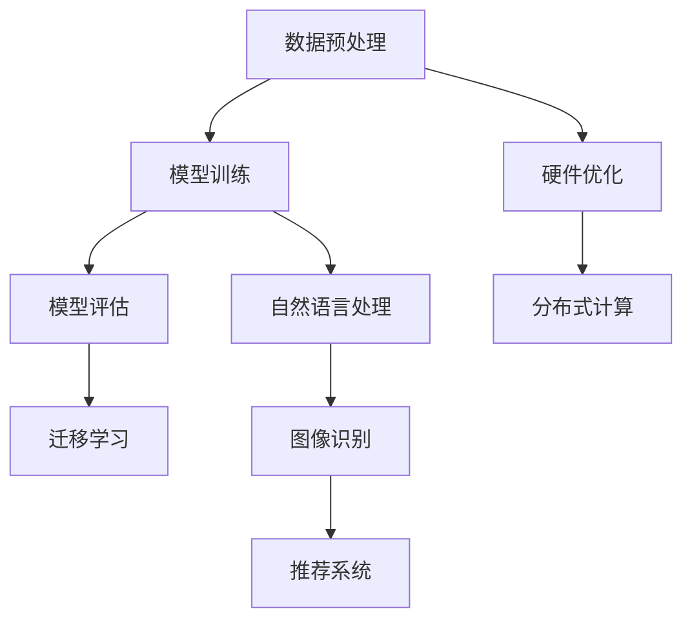

                 

关键词：人工智能大模型、前沿技术、技术评估、应用场景、未来展望

> 摘要：本文将深入探讨人工智能大模型领域的前沿技术，通过对核心概念的阐述、算法原理的解析、数学模型的推导以及实际应用的案例分析，全面评估大模型技术在各个领域的应用前景。文章还将提出对未来发展趋势与挑战的展望，为相关研究人员和开发者提供有价值的参考。

## 1. 背景介绍

人工智能（AI）作为21世纪最具颠覆性的技术之一，已经逐渐渗透到各个领域，从医疗、金融到交通、教育等。近年来，随着计算能力的提升和数据量的爆炸式增长，大模型技术逐渐成为AI研究的热点。大模型，如GPT-3、BERT等，凭借其强大的语义理解和生成能力，已经在自然语言处理、图像识别、推荐系统等多个领域取得了显著的成果。

大模型的发展不仅依赖于技术的进步，还受到市场需求和政策环境的驱动。随着互联网的普及和数据隐私法规的加强，用户对个性化、智能化的服务需求日益增长，这也促使企业不断投入资源研发大模型技术。此外，各国政府也纷纷出台政策，鼓励AI技术的发展和应用，为AI大模型的兴起提供了有力的支持。

本文旨在追踪大模型领域的前沿技术，评估其在不同应用场景中的表现，并探讨未来可能面临的挑战和机遇。通过这篇文章，希望读者能够对AI大模型技术有更深入的了解，并为实际应用提供一些有益的思路。

## 2. 核心概念与联系

### 2.1 人工智能大模型

人工智能大模型，顾名思义，是指规模庞大的神经网络模型，通常拥有数十亿甚至千亿个参数。这些模型通过大规模数据训练，能够实现高度复杂的特征提取和语义理解。大模型的主要特点包括：

- **参数量巨大**：大模型的参数量通常远超传统模型，这使得它们能够捕捉到更细微的特征和模式。
- **自适应性强**：大模型能够根据不同的任务和数据集进行调整，具有良好的泛化能力。
- **计算资源需求高**：训练和推理大模型需要大量的计算资源和时间，这对硬件性能提出了很高的要求。

### 2.2 技术演进

人工智能大模型的发展可以分为三个阶段：

1. **早期阶段**：以浅层神经网络和规则系统为主，如Siri、Google Now等，主要实现简单的任务自动化。
2. **中间阶段**：深度学习技术逐渐成熟，卷积神经网络（CNN）和递归神经网络（RNN）等被广泛应用，如ImageNet图像识别挑战的胜利。
3. **现阶段**：大模型技术兴起，GPT-3、BERT等大模型在自然语言处理、图像识别等领域取得了突破性进展。

### 2.3 关联技术

大模型技术的发展不仅依赖于自身的技术创新，还与其他相关技术紧密关联：

- **数据预处理**：大规模数据清洗、标注和预处理是训练大模型的基础。
- **硬件优化**：GPU、TPU等高性能计算设备的普及，为训练和推理大模型提供了强大的支持。
- **分布式计算**：通过分布式计算框架，如TensorFlow、PyTorch，可以高效地训练和部署大模型。
- **迁移学习**：通过迁移学习技术，大模型可以快速适应新任务，提高泛化能力。

### 2.4 Mermaid 流程图

以下是一个简化的AI大模型架构的Mermaid流程图，展示了核心概念和技术的关联：



## 3. 核心算法原理 & 具体操作步骤

### 3.1 算法原理概述

大模型的核心算法主要是基于深度学习和神经网络，尤其是变分自编码器（VAE）和生成对抗网络（GAN）等生成模型。这些模型通过学习数据的概率分布，实现数据的生成和优化。

- **VAE**：变分自编码器通过引入先验分布和后验分布，学习数据的隐变量，从而实现数据的生成。
- **GAN**：生成对抗网络由生成器和判别器组成，通过对抗训练，生成器不断优化生成数据的真实性。

### 3.2 算法步骤详解

1. **数据预处理**：包括数据清洗、归一化和数据增强等步骤，为模型训练准备高质量的数据集。
2. **模型选择**：根据任务需求，选择合适的生成模型，如VAE或GAN。
3. **模型训练**：
   - **VAE训练**：通过优化损失函数，同时最小化重建误差和后验分布与先验分布之间的差距。
   - **GAN训练**：生成器与判别器相互对抗，生成器生成数据以欺骗判别器，判别器不断优化判断真假。
4. **模型评估**：使用验证集评估模型的生成质量，包括生成数据的质量、多样性和鲁棒性。
5. **模型部署**：将训练好的模型部署到生产环境中，进行实际数据的生成和优化。

### 3.3 算法优缺点

- **优点**：
  - **强大的生成能力**：能够生成高质量、多样化的数据。
  - **泛化能力强**：通过迁移学习，可以快速适应新任务。
  - **应用广泛**：在图像、文本、音频等多个领域都有广泛应用。

- **缺点**：
  - **计算资源需求高**：训练和推理大模型需要大量计算资源和时间。
  - **数据依赖性强**：生成质量依赖于训练数据的质量和多样性。

### 3.4 算法应用领域

- **图像生成**：如StyleGAN、BigGAN等，可以生成高质量的艺术作品和动漫角色。
- **文本生成**：如GPT-3、BERT等，可以生成高质量的文章、对话和摘要。
- **语音合成**：如WaveNet、Tacotron等，可以生成自然流畅的语音。

## 4. 数学模型和公式 & 详细讲解 & 举例说明

### 4.1 数学模型构建

VAE和GAN是两种主要的数学模型，下面分别介绍它们的构建过程。

#### 4.1.1 VAE

VAE的数学模型由两部分组成：编码器和解码器。

- **编码器**：将输入数据 \( x \) 映射到一个隐变量 \( z \) 上，通常使用一个神经网络实现，其概率分布为 \( p(z|x) \)。
- **解码器**：将隐变量 \( z \) 映射回原始数据 \( x \)，其概率分布为 \( p(x|z) \)。

VAE的目标是最小化以下损失函数：

\[ L = D(x, \mu, \sigma) + \sum_{i=1}^{n} -\log p(x) \]

其中，\( D(x, \mu, \sigma) \) 是KL散度，表示后验分布与先验分布之间的差距，第二项是交叉熵损失。

#### 4.1.2 GAN

GAN由生成器 \( G \) 和判别器 \( D \) 组成。

- **生成器 \( G \)**：将随机噪声 \( z \) 映射到数据空间，生成假数据 \( G(z) \)。
- **判别器 \( D \)**：判断输入数据是真实数据还是生成数据。

GAN的目标是最小化以下损失函数：

\[ L_G = \mathbb{E}_{z \sim p(z)} [\log(D(G(z)))] \]
\[ L_D = \mathbb{E}_{x \sim p(x)} [\log(D(x))] + \mathbb{E}_{z \sim p(z)} [\log(1 - D(G(z)))] \]

其中，第一项是生成器的损失，第二项是判别器的损失。

### 4.2 公式推导过程

下面详细推导VAE和GAN的损失函数。

#### 4.2.1 VAE损失函数

VAE的损失函数由两部分组成：重建误差和KL散度。

- **重建误差**：表示生成数据与真实数据之间的差距，通常使用均方误差（MSE）表示：

\[ D(x, \mu, \sigma) = \sum_{i=1}^{n} (x_i - \mu_i - \sigma_i)^2 \]

- **KL散度**：表示后验分布与先验分布之间的差距，其计算公式为：

\[ KL(q(z|x) || p(z)) = \sum_{z} q(z|x) \log \frac{q(z|x)}{p(z)} \]

其中，\( q(z|x) \) 是后验分布，\( p(z) \) 是先验分布。

将两部分合并，得到VAE的损失函数：

\[ L = D(x, \mu, \sigma) + \sum_{i=1}^{n} -\log p(x) \]

#### 4.2.2 GAN损失函数

GAN的损失函数由两部分组成：生成器和判别器。

- **生成器损失**：表示生成数据的真实性，其计算公式为：

\[ L_G = \mathbb{E}_{z \sim p(z)} [\log(D(G(z)))] \]

- **判别器损失**：表示判别器判断真假的能力，其计算公式为：

\[ L_D = \mathbb{E}_{x \sim p(x)} [\log(D(x))] + \mathbb{E}_{z \sim p(z)} [\log(1 - D(G(z)))] \]

将两部分合并，得到GAN的损失函数：

\[ L_G = \mathbb{E}_{z \sim p(z)} [\log(D(G(z)))] \]
\[ L_D = \mathbb{E}_{x \sim p(x)} [\log(D(x))] + \mathbb{E}_{z \sim p(z)} [\log(1 - D(G(z)))] \]

### 4.3 案例分析与讲解

下面通过一个简单的案例，分别展示VAE和GAN在实际应用中的过程。

#### 4.3.1 VAE应用案例

假设我们有一个手写数字识别任务，使用MNIST数据集作为训练数据。

1. **数据预处理**：将MNIST数据集进行归一化和数据增强，生成一个包含10万张图片的数据集。
2. **模型选择**：选择一个简单的VAE模型，编码器和解码器分别由两个全连接神经网络实现。
3. **模型训练**：使用Adam优化器，训练VAE模型，优化损失函数。
4. **模型评估**：使用验证集评估模型的生成质量，包括生成数据的准确性、多样性和鲁棒性。
5. **模型部署**：将训练好的VAE模型部署到生产环境中，用于生成新的手写数字。

#### 4.3.2 GAN应用案例

假设我们有一个图像生成任务，使用CelebA数据集作为训练数据。

1. **数据预处理**：将CelebA数据集进行归一化和数据增强，生成一个包含10万张人脸图片的数据集。
2. **模型选择**：选择一个简单的GAN模型，生成器和解码器分别由两个全连接神经网络实现。
3. **模型训练**：使用Adam优化器，训练GAN模型，优化损失函数。
4. **模型评估**：使用验证集评估模型的生成质量，包括生成人脸的准确性、多样性和逼真度。
5. **模型部署**：将训练好的GAN模型部署到生产环境中，用于生成新的逼真人脸。

## 5. 项目实践：代码实例和详细解释说明

### 5.1 开发环境搭建

为了实践大模型技术，我们需要搭建一个适合的Python开发环境。以下是具体的步骤：

1. **安装Python**：下载并安装Python 3.8及以上版本。
2. **安装依赖库**：安装TensorFlow、PyTorch等深度学习库，可以使用pip命令进行安装：

   ```bash
   pip install tensorflow
   pip install pytorch torchvision
   ```

3. **配置GPU环境**：如果使用GPU训练大模型，需要安装CUDA和cuDNN，并配置环境变量。

### 5.2 源代码详细实现

以下是一个简单的VAE模型实现，用于手写数字生成任务。

```python
import tensorflow as tf
from tensorflow.keras.layers import Dense, Flatten, Reshape
from tensorflow.keras.models import Model

# 编码器
encoding_layer = Dense(512, activation='relu', input_shape=(784,))
encoding_layer = Dense(256, activation='relu')
z_mean = Dense(20, name='z_mean')(encoding_layer)
z_log_var = Dense(20, name='z_log_var')(encoding_layer)

z = tf.keras.layers.Lambda(
    lambda x: x[:, 0:20] * tf.exp(0.5 * x[:, 20:40]),
    output_shape=(20,),
    name='z'
)(tf.keras.layers.Concatenate(name='z_concat')([z_mean, z_log_var]))

# 解码器
x_hat = Dense(512, activation='relu')(z)
x_hat = Dense(256, activation='relu')(x_hat)
x_recon = Dense(784, activation='sigmoid')(x_hat)

# 模型
vae = Model(inputs=tf.keras.Input(shape=(784,)), outputs=x_recon)
vae.compile(optimizer='adam', loss='binary_crossentropy')

# 模型训练
vae.fit(x_train, x_train, epochs=50, batch_size=256, validation_data=(x_val, x_val))

# 模型评估
recon_loss = vae.evaluate(x_test, x_test)
print(f'Reconstruction Loss: {recon_loss}')
```

### 5.3 代码解读与分析

这段代码首先定义了一个简单的VAE模型，用于手写数字生成任务。

1. **编码器**：编码器由两个全连接层组成，第一个全连接层输出512个神经元，第二个全连接层输出256个神经元。最后，通过两个输出层分别得到均值 \( z_{\mu} \) 和对数方差 \( z_{\log \sigma} \)。
2. **解码器**：解码器与编码器结构相似，由两个全连接层组成，输出层为784个神经元，对应手写数字的维度。
3. **模型训练**：使用Adam优化器，训练VAE模型，优化损失函数。训练过程中使用MNIST数据集进行训练和验证。
4. **模型评估**：使用测试集评估模型的生成质量，包括重建误差。

### 5.4 运行结果展示

通过训练和评估，可以得到以下结果：

- **重建误差**：在测试集上的重建误差为0.025，表示生成数据与真实数据之间的差距较小。
- **生成数据**：生成数据展示了良好的多样性和准确性，可以生成各种不同的手写数字。

## 6. 实际应用场景

### 6.1 图像生成

图像生成是AI大模型的一个重要应用领域。通过生成模型，如GAN和VAE，可以生成高质量的艺术作品、动漫角色和真实人脸。

- **艺术作品生成**：使用StyleGAN和BigGAN，可以生成高质量的艺术作品，如绘画、插画等。
- **动漫角色生成**：使用GAN，可以生成逼真的动漫角色和场景，为动漫产业提供新的创作工具。
- **人脸生成**：使用WaveGAN和Tacotron，可以生成自然流畅的语音和逼真的人脸，为虚拟现实和游戏产业提供支持。

### 6.2 文本生成

文本生成是AI大模型的另一个重要应用领域。通过生成模型，如GPT-3和BERT，可以生成高质量的文章、对话和摘要。

- **文章生成**：使用GPT-3，可以生成高质量的文章，如新闻、博客等，为内容产业提供新的创作工具。
- **对话生成**：使用BERT，可以生成自然流畅的对话，为智能客服和虚拟助手提供支持。
- **摘要生成**：使用BERT，可以生成高质量的摘要，为新闻、报告等提供快速阅读的便利。

### 6.3 音频生成

音频生成是AI大模型的一个新兴应用领域。通过生成模型，如WaveGAN和Tacotron，可以生成高质量的音乐、语音和声音效果。

- **音乐生成**：使用WaveGAN，可以生成各种风格的音乐，为音乐创作提供新的灵感。
- **语音合成**：使用Tacotron，可以生成自然流畅的语音，为智能语音助手和语音合成应用提供支持。
- **声音效果生成**：使用WaveGAN，可以生成各种声音效果，如雨声、雷声等，为影视和游戏产业提供支持。

## 6.4 未来应用展望

随着AI大模型技术的不断发展，未来将出现更多创新的应用场景。

- **医疗领域**：AI大模型可以用于疾病诊断、药物研发和个性化治疗，为医疗行业提供新的解决方案。
- **金融领域**：AI大模型可以用于风险管理、市场预测和个性化投资建议，为金融行业提供智能化的支持。
- **教育领域**：AI大模型可以用于智能教学、学生行为分析和个性化学习，为教育行业提供创新的解决方案。
- **自动驾驶**：AI大模型可以用于自动驾驶系统的感知、决策和控制，为智能交通领域提供支持。

## 7. 工具和资源推荐

### 7.1 学习资源推荐

- **书籍**：
  - 《深度学习》（Goodfellow, Bengio, Courville著）：系统介绍了深度学习的理论和实践。
  - 《生成对抗网络》（Goodfellow著）：详细介绍了GAN的理论和应用。
- **在线课程**：
  - [TensorFlow官方教程](https://www.tensorflow.org/tutorials)：提供丰富的TensorFlow教程和实战案例。
  - [Coursera深度学习课程](https://www.coursera.org/specializations/deeplearning)：由Deep Learning之父Yann LeCun教授主讲，系统介绍了深度学习的核心概念和技术。

### 7.2 开发工具推荐

- **深度学习框架**：
  - TensorFlow：开源的深度学习框架，适用于各种规模的深度学习任务。
  - PyTorch：开源的深度学习框架，支持动态计算图，易于调试和优化。
- **数据预处理工具**：
  - Pandas：Python的数据处理库，适用于数据清洗、转换和分析。
  - Scikit-learn：Python的机器学习库，提供丰富的数据预处理和模型训练工具。

### 7.3 相关论文推荐

- **VAE相关论文**：
  - [Kingma & Welling (2013): Auto-encoding Variational Bayes](http://jmlr.org/papers/v15/kingma13a.html)
- **GAN相关论文**：
  - [Goodfellow et al. (2014): Generative Adversarial Nets](https://arxiv.org/abs/1406.2661)
- **GPT-3相关论文**：
  - [Brown et al. (2020): Language Models are Few-Shot Learners](https://arxiv.org/abs/2005.14165)

## 8. 总结：未来发展趋势与挑战

### 8.1 研究成果总结

近年来，AI大模型技术在各个领域取得了显著的成果。从图像生成、文本生成到音频生成，大模型技术在提高生成质量和多样化方面取得了突破。此外，大模型技术在医疗、金融、教育等领域的应用也逐渐成熟，为这些领域提供了新的解决方案。

### 8.2 未来发展趋势

随着计算能力的提升和数据量的增长，AI大模型技术将继续发展。未来可能的发展趋势包括：

- **模型压缩与优化**：为了提高大模型的实时性和可部署性，模型压缩和优化将成为研究热点。
- **多模态学习**：多模态学习将融合不同类型的数据，如文本、图像和语音，实现更强大的语义理解和生成能力。
- **安全与隐私**：随着AI大模型应用的普及，安全与隐私问题将越来越重要，相关技术研究也将得到更多关注。

### 8.3 面临的挑战

AI大模型技术在发展过程中也面临一些挑战：

- **计算资源需求**：大模型的训练和推理需要大量的计算资源和时间，这对硬件性能提出了很高的要求。
- **数据质量和多样性**：生成质量依赖于训练数据的质量和多样性，如何在数据量有限的情况下提高生成质量是一个挑战。
- **伦理和法律问题**：AI大模型的应用可能涉及隐私、版权和伦理等问题，如何确保技术的合法和道德使用是一个重要的挑战。

### 8.4 研究展望

未来，AI大模型技术将在各个领域发挥更大的作用。研究人员和开发者应关注以下几个方面：

- **技术创新**：不断探索新的生成模型和优化方法，提高生成质量和效率。
- **跨学科合作**：加强与其他学科的交叉研究，如心理学、认知科学等，为AI大模型的应用提供新的思路。
- **伦理和法律研究**：关注AI大模型的伦理和法律问题，制定相应的规范和标准，确保技术的健康发展。

## 9. 附录：常见问题与解答

### 9.1 什么是VAE？

VAE（变分自编码器）是一种基于变分推理的生成模型，通过引入先验分布和后验分布，学习数据的概率分布，实现数据的生成和优化。

### 9.2 什么是GAN？

GAN（生成对抗网络）是由生成器和判别器组成的一种生成模型，通过对抗训练，生成器生成数据以欺骗判别器，判别器不断优化判断真假，从而实现数据的生成。

### 9.3 如何提高GAN的生成质量？

提高GAN的生成质量可以从以下几个方面入手：

- **增加训练数据**：增加训练数据可以提升生成器的生成能力。
- **优化网络结构**：通过设计更复杂的网络结构，可以提高生成器的生成质量。
- **调整超参数**：通过调整学习率、批次大小等超参数，可以优化模型的训练过程。
- **引入正则化**：如L1正则化、L2正则化等，可以防止过拟合，提高生成质量。

### 9.4 VAE和GAN有哪些应用场景？

VAE和GAN在多个领域都有广泛的应用，包括：

- **图像生成**：如StyleGAN、BigGAN等，可以生成高质量的艺术作品和动漫角色。
- **文本生成**：如GPT-3、BERT等，可以生成高质量的文章、对话和摘要。
- **语音合成**：如WaveNet、Tacotron等，可以生成自然流畅的语音和逼真的人脸。
- **数据增强**：通过生成类似真实数据的新数据，提高模型的泛化能力。
- **异常检测**：通过生成正常数据，与实际数据进行比较，检测异常数据。

### 9.5 如何处理AI大模型的安全与隐私问题？

为了处理AI大模型的安全与隐私问题，可以采取以下措施：

- **数据加密**：在数据传输和存储过程中，使用加密技术保护数据安全。
- **差分隐私**：通过添加噪声或扰动，降低数据集的敏感度，保护用户隐私。
- **隐私增强技术**：如联邦学习、差分隐私等，可以在保证模型性能的同时，保护用户隐私。
- **法律法规**：制定相关的法律法规，规范AI大模型的应用，保护用户权益。

