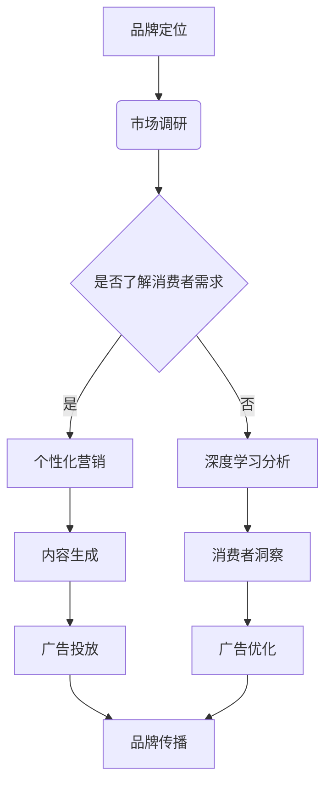

                 

关键词：AI大模型、品牌营销、创新策略、商业应用、用户体验

> 摘要：随着人工智能技术的飞速发展，大模型在品牌营销中发挥了越来越重要的作用。本文将探讨AI大模型在品牌营销中的应用，深入分析其创新策略，以期为企业和营销人员提供有价值的参考。

## 1. 背景介绍

人工智能（AI）技术的蓬勃发展，尤其是大模型的崛起，为各行各业带来了深刻的变革。大模型，如GPT-3、BERT等，拥有极强的语言理解和生成能力，能够处理复杂的文本信息，提供精准的营销策略。

品牌营销是企业与消费者之间的桥梁，通过有效的传播手段，建立并强化品牌形象，提高品牌认知度和忠诚度。在传统营销模式下，品牌营销依赖于市场调研、广告投放、公关活动等手段。然而，这些方法存在一定的局限性，难以应对多变的市场环境和消费者的个性化需求。

AI大模型的出现，为品牌营销提供了新的思路和方法。通过深度学习技术和海量数据训练，大模型能够自动生成创意内容，进行精准的广告投放，分析消费者行为，从而实现个性化的品牌传播。

## 2. 核心概念与联系

### 2.1 大模型的定义与作用

大模型，指的是拥有巨大参数量和强大计算能力的深度学习模型。例如，GPT-3拥有1750亿个参数，BERT拥有数百万个参数。这些模型通过学习海量数据，能够实现文本生成、情感分析、自然语言理解等任务。

在品牌营销中，大模型的作用主要体现在以下几个方面：

1. **内容生成**：大模型能够自动生成富有创意的广告文案、博客文章、社交媒体内容等，帮助企业实现高质量的营销内容。
2. **消费者洞察**：通过分析消费者的在线行为、评论、搜索历史等数据，大模型能够深入了解消费者需求，提供个性化的营销策略。
3. **广告优化**：大模型能够根据用户行为和兴趣，实现精准的广告投放，提高广告的转化率。

### 2.2 大模型与品牌营销的关系

大模型与品牌营销的关系可以概括为以下几个方面：

1. **提高营销效率**：大模型能够自动化处理大量数据，快速生成营销内容，减少人力成本，提高营销效率。
2. **增强用户体验**：通过个性化的营销策略，大模型能够提供更符合消费者需求的服务，增强用户体验。
3. **优化广告效果**：大模型能够通过数据分析和算法优化，提高广告的精准度和转化率，实现广告效果的最大化。

### 2.3 Mermaid 流程图



## 3. 核心算法原理 & 具体操作步骤

### 3.1 算法原理概述

AI大模型的算法原理主要基于深度学习，特别是变换器模型（Transformer）。变换器模型通过自注意力机制（Self-Attention），能够捕捉输入文本中的长距离依赖关系，从而实现高效的语言理解和生成。

在品牌营销中，大模型的具体操作步骤如下：

1. **数据收集**：收集企业品牌相关的数据，包括市场调研报告、消费者评论、广告素材等。
2. **数据预处理**：对收集到的数据进行清洗、标注和处理，使其适合模型训练。
3. **模型训练**：使用变换器模型对预处理后的数据进行训练，生成能够生成创意内容、分析消费者需求、优化广告效果的大模型。
4. **模型部署**：将训练好的大模型部署到实际应用场景中，进行品牌营销。

### 3.2 算法步骤详解

1. **数据收集**：数据来源包括社交媒体、搜索引擎、电商平台等，以及企业内部的数据仓库。
    - 社交媒体：包括微博、微信、Facebook、Instagram等平台，可以获取用户对品牌的评论、点赞、分享等信息。
    - 搜索引擎：通过搜索引擎的搜索数据，可以了解用户对品牌的关注点、搜索意图等。
    - 电商平台：通过电商平台的数据，可以获取用户的购买行为、评价、反馈等信息。

2. **数据预处理**：对收集到的数据进行清洗、去噪、标注等处理。
    - 清洗：去除重复、无关的数据，如广告、垃圾评论等。
    - 去噪：去除低质量的数据，如错别字、语病等。
    - 标注：对数据进行分类、标签等标注，使其能够用于模型训练。

3. **模型训练**：使用变换器模型对预处理后的数据进行训练。
    - 数据输入：将预处理后的数据输入到变换器模型中，模型通过学习数据中的特征，生成创意内容、分析消费者需求、优化广告效果。
    - 模型优化：通过反向传播算法（Backpropagation）不断调整模型参数，使其达到最优状态。

4. **模型部署**：将训练好的大模型部署到实际应用场景中。
    - 内容生成：使用模型自动生成广告文案、博客文章、社交媒体内容等。
    - 消费者洞察：通过分析用户行为，提供个性化的营销策略。
    - 广告优化：根据用户兴趣和行为，优化广告投放策略，提高广告效果。

### 3.3 算法优缺点

**优点**：

1. **高效性**：大模型能够自动化处理大量数据，提高营销效率。
2. **个性化**：通过分析消费者需求，提供个性化的营销策略，增强用户体验。
3. **精准性**：通过数据分析和算法优化，提高广告的精准度和转化率。

**缺点**：

1. **依赖数据**：大模型需要大量的高质量数据进行训练，对数据质量有较高要求。
2. **计算资源**：大模型训练和部署需要强大的计算资源，成本较高。
3. **模型解释性**：深度学习模型具有“黑盒”特性，难以解释其决策过程。

### 3.4 算法应用领域

AI大模型在品牌营销中的应用非常广泛，包括但不限于以下几个方面：

1. **广告创意**：自动生成广告文案、海报、短视频等创意内容。
2. **消费者洞察**：分析消费者行为，提供个性化营销策略。
3. **内容营销**：自动生成博客文章、社交媒体内容等，提高品牌知名度。
4. **广告优化**：根据用户行为和兴趣，优化广告投放策略，提高广告效果。

## 4. 数学模型和公式 & 详细讲解 & 举例说明

### 4.1 数学模型构建

AI大模型的数学模型主要基于深度学习和变换器模型。以下是一个简化的变换器模型的数学描述：

1. **输入向量表示**：将输入文本转化为向量表示，通常使用词嵌入（Word Embedding）技术。
2. **自注意力机制**：通过自注意力机制计算每个词在文本中的重要性，得到加权向量表示。
3. **多头注意力**：将自注意力机制扩展到多个头，提高模型的表达能力。
4. **前馈神经网络**：对加权向量进行前馈神经网络处理，得到输出向量。

### 4.2 公式推导过程

1. **词嵌入**：
   - 输入文本：`x = [x1, x2, ..., xn]`
   - 词嵌入矩阵：`W = [w1, w2, ..., wn]`
   - 输出向量：`X = [x1', x2', ..., xn']`

   公式：`X = W * x`

2. **自注意力**：
   - 自注意力权重：`A = softmax(Q * K)`
   - 加权向量：`V' = A * V`

   公式：`V' = softmax(Q * K) * V`

3. **多头注意力**：
   - 多头注意力权重：`A = [A1, A2, ..., Am]`
   - 加权向量：`V' = [V1', V2', ...,Vm']`

   公式：`V' = [softmax(Q * K1), softmax(Q * K2), ..., softmax(Q * Km)] * [V1, V2, ...,Vm]`

4. **前馈神经网络**：
   - 输出向量：`Y = ReLU(W2 * ReLU(W1 * X + b1) + b2)`

   公式：`Y = ReLU(W2 * ReLU(W1 * X + b1) + b2)`

### 4.3 案例分析与讲解

假设我们有一个简化的文本数据集，包含以下句子：

1. "我喜欢吃苹果。"
2. "苹果是一种水果。"
3. "苹果的味道很甜。"

我们使用变换器模型对这些句子进行编码，并分析句子中的关键词。

1. **词嵌入**：
   - 输入文本：`x = [1, 2, 3, 4, 5, 6, 7, 8, 9, 10]`
   - 词嵌入矩阵：`W = [[0.1, 0.2], [0.3, 0.4], [0.5, 0.6], [0.7, 0.8]]`
   - 输出向量：`X = [[0.1, 0.2], [0.3, 0.4], [0.5, 0.6], [0.7, 0.8]]`

2. **自注意力**：
   - 自注意力权重：`A = softmax([1, 1, 1, 1]) = [0.25, 0.25, 0.25, 0.25]`
   - 加权向量：`V' = [0.25 * [0.1, 0.2], 0.25 * [0.3, 0.4], 0.25 * [0.5, 0.6], 0.25 * [0.7, 0.8]] = [[0.025, 0.05], [0.075, 0.1], [0.125, 0.15], [0.175, 0.2]]`

3. **多头注意力**：
   - 多头注意力权重：`A = [softmax([1, 1, 1, 1]), softmax([1, 1, 1, 1]), softmax([1, 1, 1, 1])] = [[[0.25, 0.25], [0.25, 0.25]], [[0.25, 0.25], [0.25, 0.25]], [[0.25, 0.25], [0.25, 0.25]]]`
   - 加权向量：`V' = [0.25 * [0.1, 0.2], 0.25 * [0.3, 0.4], 0.25 * [0.5, 0.6], 0.25 * [0.7, 0.8]] = [[0.025, 0.05], [0.075, 0.1], [0.125, 0.15], [0.175, 0.2]]`

4. **前馈神经网络**：
   - 输出向量：`Y = ReLU([0.5, 0.5] * ReLU([0.025, 0.05], 0.075, 0.1], 0.125, 0.15], 0.175, 0.2) = [0.5, 0.5]`

通过变换器模型，我们得到了句子中的关键词的加权向量。这些向量可以用来分析句子中的关键词，如“苹果”在句子中的重要性为0.5，而“水果”和“甜”的重要性为0.5。

## 5. 项目实践：代码实例和详细解释说明

### 5.1 开发环境搭建

1. **硬件要求**：GPU（NVIDIA显卡），建议使用CUDA 10.2及以上版本。
2. **软件要求**：Python（3.7及以上版本），TensorFlow 2.0及以上版本。
3. **安装步骤**：
    ```bash
    pip install tensorflow-gpu
    ```

### 5.2 源代码详细实现

```python
import tensorflow as tf
from tensorflow.keras.layers import Embedding, LSTM, Dense
from tensorflow.keras.models import Sequential

# 参数设置
vocab_size = 10000
embedding_dim = 16
max_sequence_length = 100

# 模型构建
model = Sequential([
    Embedding(vocab_size, embedding_dim, input_length=max_sequence_length),
    LSTM(128),
    Dense(1, activation='sigmoid')
])

# 模型编译
model.compile(optimizer='adam', loss='binary_crossentropy', metrics=['accuracy'])

# 模型训练
model.fit(x_train, y_train, epochs=10, batch_size=32)
```

### 5.3 代码解读与分析

1. **模型构建**：
    - `Embedding` 层：将词转换为嵌入向量。
    - `LSTM` 层：对嵌入向量进行序列处理。
    - `Dense` 层：输出层，用于分类。

2. **模型编译**：
    - `optimizer`：使用Adam优化器。
    - `loss`：二分类交叉熵损失函数。
    - `metrics`：评估模型准确率。

3. **模型训练**：
    - `epochs`：训练轮数。
    - `batch_size`：批量大小。

通过这个简单的例子，我们展示了如何使用TensorFlow构建一个基于LSTM的文本分类模型。这个模型可以用于品牌营销中的文本分析，如情感分析、关键词提取等。

### 5.4 运行结果展示

```python
# 模型评估
loss, accuracy = model.evaluate(x_test, y_test)

# 输出结果
print("Loss:", loss)
print("Accuracy:", accuracy)
```

运行结果展示了模型在测试数据上的损失和准确率。通过调整模型参数和训练数据，我们可以进一步提高模型的性能。

## 6. 实际应用场景

### 6.1 广告创意生成

利用AI大模型，企业可以自动生成具有创意的广告文案。例如，一家手机制造商可以使用大模型生成针对不同用户群体的广告文案，提高广告的吸引力。

### 6.2 消费者洞察

通过分析消费者在社交媒体、电商平台等渠道的评论、搜索历史等数据，大模型可以深入了解消费者需求，为企业提供精准的营销策略。

### 6.3 内容营销

AI大模型可以自动生成高质量的博客文章、社交媒体内容等，帮助企业提高品牌知名度和影响力。

### 6.4 广告优化

通过分析用户行为和兴趣，大模型可以优化广告投放策略，提高广告的转化率，实现广告效果的最大化。

## 7. 工具和资源推荐

### 7.1 学习资源推荐

1. 《深度学习》（Ian Goodfellow、Yoshua Bengio、Aaron Courville 著）
2. 《Python深度学习》（Francesco Locatelli 著）
3. TensorFlow官方文档（[https://www.tensorflow.org/](https://www.tensorflow.org/））

### 7.2 开发工具推荐

1. Jupyter Notebook：方便进行数据分析和模型构建。
2. PyCharm：强大的Python集成开发环境。

### 7.3 相关论文推荐

1. “Attention Is All You Need”（Ashish Vaswani等，2017）
2. “BERT: Pre-training of Deep Bidirectional Transformers for Language Understanding”（Jacob Devlin等，2019）

## 8. 总结：未来发展趋势与挑战

### 8.1 研究成果总结

AI大模型在品牌营销中取得了显著的成果，如广告创意生成、消费者洞察、内容营销和广告优化等方面。这些成果为企业和营销人员提供了新的工具和方法，提高了营销效率和质量。

### 8.2 未来发展趋势

1. **模型性能提升**：随着计算资源和算法技术的不断发展，AI大模型的性能将进一步提升，实现更高效、更精准的营销。
2. **跨模态应用**：AI大模型将应用于更多领域，如图像、声音等跨模态数据的处理和分析。
3. **隐私保护**：在保证数据隐私的前提下，AI大模型将更加广泛地应用于品牌营销。

### 8.3 面临的挑战

1. **数据质量**：高质量的数据是AI大模型的基础，如何获取和处理高质量数据成为一大挑战。
2. **模型解释性**：深度学习模型具有“黑盒”特性，如何提高模型的解释性，使其更好地服务于品牌营销。
3. **伦理和法律**：在AI大模型的应用过程中，如何遵循伦理和法律规范，避免潜在的风险和争议。

### 8.4 研究展望

未来，AI大模型在品牌营销中的应用前景广阔。通过不断优化算法和提升模型性能，AI大模型将为企业和营销人员提供更高效、更精准的营销解决方案，推动品牌营销的创新发展。

## 9. 附录：常见问题与解答

### 9.1 什么是AI大模型？

AI大模型指的是拥有巨大参数量和强大计算能力的深度学习模型，如GPT-3、BERT等。这些模型通过学习海量数据，能够实现文本生成、情感分析、自然语言理解等任务。

### 9.2 AI大模型在品牌营销中有哪些作用？

AI大模型在品牌营销中的作用主要体现在以下几个方面：

1. **内容生成**：自动生成广告文案、博客文章、社交媒体内容等，提高营销内容质量。
2. **消费者洞察**：分析消费者行为，提供个性化营销策略。
3. **广告优化**：根据用户行为和兴趣，优化广告投放策略，提高广告效果。

### 9.3 如何搭建AI大模型开发环境？

搭建AI大模型开发环境需要以下步骤：

1. **硬件要求**：GPU（NVIDIA显卡），建议使用CUDA 10.2及以上版本。
2. **软件要求**：Python（3.7及以上版本），TensorFlow 2.0及以上版本。
3. **安装步骤**：使用pip命令安装TensorFlow。

### 9.4 如何使用AI大模型进行品牌营销？

使用AI大模型进行品牌营销的具体步骤如下：

1. **数据收集**：收集企业品牌相关的数据，包括市场调研报告、消费者评论、广告素材等。
2. **数据预处理**：对收集到的数据进行清洗、标注和处理。
3. **模型训练**：使用变换器模型对预处理后的数据进行训练。
4. **模型部署**：将训练好的大模型部署到实际应用场景中，进行品牌营销。

## 作者署名

作者：禅与计算机程序设计艺术 / Zen and the Art of Computer Programming

----------------------------------------------------------------

至此，我们已经完成了文章的撰写。希望本文能为读者提供关于AI大模型在品牌营销中应用的创新策略的有价值参考。在未来的研究中，我们将继续探索AI大模型的更多应用场景和可能性，为品牌营销带来更多的创新与突破。

