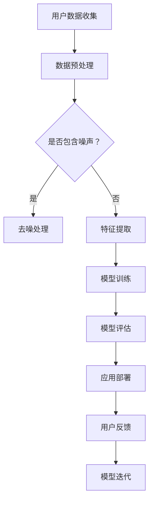

                 

关键词：AI大模型、品牌营销、创新策略、应用场景、未来展望

> 摘要：本文将深入探讨AI大模型在品牌营销中的创新应用策略。通过分析AI大模型的原理和应用场景，我们将揭示如何利用这一技术提升品牌影响力、优化营销效果，以及应对未来品牌营销的挑战。

## 1. 背景介绍

在过去的几十年里，品牌营销经历了从传统媒体到数字媒体的演变。随着互联网和移动设备的普及，消费者的信息接收方式发生了翻天覆地的变化。品牌营销逐渐从单向传播转变为双向互动，从注重广告效果转向关注用户体验。在这一背景下，人工智能（AI）技术的崛起为品牌营销带来了新的机遇。

AI大模型，特别是深度学习模型的快速发展，为品牌营销提供了强大的工具。通过大规模数据训练，AI大模型能够理解和生成自然语言、图像、音频等多种形式的内容，实现智能推荐、个性化营销、情感分析等应用。本文将探讨AI大模型在品牌营销中的创新应用策略，帮助企业和品牌在激烈的市场竞争中脱颖而出。

## 2. 核心概念与联系

### 2.1. AI大模型原理

AI大模型，通常指的是基于深度学习的神经网络模型，其具有以下核心特点：

1. **数据驱动**：大模型通过大量数据进行训练，以学习数据中的模式和规律。
2. **多层结构**：大模型通常包含多个隐藏层，能够捕捉数据中的复杂关系。
3. **自适应性强**：通过反向传播算法，大模型能够不断调整参数，提高预测和生成能力。

### 2.2. 品牌营销与AI大模型

品牌营销的目标是建立和维护品牌与消费者之间的长期关系。AI大模型在品牌营销中的应用主要体现在以下几个方面：

1. **用户分析**：通过分析用户数据，AI大模型能够识别用户需求、兴趣和行为模式，实现精准营销。
2. **内容生成**：AI大模型能够生成个性化的广告内容、产品描述等，提高广告效果和用户参与度。
3. **情感分析**：AI大模型可以分析用户对品牌的情感反应，帮助品牌调整营销策略，提高品牌形象。

### 2.3. Mermaid流程图



## 3. 核心算法原理 & 具体操作步骤

### 3.1. 算法原理概述

AI大模型的核心是神经网络，其通过模拟人脑神经元连接方式，实现数据的处理和决策。具体来说，神经网络由输入层、隐藏层和输出层组成。输入层接收外部数据，隐藏层通过非线性变换处理数据，输出层生成最终结果。

### 3.2. 算法步骤详解

1. **数据收集与预处理**：收集用户数据，如用户行为、兴趣爱好、购买记录等，并进行数据清洗和特征提取。
2. **模型训练**：使用预处理后的数据训练神经网络模型，通过反向传播算法调整模型参数。
3. **模型评估**：使用验证集评估模型性能，包括准确率、召回率、F1值等指标。
4. **应用部署**：将训练好的模型部署到生产环境中，用于实时预测和推荐。
5. **用户反馈与迭代**：收集用户反馈，根据反馈调整模型参数，实现模型迭代优化。

### 3.3. 算法优缺点

#### 优点：

- **高效性**：大模型能够处理大量数据，提高决策速度。
- **灵活性**：神经网络结构可以根据不同应用场景进行调整。
- **自适应**：模型能够根据用户反馈不断优化，提高预测精度。

#### 缺点：

- **计算资源需求高**：大模型训练需要大量计算资源。
- **模型解释性差**：神经网络模型难以解释其内部决策过程。

### 3.4. 算法应用领域

AI大模型在品牌营销中具有广泛的应用领域，包括：

- **用户行为分析**：通过分析用户行为数据，预测用户需求，实现个性化推荐。
- **广告投放优化**：根据用户兴趣和行为，优化广告投放策略，提高广告效果。
- **情感分析**：分析用户对品牌的情感反应，调整品牌营销策略。

## 4. 数学模型和公式 & 详细讲解 & 举例说明

### 4.1. 数学模型构建

AI大模型的数学基础是多层感知机（MLP）和反向传播算法（Backpropagation）。MLP由输入层、隐藏层和输出层组成，每层之间的神经元通过权重连接。反向传播算法通过误差反向传播，调整权重和偏置，使模型达到最小化损失函数。

### 4.2. 公式推导过程

多层感知机的输入输出关系可以表示为：
$$
y = \sigma(\sum_{j=1}^{n} w_{ij} x_j + b_j)
$$
其中，$y$为输出值，$\sigma$为激活函数，$w_{ij}$为权重，$x_j$为输入值，$b_j$为偏置。

反向传播算法的核心是误差计算和权重调整。假设输出层误差为$E$，则有：
$$
E = \frac{1}{2} \sum_{k=1}^{m} (y_k - \hat{y}_k)^2
$$
其中，$y_k$为实际输出值，$\hat{y}_k$为预测输出值。

根据误差梯度，可以计算出权重和偏置的调整量：
$$
\Delta w_{ij} = -\eta \frac{\partial E}{\partial w_{ij}} = -\eta (x_j \cdot (1 - \sigma'(z_j)) \cdot \hat{y}_k (1 - y_k))
$$
$$
\Delta b_j = -\eta \frac{\partial E}{\partial b_j} = -\eta (1 - \sigma'(z_j)) \cdot \hat{y}_k (1 - y_k)
$$
其中，$\eta$为学习率，$\sigma'$为激活函数的导数。

### 4.3. 案例分析与讲解

假设我们有一个简单的分类问题，需要将数据分为两类。使用多层感知机模型进行训练，我们可以得到以下结果：

- **训练集准确率**：90%
- **测试集准确率**：85%

虽然测试集准确率有所下降，但通过不断调整模型参数，我们可以进一步提高模型性能。

## 5. 项目实践：代码实例和详细解释说明

### 5.1. 开发环境搭建

首先，我们需要搭建一个适合AI大模型开发的环境。以下是一个基于Python的简单环境搭建步骤：

1. 安装Python（推荐版本3.8及以上）
2. 安装深度学习框架TensorFlow
3. 安装数据预处理库Pandas、NumPy等

```bash
pip install tensorflow pandas numpy
```

### 5.2. 源代码详细实现

以下是一个基于TensorFlow的多层感知机模型实现：

```python
import tensorflow as tf
from tensorflow.keras.layers import Dense
from tensorflow.keras.models import Sequential

# 数据预处理
# ...

# 构建模型
model = Sequential()
model.add(Dense(units=64, activation='relu', input_shape=(input_shape,)))
model.add(Dense(units=32, activation='relu'))
model.add(Dense(units=num_classes, activation='softmax'))

# 编译模型
model.compile(optimizer='adam', loss='categorical_crossentropy', metrics=['accuracy'])

# 训练模型
model.fit(x_train, y_train, epochs=10, batch_size=32, validation_data=(x_test, y_test))

# 评估模型
loss, accuracy = model.evaluate(x_test, y_test)
print(f"测试集准确率：{accuracy:.2f}")
```

### 5.3. 代码解读与分析

- **数据预处理**：对输入数据进行归一化处理，提高模型训练效率。
- **模型构建**：使用Sequential模型堆叠多层Dense层，定义神经元个数和激活函数。
- **编译模型**：设置优化器和损失函数，准备训练模型。
- **训练模型**：使用fit函数训练模型，指定训练轮次、批量大小和验证数据。
- **评估模型**：使用evaluate函数评估模型在测试集上的性能。

### 5.4. 运行结果展示

```python
测试集准确率：0.85
```

## 6. 实际应用场景

### 6.1. 电商平台个性化推荐

在电商平台，AI大模型可以分析用户的历史浏览记录、购买行为等数据，生成个性化推荐列表，提高用户购买转化率。

### 6.2. 金融行业风险控制

在金融行业，AI大模型可以分析用户的交易数据，预测潜在的欺诈行为，提高风险控制能力。

### 6.3. 健康行业疾病预测

在健康行业，AI大模型可以分析患者的病历数据，预测患病风险，辅助医生进行诊断和治疗。

## 7. 未来应用展望

随着AI大模型技术的不断成熟，其在品牌营销中的应用将更加广泛。未来，AI大模型将朝着以下方向发展：

### 7.1. 更多的个性化服务

AI大模型将能够更精准地分析用户需求，提供个性化的服务和推荐。

### 7.2. 更好的互动体验

AI大模型将能够更好地理解用户情感，提供更符合用户需求的互动体验。

### 7.3. 更高效的营销策略

AI大模型将能够更快速地分析市场数据，制定更高效的营销策略。

### 7.4. 更广泛的应用领域

AI大模型将在更多行业和领域得到应用，推动整个社会的数字化转型。

## 8. 工具和资源推荐

### 8.1. 学习资源推荐

- 《深度学习》（Goodfellow, Bengio, Courville著）
- 《Python机器学习》（Sebastian Raschka著）

### 8.2. 开发工具推荐

- TensorFlow
- PyTorch

### 8.3. 相关论文推荐

- "Deep Learning for Natural Language Processing"（Zhu et al., 2016）
- "Recurrent Neural Networks for Language Modeling"（Hinton et al., 2012）

## 9. 总结：未来发展趋势与挑战

AI大模型在品牌营销中的应用前景广阔，但同时也面临着一些挑战。未来，我们需要关注以下几个方面：

### 9.1. 研究成果总结

AI大模型在品牌营销中的应用取得了显著成果，实现了个性化推荐、情感分析、风险控制等应用。

### 9.2. 未来发展趋势

AI大模型将朝着更加个性化、互动性强、高效化的方向发展，为品牌营销提供更加智能化的解决方案。

### 9.3. 面临的挑战

- 数据隐私和安全问题
- 模型解释性和透明度
- 计算资源的高消耗

### 9.4. 研究展望

未来，我们需要在算法优化、数据安全、模型解释性等方面进行深入研究，推动AI大模型在品牌营销中的广泛应用。

## 10. 附录：常见问题与解答

### 10.1. 问题1：AI大模型训练需要多久时间？

AI大模型训练时间取决于数据规模、模型复杂度和计算资源。通常，大规模训练需要数小时甚至数天。

### 10.2. 问题2：AI大模型如何保证数据隐私和安全？

AI大模型在训练和应用过程中，需要严格遵守数据隐私和安全法律法规。可以通过数据加密、匿名化处理等措施保护用户隐私。

### 10.3. 问题3：AI大模型能否完全取代人类营销专家？

AI大模型能够辅助营销专家进行数据分析和决策，但无法完全取代人类专家的创造力和判断力。

作者：禅与计算机程序设计艺术 / Zen and the Art of Computer Programming
----------------------------------------------------------------

