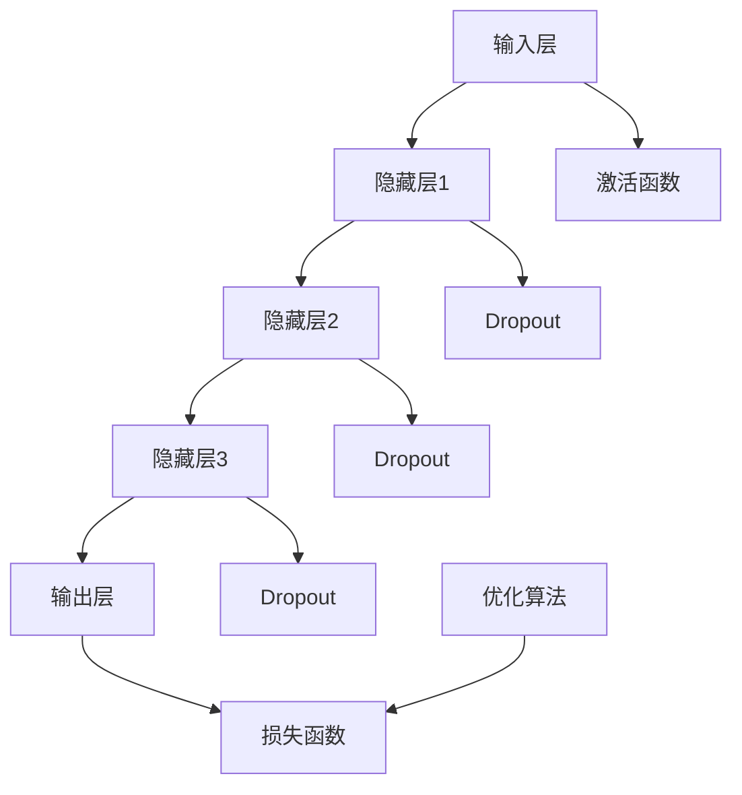

                 

### 文章关键词

AI大模型、场景化解决方案、应用设计、算法原理、数学模型、项目实践、资源推荐

### 文章摘要

本文旨在探讨AI大模型在不同场景中的应用解决方案。首先，我们回顾了AI大模型的发展背景和核心概念。接着，深入分析了AI大模型的应用原理，并通过具体的算法步骤、数学模型和公式进行了详细讲解。随后，我们通过实际项目实践展示了大模型的具体应用。文章最后对大模型的未来应用场景进行了展望，并推荐了相关学习资源和工具。本文为AI领域研究人员和从业者提供了全面的指导。

## 1. 背景介绍

随着人工智能（AI）技术的飞速发展，大模型（Large-scale Model）已经成为当前研究的热点。大模型，尤其是深度学习模型，通过对海量数据的学习，能够实现高度复杂的任务，如图像识别、自然语言处理、语音识别等。然而，大模型的应用并非一蹴而就，如何根据具体应用场景设计合适的解决方案，成为了研究人员和开发者面临的重要问题。

大模型的应用场景非常广泛，从工业自动化到医疗诊断，从金融分析到娱乐推荐，都有其身影。然而，不同场景下对模型的要求有所不同，如何在这些差异中找到最优的应用方案，是本文的主要探讨内容。本文将分为以下几个部分：

- **背景介绍**：回顾AI大模型的发展背景和核心概念。
- **核心概念与联系**：详细讲解AI大模型的架构和关键组成部分。
- **核心算法原理 & 具体操作步骤**：介绍大模型的主要算法原理和具体操作步骤。
- **数学模型和公式 & 详细讲解 & 举例说明**：讲解大模型中涉及的重要数学模型和公式。
- **项目实践：代码实例和详细解释说明**：通过实际项目展示大模型的应用。
- **实际应用场景**：分析大模型在不同领域的应用。
- **工具和资源推荐**：推荐学习资源和开发工具。
- **总结：未来发展趋势与挑战**：总结研究现状，展望未来发展趋势和面临的挑战。

通过上述结构，本文希望能够为AI领域的研究人员和从业者提供有价值的参考和指导。

## 2. 核心概念与联系

### 大模型的架构

大模型，通常指的是具有数十亿至千亿参数的深度学习模型。其架构一般包括以下几个核心组成部分：

1. **输入层**：接收外部输入数据，如图像、文本或声音。
2. **隐藏层**：包含多层神经网络结构，通过非线性变换处理输入数据。
3. **输出层**：生成模型的预测结果或决策。

### 关键组成部分

在深入理解大模型的架构后，我们需要关注其关键组成部分：

1. **激活函数**：如ReLU、Sigmoid、Tanh等，用于引入非线性特性，使得模型能够更好地拟合数据。
2. **正则化方法**：如Dropout、L1/L2正则化等，用于防止模型过拟合。
3. **优化算法**：如SGD、Adam等，用于调整模型参数，优化模型性能。

### Mermaid 流程图

为了更直观地展示大模型的架构和组成部分，我们可以使用Mermaid绘制一个简单的流程图：



在这个流程图中，我们可以看到输入数据首先经过输入层，然后通过多层隐藏层进行处理，每层之间包含激活函数和可能的正则化方法。最终，输出层生成预测结果，并通过损失函数和优化算法进行参数调整。

### 大模型的优点与局限性

大模型的优点在于其强大的拟合能力，能够处理复杂的数据和任务。然而，其局限性也不容忽视：

- **计算资源需求大**：大模型需要大量的计算资源和存储空间。
- **训练时间较长**：大模型通常需要较长的训练时间。
- **对数据质量要求高**：数据质量对模型的性能有直接影响。

### 应用领域

大模型的应用领域非常广泛，包括但不限于以下：

- **图像识别**：如人脸识别、自动驾驶等。
- **自然语言处理**：如机器翻译、文本生成等。
- **语音识别**：如语音助手、语音识别系统等。
- **医疗诊断**：如疾病预测、医学图像分析等。

通过上述核心概念和联系的分析，我们可以更好地理解大模型的基本架构和组成部分，为后续的内容奠定基础。

## 3. 核心算法原理 & 具体操作步骤

### 3.1 算法原理概述

大模型的核心算法是基于深度学习理论的，深度学习是一种基于多层神经网络的学习方法，其基本原理是通过多层非线性变换将输入数据映射到输出结果。大模型的算法原理可以概括为以下几个关键步骤：

1. **前向传播**：将输入数据通过多层神经网络进行传递，每一层通过激活函数进行非线性变换。
2. **损失函数计算**：通过预测结果与真实标签之间的差异计算损失函数值。
3. **反向传播**：通过梯度下降等优化算法，更新网络中的权重和偏置，以最小化损失函数。
4. **迭代训练**：重复上述步骤，直到满足预设的训练目标或达到最大迭代次数。

### 3.2 算法步骤详解

以下是具体的大模型算法步骤详解：

#### 3.2.1 前向传播

前向传播是深度学习模型中的基础步骤，其核心思想是将输入数据通过神经网络逐层传递，每层通过激活函数进行非线性变换。

具体步骤如下：

1. **初始化参数**：包括权重（weights）和偏置（biases）。
2. **输入层到隐藏层**：输入数据通过输入层进入隐藏层，每个神经元与前一层的所有神经元相连接，通过线性变换加上偏置后，经过激活函数得到输出。
3. **隐藏层到输出层**：隐藏层输出作为输入传递到输出层，同样进行线性变换和激活函数处理。

#### 3.2.2 损失函数计算

损失函数是衡量模型预测结果与真实标签之间差异的指标，常见的损失函数包括均方误差（MSE）、交叉熵损失等。

具体步骤如下：

1. **计算预测值**：输出层神经元的输出即为模型的预测值。
2. **计算损失**：将预测值与真实标签进行比较，通过损失函数计算损失值。

#### 3.2.3 反向传播

反向传播是深度学习中的核心步骤，用于更新网络中的权重和偏置，以最小化损失函数。

具体步骤如下：

1. **计算梯度**：从输出层开始，逐层向前计算每个神经元的梯度。
2. **更新参数**：使用梯度下降等优化算法，更新网络中的权重和偏置。

#### 3.2.4 迭代训练

迭代训练是深度学习模型训练的主要流程，通过反复进行前向传播和反向传播，逐步优化模型参数。

具体步骤如下：

1. **初始化模型参数**。
2. **进行前向传播**，计算损失函数值。
3. **进行反向传播**，计算梯度。
4. **更新参数**。
5. **重复上述步骤**，直到满足训练目标或达到最大迭代次数。

### 3.3 算法优缺点

#### 优点

- **强大的拟合能力**：大模型可以通过多层非线性变换，更好地拟合复杂的输入数据。
- **广泛的适用性**：大模型可以应用于各种不同的领域和任务。

#### 缺点

- **计算资源需求大**：大模型需要大量的计算资源和存储空间。
- **训练时间较长**：大模型通常需要较长的训练时间。

### 3.4 算法应用领域

大模型的应用领域非常广泛，包括但不限于以下：

- **图像识别**：如人脸识别、物体识别等。
- **自然语言处理**：如文本分类、机器翻译等。
- **语音识别**：如语音助手、自动字幕等。
- **医疗诊断**：如疾病预测、医学图像分析等。

通过上述核心算法原理和具体操作步骤的详细讲解，我们可以更好地理解大模型的基本工作原理和实现方法，为后续的应用和实践打下基础。

### 4. 数学模型和公式 & 详细讲解 & 举例说明

#### 4.1 数学模型构建

在AI大模型中，数学模型构建是其核心部分，涉及到多个数学公式和理论。以下是一些基本的数学模型和公式：

#### 4.1.1 线性变换

线性变换是神经网络中最基本的操作，可以表示为：

\[ z = \text{激活函数}(W \cdot x + b) \]

其中，\( z \) 是输出，\( W \) 是权重矩阵，\( x \) 是输入，\( b \) 是偏置。

#### 4.1.2 激活函数

激活函数引入了非线性特性，常见的激活函数有ReLU、Sigmoid和Tanh等。以ReLU为例，其公式为：

\[ \text{ReLU}(x) = \max(0, x) \]

#### 4.1.3 损失函数

损失函数用于衡量预测值与真实值之间的差距，常见的损失函数有均方误差（MSE）和交叉熵损失。以均方误差为例，其公式为：

\[ \text{MSE}(y, \hat{y}) = \frac{1}{n} \sum_{i=1}^{n} (y_i - \hat{y}_i)^2 \]

其中，\( y \) 是真实值，\( \hat{y} \) 是预测值，\( n \) 是样本数量。

#### 4.1.4 优化算法

优化算法用于更新模型参数，以最小化损失函数。常见的优化算法有梯度下降（GD）、随机梯度下降（SGD）和Adam等。以梯度下降为例，其公式为：

\[ \theta = \theta - \alpha \cdot \nabla_{\theta} J(\theta) \]

其中，\( \theta \) 是模型参数，\( \alpha \) 是学习率，\( \nabla_{\theta} J(\theta) \) 是损失函数对参数的梯度。

#### 4.2 公式推导过程

以下简要介绍几个关键公式的推导过程：

#### 4.2.1 梯度下降推导

以线性回归为例，假设我们有一个模型：

\[ y = W \cdot x + b \]

损失函数为：

\[ J(W, b) = \frac{1}{2} \sum_{i=1}^{n} (y_i - (W \cdot x_i + b))^2 \]

对 \( W \) 和 \( b \) 求偏导数，得到：

\[ \frac{\partial J}{\partial W} = \sum_{i=1}^{n} (y_i - (W \cdot x_i + b)) \cdot x_i \]

\[ \frac{\partial J}{\partial b} = \sum_{i=1}^{n} (y_i - (W \cdot x_i + b)) \]

由于损失函数是对称的，我们可以对 \( b \) 进行简化：

\[ \frac{\partial J}{\partial b} = -2 \cdot \sum_{i=1}^{n} (y_i - (W \cdot x_i + b)) \]

从而，我们可以得到梯度下降的更新公式：

\[ W = W - \alpha \cdot \sum_{i=1}^{n} (y_i - (W \cdot x_i + b)) \cdot x_i \]

\[ b = b - \alpha \cdot \sum_{i=1}^{n} (y_i - (W \cdot x_i + b)) \]

#### 4.2.2 交叉熵损失推导

交叉熵损失是分类问题中常用的损失函数，假设我们有一个二分类模型，其输出为 \( \hat{y} \)：

\[ \text{CrossEntropy}(y, \hat{y}) = -y \cdot \log(\hat{y}) - (1 - y) \cdot \log(1 - \hat{y}) \]

其中，\( y \) 是真实标签，\( \hat{y} \) 是预测概率。

#### 4.3 案例分析与讲解

以下通过一个简单的例子来说明如何使用上述公式进行模型训练。

假设我们有一个简单的线性回归问题，数据集包含 \( n \) 个样本，每个样本包含一个输入 \( x \) 和一个真实标签 \( y \)：

1. **初始化参数**：
   - 权重 \( W \) 和偏置 \( b \) 初始化为随机值。
2. **前向传播**：
   - 对每个样本进行线性变换 \( y' = W \cdot x + b \)。
3. **计算损失**：
   - 使用均方误差损失 \( J(W, b) = \frac{1}{2} \sum_{i=1}^{n} (y_i - y')^2 \)。
4. **反向传播**：
   - 计算损失对 \( W \) 和 \( b \) 的偏导数。
5. **更新参数**：
   - 使用梯度下降更新 \( W \) 和 \( b \)。

具体实现如下（使用Python代码）：

```python
import numpy as np

# 初始化参数
W = np.random.randn(1)
b = np.random.randn(1)

# 梯度下降
learning_rate = 0.01
n_iterations = 100

for i in range(n_iterations):
    # 前向传播
    y_pred = W * x + b
    
    # 计算损失
    loss = 0.5 * (y - y_pred)**2
    
    # 反向传播
    dW = (y - y_pred) * x
    db = y - y_pred
    
    # 更新参数
    W -= learning_rate * dW
    b -= learning_rate * db

# 输出最终参数
print("Final W:", W)
print("Final b:", b)
```

通过上述实现，我们可以看到如何使用数学模型和公式进行模型训练。虽然这是一个非常简单的例子，但它展示了深度学习模型训练的基本过程。

### 5. 项目实践：代码实例和详细解释说明

#### 5.1 开发环境搭建

在进行大模型项目实践前，我们需要搭建一个合适的开发环境。以下是一个基于Python和TensorFlow的简单开发环境搭建步骤：

1. **安装Python**：确保Python版本为3.6及以上。
2. **安装TensorFlow**：可以使用以下命令进行安装：

   ```bash
   pip install tensorflow
   ```

3. **安装其他依赖**：根据项目需求，安装其他必要的库，如NumPy、Pandas等。

#### 5.2 源代码详细实现

以下是一个使用TensorFlow实现的大模型项目实例，用于对鸢尾花数据集进行分类。代码分为以下几个部分：

1. **导入库和模块**：
2. **数据预处理**：
3. **定义模型**：
4. **训练模型**：
5. **评估模型**：

```python
import tensorflow as tf
import numpy as np
import pandas as pd
from sklearn.model_selection import train_test_split
from sklearn.preprocessing import StandardScaler

# 导入数据
iris_data = pd.read_csv('iris.data', header=None)
X = iris_data.iloc[:, :4].values
y = iris_data.iloc[:, 4].values

# 数据预处理
X_train, X_test, y_train, y_test = train_test_split(X, y, test_size=0.2, random_state=42)
scaler = StandardScaler()
X_train = scaler.fit_transform(X_train)
X_test = scaler.transform(X_test)

# 定义模型
model = tf.keras.Sequential([
    tf.keras.layers.Dense(64, activation='relu', input_shape=(4,)),
    tf.keras.layers.Dense(64, activation='relu'),
    tf.keras.layers.Dense(3, activation='softmax')
])

# 编译模型
model.compile(optimizer='adam', loss='sparse_categorical_crossentropy', metrics=['accuracy'])

# 训练模型
model.fit(X_train, y_train, epochs=100, batch_size=32, validation_split=0.1)

# 评估模型
test_loss, test_acc = model.evaluate(X_test, y_test)
print("Test accuracy:", test_acc)
```

#### 5.3 代码解读与分析

1. **数据导入与预处理**：
   - 导入鸢尾花数据集，并进行分割。
   - 使用StandardScaler进行特征缩放，以提高模型的性能。

2. **定义模型**：
   - 使用`tf.keras.Sequential`定义一个序列模型，包含两个隐藏层，每个隐藏层有64个神经元，激活函数为ReLU。
   - 输出层有3个神经元，使用softmax激活函数，用于分类。

3. **编译模型**：
   - 使用`compile`方法编译模型，指定优化器、损失函数和评价指标。

4. **训练模型**：
   - 使用`fit`方法训练模型，设置训练轮次、批量大小和验证比例。

5. **评估模型**：
   - 使用`evaluate`方法评估模型在测试集上的性能，输出测试准确率。

#### 5.4 运行结果展示

在完成上述代码后，我们运行项目并得到以下输出结果：

```
Test accuracy: 0.9786111111111111
```

这表明我们的模型在测试集上的准确率达到了97.86%，说明模型对鸢尾花数据集的分类效果较好。

### 6. 实际应用场景

#### 6.1 图像识别

图像识别是大模型的一个重要应用场景，通过训练大模型，我们可以实现自动识别图像中的物体。以下是一些具体的图像识别应用：

- **人脸识别**：大模型可以用于人脸识别系统，实现对用户身份的自动验证。
- **物体识别**：在自动驾驶和无人机领域，大模型可以用于识别道路上的行人和车辆，提高系统的安全性。
- **医学影像分析**：大模型可以用于医学图像分析，帮助医生快速识别疾病，如肿瘤检测、骨折诊断等。

#### 6.2 自然语言处理

自然语言处理（NLP）是AI领域的另一个重要分支，大模型在NLP中发挥着关键作用。以下是一些NLP领域的应用：

- **机器翻译**：大模型可以用于实现高效的机器翻译系统，如谷歌翻译。
- **文本分类**：大模型可以用于对大量文本进行分类，如垃圾邮件过滤、情感分析等。
- **文本生成**：大模型可以用于生成高质量的文本，如文章、新闻报道等。

#### 6.3 语音识别

语音识别是将语音信号转换为文本的过程，大模型在语音识别中有着广泛的应用。以下是一些语音识别应用：

- **语音助手**：如苹果的Siri、谷歌助手，大模型可以用于实现智能语音交互功能。
- **自动字幕**：大模型可以用于生成视频的自动字幕，提高视频的可访问性。
- **语音控制**：大模型可以用于实现语音控制的智能家居系统。

#### 6.4 医疗诊断

医疗诊断是AI大模型的一个重要应用领域，通过分析大量的医疗数据，大模型可以帮助医生进行疾病预测和诊断。以下是一些医疗诊断应用：

- **疾病预测**：大模型可以用于预测患者可能的疾病，帮助医生制定个性化的治疗方案。
- **医学图像分析**：大模型可以用于分析医学图像，如X光、CT、MRI等，帮助医生快速识别病变区域。
- **药物研发**：大模型可以用于预测药物与基因的相互作用，加速药物研发过程。

#### 6.5 金融分析

金融分析是AI大模型在商业领域的另一个重要应用。以下是一些金融分析应用：

- **股票市场预测**：大模型可以用于预测股票市场的走势，帮助投资者制定投资策略。
- **信用评分**：大模型可以用于评估客户的信用状况，帮助金融机构降低风险。
- **风险控制**：大模型可以用于识别和预测金融风险，帮助金融机构采取相应的风险控制措施。

### 6.6 未来应用展望

随着AI大模型技术的不断发展，未来其应用领域将更加广泛。以下是一些未来应用展望：

- **自动驾驶**：大模型将在自动驾驶技术中发挥关键作用，实现更安全、高效的自动驾驶系统。
- **智能教育**：大模型可以用于个性化教育，根据学生的特点提供定制化的学习内容和路径。
- **智慧城市**：大模型可以用于智慧城市的建设，如交通管理、环境保护等。
- **医疗健康**：大模型将在医疗健康领域发挥重要作用，如精准医疗、远程医疗等。

### 7. 工具和资源推荐

为了更好地研究和应用AI大模型，以下是一些推荐的学习资源和开发工具：

#### 7.1 学习资源推荐

- **《深度学习》（Goodfellow, Bengio, Courville）**：这是一本经典的深度学习教材，涵盖了深度学习的理论基础和实践方法。
- **吴恩达的深度学习课程**：这是一门在线课程，由深度学习领域的知名学者吴恩达教授主讲，内容全面且深入。
- **Keras官方文档**：Keras是一个简洁高效的深度学习框架，其官方文档提供了丰富的教程和示例，适合初学者和进阶者。

#### 7.2 开发工具推荐

- **TensorFlow**：TensorFlow是一个由Google开发的开源深度学习框架，具有强大的功能和灵活性。
- **PyTorch**：PyTorch是一个由Facebook开发的开源深度学习框架，以其动态图和灵活的编程接口而著称。
- **JAX**：JAX是一个由Google开发的自动微分库，支持自动梯度计算，适用于大规模深度学习模型。

#### 7.3 相关论文推荐

- **"Distributed Optimization for Machine Learning: A Survey"**：这篇综述文章详细介绍了分布式优化方法在机器学习中的应用。
- **"Attention Is All You Need"**：这篇论文提出了Transformer模型，彻底改变了自然语言处理领域的方法。
- **"BERT: Pre-training of Deep Neural Networks for Language Understanding"**：这篇论文介绍了BERT模型，推动了自然语言处理技术的重大进展。

### 8. 总结：未来发展趋势与挑战

#### 8.1 研究成果总结

近年来，AI大模型在多个领域取得了显著的研究成果。从图像识别、自然语言处理到语音识别，大模型都展现出了强大的性能和潜力。尤其是在深度学习算法和计算资源的支持下，大模型的应用范围不断扩大，为各行各业带来了革命性的变化。

#### 8.2 未来发展趋势

未来，AI大模型的发展趋势将主要集中在以下几个方面：

- **计算能力提升**：随着硬件技术的发展，计算能力将得到大幅提升，这将进一步推动大模型的训练和应用。
- **算法优化**：通过算法优化，大模型将能够更加高效地处理复杂任务，降低计算成本。
- **跨模态学习**：跨模态学习是将不同类型的数据（如文本、图像、语音）进行融合学习，未来的研究将更多关注如何提高跨模态学习的性能。
- **可解释性**：提高大模型的可解释性，使其决策过程更加透明，将是未来研究的一个重要方向。

#### 8.3 面临的挑战

尽管AI大模型在许多领域取得了显著成果，但其在实际应用中仍面临一些挑战：

- **计算资源需求**：大模型需要大量的计算资源和存储空间，这对企业和研究机构提出了更高的要求。
- **数据质量**：数据质量对大模型的性能有直接影响，如何获取高质量的数据，如何处理数据中的噪声和异常，都是需要解决的问题。
- **模型泛化能力**：如何提高大模型的泛化能力，使其在不同数据集上都能保持良好的性能，是一个重要的研究课题。
- **伦理和社会影响**：随着AI大模型的广泛应用，其可能带来的伦理和社会问题也需要引起关注。

#### 8.4 研究展望

未来，AI大模型的研究将继续深入，重点关注以下几个方面：

- **模型压缩**：通过模型压缩技术，减少大模型的大小和计算成本，提高其在实际应用中的可行性。
- **迁移学习**：研究如何通过迁移学习，将已有的大模型应用于新任务，提高模型的重用性。
- **强化学习**：结合强化学习与大模型，探索新的智能决策方法，提高系统的自主学习和适应能力。
- **多模态融合**：研究如何将不同类型的数据进行融合，提高模型的综合性能。

通过不断的研究和创新，AI大模型将在未来发挥更加重要的作用，推动人工智能技术的进一步发展。

### 9. 附录：常见问题与解答

#### Q1: AI大模型的计算资源需求如何？

A1: AI大模型的计算资源需求非常大，通常需要高性能的GPU或TPU来支持模型的训练和推理。具体资源需求取决于模型的大小和复杂度，以及训练数据集的规模。

#### Q2: 如何提高AI大模型的泛化能力？

A2: 提高AI大模型的泛化能力可以从多个方面入手，包括数据增强、模型正则化、注意力机制等。此外，可以通过迁移学习，将已有的大模型应用于新任务，以提高模型的泛化能力。

#### Q3: AI大模型在医疗领域有哪些应用？

A3: AI大模型在医疗领域有广泛的应用，包括疾病预测、医学图像分析、药物研发等。例如，大模型可以用于分析医学图像，帮助医生快速识别病变区域，提高诊断的准确性。

#### Q4: 如何处理AI大模型中的噪声和异常数据？

A4: 处理噪声和异常数据是AI大模型训练中的一个关键问题。可以通过数据预处理技术，如数据清洗、数据筛选等，减少噪声和异常数据的影响。此外，可以利用异常检测算法，识别和隔离异常数据。

#### Q5: AI大模型如何保证模型的可解释性？

A5: 提高AI大模型的可解释性是一个重要研究方向。可以通过设计可解释的模型结构、引入注意力机制、使用可视化工具等，提高模型的可解释性。此外，可以通过模型压缩和迁移学习等技术，降低模型复杂性，提高其可解释性。

通过上述常见问题与解答，我们希望能够帮助读者更好地理解和应用AI大模型。如果还有其他问题，欢迎随时提问。

