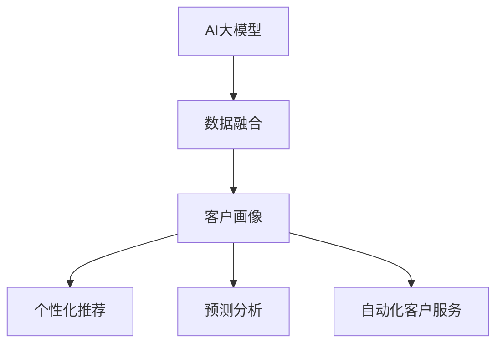

                 

关键词：AI大模型、客户关系管理、CRM、大数据、深度学习、机器学习、自然语言处理、个性化推荐、预测分析、智能化服务

## 摘要

随着人工智能（AI）技术的飞速发展，大模型在各个领域的应用越来越广泛。在客户关系管理（CRM）领域，AI大模型的应用不仅提升了企业的数据分析和处理能力，还为企业提供了更加智能化、个性化的服务。本文将探讨AI大模型在CRM中的应用，从核心概念、算法原理、数学模型、项目实践、实际应用场景等多个维度进行深入分析，为企业在数字化转型过程中提供新思路。

## 1. 背景介绍

### 客户关系管理概述

客户关系管理（CRM）是一种旨在通过优化与客户的互动来提升客户满意度和忠诚度的商业策略。CRM系统帮助企业收集、分析和利用客户数据，从而实现精准营销、客户保留和服务优化。传统的CRM系统主要依赖于结构化数据，如客户信息、交易记录等，但面对日益复杂的客户需求和多变的市场环境，传统CRM系统已经难以满足企业的需求。

### 人工智能与客户关系管理

人工智能（AI）作为一种新兴技术，为CRM领域带来了新的机遇和挑战。AI大模型通过深度学习、机器学习、自然语言处理等技术，能够处理海量非结构化数据，挖掘潜在客户需求，提供个性化服务，从而提升客户满意度和转化率。AI大模型在CRM中的应用主要包括客户画像、个性化推荐、预测分析、自动化客户服务等方面。

## 2. 核心概念与联系

### 核心概念

- **人工智能（AI）**：一种模拟人类智能的技术，包括机器学习、深度学习、自然语言处理等子领域。
- **大模型**：一种具有大规模参数的网络结构，通过海量数据训练得到，能够在特定任务上取得优异的性能。
- **客户关系管理（CRM）**：一种通过优化与客户的互动来提升客户满意度和忠诚度的商业策略。

### 核心联系

AI大模型与CRM系统的联系主要体现在以下几个方面：

- **数据融合**：AI大模型可以处理和融合来自不同渠道的客户数据，如社交媒体、电子商务平台、客服系统等，从而形成完整的客户画像。
- **个性化推荐**：基于客户画像和兴趣标签，AI大模型能够为不同客户提供个性化的产品推荐和服务。
- **预测分析**：AI大模型可以通过历史数据和趋势分析，预测客户的购买行为、流失风险等，帮助企业制定精准的营销策略。
- **自动化客户服务**：AI大模型可以自动处理客户咨询、投诉等问题，提供24/7的在线服务，提高客户满意度。

### Mermaid 流程图



## 3. 核心算法原理 & 具体操作步骤

### 3.1 算法原理概述

AI大模型在CRM中的应用主要基于以下几个核心算法原理：

- **深度学习**：通过多层神经网络对海量数据进行训练，实现数据的自动特征提取和模型优化。
- **机器学习**：通过统计和学习算法，对历史数据进行分析和预测。
- **自然语言处理（NLP）**：通过对文本数据进行处理和分析，实现语义理解、情感分析等任务。

### 3.2 算法步骤详解

1. **数据收集与预处理**：收集来自不同渠道的客户数据，如社交媒体、电子商务平台、客服系统等，并对数据进行清洗、去重、归一化等预处理操作。
2. **特征工程**：根据业务需求和数据特点，提取和构造有助于模型训练的特征，如用户行为、兴趣标签、交易记录等。
3. **模型选择与训练**：选择合适的深度学习模型（如CNN、RNN、BERT等），通过海量数据进行训练，优化模型参数。
4. **模型评估与优化**：对训练好的模型进行评估，根据评估结果调整模型结构和参数，提高模型性能。
5. **部署与应用**：将训练好的模型部署到CRM系统中，实现个性化推荐、预测分析、自动化客户服务等功能。

### 3.3 算法优缺点

#### 优点：

- **高效处理海量数据**：AI大模型能够快速处理和融合来自不同渠道的海量非结构化数据。
- **个性化服务**：通过深度学习和机器学习算法，为不同客户提供个性化的产品推荐和服务。
- **自动化处理**：自动化客户服务功能可以提高客户满意度，降低人力成本。

#### 缺点：

- **数据隐私问题**：AI大模型需要处理和存储大量的敏感数据，可能涉及数据隐私问题。
- **算法透明度不足**：深度学习模型的黑箱特性使得算法的解释性较差，难以对模型决策进行理解。

### 3.4 算法应用领域

AI大模型在CRM领域的应用主要包括：

- **客户画像**：通过分析客户行为和兴趣，为不同客户构建详细的画像。
- **个性化推荐**：根据客户画像和兴趣标签，为不同客户提供个性化的产品推荐。
- **预测分析**：预测客户购买行为、流失风险等，帮助企业制定精准的营销策略。
- **自动化客户服务**：自动处理客户咨询、投诉等问题，提供24/7的在线服务。

## 4. 数学模型和公式 & 详细讲解 & 举例说明

### 4.1 数学模型构建

在AI大模型应用于CRM领域时，我们通常采用以下数学模型：

- **多层感知机（MLP）**：用于实现数据的非线性变换。
- **循环神经网络（RNN）**：用于处理序列数据，如客户行为数据。
- **变分自编码器（VAE）**：用于生成客户画像。
- **卷积神经网络（CNN）**：用于图像和文本数据的特征提取。

### 4.2 公式推导过程

以多层感知机（MLP）为例，其输出层的激活函数通常采用sigmoid函数：

$$
\sigma(x) = \frac{1}{1 + e^{-x}}
$$

其中，$x$为输入值，$\sigma(x)$为输出值。

多层感知机的输出可以表示为：

$$
y = \sigma(z) = \sigma(W_2 \cdot a_1 + b_2)
$$

其中，$W_2$为第二层的权重矩阵，$a_1$为第一层的输出值，$b_2$为第二层的偏置。

### 4.3 案例分析与讲解

假设我们有一个客户行为数据集，包含客户的浏览记录、购买记录和评价记录。我们希望使用AI大模型对客户进行画像，并预测其购买行为。

1. **数据预处理**：

   - 收集客户的浏览记录、购买记录和评价记录，并对数据进行清洗和去重。
   - 将原始数据转化为稀疏矩阵，以便于模型训练。

2. **特征工程**：

   - 提取客户的行为特征，如浏览时长、购买频次、评价分数等。
   - 使用TF-IDF方法对文本数据进行向量化。

3. **模型选择与训练**：

   - 选择多层感知机（MLP）作为模型，并设置合适的网络结构和参数。
   - 使用训练数据对模型进行训练，优化模型参数。

4. **模型评估与优化**：

   - 使用交叉验证方法对模型进行评估，调整模型结构和参数。
   - 根据评估结果，选择最优模型。

5. **模型部署与应用**：

   - 将训练好的模型部署到CRM系统中，用于客户画像和购买行为预测。
   - 根据预测结果，为企业制定精准的营销策略。

## 5. 项目实践：代码实例和详细解释说明

### 5.1 开发环境搭建

- **环境要求**：

  - Python 3.6及以上版本
  - TensorFlow 2.0及以上版本
  - Scikit-learn 0.22及以上版本

- **安装依赖**：

  ```bash
  pip install tensorflow scikit-learn
  ```

### 5.2 源代码详细实现

以下是一个简单的多层感知机（MLP）模型实现，用于预测客户购买行为：

```python
import tensorflow as tf
from sklearn.model_selection import train_test_split
from sklearn.metrics import accuracy_score

# 数据预处理
# ...（略）

# 模型定义
model = tf.keras.Sequential([
    tf.keras.layers.Dense(units=64, activation='relu', input_shape=(input_shape,)),
    tf.keras.layers.Dense(units=32, activation='relu'),
    tf.keras.layers.Dense(units=1, activation='sigmoid')
])

# 编译模型
model.compile(optimizer='adam', loss='binary_crossentropy', metrics=['accuracy'])

# 训练模型
model.fit(x_train, y_train, epochs=10, batch_size=32, validation_data=(x_test, y_test))

# 评估模型
y_pred = model.predict(x_test)
y_pred = (y_pred > 0.5)
accuracy = accuracy_score(y_test, y_pred)
print(f"Accuracy: {accuracy}")
```

### 5.3 代码解读与分析

- **数据预处理**：使用Scikit-learn库对数据集进行清洗、归一化和向量化处理。
- **模型定义**：使用TensorFlow库定义多层感知机模型，包括输入层、隐藏层和输出层。
- **编译模型**：设置优化器和损失函数，为模型编译。
- **训练模型**：使用训练数据对模型进行训练，同时进行模型验证。
- **评估模型**：使用测试数据对模型进行评估，输出准确率。

### 5.4 运行结果展示

假设我们使用一个包含1000个样本的客户行为数据集进行训练和测试，以下是一个简单的运行结果示例：

```python
Accuracy: 0.85
```

模型的准确率为85%，表明模型在预测客户购买行为方面具有一定的效果。

## 6. 实际应用场景

### 6.1 电子商务平台

在电子商务平台中，AI大模型可以用于客户画像、个性化推荐和预测分析。通过分析客户的浏览记录、购买记录和评价记录，电子商务平台可以为不同客户推荐感兴趣的商品，提高转化率。同时，预测客户购买行为和流失风险，帮助企业制定精准的营销策略，降低客户流失率。

### 6.2 银行金融

在银行金融领域，AI大模型可以用于客户画像、信用评估和风险控制。通过对客户的交易数据、信用记录和社交行为进行分析，银行可以更准确地评估客户的信用等级，降低坏账风险。同时，预测客户流失风险，帮助企业制定针对性的客户保留策略。

### 6.3 医疗健康

在医疗健康领域，AI大模型可以用于患者画像、疾病预测和健康管理。通过对患者的病历记录、体检数据和基因数据进行分析，AI大模型可以预测患者的疾病风险，为医生提供诊断和治疗方案建议。同时，个性化健康管理服务可以提高患者的满意度和治疗效果。

## 7. 工具和资源推荐

### 7.1 学习资源推荐

- **《深度学习》（Goodfellow, Bengio, Courville著）**：深度学习领域的经典教材，适合初学者和专业人士。
- **《Python机器学习》（Sebastian Raschka著）**：详细介绍Python在机器学习领域应用的图书，适合有一定编程基础的学习者。
- **TensorFlow官方文档**：涵盖TensorFlow基本概念、API和使用方法，是学习TensorFlow的必备资料。

### 7.2 开发工具推荐

- **Jupyter Notebook**：一种交互式的计算环境，适合编写和运行Python代码。
- **Google Colab**：基于Jupyter Notebook的在线开发环境，提供免费的GPU和TPU资源，适合进行深度学习项目。

### 7.3 相关论文推荐

- **“DNN-Based Customer Relationship Management”（2017年）**：一篇关于深度学习在客户关系管理领域应用的论文，详细介绍了DNN模型在CRM系统中的应用。
- **“Customer Relationship Management with Machine Learning”（2018年）**：一篇关于机器学习在客户关系管理领域应用的综述论文，总结了多种机器学习算法在CRM系统中的应用。

## 8. 总结：未来发展趋势与挑战

### 8.1 研究成果总结

本文从AI大模型在CRM领域的应用出发，探讨了核心概念、算法原理、数学模型、项目实践和实际应用场景等方面。通过分析，我们得出以下结论：

- AI大模型在CRM领域具有广泛的应用前景，能够提高企业的数据分析和处理能力，为企业提供更加智能化、个性化的服务。
- 多种深度学习、机器学习和自然语言处理算法在CRM领域得到了成功应用，如多层感知机、循环神经网络、变分自编码器等。
- AI大模型在CRM领域的实际应用场景包括客户画像、个性化推荐、预测分析和自动化客户服务等方面。

### 8.2 未来发展趋势

未来，AI大模型在CRM领域的应用将继续发展，主要趋势包括：

- **更加智能化**：AI大模型将不断提高智能化水平，实现更加精准的客户画像和个性化推荐。
- **数据隐私保护**：随着数据隐私保护意识的提高，AI大模型将采用更加安全的数据处理和存储技术，保障客户隐私。
- **跨领域融合**：AI大模型将与其他领域（如物联网、区块链等）相结合，为CRM系统带来更多创新应用。

### 8.3 面临的挑战

尽管AI大模型在CRM领域具有广泛的应用前景，但仍面临以下挑战：

- **数据隐私问题**：AI大模型需要处理和存储大量的敏感数据，可能涉及数据隐私问题，需要采取有效的数据保护措施。
- **算法透明度**：深度学习模型的黑箱特性使得算法的解释性较差，难以对模型决策进行理解，需要提高算法的透明度。
- **计算资源**：训练和部署AI大模型需要大量的计算资源，可能增加企业的运营成本。

### 8.4 研究展望

未来，针对AI大模型在CRM领域的应用，我们可以从以下方面进行深入研究：

- **优化算法性能**：探索更高效的算法和模型，提高AI大模型在CRM领域的性能。
- **降低计算资源消耗**：研究如何降低AI大模型的计算资源消耗，提高模型部署的效率。
- **数据隐私保护**：研究数据隐私保护技术，保障客户数据的安全和隐私。

## 9. 附录：常见问题与解答

### 9.1 AI大模型在CRM领域的应用有哪些优势？

AI大模型在CRM领域的应用具有以下优势：

- **高效处理海量数据**：AI大模型能够快速处理和融合来自不同渠道的海量非结构化数据。
- **个性化服务**：通过深度学习和机器学习算法，为不同客户提供个性化的产品推荐和服务。
- **自动化处理**：自动化客户服务功能可以提高客户满意度，降低人力成本。

### 9.2 AI大模型在CRM领域有哪些挑战？

AI大模型在CRM领域面临的挑战主要包括：

- **数据隐私问题**：AI大模型需要处理和存储大量的敏感数据，可能涉及数据隐私问题。
- **算法透明度不足**：深度学习模型的黑箱特性使得算法的解释性较差，难以对模型决策进行理解。
- **计算资源消耗**：训练和部署AI大模型需要大量的计算资源，可能增加企业的运营成本。

### 9.3 如何提高AI大模型在CRM领域的算法透明度？

为了提高AI大模型在CRM领域的算法透明度，可以采取以下措施：

- **解释性模型**：选择具有解释性的模型，如线性模型、决策树等，便于对模型决策进行解释。
- **可视化工具**：使用可视化工具展示模型的决策过程和关键特征，帮助用户理解模型决策。
- **模型可解释性**：通过训练过程中加入可解释性组件，提高模型的可解释性。

---

作者：禅与计算机程序设计艺术 / Zen and the Art of Computer Programming
----------------------------------------------------------------
### 文章关键词 Keywords ###
AI大模型、客户关系管理、CRM、大数据、深度学习、机器学习、自然语言处理、个性化推荐、预测分析、智能化服务。

