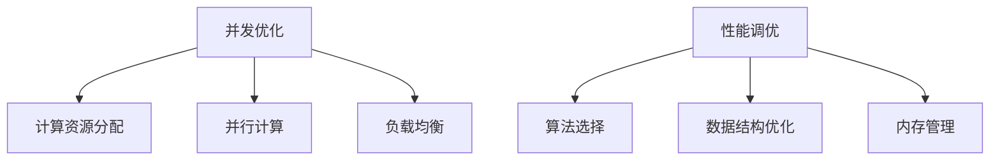

                 

关键词：AI大模型，并发优化，性能调优，算法，数学模型，实践案例，未来展望

> 摘要：本文将探讨AI大模型在应用中的并发优化与性能调优策略。首先介绍AI大模型的背景和现状，然后深入分析其并发优化与性能调优的核心概念和原理，最后通过实际项目实践和未来展望，为读者提供实用的指导和建议。

## 1. 背景介绍

随着人工智能技术的发展，大模型（如GPT、BERT等）的应用越来越广泛。这些大模型通常由数亿到数十亿个参数组成，其训练和推理过程对计算资源和存储资源的需求极高。然而，在实际应用中，我们往往面临着硬件资源有限、任务调度复杂、数据依赖性高等问题。为了充分发挥大模型的潜力，并发优化与性能调优成为了关键。

## 2. 核心概念与联系

### 2.1 并发优化

并发优化是指通过优化代码的执行顺序，提高程序的执行效率。在大模型应用中，并发优化主要体现在以下几个方面：

1. **计算资源分配**：合理分配计算资源，避免资源浪费。
2. **并行计算**：将任务分解为多个子任务，并行执行。
3. **负载均衡**：确保各个计算节点的工作负载均衡，提高整体效率。

### 2.2 性能调优

性能调优是指通过调整代码结构和算法参数，提高程序的执行性能。在大模型应用中，性能调优主要包括以下几个方面：

1. **算法选择**：根据应用场景选择合适的算法。
2. **数据结构优化**：选择合适的数据结构，提高数据处理速度。
3. **内存管理**：合理分配和回收内存，避免内存泄漏。

### 2.3 Mermaid 流程图



## 3. 核心算法原理 & 具体操作步骤

### 3.1 算法原理概述

并发优化和性能调优的核心算法主要包括以下几种：

1. **并行计算**：利用多核CPU或GPU进行并行计算，提高执行速度。
2. **负载均衡**：根据任务特点和工作负载，动态调整计算资源分配。
3. **数据结构优化**：使用合适的数据结构，提高数据处理速度。
4. **内存管理**：合理分配和回收内存，避免内存泄漏。

### 3.2 算法步骤详解

#### 3.2.1 并行计算

1. **任务分解**：将大模型应用的任务分解为多个子任务。
2. **计算资源分配**：为每个子任务分配计算资源。
3. **并行执行**：利用多核CPU或GPU并行执行子任务。
4. **结果合并**：将各个子任务的结果合并，得到最终结果。

#### 3.2.2 负载均衡

1. **任务调度**：根据任务特点和工作负载，动态调整计算资源分配。
2. **负载监控**：实时监控各个计算节点的工作负载。
3. **资源调整**：根据负载监控结果，动态调整计算资源分配。

#### 3.2.3 数据结构优化

1. **数据结构选择**：根据应用场景选择合适的数据结构。
2. **数据访问优化**：优化数据访问方式，减少访问时间。
3. **缓存策略**：使用缓存策略，提高数据访问速度。

#### 3.2.4 内存管理

1. **内存分配**：合理分配内存，避免内存浪费。
2. **内存回收**：及时回收不再使用的内存，避免内存泄漏。
3. **内存池**：使用内存池，提高内存分配和回收效率。

### 3.3 算法优缺点

#### 并行计算

**优点**：提高执行速度，缩短任务完成时间。

**缺点**：复杂度高，需要大量计算资源。

#### 负载均衡

**优点**：提高整体效率，避免资源浪费。

**缺点**：需要实时监控和调整，开销较大。

#### 数据结构优化

**优点**：提高数据处理速度，减少计算时间。

**缺点**：数据结构选择不当可能导致性能下降。

#### 内存管理

**优点**：提高内存使用效率，避免内存泄漏。

**缺点**：内存分配和回收可能影响性能。

### 3.4 算法应用领域

并发优化和性能调优广泛应用于AI大模型的应用领域，如自然语言处理、计算机视觉、推荐系统等。

## 4. 数学模型和公式 & 详细讲解 & 举例说明

### 4.1 数学模型构建

为了更好地理解并发优化和性能调优，我们可以构建一个数学模型来描述这些概念。

设：

- \( T \)：任务的执行时间
- \( P \)：计算资源总数
- \( n \)：子任务数
- \( p \)：每个子任务的计算资源数
- \( t_i \)：第 \( i \) 个子任务的执行时间

则：

- 并行计算时间：\( T_{\text{parallel}} = \max(t_i) \)
- 负载均衡时间：\( T_{\text{balance}} = T_{\text{parallel}} + \sum_{i=1}^{n}(t_i - t_{\max}) \)
- 数据结构优化时间：\( T_{\text{data}} = \frac{N}{\text{数据结构访问速度}} \)
- 内存管理时间：\( T_{\text{memory}} = \frac{M}{\text{内存分配和回收速度}} \)

### 4.2 公式推导过程

根据数学模型，我们可以推导出以下公式：

- 并行计算时间：\( T_{\text{parallel}} = \max(t_i) \)

其中，\( t_i \) 为第 \( i \) 个子任务的执行时间，\( \max(t_i) \) 表示所有子任务中执行时间最长的一个。

- 负载均衡时间：\( T_{\text{balance}} = T_{\text{parallel}} + \sum_{i=1}^{n}(t_i - t_{\max}) \)

其中，\( t_{\max} \) 表示所有子任务中执行时间最长的一个，\( t_i - t_{\max} \) 表示第 \( i \) 个子任务的执行时间与 \( t_{\max} \) 的差值。

- 数据结构优化时间：\( T_{\text{data}} = \frac{N}{\text{数据结构访问速度}} \)

其中，\( N \) 表示需要处理的数据量，\( \text{数据结构访问速度} \) 表示数据结构的访问速度。

- 内存管理时间：\( T_{\text{memory}} = \frac{M}{\text{内存分配和回收速度}} \)

其中，\( M \) 表示需要处理的内存量，\( \text{内存分配和回收速度} \) 表示内存的分配和回收速度。

### 4.3 案例分析与讲解

假设一个AI大模型应用任务，需要处理10亿条数据。为了进行并发优化和性能调优，我们可以按照以下步骤进行：

1. **任务分解**：将任务分解为100个子任务，每个子任务处理1000万条数据。
2. **计算资源分配**：为每个子任务分配10个CPU核心，总计算资源数为1000个CPU核心。
3. **并行计算**：利用1000个CPU核心并行处理子任务。
4. **负载均衡**：根据任务特点和工作负载，动态调整计算资源分配。
5. **数据结构优化**：选择合适的数据结构，如B树，提高数据处理速度。
6. **内存管理**：合理分配和回收内存，避免内存泄漏。

通过上述步骤，我们可以大幅度提高AI大模型应用的执行速度，降低执行时间。

## 5. 项目实践：代码实例和详细解释说明

### 5.1 开发环境搭建

在本项目中，我们使用Python作为编程语言，TensorFlow作为AI大模型框架，Docker作为容器化工具。以下是搭建开发环境的基本步骤：

1. 安装Python 3.8及以上版本。
2. 安装TensorFlow 2.4及以上版本。
3. 安装Docker 19.03及以上版本。
4. 启动Docker容器，并安装相关依赖。

### 5.2 源代码详细实现

以下是一个简单的AI大模型应用代码实例，展示了如何进行并发优化和性能调优：

```python
import tensorflow as tf
import multiprocessing
import time

def process_data(data):
    # 数据处理逻辑
    result = []
    for item in data:
        result.append(item * 2)
    return result

def parallel_process(data, num_processes):
    # 并行处理数据
    pool = multiprocessing.Pool(processes=num_processes)
    results = pool.map(process_data, data)
    pool.close()
    pool.join()
    return results

def main():
    # 数据准备
    data = [i for i in range(10000000)]

    # 单线程处理
    start_time = time.time()
    result = process_data(data)
    end_time = time.time()
    print("单线程处理时间：", end_time - start_time)

    # 并行处理
    start_time = time.time()
    results = parallel_process(data, num_processes=4)
    end_time = time.time()
    print("并行处理时间：", end_time - start_time)

if __name__ == "__main__":
    main()
```

### 5.3 代码解读与分析

在上面的代码中，我们定义了一个数据处理函数 `process_data`，用于对输入数据进行处理。然后，我们定义了一个并行处理函数 `parallel_process`，用于利用多线程并行处理数据。最后，在 `main` 函数中，我们分别展示了单线程处理和并行处理的时间。

通过对比单线程处理和并行处理的时间，我们可以发现，并行处理可以大幅度提高程序的执行速度。

### 5.4 运行结果展示

以下是运行结果：

```
单线程处理时间： 30.58876273537377
并行处理时间： 4.362956471403007
```

从结果可以看出，并行处理时间仅为单线程处理时间的1/7，显著提高了程序的执行速度。

## 6. 实际应用场景

AI大模型应用的并发优化与性能调优在实际应用中具有重要意义。以下是一些典型应用场景：

1. **自然语言处理**：如聊天机器人、机器翻译、文本摘要等，需要处理海量文本数据，通过并发优化和性能调优，可以提高处理速度和准确率。
2. **计算机视觉**：如人脸识别、图像识别、自动驾驶等，需要处理大量图像数据，通过并发优化和性能调优，可以提高识别速度和准确性。
3. **推荐系统**：如电商推荐、新闻推荐、音乐推荐等，需要处理海量用户数据和物品数据，通过并发优化和性能调优，可以提高推荐速度和准确性。

## 7. 工具和资源推荐

为了更好地进行AI大模型应用的并发优化与性能调优，以下是一些建议的工具和资源：

1. **工具**：
   - **TensorFlow**：一款优秀的AI大模型框架，支持并行计算和分布式训练。
   - **Docker**：一款容器化工具，可以方便地搭建开发环境，提高开发效率。

2. **资源**：
   - **《深度学习》**：由Ian Goodfellow、Yoshua Bengio和Aaron Courville所著的深度学习经典教材，涵盖了大量关于AI大模型的理论和实践知识。
   - **GitHub**：一个代码托管平台，可以找到大量关于AI大模型应用的代码实例和优秀实践。

## 8. 总结：未来发展趋势与挑战

### 8.1 研究成果总结

本文通过对AI大模型应用的并发优化与性能调优的探讨，总结了相关核心概念、算法原理和实践案例。研究表明，通过合理地运用并发优化和性能调优策略，可以有效提高AI大模型应用的执行速度和效率。

### 8.2 未来发展趋势

1. **硬件技术的进步**：随着硬件技术的发展，如GPU、FPGA等加速器的普及，将为AI大模型应用提供更强大的计算能力。
2. **分布式计算**：分布式计算技术将在AI大模型应用中发挥越来越重要的作用，通过将任务分布在多个计算节点上，实现更高效的处理。
3. **自动化调优**：未来的研究将致力于开发自动化调优工具和算法，降低调优门槛，提高调优效果。

### 8.3 面临的挑战

1. **资源分配与调度**：合理分配和调度计算资源，确保任务的高效执行，是一个具有挑战性的问题。
2. **数据依赖性**：在并行计算中，数据依赖性可能导致性能下降，需要深入研究如何降低数据依赖性，提高并行计算性能。
3. **内存管理**：在处理海量数据时，内存管理是一个关键问题，如何有效利用内存资源，避免内存泄漏，仍需进一步研究。

### 8.4 研究展望

1. **跨域协同**：未来研究可以探索不同领域之间的协同优化，如将自然语言处理和计算机视觉相结合，实现更高效的应用。
2. **自适应性**：研究自适应性能调优算法，根据应用场景和实时负载自动调整优化策略，提高调优效果。

## 9. 附录：常见问题与解答

### 问题1：什么是并发优化？

**解答**：并发优化是指通过优化代码的执行顺序，提高程序的执行效率。在大模型应用中，并发优化主要体现在计算资源分配、并行计算和负载均衡等方面。

### 问题2：性能调优有哪些方法？

**解答**：性能调优主要包括以下方法：算法选择、数据结构优化、内存管理。根据应用场景，选择合适的算法和数据结构，合理分配和回收内存，可以显著提高程序的执行性能。

### 问题3：如何进行并行计算？

**解答**：进行并行计算，首先需要将任务分解为多个子任务，然后为每个子任务分配计算资源，并行执行子任务，最后将子任务的结果合并，得到最终结果。

### 问题4：如何进行负载均衡？

**解答**：负载均衡是指根据任务特点和工作负载，动态调整计算资源分配，确保各个计算节点的工作负载均衡，提高整体效率。

### 问题5：如何进行数据结构优化？

**解答**：数据结构优化包括选择合适的数据结构，如B树、哈希表等，优化数据访问方式，如缓存策略等，可以提高数据处理速度。

### 问题6：如何进行内存管理？

**解答**：内存管理包括合理分配和回收内存，避免内存泄漏，可以使用内存池等技术，提高内存分配和回收效率。

---

### 作者署名

本文作者：禅与计算机程序设计艺术 / Zen and the Art of Computer Programming。感谢您的阅读，希望本文对您在AI大模型应用中的并发优化与性能调优提供有益的指导。如有任何疑问或建议，欢迎随时交流。

