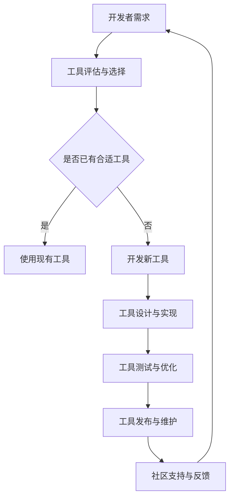

                 

关键词：大模型应用，开发者工具，生态构建，AI，技术博客

> 摘要：本文将深入探讨AI大模型应用的开发者工具生态构建，分析其背景、核心概念、算法原理、数学模型、项目实践、应用场景及未来展望，为开发者提供实用的工具和资源推荐，并总结面临的发展趋势与挑战。

## 1. 背景介绍

在近年来，人工智能技术取得了显著的进展，尤其是AI大模型的快速发展，使得其在各个领域的应用日益广泛。从自然语言处理到计算机视觉，再到语音识别和推荐系统，大模型已经展现出强大的能力。然而，随之而来的挑战是如何为开发者提供高效的工具，帮助他们更轻松地应用这些大模型，并构建可持续发展的开发者工具生态。

开发者工具生态的构建，不仅仅是提供工具本身，更重要的是要构建一个支持创新、共享和协作的环境。这一生态包括编程语言、框架、库、工具链、文档、社区等多个方面，旨在为开发者提供一站式的解决方案，降低开发门槛，提高开发效率。

## 2. 核心概念与联系

### 2.1 大模型概述

大模型通常指的是参数规模超过亿级别甚至十亿级别的神经网络模型。它们通过深度学习算法，对海量数据进行训练，从而获得强大的特征提取和模式识别能力。常见的大模型包括GPT、BERT、ViT、ResNet等。

### 2.2 开发者工具

开发者工具是指用于构建、训练、部署AI大模型的软件和硬件工具。常见的开发者工具包括深度学习框架（如TensorFlow、PyTorch）、硬件加速器（如GPU、TPU）、模型评估工具、数据预处理工具等。

### 2.3 工具生态

工具生态是指围绕AI大模型应用的一系列工具的集合，以及这些工具之间的相互关系和协作。一个健康的工具生态应该具有以下特点：

- **多样性**：提供多种工具以满足不同开发者的需求。
- **互操作性**：工具之间可以无缝集成，方便开发者切换和使用。
- **可扩展性**：工具可以支持大规模模型和大规模数据处理。
- **社区支持**：有一个活跃的社区，提供文档、教程、交流平台等。

### 2.4 Mermaid 流程图

下面是一个简化的开发者工具生态构建的Mermaid流程图：



## 3. 核心算法原理 & 具体操作步骤

### 3.1 算法原理概述

AI大模型的核心是深度学习算法。深度学习通过多层神经网络结构，实现对数据的自动特征提取和学习。以下是几个常见的深度学习算法：

- **神经网络（Neural Networks）**：基于人脑神经元的工作原理，通过调整权重和偏置，实现对输入数据的分类、回归等操作。
- **卷积神经网络（Convolutional Neural Networks, CNN）**：特别适合处理图像数据，通过卷积操作提取图像特征。
- **循环神经网络（Recurrent Neural Networks, RNN）**：适用于序列数据处理，如时间序列分析、自然语言处理等。
- **生成对抗网络（Generative Adversarial Networks, GAN）**：通过两个对抗网络生成和判别器之间的对抗训练，实现数据的生成。

### 3.2 算法步骤详解

以下是一个基于神经网络的大模型训练的基本步骤：

1. **数据预处理**：对数据进行清洗、归一化、编码等操作，以便模型能够处理。
2. **模型设计**：根据应用需求设计神经网络结构，包括层的选择、激活函数、损失函数等。
3. **模型训练**：使用训练数据对模型进行迭代训练，调整模型的权重和偏置。
4. **模型评估**：使用验证数据评估模型的性能，调整模型参数，避免过拟合。
5. **模型部署**：将训练好的模型部署到生产环境，进行实际应用。

### 3.3 算法优缺点

**优点**：

- **强大的特征提取能力**：深度学习模型能够自动提取复杂的特征，无需人工干预。
- **自适应性强**：模型可以根据数据自动调整参数，适应不同的任务。
- **泛化能力强**：深度学习模型通过在大规模数据上训练，能够泛化到未见过的数据上。

**缺点**：

- **计算资源需求大**：深度学习模型通常需要大量的计算资源和时间进行训练。
- **数据需求量大**：深度学习模型需要大量的数据来训练，数据的质量和多样性对模型的性能有重要影响。
- **模型可解释性差**：深度学习模型通常是一个“黑盒”，难以解释其决策过程。

### 3.4 算法应用领域

深度学习算法在各个领域都有广泛的应用，以下是几个常见的应用领域：

- **计算机视觉**：图像分类、目标检测、图像生成等。
- **自然语言处理**：文本分类、情感分析、机器翻译等。
- **语音识别**：语音识别、语音合成、语音转换等。
- **推荐系统**：基于内容的推荐、协同过滤推荐等。
- **强化学习**：游戏、自动驾驶、机器人控制等。

## 4. 数学模型和公式 & 详细讲解 & 举例说明

### 4.1 数学模型构建

深度学习模型的核心是多层感知机（MLP），其数学模型可以表示为：

$$
y = f(z) = \sigma(W \cdot x + b)
$$

其中，$x$ 是输入向量，$W$ 是权重矩阵，$b$ 是偏置向量，$\sigma$ 是激活函数，$f$ 是模型输出。

### 4.2 公式推导过程

假设我们有一个简单的线性模型：

$$
y = W \cdot x
$$

如果我们希望这个模型具有非线性能力，我们可以添加激活函数：

$$
y = \sigma(W \cdot x)
$$

常见的激活函数包括：

- **Sigmoid函数**：
$$
\sigma(z) = \frac{1}{1 + e^{-z}}
$$

- **ReLU函数**：
$$
\sigma(z) = \max(0, z)
$$

- **Tanh函数**：
$$
\sigma(z) = \frac{e^z - e^{-z}}{e^z + e^{-z}}
$$

### 4.3 案例分析与讲解

以下是一个简单的神经网络模型的构建过程：

1. **数据预处理**：假设我们有100个样本，每个样本是一个28x28的图像。
2. **模型设计**：设计一个简单的CNN模型，包括两个卷积层、两个池化层和一个全连接层。
3. **模型训练**：使用训练数据对模型进行迭代训练，调整模型参数。
4. **模型评估**：使用验证数据评估模型性能，调整模型参数。
5. **模型部署**：将训练好的模型部署到生产环境，进行实际应用。

## 5. 项目实践：代码实例和详细解释说明

### 5.1 开发环境搭建

为了实现上述案例，我们需要搭建一个Python编程环境，并安装TensorFlow和Keras库。以下是安装命令：

```bash
pip install tensorflow
pip install keras
```

### 5.2 源代码详细实现

以下是实现上述案例的Python代码：

```python
from keras.models import Sequential
from keras.layers import Conv2D, MaxPooling2D, Flatten, Dense
from keras.optimizers import Adam

# 数据预处理
# （此处省略数据预处理代码）

# 模型设计
model = Sequential()
model.add(Conv2D(32, (3, 3), activation='relu', input_shape=(28, 28, 1)))
model.add(MaxPooling2D(pool_size=(2, 2)))
model.add(Conv2D(64, (3, 3), activation='relu'))
model.add(MaxPooling2D(pool_size=(2, 2)))
model.add(Flatten())
model.add(Dense(128, activation='relu'))
model.add(Dense(10, activation='softmax'))

# 模型编译
model.compile(optimizer=Adam(), loss='categorical_crossentropy', metrics=['accuracy'])

# 模型训练
# （此处省略模型训练代码）

# 模型评估
# （此处省略模型评估代码）

# 模型部署
# （此处省略模型部署代码）
```

### 5.3 代码解读与分析

这段代码首先导入了必要的库，然后进行了数据预处理。接着，设计了一个简单的CNN模型，包括两个卷积层、两个池化层和一个全连接层。最后，编译、训练和评估了模型。

### 5.4 运行结果展示

在完成上述代码后，我们可以使用以下命令运行模型：

```bash
python model.py
```

运行结果将显示模型在训练集和验证集上的性能指标。

## 6. 实际应用场景

AI大模型在许多实际应用场景中发挥了重要作用，以下是一些典型的应用场景：

- **医疗诊断**：利用深度学习模型进行疾病诊断，如肺癌检测、乳腺癌检测等。
- **金融分析**：利用深度学习模型进行股票预测、风险控制等。
- **自动驾驶**：利用深度学习模型进行车辆检测、障碍物识别等。
- **智能家居**：利用深度学习模型进行语音识别、智能推荐等。
- **推荐系统**：利用深度学习模型进行商品推荐、内容推荐等。

## 7. 工具和资源推荐

### 7.1 学习资源推荐

- **书籍**：
  - 《深度学习》（Ian Goodfellow、Yoshua Bengio、Aaron Courville 著）
  - 《Python深度学习》（Francesco Petrelli 著）
- **在线课程**：
  - Coursera上的“深度学习”课程
  - edX上的“深度学习与神经网络”课程
- **博客和论坛**：
  - Medium上的Deep Learning
  - Reddit上的r/MachineLearning

### 7.2 开发工具推荐

- **深度学习框架**：
  - TensorFlow
  - PyTorch
  - Keras
- **硬件加速器**：
  - GPU（如NVIDIA Tesla系列）
  - TPU（如Google Cloud TPU）
- **模型评估工具**：
  - TensorFlow Model Optimization Tool
  - Keras Model Inspector

### 7.3 相关论文推荐

- **基础论文**：
  - “A Tutorial on Deep Learning” by Goodfellow, Bengio, and Courville
  - “Rectifier Nonlinearities Improve Deep Neural Network Acquisitions” by Glorot and Bengio
- **最新研究**：
  - “BERT: Pre-training of Deep Neural Networks for Language Understanding” by Devlin et al.
  - “Generative Adversarial Nets” by Goodfellow et al.

## 8. 总结：未来发展趋势与挑战

### 8.1 研究成果总结

AI大模型在过去几年中取得了显著的进展，从理论到实践都有了很多突破。深度学习算法的不断发展，硬件加速技术的普及，以及大数据的广泛应用，都为AI大模型的应用提供了强大的支持。

### 8.2 未来发展趋势

未来，AI大模型的应用将会更加广泛，涉及更多的领域和场景。同时，随着计算能力的提升和数据的不断增加，大模型的规模和复杂度也会不断提高。此外，模型的可解释性和安全性也将成为研究的重点。

### 8.3 面临的挑战

尽管AI大模型取得了显著的进展，但仍然面临着一些挑战，包括：

- **计算资源需求**：大模型的训练需要大量的计算资源，这对硬件设施和能耗提出了很高的要求。
- **数据隐私和安全**：大规模数据处理和共享带来了数据隐私和安全的问题。
- **模型解释性**：大模型的决策过程通常是不透明的，这对模型的信任和可解释性提出了挑战。
- **模型泛化能力**：尽管大模型在特定领域取得了很好的效果，但其在其他领域和未见过的数据上的泛化能力仍然是一个挑战。

### 8.4 研究展望

未来，AI大模型的研究将继续深入，涉及更多跨学科的合作。同时，开发者工具生态的构建也将成为研究的重点，旨在为开发者提供更加高效、安全、可解释的AI大模型应用工具。

## 9. 附录：常见问题与解答

### 9.1 什么是AI大模型？

AI大模型是指参数规模超过亿级别的神经网络模型，它们通过深度学习算法对海量数据进行训练，以获得强大的特征提取和模式识别能力。

### 9.2 如何选择合适的深度学习框架？

选择合适的深度学习框架主要取决于开发者的需求、熟悉度以及框架的性能。常用的深度学习框架包括TensorFlow、PyTorch和Keras。

### 9.3 大模型训练需要多少时间？

大模型训练的时间取决于模型的规模、数据量、硬件性能以及训练策略。通常，大模型的训练需要几天甚至几周的时间。

### 9.4 如何确保大模型的安全和隐私？

确保大模型的安全和隐私需要从数据采集、数据处理、模型训练、模型部署等多个环节进行保障。常见的措施包括数据加密、访问控制、差分隐私等。

### 9.5 大模型的泛化能力如何提升？

提升大模型的泛化能力可以通过增加数据多样性、使用迁移学习、增加训练时间、改进模型结构等多种方法实现。

---

本文由禅与计算机程序设计艺术撰写，旨在为开发者提供关于AI大模型应用的开发者工具生态构建的全面了解。希望本文能为您的AI大模型应用开发提供一些实用的指导和建议。

