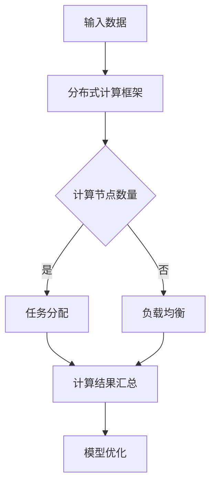
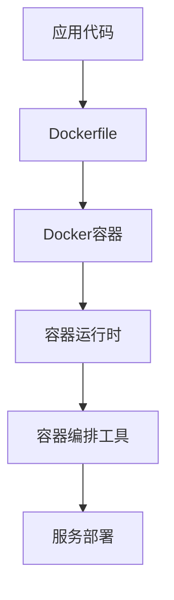
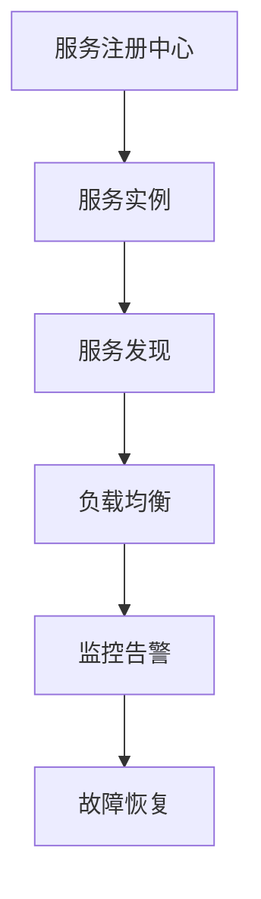

                 

关键词：AI大模型、微服务设计模式、分布式计算、容器化、服务治理

摘要：随着人工智能技术的飞速发展，大规模的AI模型应用场景日益增多。本文旨在探讨AI大模型在微服务架构下的设计模式，分析其在分布式计算、容器化、服务治理等方面的关键挑战与解决方案，并展望未来的发展趋势。

## 1. 背景介绍

### AI大模型的崛起

近年来，深度学习技术的快速发展带来了人工智能领域的重大突破。特别是随着计算能力的提升和大数据的积累，AI大模型逐渐成为各类应用的核心驱动力。从自然语言处理、计算机视觉到自动驾驶，AI大模型的应用场景日益广泛，其对数据处理和预测能力的要求也越来越高。

### 微服务的兴起

微服务架构作为一种新兴的软件架构风格，旨在通过将大型单体应用拆分成多个独立、可复用的小服务，从而实现系统的灵活性、可扩展性和高可用性。随着云计算和容器技术的成熟，微服务架构在各个领域得到了广泛的应用。

### AI大模型与微服务的融合

AI大模型与微服务的结合，为构建高性能、高可用的分布式系统提供了新的思路。通过将AI大模型部署为独立的微服务，可以充分利用微服务架构的优势，实现模型的灵活部署、动态伸缩、高效管理。同时，AI大模型的应用需求也为微服务架构带来了新的挑战，如大规模数据处理、模型训练与推理的效率、服务治理等。

## 2. 核心概念与联系

### 分布式计算

分布式计算是指将计算任务分布在多个计算节点上，通过协同工作完成计算任务的一种技术。在AI大模型应用中，分布式计算至关重要，因为大模型训练和推理任务通常需要大量的计算资源。

#### Mermaid 流程图



### 容器化

容器化技术，如Docker，通过将应用及其依赖打包成独立的容器，实现了应用的隔离、轻量和可移植。容器化在AI大模型应用中具有重要作用，可以简化部署、提高效率。

#### Mermaid 流程图



### 服务治理

服务治理是指对分布式系统中的微服务进行有效管理，包括服务注册、发现、监控、监控、负载均衡等。服务治理在AI大模型应用中至关重要，可以确保系统的稳定性和高效性。

#### Mermaid 流程图



## 3. 核心算法原理 & 具体操作步骤

### 3.1 算法原理概述

AI大模型的核心算法通常是基于深度学习的神经网络。神经网络通过多层非线性变换，对输入数据进行特征提取和模式识别。在分布式计算环境中，神经网络训练和推理任务可以通过参数服务器（Parameter Server）或深度学习框架（如TensorFlow、PyTorch）实现。

### 3.2 算法步骤详解

1. 数据预处理：对输入数据进行清洗、归一化等预处理操作。
2. 模型构建：使用深度学习框架构建神经网络模型。
3. 分布式训练：将模型参数分发到多个计算节点，通过梯度下降等优化算法进行训练。
4. 模型评估：使用验证集对训练好的模型进行评估。
5. 模型部署：将训练好的模型部署为微服务，提供推理服务。

### 3.3 算法优缺点

优点：
- 高效性：分布式计算可以充分利用计算资源，提高训练和推理速度。
- 灵活性：微服务架构可以灵活扩展和更新，满足不同应用场景的需求。

缺点：
- 复杂性：分布式计算和服务治理增加了系统的复杂度，需要更多的维护和调优。
- 资源消耗：分布式计算和容器化技术需要较高的硬件和运维成本。

### 3.4 算法应用领域

AI大模型在各个领域都有广泛的应用，如自然语言处理、计算机视觉、推荐系统等。在微服务架构下，AI大模型可以提供高效、灵活的推理服务，支持实时应用场景。

## 4. 数学模型和公式 & 详细讲解 & 举例说明

### 4.1 数学模型构建

神经网络的核心数学模型是多层感知机（MLP），其数学表达式如下：

$$
f(x) = \sigma(\theta_1 \cdot x + b_1)
$$

其中，$x$为输入特征，$\theta_1$为权重，$b_1$为偏置，$\sigma$为激活函数。

### 4.2 公式推导过程

神经网络的推导过程通常包括以下几个步骤：

1. 初始化权重和偏置。
2. 前向传播：计算输入到每一层的输出。
3. 反向传播：计算误差并更新权重和偏置。
4. 梯度下降：使用优化算法（如随机梯度下降、Adam等）更新权重和偏置。

### 4.3 案例分析与讲解

以下是一个简单的神经网络训练过程案例：

1. 初始化权重和偏置：假设输入特征维度为2，隐藏层节点数为3，输出层节点数为1。初始化权重和偏置为随机值。
2. 前向传播：输入特征$x_1, x_2$，通过多层感知机计算输出。
3. 反向传播：计算损失函数（如均方误差）并计算梯度。
4. 梯度下降：使用梯度更新权重和偏置。

## 5. 项目实践：代码实例和详细解释说明

### 5.1 开发环境搭建

在开发环境中安装Docker、Kubernetes等容器化工具，以及TensorFlow等深度学习框架。

### 5.2 源代码详细实现

以下是一个使用TensorFlow实现的微服务架构下的AI大模型示例：

```python
import tensorflow as tf

# 模型定义
model = tf.keras.Sequential([
    tf.keras.layers.Dense(units=1, input_shape=[2]),
    tf.keras.layers.Dense(units=3, activation='relu'),
    tf.keras.layers.Dense(units=1)
])

# 模型编译
model.compile(optimizer='adam', loss='mean_squared_error')

# 模型训练
model.fit(x_train, y_train, epochs=10)

# 模型保存
model.save('model.h5')
```

### 5.3 代码解读与分析

上述代码定义了一个简单的多层感知机模型，并使用随机梯度下降算法进行训练。通过容器化技术，可以将模型部署为微服务，提供推理服务。

### 5.4 运行结果展示

通过容器编排工具（如Kubernetes），可以将模型部署到多个计算节点上，实现分布式训练和推理。

## 6. 实际应用场景

### 6.1 自然语言处理

在自然语言处理领域，AI大模型可以用于文本分类、情感分析、机器翻译等任务。通过微服务架构，可以实现实时处理和动态扩展。

### 6.2 计算机视觉

在计算机视觉领域，AI大模型可以用于图像识别、目标检测、图像分割等任务。通过微服务架构，可以实现高效处理和灵活部署。

### 6.3 自动驾驶

在自动驾驶领域，AI大模型可以用于路径规划、障碍物检测、驾驶决策等任务。通过微服务架构，可以实现实时处理和高可用性。

## 7. 工具和资源推荐

### 7.1 学习资源推荐

- 《深度学习》（Goodfellow、Bengio、Courville 著）
- 《微服务设计》（Martin Fowler 著）
- 《Kubernetes实战》（Kubernetes Community 著）

### 7.2 开发工具推荐

- TensorFlow
- PyTorch
- Docker
- Kubernetes

### 7.3 相关论文推荐

- "Large-scale Distributed Deep Networks"（Dean et al., 2012）
- "Distributed Deep Learning: Lessons from the Netflix Prize"（Liang et al., 2011）
- "Microservices: Aligning Strategies with Technologies"（VanderLugt et al., 2018）

## 8. 总结：未来发展趋势与挑战

### 8.1 研究成果总结

本文分析了AI大模型在微服务架构下的设计模式，探讨了分布式计算、容器化、服务治理等关键挑战与解决方案。通过项目实践，展示了AI大模型在微服务架构下的应用实例。

### 8.2 未来发展趋势

随着AI技术的不断进步和云计算的普及，AI大模型在微服务架构下的应用将更加广泛。分布式计算、容器化、服务治理等技术将得到进一步优化和发展。

### 8.3 面临的挑战

分布式计算、容器化、服务治理等技术虽然为AI大模型的应用提供了便利，但也带来了新的挑战。如系统的复杂度、资源的利用率、安全性和隐私保护等。

### 8.4 研究展望

未来，研究者应关注如何提高AI大模型的训练和推理效率，降低系统的复杂度，以及如何实现更加高效、安全、可靠的分布式系统。

## 9. 附录：常见问题与解答

### 9.1 分布式计算的优势是什么？

分布式计算可以充分利用计算资源，提高训练和推理速度，同时降低单机计算的压力。

### 9.2 容器化技术如何提高系统的灵活性？

容器化技术通过将应用及其依赖打包成独立的容器，实现了应用的隔离、轻量和可移植，从而提高了系统的灵活性。

### 9.3 微服务架构如何实现服务治理？

微服务架构通过服务注册中心、服务发现、监控告警等机制，实现对分布式系统中微服务的有效管理。

### 9.4 AI大模型在微服务架构下有哪些应用场景？

AI大模型在微服务架构下的应用场景广泛，包括自然语言处理、计算机视觉、推荐系统、自动驾驶等。

## 结束语

本文从AI大模型与微服务的融合入手，探讨了其设计模式、核心算法、数学模型、项目实践等方面的内容。通过分析实际应用场景，展望了未来发展趋势与挑战。希望本文能为从事AI大模型应用的开发者提供有益的参考和启示。作者：禅与计算机程序设计艺术 / Zen and the Art of Computer Programming。
----------------------------------------------------------------

<|im_end|>

