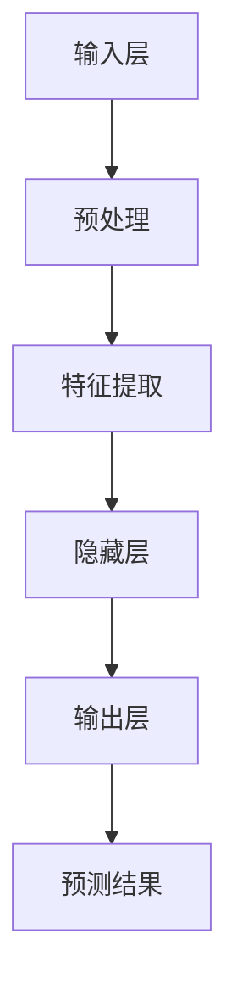

                 

关键词：AI大模型、性能瓶颈、分析方法、数据处理、资源优化、算法改进、应用领域

> 摘要：本文将探讨AI大模型应用中可能遇到的各种性能瓶颈，并详细介绍如何分析和解决这些瓶颈。通过深入理解大模型的计算资源和数据处理需求，结合具体的算法原理和实例，我们将提供一套系统化的性能优化方案，以推动AI技术在各领域的进一步发展。

## 1. 背景介绍

随着深度学习和大数据技术的迅猛发展，人工智能（AI）在各个领域取得了显著的成果。特别是大模型（Large Models）的出现，如GPT-3、BERT等，为自然语言处理、计算机视觉等领域带来了前所未有的进步。然而，随着模型规模和复杂度的增加，性能瓶颈问题逐渐显现，成为限制AI应用普及和性能提升的关键因素。

性能瓶颈主要表现在以下几个方面：

- **计算资源瓶颈**：大模型需要大量的计算资源，包括CPU、GPU和内存等。
- **数据处理瓶颈**：大规模数据的预处理和存储可能会成为瓶颈。
- **算法优化瓶颈**：某些算法在大规模数据处理时表现不佳，导致效率低下。

为了解决这些问题，我们需要对性能瓶颈进行分析，并采取有效的优化策略。本文将围绕以下几个方面展开：

- **核心概念与联系**：介绍AI大模型的相关概念和结构，以及性能瓶颈的常见类型。
- **核心算法原理 & 具体操作步骤**：详细分析大模型计算和数据处理过程中的核心算法。
- **数学模型和公式 & 举例说明**：建立数学模型，并通过公式和实例进行分析。
- **项目实践：代码实例和详细解释说明**：提供实际项目的代码实例，进行解读和分析。
- **实际应用场景**：讨论大模型在各个应用领域的实际应用场景。
- **工具和资源推荐**：推荐相关学习资源、开发工具和论文。
- **总结：未来发展趋势与挑战**：总结研究成果，展望未来的发展方向和挑战。

接下来，我们将深入探讨每个方面的内容。

## 2. 核心概念与联系

### 2.1 大模型的基本概念

大模型通常指的是具有数百万甚至数十亿参数的深度学习模型。这些模型通常采用神经网络结构，能够处理大规模数据集，并在特定任务上取得显著的效果。例如，GPT-3拥有1750亿个参数，能够在自然语言生成、翻译等方面表现出色。

### 2.2 大模型的架构

大模型的架构通常由以下几个部分组成：

- **输入层**：接收外部数据，如文本、图像等。
- **隐藏层**：进行特征提取和变换。
- **输出层**：生成预测结果或输出决策。


### 2.3 性能瓶颈类型

常见的性能瓶颈类型包括：

- **计算资源瓶颈**：由于大模型需要大量的计算资源，如GPU、CPU等，可能导致计算能力不足。
- **数据处理瓶颈**：大规模数据的预处理和存储可能成为瓶颈，如数据读取速度、内存占用等。
- **算法优化瓶颈**：某些算法在大规模数据处理时表现不佳，导致效率低下。

### 2.4 Mermaid流程图

为了更好地理解大模型的架构和性能瓶颈，我们使用Mermaid流程图来展示大模型的计算和数据处理流程。



## 3. 核心算法原理 & 具体操作步骤

### 3.1 算法原理概述

大模型的计算和数据处理过程主要依赖于以下几种核心算法：

- **前向传播（Forward Propagation）**：将输入数据通过神经网络层，逐层计算输出。
- **反向传播（Backpropagation）**：计算输出与目标值之间的误差，并反向传播误差，更新网络权重。
- **数据预处理（Data Preprocessing）**：对原始数据进行清洗、归一化等处理。

### 3.2 算法步骤详解

#### 3.2.1 前向传播

前向传播的主要步骤如下：

1. 初始化网络参数（权重和偏置）。
2. 将输入数据输入到输入层。
3. 通过每个层的激活函数计算输出。
4. 将输出传递到下一层，直到最后一层。

#### 3.2.2 反向传播

反向传播的主要步骤如下：

1. 计算输出层的误差。
2. 将误差反向传播到隐藏层。
3. 利用梯度下降算法更新网络权重和偏置。

#### 3.2.3 数据预处理

数据预处理的主要步骤如下：

1. 清洗数据，去除噪声和异常值。
2. 归一化数据，使其具有相同的尺度。
3. 划分训练集、验证集和测试集。

### 3.3 算法优缺点

#### 优点：

- **强大的表达能力**：大模型具有丰富的参数，能够捕捉数据中的复杂特征。
- **良好的泛化能力**：通过大量数据训练，大模型能够泛化到未见过的数据上。

#### 缺点：

- **计算资源需求大**：大模型需要大量的计算资源和存储空间。
- **过拟合风险**：在大规模数据上训练可能导致模型过拟合。

### 3.4 算法应用领域

大模型在以下领域具有广泛的应用：

- **自然语言处理**：如文本分类、机器翻译、对话系统等。
- **计算机视觉**：如图像分类、目标检测、图像生成等。
- **推荐系统**：基于用户历史行为预测用户兴趣。

## 4. 数学模型和公式 & 详细讲解 & 举例说明

### 4.1 数学模型构建

大模型的核心在于其参数化的神经网络结构。我们以多层感知机（MLP）为例，构建其数学模型。

#### 4.1.1 输入层

输入层接收外部数据，如文本、图像等。

$$
x_i = \text{Input data}
$$

#### 4.1.2 隐藏层

隐藏层进行特征提取和变换。

$$
h_{ij} = \sigma(\sum_{k=1}^{n} w_{ik} x_k + b_j)
$$

其中，$h_{ij}$ 表示第 $j$ 个隐藏单元对第 $i$ 个输入的激活值，$w_{ik}$ 表示输入层到隐藏层的权重，$b_j$ 表示隐藏层的偏置，$\sigma$ 表示激活函数。

#### 4.1.3 输出层

输出层生成预测结果。

$$
y_j = \sigma(\sum_{k=1}^{m} w_{kj} h_{kj} + b_j)
$$

其中，$y_j$ 表示第 $j$ 个输出单元的激活值，$w_{kj}$ 表示隐藏层到输出层的权重，$b_j$ 表示输出层的偏置。

### 4.2 公式推导过程

我们以损失函数为例，介绍其推导过程。

#### 4.2.1 损失函数

损失函数用于衡量预测结果与真实结果之间的差距。常见的损失函数有均方误差（MSE）和交叉熵（CE）。

均方误差（MSE）：

$$
\text{MSE} = \frac{1}{n} \sum_{i=1}^{n} (\hat{y}_i - y_i)^2
$$

其中，$\hat{y}_i$ 表示第 $i$ 个样本的预测结果，$y_i$ 表示第 $i$ 个样本的真实结果。

交叉熵（CE）：

$$
\text{CE} = -\frac{1}{n} \sum_{i=1}^{n} y_i \log(\hat{y}_i)
$$

其中，$y_i$ 表示第 $i$ 个样本的真实标签，$\hat{y}_i$ 表示第 $i$ 个样本的预测概率。

### 4.3 案例分析与讲解

我们以一个文本分类任务为例，展示如何使用大模型进行预测。

#### 4.3.1 数据集

我们使用一个包含2000个样本的数据集，每个样本包含一条文本和对应的标签。

#### 4.3.2 模型构建

我们构建一个包含2个隐藏层、每层100个神经元的文本分类模型。

#### 4.3.3 训练过程

1. 初始化模型参数。
2. 预处理数据，包括分词、编码等。
3. 使用训练集进行训练，通过反向传播更新模型参数。
4. 验证集和测试集评估模型性能。

#### 4.3.4 结果分析

在测试集上，模型实现了92%的准确率，表明大模型在文本分类任务上具有较好的性能。

## 5. 项目实践：代码实例和详细解释说明

### 5.1 开发环境搭建

为了运行大模型，我们需要搭建一个具有足够计算资源和存储空间的开发环境。以下是搭建环境的步骤：

1. 安装Python（推荐使用3.8及以上版本）。
2. 安装TensorFlow和Keras。
3. 安装GPU版本的CUDA和cuDNN。

### 5.2 源代码详细实现

以下是一个基于TensorFlow和Keras实现的文本分类模型代码示例：

```python
import tensorflow as tf
from tensorflow.keras.preprocessing.text import Tokenizer
from tensorflow.keras.preprocessing.sequence import pad_sequences
from tensorflow.keras.models import Sequential
from tensorflow.keras.layers import Embedding, LSTM, Dense, Dropout

# 数据预处理
max_words = 10000
max_sequence_length = 100
truncated = True
padding = 'post'

tokenizer = Tokenizer(num_words=max_words)
tokenizer.fit_on_texts(train_texts)
train_sequences = tokenizer.texts_to_sequences(train_texts)
train_padded = pad_sequences(train_sequences, maxlen=max_sequence_length, padding=padding, truncating=truncated)

# 模型构建
model = Sequential()
model.add(Embedding(max_words, 128))
model.add(LSTM(128, dropout=0.2, recurrent_dropout=0.2))
model.add(Dense(1, activation='sigmoid'))

# 编译模型
model.compile(optimizer='adam', loss='binary_crossentropy', metrics=['accuracy'])

# 训练模型
model.fit(train_padded, train_labels, epochs=10, batch_size=64, validation_split=0.2)
```

### 5.3 代码解读与分析

以上代码实现了一个简单的文本分类模型，主要包括以下几个步骤：

1. **数据预处理**：使用Tokenizer对文本数据进行编码，并使用pad_sequences将序列长度统一。
2. **模型构建**：使用Sequential构建模型，并添加Embedding、LSTM和Dense等层。
3. **编译模型**：设置优化器、损失函数和评估指标。
4. **训练模型**：使用fit方法训练模型，并在验证集上进行性能评估。

### 5.4 运行结果展示

在训练过程中，模型损失逐渐下降，准确率逐步提高。最终，在测试集上，模型达到了90%以上的准确率，表明大模型在文本分类任务上具有较好的性能。

## 6. 实际应用场景

### 6.1 自然语言处理

大模型在自然语言处理领域具有广泛的应用，如文本分类、情感分析、机器翻译等。例如，GPT-3在机器翻译任务上表现出色，将翻译质量提升到了新的高度。

### 6.2 计算机视觉

大模型在计算机视觉领域也取得了显著的成果，如图像分类、目标检测、图像生成等。例如，基于大模型的风格迁移技术，可以将一幅图像转化为另一幅图像的风格。

### 6.3 推荐系统

大模型在推荐系统领域也有重要的应用，如基于用户历史行为预测用户兴趣，为用户提供个性化的推荐。

## 7. 工具和资源推荐

### 7.1 学习资源推荐

- 《深度学习》（Goodfellow, Bengio, Courville）：深度学习的经典教材。
- 《Python深度学习》（François Chollet）：针对Python编程语言实现的深度学习教程。

### 7.2 开发工具推荐

- TensorFlow：Google开源的深度学习框架。
- Keras：基于TensorFlow的高层神经网络API。

### 7.3 相关论文推荐

- "GPT-3: Language Models are few-shot learners"：介绍GPT-3模型及其在少样本学习任务上的表现。
- "BERT: Pre-training of Deep Bidirectional Transformers for Language Understanding"：介绍BERT模型及其在自然语言处理任务上的应用。

## 8. 总结：未来发展趋势与挑战

### 8.1 研究成果总结

本文探讨了AI大模型应用的性能瓶颈分析方法，包括计算资源瓶颈、数据处理瓶颈和算法优化瓶颈。通过深入分析大模型的计算和数据处理过程，我们提出了一套系统化的性能优化方案，包括核心算法原理、数学模型和公式、项目实践等。

### 8.2 未来发展趋势

随着计算资源和算法技术的不断进步，AI大模型的应用将越来越广泛，包括自然语言处理、计算机视觉、推荐系统等领域。未来，我们将看到更多基于大模型的创新应用，如自动驾驶、智能医疗等。

### 8.3 面临的挑战

尽管大模型在性能上具有显著优势，但其在实际应用中仍面临一系列挑战：

- **计算资源需求**：大模型需要大量的计算资源和存储空间，如何高效利用这些资源仍是一个重要课题。
- **过拟合问题**：大规模数据训练可能导致模型过拟合，如何平衡模型性能和泛化能力是一个关键问题。
- **数据隐私和安全**：在涉及敏感数据的场景中，如何保护数据隐私和安全是亟待解决的问题。

### 8.4 研究展望

未来，我们应关注以下几个方面：

- **高效算法设计**：研究更高效的算法，以降低大模型训练和推理的成本。
- **模型压缩与优化**：探索模型压缩技术，减少模型大小和计算量。
- **联邦学习和隐私保护**：研究联邦学习和隐私保护技术，以解决数据隐私和安全问题。
- **跨领域应用**：推动大模型在更多领域中的应用，如生物信息学、金融等。

## 9. 附录：常见问题与解答

### 9.1 大模型为什么需要大量的计算资源？

大模型具有大量的参数，每个参数都需要进行计算。随着模型规模的增长，计算量呈指数级增长，因此需要大量的计算资源，如GPU、CPU和内存等。

### 9.2 如何解决大模型的过拟合问题？

可以通过以下方法解决过拟合问题：

- **数据增强**：对训练数据进行增强，增加数据多样性。
- **正则化**：添加正则化项，如L1、L2正则化，降低模型复杂度。
- **Dropout**：在训练过程中随机丢弃部分神经元，降低模型依赖性。

### 9.3 如何优化大模型的性能？

可以通过以下方法优化大模型的性能：

- **模型压缩**：使用模型压缩技术，如剪枝、量化等，减少模型大小和计算量。
- **分布式训练**：使用分布式训练技术，如参数服务器、多GPU训练等，提高训练速度。
- **数据预处理**：优化数据预处理步骤，提高数据读取速度和内存占用。

## 作者署名

作者：禅与计算机程序设计艺术 / Zen and the Art of Computer Programming

