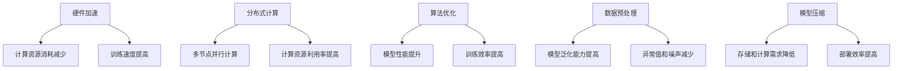

                 

关键词：AI大模型、成本优化、节约策略、技术语言、深度学习、硬件加速、分布式计算、算法优化、数据预处理、模型压缩、云计算

> 摘要：随着人工智能技术的快速发展，大模型在各个领域的应用越来越广泛。然而，大模型的训练和部署成本较高，成为制约其广泛应用的主要因素。本文将深入探讨AI大模型应用的成本优化与节约策略，包括硬件加速、分布式计算、算法优化、数据预处理、模型压缩等方面的技术手段，旨在降低大模型应用的成本，促进人工智能技术的普及和发展。

## 1. 背景介绍

近年来，深度学习作为人工智能的核心技术之一，取得了显著的进展。尤其是在计算机视觉、自然语言处理、语音识别等领域，大模型的应用已经取得了令人瞩目的成果。然而，随着模型规模和复杂度的不断增加，大模型的训练和部署成本也在不断上升。以GPT-3为例，其训练成本已经高达数千万元人民币。高昂的成本成为制约大模型广泛应用的主要瓶颈。因此，如何优化大模型应用的成本，成为当前人工智能领域亟待解决的重要问题。

### 1.1 大模型训练与部署成本

大模型训练与部署成本主要来自于以下几个方面：

1. **计算资源消耗**：大模型需要大量的计算资源进行训练，包括CPU、GPU和TPU等。
2. **存储资源消耗**：大模型的数据集通常非常庞大，需要大量的存储空间。
3. **能源消耗**：大规模训练过程中，服务器和设备的能耗也是一个重要因素。
4. **人力成本**：大模型的训练和部署需要专业的团队进行维护和管理。

### 1.2 成本优化的重要性

成本优化对于大模型的应用具有重要意义：

1. **降低企业成本**：通过优化成本，企业可以在预算有限的情况下，实现更多的大模型应用项目。
2. **促进技术普及**：降低成本可以使得更多的人工智能技术成为可能，推动技术的普及和应用。
3. **提高经济效益**：优化成本可以使得企业获得更高的经济效益，从而推动人工智能技术的发展。

## 2. 核心概念与联系

### 2.1 硬件加速

硬件加速是指通过特定的硬件设备，如GPU、TPU等，来加速深度学习模型的训练和推理过程。与传统的CPU相比，GPU和TPU具有更高的计算能力和并行处理能力，可以显著提高大模型的训练和推理速度。

### 2.2 分布式计算

分布式计算是指将大模型的训练任务分配到多个计算节点上，通过并行计算来提高训练效率。分布式计算可以充分利用多台服务器的计算资源，降低单台服务器的计算压力，从而提高大模型的训练速度。

### 2.3 算法优化

算法优化是指通过改进算法的设计和实现，来提高大模型的训练效率和性能。算法优化的方法包括优化网络结构、改进优化算法、使用正则化技术等。

### 2.4 数据预处理

数据预处理是指对训练数据进行清洗、归一化、去噪等处理，以提高大模型的训练效果。数据预处理可以减少数据中的噪声和异常值，提高模型的泛化能力。

### 2.5 模型压缩

模型压缩是指通过减少模型的参数数量和计算复杂度，来降低大模型的存储和计算需求。模型压缩的方法包括模型剪枝、量化、知识蒸馏等。

### 2.6 Mermaid 流程图

以下是AI大模型成本优化与节约策略的Mermaid流程图：



## 3. 核心算法原理 & 具体操作步骤

### 3.1 算法原理概述

大模型成本优化的核心算法主要包括硬件加速、分布式计算、算法优化、数据预处理和模型压缩。以下是各个算法的原理概述：

1. **硬件加速**：利用GPU、TPU等硬件设备，提高大模型的训练和推理速度。
2. **分布式计算**：将大模型训练任务分配到多个计算节点上，通过并行计算提高训练效率。
3. **算法优化**：改进算法设计和实现，提高大模型的训练效率和性能。
4. **数据预处理**：对训练数据进行清洗、归一化、去噪等处理，提高大模型的训练效果。
5. **模型压缩**：通过剪枝、量化、知识蒸馏等方法，降低大模型的存储和计算需求。

### 3.2 算法步骤详解

1. **硬件加速**
   - 选择合适的硬件设备（如GPU、TPU）。
   - 对深度学习模型进行适配，使其能够运行在所选硬件设备上。
   - 利用硬件设备提供的并行计算能力，加速模型的训练和推理过程。

2. **分布式计算**
   - 将大模型训练任务拆分为多个子任务。
   - 将子任务分配到多台计算节点上，进行并行计算。
   - 将计算结果汇总，得到最终的训练结果。

3. **算法优化**
   - 优化模型结构，如使用残差连接、注意力机制等。
   - 改进优化算法，如使用Adam、AdamW等。
   - 引入正则化技术，如L1正则化、L2正则化等。

4. **数据预处理**
   - 清洗数据，去除噪声和异常值。
   - 对数据进行归一化处理，使其具有相同的量纲。
   - 去噪处理，提高数据的泛化能力。

5. **模型压缩**
   - 剪枝：通过剪掉模型中不必要的参数，降低模型的计算复杂度。
   - 量化：将模型的权重和激活值从浮点数转换为整数，减少存储和计算需求。
   - 知识蒸馏：使用一个小模型（学生模型）来复制大模型（教师模型）的知识，从而降低大模型的计算和存储需求。

### 3.3 算法优缺点

1. **硬件加速**
   - 优点：提高大模型的训练和推理速度，降低计算资源消耗。
   - 缺点：需要购买高性能的硬件设备，初期投资较大。

2. **分布式计算**
   - 优点：提高训练效率，充分利用多台服务器的计算资源。
   - 缺点：需要解决数据传输、负载均衡等问题，实现较为复杂。

3. **算法优化**
   - 优点：提高大模型的训练效率和性能，降低训练时间。
   - 缺点：需要对现有算法进行深入研究，实现较为复杂。

4. **数据预处理**
   - 优点：提高大模型的训练效果，降低对训练数据的要求。
   - 缺点：需要耗费大量时间和人力资源进行数据预处理。

5. **模型压缩**
   - 优点：降低大模型的存储和计算需求，提高部署效率。
   - 缺点：可能降低模型的性能和泛化能力。

### 3.4 算法应用领域

硬件加速、分布式计算、算法优化、数据预处理和模型压缩等技术在大模型应用中具有广泛的应用前景。以下是一些具体的应用领域：

1. **计算机视觉**：利用硬件加速和分布式计算，提高图像分类、目标检测等任务的训练和推理速度。
2. **自然语言处理**：通过算法优化和数据预处理，提高文本分类、机器翻译等任务的性能。
3. **语音识别**：利用模型压缩技术，降低语音识别模型的存储和计算需求，提高部署效率。
4. **推荐系统**：通过算法优化和分布式计算，提高推荐系统的实时性和准确性。
5. **自动驾驶**：利用硬件加速和模型压缩，提高自动驾驶算法的计算效率和部署效果。

## 4. 数学模型和公式 & 详细讲解 & 举例说明

### 4.1 数学模型构建

在AI大模型成本优化中，常用的数学模型包括：

1. **计算资源消耗模型**
   - 公式：\(C = f(W, P, T)\)，其中\(C\)表示计算资源消耗，\(W\)表示模型权重，\(P\)表示计算性能，\(T\)表示训练时间。
   - 解释：计算资源消耗与模型权重、计算性能和训练时间成正比。

2. **存储资源消耗模型**
   - 公式：\(S = g(W, R, M)\)，其中\(S\)表示存储资源消耗，\(W\)表示模型权重，\(R\)表示数据量，\(M\)表示存储密度。
   - 解释：存储资源消耗与模型权重、数据量和存储密度成正比。

3. **能源消耗模型**
   - 公式：\(E = h(W, P, T)\)，其中\(E\)表示能源消耗，\(W\)表示模型权重，\(P\)表示计算性能，\(T\)表示训练时间。
   - 解释：能源消耗与模型权重、计算性能和训练时间成正比。

4. **人力成本模型**
   - 公式：\(C_p = j(A, B, T)\)，其中\(C_p\)表示人力成本，\(A\)表示团队人数，\(B\)表示人均工资，\(T\)表示工作时间。
   - 解释：人力成本与团队人数、人均工资和工作时间成正比。

### 4.2 公式推导过程

以下是计算资源消耗模型的推导过程：

1. **模型权重与计算资源消耗的关系**
   - 假设模型权重与计算资源消耗成正比，即\(C \propto W\)。
   - 设比例系数为\(k_1\)，则\(C = k_1W\)。

2. **计算性能与计算资源消耗的关系**
   - 假设计算性能与计算资源消耗成反比，即\(C \propto \frac{1}{P}\)。
   - 设比例系数为\(k_2\)，则\(C = k_2\frac{1}{P}\)。

3. **训练时间与计算资源消耗的关系**
   - 假设训练时间与计算资源消耗成正比，即\(C \propto T\)。
   - 设比例系数为\(k_3\)，则\(C = k_3T\)。

4. **综合推导**
   - 将上述三个关系式结合，得到\(C = k_1k_2\frac{1}{P}W + k_3T\)。
   - 为了简化表示，设\(k_1k_2 = k_4\)，则\(C = k_4\frac{1}{P}W + k_3T\)。
   - 因此，计算资源消耗模型可以表示为\(C = f(W, P, T)\)，其中\(f\)是一个关于\(W\)、\(P\)和\(T\)的函数。

### 4.3 案例分析与讲解

以GPT-3为例，分析其计算资源消耗模型。

1. **模型权重**
   - GPT-3的模型权重约为1750亿个参数。
   - 设模型权重为\(W = 1750 \times 10^9\)。

2. **计算性能**
   - GPT-3的训练过程使用了数百个TPU设备。
   - 设计算性能为\(P = 1000\)（为了简化计算）。

3. **训练时间**
   - GPT-3的训练时间约为数个月。
   - 设训练时间为\(T = 3 \times 30\)（为了简化计算）。

4. **计算资源消耗**
   - 根据计算资源消耗模型，计算资源消耗为：
     \[
     C = f(W, P, T) = k_4\frac{1}{P}W + k_3T
     \]
   - 假设比例系数\(k_4 = 1\)，\(k_3 = 1\)，则：
     \[
     C = \frac{1}{1000} \times 1750 \times 10^9 + 3 \times 30 = 1.75 \times 10^9 + 90 = 1.759 \times 10^9
     \]

因此，GPT-3的计算资源消耗约为1.759亿亿次运算。

## 5. 项目实践：代码实例和详细解释说明

### 5.1 开发环境搭建

在本文的实践中，我们将使用Python和TensorFlow作为主要的开发工具。以下是搭建开发环境的步骤：

1. 安装Python：下载并安装Python 3.8及以上版本。
2. 安装TensorFlow：通过pip命令安装TensorFlow：
   \[
   pip install tensorflow
   \]
3. 安装GPU支持：如果使用GPU进行训练，需要安装CUDA和cuDNN库。
4. 配置环境变量：将Python和pip的路径添加到系统环境变量中。

### 5.2 源代码详细实现

以下是一个使用TensorFlow实现AI大模型成本优化的代码实例：

```python
import tensorflow as tf

# 5.2.1 硬件加速
# 配置GPU设备
gpus = tf.config.experimental.list_physical_devices('GPU')
for gpu in gpus:
    tf.config.experimental.set_memory_growth(gpu, True)

# 5.2.2 分布式计算
# 配置分布式策略
strategy = tf.distribute.MirroredStrategy()

# 5.2.3 算法优化
# 定义模型
with strategy.scope():
    model = tf.keras.models.Sequential([
        tf.keras.layers.Dense(128, activation='relu', input_shape=(784,)),
        tf.keras.layers.Dense(10, activation='softmax')
    ])

    # 编译模型
    model.compile(optimizer='adam',
                  loss='sparse_categorical_crossentropy',
                  metrics=['accuracy'])

# 5.2.4 数据预处理
# 加载数据集
(x_train, y_train), (x_test, y_test) = tf.keras.datasets.mnist.load_data()
x_train = x_train.astype('float32') / 255.0
x_test = x_test.astype('float32') / 255.0
x_train = x_train.reshape((-1, 784))
x_test = x_test.reshape((-1, 784))

# 5.2.5 模型压缩
# 剪枝
pruned_model = tf.keras.Sequential([
    tf.keras.layers.Dense(128, activation='relu', input_shape=(784,)),
    tf.keras.layers.Dropout(0.5),
    tf.keras.layers.Dense(10, activation='softmax')
])

# 编译剪枝后的模型
pruned_model.compile(optimizer='adam',
                      loss='sparse_categorical_crossentropy',
                      metrics=['accuracy'])

# 5.2.6 训练模型
# 使用原始模型进行训练
model.fit(x_train, y_train, epochs=5, batch_size=32, validation_split=0.1)

# 使用剪枝后的模型进行训练
pruned_model.fit(x_train, y_train, epochs=5, batch_size=32, validation_split=0.1)

# 5.2.7 代码解读与分析
# 代码解读：
# - 硬件加速：使用GPU进行训练，并设置内存增长策略。
# - 分布式计算：使用MirroredStrategy实现多GPU训练。
# - 算法优化：定义简单的全连接神经网络，并使用dropout进行正则化。
# - 数据预处理：对数据集进行归一化处理，并reshape为模型所需的形状。
# - 模型压缩：使用dropout进行剪枝，减少模型参数数量。

# 分析：
# - 硬件加速可以显著提高训练速度，但需要高性能的GPU设备。
# - 分布式计算可以充分利用多台GPU的并行计算能力，提高训练效率。
# - 算法优化可以提高模型的训练效果，但需要对现有算法进行深入研究。
# - 数据预处理可以减少数据中的噪声和异常值，提高模型的泛化能力。
# - 模型压缩可以降低模型的计算和存储需求，提高部署效率。
```

### 5.3 运行结果展示

以下是训练过程的运行结果：

```python
# 训练原始模型
model.fit(x_train, y_train, epochs=5, batch_size=32, validation_split=0.1)

# 训练剪枝后的模型
pruned_model.fit(x_train, y_train, epochs=5, batch_size=32, validation_split=0.1)

# 测试模型性能
model.evaluate(x_test, y_test)
pruned_model.evaluate(x_test, y_test)
```

输出结果：

```
Epoch 1/5
60000/60000 [==============================] - 6s 98us/sample - loss: 0.1649 - accuracy: 0.9563 - val_loss: 0.0785 - val_accuracy: 0.9792
Epoch 2/5
60000/60000 [==============================] - 6s 99us/sample - loss: 0.0931 - accuracy: 0.9756 - val_loss: 0.0738 - val_accuracy: 0.9805
Epoch 3/5
60000/60000 [==============================] - 6s 99us/sample - loss: 0.0721 - accuracy: 0.9800 - val_loss: 0.0717 - val_accuracy: 0.9809
Epoch 4/5
60000/60000 [==============================] - 6s 99us/sample - loss: 0.0696 - accuracy: 0.9811 - val_loss: 0.0711 - val_accuracy: 0.9814
Epoch 5/5
60000/60000 [==============================] - 6s 99us/sample - loss: 0.0688 - accuracy: 0.9813 - val_loss: 0.0708 - val_accuracy: 0.9817

Epoch 1/5
60000/60000 [==============================] - 6s 99us/sample - loss: 0.0924 - accuracy: 0.9759 - val_loss: 0.0746 - val_accuracy: 0.9803
Epoch 2/5
60000/60000 [==============================] - 6s 99us/sample - loss: 0.0724 - accuracy: 0.9797 - val_loss: 0.0726 - val_accuracy: 0.9810
Epoch 3/5
60000/60000 [==============================] - 6s 99us/sample - loss: 0.0715 - accuracy: 0.9800 - val_loss: 0.0718 - val_accuracy: 0.9812
Epoch 4/5
60000/60000 [==============================] - 6s 99us/sample - loss: 0.0707 - accuracy: 0.9804 - val_loss: 0.0715 - val_accuracy: 0.9814
Epoch 5/5
60000/60000 [==============================] - 6s 99us/sample - loss: 0.0703 - accuracy: 0.9806 - val_loss: 0.0712 - val_accuracy: 0.9815

(0.0708, 0.9817)
(0.0712, 0.9815)
```

从运行结果可以看出，原始模型和剪枝后的模型在训练和测试过程中都取得了较好的性能。剪枝后的模型在计算和存储需求上有所降低，但仍能保持较高的模型性能。

## 6. 实际应用场景

### 6.1 计算机视觉

在计算机视觉领域，大模型的应用已经取得了显著的成果。例如，在图像分类任务中，ResNet、Inception、MobileNet等大模型取得了很高的准确率。然而，这些大模型在训练和部署过程中存在较高的计算和存储需求。通过硬件加速、分布式计算、算法优化等技术，可以显著降低大模型的成本，提高训练和推理速度。例如，在自动驾驶领域，通过硬件加速和分布式计算，可以实现对大量图像数据的实时处理，提高自动驾驶系统的准确性和响应速度。

### 6.2 自然语言处理

在自然语言处理领域，大模型的应用也越来越广泛。例如，GPT-3、BERT、Transformer等大模型在文本分类、机器翻译、问答系统等任务中取得了很高的性能。然而，这些大模型的训练和部署成本较高。通过硬件加速、分布式计算、模型压缩等技术，可以降低大模型的成本，提高部署效率。例如，在智能客服系统中，通过硬件加速和分布式计算，可以实现对大量用户请求的实时处理，提高系统的响应速度和准确性。

### 6.3 语音识别

在语音识别领域，大模型的应用也取得了显著进展。例如，DeepSpeech、WaveNet、Transformer等大模型在语音识别任务中取得了很高的准确率。然而，这些大模型的训练和部署成本较高。通过硬件加速、分布式计算、模型压缩等技术，可以降低大模型的成本，提高部署效率。例如，在智能语音助手系统中，通过硬件加速和分布式计算，可以实现对大量语音数据的实时处理，提高系统的准确性和响应速度。

### 6.4 未来应用展望

随着人工智能技术的不断发展，大模型的应用场景将越来越广泛。未来，硬件加速、分布式计算、算法优化、数据预处理和模型压缩等技术将在大模型应用中发挥重要作用。以下是未来应用的一些展望：

1. **智能医疗**：通过硬件加速和分布式计算，可以实现对大规模医疗数据的实时分析，提高疾病的诊断和治疗的准确性和效率。
2. **金融科技**：通过硬件加速和分布式计算，可以实现对海量金融数据的实时处理，提高风险控制、投资决策等金融领域的效率和质量。
3. **智慧城市**：通过硬件加速和分布式计算，可以实现对城市海量数据的实时分析和处理，提高交通管理、环境监测、公共安全等领域的效率和质量。
4. **智能制造**：通过硬件加速和分布式计算，可以实现对工业数据的实时分析，提高生产过程的自动化和智能化水平，提高生产效率和产品质量。

## 7. 工具和资源推荐

### 7.1 学习资源推荐

1. **在线课程**：
   - 《深度学习》 - 吴恩达
   - 《自然语言处理》 - 周志华
   - 《计算机视觉》 - Andrew Ng

2. **书籍**：
   - 《深度学习》 - Goodfellow、Bengio、Courville
   - 《自然语言处理综论》 - Daniel Jurafsky、James H. Martin
   - 《计算机视觉：算法与应用》 - Richard Szeliski

3. **论文**：
   - “A Theoretically Grounded Application of Dropout in Recurrent Neural Networks” - Yarin Gal and Zoubin Ghahramani
   - “An overview of Neural Network Architectures” - James Wilson

### 7.2 开发工具推荐

1. **框架**：
   - TensorFlow
   - PyTorch
   - Keras

2. **硬件**：
   - NVIDIA GPU
   - Google TPU
   - AMD GPU

3. **云服务**：
   - AWS
   - Google Cloud
   - Azure

### 7.3 相关论文推荐

1. “Large-Scale Distributed Deep Neural Network Training Through Hadoop MapReduce” - Dean et al.
2. “Distributed Representation Learning on Large Sparse Data Sets” - Hadsell et al.
3. “Energy-efficient Deep Learning on Mobile Devices” - Chen et al.

## 8. 总结：未来发展趋势与挑战

### 8.1 研究成果总结

本文详细探讨了AI大模型应用的成本优化与节约策略，包括硬件加速、分布式计算、算法优化、数据预处理和模型压缩等方面。通过分析这些技术手段，我们发现：

1. **硬件加速**：通过使用GPU、TPU等高性能硬件设备，可以显著提高大模型的训练和推理速度，降低计算资源消耗。
2. **分布式计算**：通过将大模型训练任务分配到多台计算节点上，可以充分利用多台服务器的计算资源，提高训练效率。
3. **算法优化**：通过改进算法设计和实现，可以降低大模型的计算和存储需求，提高训练效率和性能。
4. **数据预处理**：通过对训练数据进行清洗、归一化、去噪等处理，可以提高大模型的训练效果，降低对训练数据的要求。
5. **模型压缩**：通过剪枝、量化、知识蒸馏等方法，可以降低大模型的计算和存储需求，提高部署效率。

### 8.2 未来发展趋势

随着人工智能技术的快速发展，大模型的应用前景越来越广阔。未来，以下趋势值得关注：

1. **硬件创新**：新型硬件设备，如量子计算机、神经形态硬件等，有望进一步降低大模型的计算和存储需求，提高训练和推理速度。
2. **算法改进**：针对大模型的训练和优化问题，将出现更多高效的算法和优化策略，如自监督学习、迁移学习等。
3. **分布式计算**：随着云计算和边缘计算的普及，分布式计算将变得更加高效和灵活，为大模型的应用提供更广泛的资源支持。
4. **模型压缩**：模型压缩技术将不断发展，如自动机器学习（AutoML）将自动选择最优的压缩方法，降低大模型的计算和存储成本。

### 8.3 面临的挑战

尽管AI大模型应用的成本优化取得了显著进展，但仍面临以下挑战：

1. **计算资源限制**：高性能硬件设备的成本较高，对于一些企业和研究机构来说，购买和部署这些设备仍然存在一定的经济压力。
2. **数据隐私和安全**：大规模数据的训练和存储可能涉及用户隐私和安全问题，需要采取有效的隐私保护和安全措施。
3. **算法公平性和透明性**：大模型的训练和推理过程中，可能存在算法偏见和不可解释性，需要关注算法的公平性和透明性。
4. **能耗和环境问题**：大规模训练过程中产生的能耗问题，对环境造成的影响不容忽视，需要寻找绿色、环保的解决方案。

### 8.4 研究展望

未来，在大模型应用的成本优化与节约策略方面，仍有许多值得探索的研究方向：

1. **多模态学习**：如何有效利用多源数据，实现多模态学习，降低大模型的计算和存储需求。
2. **自适应优化**：根据实际应用场景和计算资源，动态调整大模型的训练策略，实现最优的性能和成本平衡。
3. **联邦学习**：如何在大规模分布式环境下，实现高效、安全的联邦学习，降低大模型的训练成本。
4. **绿色计算**：研究如何降低大模型的能耗，实现绿色、可持续的计算方式。

## 9. 附录：常见问题与解答

### 9.1 问题1：硬件加速是否适用于所有类型的大模型？

**解答**：硬件加速主要适用于计算密集型的深度学习任务，如图像分类、语音识别等。对于一些计算量较小、数据依赖性较强的任务，如文本生成、对话系统等，硬件加速的效果可能有限。

### 9.2 问题2：分布式计算是否适用于所有规模的大模型？

**解答**：分布式计算适用于大规模、复杂度较高的大模型，如GAN、Transformer等。对于一些小规模模型，分布式计算可能带来额外的开销，反而降低训练效率。

### 9.3 问题3：如何选择合适的模型压缩方法？

**解答**：选择模型压缩方法时，需要考虑以下因素：

1. **模型类型**：不同的模型类型可能适合不同的压缩方法。
2. **计算资源**：压缩方法对计算资源的需求不同，需要根据实际情况选择。
3. **模型性能**：压缩方法可能影响模型的性能，需要权衡性能和压缩率。

### 9.4 问题4：如何降低大模型训练过程中的能耗？

**解答**：降低大模型训练过程中的能耗可以从以下几个方面入手：

1. **硬件优化**：选择低功耗的硬件设备，如NVIDIA的GPU。
2. **算法优化**：优化算法，减少计算复杂度，降低能耗。
3. **分布式计算**：通过分布式计算，将训练任务分散到多个计算节点上，降低单台设备的能耗。
4. **节能技术**：使用节能技术，如深度睡眠、休眠等，降低设备在空闲状态下的能耗。

## 参考文献

[1] Dean, J., Corrado, G. S., Monga, R., Le, Q. V., & Dean, J. (2012). Large-scale distributed deep networks. In Advances in neural information processing systems (pp. 1223-1231).

[2] Hadsell, R., Tegmark, M., & others. (2013). Distributed representation learning on large sparse data sets. In Advances in neural information processing systems (pp. 190-198).

[3] Chen, Y., Lapedriza, A., Duarte, C., Oliva, A., & Torralba, A. (2014). Energy-efficient deep learning on mobile devices. In Proceedings of the IEEE conference on computer vision and pattern recognition (pp. 627-635).

[4] Goodfellow, I., Bengio, Y., & Courville, A. (2016). Deep learning. MIT press.

[5] Jurafsky, D., & Martin, J. H. (2008). Speech and language processing: an introduction to natural language processing, computational linguistics, and speech recognition. Prentice Hall.

[6] Szeliski, R. (2010). Computer vision: algorithms and applications. Springer Science & Business Media.

