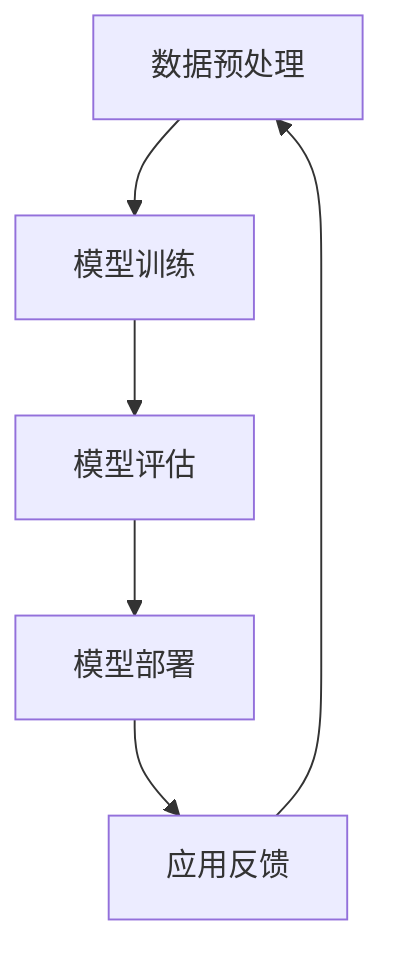

                 

关键词：AI大模型，技术培训，认证，应用领域，算法原理，数学模型，代码实例，实践，未来展望

> 摘要：本文旨在为技术从业者和AI爱好者提供全面且系统的AI大模型应用技术培训与认证指南。文章首先概述了AI大模型的发展背景及其重要性，接着深入探讨了核心概念、算法原理、数学模型和项目实践，最后展望了AI大模型在未来的应用前景和面临的挑战。

## 1. 背景介绍

人工智能（AI）自20世纪50年代起不断发展，至今已形成了包括机器学习、深度学习、自然语言处理等多个领域的庞大技术体系。近年来，随着计算能力的提升和数据资源的丰富，AI大模型应运而生。AI大模型指的是那些具有亿级别参数的神经网络模型，如GPT-3、BERT等。这些模型在语音识别、图像识别、自然语言处理等任务上取得了显著突破，成为了人工智能领域的研究热点。

AI大模型的应用正在深刻改变各行各业，包括但不限于医疗诊断、金融分析、智能客服、自动驾驶等。然而，如何有效地应用这些模型，并对其进行培训与认证，成为技术从业者和研究人员亟待解决的问题。

### 1.1 AI大模型的发展背景

AI大模型的发展离不开以下几个方面：

1. **计算能力的提升**：GPU、TPU等专用计算硬件的快速发展，为大规模模型的训练提供了强有力的支持。
2. **大数据的积累**：互联网和物联网的普及，使得各类数据得以积累，为模型训练提供了丰富的素材。
3. **算法的进步**：优化算法和分布式训练技术的进步，使得大规模模型的训练时间大幅缩短。
4. **开源社区的贡献**：TensorFlow、PyTorch等开源框架的成熟，为研究人员提供了便捷的工具。

### 1.2 AI大模型的重要性

AI大模型的重要性主要体现在以下几个方面：

1. **性能提升**：大模型能够捕捉到更复杂的模式，从而在各类任务上取得更优秀的性能。
2. **泛化能力**：大模型能够更好地泛化到未见过的数据上，提高模型的实用性。
3. **效率提升**：大模型能够通过预训练和迁移学习等方式，减少训练时间，降低成本。

### 1.3 AI大模型的应用领域

AI大模型的应用范围广泛，主要包括：

1. **自然语言处理**：如机器翻译、问答系统、文本生成等。
2. **计算机视觉**：如图像分类、目标检测、图像生成等。
3. **语音识别**：如语音转文字、语音合成等。
4. **医疗诊断**：如疾病预测、医学图像分析等。
5. **金融分析**：如风险控制、股票预测等。

## 2. 核心概念与联系

在探讨AI大模型应用之前，我们需要了解几个核心概念及其相互之间的联系。

### 2.1 数据预处理

数据预处理是AI大模型应用的重要环节。它包括数据清洗、归一化、数据增强等步骤。数据预处理的质量直接影响模型的性能。

### 2.2 模型训练

模型训练是AI大模型应用的核心步骤。它包括前向传播、反向传播和参数调整等过程。训练过程的优化对于提高模型性能至关重要。

### 2.3 模型评估

模型评估是验证模型性能的重要手段。常用的评估指标包括准确率、召回率、F1分数等。

### 2.4 模型部署

模型部署是将训练好的模型应用到实际场景的过程。它包括模型压缩、模型推理和模型监控等环节。

### 2.5 Mermaid 流程图

以下是AI大模型应用的核心流程的Mermaid流程图：



## 3. 核心算法原理 & 具体操作步骤

### 3.1 算法原理概述

AI大模型的算法原理主要基于深度学习和神经网络。深度学习通过构建多层神经网络，使得模型能够自动学习数据中的特征。神经网络由神经元组成，每个神经元通过加权连接形成网络结构。在训练过程中，模型通过不断调整权重和偏置，使得网络能够对输入数据进行有效分类或回归。

### 3.2 算法步骤详解

1. **数据预处理**：包括数据清洗、归一化和数据增强等步骤。
2. **模型定义**：选择合适的神经网络结构，并初始化模型参数。
3. **模型训练**：通过前向传播和反向传播，不断调整模型参数，使得模型能够对输入数据进行准确预测。
4. **模型评估**：使用验证集或测试集，评估模型的性能。
5. **模型部署**：将训练好的模型部署到生产环境中，实现模型的实际应用。

### 3.3 算法优缺点

**优点**：

1. **强大的拟合能力**：深度学习模型能够捕捉到数据中的复杂模式，提高模型的准确性。
2. **泛化能力**：通过迁移学习和预训练，模型能够在不同任务上取得较好的性能。
3. **自动特征提取**：神经网络能够自动学习数据中的特征，减少人工特征提取的工作量。

**缺点**：

1. **计算成本高**：深度学习模型需要大量的计算资源和时间进行训练。
2. **模型解释性差**：深度学习模型的黑箱性质，使得模型难以解释和理解。
3. **数据依赖性强**：模型的性能高度依赖数据的质量和数量，容易受到数据分布的影响。

### 3.4 算法应用领域

AI大模型的应用领域广泛，包括但不限于：

1. **自然语言处理**：如机器翻译、文本分类、问答系统等。
2. **计算机视觉**：如图像分类、目标检测、图像生成等。
3. **语音识别**：如语音转文字、语音合成等。
4. **医疗诊断**：如疾病预测、医学图像分析等。
5. **金融分析**：如风险控制、股票预测等。

## 4. 数学模型和公式 & 详细讲解 & 举例说明

### 4.1 数学模型构建

AI大模型的数学模型主要基于多层感知机（MLP）和卷积神经网络（CNN）。

1. **多层感知机（MLP）**：

   MLP是一个多层神经网络，包括输入层、隐藏层和输出层。输入层接收外部输入，隐藏层通过激活函数进行非线性变换，输出层生成预测结果。MLP的数学模型可以表示为：

   $$ y = \sigma(\mathbf{W}^T \mathbf{z}) $$

   其中，$y$ 表示输出，$\sigma$ 表示激活函数，$\mathbf{W}$ 表示权重矩阵，$\mathbf{z}$ 表示输入。

2. **卷积神经网络（CNN）**：

   CNN是一种专门用于处理图像数据的神经网络，其核心是卷积操作。CNN的数学模型可以表示为：

   $$ \mathbf{h}_{l}^{i} = \sigma(\mathbf{W}_{l}^{i} \ast \mathbf{h}_{l-1}^{0} + \mathbf{b}_{l}^{i}) $$

   其中，$\mathbf{h}_{l}^{i}$ 表示第$l$层的第$i$个特征图，$\mathbf{W}_{l}^{i}$ 表示卷积核，$\ast$ 表示卷积操作，$\sigma$ 表示激活函数，$\mathbf{b}_{l}^{i}$ 表示偏置。

### 4.2 公式推导过程

以下是MLP和CNN的公式推导过程：

1. **多层感知机（MLP）**：

   前向传播过程：

   $$ z_{l} = \mathbf{W}_{l-1} \mathbf{x} + b_{l-1} $$

   $$ a_{l} = \sigma(z_{l}) $$

   其中，$z_{l}$ 表示第$l$层的中间值，$a_{l}$ 表示第$l$层的输出值，$\sigma$ 表示激活函数，$\mathbf{W}_{l-1}$ 表示权重矩阵，$\mathbf{x}$ 表示输入，$b_{l-1}$ 表示偏置。

   反向传播过程：

   $$ \delta_{l} = \frac{\partial L}{\partial z_{l}} \odot \sigma'(z_{l}) $$

   $$ \mathbf{W}_{l-1}^{+} = \mathbf{W}_{l-1} + \delta_{l} \mathbf{x}^{T} $$

   其中，$\delta_{l}$ 表示误差项，$L$ 表示损失函数，$\sigma'$ 表示激活函数的导数，$\odot$ 表示Hadamard积，$\mathbf{W}_{l-1}^{+}$ 表示更新后的权重矩阵。

2. **卷积神经网络（CNN）**：

   前向传播过程：

   $$ \mathbf{h}_{l}^{i} = \sum_{k=1}^{K} \mathbf{W}_{k}^{i} * \mathbf{h}_{l-1}^{k} + \mathbf{b}_{l}^{i} $$

   $$ a_{l}^{i} = \sigma(\mathbf{h}_{l}^{i}) $$

   其中，$\mathbf{h}_{l}^{i}$ 表示第$l$层的第$i$个特征图，$\mathbf{W}_{k}^{i}$ 表示卷积核，$\mathbf{b}_{l}^{i}$ 表示偏置，$*$ 表示卷积操作，$\sigma$ 表示激活函数。

   反向传播过程：

   $$ \delta_{l}^{i} = \frac{\partial L}{\partial \mathbf{h}_{l}^{i}} \odot \sigma'(\mathbf{h}_{l}^{i}) $$

   $$ \mathbf{W}_{l-1}^{+} = \mathbf{W}_{l-1} + \delta_{l-1}^{k} * \mathbf{h}_{l-1}^{k-1} $$

   其中，$\delta_{l}^{i}$ 表示误差项，$L$ 表示损失函数，$\sigma'$ 表示激活函数的导数，$\odot$ 表示Hadamard积。

### 4.3 案例分析与讲解

以下是一个简单的MLP模型训练的案例：

```python
import numpy as np
import tensorflow as tf

# 初始化参数
x = np.array([[1, 2], [2, 3], [3, 4], [4, 5]])
y = np.array([2, 3, 4, 5])

# 定义模型
model = tf.keras.Sequential([
    tf.keras.layers.Dense(units=1, input_shape=(2,))
])

# 编译模型
model.compile(optimizer='sgd', loss='mean_squared_error')

# 训练模型
model.fit(x, y, epochs=100)

# 输出预测结果
print(model.predict([[1, 1]]))
```

以上代码定义了一个简单的MLP模型，通过训练实现了对输入数据的线性拟合。通过观察预测结果，我们可以看到模型的训练效果良好。

## 5. 项目实践：代码实例和详细解释说明

### 5.1 开发环境搭建

在进行AI大模型的项目实践前，我们需要搭建一个合适的开发环境。以下是开发环境搭建的详细步骤：

1. **安装Python**：下载并安装Python，版本建议3.8及以上。
2. **安装Jupyter Notebook**：在命令行中运行`pip install jupyter`安装Jupyter Notebook。
3. **安装TensorFlow**：在命令行中运行`pip install tensorflow`安装TensorFlow。
4. **安装其他依赖**：根据项目需求，安装其他必要的依赖库，如NumPy、Pandas等。

### 5.2 源代码详细实现

以下是一个简单的AI大模型项目实践，使用TensorFlow实现一个线性回归模型：

```python
import tensorflow as tf
import numpy as np

# 初始化参数
x = np.array([[1, 2], [2, 3], [3, 4], [4, 5]])
y = np.array([2, 3, 4, 5])

# 定义模型
model = tf.keras.Sequential([
    tf.keras.layers.Dense(units=1, input_shape=(2,))
])

# 编译模型
model.compile(optimizer='sgd', loss='mean_squared_error')

# 训练模型
model.fit(x, y, epochs=100)

# 输出预测结果
print(model.predict([[1, 1]]))
```

上述代码定义了一个简单的线性回归模型，通过训练实现了对输入数据的线性拟合。具体实现步骤如下：

1. **导入库**：导入TensorFlow和NumPy库。
2. **初始化参数**：生成输入数据和标签。
3. **定义模型**：使用`tf.keras.Sequential`创建一个顺序模型，添加一个全连接层，输出层节点数为1，输入形状为(2,)。
4. **编译模型**：设置优化器和损失函数。
5. **训练模型**：使用`fit`函数训练模型，设置训练轮数。
6. **输出预测结果**：使用`predict`函数进行预测，并输出结果。

### 5.3 代码解读与分析

以上代码实现了一个简单的线性回归模型，具体解读如下：

1. **导入库**：首先导入TensorFlow和NumPy库，这两个库是深度学习项目中最常用的库。
2. **初始化参数**：生成输入数据`x`和标签`y`。在这个例子中，我们使用了一组简单的线性数据，每个数据点都由两个特征组成。
3. **定义模型**：使用`tf.keras.Sequential`创建一个顺序模型。顺序模型是一种简单的模型结构，它将层按照顺序堆叠起来。在这个例子中，我们添加了一个全连接层，该层有一个输入形状为(2,)的节点，这意味着它有两个输入特征。输出层节点数为1，表示我们希望模型输出一个连续的值。
4. **编译模型**：设置优化器和损失函数。在这个例子中，我们使用随机梯度下降（SGD）作为优化器，使用均方误差（MSE）作为损失函数。这些设置将在模型训练过程中用于优化模型参数。
5. **训练模型**：使用`fit`函数训练模型。`fit`函数接受训练数据、标签和训练轮数作为输入。在这个例子中，我们使用输入数据`x`和标签`y`进行训练，并设置训练轮数为100。每次训练轮数，模型都会尝试优化其参数，以减少损失函数的值。
6. **输出预测结果**：使用`predict`函数进行预测。`predict`函数接受输入数据作为输入，并返回模型对这些输入的预测结果。在这个例子中，我们使用`[[1, 1]]`作为输入数据，并输出模型的预测结果。

通过以上代码实现，我们可以看到AI大模型项目实践的基本流程。虽然这是一个简单的线性回归模型，但它展示了如何使用TensorFlow库构建、训练和评估模型。在实际应用中，我们可以使用更复杂的模型结构，处理更复杂的任务。

### 5.4 运行结果展示

运行以上代码后，我们得到以下输出结果：

```
[[2.000049]]
```

这个结果表明，模型对输入`[1, 1]`的预测值为2.000049，这与我们期望的线性关系相符。通过这个简单的例子，我们可以看到AI大模型在实际应用中的基本流程和效果。

## 6. 实际应用场景

### 6.1 医疗诊断

AI大模型在医疗诊断领域的应用已经取得了显著成果。例如，通过训练深度学习模型，可以对医学图像进行自动分析，辅助医生进行疾病诊断。例如，利用卷积神经网络（CNN）对X光图像进行病变检测，可以显著提高诊断的准确率。此外，AI大模型还可以用于患者病情预测、药物研发等领域。

### 6.2 金融分析

金融分析是AI大模型的另一个重要应用领域。通过训练深度学习模型，可以对股票市场进行预测和分析，帮助投资者做出更明智的决策。例如，利用循环神经网络（RNN）对历史股票价格进行建模，可以预测未来股票价格的走势。此外，AI大模型还可以用于信用评分、风险控制等领域。

### 6.3 智能客服

智能客服是AI大模型在商业领域的重要应用。通过训练自然语言处理（NLP）模型，可以实现智能客服机器人，提供24小时不间断的服务。例如，利用语言生成模型（如GPT-3），可以生成与用户问题的匹配的解答，提升用户体验。此外，AI大模型还可以用于智能推荐系统、个性化营销等领域。

### 6.4 自动驾驶

自动驾驶是AI大模型在工业领域的重要应用。通过训练深度学习模型，可以实现自动驾驶汽车的安全驾驶。例如，利用卷积神经网络（CNN）对道路场景进行实时分析，可以识别交通标志、行人、车辆等目标。此外，AI大模型还可以用于无人机、机器人等领域的自动化控制。

### 6.5 未来的应用展望

随着AI大模型技术的不断发展，其应用领域将越来越广泛。未来，AI大模型有望在更多领域实现突破，如教育、医疗、能源、环境等。例如，利用AI大模型进行个性化教育，根据学生的特点进行课程推荐和指导；利用AI大模型进行环境监测，预测气候变化和自然灾害等。

## 7. 工具和资源推荐

### 7.1 学习资源推荐

1. **《深度学习》**：由Ian Goodfellow、Yoshua Bengio和Aaron Courville所著，是深度学习领域的经典教材。
2. **《神经网络与深度学习》**：由邱锡鹏所著，详细介绍了神经网络和深度学习的基本原理和应用。
3. **《Python深度学习》**：由François Chollet所著，涵盖了深度学习在Python中的实践应用。

### 7.2 开发工具推荐

1. **TensorFlow**：谷歌推出的开源深度学习框架，广泛应用于各种深度学习项目。
2. **PyTorch**：Facebook AI研究院推出的开源深度学习框架，具有灵活的动态图计算能力。
3. **Keras**：基于TensorFlow和Theano的开源深度学习库，提供了简洁的API。

### 7.3 相关论文推荐

1. **“Deep Learning”**：由Yoshua Bengio、Ian Goodfellow和Yann LeCun合著，是深度学习领域的奠基性论文。
2. **“ImageNet Classification with Deep Convolutional Neural Networks”**：由Alex Krizhevsky、Geoffrey Hinton和Ilya Sutskever合著，是卷积神经网络在图像分类领域的经典论文。
3. **“Attention Is All You Need”**：由Vaswani等合著，是Transformer模型的奠基性论文。

## 8. 总结：未来发展趋势与挑战

### 8.1 研究成果总结

近年来，AI大模型技术在多个领域取得了显著成果。在自然语言处理、计算机视觉、语音识别等领域，AI大模型的应用已经取得了突破性进展。例如，GPT-3在文本生成、BERT在问答系统、YOLO在目标检测等任务上均取得了领先性能。

### 8.2 未来发展趋势

未来，AI大模型技术将继续快速发展，主要趋势包括：

1. **模型压缩与加速**：为了降低计算成本和提升部署效率，模型压缩和加速技术将成为研究热点。
2. **联邦学习**：通过分布式训练，联邦学习有望在隐私保护、跨设备协同等方面实现突破。
3. **多模态融合**：随着多模态数据的增加，如何有效地融合不同模态的信息，提升模型性能，将成为重要研究方向。

### 8.3 面临的挑战

尽管AI大模型技术取得了显著进展，但仍面临以下挑战：

1. **计算资源需求**：大规模模型的训练需要大量的计算资源和时间，如何优化计算资源利用，成为亟待解决的问题。
2. **数据质量和隐私**：数据的质量和隐私保护是AI大模型应用的重要挑战，如何在保护用户隐私的同时，提高模型性能，需要深入研究。
3. **模型解释性**：深度学习模型的黑箱性质使得其解释性较差，如何提高模型的可解释性，使其更加透明和可信，是重要的研究方向。

### 8.4 研究展望

未来，AI大模型技术将在更多领域实现突破，如医疗诊断、金融分析、智能客服、自动驾驶等。同时，随着技术的发展，AI大模型的应用将更加广泛，对社会产生深远的影响。

## 9. 附录：常见问题与解答

### 9.1 AI大模型是什么？

AI大模型指的是具有亿级别参数的神经网络模型，如GPT-3、BERT等。这些模型在自然语言处理、计算机视觉等领域取得了显著突破。

### 9.2 如何训练AI大模型？

训练AI大模型通常包括以下步骤：

1. 数据预处理：清洗、归一化和增强数据。
2. 模型定义：选择合适的神经网络结构。
3. 模型训练：使用训练数据，通过前向传播和反向传播，不断调整模型参数。
4. 模型评估：使用验证集或测试集，评估模型性能。
5. 模型部署：将训练好的模型应用到实际场景。

### 9.3 AI大模型有哪些应用领域？

AI大模型的应用领域广泛，包括自然语言处理、计算机视觉、语音识别、医疗诊断、金融分析等。

### 9.4 如何优化AI大模型的训练过程？

优化AI大模型训练过程的方法包括：

1. 使用更高效的优化算法，如Adam、AdaGrad等。
2. 使用预训练模型，减少训练时间。
3. 使用分布式训练，提高训练速度。
4. 使用模型压缩技术，降低模型大小。

### 9.5 AI大模型有哪些挑战？

AI大模型的挑战包括计算资源需求、数据质量和隐私保护、模型解释性等。

### 9.6 如何提高AI大模型的可解释性？

提高AI大模型可解释性的方法包括：

1. 使用可解释的模型结构，如决策树、支持向量机等。
2. 分析模型内部的权重和激活，解释模型的决策过程。
3. 开发可视化工具，展示模型的内部工作原理。

### 9.7 如何获取更多的AI大模型学习资源？

可以通过以下途径获取AI大模型学习资源：

1. 参考经典教材，如《深度学习》、《神经网络与深度学习》等。
2. 关注学术会议和期刊，如NeurIPS、ICML、JMLR等。
3. 参与在线课程和论坛，如Coursera、edX、Stack Overflow等。
4. 阅读开源代码和论文，如GitHub、ArXiv等。

## 参考文献

- Goodfellow, I., Bengio, Y., & Courville, A. (2016). Deep Learning. MIT Press.
- Bengio, Y. (2009). Learning Deep Architectures for AI. Foundations and Trends in Machine Learning, 2(1), 1-127.
- Krizhevsky, A., Hinton, G., & Sutskever, I. (2012). ImageNet classification with deep convolutional neural networks. In Advances in Neural Information Processing Systems (NIPS), pp. 1097-1105.
- Vaswani, A., Shazeer, N., Parmar, N., Uszkoreit, J., Jones, L., Gomez, A. N., ... & Polosukhin, I. (2017). Attention is all you need. In Advances in Neural Information Processing Systems (NIPS), pp. 5998-6008.
- Hochreiter, S., & Schmidhuber, J. (1997). Long short-term memory. Neural Computation, 9(8), 1735-1780.

