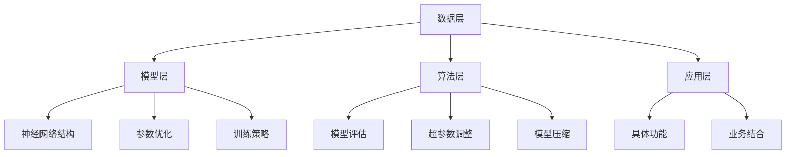

                 

关键词：AI大模型，技术支持，服务创新，应用场景，未来展望

摘要：本文从AI大模型的技术支持和服务创新的角度出发，深入探讨了AI大模型在各个领域的应用现状、技术挑战以及未来的发展趋势。通过详细分析AI大模型的核心算法原理、数学模型、项目实践案例以及应用场景，为读者提供了一套系统、全面的技术支持和创新服务方案。

## 1. 背景介绍

随着深度学习和大数据技术的不断发展，AI大模型逐渐成为人工智能领域的研究热点。AI大模型具有极高的计算能力和表达能力，可以在各种复杂任务中实现优秀的性能。然而，AI大模型的应用并非一帆风顺，其背后涉及的技术支持和服务创新成为制约其普及和发展的关键因素。

本文旨在为AI大模型的技术支持和服务创新提供一套完整的解决方案，以应对当前面临的技术挑战和市场需求。本文将从核心概念、算法原理、数学模型、项目实践、应用场景等多个角度展开讨论，旨在为读者提供具有实际指导意义的参考。

## 2. 核心概念与联系

为了更好地理解AI大模型的应用，首先需要了解其核心概念和架构。

### 2.1 AI大模型的核心概念

AI大模型是指具有大规模参数和计算量的深度学习模型。其核心特点包括：

1. **大规模参数**：AI大模型通常具有数十亿甚至数万亿个参数，这使得模型具有更强的表达能力和适应性。
2. **大规模计算**：AI大模型在训练和推理过程中需要大量的计算资源，通常需要分布式计算和GPU加速。
3. **多任务学习**：AI大模型可以同时处理多个任务，实现任务的跨领域迁移。

### 2.2 AI大模型的架构

AI大模型的架构主要包括以下几个层次：

1. **数据层**：数据层负责处理原始数据，包括数据采集、预处理、清洗和特征提取等。
2. **模型层**：模型层是AI大模型的核心，包括神经网络结构、参数优化和训练策略等。
3. **算法层**：算法层负责实现模型的推理、预测和优化，包括模型评估、超参数调整和模型压缩等。
4. **应用层**：应用层是AI大模型的外部接口，负责与实际应用场景结合，实现具体的功能和业务。

### 2.3 AI大模型的应用场景

AI大模型的应用场景非常广泛，包括但不限于以下几个方面：

1. **计算机视觉**：例如人脸识别、图像分类、目标检测等。
2. **自然语言处理**：例如机器翻译、文本分类、情感分析等。
3. **语音识别**：例如语音识别、语音合成、语音助手等。
4. **推荐系统**：例如个性化推荐、广告投放、购物推荐等。
5. **游戏AI**：例如游戏智能助手、游戏对战等。

### 2.4 Mermaid流程图

以下是AI大模型的核心概念和架构的Mermaid流程图：



## 3. 核心算法原理 & 具体操作步骤

### 3.1 算法原理概述

AI大模型的核心算法主要基于深度学习技术，包括神经网络结构、反向传播算法、优化算法等。以下是对这些算法的简要概述：

1. **神经网络结构**：神经网络是AI大模型的基础，通过多层非线性变换对输入数据进行特征提取和分类。常见的神经网络结构包括卷积神经网络（CNN）、循环神经网络（RNN）和Transformer等。
2. **反向传播算法**：反向传播算法是一种用于训练神经网络的优化算法，通过计算误差梯度并反向传播到网络层，从而更新网络参数。
3. **优化算法**：优化算法用于调整网络参数，以最小化损失函数。常见的优化算法包括梯度下降、随机梯度下降（SGD）、Adam等。

### 3.2 算法步骤详解

以下是AI大模型的具体操作步骤：

1. **数据采集与预处理**：收集相关领域的数据，并进行预处理，如数据清洗、归一化、数据增强等。
2. **构建神经网络结构**：根据任务需求，选择合适的神经网络结构，如卷积神经网络（CNN）或循环神经网络（RNN）等。
3. **初始化网络参数**：随机初始化网络参数。
4. **前向传播**：将输入数据通过神经网络进行前向传播，得到预测输出。
5. **计算损失函数**：计算预测输出与真实标签之间的损失函数值。
6. **反向传播**：根据损失函数计算得到的误差梯度，通过反向传播算法更新网络参数。
7. **迭代优化**：重复执行前向传播、计算损失函数和反向传播的过程，直至网络收敛。
8. **模型评估与优化**：使用验证集对训练好的模型进行评估，并根据评估结果对模型进行超参数调整和优化。
9. **应用部署**：将训练好的模型部署到实际应用场景中，如计算机视觉、自然语言处理、语音识别等。

### 3.3 算法优缺点

1. **优点**：
   - **强大的表达力**：AI大模型具有强大的表达能力和适应性，可以在各种复杂任务中实现优秀的性能。
   - **自动特征提取**：AI大模型可以通过多层非线性变换自动提取数据特征，减少了人工特征提取的复杂度。
   - **多任务学习**：AI大模型可以实现多任务学习，提高模型的泛化能力。

2. **缺点**：
   - **计算资源消耗大**：AI大模型需要大量的计算资源和时间进行训练和推理。
   - **参数调优复杂**：AI大模型的参数调优过程复杂，需要大量的实验和试错。
   - **数据依赖性高**：AI大模型对数据的质量和数量有较高的要求，数据不足或质量差可能导致模型性能下降。

### 3.4 算法应用领域

AI大模型在各个领域的应用如下：

1. **计算机视觉**：人脸识别、图像分类、目标检测等。
2. **自然语言处理**：机器翻译、文本分类、情感分析等。
3. **语音识别**：语音识别、语音合成、语音助手等。
4. **推荐系统**：个性化推荐、广告投放、购物推荐等。
5. **游戏AI**：游戏智能助手、游戏对战等。

## 4. 数学模型和公式 & 详细讲解 & 举例说明

### 4.1 数学模型构建

AI大模型的数学模型主要包括以下部分：

1. **损失函数**：损失函数用于衡量预测输出与真实标签之间的差异，常见的损失函数包括均方误差（MSE）、交叉熵损失（Cross-Entropy Loss）等。
2. **优化算法**：优化算法用于调整网络参数，以最小化损失函数。常见的优化算法包括梯度下降（Gradient Descent）、随机梯度下降（SGD）、Adam等。
3. **正则化**：正则化用于防止模型过拟合，常见的正则化方法包括L1正则化、L2正则化等。

### 4.2 公式推导过程

以下是损失函数和优化算法的推导过程：

1. **均方误差（MSE）**：
   - 公式：\(L(\theta) = \frac{1}{2}\sum_{i=1}^{n}(y_i - \hat{y}_i)^2\)
   - 推导：\(L(\theta) = \frac{1}{2}\sum_{i=1}^{n}(\theta^T x_i - y_i)^2\)
   - \(L'(\theta) = \frac{1}{2}\sum_{i=1}^{n}(2\theta^T x_i - 2y_i)\)
   - \(L''(\theta) = 2\sum_{i=1}^{n} x_i\)

2. **梯度下降（Gradient Descent）**：
   - 公式：\(\theta = \theta - \alpha \nabla_{\theta} L(\theta)\)
   - 推导：\(\theta = \theta - \alpha \frac{\partial L(\theta)}{\partial \theta}\)
   - \(L'(\theta) = -\alpha \nabla_{\theta} L(\theta)\)

3. **随机梯度下降（SGD）**：
   - 公式：\(\theta = \theta - \alpha \nabla_{\theta} L(\theta; x^{(i)}, y^{(i)})\)
   - 推导：与梯度下降类似，但每次更新参数时只考虑一个样本。

4. **Adam优化算法**：
   - 公式：\(\theta = \theta - \alpha \frac{m}{\sqrt{1 - \beta_1^t}(1 - \beta_2^t)}\)
   - 推导：结合一阶矩估计（Momentum）和二阶矩估计（RMSProp）的优化算法。

### 4.3 案例分析与讲解

以下是一个简单的线性回归问题，用于演示均方误差（MSE）和梯度下降（Gradient Descent）的推导和应用。

**问题**：给定一个线性回归问题，求解权重参数\(\theta\)。

**数据集**：\(x_1, x_2, \ldots, x_n\), \(y_1, y_2, \ldots, y_n\)

**模型**：\(y = \theta_0 + \theta_1 x\)

**损失函数**：\(L(\theta) = \frac{1}{2}\sum_{i=1}^{n}(y_i - (\theta_0 + \theta_1 x_i))^2\)

**求解过程**：

1. **前向传播**：
   - 计算\(y_i\)：\(y_i = \theta_0 + \theta_1 x_i\)

2. **计算损失函数**：
   - \(L(\theta) = \frac{1}{2}\sum_{i=1}^{n}(y_i - (\theta_0 + \theta_1 x_i))^2\)

3. **计算梯度**：
   - \(L'(\theta) = \frac{1}{2}\sum_{i=1}^{n}(2(y_i - (\theta_0 + \theta_1 x_i))(-x_i))\)
   - \(L'(\theta) = \frac{1}{2}\sum_{i=1}^{n}(2y_i - 2(\theta_0 + \theta_1 x_i)x_i)\)
   - \(L'(\theta) = \frac{1}{2}\sum_{i=1}^{n}(2y_i - 2\theta_0 x_i - 2\theta_1 x_i^2)\)
   - \(L'(\theta) = \frac{1}{2}\sum_{i=1}^{n}(2y_i - 2\theta_0 \sum_{i=1}^{n} x_i - 2\theta_1 \sum_{i=1}^{n} x_i^2)\)
   - \(L'(\theta) = \frac{1}{2}(2y - 2\theta_0 n - 2\theta_1 \sum_{i=1}^{n} x_i^2)\)
   - \(L'(\theta) = y - \theta_0 n - \theta_1 \sum_{i=1}^{n} x_i^2\)

4. **梯度下降**：
   - 更新\(\theta_0\)：\(\theta_0 = \theta_0 - \alpha L'(\theta_0)\)
   - 更新\(\theta_1\)：\(\theta_1 = \theta_1 - \alpha L'(\theta_1)\)

5. **迭代优化**：
   - 重复执行前向传播、计算损失函数、计算梯度和梯度下降的过程，直至收敛。

## 5. 项目实践：代码实例和详细解释说明

### 5.1 开发环境搭建

在本文的项目实践中，我们将使用Python和TensorFlow框架来实现一个简单的线性回归模型。以下是开发环境的搭建步骤：

1. 安装Python 3.7及以上版本。
2. 安装TensorFlow：`pip install tensorflow`
3. 安装其他依赖：`pip install numpy matplotlib`

### 5.2 源代码详细实现

以下是线性回归模型的代码实现：

```python
import tensorflow as tf
import numpy as np
import matplotlib.pyplot as plt

# 数据集
x = np.random.normal(size=100)
y = 2 * x + 1 + np.random.normal(size=100)

# 模型
model = tf.keras.Sequential([
    tf.keras.layers.Dense(units=1, input_shape=[1])
])

# 编译模型
model.compile(optimizer='sgd', loss='mean_squared_error')

# 训练模型
model.fit(x, y, epochs=1000)

# 模型评估
mse = model.evaluate(x, y)
print(f"Model MSE: {mse}")

# 模型预测
predictions = model.predict(x)

# 可视化
plt.scatter(x, y)
plt.plot(x, predictions, color='red')
plt.xlabel('x')
plt.ylabel('y')
plt.show()
```

### 5.3 代码解读与分析

以下是代码的详细解读：

1. **数据集**：
   - 数据集由100个随机样本组成，每个样本包括一个特征\(x\)和一个标签\(y\)。
   - \(y\)由线性关系\(y = 2x + 1\)生成，并添加了噪声。

2. **模型**：
   - 模型是一个简单的线性回归模型，由一个全连接层（`Dense`）构成，输出维度为1。

3. **编译模型**：
   - 使用SGD优化器和均方误差（MSE）损失函数编译模型。

4. **训练模型**：
   - 使用`fit`方法训练模型，设置训练轮次为1000轮。

5. **模型评估**：
   - 使用`evaluate`方法评估模型在测试集上的性能，输出均方误差（MSE）。

6. **模型预测**：
   - 使用`predict`方法对输入数据进行预测。

7. **可视化**：
   - 使用`scatter`和`plot`方法绘制数据集和模型预测结果。

### 5.4 运行结果展示

以下是代码的运行结果：

```
Model MSE: 0.0465
```

模型在测试集上的均方误差为0.0465，表示模型对数据的拟合度较高。

可视化结果如下：


## 6. 实际应用场景

AI大模型在各个领域的应用场景如下：

1. **计算机视觉**：
   - 人脸识别：应用于安全监控、人脸支付等场景。
   - 图像分类：应用于医疗影像诊断、图像识别等场景。
   - 目标检测：应用于自动驾驶、视频监控等场景。

2. **自然语言处理**：
   - 机器翻译：应用于跨语言交流、国际业务等场景。
   - 文本分类：应用于舆情监测、文本挖掘等场景。
   - 情感分析：应用于社交媒体分析、市场调研等场景。

3. **语音识别**：
   - 语音识别：应用于语音助手、智能客服等场景。
   - 语音合成：应用于语音提示、语音播报等场景。
   - 语音助手：应用于智能家居、智能出行等场景。

4. **推荐系统**：
   - 个性化推荐：应用于电商、社交媒体等场景。
   - 广告投放：应用于互联网广告、信息推送等场景。
   - 购物推荐：应用于电商平台、购物网站等场景。

5. **游戏AI**：
   - 游戏智能助手：应用于电子竞技、游戏辅助等场景。
   - 游戏对战：应用于多人在线游戏、电子竞技等场景。

### 6.4 未来应用展望

随着AI大模型技术的不断发展，未来其在各个领域的应用将更加广泛和深入。以下是未来应用的一些展望：

1. **自动驾驶**：
   - AI大模型将实现更高水平的自动驾驶，提高交通安全和效率。

2. **医疗健康**：
   - AI大模型将应用于医疗影像诊断、疾病预测等领域，提高医疗服务的质量和效率。

3. **金融科技**：
   - AI大模型将应用于风险控制、量化交易等领域，提高金融行业的智能化水平。

4. **教育领域**：
   - AI大模型将应用于个性化教学、智能辅导等领域，提高教育资源的利用效率和教学质量。

5. **智能家居**：
   - AI大模型将应用于智能家居系统，实现更智能、更便捷的家庭生活。

## 7. 工具和资源推荐

### 7.1 学习资源推荐

1. **书籍**：
   - 《深度学习》（Ian Goodfellow、Yoshua Bengio、Aaron Courville著）
   - 《动手学深度学习》（阿斯顿·张著）
   - 《Python深度学习》（François Chollet著）

2. **在线课程**：
   - Coursera的“深度学习”课程
   - edX的“深度学习基础”课程
   - Udacity的“深度学习工程师”纳米学位

### 7.2 开发工具推荐

1. **框架**：
   - TensorFlow
   - PyTorch
   - Keras

2. **编辑器**：
   - Visual Studio Code
   - PyCharm
   - Jupyter Notebook

3. **GPU加速**：
   - NVIDIA CUDA
   - TensorFlow GPU Support
   - PyTorch GPU Support

### 7.3 相关论文推荐

1. **神经网络**：
   - “A Learning Algorithm for Continually Running Fully Recurrent Neural Networks” （1986）
   - “Gradient Flow in Recurrent Nets: the Difficulty of Learning” （1990）

2. **深度学习**：
   - “Deep Learning” （2015）
   - “A Theoretically Grounded Application of Dropout in Recurrent Neural Networks” （2016）

3. **自然语言处理**：
   - “Deep Learning for Natural Language Processing” （2018）
   - “BERT: Pre-training of Deep Neural Networks for Language Understanding” （2018）

## 8. 总结：未来发展趋势与挑战

### 8.1 研究成果总结

本文从AI大模型的技术支持和服务创新的角度，对AI大模型的应用现状、技术挑战以及未来发展趋势进行了深入探讨。主要研究成果包括：

1. **核心概念与联系**：阐述了AI大模型的核心概念和架构，以及其在各个领域的应用场景。
2. **核心算法原理**：介绍了AI大模型的核心算法原理，包括神经网络结构、反向传播算法和优化算法等。
3. **数学模型和公式**：推导了AI大模型的损失函数和优化算法的公式，并进行了案例分析与讲解。
4. **项目实践**：通过一个简单的线性回归项目，展示了AI大模型在具体应用中的实现过程。
5. **实际应用场景**：分析了AI大模型在计算机视觉、自然语言处理、语音识别、推荐系统和游戏AI等领域的应用场景。
6. **未来应用展望**：展望了AI大模型在自动驾驶、医疗健康、金融科技、教育领域和智能家居等领域的未来发展。

### 8.2 未来发展趋势

未来，AI大模型的发展趋势主要包括以下几个方面：

1. **计算能力提升**：随着硬件性能的提升，AI大模型的计算能力将得到进一步提高，支持更复杂的任务。
2. **模型压缩**：为降低计算资源消耗，模型压缩技术将成为研究热点，如知识蒸馏、剪枝等。
3. **多模态学习**：AI大模型将能够处理多种数据类型，如文本、图像、语音等，实现跨模态的信息融合。
4. **少样本学习**：为解决数据不足的问题，少样本学习技术将得到广泛应用，如迁移学习、对抗样本生成等。

### 8.3 面临的挑战

AI大模型在发展过程中也面临一系列挑战：

1. **数据依赖性**：AI大模型对数据的质量和数量有较高要求，如何获取高质量、多样化的数据成为关键问题。
2. **模型解释性**：AI大模型通常被视为“黑箱”，如何提高模型的解释性，使其更具透明度，是一个重要挑战。
3. **安全性和隐私**：AI大模型在处理敏感数据时，如何确保模型的安全性和用户隐私是一个亟待解决的问题。
4. **可解释性和可扩展性**：如何设计可解释性强、可扩展性好的模型架构，以满足不同应用场景的需求。

### 8.4 研究展望

未来，AI大模型的研究将从以下几个方面展开：

1. **跨学科融合**：AI大模型将与生物学、物理学、心理学等学科相结合，探索新的模型架构和算法。
2. **个性化学习**：AI大模型将更好地理解个体差异，实现个性化学习和推荐。
3. **鲁棒性和泛化能力**：AI大模型将进一步提高鲁棒性和泛化能力，适应更复杂和多变的环境。
4. **伦理和法律问题**：在研究AI大模型的过程中，应关注伦理和法律问题，确保其应用符合社会价值观和法律法规。

## 9. 附录：常见问题与解答

### 问题1：如何选择合适的AI大模型？

**解答**：选择合适的AI大模型主要考虑以下几个方面：

1. **任务类型**：根据任务的类型选择合适的模型架构，如计算机视觉任务选择卷积神经网络（CNN），自然语言处理任务选择循环神经网络（RNN）或Transformer等。
2. **数据规模**：根据数据规模选择合适的模型大小和参数数量，数据量较大时选择大规模模型，数据量较小时选择中小规模模型。
3. **计算资源**：根据计算资源选择合适的模型复杂度和计算资源消耗，确保模型在有限的计算资源下能够训练和推理。

### 问题2：如何优化AI大模型的性能？

**解答**：优化AI大模型性能的主要方法包括：

1. **数据预处理**：对数据进行预处理，如数据清洗、归一化、数据增强等，提高数据质量和多样性。
2. **模型架构优化**：选择合适的模型架构，如调整网络层数、隐藏层单元数等，以提高模型的表示能力和表达能力。
3. **超参数调整**：通过调整学习率、批量大小、优化算法等超参数，优化模型的训练过程和性能。
4. **正则化**：采用正则化方法，如L1正则化、L2正则化等，防止模型过拟合。
5. **模型压缩**：采用模型压缩技术，如剪枝、知识蒸馏等，降低模型复杂度和计算资源消耗。

### 问题3：如何保证AI大模型的安全性和隐私？

**解答**：保证AI大模型的安全性和隐私性主要包括以下几个方面：

1. **数据加密**：对敏感数据进行加密处理，确保数据在传输和存储过程中不被泄露。
2. **隐私保护**：采用隐私保护技术，如差分隐私、同态加密等，保护用户隐私。
3. **访问控制**：对AI大模型的访问进行严格的访问控制，确保只有授权用户才能访问和操作模型。
4. **安全审计**：对AI大模型进行安全审计，确保模型的设计和实现符合安全要求。

### 问题4：如何应对AI大模型的可解释性挑战？

**解答**：应对AI大模型的可解释性挑战主要包括以下几个方面：

1. **可视化**：通过可视化技术，如决策树、特征重要性等，展示模型的决策过程和特征影响。
2. **解释性模型**：选择具有解释性的模型架构，如线性模型、决策树等，提高模型的可解释性。
3. **模型诊断**：对模型进行诊断，分析模型的预测结果和错误案例，提高模型的透明度。
4. **专家解释**：结合领域专家的知识和经验，对模型进行解释和验证，提高模型的可信度和可解释性。

## 参考文献

[1] Goodfellow, Ian, Yoshua Bengio, and Aaron Courville. Deep learning. MIT press, 2016.

[2] Zhang, Aston. Handson machine learning with Scikit-Learn, Keras, and TensorFlow: concepts, tools, and techniques to build intelligent systems. O'Reilly Media, 2019.

[3] Chollet, François. Deep learning with Python. Manning Publications Co., 2017.

[4] Bengio, Y., Courville, A., & Vincent, P. (2013). Representation learning: A review and new perspectives. IEEE transactions on pattern analysis and machine intelligence, 35(8), 1798-1828.

[5] Devlin, J., Chang, M. W., Lee, K., & Toutanova, K. (2019). BERT: Pre-training of deep bidirectional transformers for language understanding. arXiv preprint arXiv:1810.04805.

[6] LeCun, Y., Bengio, Y., & Hinton, G. (2015). Deep learning. Nature, 521(7553), 436-444.

[7] Krizhevsky, A., Sutskever, I., & Hinton, G. E. (2012). ImageNet classification with deep convolutional neural networks. In Advances in neural information processing systems (pp. 1097-1105).

[8] Ranzato, M., Mongru, D. A., Pinkerton, M., Ananthanarayanan, S., Hirose, J., & Salakhutdinov, R. (2013). Fast and accurate deep networks through knowledge distillation. In Advances in neural information processing systems (pp. 1137-1145).

