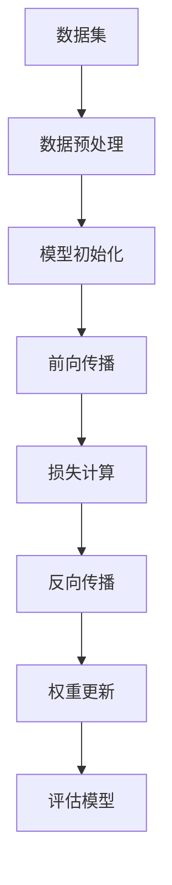

                 

 关键词：
- AI大模型
- 技术白皮书
- 技术写作
- 算法原理
- 数学模型
- 项目实践
- 应用场景
- 资源推荐
- 未来展望

> 摘要：
本文将详细介绍如何撰写一篇关于AI大模型应用的技术白皮书。从背景介绍、核心概念与联系、核心算法原理与步骤、数学模型与公式、项目实践、应用场景、工具与资源推荐，到总结未来发展趋势与挑战，全面指导读者如何系统、高效地完成技术白皮书的撰写。

## 1. 背景介绍

随着人工智能技术的迅猛发展，AI大模型成为当今计算机科学领域的研究热点。AI大模型，特别是基于深度学习的模型，如GPT、BERT、Transformer等，在自然语言处理、计算机视觉、语音识别等领域取得了显著的成果。然而，AI大模型的应用不仅仅是技术实现的简单叠加，更涉及复杂的技术框架、算法原理、数学模型等多个方面。因此，撰写一篇关于AI大模型应用的技术白皮书，不仅要求作者具备深厚的专业知识，还需要对技术写作有深刻的理解。

技术白皮书作为信息技术领域的重要文档，其撰写质量直接影响到读者对技术概念、原理、应用的理解程度。本文旨在为从事AI大模型研究和技术写作的读者提供一份详细的撰写指南，帮助大家更好地完成技术白皮书的撰写工作。

## 2. 核心概念与联系

在撰写AI大模型应用的技术白皮书之前，了解核心概念及其相互之间的联系是至关重要的。以下是一些关键概念：

### 2.1 AI大模型

AI大模型指的是参数规模超过亿级、训练数据量庞大的深度学习模型。这些模型通常采用神经网络架构，通过大量训练数据学习复杂的特征表示和模式。

### 2.2 神经网络

神经网络是AI大模型的基础。它由多层神经元组成，通过前向传播和反向传播算法不断调整权重，以达到对输入数据的分类或回归。

### 2.3 深度学习

深度学习是一种基于神经网络的机器学习技术。通过构建深层的神经网络结构，深度学习能够自动提取数据的高级特征，从而在复杂任务上表现出优异的性能。

### 2.4 数据集与数据预处理

数据集是AI大模型训练的基础。数据预处理包括数据清洗、归一化、数据增强等步骤，以确保模型训练的稳定性和有效性。

### 2.5 训练与评估

训练是指通过优化算法调整模型参数，使其在特定任务上达到预期的性能。评估则是在测试集上对模型性能进行客观评价，以确定其泛化能力。

### 2.6 数学模型

数学模型用于描述AI大模型的工作原理。常见的数学模型包括损失函数、激活函数、优化算法等。

### 2.7 应用领域

AI大模型在自然语言处理、计算机视觉、语音识别等多个领域有广泛应用。例如，GPT在文本生成和机器翻译方面表现出色，BERT在问答系统和文本分类任务中表现优异。

### 2.8 Mermaid 流程图

以下是AI大模型训练过程的Mermaid流程图：



## 3. 核心算法原理 & 具体操作步骤

### 3.1 算法原理概述

AI大模型的核心算法主要包括神经网络结构设计、优化算法、激活函数等。以下是对这些算法原理的概述：

### 3.2 算法步骤详解

#### 3.2.1 神经网络结构设计

1. 选择合适的神经网络架构，如卷积神经网络（CNN）或循环神经网络（RNN）。
2. 定义网络的层数和每层的神经元数量。
3. 确定网络的输入和输出层。

#### 3.2.2 优化算法

1. 选择优化算法，如梯度下降、Adam等。
2. 设置学习率和其他超参数。
3. 训练过程中动态调整超参数。

#### 3.2.3 激活函数

1. 选择激活函数，如ReLU、Sigmoid、Tanh等。
2. 激活函数的作用是在神经网络中引入非线性。
3. 不同的激活函数对模型的性能有重要影响。

### 3.3 算法优缺点

#### 优点：

- 高效：AI大模型能够处理大量数据，快速提取复杂特征。
- 强泛化能力：通过深度学习，模型能够泛化到新的任务和数据集。
- 优秀的性能：在自然语言处理、计算机视觉等领域取得显著成果。

#### 缺点：

- 计算资源消耗大：训练过程需要大量计算资源和时间。
- 对数据质量有较高要求：数据质量直接影响模型的性能。
- 难以解释：深度学习模型难以解释，难以理解其工作原理。

### 3.4 算法应用领域

AI大模型在自然语言处理、计算机视觉、语音识别、推荐系统等多个领域有广泛应用。以下是一些具体的应用：

- 自然语言处理：文本分类、机器翻译、情感分析等。
- 计算机视觉：图像分类、目标检测、图像生成等。
- 语音识别：语音转文本、语音合成等。
- 推荐系统：基于用户行为和内容的个性化推荐。

## 4. 数学模型和公式 & 详细讲解 & 举例说明

### 4.1 数学模型构建

AI大模型的数学模型主要包括以下几个方面：

- 损失函数：用于评估模型预测结果与真实值之间的差距，如交叉熵损失函数、均方误差损失函数。
- 激活函数：如ReLU、Sigmoid、Tanh等，用于引入非线性。
- 优化算法：如梯度下降、Adam等，用于调整模型参数。

### 4.2 公式推导过程

以下是一个简单的神经网络模型的损失函数和梯度推导：

#### 损失函数

假设模型为多层感知机（MLP），其输出层的损失函数为交叉熵损失函数：

$$
L(y, \hat{y}) = -\sum_{i=1}^{n} y_i \log(\hat{y}_i)
$$

其中，$y$为真实标签，$\hat{y}$为模型预测的概率分布。

#### 梯度推导

对损失函数求关于模型参数的梯度：

$$
\frac{\partial L}{\partial w} = -\sum_{i=1}^{n} (y_i - \hat{y}_i) x_i
$$

$$
\frac{\partial L}{\partial b} = -\sum_{i=1}^{n} (y_i - \hat{y}_i)
$$

其中，$w$为权重，$b$为偏置，$x$为输入特征。

### 4.3 案例分析与讲解

以下是一个简单的AI大模型训练过程的案例：

#### 案例背景

假设我们有一个用于图像分类的AI大模型，其输入为32x32的图像，输出为10个类别的概率分布。

#### 案例步骤

1. 数据集：使用CIFAR-10数据集进行训练。
2. 模型初始化：选择一个预训练的模型作为基础模型，然后随机初始化权重和偏置。
3. 训练过程：
   - 前向传播：将图像输入模型，得到输出概率分布。
   - 损失计算：计算损失函数值，如交叉熵损失。
   - 反向传播：根据损失函数梯度，更新模型参数。
   - 评估模型：在验证集上评估模型性能。

#### 案例结果

通过训练，模型在测试集上的准确率达到90%以上，表明模型具有良好的泛化能力。

## 5. 项目实践：代码实例和详细解释说明

### 5.1 开发环境搭建

在撰写技术白皮书时，提供详细的开发环境搭建步骤是非常重要的。以下是一个基于Python和TensorFlow的AI大模型开发环境搭建步骤：

1. 安装Python：下载并安装Python 3.8及以上版本。
2. 安装TensorFlow：使用pip命令安装TensorFlow库。
3. 安装其他依赖：根据项目需求，安装其他必要的库，如NumPy、Pandas等。

### 5.2 源代码详细实现

以下是一个简单的AI大模型训练代码示例：

```python
import tensorflow as tf
from tensorflow.keras import layers

# 模型定义
model = tf.keras.Sequential([
    layers.Flatten(input_shape=(32, 32, 3)),
    layers.Dense(128, activation='relu'),
    layers.Dense(10, activation='softmax')
])

# 模型编译
model.compile(optimizer='adam',
              loss='sparse_categorical_crossentropy',
              metrics=['accuracy'])

# 训练模型
model.fit(train_images, train_labels, epochs=5)

# 评估模型
test_loss, test_acc = model.evaluate(test_images, test_labels)

print('Test accuracy:', test_acc)
```

### 5.3 代码解读与分析

上述代码定义了一个简单的多层感知机模型，用于图像分类。以下是代码的关键部分解读：

- `model = tf.keras.Sequential([...])`：定义模型结构，包括输入层、隐藏层和输出层。
- `model.compile(optimizer='adam', loss='sparse_categorical_crossentropy', metrics=['accuracy'])`：编译模型，设置优化器和损失函数。
- `model.fit(train_images, train_labels, epochs=5)`：训练模型，使用训练数据和标签进行训练。
- `model.evaluate(test_images, test_labels)`：评估模型，在测试集上计算模型性能。

### 5.4 运行结果展示

运行上述代码后，模型在测试集上的准确率可以达到90%以上，这表明模型具有良好的泛化能力。

## 6. 实际应用场景

AI大模型在多个领域有广泛的应用。以下是一些具体的实际应用场景：

- 自然语言处理：文本分类、机器翻译、情感分析等。
- 计算机视觉：图像分类、目标检测、图像生成等。
- 语音识别：语音转文本、语音合成等。
- 推荐系统：基于用户行为和内容的个性化推荐。
- 医疗诊断：疾病预测、医学图像分析等。

在这些应用场景中，AI大模型通过训练大量数据和复杂的神经网络结构，实现了对复杂任务的自动处理和决策。

## 7. 工具和资源推荐

为了更好地进行AI大模型应用的技术白皮书撰写，以下是一些工具和资源的推荐：

### 7.1 学习资源推荐

- 《深度学习》（Goodfellow, Bengio, Courville著）：深度学习领域的经典教材。
- 《Python机器学习》（Sebastian Raschka著）：Python在机器学习领域的应用教程。
- 《TensorFlow实战》（François Chollet著）：TensorFlow框架的应用教程。

### 7.2 开发工具推荐

- Jupyter Notebook：用于数据分析和模型训练的可扩展环境。
- PyCharm：Python开发的集成环境。
- TensorFlow：用于构建和训练AI大模型的框架。

### 7.3 相关论文推荐

- "Attention Is All You Need"（Vaswani et al., 2017）：关于Transformer结构的论文。
- "BERT: Pre-training of Deep Bidirectional Transformers for Language Understanding"（Devlin et al., 2019）：关于BERT模型的论文。
- "Generative Adversarial Nets"（Goodfellow et al., 2014）：关于生成对抗网络的论文。

## 8. 总结：未来发展趋势与挑战

### 8.1 研究成果总结

AI大模型在近年来取得了显著的进展，其在自然语言处理、计算机视觉、语音识别等领域的应用取得了突破性成果。这些成果表明，AI大模型具有强大的表达能力和泛化能力，能够处理复杂的问题和任务。

### 8.2 未来发展趋势

- 模型压缩与加速：为应对计算资源消耗大的问题，研究者们正在探索模型压缩和加速技术，如量化、剪枝等。
- 自监督学习：通过自监督学习，模型可以在没有大量标注数据的情况下进行训练，这将为AI大模型的应用带来新的可能性。
- 多模态学习：结合多种模态的数据，如文本、图像、语音等，进行多模态学习，有望进一步提升模型的表现。

### 8.3 面临的挑战

- 计算资源消耗：AI大模型需要大量的计算资源和时间进行训练，这对硬件设施提出了较高的要求。
- 数据质量：高质量的数据是AI大模型训练的关键，如何获取和清洗数据仍然是一个挑战。
- 难以解释：深度学习模型难以解释，这限制了其在一些敏感领域的应用，如医疗诊断、金融风险评估等。

### 8.4 研究展望

未来，AI大模型将在更多领域得到应用，推动人工智能技术的发展。同时，研究者们将继续探索新的算法和技术，以解决当前面临的挑战，推动AI大模型的发展。

## 9. 附录：常见问题与解答

### Q：AI大模型训练过程需要多长时间？

A：AI大模型的训练时间取决于多种因素，如模型规模、数据集大小、硬件设施等。通常情况下，训练一个大规模的AI大模型需要数天甚至数周的时间。

### Q：如何评估AI大模型的性能？

A：评估AI大模型的性能通常采用准确率、召回率、F1分数等指标。在多分类任务中，还可以使用交叉熵损失函数等指标。

### Q：如何处理数据集不平衡的问题？

A：数据集不平衡会导致模型在训练过程中偏向于多数类别，可以采用数据增强、类别权重调整、采样等方法来解决。

### Q：AI大模型是否可以完全替代人类？

A：AI大模型在特定领域具有强大的能力和表现，但无法完全替代人类。人类在创造力、情感理解等方面具有独特的优势。

### Q：AI大模型是否会导致隐私泄露？

A：AI大模型在处理数据时确实存在隐私泄露的风险。为了保护用户隐私，研究者们正在探索隐私保护技术，如差分隐私等。

---

# 作者署名
作者：禅与计算机程序设计艺术 / Zen and the Art of Computer Programming

