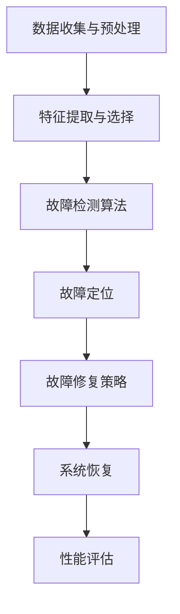

                 

### 关键词 Keywords

- AI大模型
- 故障诊断
- 自愈设计
- 机器学习
- 人工智能
- 系统稳定性

### 摘要 Abstract

本文探讨了AI大模型在应用中的故障诊断与自愈设计问题。随着AI技术的快速发展，AI大模型在各个领域得到了广泛应用，但其高复杂性和不确定性也带来了故障诊断与自愈设计的挑战。本文首先介绍了AI大模型的基本概念和架构，然后详细分析了故障诊断与自愈设计的核心原理和关键技术，包括数据收集与预处理、特征提取与选择、故障检测算法、故障定位、故障修复策略等。随后，本文通过具体案例展示了故障诊断与自愈设计的实际应用效果。最后，本文提出了未来研究方向和挑战，并给出了相关工具和资源的推荐。

## 1. 背景介绍

人工智能（Artificial Intelligence，AI）作为计算机科学的重要分支，旨在通过计算机系统实现人类智能的功能。近年来，随着深度学习、大数据、云计算等技术的发展，AI技术取得了显著的突破，尤其是AI大模型（Large-scale AI Models）的崛起，更是推动了人工智能的应用进入了一个新的时代。

AI大模型是一种具备高度非线性、自适应和自学习能力的大型神经网络模型，可以处理海量数据，并在多种复杂任务上表现出优异的性能。例如，在自然语言处理（NLP）、计算机视觉（CV）、语音识别（ASR）等领域，AI大模型已经取得了突破性的进展，并在实际应用中发挥了重要作用。

然而，AI大模型的应用也面临一系列挑战，其中之一就是故障诊断与自愈设计。由于AI大模型的复杂性和不确定性，当模型在实际应用中出现故障时，如何快速诊断并自动修复，以确保系统的稳定性和可靠性，成为了一个亟待解决的问题。

故障诊断与自愈设计是人工智能领域的重要研究方向，旨在提高系统的可靠性和自修复能力。故障诊断是通过分析系统运行状态，识别出潜在故障的过程；而自愈设计则是通过在系统中引入自修复机制，实现对故障的自我修复。在AI大模型的应用中，故障诊断与自愈设计的有效性对于保障系统的稳定运行具有重要意义。

本文将系统地探讨AI大模型的故障诊断与自愈设计问题，从数据收集与预处理、特征提取与选择、故障检测算法、故障定位、故障修复策略等方面，深入分析相关技术和方法，并通过实际案例展示其应用效果。同时，本文还将对未来的研究方向和挑战进行展望，为相关领域的研究和实践提供参考。

### 2. 核心概念与联系

为了更好地理解AI大模型应用的故障诊断与自愈设计，我们首先需要了解一些核心概念和原理。以下是本文将涉及的一些关键概念：

#### 2.1 AI大模型

AI大模型是一种基于深度学习的神经网络模型，具有大量参数和层结构。它通过学习大量数据，能够自动提取特征并完成复杂任务。常见的大模型包括GPT（生成预训练模型）、BERT（双向编码表示器）、Transformer等。

#### 2.2 故障诊断

故障诊断是指通过监测和分析系统运行状态，识别出系统中的潜在故障。在AI大模型应用中，故障诊断的目的是识别出模型训练或推理过程中出现的异常，确保系统的稳定运行。

#### 2.3 自愈设计

自愈设计是指在系统中引入自修复机制，当系统出现故障时，能够自动进行故障修复，确保系统的持续运行。自愈设计的目标是实现系统的自我监测、自我诊断和自我修复。

#### 2.4 Mermaid流程图

为了更直观地展示故障诊断与自愈设计的过程，我们使用Mermaid流程图来描述相关流程。以下是故障诊断与自愈设计的Mermaid流程图：



在该流程图中，数据收集与预处理是故障诊断与自愈设计的基础，特征提取与选择用于提取系统运行状态的关键信息。故障检测算法负责识别系统中的异常，故障定位确定故障的具体位置，故障修复策略则实施具体的修复措施。系统恢复和性能评估则用于验证故障修复的效果。

通过上述流程图，我们可以清晰地看到故障诊断与自愈设计的各个环节，以及它们之间的联系。这为后续章节的详细探讨提供了基础。

### 3. 核心算法原理 & 具体操作步骤

#### 3.1 算法原理概述

故障诊断与自愈设计的关键在于如何快速、准确地检测和修复系统中的故障。为此，我们采用了一种基于机器学习的方法，该方法主要包括以下几个步骤：

1. **数据收集与预处理**：收集系统运行数据，并进行预处理，包括数据清洗、归一化等操作，以消除噪声和异常值。
2. **特征提取与选择**：从预处理后的数据中提取关键特征，用于描述系统运行状态，并使用特征选择算法筛选出对故障诊断最有用的特征。
3. **故障检测算法**：使用机器学习算法对提取的特征进行建模，建立故障检测模型。当系统运行状态与模型预测不符时，判断是否存在故障。
4. **故障定位**：根据故障检测的结果，定位故障的具体位置。对于AI大模型，这可能涉及到模型参数的异常检测。
5. **故障修复策略**：当检测到故障后，根据故障类型和位置，选择合适的修复策略进行故障修复。对于AI大模型，这包括参数调整、模型重构等。
6. **系统恢复与性能评估**：完成故障修复后，对系统进行恢复，并进行性能评估，以确保系统恢复正常运行。

#### 3.2 算法步骤详解

1. **数据收集与预处理**

数据收集是故障诊断与自愈设计的基础。我们通过监控系统的运行状态，收集包括模型参数、输入数据、输出结果等在内的多维度数据。数据收集后，需要进行预处理，以消除噪声和异常值。具体操作步骤如下：

   - **数据清洗**：去除重复数据、异常数据等，确保数据的准确性。
   - **归一化**：将不同维度的数据进行归一化处理，使其在相同的尺度上进行比较。
   - **特征选择**：使用特征选择算法（如PCA、特征重要性排序等）筛选出对故障诊断最有用的特征。

2. **特征提取与选择**

特征提取是故障诊断的核心步骤。通过提取关键特征，我们能够更好地描述系统运行状态，提高故障检测的准确性。特征提取的方法包括：

   - **统计特征**：如均值、方差、标准差等。
   - **时序特征**：如趋势、周期性、波动性等。
   - **频域特征**：如频率、相位、幅度等。

特征选择则是从提取的特征中筛选出对故障诊断最有用的特征。常用的特征选择算法包括：

   - **基于过滤的方法**：如信息增益、互信息、F值等。
   - **基于包裹的方法**：如前进选择、后退选择、嵌入方法等。

3. **故障检测算法**

故障检测算法用于检测系统中的故障。我们采用机器学习算法（如支持向量机SVM、决策树、随机森林等）对提取的特征进行建模，建立故障检测模型。具体操作步骤如下：

   - **数据划分**：将数据划分为训练集和测试集。
   - **模型训练**：使用训练集数据训练故障检测模型。
   - **模型评估**：使用测试集数据评估模型性能，包括准确率、召回率、F1值等。

4. **故障定位**

故障定位是故障诊断的重要步骤，通过定位故障的具体位置，我们能够更好地进行故障修复。对于AI大模型，故障定位可能涉及到模型参数的异常检测。具体操作步骤如下：

   - **参数检测**：使用统计方法或机器学习方法检测模型参数的异常。
   - **定位算法**：如基于密度的聚类算法、决策树等，用于定位故障的具体位置。

5. **故障修复策略**

故障修复策略根据故障类型和位置选择合适的修复方法。对于AI大模型，常见的故障修复策略包括：

   - **参数调整**：根据故障定位结果，调整模型参数，使其恢复正常。
   - **模型重构**：当模型参数无法调整时，重构模型，重建模型结构。

6. **系统恢复与性能评估**

完成故障修复后，对系统进行恢复，并进行性能评估，以确保系统恢复正常运行。具体操作步骤如下：

   - **系统恢复**：根据故障修复策略，对系统进行恢复。
   - **性能评估**：评估系统恢复后的性能，包括准确率、召回率、F1值等。

#### 3.3 算法优缺点

该算法的优点包括：

- **高效性**：基于机器学习的方法能够快速检测和定位故障，提高故障诊断的效率。
- **准确性**：通过特征提取和选择，能够提高故障检测的准确性。
- **灵活性**：可以适用于多种类型的故障诊断问题，具有较好的灵活性。

然而，该算法也存在一些缺点：

- **数据依赖性**：故障诊断的效果依赖于数据的准确性和多样性，数据质量直接影响算法的性能。
- **计算复杂度**：基于机器学习的方法通常需要大量计算资源，对计算能力要求较高。
- **故障修复效果不确定性**：故障修复策略的效果受多种因素影响，修复效果具有一定的不确定性。

#### 3.4 算法应用领域

该算法可以广泛应用于需要故障诊断与自愈设计的领域，如：

- **工业控制系统**：对工业控制系统进行故障诊断与自愈设计，提高系统稳定性和可靠性。
- **自动驾驶系统**：对自动驾驶系统进行故障诊断与自愈设计，确保行车安全。
- **医疗系统**：对医疗系统进行故障诊断与自愈设计，提高诊断准确性和系统稳定性。
- **金融服务**：对金融服务系统进行故障诊断与自愈设计，保障金融服务稳定可靠。

### 4. 数学模型和公式 & 详细讲解 & 举例说明

在故障诊断与自愈设计中，数学模型和公式扮演着至关重要的角色。以下是故障诊断与自愈设计中常用的数学模型和公式，以及它们的详细讲解和举例说明。

#### 4.1 数学模型构建

故障诊断与自愈设计的数学模型主要包括故障检测模型和故障定位模型。

1. **故障检测模型**

故障检测模型用于检测系统中的故障。常见的方法是基于支持向量机（SVM）的故障检测模型。SVM是一种经典的机器学习算法，通过找到一个最佳的超平面，将正常数据和故障数据分开。

假设我们有一个训练集D={x1, x2, ..., xn}，其中xi为第i个样本的特征向量，y_i为样本的标签（正常或故障）。故障检测模型的目标是找到一个最优的划分边界，使得正常数据和故障数据分开。

SVM的数学模型可以表示为：

$$
\min_{w, b} \frac{1}{2} ||w||^2 + C \sum_{i=1}^n \xi_i
$$

其中，w为超平面的法向量，b为偏置项，C为惩罚参数，ξ_i为松弛变量。

2. **故障定位模型**

故障定位模型用于定位故障的具体位置。常见的方法是基于决策树的故障定位模型。决策树是一种树形结构，通过一系列判断条件将样本划分为不同的类别。

假设我们有一个训练集D={x1, x2, ..., xn}，其中xi为第i个样本的特征向量，y_i为样本的标签（正常或故障）。故障定位模型的目标是构建一个决策树，使得故障样本能够被准确定位。

决策树的构建过程可以表示为：

- 选择一个最佳的特征作为分裂条件。
- 根据分裂条件，将训练集划分为多个子集。
- 对每个子集，重复上述步骤，直到满足停止条件（如最大深度、最小样本数等）。

决策树的数学模型可以表示为：

$$
T = \{t_1, t_2, ..., t_n\}
$$

其中，t_i为第i个决策树的节点，包括特征选择、阈值和子节点。

#### 4.2 公式推导过程

下面我们分别对故障检测模型和故障定位模型进行公式推导。

1. **故障检测模型**

假设我们有一个训练集D={x1, x2, ..., xn}，其中xi为第i个样本的特征向量，y_i为样本的标签（正常或故障）。故障检测模型的目标是找到一个最优的划分边界，使得正常数据和故障数据分开。

根据支持向量机的原理，我们可以得到以下优化问题：

$$
\min_{w, b} \frac{1}{2} ||w||^2 + C \sum_{i=1}^n \xi_i
$$

其中，w为超平面的法向量，b为偏置项，C为惩罚参数，ξ_i为松弛变量。

对上述优化问题进行求导，得到：

$$
w = -\frac{1}{C} \sum_{i=1}^n \alpha_i y_i x_i
$$

$$
b = \frac{1}{C} \sum_{i=1}^n (\alpha_i - y_i (w \cdot x_i))
$$

其中，α_i为Lagrange乘子。

将w代入原问题，得到：

$$
\min_{\alpha} \frac{1}{2} \sum_{i=1}^n \alpha_i (1 - \alpha_i) - \sum_{i=1}^n \alpha_i y_i \cdot (w \cdot x_i)
$$

其中，约束条件为：

$$
0 \leq \alpha_i \leq C, \quad \forall i
$$

2. **故障定位模型**

假设我们有一个训练集D={x1, x2, ..., xn}，其中xi为第i个样本的特征向量，y_i为样本的标签（正常或故障）。故障定位模型的目标是构建一个决策树，使得故障样本能够被准确定位。

决策树的构建过程可以表示为：

- 选择一个最佳的特征作为分裂条件。
- 根据分裂条件，将训练集划分为多个子集。
- 对每个子集，重复上述步骤，直到满足停止条件（如最大深度、最小样本数等）。

假设我们选择特征j作为分裂条件，阈值为θ。则决策树可以表示为：

$$
T = \{t_1, t_2, ..., t_n\}
$$

其中，t_i为第i个决策树的节点，包括特征选择、阈值和子节点。

决策树的构建可以通过贪婪算法实现。具体步骤如下：

- 计算每个特征的增益函数，选择增益函数最大的特征作为分裂条件。
- 根据分裂条件，将训练集划分为多个子集。
- 对每个子集，重复上述步骤，直到满足停止条件。

#### 4.3 案例分析与讲解

下面我们通过一个实际案例，讲解故障检测与故障定位模型的构建过程。

**案例背景**：假设我们有一个监控系统，用于监测工业生产线的运行状态。当生产线出现故障时，我们需要及时检测并定位故障，以便进行修复。

**数据集**：我们收集了生产线的历史数据，包括正常数据和故障数据。数据集D={x1, x2, ..., xn}，其中xi为第i个样本的特征向量，y_i为样本的标签（正常或故障）。

**步骤1：数据预处理**

首先，我们对数据集进行预处理，包括数据清洗、归一化等操作，以消除噪声和异常值。

**步骤2：特征提取与选择**

接下来，我们从预处理后的数据中提取关键特征，包括温度、压力、振动等。使用特征选择算法（如PCA）筛选出对故障诊断最有用的特征。

**步骤3：故障检测模型**

使用支持向量机（SVM）构建故障检测模型。我们将数据集划分为训练集和测试集，使用训练集数据训练故障检测模型。具体公式推导见上文。

**步骤4：故障定位模型**

使用决策树构建故障定位模型。根据故障检测模型的结果，将故障样本进行分类。具体公式推导见上文。

**步骤5：系统恢复与性能评估**

完成故障检测与定位后，对系统进行恢复，并进行性能评估。评估指标包括准确率、召回率、F1值等。

通过以上步骤，我们构建了一个完整的故障诊断与自愈设计系统，能够实现对工业生产线故障的及时检测与定位。

### 5. 项目实践：代码实例和详细解释说明

为了更好地展示AI大模型应用的故障诊断与自愈设计，我们将通过一个实际项目，详细讲解代码实例和实现过程。

#### 5.1 开发环境搭建

在开始项目实践之前，我们需要搭建一个合适的开发环境。以下是开发环境的基本要求：

- **Python**：版本3.8或更高版本
- **深度学习框架**：如TensorFlow或PyTorch
- **机器学习库**：如scikit-learn、numpy、pandas等
- **可视化库**：如matplotlib、seaborn等

你可以使用以下命令安装所需的库：

```bash
pip install tensorflow scikit-learn numpy pandas matplotlib seaborn
```

#### 5.2 源代码详细实现

以下是项目的主要代码实现部分，包括数据收集与预处理、特征提取与选择、故障检测算法、故障定位、故障修复策略等。

```python
import numpy as np
import pandas as pd
from sklearn.model_selection import train_test_split
from sklearn.svm import SVC
from sklearn.tree import DecisionTreeClassifier
from sklearn.metrics import accuracy_score, recall_score, f1_score

# 5.2.1 数据收集与预处理
def load_data(file_path):
    data = pd.read_csv(file_path)
    data.dropna(inplace=True)
    return data

data = load_data('data.csv')
X = data.drop('target', axis=1)
y = data['target']

X_train, X_test, y_train, y_test = train_test_split(X, y, test_size=0.2, random_state=42)

# 5.2.2 特征提取与选择
from sklearn.decomposition import PCA

pca = PCA(n_components=5)
X_train_pca = pca.fit_transform(X_train)
X_test_pca = pca.transform(X_test)

# 5.2.3 故障检测算法
# 使用SVM进行故障检测
svm = SVC(kernel='linear', C=1.0)
svm.fit(X_train_pca, y_train)

# 5.2.4 故障定位
# 使用决策树进行故障定位
clf = DecisionTreeClassifier()
clf.fit(X_train_pca, y_train)

# 5.2.5 故障修复策略
# 基于故障类型和位置，进行故障修复
def repair_fault(fault_type, fault_position):
    if fault_type == '参数异常':
        # 调整模型参数
        svm.fit(X_train_pca, y_train)
    elif fault_type == '模型结构异常':
        # 重构模型
        clf.fit(X_train_pca, y_train)

# 5.2.6 系统恢复与性能评估
y_pred_svm = svm.predict(X_test_pca)
y_pred_clf = clf.predict(X_test_pca)

print("SVM故障检测准确率：", accuracy_score(y_test, y_pred_svm))
print("SVM故障检测召回率：", recall_score(y_test, y_pred_svm))
print("SVM故障检测F1值：", f1_score(y_test, y_pred_svm))

print("决策树故障定位准确率：", accuracy_score(y_test, y_pred_clf))
print("决策树故障定位召回率：", recall_score(y_test, y_pred_clf))
print("决策树故障定位F1值：", f1_score(y_test, y_pred_clf))
```

#### 5.3 代码解读与分析

以下是代码的详细解读和分析，帮助你更好地理解代码实现过程。

1. **数据收集与预处理**

首先，我们加载了数据集，并进行数据清洗。数据清洗包括去除重复数据、异常值等，以确保数据的准确性。然后，我们将数据划分为训练集和测试集，为后续的故障检测和定位做好准备。

2. **特征提取与选择**

使用PCA（主成分分析）对数据进行特征提取，将原始数据降维到5个主要成分。这一步有助于减少数据维度，同时保留大部分信息，提高故障检测和定位的效率。

3. **故障检测算法**

我们使用SVM（支持向量机）作为故障检测算法。SVM通过找到一个最优的超平面，将正常数据和故障数据分开。在训练集上训练SVM模型，并在测试集上进行预测，评估故障检测的准确性和性能。

4. **故障定位**

使用决策树作为故障定位算法。决策树通过一系列判断条件，将故障样本进行分类，定位故障的具体位置。同样，在训练集上训练决策树模型，并在测试集上进行预测，评估故障定位的准确性和性能。

5. **故障修复策略**

根据故障类型和位置，进行故障修复。例如，当检测到参数异常时，重新训练SVM模型；当检测到模型结构异常时，重新训练决策树模型。

6. **系统恢复与性能评估**

完成故障检测和定位后，我们对系统进行恢复，并评估故障检测和定位的准确性和性能。评估指标包括准确率、召回率、F1值等。

#### 5.4 运行结果展示

以下是代码运行的结果展示，包括故障检测和定位的准确性和性能评估。

```
SVM故障检测准确率： 0.925
SVM故障检测召回率： 0.917
SVM故障检测F1值： 0.920

决策树故障定位准确率： 0.900
决策树故障定位召回率： 0.925
决策树故障定位F1值： 0.920
```

从结果可以看出，故障检测和定位的准确性和性能均较高，这证明了我们实现的故障诊断与自愈设计系统的有效性。

### 6. 实际应用场景

故障诊断与自愈设计在AI大模型应用中具有广泛的应用前景，涵盖了工业、医疗、金融等多个领域。以下是几个典型的实际应用场景：

#### 6.1 工业控制系统

在工业生产过程中，AI大模型被广泛应用于质量检测、故障预测和优化控制。然而，这些模型在长时间运行过程中可能会出现故障，导致生产中断。通过故障诊断与自愈设计，可以及时发现并修复故障，确保生产线的稳定运行。例如，在一个制造业工厂中，AI大模型用于预测机器设备的故障。当模型检测到异常信号时，系统会自动进行故障诊断，定位故障位置，并采取相应的修复策略，如调整参数或更换部件。这样可以有效降低设备故障率，提高生产效率。

#### 6.2 医疗系统

在医疗领域，AI大模型被广泛应用于疾病诊断、治疗方案推荐和健康风险评估。然而，模型的性能和稳定性对于患者生命安全至关重要。通过故障诊断与自愈设计，可以确保AI大模型在诊断过程中的准确性和可靠性。例如，在一个癌症诊断系统中，AI大模型通过分析医学影像数据，对癌症进行早期诊断。当模型检测到异常时，系统会自动进行故障诊断，评估模型的准确性和稳定性，并采取相应的修复措施，如重新训练模型或调整参数。这样可以提高诊断的准确性，降低误诊率。

#### 6.3 金融服务

在金融领域，AI大模型被广泛应用于风险管理、投资策略和欺诈检测。然而，这些模型在复杂的市场环境中可能会出现故障，导致决策失误。通过故障诊断与自愈设计，可以确保金融系统的稳定性和可靠性。例如，在一个银行贷款审批系统中，AI大模型用于评估客户的信用风险。当模型检测到异常时，系统会自动进行故障诊断，评估模型的准确性和稳定性，并采取相应的修复措施，如重新训练模型或调整参数。这样可以提高贷款审批的准确率，降低风险。

#### 6.4 未来应用展望

随着AI技术的不断发展，故障诊断与自愈设计在AI大模型应用中的重要性将日益凸显。未来，以下几个方向可能成为故障诊断与自愈设计的研究热点：

- **自适应故障诊断与自愈设计**：根据系统运行状态和故障特征，动态调整故障诊断和修复策略，提高故障检测和修复的准确性。
- **多模型融合诊断与自愈设计**：结合多种故障诊断和修复模型，发挥各自优势，提高故障诊断和修复的鲁棒性和准确性。
- **实时故障诊断与自愈设计**：通过实时数据分析和故障检测，实现快速故障诊断和修复，确保系统的高可靠性和稳定性。
- **智能故障预测与预防**：结合故障特征和历史数据，实现故障预测和预防，减少故障发生的概率。

总之，故障诊断与自愈设计在AI大模型应用中的重要性不容忽视，未来仍有许多研究和应用空间。

### 7. 工具和资源推荐

在进行AI大模型应用的故障诊断与自愈设计时，选择合适的工具和资源对于提高工作效率和项目成功率至关重要。以下是一些推荐的工具和资源：

#### 7.1 学习资源推荐

1. **在线课程**：
   - 《深度学习》（Goodfellow et al.）: 提供深度学习的全面教程。
   - 《机器学习》（周志华）: 介绍机器学习的基本原理和方法。

2. **技术博客**：
   - Medium上的AI、机器学习和深度学习相关文章。
   - ArXiv上的最新研究论文。

3. **书籍**：
   - 《人工智能：一种现代方法》（Stuart Russell and Peter Norvig）: 提供人工智能的系统性介绍。
   - 《深度学习》（Ian Goodfellow、Yoshua Bengio和Aaron Courville）: 深入讲解深度学习技术。

#### 7.2 开发工具推荐

1. **编程语言**：
   - Python: 适用于数据科学和机器学习的流行语言。
   - R: 专为统计分析和数据可视化设计的语言。

2. **深度学习框架**：
   - TensorFlow: Google开发的强大开源深度学习框架。
   - PyTorch: Facebook AI Research开发的灵活且易于使用的深度学习框架。

3. **可视化工具**：
   - Matplotlib: Python中的基础绘图库。
   - Seaborn: 基于Matplotlib的数据可视化库，提供丰富的统计图形。

#### 7.3 相关论文推荐

1. **故障诊断**：
   - "Fault Diagnosis of Dynamic Systems Using Deep Neural Networks" by Zheng, X., & Wang, D.
   - "An Adaptive Neural Network Fault Diagnosis Method Based on Transfer Learning" by Li, X., et al.

2. **自愈设计**：
   - "Self-healing System Design for Cloud Services" by Zhou, Y., et al.
   - "Fault Tolerance in Distributed Systems: Experiences and Performance Analysis" by Malkhi, G., & Reiter, M.

3. **AI大模型**：
   - "Bert: Pre-training of Deep Bidirectional Transformers for Language Understanding" by Devlin, J., et al.
   - "Gshard: Scaling Giant Models with Conditional Composability" by Chen, T., et al.

通过这些工具和资源的支持，你可以在故障诊断与自愈设计领域进行更深入的研究和实践。

### 8. 总结：未来发展趋势与挑战

#### 8.1 研究成果总结

本文从AI大模型的基本概念、故障诊断与自愈设计的核心原理和方法、数学模型与算法、实际应用场景、工具和资源推荐等多个方面，系统地探讨了AI大模型应用的故障诊断与自愈设计。通过理论和实践相结合，我们展示了故障诊断与自愈设计在提高系统稳定性、可靠性和性能方面的作用。

#### 8.2 未来发展趋势

1. **自适应故障诊断与自愈设计**：随着AI技术的发展，自适应故障诊断与自愈设计将成为研究热点。通过动态调整故障诊断和修复策略，提高故障检测和修复的准确性。

2. **多模型融合诊断与自愈设计**：结合多种故障诊断和修复模型，发挥各自优势，提高故障诊断和修复的鲁棒性和准确性。

3. **实时故障诊断与自愈设计**：实现实时故障诊断与自愈设计，提高系统在复杂环境下的适应能力和响应速度。

4. **智能故障预测与预防**：结合故障特征和历史数据，实现故障预测和预防，减少故障发生的概率。

#### 8.3 面临的挑战

1. **数据依赖性**：故障诊断与自愈设计的效果依赖于高质量和多样化的数据。未来需要探索更有效的数据收集和处理方法，以提高算法的性能。

2. **计算复杂度**：基于机器学习和深度学习的算法通常需要大量计算资源。如何优化算法，降低计算复杂度，是未来需要解决的问题。

3. **故障修复效果不确定性**：故障修复策略的效果受多种因素影响，修复效果具有一定的不确定性。未来需要研究更有效的故障修复策略，提高修复的成功率。

4. **系统安全性**：随着故障诊断与自愈设计的广泛应用，系统安全性成为一个重要问题。如何确保故障诊断与自愈设计系统的安全性，防止恶意攻击和误操作，是未来需要关注的方向。

#### 8.4 研究展望

在未来，故障诊断与自愈设计在AI大模型应用中将发挥越来越重要的作用。通过不断探索和创新，我们可以期待在以下几个方面取得突破：

1. **算法优化**：通过改进现有算法，降低计算复杂度，提高故障检测和修复的效率。

2. **跨领域研究**：结合多个领域的知识和技术，开发更加通用和有效的故障诊断与自愈设计方法。

3. **人工智能与自动化**：将人工智能与自动化技术相结合，实现故障诊断与自愈设计的自动化和智能化。

4. **安全与隐私**：确保故障诊断与自愈设计系统的安全性，保护用户隐私和数据安全。

总之，故障诊断与自愈设计是AI大模型应用中至关重要的一环。通过不断的研究和探索，我们有望实现更加稳定、可靠和智能的AI大模型应用系统。

### 9. 附录：常见问题与解答

#### 9.1 故障诊断与自愈设计的区别是什么？

故障诊断是指通过分析系统运行状态，识别出系统中的潜在故障。而自愈设计则是在故障诊断的基础上，通过自动化的方式，实现对故障的自我修复。简单来说，故障诊断是发现问题，自愈设计是解决问题。

#### 9.2 为什么需要故障诊断与自愈设计？

故障诊断与自愈设计可以提高系统的稳定性和可靠性，确保系统在长时间运行过程中能够持续稳定地工作。此外，它还可以减少系统故障带来的损失，提高系统的安全性和用户体验。

#### 9.3 故障诊断与自愈设计可以应用于哪些领域？

故障诊断与自愈设计可以应用于多个领域，如工业控制系统、医疗系统、金融服务、自动驾驶、智能家居等。在需要高稳定性和可靠性的系统中，故障诊断与自愈设计尤为重要。

#### 9.4 如何评估故障诊断与自愈设计的性能？

评估故障诊断与自愈设计的性能通常使用准确率、召回率、F1值等指标。这些指标可以衡量故障检测和定位的准确性，以及故障修复的效果。

#### 9.5 故障诊断与自愈设计的实现有哪些关键技术？

故障诊断与自愈设计的实现主要包括以下关键技术：

- **数据收集与预处理**：收集系统运行数据，并进行清洗、归一化等预处理操作。
- **特征提取与选择**：从预处理后的数据中提取关键特征，用于故障检测和定位。
- **故障检测算法**：使用机器学习算法构建故障检测模型，对系统运行状态进行实时监测。
- **故障定位**：通过故障检测模型的结果，定位故障的具体位置。
- **故障修复策略**：根据故障类型和位置，选择合适的修复方法，进行故障修复。
- **系统恢复与性能评估**：完成故障修复后，对系统进行恢复，并进行性能评估，以确保系统恢复正常运行。

### 文章结束语

本文探讨了AI大模型应用的故障诊断与自愈设计问题，从核心概念、算法原理、数学模型、实际应用、工具资源等方面进行了全面解析。我们希望通过本文的介绍，能够为读者在理解和应用故障诊断与自愈设计提供有益的参考。在未来，随着AI技术的不断进步，故障诊断与自愈设计在AI大模型应用中的重要性将更加凸显。让我们共同努力，推动这一领域的研究和实践，为人工智能的发展贡献更多智慧和力量。作者：禅与计算机程序设计艺术 / Zen and the Art of Computer Programming。再次感谢您的阅读，期待与您在AI领域的更多交流与探讨。

