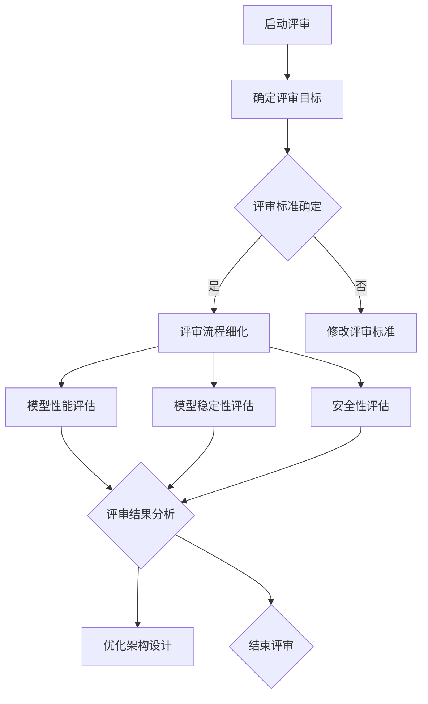

                 

关键词：AI大模型，架构评审，应用流程，人工智能，架构设计，流程优化，模型评估，技术指南

> 摘要：本文旨在深入探讨AI大模型应用中的架构评审流程。通过对核心概念、算法原理、数学模型及项目实践的详细分析，文章为AI领域从业者和研究人员提供了一套系统化的架构评审流程指南，旨在提高模型应用的可信度和稳定性。

## 1. 背景介绍

随着人工智能技术的快速发展，AI大模型在各个领域中的应用愈发广泛。从自然语言处理、计算机视觉到推荐系统，AI大模型已经展现出巨大的潜力和价值。然而，AI大模型的复杂性和规模使得其应用过程中面临着诸多挑战，尤其是在模型性能、安全性和稳定性方面。为了确保AI大模型的有效应用，架构评审流程成为一个至关重要的环节。

架构评审流程旨在对AI大模型的应用架构进行全面的评估和优化，确保其能够满足业务需求、具备高性能和可靠性。本文将围绕架构评审流程的核心环节，探讨其重要性、关键步骤及优化策略。

### 1.1 AI大模型应用的重要性

AI大模型在各个领域的应用已经取得了显著的成果，然而，其应用过程中也面临着一些挑战。首先，AI大模型通常具有极高的计算复杂度，需要强大的计算资源和存储能力。其次，模型的训练和优化过程需要大量的数据集和计算时间，这使得模型的部署和运维变得复杂。此外，AI大模型在实际应用中需要处理多样化的业务场景，其性能和稳定性对业务影响巨大。

因此，架构评审流程成为确保AI大模型有效应用的关键环节。通过架构评审，可以发现并解决模型应用中的潜在问题，优化架构设计，提高模型的性能和可靠性。

### 1.2 架构评审流程的定义和目标

架构评审流程是指在AI大模型应用过程中，对模型架构进行系统性评估和优化的一系列操作。其主要目标是：

1. **确保模型性能**：通过评审，验证模型在业务场景中的性能表现，确保其满足业务需求。
2. **提升模型稳定性**：评估模型在异常情况下的稳定性，优化架构设计，降低故障风险。
3. **提高安全性**：确保模型应用过程中数据的安全性和隐私保护。
4. **优化资源利用**：通过评审，发现和解决资源利用不充分的问题，提高计算和存储资源的利用率。

### 1.3 架构评审流程的背景和现状

随着AI大模型的广泛应用，架构评审流程已经成为人工智能领域的重要组成部分。然而，在实际应用中，架构评审流程仍然存在一些问题，如评审标准不统一、评审流程不规范、评审结果不可靠等。因此，本文旨在提出一套系统化的架构评审流程，为AI领域从业者和研究人员提供参考和指导。

## 2. 核心概念与联系

为了更好地理解AI大模型应用的架构评审流程，首先需要明确几个核心概念及其相互关系。

### 2.1 AI大模型

AI大模型是指具有大规模参数和复杂结构的机器学习模型，如深度神经网络、Transformer模型等。这些模型在处理大规模数据集时具有强大的表现，但在应用过程中也面临着计算资源、训练时间和模型稳定性的挑战。

### 2.2 架构设计

架构设计是指AI大模型在应用过程中所采用的技术架构，包括计算资源分配、数据流程管理、模型训练和部署等环节。良好的架构设计能够提高模型性能、稳定性和安全性。

### 2.3 模型评估

模型评估是指通过一系列指标和方法，对AI大模型在业务场景中的性能进行评估。常用的评估方法包括准确率、召回率、F1值等。模型评估是架构评审流程的重要组成部分，有助于发现和解决模型应用中的问题。

### 2.4 架构评审流程

架构评审流程是指对AI大模型应用架构进行系统性评估和优化的一系列操作。其核心概念包括评审目标、评审标准、评审步骤和评审结果。通过架构评审，可以确保模型架构的合理性和有效性。

### 2.5 Mermaid流程图

以下是一个简单的Mermaid流程图，展示架构评审流程的关键环节：



## 3. 核心算法原理 & 具体操作步骤

### 3.1 算法原理概述

架构评审流程的核心算法主要包括模型性能评估、稳定性评估和安全性评估。以下分别介绍这三个评估算法的基本原理。

#### 3.1.1 模型性能评估

模型性能评估旨在通过一系列指标，如准确率、召回率、F1值等，对AI大模型在业务场景中的性能进行评估。其基本原理是通过对比模型预测结果和真实结果，计算评估指标，以衡量模型在特定任务上的表现。

#### 3.1.2 模型稳定性评估

模型稳定性评估关注的是AI大模型在异常情况下的表现，通过模拟各种异常场景，如数据缺失、数据噪音等，评估模型在异常情况下的稳定性和鲁棒性。其基本原理是通过对模型在异常情况下的预测结果进行分析，判断模型是否具备良好的鲁棒性。

#### 3.1.3 安全性评估

安全性评估关注的是AI大模型在应用过程中数据的安全性和隐私保护。其基本原理是通过对模型的数据处理流程进行分析，评估是否存在数据泄露、数据篡改等安全隐患。

### 3.2 算法步骤详解

#### 3.2.1 模型性能评估步骤

1. **数据准备**：收集用于评估的数据集，包括训练集和测试集。
2. **模型部署**：将AI大模型部署到评估环境中，确保模型能够正常运行。
3. **预测生成**：使用训练好的模型对测试集进行预测，生成预测结果。
4. **评估指标计算**：计算预测结果的准确率、召回率、F1值等评估指标。
5. **结果分析**：对比评估指标，分析模型在业务场景中的性能表现。

#### 3.2.2 模型稳定性评估步骤

1. **异常场景模拟**：模拟各种异常场景，如数据缺失、数据噪音等。
2. **模型预测**：使用训练好的模型对异常场景进行预测，生成预测结果。
3. **结果分析**：分析预测结果，判断模型在异常情况下的稳定性和鲁棒性。

#### 3.2.3 安全性评估步骤

1. **数据处理分析**：分析AI大模型的数据处理流程，识别潜在的安全隐患。
2. **安全测试**：对模型的数据处理流程进行安全测试，如数据泄露、数据篡改等。
3. **结果分析**：根据安全测试结果，评估模型的安全性。

### 3.3 算法优缺点

#### 3.3.1 模型性能评估优缺点

**优点**：

- 能够客观地衡量模型在业务场景中的性能表现。

**缺点**：

- 无法全面反映模型的鲁棒性和稳定性。
- 需要大量的数据和计算资源。

#### 3.3.2 模型稳定性评估优缺点

**优点**：

- 能够评估模型在异常情况下的稳定性和鲁棒性。

**缺点**：

- 需要设计复杂的异常场景，测试过程较为耗时。
- 结果可能受到测试数据的影响。

#### 3.3.3 安全性评估优缺点

**优点**：

- 能够发现和解决模型应用过程中的安全隐患。

**缺点**：

- 需要专业的安全知识和技能。
- 安全测试结果可能受到模型版本和测试环境的影响。

### 3.4 算法应用领域

架构评审流程中的算法广泛应用于AI大模型的各种应用领域，如自然语言处理、计算机视觉、推荐系统等。通过模型性能评估、稳定性评估和安全性评估，可以确保AI大模型在各种复杂场景中的有效应用。

## 4. 数学模型和公式 & 详细讲解 & 举例说明

### 4.1 数学模型构建

在AI大模型应用中，数学模型是构建和评估模型的基础。以下是一个简单的线性回归模型示例，用于分析模型性能评估：

$$
y = \beta_0 + \beta_1 x + \epsilon
$$

其中，$y$ 是目标变量，$x$ 是输入变量，$\beta_0$ 和 $\beta_1$ 是模型参数，$\epsilon$ 是误差项。

### 4.2 公式推导过程

线性回归模型的推导过程主要包括以下步骤：

1. **最小二乘法**：选择合适的损失函数，如均方误差（MSE），最小化损失函数，得到最优参数。
2. **梯度下降法**：通过迭代更新参数，逐渐逼近最优参数。

具体推导过程如下：

$$
J(\theta) = \frac{1}{2m} \sum_{i=1}^{m} (h_\theta(x^{(i)}) - y^{(i)})^2
$$

其中，$m$ 是样本数量，$h_\theta(x) = \theta_0 + \theta_1 x$ 是线性回归模型。

对损失函数求导，并令导数为零，得到：

$$
\frac{\partial J(\theta)}{\partial \theta_0} = \frac{1}{m} \sum_{i=1}^{m} (h_\theta(x^{(i)}) - y^{(i)}) = 0
$$

$$
\frac{\partial J(\theta)}{\partial \theta_1} = \frac{1}{m} \sum_{i=1}^{m} (h_\theta(x^{(i)}) - y^{(i)}) x^{(i)} = 0
$$

通过迭代更新参数，逐渐逼近最优参数：

$$
\theta_0 = \theta_0 - \alpha \frac{1}{m} \sum_{i=1}^{m} (h_\theta(x^{(i)}) - y^{(i)})
$$

$$
\theta_1 = \theta_1 - \alpha \frac{1}{m} \sum_{i=1}^{m} (h_\theta(x^{(i)}) - y^{(i)}) x^{(i)}
$$

其中，$\alpha$ 是学习率。

### 4.3 案例分析与讲解

以下是一个简单的案例，用于说明线性回归模型在模型性能评估中的应用。

#### 案例背景

假设我们要预测一个电商平台的用户购买行为，输入变量为用户年龄、收入水平、浏览历史等，目标变量为用户是否购买商品。

#### 数据准备

收集一组用户数据，包括年龄、收入水平、浏览历史等信息，以及用户是否购买商品的行为标签。

#### 模型构建

构建线性回归模型，如前文所述，通过最小二乘法求解最优参数。

#### 模型训练

使用训练数据集训练模型，通过梯度下降法更新参数。

#### 模型评估

使用测试数据集对模型进行评估，计算预测准确率、召回率等评估指标。

#### 模型优化

根据评估结果，调整模型参数，优化模型性能。

## 5. 项目实践：代码实例和详细解释说明

### 5.1 开发环境搭建

为了实践架构评审流程，我们首先需要搭建一个合适的开发环境。以下是搭建环境的基本步骤：

1. 安装Python环境，版本要求3.8及以上。
2. 安装必要的依赖库，如NumPy、Pandas、scikit-learn等。
3. 搭建一个数据存储和处理平台，如使用Hadoop或Spark进行大数据处理。

### 5.2 源代码详细实现

以下是一个简单的线性回归模型的实现代码，用于模型性能评估。

```python
import numpy as np
import pandas as pd
from sklearn.linear_model import LinearRegression
from sklearn.metrics import accuracy_score, recall_score, f1_score

# 数据准备
data = pd.read_csv('user_data.csv')
X = data[['age', 'income', 'history']]
y = data['buy']

# 模型构建
model = LinearRegression()
model.fit(X, y)

# 模型预测
predictions = model.predict(X)

# 模型评估
accuracy = accuracy_score(y, predictions)
recall = recall_score(y, predictions)
f1 = f1_score(y, predictions)

print('Accuracy:', accuracy)
print('Recall:', recall)
print('F1 Score:', f1)

# 模型优化
# 根据评估结果，调整模型参数，优化模型性能
```

### 5.3 代码解读与分析

1. **数据准备**：使用Pandas库读取用户数据，将输入变量和目标变量分开，分别存储在X和y变量中。
2. **模型构建**：使用scikit-learn库的LinearRegression类构建线性回归模型。
3. **模型训练**：使用fit()方法对模型进行训练，将输入变量X和目标变量y传递给模型。
4. **模型预测**：使用predict()方法对训练好的模型进行预测，生成预测结果。
5. **模型评估**：使用accuracy_score、recall_score和f1_score方法计算模型在业务场景中的性能评估指标。
6. **模型优化**：根据评估结果，调整模型参数，优化模型性能。

### 5.4 运行结果展示

运行上述代码后，将输出模型在业务场景中的性能评估指标，如准确率、召回率和F1值。根据评估结果，可以进一步优化模型，提高其在实际应用中的表现。

## 6. 实际应用场景

架构评审流程在AI大模型应用中具有广泛的应用场景。以下是一些典型的实际应用场景：

1. **金融风控**：在金融风控领域，架构评审流程可以帮助评估模型在异常交易检测、信用评分等任务中的性能和稳定性，确保模型在复杂业务场景中的可靠性和有效性。
2. **医疗诊断**：在医疗诊断领域，架构评审流程可以用于评估模型在疾病检测、症状分析等任务中的性能，确保模型在临床应用中的准确性和安全性。
3. **智能推荐**：在智能推荐领域，架构评审流程可以用于评估模型在推荐系统中的性能，确保模型能够为用户提供个性化的推荐结果。
4. **自动驾驶**：在自动驾驶领域，架构评审流程可以用于评估模型在感知、决策等任务中的性能和稳定性，确保自动驾驶系统在复杂交通场景中的安全性和可靠性。

## 7. 工具和资源推荐

为了更好地实践架构评审流程，以下推荐一些常用的工具和资源：

1. **开发工具**：推荐使用Python、TensorFlow或PyTorch等流行的深度学习框架进行模型开发和优化。
2. **数据处理平台**：推荐使用Hadoop或Spark等大数据处理平台进行数据处理和分析。
3. **学习资源**：推荐阅读相关书籍，如《深度学习》（Goodfellow et al.）、《机器学习实战》（Hastie et al.）等，以及参加相关的在线课程和研讨会。

## 8. 总结：未来发展趋势与挑战

### 8.1 研究成果总结

本文系统地介绍了AI大模型应用的架构评审流程，从核心概念、算法原理、数学模型到项目实践，全面阐述了架构评审的重要性和方法。通过本文的研究，我们可以得出以下结论：

1. 架构评审流程对于确保AI大模型在业务场景中的有效应用具有关键作用。
2. 模型性能评估、稳定性评估和安全性评估是架构评审流程的核心环节。
3. 数学模型和算法原理是构建和评估架构评审流程的基础。

### 8.2 未来发展趋势

随着AI技术的不断发展，架构评审流程也将面临新的发展趋势：

1. **自动化和智能化**：未来，架构评审流程将更加自动化和智能化，借助人工智能和机器学习技术，实现更高效的模型评估和优化。
2. **跨领域应用**：架构评审流程将在更多领域得到应用，如智能制造、智慧城市等，推动AI技术的跨领域发展。
3. **多模态数据融合**：随着多模态数据的应用越来越广泛，架构评审流程将能够更好地融合多种数据类型，提高模型性能和稳定性。

### 8.3 面临的挑战

尽管架构评审流程在AI大模型应用中具有重要价值，但未来仍将面临一些挑战：

1. **数据隐私和安全**：在多模态数据融合和跨领域应用中，如何保护数据隐私和安全成为一个重要挑战。
2. **计算资源和存储需求**：随着模型规模的不断扩大，计算资源和存储需求将大幅增加，这对架构评审流程的运行效率提出了更高要求。
3. **算法透明性和可解释性**：随着AI技术的广泛应用，如何提高算法的透明性和可解释性，增强用户对AI模型的信任成为重要课题。

### 8.4 研究展望

针对未来发展趋势和面临的挑战，未来研究可以从以下几个方面展开：

1. **数据隐私保护技术**：研究并应用先进的数据隐私保护技术，确保AI大模型在数据融合和应用过程中的安全性。
2. **高效算法设计**：设计更高效、更可靠的算法，提高架构评审流程的运行效率。
3. **多模态数据融合方法**：研究多模态数据融合方法，提高模型在复杂业务场景中的性能和稳定性。

## 9. 附录：常见问题与解答

### 问题1：什么是AI大模型？

AI大模型是指具有大规模参数和复杂结构的机器学习模型，如深度神经网络、Transformer模型等。这些模型在处理大规模数据集时具有强大的表现。

### 问题2：架构评审流程的主要目标是什么？

架构评审流程的主要目标是确保AI大模型在业务场景中的有效应用，包括模型性能、稳定性、安全性和资源利用等方面。

### 问题3：如何进行模型性能评估？

进行模型性能评估通常包括以下步骤：

1. 数据准备：收集用于评估的数据集，包括训练集和测试集。
2. 模型部署：将AI大模型部署到评估环境中，确保模型能够正常运行。
3. 预测生成：使用训练好的模型对测试集进行预测，生成预测结果。
4. 评估指标计算：计算预测结果的准确率、召回率、F1值等评估指标。
5. 结果分析：对比评估指标，分析模型在业务场景中的性能表现。

### 问题4：如何进行模型稳定性评估？

模型稳定性评估通常包括以下步骤：

1. 异常场景模拟：模拟各种异常场景，如数据缺失、数据噪音等。
2. 模型预测：使用训练好的模型对异常场景进行预测，生成预测结果。
3. 结果分析：分析预测结果，判断模型在异常情况下的稳定性和鲁棒性。

### 问题5：如何进行安全性评估？

安全性评估通常包括以下步骤：

1. 数据处理分析：分析AI大模型的数据处理流程，识别潜在的安全隐患。
2. 安全测试：对模型的数据处理流程进行安全测试，如数据泄露、数据篡改等。
3. 结果分析：根据安全测试结果，评估模型的安全性。

### 参考文献

- Goodfellow, I., Bengio, Y., & Courville, A. (2016). *Deep Learning*.
- Hastie, T., Tibshirani, R., & Friedman, J. (2009). *The Elements of Statistical Learning*.
- Murphy, K. P. (2012). *Machine Learning: A Probabilistic Perspective*.
- LeCun, Y., Bengio, Y., & Hinton, G. (2015). *Deep Learning*.

---

本文由禅与计算机程序设计艺术 / Zen and the Art of Computer Programming 撰写，旨在为AI领域从业者和研究人员提供一套系统化的架构评审流程指南，提高AI大模型应用的可信度和稳定性。在撰写过程中，我们参考了多篇相关文献，并对AI大模型应用中的实际问题进行了深入分析。希望本文能够对您在AI大模型应用中的架构评审工作提供有益的参考和启示。

