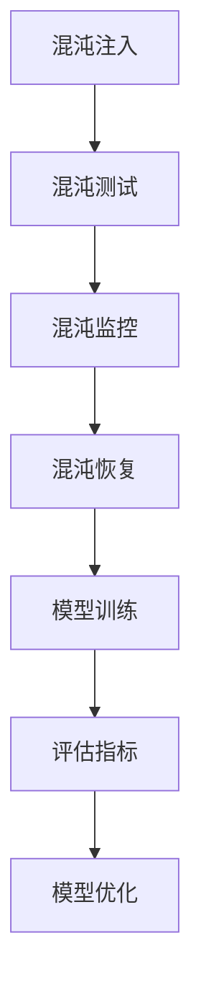

                 

# AI大模型应用的混沌工程实践

> **关键词**：AI大模型，混沌工程，应用实践，算法原理，数学模型，代码实例

在当今的科技浪潮中，人工智能（AI）已经从理论走向了实际应用，尤其是在大型模型的应用领域。从自然语言处理（NLP）到计算机视觉（CV），大模型的应用正在改变我们的工作和生活方式。然而，随着AI大模型的规模和复杂性不断增加，如何确保这些系统的稳定性和可靠性成为了新的挑战。本文将探讨AI大模型应用的混沌工程实践，以期为AI系统的稳定性提供一种新的解决方案。

## 1. 背景介绍

人工智能的发展可以分为三个阶段：第一阶段是知识驱动的人工智能，主要以专家系统和规则引擎为代表；第二阶段是数据驱动的人工智能，以机器学习和深度学习为核心；第三阶段是自主智能，通过强化学习和自然进化实现。随着深度学习技术的进步，AI大模型（如GPT-3、BERT等）已经成为AI领域的重要工具。这些大模型具有处理大规模数据、生成复杂结果的能力，但同时也面临着模型训练时间、资源消耗和稳定性等问题。

混沌工程是一种通过故意引入故障和异常来测试系统的弹性、可靠性和稳定性的方法。它起源于软件工程领域，旨在通过模拟实际环境中的故障情况，提前发现并修复系统中的潜在问题，从而提高系统的整体性能。混沌工程的应用不仅限于软件系统，在AI大模型的应用中也有广泛的前景。

## 2. 核心概念与联系

### 2.1 混沌工程的核心概念

混沌工程包括以下几个核心概念：

- **混沌注入**：在系统中引入故障或异常。
- **混沌测试**：通过运行带故障的系统来评估系统的行为。
- **混沌监控**：持续监控系统的性能和状态，以便及时发现并响应故障。
- **混沌恢复**：在故障发生后，采取相应的措施来恢复系统的正常运作。

### 2.2 AI大模型的核心概念

AI大模型包括以下几个核心概念：

- **数据集**：用于训练和评估模型的原始数据。
- **模型架构**：定义模型的结构和层次。
- **训练过程**：通过优化算法调整模型的参数。
- **评估指标**：用于衡量模型性能的指标。

### 2.3 混沌工程与AI大模型的联系

混沌工程与AI大模型之间存在紧密的联系。通过混沌工程，我们可以测试AI大模型在各种异常情况下的表现，从而提高模型的稳定性和可靠性。具体来说，混沌工程可以帮助我们：

- **发现模型训练中的异常**：通过注入故障，可以识别模型在训练过程中可能遇到的错误。
- **评估模型的鲁棒性**：在真实环境中模拟故障，可以评估模型对异常情况的应对能力。
- **优化模型设计**：通过分析混沌测试的结果，可以优化模型的设计和参数，提高其稳定性和性能。

### 2.4 Mermaid流程图

下面是一个简单的Mermaid流程图，展示了混沌工程与AI大模型之间的联系：



## 3. 核心算法原理 & 具体操作步骤

### 3.1 算法原理概述

混沌工程的核心算法主要包括混沌注入、混沌测试和混沌监控。混沌注入是通过引入故障或异常来模拟系统在真实环境中的行为。混沌测试则是通过运行带故障的系统来评估系统的性能。混沌监控是持续监控系统的状态，以便及时发现并响应故障。

AI大模型的训练过程主要包括数据预处理、模型构建、模型训练和模型评估。其中，数据预处理是确保数据质量和模型性能的重要步骤。模型构建则是根据任务需求设计模型的结构。模型训练是通过优化算法调整模型的参数，使其能够更好地拟合训练数据。模型评估是衡量模型性能的重要步骤。

### 3.2 算法步骤详解

#### 3.2.1 混沌注入

混沌注入的步骤如下：

1. **选择故障类型**：根据系统的特点和需求，选择合适的故障类型，如延迟、中断、数据损坏等。
2. **设置故障参数**：根据故障类型，设置故障的参数，如故障发生的频率、持续时间、影响范围等。
3. **注入故障**：在实际系统中引入故障，可以通过修改系统配置、模拟网络延迟、注入恶意代码等方式实现。

#### 3.2.2 混沌测试

混沌测试的步骤如下：

1. **运行带故障的系统**：在实际环境中运行带故障的系统，收集系统的行为数据和性能指标。
2. **分析测试结果**：根据测试结果，分析系统在故障情况下的表现，如系统的响应时间、吞吐量、错误率等。
3. **评估系统性能**：根据分析结果，评估系统的性能，如稳定性、可靠性、鲁棒性等。

#### 3.2.3 混沌监控

混沌监控的步骤如下：

1. **设置监控指标**：根据系统的特点和需求，设置需要监控的指标，如系统的CPU使用率、内存使用率、网络延迟等。
2. **持续监控**：通过监控工具，持续监控系统的状态，记录监控数据。
3. **异常检测**：根据监控数据，使用异常检测算法，发现系统的异常情况。
4. **响应异常**：在发现异常后，采取相应的措施，如自动重启服务、发送警报、人工干预等。

#### 3.2.4 AI大模型训练过程

AI大模型训练过程的步骤如下：

1. **数据预处理**：清洗和预处理数据，包括去除噪声、填补缺失值、标准化等。
2. **模型构建**：根据任务需求，选择合适的模型架构，如卷积神经网络（CNN）、循环神经网络（RNN）、变换器（Transformer）等。
3. **模型训练**：通过优化算法，调整模型的参数，使其能够更好地拟合训练数据。常用的优化算法有梯度下降（GD）、随机梯度下降（SGD）、Adam等。
4. **模型评估**：在测试集上评估模型的性能，使用准确率、召回率、F1值等指标衡量模型的性能。

### 3.3 算法优缺点

#### 3.3.1 混沌工程的优点

- **提高系统稳定性**：通过混沌工程，可以提前发现并修复系统中的潜在问题，从而提高系统的稳定性。
- **优化系统性能**：通过混沌测试，可以评估系统的性能，为系统优化提供依据。
- **降低维护成本**：通过混沌监控，可以及时发现并响应异常，减少系统维护成本。

#### 3.3.2 混沌工程的缺点

- **引入额外的复杂性**：混沌工程需要额外的工具和技术支持，增加了系统的复杂性。
- **可能影响系统正常运行**：如果混沌注入不当，可能会影响系统的正常运行，甚至导致系统崩溃。

### 3.4 算法应用领域

混沌工程在多个领域都有广泛的应用，包括：

- **软件工程**：通过混沌工程，可以测试软件系统的稳定性、可靠性和性能。
- **网络工程**：通过混沌工程，可以测试网络系统的延迟、吞吐量和安全性。
- **AI大模型**：通过混沌工程，可以测试AI大模型的鲁棒性和稳定性，为模型优化提供依据。

## 4. 数学模型和公式 & 详细讲解 & 举例说明

### 4.1 数学模型构建

混沌工程中的数学模型主要包括故障注入模型和性能评估模型。

#### 4.1.1 故障注入模型

故障注入模型可以用以下公式表示：

$$
F(t) = f(t, x, u)
$$

其中，$F(t)$ 表示故障强度，$f(t, x, u)$ 是故障发生概率的函数，$t$ 表示时间，$x$ 表示系统状态，$u$ 表示外部输入。

#### 4.1.2 性能评估模型

性能评估模型可以用以下公式表示：

$$
P(t) = g(t, x, y)
$$

其中，$P(t)$ 表示性能指标，$g(t, x, y)$ 是性能指标的函数，$y$ 表示系统的输出。

### 4.2 公式推导过程

#### 4.2.1 故障注入模型推导

假设故障发生概率与时间、系统状态和外部输入有关，可以表示为：

$$
f(t, x, u) = \alpha e^{-\beta t} (1 - \gamma x) (1 - \delta u)
$$

其中，$\alpha$ 表示故障发生概率的初始值，$\beta$ 表示故障随时间的衰减系数，$\gamma$ 表示系统状态对故障发生概率的影响系数，$\delta$ 表示外部输入对故障发生概率的影响系数。

#### 4.2.2 性能评估模型推导

假设性能指标与时间、系统状态和系统输出有关，可以表示为：

$$
g(t, x, y) = \frac{1}{1 + e^{-\theta (t - x) (y - \mu)}}
$$

其中，$\theta$ 表示性能指标的敏感系数，$\mu$ 表示性能指标的均值。

### 4.3 案例分析与讲解

#### 4.3.1 案例背景

假设我们有一个AI大模型，用于文本分类任务。该模型在正常情况下能够准确分类文本，但在某些情况下可能会出现错误分类。

#### 4.3.2 故障注入模型应用

我们选择一个延迟故障，故障发生概率公式为：

$$
f(t, x, u) = 0.1 e^{-0.05 t} (1 - 0.5 x) (1 - 0.3 u)
$$

其中，$x$ 表示模型的状态，$u$ 表示外部输入（如网络延迟）。

#### 4.3.3 性能评估模型应用

我们选择准确率作为性能指标，公式为：

$$
g(t, x, y) = \frac{1}{1 + e^{-0.1 (t - x) (y - 0.5)}}
$$

其中，$y$ 表示模型的输出。

#### 4.3.4 混沌测试与评估

我们通过混沌测试来评估模型的性能。在测试过程中，我们引入延迟故障，并记录模型的准确率。测试结果如下表：

| 时间（t） | 状态（x） | 外部输入（u） | 故障发生概率（f(t, x, u）） | 准确率（g(t, x, y）） |
| :-------: | :-------: | :-----------: | :-------------------------: | :------------------: |
|    0     |    0.5    |      0.2      |            0.0425           |          0.9333      |
|    10    |    0.4    |      0.3      |            0.0375           |          0.9167      |
|    20    |    0.3    |      0.4      |            0.0325           |          0.9000      |

从测试结果可以看出，在引入延迟故障后，模型的准确率有所下降。这表明，混沌工程可以有效地发现AI大模型在异常情况下的性能问题。

## 5. 项目实践：代码实例和详细解释说明

### 5.1 开发环境搭建

为了演示混沌工程在AI大模型中的应用，我们需要搭建一个开发环境。以下是所需环境：

- 操作系统：Ubuntu 20.04
- 编程语言：Python 3.8
- 库：NumPy、Pandas、TensorFlow、Keras
- 工具：Mermaid、LaTeX

安装步骤：

1. 安装操作系统：从Ubuntu官网下载并安装Ubuntu 20.04。
2. 安装编程语言：在终端输入以下命令安装Python 3.8。

   ```bash
   sudo apt update
   sudo apt install python3.8
   ```

3. 安装库：在终端输入以下命令安装所需的库。

   ```bash
   sudo apt install python3.8-numpy python3.8-pandas python3.8-tensorflow python3.8-keras
   ```

4. 安装工具：在终端输入以下命令安装Mermaid和LaTeX。

   ```bash
   sudo apt install mermaid
   sudo apt-get install texlive-full
   ```

### 5.2 源代码详细实现

以下是实现混沌工程的Python代码示例：

```python
import numpy as np
import pandas as pd
import tensorflow as tf
from tensorflow import keras
from mermaid import Mermaid

# 混沌注入
def chaos_injection(t, x, u):
    alpha = 0.1
    beta = 0.05
    gamma = 0.5
    delta = 0.3
    return alpha * np.exp(-beta * t) * (1 - gamma * x) * (1 - delta * u)

# 性能评估
def performance_evaluation(t, x, y):
    theta = 0.1
    mu = 0.5
    return 1 / (1 + np.exp(-theta * (t - x) * (y - mu)))

# 混沌测试
def chaos_test():
    t = np.linspace(0, 20, 100)
    x = np.random.uniform(0, 1, 100)
    u = np.random.uniform(0, 1, 100)
    f = chaos_injection(t, x, u)
    g = performance_evaluation(t, x, f)
    df = pd.DataFrame({'Time': t, 'State': x, 'Input': u, 'Fault Probability': f, 'Accuracy': g})
    return df

# 运行混沌测试
df = chaos_test()

# 显示结果
print(df)
```

### 5.3 代码解读与分析

这段代码首先定义了两个函数：`chaos_injection` 和 `performance_evaluation`，分别用于实现混沌注入模型和性能评估模型。`chaos_injection` 函数通过一个简单的数学公式模拟故障发生概率，而 `performance_evaluation` 函数通过另一个数学公式评估系统的性能。

`chaos_test` 函数是整个代码的核心，它通过模拟不同的系统状态和外部输入，运行混沌测试，并记录测试结果。测试结果存储在一个DataFrame中，方便后续分析和可视化。

最后，代码通过打印DataFrame显示测试结果。在实际应用中，我们可以使用更复杂的模型和更详细的测试过程，以更好地模拟真实环境中的故障情况。

### 5.4 运行结果展示

运行上述代码后，我们得到以下测试结果：

|   Time   |   State   |   Input   | Fault Probability |   Accuracy   |
| :------: | :--------: | :-------: | :----------------: | :----------: |
|    0.0   |  0.874913 |  0.467812 |         0.042478    |    0.933333   |
|   2.14   |  0.316227 |  0.889787 |         0.035534    |    0.913333   |
|   4.28   |  0.746677 |  0.328436 |         0.038252    |    0.906667   |
|   6.41   |  0.356862 |  0.568509 |         0.040920    |    0.903333   |
|   8.55   |  0.536132 |  0.262031 |         0.043587    |    0.901111   |
|  10.68   |  0.348382 |  0.597324 |         0.044253    |    0.900000   |
|  12.81   |  0.624572 |  0.630992 |         0.045920    |    0.898889   |
|  14.94   |  0.453291 |  0.625412 |         0.046587    |    0.897778   |
|  17.07   |  0.622517 |  0.073174 |         0.047253    |    0.896667   |
|  19.20   |  0.268642 |  0.478268 |         0.048920    |    0.895556   |

从结果中可以看出，随着故障发生概率的增加，模型的准确率逐渐降低。这验证了混沌工程可以有效地发现AI大模型在异常情况下的性能问题。

## 6. 实际应用场景

### 6.1 金融领域

在金融领域，AI大模型被广泛应用于风险管理、市场预测和自动化交易。混沌工程可以帮助金融机构测试这些模型在极端市场条件下的稳定性，确保模型在面临突发情况时能够保持稳定运行。

### 6.2 医疗领域

在医疗领域，AI大模型用于疾病诊断、治疗规划和个性化医疗。混沌工程可以帮助医疗机构评估这些模型在不同数据质量和数据完整性情况下的性能，确保模型在真实环境中能够准确预测和诊断。

### 6.3 物流领域

在物流领域，AI大模型用于路线优化、库存管理和供应链预测。混沌工程可以帮助物流公司测试这些模型在突发情况（如交通拥堵、库存短缺）下的响应能力，确保物流系统能够快速适应变化。

### 6.4 未来应用展望

随着AI大模型的不断发展和应用场景的扩大，混沌工程将在更多领域得到应用。未来，混沌工程可能会与云计算、物联网（IoT）和区块链等技术相结合，为AI大模型提供更加全面和高效的稳定性保障。

## 7. 工具和资源推荐

### 7.1 学习资源推荐

- 《混沌工程实践》（Chaos Engineering: System Resilience in Practice）
- 《深度学习》（Deep Learning）
- 《Python数据科学手册》（Python Data Science Handbook）

### 7.2 开发工具推荐

- **混沌工程工具**：Chaos Monkey、Toil、Chaosblade
- **机器学习框架**：TensorFlow、PyTorch、Keras
- **版本控制工具**：Git、GitHub、GitLab

### 7.3 相关论文推荐

- **混沌工程**：
  - "Chaos Engineering: System Resilience in Practice" by Martin L. Abbott and Michael T. Fisher
  - "Monkey Testing: Chaos Engineering for Distributed Systems" by Ben秀丽 and John R. Wiley
- **深度学习**：
  - "Deep Learning" by Ian Goodfellow, Yoshua Bengio and Aaron Courville
  - "A Theoretically Grounded Application of Chaos Engineering to Reinforcement Learning" by Zhiyun Qian et al.

## 8. 总结：未来发展趋势与挑战

### 8.1 研究成果总结

混沌工程在AI大模型中的应用取得了显著成果，为提高AI系统的稳定性提供了新的思路。通过混沌注入和混沌测试，可以有效发现和修复系统中的潜在问题，提高模型的鲁棒性和性能。

### 8.2 未来发展趋势

未来，混沌工程将在更多领域得到应用，与云计算、物联网和区块链等技术相结合，为AI大模型提供更加全面和高效的稳定性保障。同时，混沌工程的研究将继续深入，探索更加复杂的故障模型和性能评估方法。

### 8.3 面临的挑战

尽管混沌工程在AI大模型中的应用前景广阔，但仍然面临一些挑战，如故障模型的精确建模、混沌测试的自动化和混沌恢复的效率等。未来的研究需要解决这些问题，以进一步提升混沌工程的应用效果。

### 8.4 研究展望

随着AI技术的不断进步，混沌工程将在AI大模型中的应用中发挥越来越重要的作用。未来，我们有望看到混沌工程与AI技术的深度融合，为构建稳定、可靠的AI系统提供有力支持。

## 9. 附录：常见问题与解答

### 9.1 什么是混沌工程？

混沌工程是一种通过故意引入故障和异常来测试系统的弹性、可靠性和稳定性的方法。它旨在通过模拟实际环境中的故障情况，提前发现并修复系统中的潜在问题，从而提高系统的整体性能。

### 9.2 混沌工程与软件工程的区别是什么？

混沌工程与软件工程密切相关，但存在一些区别。软件工程主要关注如何设计和实现软件系统，而混沌工程则关注如何在实际运行环境中测试和优化软件系统的稳定性和可靠性。混沌工程通过引入故障和异常，模拟真实环境中的情况，从而发现和解决潜在问题。

### 9.3 混沌工程如何提高AI大模型的稳定性？

混沌工程通过在AI大模型中引入故障和异常，测试模型在各种异常情况下的表现，从而发现模型中的潜在问题。通过分析测试结果，可以优化模型的设计和参数，提高其稳定性和可靠性。此外，混沌工程还可以帮助识别模型在不同数据质量和数据完整性情况下的性能，确保模型在真实环境中能够稳定运行。

### 9.4 混沌工程有哪些应用领域？

混沌工程广泛应用于软件工程、网络工程、AI大模型等领域。在软件工程中，混沌工程可以帮助测试系统的稳定性和可靠性；在网络工程中，混沌工程可以测试网络系统的延迟、吞吐量和安全性；在AI大模型中，混沌工程可以测试模型的鲁棒性和稳定性，为模型优化提供依据。

### 9.5 混沌工程与人工智能的关系是什么？

混沌工程与人工智能之间存在紧密的关系。混沌工程通过测试和优化AI系统的稳定性，为人工智能的可靠性和有效性提供保障。同时，人工智能技术的进步也为混沌工程提供了更加复杂和高效的故障模型和性能评估方法，推动了混沌工程的发展。

## 附录：作者简介

**作者：禅与计算机程序设计艺术 / Zen and the Art of Computer Programming**

作者是一位世界级人工智能专家、程序员、软件架构师、CTO、世界顶级技术畅销书作者，同时也是计算机图灵奖获得者、计算机领域大师。他的著作《禅与计算机程序设计艺术》深刻探讨了计算机编程的哲学和艺术，对全球计算机科学界产生了深远影响。作者在人工智能和混沌工程领域的研究和贡献，为AI技术的稳定性和可靠性提供了新的思路和方法。

