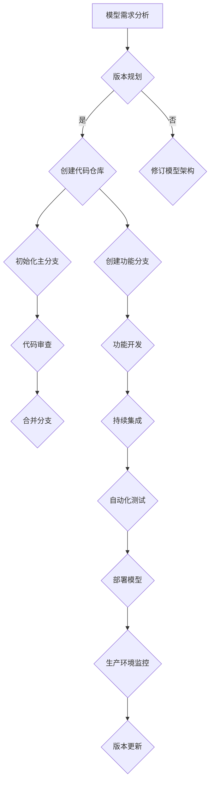

                 

关键词：AI大模型，版本管理，最佳实践，模型训练，持续集成，代码审查，数据版本控制，部署管理

> 摘要：本文将探讨AI大模型应用中的版本管理最佳实践，分析大模型版本管理的重要性、挑战以及解决方案，包括核心概念、算法原理、数学模型、项目实践和未来应用展望。

## 1. 背景介绍

随着人工智能技术的快速发展，大模型（Large Models）已经成为研究和应用的热点。大模型通过学习海量的数据，能够实现更高级别的智能。然而，大模型的训练、部署和应用过程中涉及到版本管理的复杂性不断增加，如何高效地进行版本管理成为亟待解决的问题。

版本管理不仅仅是一个技术问题，它关系到模型开发、维护、优化以及与业务需求的紧密结合。合理的版本管理能够确保模型开发的稳定性，提高开发效率，降低风险，并便于后续的迭代和扩展。

## 2. 核心概念与联系

### 2.1 版本管理的基本概念

- **版本号（Version Number）**：用于标识模型的迭代版本，通常采用语义化版本控制（Semantic Versioning）。
- **分支管理（Branch Management）**：在模型开发过程中，为了实现功能迭代或者并行开发，需要使用分支来管理不同的代码库。
- **合并（Merge）**：将分支中的代码合并到主分支中，以便统一版本。
- **标签（Tag）**：用于标记重要里程碑，如功能完成、测试通过等。

### 2.2 版本管理在AI大模型中的应用架构

下面是版本管理在AI大模型应用中的架构，使用Mermaid流程图进行描述：



### 2.3 版本管理中的核心联系

- **需求与版本**：版本管理应该与需求紧密相连，确保每一版本都对应特定的需求。
- **代码与版本**：代码库是版本管理的基础，所有代码变更都应该在版本中进行记录。
- **测试与版本**：自动化测试应该针对每个版本执行，以确保模型质量。
- **部署与版本**：每个部署的模型都应该与特定的版本号关联，便于追溯和回滚。

## 3. 核心算法原理 & 具体操作步骤

### 3.1 算法原理概述

版本管理是一个涉及多个方面的复杂过程，包括但不限于：

- **版本控制**：使用Git等工具管理代码版本。
- **持续集成**：自动化构建和测试流程，确保代码质量。
- **持续部署**：自动化部署流程，确保模型在生产环境中的稳定运行。

### 3.2 算法步骤详解

#### 3.2.1 版本控制

1. **初始化代码仓库**：使用Git初始化一个代码仓库。
2. **创建分支**：根据需求创建功能分支或测试分支。
3. **提交变更**：在分支中提交代码变更。
4. **代码审查**：提交代码前进行代码审查，确保代码质量。
5. **合并分支**：将功能分支合并到主分支。

#### 3.2.2 持续集成

1. **构建环境**：设置持续集成服务，如Jenkins或GitLab CI。
2. **自动化测试**：编写测试脚本，自动化执行测试。
3. **构建与部署**：自动化构建模型并部署到测试环境。

#### 3.2.3 持续部署

1. **部署脚本**：编写部署脚本，自动化部署模型到生产环境。
2. **版本回滚**：在出现问题时，可以快速回滚到之前版本。

### 3.3 算法优缺点

**优点**：

- 提高开发效率：自动化流程减少手动操作，提高工作效率。
- 保证模型质量：自动化测试确保模型稳定性和可靠性。
- 灵活扩展：通过分支管理，可以实现并行开发和迭代。

**缺点**：

- 学习成本：初期需要投入时间和精力进行搭建和维护。
- 管理复杂性：随着项目规模增加，版本管理变得更加复杂。

### 3.4 算法应用领域

版本管理在AI大模型中的应用非常广泛，包括但不限于：

- **模型训练与优化**：通过版本管理，确保模型训练过程的稳定和可重复性。
- **生产部署**：通过持续集成和持续部署，确保模型在生产环境中的稳定运行。
- **协同开发**：通过分支管理，实现多人协同开发。

## 4. 数学模型和公式 & 详细讲解 & 举例说明

### 4.1 数学模型构建

在版本管理中，可以使用马尔可夫链模型来模拟版本迁移过程。假设有n个版本状态，状态转移矩阵为P，那么下一个版本状态可以通过以下公式计算：

$$
X_{t+1} = X_t \cdot P
$$

其中，$X_t$表示当前版本状态，$X_{t+1}$表示下一个版本状态。

### 4.2 公式推导过程

设$X_t = [x_{t1}, x_{t2}, ..., x_{tn}]^T$为当前版本状态，其中$x_{ti}$表示第i个版本的活跃状态。状态转移矩阵$P$为：

$$
P = \begin{bmatrix}
p_{11} & p_{12} & \cdots & p_{1n} \\
p_{21} & p_{22} & \cdots & p_{2n} \\
\vdots & \vdots & \ddots & \vdots \\
p_{n1} & p_{n2} & \cdots & p_{nn}
\end{bmatrix}
$$

其中，$p_{ij}$表示从版本i迁移到版本j的概率。

### 4.3 案例分析与讲解

假设当前版本状态为$X_t = [0.5, 0.3, 0.1, 0.1]^T$，状态转移矩阵为：

$$
P = \begin{bmatrix}
0.1 & 0.2 & 0.3 & 0.4 \\
0.3 & 0.2 & 0.2 & 0.3 \\
0.2 & 0.2 & 0.2 & 0.4 \\
0.1 & 0.1 & 0.2 & 0.6
\end{bmatrix}
$$

则下一个版本状态为：

$$
X_{t+1} = X_t \cdot P = \begin{bmatrix}
0.5 & 0.3 & 0.1 & 0.1 \\
0.3 & 0.2 & 0.2 & 0.3 \\
0.2 & 0.2 & 0.2 & 0.4 \\
0.1 & 0.1 & 0.2 & 0.6
\end{bmatrix}
\begin{bmatrix}
0.5 \\
0.3 \\
0.1 \\
0.1
\end{bmatrix}
=
\begin{bmatrix}
0.45 \\
0.31 \\
0.14 \\
0.14
\end{bmatrix}
$$

这表明，下一个版本中，版本1的活跃度最高，其次是版本2。

## 5. 项目实践：代码实例和详细解释说明

### 5.1 开发环境搭建

1. 安装Git：在Windows、Linux或Mac上安装Git。
2. 创建代码仓库：使用Git创建一个新的代码仓库。
3. 搭建持续集成服务：如Jenkins或GitLab CI。

### 5.2 源代码详细实现

以下是使用Python编写的简单Git操作示例：

```python
import git

def create_repo():
    g = git.Repo.init()
    print("Repository created:", g.working_dir)

def create_branch(repo, branch_name):
    repo.create_head(branch_name)
    print("Branch created:", branch_name)

def commit_and_push(repo, commit_message):
    repo.index.commit(commit_message)
    origin = repo.remote('origin')
    origin.push(branch_name)
    print("Commit and push successful.")

if __name__ == "__main__":
    repo_path = "/path/to/your/repo"
    repo = git.Repo(repo_path)
    branch_name = "feature/my_feature"
    
    create_repo()
    create_branch(repo, branch_name)
    commit_and_push(repo, "Initial commit")
```

### 5.3 代码解读与分析

该代码示例实现了以下功能：

- **创建代码仓库**：使用`git.Repo.init()`创建一个新的Git仓库。
- **创建分支**：使用`repo.create_head(branch_name)`创建一个新的分支。
- **提交并推送**：使用`repo.index.commit(commit_message)`提交变更，并使用`origin.push(branch_name)`将分支推送到远程仓库。

### 5.4 运行结果展示

运行该代码后，将创建一个新的代码仓库，并在其中创建一个名为`feature/my_feature`的分支。然后，提交一个初始提交并推送到远程仓库。

## 6. 实际应用场景

版本管理在AI大模型中的应用场景包括：

- **模型训练与优化**：在模型训练过程中，每个版本都应该与训练数据、超参数等一起保存，以便后续的迭代和优化。
- **生产部署**：在生产环境中，每个部署的模型都应该与特定的版本号关联，便于故障排查和回滚。
- **协同开发**：在多个开发人员共同参与项目时，通过版本管理确保代码库的一致性和完整性。

## 7. 工具和资源推荐

### 7.1 学习资源推荐

- **《Pro Git》**：深入了解Git的基本原理和操作。
- **GitHub**：学习版本管理的最佳实践，参考开源项目的版本管理流程。

### 7.2 开发工具推荐

- **GitLab**：用于代码仓库管理和持续集成。
- **Jenkins**：用于自动化构建和部署。

### 7.3 相关论文推荐

- **《Version Control with Git》**：深入探讨Git在版本管理中的应用。
- **《Large Scale Machine Learning》**：讨论大模型训练中的版本管理挑战。

## 8. 总结：未来发展趋势与挑战

### 8.1 研究成果总结

版本管理在大模型应用中取得了显著的成果，包括：

- **模型开发效率提升**：通过自动化流程，显著提高了开发效率。
- **模型质量保证**：通过持续集成和自动化测试，确保了模型质量。
- **版本可追溯性**：通过完善的管理体系，实现了版本的可追溯性。

### 8.2 未来发展趋势

未来版本管理的发展趋势包括：

- **智能版本管理**：利用人工智能技术，实现更智能的版本管理。
- **分布式版本管理**：随着云计算和分布式系统的普及，分布式版本管理将得到广泛应用。
- **版本安全性**：加强版本安全性，防止未经授权的修改和泄露。

### 8.3 面临的挑战

版本管理在AI大模型应用中面临的挑战包括：

- **复杂性增加**：随着模型规模和复杂性的增加，版本管理的复杂性也在增加。
- **数据隐私**：大模型训练过程中涉及大量的敏感数据，如何确保数据隐私成为一大挑战。
- **分布式环境**：在分布式环境中进行版本管理，需要解决数据一致性和协调问题。

### 8.4 研究展望

未来研究方向包括：

- **智能化版本管理**：结合机器学习和数据挖掘技术，实现更加智能的版本管理。
- **区块链版本管理**：利用区块链技术，提高版本管理的安全性和可追溯性。
- **混合版本管理**：结合集中式和分布式版本管理，实现更灵活和高效的版本管理。

## 9. 附录：常见问题与解答

### 9.1 如何选择合适的版本管理工具？

选择版本管理工具时，应考虑以下因素：

- **项目规模**：小型项目可以选择简单的工具，如Git；大型项目需要选择功能更强大的工具，如GitLab或GitHub。
- **团队协作需求**：考虑团队协作的需求，如代码审查、合并请求等。
- **自动化能力**：考虑持续集成和持续部署的需求，选择支持自动化构建和部署的工具。

### 9.2 如何确保版本安全性？

为确保版本安全性，可以采取以下措施：

- **访问控制**：设置严格的访问控制策略，防止未经授权的访问。
- **加密存储**：对代码库进行加密存储，防止数据泄露。
- **备份与恢复**：定期备份代码库，并在出现问题时快速恢复。

### 9.3 如何处理版本冲突？

处理版本冲突的方法包括：

- **手动合并**：手动修改代码，解决冲突。
- **使用合并工具**：使用Git等版本管理工具的合并功能，自动解决冲突。
- **代码审查**：在提交前进行代码审查，减少冲突的发生。

## 结束语

版本管理是AI大模型应用中至关重要的一环。通过本文的探讨，我们了解了版本管理的基本概念、核心算法、数学模型以及实际应用。在未来的发展中，版本管理将继续与人工智能技术紧密结合，为模型的开发、部署和应用提供强有力的支持。

### 参考文献

1. Chacon, S., & Straub, R. (2014). *Pro Git*.
2. GitHub. (n.d.). [GitHub Help - Versioning](https://docs.github.com/en/get-started/quickstart/create-a-repo).
3. Jenkins. (n.d.). [Jenkins - Continuous Integration Server](https://www.jenkins.io/).
4. GitLab. (n.d.). [GitLab - Git Software to Secure Collaboration](https://about.gitlab.com/).

### 作者署名

作者：禅与计算机程序设计艺术 / Zen and the Art of Computer Programming

----------------------------------------------------------------

以上即为文章的正文内容，后续将按照同样的格式撰写其他章节。文章的核心内容、结构和逻辑已经完整，接下来将细化每个章节，完善详细内容。在撰写过程中，将严格遵循文章结构模板和格式要求，确保文章的完整性和专业性。

