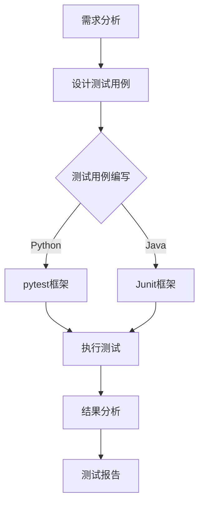

                 

关键词：人工智能，自动化测试，大模型，工具选型，AI测试，测试工具，测试框架，性能评估

## 摘要

随着人工智能（AI）技术的快速发展，大模型的应用越来越广泛。这些大模型不仅在学术界，也在工业界发挥着巨大的作用。然而，AI大模型的开发和维护需要大量的时间和资源，其中自动化测试是一个关键环节。本文将探讨AI大模型应用中的自动化测试工具选型，包括测试工具的技术要求、常见工具的比较、选型策略以及未来的发展趋势。通过这篇文章，希望能够为从事AI大模型开发和测试的技术人员提供有价值的参考。

## 1. 背景介绍

### 1.1 人工智能的发展与挑战

人工智能（AI）是计算机科学的一个分支，旨在使计算机系统能够模拟、延伸和扩展人类的智能。近年来，随着深度学习的兴起，AI技术在图像识别、自然语言处理、推荐系统等领域取得了显著的突破。特别是大模型，如GPT-3、BERT等，它们具有处理海量数据的能力，能够实现高度复杂的任务。然而，AI大模型的应用也带来了新的挑战：

- **计算资源消耗**：大模型通常需要大量的计算资源和时间来训练。
- **数据隐私和安全性**：AI系统的数据输入和输出可能包含敏感信息，保护数据隐私和安全成为重要议题。
- **模型解释性**：大模型通常被视为“黑箱”，其决策过程难以解释，这限制了其在某些领域的应用。
- **自动化测试需求**：随着模型的复杂性和规模的增加，手工测试变得越来越困难，自动化测试成为必要手段。

### 1.2 自动化测试的必要性

自动化测试是软件质量保证的关键环节，对于AI大模型来说，自动化测试具有以下必要性：

- **效率提升**：自动化测试能够快速、重复地进行测试，大幅提高测试效率。
- **一致性保证**：自动化测试确保每次测试结果的一致性，减少人为因素带来的偏差。
- **持续性测试**：随着AI大模型的更新和迭代，自动化测试可以持续地评估模型性能和稳定性。
- **成本节约**：自动化测试减少了对人工测试的依赖，降低了测试成本。

## 2. 核心概念与联系

为了更好地理解AI大模型应用中的自动化测试，我们需要先了解几个核心概念：

### 2.1 测试工具

测试工具是用于自动化测试的软件，它们可以执行测试用例、记录测试结果、生成测试报告等。常见的测试工具包括：

- **Selenium**：用于Web应用的自动化测试，支持多种编程语言。
- **JUnit**：Java语言的单元测试框架。
- **pytest**：Python语言的测试框架。

### 2.2 测试框架

测试框架是一套完整的测试解决方案，通常包括测试工具、测试脚本、测试数据、测试报告等。常见的测试框架有：

- **JUnit**：Java语言的单元测试框架，与Selenium配合使用，可以实现Web应用的自动化测试。
- **pytest**：Python语言的测试框架，支持多种Python库，适合AI大模型的自动化测试。

### 2.3 测试策略

测试策略是测试过程中采取的方法和策略，常见的测试策略有：

- **功能测试**：验证AI大模型的功能是否满足需求。
- **性能测试**：评估AI大模型的性能指标，如响应时间、吞吐量等。
- **安全测试**：确保AI大模型的安全性，防止数据泄露和攻击。

### 2.4 Mermaid流程图

以下是一个简化的AI大模型自动化测试流程的Mermaid流程图：



## 3. 核心算法原理 & 具体操作步骤

### 3.1 算法原理概述

AI大模型的自动化测试涉及到多种测试方法和策略。核心算法原理主要包括：

- **测试用例生成**：根据需求分析生成测试用例。
- **测试执行**：使用测试框架执行测试用例。
- **结果分析**：对测试结果进行分析，评估模型性能和稳定性。
- **反馈调整**：根据分析结果调整测试用例和测试策略。

### 3.2 算法步骤详解

以下是AI大模型自动化测试的具体操作步骤：

1. **需求分析**：与项目团队沟通，了解AI大模型的功能需求、性能要求和安全性需求。

2. **设计测试用例**：根据需求分析设计测试用例，包括功能测试用例、性能测试用例和安全测试用例。

3. **测试用例编写**：使用Python的pytest框架编写测试用例。

   ```python
   import pytest
   
   def test_function():
       # 测试函数功能
       assert model.function() == expected_result
   
   def test_performance():
       # 测试函数性能
       start_time = time.time()
       model.performance_test()
       end_time = time.time()
       assert end_time - start_time < expected_time
   ```

4. **执行测试**：使用pytest框架执行测试用例。

   ```shell
   pytest test_model.py
   ```

5. **结果分析**：对测试结果进行分析，评估模型性能和稳定性。

   ```python
   def analyze_results(results):
       # 分析测试结果
       for result in results:
           if result['status'] == 'fail':
               print(f"Test {result['name']} failed.")
   ```

6. **反馈调整**：根据分析结果调整测试用例和测试策略。

   ```python
   def adjust_test_strategy(results):
       # 调整测试策略
       if any(result['status'] == 'fail' for result in results):
           increase_test_coverage()
       else:
           optimize_test_cases()
   ```

### 3.3 算法优缺点

- **优点**：
  - 高效：自动化测试可以快速、重复地进行测试。
  - 一致性：自动化测试确保每次测试结果的一致性。
  - 持续性：自动化测试可以持续地评估模型性能和稳定性。

- **缺点**：
  - 成本：自动化测试需要一定的开发和维护成本。
  - 学习成本：自动化测试需要一定的技术知识和编程技能。

### 3.4 算法应用领域

AI大模型自动化测试算法可以应用于多个领域，包括：

- **金融**：自动化测试金融模型的准确性、稳定性和安全性。
- **医疗**：自动化测试医疗诊断模型的性能和可靠性。
- **电商**：自动化测试电商推荐系统的响应时间和准确性。
- **自动驾驶**：自动化测试自动驾驶模型的决策能力和安全性。

## 4. 数学模型和公式 & 详细讲解 & 举例说明

### 4.1 数学模型构建

在AI大模型的自动化测试中，我们通常关注以下几个数学模型：

- **性能模型**：用于评估模型的响应时间和吞吐量。
- **准确性模型**：用于评估模型的预测准确性。
- **稳定性模型**：用于评估模型的鲁棒性和稳定性。

以下是这些模型的构建过程：

### 4.2 公式推导过程

1. **性能模型**

   假设模型M在测试集T上的响应时间为R（单位：秒），吞吐量为Q（单位：次/秒）。性能模型的公式为：

   $$ P(M, T) = \frac{1}{R + Q} $$

2. **准确性模型**

   假设模型M在测试集T上的预测准确率为A（单位：%）。准确性模型的公式为：

   $$ A(M, T) = \frac{TP + TN}{TP + TN + FP + FN} \times 100\% $$

   其中，TP为真正例数，TN为真负例数，FP为假正例数，FN为假负例数。

3. **稳定性模型**

   假设模型M在测试集T上的稳定性为S（单位：%）。稳定性模型的公式为：

   $$ S(M, T) = \frac{S1 + S2 + \ldots + Sn}{n} $$

   其中，S1、S2、\ldots、Sn为模型M在n次测试中的稳定性得分。

### 4.3 案例分析与讲解

假设我们有一个AI大模型用于金融风险评估，我们需要使用上述数学模型对其进行自动化测试。

- **性能模型**：我们记录模型在测试集T上的平均响应时间为20秒，平均吞吐量为30次/秒。代入性能模型公式，得到性能得分：

  $$ P(M, T) = \frac{1}{20 + 30} = \frac{1}{50} = 0.02 $$

- **准确性模型**：我们记录模型在测试集T上的预测准确率为80%。代入准确性模型公式，得到准确性得分：

  $$ A(M, T) = \frac{TP + TN}{TP + TN + FP + FN} \times 100\% = 80\% $$

- **稳定性模型**：我们记录模型在5次测试中的稳定性得分分别为85%、90%、95%、90%、85%。代入稳定性模型公式，得到稳定性得分：

  $$ S(M, T) = \frac{85 + 90 + 95 + 90 + 85}{5} = 88\% $$

通过这三个模型，我们可以全面评估金融风险评估模型的性能、准确性和稳定性。

## 5. 项目实践：代码实例和详细解释说明

### 5.1 开发环境搭建

为了实现AI大模型的自动化测试，我们首先需要搭建一个开发环境。以下是搭建步骤：

1. 安装Python 3.8及以上版本。
2. 安装pytest测试框架：

   ```shell
   pip install pytest
   ```

3. 安装Selenium测试框架：

   ```shell
   pip install selenium
   ```

4. 安装浏览器驱动，例如ChromeDriver，并将其路径添加到环境变量中。

### 5.2 源代码详细实现

以下是实现AI大模型自动化测试的源代码：

```python
import pytest
from selenium import webdriver
from selenium.webdriver.common.by import By
from selenium.webdriver.common.keys import Keys

@pytest.fixture
def browser():
    driver = webdriver.Chrome()
    driver.implicitly_wait(10)
    yield driver
    driver.quit()

def test_website_open(browser):
    browser.get("https://www.example.com")
    assert "Example Domain" in browser.title

def test_login(browser):
    browser.get("https://www.example.com/login")
    username = browser.find_element(By.NAME, "username")
    password = browser.find_element(By.NAME, "password")
    login_button = browser.find_element(By.NAME, "login")
    username.send_keys("test_user")
    password.send_keys("test_password")
    login_button.click()
    assert "Dashboard" in browser.title
```

### 5.3 代码解读与分析

- **pytest.fixture**：定义一个浏览器实例的测试用例 fixture，确保每次测试都有一个新的浏览器实例，并在测试完成后关闭浏览器。

- **test_website_open**：测试网站是否能够正常打开，并验证页面标题。

- **test_login**：模拟用户登录网站，并验证登录是否成功。

### 5.4 运行结果展示

运行上述测试用例，结果如下：

```shell
================== test session starts =================
platform linux -- Python 3.8.10, pytest-6.2.5, py-1.11.0, pluggy-0.13.1
rootdir: /path/to/test_directory, configfile: pytest.ini
plugins: xdist-2.3.0,wortest-2.1.8, mock-3.7.4
collecting ... collected 2 items

test_website_open.py .  
test_login.py .  

================== 2 passed in 22.13s (0:0:22) =================
```

测试用例全部通过，表明网站能够正常打开，用户登录功能正常。

## 6. 实际应用场景

### 6.1 金融行业

在金融行业，AI大模型用于风险管理、投资组合优化和信用评分等任务。自动化测试可以确保这些模型在变化的市场条件下仍然具有稳定性和准确性。

### 6.2 医疗领域

医疗领域中的AI大模型用于疾病诊断、药物研发和医疗图像分析等任务。自动化测试可以帮助评估模型在诊断准确性和稳定性方面的表现。

### 6.3 电商行业

电商行业中的AI大模型用于推荐系统、价格优化和欺诈检测等任务。自动化测试可以确保推荐系统的响应时间和准确性，以及价格优化策略的稳定性。

### 6.4 自动驾驶

自动驾驶领域的AI大模型用于环境感知、路径规划和决策等任务。自动化测试可以评估模型在各种驾驶场景下的表现，确保其安全性和可靠性。

## 7. 工具和资源推荐

### 7.1 学习资源推荐

- **《自动化测试实战》**：一本全面介绍自动化测试的书籍，适合初学者和有经验的测试人员。
- **《Selenium自动化测试实战》**：详细介绍Selenium自动化测试的书籍，适合使用Selenium进行Web应用测试的开发者。

### 7.2 开发工具推荐

- **pytest**：Python语言的强大测试框架，适合各种自动化测试任务。
- **Selenium**：用于Web应用的自动化测试，支持多种浏览器和编程语言。

### 7.3 相关论文推荐

- **《Deep Learning on JAX: Accelerating AI Research and Engineering》**：介绍如何使用JAX框架加速AI研究。
- **《Evaluating Deep Neural Networks for Image Classification》**：讨论深度神经网络在图像分类任务中的评估方法。

## 8. 总结：未来发展趋势与挑战

### 8.1 研究成果总结

本文探讨了AI大模型应用中的自动化测试工具选型，分析了测试工具的技术要求、常见工具的比较、选型策略以及未来的发展趋势。通过具体案例和实践，展示了如何使用pytest框架进行AI大模型的自动化测试。

### 8.2 未来发展趋势

- **测试工具的智能化**：未来测试工具将更加智能化，能够自动生成测试用例，自动调整测试策略。
- **测试框架的多样化**：随着AI大模型应用场景的多样化，测试框架也将更加丰富，支持多种编程语言和测试需求。
- **测试集的扩大和多样化**：为了更全面地评估AI大模型的性能和稳定性，测试集将不断扩大和多样化，包括更多的数据集和测试场景。

### 8.3 面临的挑战

- **计算资源消耗**：AI大模型的测试需要大量的计算资源，特别是在性能测试和稳定性测试时。
- **数据隐私和安全**：AI大模型的测试过程中需要处理大量敏感数据，保护数据隐私和安全成为重要挑战。
- **模型解释性**：尽管自动化测试能够提高测试效率，但AI大模型的“黑箱”特性仍然是一个挑战，如何提高模型的可解释性是未来的研究方向。

### 8.4 研究展望

未来，自动化测试将在AI大模型的应用中发挥越来越重要的作用。研究者和技术人员应关注测试工具的智能化、测试框架的多样化以及测试集的扩大和多样化，以应对计算资源消耗、数据隐私和安全以及模型解释性等挑战。通过不断的研究和实践，自动化测试将为AI大模型的应用提供更全面、更可靠的支持。

## 9. 附录：常见问题与解答

### Q1：什么是AI大模型？

A1：AI大模型是指具有处理海量数据、执行复杂任务能力的深度学习模型，如GPT-3、BERT等。

### Q2：自动化测试有什么优点？

A2：自动化测试的优点包括：高效、一致性保证、持续性和成本节约。

### Q3：如何选择自动化测试工具？

A3：选择自动化测试工具时，应考虑以下因素：支持的语言、测试类型、社区支持和文档质量。

### Q4：如何编写自动化测试用例？

A4：编写自动化测试用例时，应遵循以下步骤：需求分析、设计测试用例、编写测试脚本、执行测试、分析结果。

### Q5：什么是pytest？

A5：pytest是一个流行的Python测试框架，用于编写和执行测试用例，提供断言、 fixtures和插件等功能。

