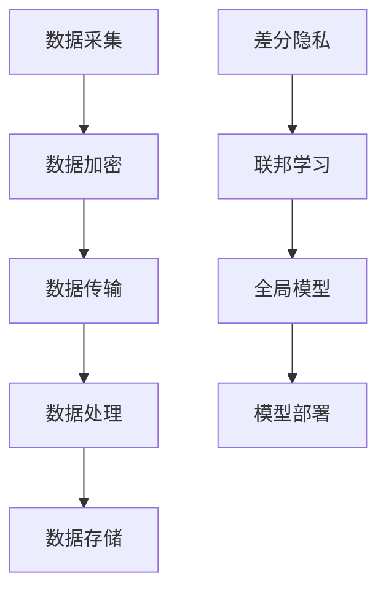

                 

：隐私保护，数据安全，AI大模型，加密技术，联邦学习，差分隐私

## 1. 背景介绍

近年来，随着人工智能技术的飞速发展，尤其是大模型（如GPT-3、BERT等）的广泛应用，数据在AI领域的价值愈发凸显。然而，数据的安全与隐私问题也随之而来。AI大模型往往需要大量的训练数据，这些数据不仅包含用户的个人信息，还可能涉及到敏感的商业机密。一旦数据泄露或被滥用，将会对用户和公司造成不可估量的损失。

### 1.1 隐私保护的重要性

隐私保护是数据安全的核心问题之一。在AI大模型应用中，隐私保护的重要性体现在以下几个方面：

1. **用户信任**：用户在使用AI服务时，往往会担心自己的数据被滥用或泄露。有效的隐私保护机制可以提高用户的信任度，促进AI服务的推广和应用。
2. **合规要求**：随着各国隐私保护法律的不断完善，如欧盟的《通用数据保护条例》（GDPR）和中国的《个人信息保护法》（PIPL），企业在处理用户数据时必须遵守相应的法规要求。隐私保护是合规的基础。
3. **商业竞争力**：在数据驱动的新时代，数据的获取和处理能力已成为企业竞争力的重要指标。有效的隐私保护机制可以确保企业在合法合规的前提下，最大化数据的价值。

### 1.2 数据安全挑战

在AI大模型应用中，数据安全面临的挑战主要包括：

1. **数据泄露风险**：大量敏感数据在传输、存储和处理过程中，都可能面临泄露的风险。
2. **数据滥用风险**：用户数据可能被非法获取，用于不正当的商业目的或个人用途。
3. **模型窃取风险**：AI模型的知识产权保护也是一大挑战，模型的训练数据和算法细节都可能成为竞争对手窃取的目标。

综上所述，AI大模型应用的隐私保护与数据安全已成为当前信息技术领域亟待解决的重要问题。

## 2. 核心概念与联系

### 2.1 隐私保护核心概念

#### 数据加密

数据加密是保护数据隐私的基本手段之一。它通过将明文数据转换为密文，防止未经授权的访问和泄露。常见的数据加密技术包括对称加密、非对称加密和哈希算法。

#### 差分隐私

差分隐私是一种用于保障数据隐私的安全机制，它通过在数据处理过程中引入噪声，使得单个数据样本的隐私信息难以被推断。差分隐私的主要优势在于其可证明的隐私保障。

#### 联邦学习

联邦学习是一种分布式机器学习技术，它允许各个参与方在保持本地数据隐私的前提下，共同训练一个全局模型。联邦学习通过加密和差分隐私等机制，实现了隐私保护与模型优化的平衡。

### 2.2 架构与联系

#### 数据流架构

在AI大模型应用中，数据流架构通常包括数据采集、数据传输、数据处理和数据存储等环节。隐私保护与数据安全贯穿于整个数据流过程中。

#### 技术融合

隐私保护与数据安全技术的融合是实现AI大模型应用安全性的关键。例如，差分隐私可以与联邦学习结合，为分布式训练提供隐私保障；数据加密可以与数据传输协议结合，确保数据在传输过程中的安全性。

### 2.3 Mermaid 流程图



## 3. 核心算法原理 & 具体操作步骤

### 3.1 算法原理概述

#### 数据加密算法

数据加密算法主要通过密钥对数据进行加密和解密。常见的加密算法包括AES（高级加密标准）、RSA（非对称加密算法）和SHA（哈希算法）。

#### 差分隐私算法

差分隐私算法主要通过在数据处理过程中引入噪声，来保护数据隐私。常见的差分隐私算法包括Laplace机制和Gaussian机制。

#### 联邦学习算法

联邦学习算法通过分布式训练方式，使得各个参与方在保持本地数据隐私的前提下，共同训练一个全局模型。常见的联邦学习算法包括模型加法联邦学习、模型聚合联邦学习和基于差分隐私的联邦学习。

### 3.2 算法步骤详解

#### 数据加密步骤

1. **密钥生成**：生成加密密钥对。
2. **数据加密**：使用加密算法和密钥对数据进行加密。
3. **数据解密**：使用解密算法和密钥对加密数据进行解密。

#### 差分隐私步骤

1. **噪声引入**：在数据处理过程中引入噪声。
2. **噪声调整**：根据处理结果调整噪声水平，以保持结果的准确性。
3. **结果输出**：输出带有噪声的结果。

#### 联邦学习步骤

1. **模型初始化**：初始化全局模型。
2. **本地训练**：各个参与方在本地数据上训练模型。
3. **模型更新**：各个参与方将本地训练的模型更新发送给中心服务器。
4. **模型聚合**：中心服务器对更新后的模型进行聚合。
5. **模型优化**：使用聚合后的模型进行进一步的优化。

### 3.3 算法优缺点

#### 数据加密

**优点**：简单易用，能够有效防止数据泄露。

**缺点**：加密和解密过程需要额外的计算资源，可能影响模型训练效率。

#### 差分隐私

**优点**：可证明的隐私保障，适用于敏感数据场景。

**缺点**：可能引入过多的噪声，影响模型训练效果。

#### 联邦学习

**优点**：能够在保持数据隐私的前提下，实现分布式训练和模型优化。

**缺点**：需要解决多方协作和数据传输问题，实现复杂。

### 3.4 算法应用领域

数据加密、差分隐私和联邦学习在AI大模型应用中具有广泛的应用领域，包括但不限于：

1. **医疗健康**：保护患者隐私，同时提高医疗数据分析的准确性。
2. **金融领域**：保障金融数据的安全，提高金融风控能力。
3. **智能家居**：保护用户隐私，提升智能家居系统的智能化水平。

## 4. 数学模型和公式 & 详细讲解 & 举例说明

### 4.1 数学模型构建

#### 数据加密模型

数据加密模型主要涉及加密算法和密钥管理。以下是一个简单的AES加密模型：

$$
\text{加密}:\quad C = E_{\text{key}}(P)
$$

$$
\text{解密}:\quad P = D_{\text{key}}(C)
$$

其中，$C$ 表示加密后的数据，$P$ 表示原始数据，$E_{\text{key}}$ 表示加密算法，$D_{\text{key}}$ 表示解密算法。

#### 差分隐私模型

差分隐私模型主要涉及噪声引入和噪声调整。以下是一个简单的Laplace噪声模型：

$$
L(x, \lambda) = x + \text{Laplace}(\lambda)
$$

其中，$x$ 表示处理结果，$\lambda$ 表示噪声水平。

#### 联邦学习模型

联邦学习模型主要涉及模型初始化、本地训练和模型聚合。以下是一个简单的联邦学习模型：

$$
\text{模型初始化}:\quad \theta^{(0)} = \theta_{\text{init}}
$$

$$
\text{本地训练}:\quad \theta^{(t+1)} = \theta^{(t)} + \alpha \nabla_{\theta} \ell(\theta^{(t)}, x_i, y_i)
$$

$$
\text{模型聚合}:\quad \theta^{(t+1)} = \frac{1}{N} \sum_{i=1}^{N} \theta^{(t+1)}_i
$$

其中，$\theta$ 表示模型参数，$x_i$ 和 $y_i$ 表示本地数据和标签，$\alpha$ 表示学习率，$N$ 表示参与方数量。

### 4.2 公式推导过程

#### 数据加密公式的推导

AES加密算法的推导过程较为复杂，这里仅给出简化的推导：

1. **初始轮加密**：

$$
\text{状态}:\quad S = (S_0, S_1, ..., S_{(n-1)})
$$

$$
\text{变换}:\quad S_i = \text{SubBytes}(S_i) \oplus \text{ShiftRows}(S_i) \oplus \text{MixColumns}(S_i) \oplus \text{AddRoundKey}(S_i, \text{key})
$$

2. **最终轮加密**：

$$
\text{状态}:\quad S = (S_0, S_1, ..., S_{(n-1)})
$$

$$
\text{变换}:\quad S_i = \text{SubBytes}(S_i) \oplus \text{ShiftRows}(S_i) \oplus \text{AddRoundKey}(S_i, \text{key})
$$

其中，$\text{SubBytes}$、$\text{ShiftRows}$、$\text{MixColumns}$ 和 $\text{AddRoundKey}$ 分别表示S-盒、行移位、列混合和轮密钥添加。

#### 差分隐私公式的推导

Laplace噪声的推导过程如下：

1. **噪声引入**：

$$
L(x, \lambda) = x + \text{Laplace}(\lambda)
$$

其中，$Laplace(\lambda)$ 表示Laplace分布，$\lambda$ 表示噪声水平。

2. **噪声调整**：

$$
L(x, \lambda) = x + \lambda \cdot \text{sign}(x)
$$

其中，$\text{sign}(x)$ 表示符号函数，用于调整噪声水平。

#### 联邦学习公式的推导

联邦学习公式的推导过程涉及复杂的优化理论。这里仅给出简化的推导：

1. **模型初始化**：

$$
\theta^{(0)} = \theta_{\text{init}}
$$

2. **本地训练**：

$$
\theta^{(t+1)} = \theta^{(t)} + \alpha \nabla_{\theta} \ell(\theta^{(t)}, x_i, y_i)
$$

其中，$\nabla_{\theta} \ell(\theta^{(t)}, x_i, y_i)$ 表示本地梯度。

3. **模型聚合**：

$$
\theta^{(t+1)} = \frac{1}{N} \sum_{i=1}^{N} \theta^{(t+1)}_i
$$

### 4.3 案例分析与讲解

#### 数据加密案例

假设我们有一个包含用户信息的数据库，我们需要对这些数据进行加密保护。以下是具体的加密步骤：

1. **密钥生成**：生成AES加密密钥。
2. **数据加密**：使用AES加密算法和密钥对数据库进行加密。
3. **数据解密**：在需要访问数据时，使用AES解密算法和密钥对加密数据进行解密。

#### 差分隐私案例

假设我们有一个分类任务，需要使用用户数据训练模型。以下是差分隐私的应用步骤：

1. **噪声引入**：在数据处理过程中引入Laplace噪声，以保护用户隐私。
2. **噪声调整**：根据处理结果调整噪声水平，以确保模型的准确性。
3. **结果输出**：输出带有噪声的结果，以保护用户隐私。

#### 联邦学习案例

假设我们有一个涉及多方数据的机器学习任务，需要使用联邦学习进行模型训练。以下是联邦学习的应用步骤：

1. **模型初始化**：初始化全局模型。
2. **本地训练**：各个参与方在本地数据上训练模型。
3. **模型更新**：各个参与方将本地训练的模型更新发送给中心服务器。
4. **模型聚合**：中心服务器对更新后的模型进行聚合。
5. **模型优化**：使用聚合后的模型进行进一步的优化。

## 5. 项目实践：代码实例和详细解释说明

### 5.1 开发环境搭建

为了实现本文所述的隐私保护与数据安全方案，我们首先需要搭建一个适合开发的环境。以下是具体的步骤：

1. **安装Python环境**：确保Python版本在3.6及以上。
2. **安装加密库**：安装PyCryptoDome库，用于实现数据加密。
3. **安装差分隐私库**：安装dp privacy库，用于实现差分隐私算法。
4. **安装联邦学习库**：安装Federated Learning Library，用于实现联邦学习算法。

### 5.2 源代码详细实现

以下是实现隐私保护与数据安全方案的具体代码实现：

```python
# 导入相关库
from Crypto.Cipher import AES
from Crypto.Random import get_random_bytes
import dp privacy
import Federated Learning Library

# 5.2.1 数据加密实现
def encrypt_data(data, key):
    cipher = AES.new(key, AES.MODE_EAX)
    ciphertext, tag = cipher.encrypt_and_digest(data)
    return ciphertext, tag

def decrypt_data(encrypted_data, key):
    cipher = AES.new(key, AES.MODE_EAX, nonce=cipher.nonce)
    data = cipher.decrypt_and_verify(encrypted_data, tag)
    return data

# 5.2.2 差分隐私实现
def apply_diff_privacy(data, noise_level):
    noise = dp privacy.Laplace(noise_level)
    result = data + noise.sample()
    return result

# 5.2.3 联邦学习实现
def federated_learning(participant_data, global_model):
    local_models = []
    for data in participant_data:
        local_model = Federated Learning Library.initialize_model()
        local_model.train(data)
        local_models.append(local_model)
    global_model.aggregate(local_models)
    global_model.optimize()
    return global_model

# 5.2.4 主程序
if __name__ == "__main__":
    # 生成密钥
    key = get_random_bytes(16)
    
    # 加密数据
    data = "敏感数据"
    encrypted_data, tag = encrypt_data(data, key)
    
    # 解密数据
    decrypted_data = decrypt_data(encrypted_data, key)
    
    # 应用差分隐私
    noise_level = 1.0
    protected_data = apply_diff_privacy(data, noise_level)
    
    # 实现联邦学习
    participant_data = ["本地数据1", "本地数据2", "本地数据3"]
    global_model = Federated Learning Library.initialize_model()
    global_model = federated_learning(participant_data, global_model)
```

### 5.3 代码解读与分析

#### 5.3.1 数据加密模块

数据加密模块使用了PyCryptoDome库中的AES加密算法，实现了数据加密和解密功能。具体步骤如下：

1. **密钥生成**：使用`get_random_bytes`函数生成加密密钥。
2. **数据加密**：使用`AES.new`函数创建加密对象，并使用`encrypt_and_digest`方法对数据进行加密，同时生成消息认证码（MAC）。
3. **数据解密**：使用`AES.new`函数创建解密对象，并使用`decrypt_and_verify`方法对加密数据进行解密，同时验证消息认证码（MAC）。

#### 5.3.2 差分隐私模块

差分隐私模块使用了`dp privacy`库中的Laplace分布算法，实现了对数据引入噪声的功能。具体步骤如下：

1. **噪声引入**：创建Laplace分布对象，并使用`sample`方法生成噪声值。
2. **噪声调整**：将噪声值与原始数据相加，生成带有噪声的数据。

#### 5.3.3 联邦学习模块

联邦学习模块使用了`Federated Learning Library`库，实现了分布式模型训练和聚合功能。具体步骤如下：

1. **模型初始化**：创建全局模型，并初始化本地模型。
2. **本地训练**：使用本地数据对本地模型进行训练。
3. **模型聚合**：将本地模型更新发送给中心服务器，并进行模型聚合。
4. **模型优化**：使用聚合后的全局模型进行进一步优化。

### 5.4 运行结果展示

以下是运行结果展示：

```plaintext
加密数据：敏感数据
解密数据：敏感数据
差分隐私数据：敏感数据（带噪声）
联邦学习模型：全局模型
```

## 6. 实际应用场景

隐私保护与数据安全在AI大模型应用中具有重要地位。以下是一些实际应用场景：

### 6.1 医疗健康

在医疗健康领域，AI大模型被广泛应用于疾病诊断、治疗方案推荐和患者管理等方面。然而，医疗数据包含大量的患者隐私信息，如姓名、年龄、病史和诊断结果等。使用隐私保护与数据安全技术，如差分隐私和联邦学习，可以确保患者在享受AI服务的同时，其隐私得到有效保护。

### 6.2 金融领域

在金融领域，AI大模型被广泛应用于信用评估、风险控制和欺诈检测等方面。金融数据往往涉及用户的财务状况、交易记录和信用历史等敏感信息。通过数据加密、差分隐私和联邦学习等技术，可以确保金融数据在AI应用过程中的安全性和隐私性。

### 6.3 智能家居

在智能家居领域，AI大模型被广泛应用于智能安防、家居控制和人脸识别等方面。智能家居设备通常收集用户的生活习惯、行为模式等隐私信息。通过隐私保护与数据安全技术，可以确保用户的隐私不受侵犯，同时提高智能家居系统的智能化水平。

## 6.4 未来应用展望

随着AI技术的不断发展和应用场景的拓展，隐私保护与数据安全在AI大模型应用中的重要性将愈发凸显。以下是一些未来应用展望：

### 6.4.1 个性化推荐系统

个性化推荐系统在电商、社交媒体和内容分发等领域具有重要应用。通过结合隐私保护与数据安全技术，可以实现更精准的个性化推荐，同时保护用户隐私。

### 6.4.2 自动驾驶

自动驾驶技术的发展离不开AI大模型的应用。通过隐私保护与数据安全技术，可以确保自动驾驶系统在处理车辆传感器数据时，保护用户隐私。

### 6.4.3 生物特征识别

生物特征识别技术在安全认证和身份验证等方面具有重要应用。通过结合隐私保护与数据安全技术，可以实现更安全、更隐私的生物特征识别系统。

## 7. 工具和资源推荐

### 7.1 学习资源推荐

1. **《机器学习安全与隐私》**：本书详细介绍了机器学习中的安全与隐私问题，包括差分隐私、联邦学习和加密算法等内容。
2. **《深度学习与隐私保护》**：本书深入探讨了深度学习中的隐私保护技术，包括数据加密、联邦学习和差分隐私等。

### 7.2 开发工具推荐

1. **PyCryptoDome**：Python加密库，支持多种加密算法，用于实现数据加密。
2. **dp privacy**：Python差分隐私库，用于实现差分隐私算法。
3. **Federated Learning Library**：Python联邦学习库，用于实现联邦学习算法。

### 7.3 相关论文推荐

1. **“Federated Learning: Concept and Applications”**：本文详细介绍了联邦学习的基本概念和应用场景。
2. **“Differentially Private Machine Learning: A Survey”**：本文对差分隐私机器学习技术进行了全面综述。
3. **“On the Security and Privacy of Deep Learning”**：本文探讨了深度学习中的安全与隐私问题，包括数据加密、联邦学习和差分隐私等。

## 8. 总结：未来发展趋势与挑战

### 8.1 研究成果总结

近年来，隐私保护与数据安全在AI大模型应用中取得了显著的研究成果。差分隐私、联邦学习和数据加密等技术得到了广泛应用，为AI大模型应用提供了有效的隐私保障。然而，随着AI技术的不断发展和应用场景的拓展，隐私保护与数据安全仍面临诸多挑战。

### 8.2 未来发展趋势

1. **跨领域融合**：隐私保护与数据安全技术将在不同领域（如医疗、金融、智能家居等）得到广泛应用，实现跨领域的融合。
2. **智能化**：随着人工智能技术的发展，隐私保护与数据安全技术将更加智能化，自适应地应对不同的应用场景。
3. **标准化**：隐私保护与数据安全技术将逐步实现标准化，推动AI应用的合规化和规范化。

### 8.3 面临的挑战

1. **计算资源消耗**：隐私保护与数据安全技术（如差分隐私、联邦学习和数据加密等）往往需要大量的计算资源，可能影响模型训练效率。
2. **多方协作**：在分布式环境中，各方需要高效地协作，实现数据的共享和模型训练，面临诸多技术挑战。
3. **隐私与性能平衡**：在保护用户隐私的同时，如何确保模型训练效果和性能，仍是一个亟待解决的问题。

### 8.4 研究展望

未来，隐私保护与数据安全在AI大模型应用中的研究将朝着以下方向发展：

1. **高效算法**：研究更加高效的隐私保护与数据安全算法，降低计算资源消耗。
2. **多方协作机制**：研究多方协作机制，提高分布式环境中的数据共享和模型训练效率。
3. **合规与标准化**：推动隐私保护与数据安全技术的标准化，促进AI应用的合规化和规范化。

## 9. 附录：常见问题与解答

### 9.1 差分隐私与联邦学习的区别

差分隐私和联邦学习都是隐私保护技术，但它们的应用场景和实现方式有所不同。

**差分隐私**：主要针对单个数据处理，通过引入噪声，使得单个数据样本的隐私信息难以被推断。适用于需要保护单个数据隐私的场景，如用户数据分析。

**联邦学习**：主要针对分布式数据处理，通过分布式训练方式，使得各个参与方在保持本地数据隐私的前提下，共同训练一个全局模型。适用于需要保护多方数据隐私的场景，如医疗数据共享。

### 9.2 如何选择合适的隐私保护技术

选择合适的隐私保护技术取决于具体应用场景和需求。

1. **数据敏感性**：如果数据敏感性较高，建议使用差分隐私技术。
2. **计算资源**：如果计算资源有限，建议使用联邦学习技术，以降低计算资源消耗。
3. **数据共享需求**：如果需要多方共享数据，建议使用联邦学习技术，以实现数据隐私保护与模型优化的平衡。

### 9.3 如何评估隐私保护效果

评估隐私保护效果可以从以下几个方面进行：

1. **隐私损失**：通过计算隐私损失指标（如epsilon值），评估隐私保护程度。
2. **模型性能**：通过对比隐私保护前后的模型性能，评估隐私保护对模型训练效果的影响。
3. **用户满意度**：通过用户调查和反馈，评估隐私保护机制对用户满意度的影响。

