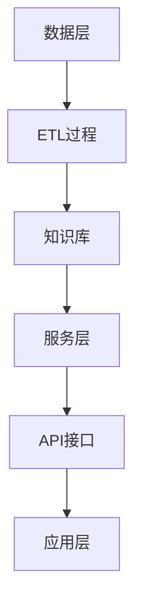

                 

在当今高度竞争的电商市场中，有效的搜索推荐系统已经成为电商企业获取用户、提高转化率和增强用户粘性的关键因素。随着人工智能技术的快速发展，特别是大型预训练模型（AI大模型）的广泛应用，电商搜索推荐系统的性能得到了显著提升。本文将探讨如何从AI大模型的视角，搭建一个技术创新的知识库管理平台，以提升电商搜索推荐的效果。

> 关键词：AI大模型、电商搜索推荐、知识库管理、技术创新、数据分析

> 摘要：本文首先介绍了电商搜索推荐系统的重要性以及AI大模型的发展背景。随后，探讨了知识库管理平台的设计原则和核心架构，重点介绍了基于AI大模型的推荐算法原理及其实现步骤。文章还通过数学模型和具体案例，阐述了算法的优缺点以及应用领域。最后，文章提出了未来发展趋势、面临的挑战以及研究展望，为电商企业提供了参考。

## 1. 背景介绍

### 1.1 电商搜索推荐系统的现状

在电商领域，搜索推荐系统是用户发现和选择商品的重要途径。传统的搜索推荐系统主要依赖基于关键词的匹配和协同过滤等方法。这些方法在一定程度上能够满足用户的需求，但随着用户个性化需求的不断增长，以及商品种类和用户数据的爆炸式增长，传统方法在推荐效果和响应速度上面临着巨大的挑战。

### 1.2 AI大模型的发展

随着深度学习和大数据技术的进步，AI大模型（如BERT、GPT等）取得了显著的成果。这些大模型具有极强的语义理解能力，能够捕捉用户和商品之间的复杂关系，从而提供更精准的推荐。

### 1.3 知识库管理平台的重要性

知识库管理平台作为电商搜索推荐系统的核心组件，负责存储和管理大量与商品和用户相关的知识。通过有效的知识管理，平台能够为推荐系统提供更丰富的数据支持，提升推荐质量。

## 2. 核心概念与联系

### 2.1 知识库管理平台设计原则

- **数据一致性**：确保知识库中的数据准确、完整和一致。
- **可扩展性**：支持知识库的动态扩展，以适应业务需求的变化。
- **实时性**：实现数据的高效更新和实时查询，以满足推荐系统的需求。

### 2.2 核心架构

**2.2.1 数据层**

数据层包括用户数据、商品数据和其他相关数据。这些数据通过ETL（提取、转换、加载）过程加载到知识库中。

**2.2.2 服务层**

服务层提供数据查询、更新和知识融合等功能。通过API接口，服务层与推荐系统和应用层进行交互。

**2.2.3 应用层**

应用层是知识库管理平台的前端，为用户提供数据查询和交互接口。

### 2.3 Mermaid流程图

## 3. 核心算法原理 & 具体操作步骤

### 3.1 算法原理概述

基于AI大模型的推荐算法主要通过预训练模型来学习用户和商品之间的语义关系，从而生成个性化的推荐结果。

### 3.2 算法步骤详解

**3.2.1 用户和商品嵌入**

将用户和商品的属性信息嵌入到高维空间，使得具有相似属性的用户和商品在空间中靠近。

**3.2.2 用户表示学习**

利用预训练模型学习用户的表示，捕捉用户的兴趣和需求。

**3.2.3 商品表示学习**

同理，学习商品的表示，使得具有相似属性的商

